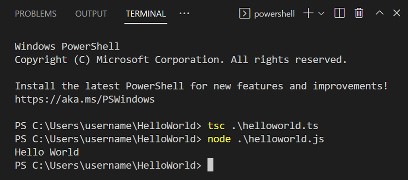
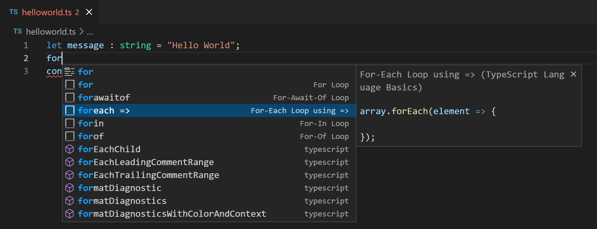
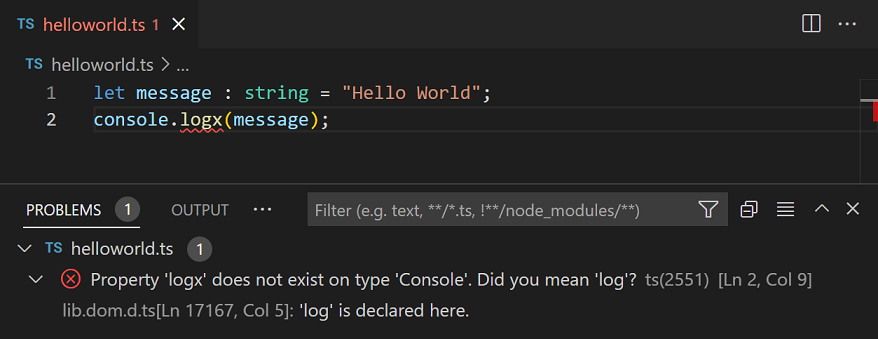
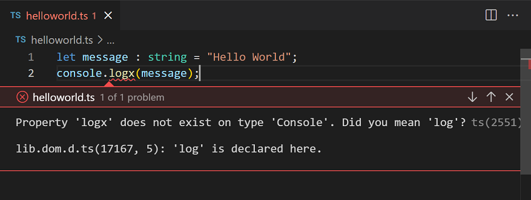

# Visual Studio Code에서의 TypeScript {#typescript-in-visual-studio-code}

[TypeScript](https://www.typescriptlang.org)는 일반 JavaScript로 컴파일되는 타입이 있는 JavaScript의 상위 집합입니다. 클래스, 모듈 및 인터페이스를 제공하여 견고한 구성 요소를 구축하는 데 도움을 줍니다.


## TypeScript 컴파일러 설치하기 {#installing-the-typescript-compiler}

Visual Studio Code는 TypeScript 언어 지원을 포함하지만 TypeScript 컴파일러인 `tsc`는 포함되어 있지 않습니다. TypeScript 소스 코드를 JavaScript로 변환하려면 TypeScript 컴파일러를 전역 또는 작업 공간에 설치해야 합니다 (`tsc HelloWorld.ts`).

TypeScript를 설치하는 가장 쉬운 방법은 npm, 즉 [Node.js 패키지 관리자](https://www.npmjs.com/)를 사용하는 것입니다. npm이 설치되어 있다면, 다음 명령어로 TypeScript를 전역(`-g`)으로 설치할 수 있습니다:

```bash
npm install -g typescript
```

설치가 제대로 되었는지 확인하려면 버전을 확인해 보세요.

```bash
tsc --version
```

또 다른 방법은 프로젝트에 TypeScript 컴파일러를 로컬로 설치하는 것입니다 (`npm install --save-dev typescript`). 이렇게 하면 다른 TypeScript 프로젝트와의 상호작용을 피할 수 있는 장점이 있습니다.

## 헬로 월드 {#hello-world}

간단한 헬로 월드 Node.js 예제로 시작해 보겠습니다. 새로운 폴더 `HelloWorld`를 만들고 VS Code를 실행하세요.

```bash
mkdir HelloWorld
cd HelloWorld
code .
```

파일 탐색기에서 `helloworld.ts`라는 새 파일을 만듭니다.


이제 다음 TypeScript 코드를 추가하세요. TypeScript 키워드 `let`과 `string` 타입 선언이 보일 것입니다.

```typescript
let message : string = "Hello World";
console.log(message);
```

TypeScript 코드를 컴파일하려면 [통합 터미널](/docs/terminal/basics.md) (`kb(workbench.action.terminal.toggleTerminal)`)을 열고 `tsc helloworld.ts`를 입력하세요. 이렇게 하면 컴파일이 진행되고 새로운 `helloworld.js` JavaScript 파일이 생성됩니다.


Node.js가 설치되어 있다면 `node helloworld.js`를 실행할 수 있습니다.



`helloworld.js`를 열어보면 `helloworld.ts`와 크게 다르지 않다는 것을 알 수 있습니다. 타입 정보가 제거되었고 `let`은 이제 `var`로 변경되었습니다.

```javascript
var message = "Hello World";
console.log(message);
```

## 인텔리센스 {#intellisense}

인텔리센스는 지능형 코드 완성, 호버 정보 및 서명 도움을 제공하여 더 빠르고 정확하게 코드를 작성할 수 있도록 도와줍니다.


VS Code는 개별 TypeScript 파일과 TypeScript `tsconfig.json` 프로젝트에 대해 인텔리센스를 제공합니다.

### 호버 정보 {#hover-information}

TypeScript 기호 위에 마우스를 올리면 해당 기호의 타입 정보와 관련 문서를 빠르게 확인할 수 있습니다:


현재 커서 위치에서 호버 정보를 표시하려면 `kb(editor.action.showHover)` 키보드 단축키를 사용할 수 있습니다.

### 서명 도움 {#signature-help}

TypeScript 함수 호출을 작성할 때, VS Code는 함수 서명에 대한 정보를 보여주고 현재 완성 중인 매개변수를 강조 표시합니다:


서명 도움은 함수 호출 내에서 `(` 또는 `,`를 입력할 때 자동으로 표시됩니다. `kb(editor.action.triggerParameterHints)`를 사용하여 수동으로 서명 도움을 트리거할 수 있습니다.

## 스니펫 {#snippets}

스마트 코드 완성 외에도 VS Code는 기본 TypeScript [스니펫](/docs/editor/userdefinedsnippets.md)을 포함하고 있으며, 입력하는 동안 제안됩니다.



추가 스니펫을 얻거나 TypeScript용 스니펫을 정의하려면 확장을 설치할 수 있습니다. 자세한 내용은 [사용자 정의 스니펫](/docs/editor/userdefinedsnippets.md)을 참조하세요.

> **팁**: `setting(editor.snippetSuggestions)`를 `"none"`으로 설정하여 스니펫을 비활성화할 수 있습니다. 스니펫을 보고 싶다면 제안에 대한 상대적 순서를 지정할 수 있습니다; 맨 위(`"top"`), 맨 아래(`"bottom"`), 또는 알파벳 순으로 인라인 정렬(`"inline"`)할 수 있습니다. 기본값은 `"inline"`입니다.

## 오류 및 경고 {#errors-and-warnings}

TypeScript 언어 서비스는 코드 문제를 분석하고 오류 및 경고를 보고합니다:

* 상태 표시줄에는 모든 오류 및 경고 수의 요약이 표시됩니다.
* 요약을 클릭하거나 `kb(workbench.actions.view.problems)`를 눌러 현재 오류 목록이 포함된 **문제** 패널을 표시할 수 있습니다.
* 오류나 경고가 있는 파일을 열면 텍스트와 개요 눈금자에 인라인으로 표시됩니다.



현재 파일의 오류나 경고를 순회하려면 `kb(editor.action.marker.nextInFiles)` 또는 `kb(editor.action.marker.prevInFiles)`를 눌러 문제 및 가능한 코드 작업(사용 가능한 경우)을 자세히 설명하는 인라인 영역을 표시할 수 있습니다:



## 코드 탐색 {#code-navigation}

코드 탐색을 통해 TypeScript 프로젝트를 빠르게 탐색할 수 있습니다.

* **정의로 이동** `kb(editor.action.revealDefinition)` - 기호 정의의 소스 코드로 이동합니다.
* **정의 미리보기** `kb(editor.action.peekDefinition)` - 기호의 정의를 보여주는 미리보기 창을 엽니다.
* **참조로 이동** `kb(editor.action.goToReferences)` - 기호에 대한 모든 참조를 표시합니다.
* **타입 정의로 이동** - 기호를 정의하는 타입으로 이동합니다. 클래스의 인스턴스에 대해 이 작업은 인스턴스가 정의된 위치가 아니라 클래스 자체를 표시합니다.
* **구현으로 이동** `kb(editor.action.goToImplementation)` - 인터페이스 또는 추상 메서드의 구현으로 이동합니다.

**명령 팔레트**(`kb(workbench.action.showCommands)`)에서 **기호로 이동** 명령을 사용하여 기호 검색을 통해 탐색할 수 있습니다.

* **파일 내 기호로 이동** `kb(workbench.action.gotoSymbol)`
* **작업 공간 내 기호로 이동** `kb(workbench.action.showAllSymbols)`

## 포맷팅 {#formatting}

VS Code에는 기본 코드 포맷팅을 제공하는 TypeScript 포맷터가 포함되어 있습니다.

`typescript.format.*` [설정](/docs/editor/settings.md)을 사용하여 중괄호가 별도의 줄에 나타나도록 하는 등 내장 포맷터를 구성할 수 있습니다. 또는 내장 포맷터가 방해가 된다면 `"typescript.format.enable"`을 `false`로 설정하여 비활성화할 수 있습니다.

보다 전문화된 코드 포맷팅 스타일을 원한다면 VS Code 마켓플레이스에서 포맷팅 확장을 설치해 보세요.

## 리팩토링 {#refactoring}

VS Code에는 TypeScript에 대한 유용한 리팩토링 기능이 포함되어 있습니다. 예를 들어 **함수 추출** 및 **상수 추출**이 있습니다. 추출할 소스 코드를 선택한 다음, 거터의 전구 아이콘을 클릭하거나 (`kb(editor.action.quickFix)`)를 눌러 사용 가능한 리팩토링을 확인할 수 있습니다.


리팩토링 및 개별 리팩토링에 대한 키보드 단축키를 구성하는 방법에 대한 자세한 내용은 [TypeScript 리팩토링](/docs/typescript/typescript-refactoring.md)을 참조하세요.

### 이름 바꾸기 {#rename}

가장 간단한 리팩토링 중 하나는 메서드나 변수를 이름 바꾸는 것입니다. `kb(editor.action.rename)`를 눌러 커서 아래의 기호를 TypeScript 프로젝트 전반에 걸쳐 이름을 바꿀 수 있습니다:


## 디버깅 {#debugging}

VS Code는 TypeScript에 대한 훌륭한 디버깅 지원을 제공하며, 소스 맵도 지원합니다. 중단점을 설정하고, 객체를 검사하고, 호출 스택을 탐색하고, 디버그 콘솔에서 코드를 실행할 수 있습니다. TypeScript 디버깅에 대한 자세한 내용은 [TypeScript 디버깅](/docs/typescript/typescript-debugging.md) 및 전체 [디버깅 주제](/docs/editor/debugging.md)를 참조하세요.

### 클라이언트 측 디버깅 {#debug-client-side}

브라우저 디버거(예: [내장 Edge 및 Chrome 디버거](/docs/nodejs/browser-debugging.md) 또는 [Firefox 디버거](https://marketplace.visualstudio.com/items?itemName=hbenl.vscode-firefox-debug))를 사용하여 클라이언트 측 코드를 디버깅할 수 있습니다.

### 서버 측 디버깅 {#debug-server-side}

VS Code의 내장 디버거를 사용하여 Node.js를 디버깅할 수 있습니다. 설정이 간단하며, [Node.js 디버깅 튜토리얼](/docs/nodejs/nodejs-tutorial.md#debug-your-express-app)이 도움이 될 것입니다.


## 린터 {#linters}

[린터](https://en.wikipedia.org/wiki/Lint_%28software%29)는 의심스러운 코드에 대한 경고를 제공합니다. VS Code에는 내장 TypeScript 린터가 포함되어 있지 않지만, 마켓플레이스에서 사용할 수 있는 TypeScript 린터 [확장](/docs/editor/extension-marketplace.md)이 있습니다.

[ESLint](https://eslint.org)는 TypeScript를 지원하는 인기 있는 린터입니다. [ESLint 확장](https://marketplace.visualstudio.com/items?itemName=dbaeumer.vscode-eslint)은 ESLint를 VS Code에 통합하여 편집기 내에서 린팅 오류를 바로 확인하고 [빠른 수정](/docs/typescript/typescript-refactoring.md#quick-fixes)으로 많은 오류를 신속하게 수정할 수 있습니다. [ESLint 플러그인 가이드](https://github.com/typescript-eslint/typescript-eslint/tree/main/packages/eslint-plugin#readme)에서는 TypeScript 프로젝트에 ESLint를 구성하는 방법에 대해 자세히 설명합니다.

## TypeScript 확장 {#typescript-extensions}

VS Code는 기본적으로 TypeScript에 대한 많은 기능을 제공합니다. 내장된 기능 외에도 더 많은 기능을 위해 확장을 설치할 수 있습니다.

<div class="marketplace-extensions-typescript-curated"></div>

> 팁: 위의 확장 타일을 클릭하여 설명 및 리뷰를 읽고 어떤 확장이 가장 적합한지 결정하세요. [마켓플레이스](https://marketplace.visualstudio.com)에서 더 많은 정보를 확인하세요.

## 다음 단계 {#next-steps}

자세한 내용을 보려면 다음을 참조하세요:

* [TypeScript 튜토리얼](/docs/typescript/typescript-tutorial.md) - VS Code에서 간단한 헬로 월드 TypeScript를 생성합니다.
* [TypeScript 편집하기](/docs/typescript/typescript-editing.md) - TypeScript에 대한 특정 편집 기능.
* [TypeScript 리팩토링](/docs/typescript/typescript-refactoring.md) - TypeScript 언어 서비스의 유용한 리팩토링.
* [TypeScript 컴파일하기](/docs/typescript/typescript-compiling.md) - TypeScript를 JavaScript 대상 버전으로 컴파일합니다.
* [TypeScript 디버깅](/docs/typescript/typescript-debugging.md) - VS Code를 사용하여 서버 및 클라이언트 측에서 TypeScript 디버깅에 대해 알아보세요.

## 자주 묻는 질문 {#common-questions}

### VS 2022와 함께 제공되는 TypeScript 버전을 사용할 수 있나요? {#can-i-use-the-version-of-typescript-that-ships-with-vs-2022}

아니요, Visual Studio 2019 및 2022와 함께 제공되는 TypeScript 언어 서비스는 VS Code와 호환되지 않습니다. [npm](https://www.npmjs.com/package/typescript)에서 별도의 TypeScript 버전을 설치해야 합니다.

### VS Code에서 최신 TypeScript 베타를 어떻게 사용할 수 있나요? {#how-can-i-use-the-latest-typescript-beta-with-vs-code}

VS Code에서 최신 TypeScript 기능을 시도하는 가장 간단한 방법은 [JavaScript 및 TypeScript 나이틀리 확장](https://marketplace.visualstudio.com/items?itemName=ms-vscode.vscode-typescript-next)을 설치하는 것입니다.

또한 [VS Code에서 특정 TypeScript 버전을 사용하도록 구성할 수 있습니다](/docs/typescript/typescript-compiling.md#using-newer-typescript-versions).