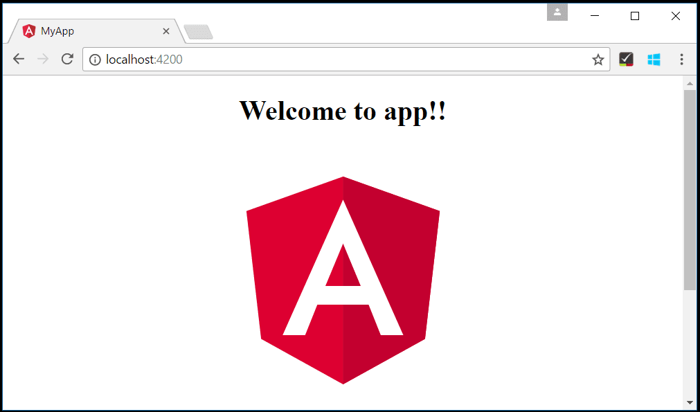
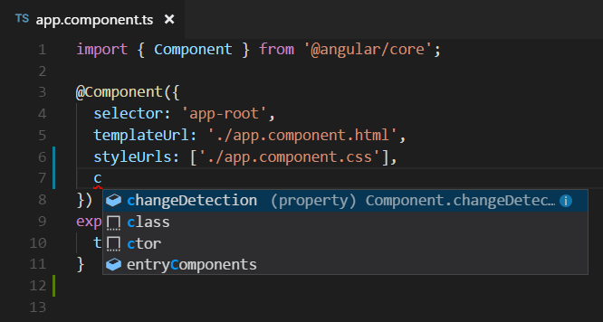
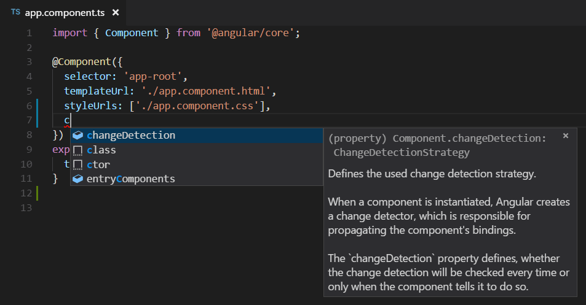
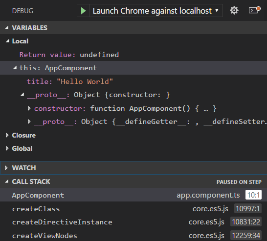

# Visual Studio Code에서 Angular 사용하기 {#using-angular-in-visual-studio-code}

[Angular](https://angular.io/)는 Google에서 개발하고 유지 관리하는 인기 있는 웹 개발 플랫폼입니다. Angular는 주요 프로그래밍 언어로 [TypeScript](/docs/languages/typescript.md)를 사용합니다. Visual Studio Code 편집기는 TypeScript IntelliSense 및 코드 탐색을 기본적으로 지원하므로 다른 확장을 설치하지 않고도 Angular 개발을 할 수 있습니다.



> **참고**: Angular 개발을 시작하는 데 도움이 되도록 유용한 확장, 설정 및 코드 스니펫이 포함된 [Angular 프로필 템플릿](/docs/editor/profiles.md#angular-profile-template)을 사용할 수 있습니다.

## Angular에 오신 것을 환영합니다 {#welcome-to-angular}

이 튜토리얼에서는 [Angular CLI](https://cli.angular.io/)를 사용할 것입니다. 명령줄 인터페이스를 설치하고 Angular 애플리케이션 서버를 실행하려면 [Node.js](https://nodejs.org/) JavaScript 런타임과 [npm](https://www.npmjs.com/) (Node.js 패키지 관리자)을 설치해야 합니다. npm은 [Node.js 다운로드](https://nodejs.org/en/download/)에서 설치할 수 있는 Node.js에 포함되어 있습니다.

> **팁**: Node.js와 npm이 올바르게 설치되었는지 테스트하려면 `node --version` 및 `npm --version`을 입력할 수 있습니다.

Angular CLI를 설치하려면 터미널 또는 명령 프롬프트에서 다음을 입력하세요:

```bash
npm install -g @angular/cli
```

설치하는 데 몇 분 정도 걸릴 수 있습니다. 이제 다음을 입력하여 새 Angular 애플리케이션을 생성할 수 있습니다:

```bash
ng new my-app
```

`my-app`은 애플리케이션의 폴더 이름입니다. `ng new` 명령은 생성된 애플리케이션에 대한 옵션을 제공합니다. 기본값을 수락하려면 `kbstyle(Enter)` 키를 누르세요. 이 과정에서 Angular 애플리케이션이 [TypeScript](/docs/languages/typescript.md)로 생성되고 종속성이 설치되는 데 몇 분 정도 걸릴 수 있습니다.

새 폴더로 이동하여 `ng serve`를 입력하여 웹 서버를 시작하고 브라우저에서 애플리케이션을 열어 빠르게 Angular 애플리케이션을 실행해 보겠습니다:

```bash
cd my-app
ng serve
```

브라우저에서 [http://localhost:4200](http://localhost:4200)에서 "앱에 오신 것을 환영합니다!!"를 볼 수 있어야 합니다. VS Code로 애플리케이션을 살펴보는 동안 웹 서버를 계속 실행해 두겠습니다.

VS Code에서 Angular 애플리케이션을 열려면 다른 터미널(또는 명령 프롬프트)을 열고 `my-app` 폴더로 이동한 후 `code .`를 입력하세요:

```bash
cd my-app
code .
```

### 구문 강조 및 괄호 일치 {#syntax-highlighting-and-bracket-matching}

이제 `src\app` 폴더를 확장하고 `app.component.ts` 파일을 선택하세요. VS Code가 다양한 소스 코드 요소에 대해 구문 강조를 제공하며, 괄호 위에 커서를 올리면 일치하는 괄호도 선택된다는 것을 알 수 있습니다.


### IntelliSense {#intellisense}

파일 내 텍스트 위에 마우스를 올리면 VS Code가 소스 코드의 주요 항목에 대한 정보를 제공합니다. 변수, 클래스 및 Angular 데코레이터와 같은 항목이 이 정보를 제공받는 몇 가지 예입니다.


`app.component.ts`에서 입력을 시작하면 스마트 제안 및 코드 스니펫을 볼 수 있습니다.



정보 버튼(`i`)를 클릭하면 더 많은 문서가 포함된 플라이아웃을 볼 수 있습니다.



VS Code는 코드 인텔리전스를 위해 TypeScript 언어 서비스를 사용하며 ([IntelliSense](/docs/editor/intellisense.md)) [자동 타입 획득](/docs/nodejs/working-with-javascript.md#typings-and-automatic-type-acquisition) (ATA)라는 기능이 있습니다. ATA는 `package.json`에 참조된 npm 모듈에 대한 npm 타입 선언 파일(`*.d.ts`)을 다운로드합니다.

### 정의로 이동, 정의 미리 보기 {#go-to-definition-peek-definition}

TypeScript 언어 서비스를 통해 VS Code는 **정의로 이동** (`kb(editor.action.revealDefinition)`) 또는 **정의 미리 보기** (`kb(editor.action.peekDefinition)`)를 통해 편집기에서 타입 정의 정보를 제공할 수 있습니다. `app.module.ts` 파일을 열고 `bootstrap` 속성 선언의 `AppComponent` 위에 커서를 두고 마우스 오른쪽 버튼을 클릭한 후 **정의 미리 보기**를 선택하세요. 그러면 `app.component.ts`에서 `AppComponent` 정의를 보여주는 [미리 보기 창](/docs/editor/editingevolved.md#peek)이 열립니다.


`kbstyle(Escape)`를 눌러 미리 보기 창을 닫습니다.

## Hello World {#hello-world}

샘플 애플리케이션을 "Hello World"로 업데이트해 보겠습니다. `app.component.ts` 파일로 돌아가서 `AppComponent`의 `title` 문자열을 "Hello World"로 변경하세요.

```ts
import { Component } from "@angular/core";

@Component({
  selector: "app-root",
  templateUrl: "./app.component.html",
  styleUrls: ["./app.component.css"],
})
export class AppComponent {
  title = "Hello World";
}
```

`app.component.ts` 파일을 저장하면 서버의 실행 인스턴스가 웹 페이지를 업데이트하고 "Welcome to Hello World!!"를 볼 수 있습니다.

> **팁**: VS Code는 기본적으로 지연 후 파일을 저장하는 자동 저장을 지원합니다. 자동 저장을 켜려면 **파일** 메뉴에서 **자동 저장** 옵션을 확인하거나 `files.autoSave` 사용자 [설정](/docs/editor/settings.md)을 직접 구성하세요.


## Angular 디버깅 {#debugging-angular}

클라이언트 측 Angular 코드를 디버깅하기 위해 내장된 JavaScript 디버거를 사용할 것입니다.

> 참고: 이 튜토리얼은 Edge 브라우저가 설치되어 있다고 가정합니다. Chrome을 사용하여 디버깅하려면 launch `type`을 `chrome`으로 변경하세요. [Firefox](https://marketplace.visualstudio.com/items?itemName=hbenl.vscode-firefox-debug) 브라우저용 디버거도 있습니다.

### 중단점 설정 {#set-a-breakpoint}

`app.component.ts`에서 중단점을 설정하려면 줄 번호 왼쪽의 여백을 클릭하세요. 그러면 빨간 원으로 표시되는 중단점이 설정됩니다.


### 디버거 구성 {#configure-the-debugger}

우리는 처음에 [디버거](/docs/editor/debugging.md)를 구성해야 합니다. 그렇게 하려면 **실행 및 디버그** 뷰 (`kb(workbench.view.debug)`)로 이동하여 **launch.json 파일 만들기** 링크를 선택하여 `launch.json` 디버거 구성 파일을 만드세요. **디버거 선택** 드롭다운 목록에서 **Web App (Edge)**를 선택합니다. 그러면 웹사이트를 시작하기 위한 구성이 포함된 `launch.json` 파일이 프로젝트의 새 `.vscode` 폴더에 생성됩니다.

예제를 위해 한 가지 변경이 필요합니다: `url`의 포트를 `8080`에서 `4200`으로 변경하세요. `launch.json`은 다음과 같아야 합니다:

```json
{
    "version": "0.2.0",
    "configurations": [
        {
            "type": "msedge",
            "request": "launch",
            "name": "Launch Edge against localhost",
            "url": "http://localhost:4200",
            "webRoot": "$\{workspaceFolder\}
"
        }
    ]
}
```

`kb(workbench.action.debug.start)` 또는 녹색 화살표를 눌러 디버거를 시작하고 새 브라우저 인스턴스를 엽니다. 중단점이 설정된 소스 코드는 디버거가 연결되기 전에 시작 시 실행되므로 웹 페이지를 새로 고치기 전까지는 중단점에 도달하지 않습니다. 페이지를 새로 고치면 중단점에 도달할 수 있습니다.


소스 코드를 단계별로 실행할 수 있으며 (`kb(workbench.action.debug.stepOver)`), `AppComponent`와 같은 변수를 검사하고 클라이언트 측 Angular 애플리케이션의 호출 스택을 볼 수 있습니다.



디버거 및 사용 가능한 옵션에 대한 자세한 내용은 [브라우저 디버깅](/docs/nodejs/browser-debugging.md) 문서를 참조하세요.

## Angular 프로필 템플릿 {#angular-profile-template}

[프로필](https://code.visualstudio.com/docs/editor/profiles)은 현재 프로젝트나 작업에 따라 확장, 설정 및 UI 레이아웃을 빠르게 전환할 수 있게 해줍니다. Angular 개발을 시작하는 데 도움이 되도록 유용한 확장 및 설정이 포함된 [Angular 프로필 템플릿](/docs/editor/profiles.md#angular-profile-template)을 사용할 수 있습니다. 프로필 템플릿을 그대로 사용하거나 자신의 워크플로우에 맞게 추가로 사용자화하는 출발점으로 사용할 수 있습니다.

**프로필** > **프로필 만들기...** 드롭다운을 통해 프로필 템플릿을 선택할 수 있습니다:


프로필 템플릿을 선택하면 설정 및 확장을 검토하고 새 프로필에 포함하고 싶지 않은 개별 항목을 제거할 수 있습니다. 템플릿을 기반으로 새 프로필을 만든 후 설정, 확장 또는 UI에 대한 변경 사항은 프로필에 유지됩니다.

## 인기 있는 스타터 키트 {#popular-starter-kits}

이 튜토리얼에서는 Angular CLI를 사용하여 간단한 Angular 애플리케이션을 만들었습니다. 첫 번째 Angular 애플리케이션을 구축하는 데 도움이 되는 훌륭한 샘플 및 스타터 키트가 많이 있습니다.

### 레시피 {#recipes}

VS Code 팀은 더 복잡한 디버깅 시나리오를 위한 [레시피](https://github.com/microsoft/vscode-recipes)를 만들었습니다. 그곳에서 Angular CLI를 사용하여 생성된 프로젝트의 단위 테스트를 디버깅하는 방법에 대한 자세한 내용을 다룬 [Angular CLI로 디버깅](https://github.com/microsoft/vscode-recipes/tree/main/Angular-CLI) 레시피를 찾을 수 있습니다.

### MEAN 스타터 {#mean-starter}

전체 MEAN (MongoDB, Express, Angular, Node.js) 스택 예제를 보고 싶다면 [MEAN.JS](https://meanjs.org)를 확인하세요. 그들은 샘플 MEAN 프로젝트를 위한 문서와 애플리케이션 생성기를 제공합니다. [MongoDB](https://docs.mongodb.com/v3.0/installation/)를 설치하고 시작해야 하지만, 빠르게 MEAN 애플리케이션을 실행할 수 있습니다. VS Code는 [Azure Databases](https://marketplace.visualstudio.com/items?itemName=ms-azuretools.vscode-cosmosdb) 확장을 통해 훌륭한 [MongoDB 지원](/docs/azure/mongodb.md)을 제공합니다.

### React {#react}

[React](https://reactjs.org)는 사용자 인터페이스를 구축하기 위한 라이브러리로, Angular보다 더 최소화되어 있습니다. VS Code와 함께 작동하는 React의 예제를 보고 싶다면 [VS Code에서 React 사용하기](/docs/nodejs/reactjs-tutorial.md) 튜토리얼을 확인하세요. 이 튜토리얼은 React 애플리케이션을 생성하고 JavaScript 디버거를 위한 `launch.json` 파일을 구성하는 방법을 안내합니다.

## Angular 확장 {#angular-extensions}

VS Code가 기본적으로 제공하는 기능 외에도 더 많은 기능을 위해 VS Code 확장을 설치할 수 있습니다.

<div class="marketplace-extensions-angular-curated"></div>

위의 확장 타일을 클릭하여 [마켓플레이스](https://marketplace.visualstudio.com)에서 설명 및 리뷰를 읽어보세요.

다른 Angular 확장을 찾으려면 확장 뷰 (`kb(workbench.view.extensions)`)를 열고 'angular'를 입력하여 필터링된 Angular 확장 목록을 확인하세요.


커뮤니티에서도 유용한 확장을 함께 묶은 "확장 팩"을 만들었습니다 (예: 린터, 디버거 및 스니펫). 사용 가능한 Angular 확장 팩을 보려면 필터에 "확장 팩" 카테고리를 추가하세요 (angular @category:"extension packs").
---