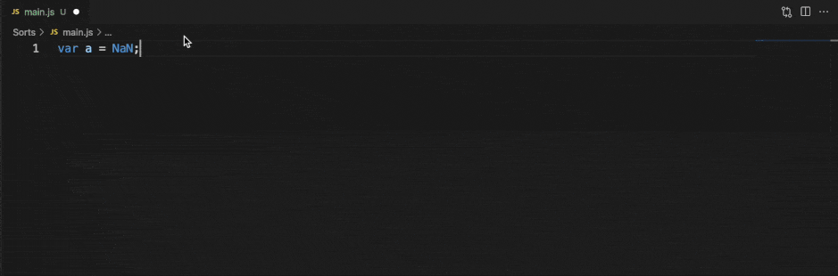

# VS Code용 JavaScript 확장 프로그램 {#javascript-extensions-for-vscode}

Visual Studio Code는 JavaScript 및 Node.js 개발을 위한 많은 기능을 지원합니다. 다운로드한 제품에 포함된 기능은 디버깅, IntelliSense, 코드 탐색 등과 같은 핵심 기능입니다.

이러한 핵심 기능 외에도 JavaScript 개발을 위해 VS Code에 기능을 추가할 수 있는 다양한 품질의 확장 프로그램을 설치할 수 있습니다.

:::tip
확장 프로그램을 설치하고 관리하는 방법은 [확장 프로그램 문서](/docs/editor/extension-marketplace.md)를 참조하세요.
:::

## 확장 프로그램 찾기 {#finding-extensions}

확장 프로그램 보기의 검색창에 `JavaScript`를 입력하여 JavaScript 확장 프로그램을 찾을 수 있습니다. 또는 태그를 사용하여 JavaScript 확장 프로그램을 찾을 수 있습니다: "tag:javascript". VS Code 또는 [마켓플레이스](https://marketplace.visualstudio.com/vscode)에서 더 많은 확장 프로그램을 검색하세요.

또한 `Node.js` 확장 프로그램을 검색할 수 있습니다.

:::tip
위에 표시된 확장 프로그램은 실시간으로 업데이트됩니다. 위의 확장 프로그램 타일을 클릭하여 설명과 리뷰를 읽고 어떤 확장 프로그램이 가장 적합한지 결정하세요. [마켓플레이스](https://marketplace.visualstudio.com/vscode)에서 더 많은 정보를 확인하세요.
:::

## 추천 확장 프로그램 {#recommended-extensions}

이제 막 시작하는 경우, 다음은 시도해 볼 것을 추천하는 확장 프로그램입니다.

### ESLint {#eslint}

마켓플레이스 - [ESLint](https://marketplace.visualstudio.com/items?itemName=dbaeumer.vscode-eslint)

발행자 - [Microsoft](https://marketplace.visualstudio.com/publishers/Microsoft)

프로젝트에 [ESLint](https://eslint.org/)를 쉽게 통합할 수 있습니다. ESLint가 마음에 들지 않는 경우, [JSHint](https://marketplace.visualstudio.com/items?itemName=dbaeumer.jshint), [JSCS](https://marketplace.visualstudio.com/items?itemName=ms-vscode.jscs), [JS Standard](https://marketplace.visualstudio.com/items?itemName=chenxsan.vscode-standardjs) 등 다양한 다른 린터 확장 프로그램 중에서 선택할 수 있습니다.

VS Code [문서](/docs/languages/javascript.md#linters)에서 JavaScript 린터 설정에 대한 자세한 내용을 읽어보세요.

### SonarLint {#sonarlint}

마켓플레이스 - [SonarLint](https://marketplace.visualstudio.com/items?itemName=SonarSource.sonarlint-vscode)

발행자 - [SonarSource](https://marketplace.visualstudio.com/publishers/SonarSource)

SonarLint는 코딩 중 버그와 보안 문제를 찾아 수정하는 데 도움을 줍니다. 이 확장 프로그램은 백그라운드에서 실행되며, 맞춤법 검사기처럼 코딩 문제를 강조 표시합니다. SonarLint는 문제의 원인뿐만 아니라 문제의 해로운 이유와 해결 방법에 대한 맥락 내 지침을 제공하며, 관련 예제를 포함합니다. 이 확장 프로그램은 [200개 이상의 JS/TS 규칙](https://rules.sonarsource.com/javascript)을 지원하며, 코딩 문제를 자동으로 처리하는 여러 [빠른 수정](https://rules.sonarsource.com/javascript/quickfix)을 포함합니다.

VS Code 마켓플레이스에서 'SonarLint'를 검색하고 설치하세요. 별도의 구성은 필요하지 않습니다. 대부분의 사용자에게 적합한 기본 프로필로 시작하고 필요에 따라 사용자 정의할 수 있습니다.

### JavaScript (ES6) 코드 스니펫 {#javascript-es6-code-snippets}

마켓플레이스 - [JavaScript (ES6) 코드 스니펫](https://marketplace.visualstudio.com/items?itemName=xabikos.JavaScriptSnippets)

발행자 - [charalampos karypidis](https://marketplace.visualstudio.com/search?term=publisher%3A%22charalampos%20karypidis%22&target=VSCode)

VS Code는 많은 내장 코드 스니펫을 제공합니다. **JavaScript (ES6) 코드 스니펫** 확장 프로그램은 ES6(ECMAScript 6) 구문에 대한 스니펫을 추가합니다. 이 확장 프로그램에서 제공하는 스니펫의 작은 샘플은 다음과 같습니다. 이 패키지가 제공하는 수십 개의 스니펫을 보려면 확장 프로그램의 [README](https://marketplace.visualstudio.com/items?itemName=xabikos.JavaScriptSnippets)를 참조하세요.

VS Code [문서](/docs/languages/javascript.md#snippets)에서 JavaScript 스니펫에 대한 자세한 내용을 읽을 수 있습니다. [Angular 1](https://marketplace.visualstudio.com/items?itemName=johnpapa.Angular1), [Angular 2](https://marketplace.visualstudio.com/items?itemName=johnpapa.Angular2), [Bootstrap 3](https://marketplace.visualstudio.com/items?itemName=wcwhitehead.bootstrap-3-snippets), [ReactJs](https://marketplace.visualstudio.com/items?itemName=xabikos.ReactSnippets), [jQuery](https://marketplace.visualstudio.com/items?itemName=donjayamanne.jquerysnippets) 등 추가 스니펫 패키지를 보려면 마켓플레이스의 [스니펫 카테고리](https://marketplace.visualstudio.com/vscode/Snippets?sortBy=Installs)를 확인하세요.

### npm IntelliSense {#npm-intellisense}

마켓플레이스 - [npm IntelliSense](https://marketplace.visualstudio.com/items?itemName=christian-kohler.npm-intellisense)

발행자 - [Christian Kohler](https://marketplace.visualstudio.com/search?term=publisher%3A%22Christian%20Kohler%22&target=VSCode)

이 확장 프로그램은 `import` 또는 `require`를 사용할 때 npm 모듈에 대한 IntelliSense를 제공합니다.

