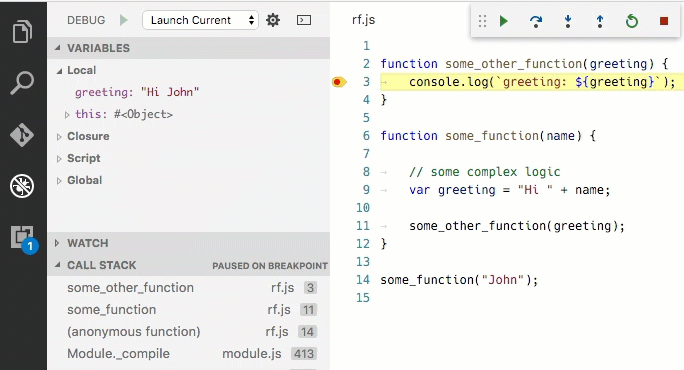
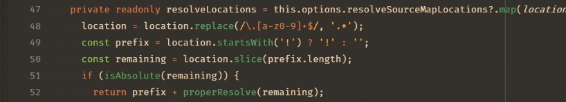
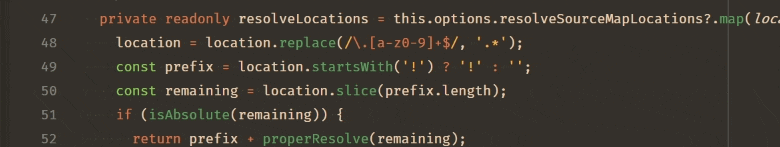
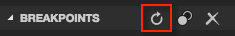

# VS Code에서 Node.js 디버깅 {#nodejs-debugging-in-vs-code}

Visual Studio Code 편집기에는 [Node.js](https://nodejs.org/) 런타임에 대한 내장 디버깅 지원이 있으며, JavaScript, TypeScript 및 JavaScript로 변환되는 많은 다른 언어를 디버깅할 수 있습니다. Node.js 디버깅을 위한 프로젝트 설정은 VS Code가 적절한 시작 구성 기본값과 스니펫을 제공하므로 간단합니다.

VS Code에서 Node.js 프로그램을 디버깅하는 몇 가지 방법이 있습니다:

- VS Code의 통합 터미널에서 실행하는 프로세스를 디버깅하기 위해 [자동 연결](#auto-attach)을 사용합니다.
- 통합 터미널을 사용하는 것과 유사한 [JavaScript 디버그 터미널](#javascript-debug-terminal)을 사용합니다.
- 프로그램을 시작하기 위해 [시작 구성](#launch-configuration)을 사용하거나, VS Code 외부에서 시작된 프로세스에 [연결](#attaching-to-nodejs)합니다.

## 자동 연결 {#auto-attach}

**자동 연결** 기능이 활성화되면, Node 디버거는 VS Code의 통합 터미널에서 시작된 특정 Node.js 프로세스에 자동으로 연결됩니다. 이 기능을 활성화하려면, 명령 팔레트에서 **자동 연결 전환** 명령을 사용하거나(`kb(workbench.action.showCommands)`), 이미 활성화된 경우 **자동 연결** 상태 표시줄 항목을 사용합니다.

자동 연결에는 세 가지 모드가 있으며, 결과로 나타나는 빠른 선택 메뉴와 **debug.javascript.autoAttachFilter** 설정을 통해 선택할 수 있습니다:

- `smart` - `node_modules` 폴더 외부에서 스크립트를 실행하거나 mocha 또는 ts-node와 같은 일반 '러너' 스크립트를 사용하는 경우, 해당 프로세스가 디버깅됩니다. **자동 연결 스마트 패턴** 설정(`debug.javascript.autoAttachSmartPattern`)을 사용하여 '러너' 스크립트 허용 목록을 구성할 수 있습니다.
- `always` - 통합 터미널에서 시작된 모든 Node.js 프로세스가 디버깅됩니다.
- `onlyWithFlag` - `--inspect` 또는 `--inspect-brk` 플래그로 시작된 프로세스만 디버깅됩니다.

**자동 연결**을 활성화한 후, 터미널의 오른쪽 상단에 있는 ⚠ 아이콘을 클릭하거나 새 터미널을 생성하여 터미널을 다시 시작해야 합니다. 그러면 디버거가 프로그램에 1초 이내에 연결됩니다:


자동 연결이 활성화되면, VS Code 창 하단의 상태 표시줄에 `자동 연결` 항목이 나타납니다. 이를 클릭하면 자동 연결 모드를 변경하거나 일시적으로 끌 수 있습니다. 일시적으로 자동 연결을 끄는 것은 디버깅이 필요 없는 일회성 프로그램을 실행할 때 유용하지만, 기능을 완전히 비활성화하고 싶지는 않을 때 유용합니다.

### 추가 구성 {#additional-configuration}

**기타 시작 구성 속성**

자동 연결에 [launch.json에서 일반적으로 발견되는 기타 속성](#launch-configuration-attributes)을 **debug.javascript.terminalOptions** 설정에 적용할 수 있습니다. 예를 들어, skipFiles에 Node 내부를 추가하려면 사용자 또는 작업 공간 설정에 다음을 추가할 수 있습니다:

```js
  "debug.javascript.terminalOptions": {
    "skipFiles": [
      "<node_internals>/**"
    ]
  },
```

**자동 연결 스마트 패턴**

`smart` 자동 연결 모드에서 VS Code는 코드에 연결을 시도하며, 디버깅에 관심이 없는 빌드 도구에는 연결하지 않습니다. 이는 주요 스크립트를 [글로브 패턴](/docs/editor/glob-patterns.md) 목록과 일치시켜 수행됩니다. 글로브 패턴은 **debug.javascript.autoAttachSmartPattern** 설정에서 구성할 수 있으며, 기본값은 다음과 같습니다:

```js
[
  "!**/node_modules/**", // node_modules 폴더의 스크립트 제외
  "**/$KNOWN_TOOLS$/**", // 그러나 일부 일반 도구 포함
];
```

`$KNOWN_TOOLS$`는 `ts-node`, `mocha`, `ava` 등과 같은 일반 '코드 러너' 목록으로 대체됩니다. 이러한 설정이 작동하지 않는 경우 이 목록을 수정할 수 있습니다. 예를 들어, `mocha`를 제외하고 `my-cool-test-runner`를 포함하려면 두 줄을 추가할 수 있습니다:

```js
[
  "!**/node_modules/**",
  "**/$KNOWN_TOOLS$/**",
  "!**/node_modules/mocha/**", // "!"를 사용하여 "mocha" node 모듈의 모든 스크립트 제외
  "**/node_modules/my-cool-test-runner/**", // 사용자 정의 테스트 러너의 스크립트 포함
];
```

## JavaScript 디버그 터미널 {#javascript-debug-terminal}

[자동 연결](#auto-attach)과 유사하게, JavaScript 디버그 터미널은 그 안에서 실행하는 모든 Node.js 프로세스를 자동으로 디버깅합니다. **Debug: Create JavaScript Debug Terminal** 명령을 명령 팔레트에서 실행(`kbs(workbench.action.showCommands)`)하거나 터미널 전환 드롭다운에서 **JavaScript 디버그 터미널 생성**을 선택하여 디버그 터미널을 생성할 수 있습니다.


### 추가 구성 {#additional-configuration}

**기타 시작 구성 속성**

디버그 터미널에 [launch.json에서 일반적으로 발견되는 기타 속성](#launch-configuration-attributes)을 **debug.javascript.terminalOptions** 설정에 적용할 수 있습니다. 예를 들어, skipFiles에 Node 내부를 추가하려면 사용자 또는 작업 공간 설정에 다음을 추가할 수 있습니다:

```js
"debug.javascript.terminalOptions": {
  "skipFiles": [
    "<node_internals>/**"
  ]
},
```

## 시작 구성 {#launch-configuration}

시작 구성은 VS Code에서 디버깅을 설정하는 전통적인 방법이며, 복잡한 애플리케이션을 실행하기 위한 가장 많은 구성 옵션을 제공합니다.

이 섹션에서는 더 고급 디버깅 시나리오를 위한 구성 및 기능에 대해 자세히 설명합니다. [소스 맵](/docs/nodejs/nodejs-debugging.md#source-maps), [외부 코드 건너뛰기](/docs/nodejs/nodejs-debugging.md#skipping-uninteresting-code), [원격 디버깅](/docs/nodejs/nodejs-debugging.md#remote-debugging) 등으로 디버깅하는 방법에 대한 지침을 찾을 수 있습니다.

소개 비디오를 보고 싶다면 [VS Code에서 디버깅 시작하기](https://www.youtube.com/watch?v=3HiLLByBWkg)를 참조하세요.

> **참고**: VS Code를 처음 사용하는 경우, [디버깅](/docs/editor/debugging.md) 주제에서 일반적인 디버깅 기능과 `launch.json` 구성 파일 생성에 대해 배울 수 있습니다.

## 시작 구성 속성 {#launch-configuration-attributes}

디버깅 구성은 작업 공간의 `.vscode` 폴더에 위치한 `launch.json` 파일에 저장됩니다. 디버깅 구성 파일의 생성 및 사용에 대한 소개는 일반 [디버깅](/docs/editor/debugging-configuration.md#launch-configurations) 기사에서 확인할 수 있습니다.

아래는 Node.js 디버거에 특정한 일반 `launch.json` 속성의 참조입니다. 전체 옵션 세트는 [vscode-js-debug 옵션](https://github.com/microsoft/vscode-js-debug/blob/main/OPTIONS.md) 문서에서 확인할 수 있습니다.

다음 속성은 `launch` 및 `attach` 유형의 시작 구성에서 지원됩니다:

- `outFiles` - 생성된 JavaScript 파일을 찾기 위한 [글로브 패턴](/docs/editor/glob-patterns.md) 배열입니다. [소스 맵](/docs/nodejs/nodejs-debugging.md#source-maps) 섹션을 참조하세요.
- `resolveSourceMapLocations` - 소스 맵이 파싱되어야 하는 위치에 대한 [글로브 패턴](/docs/editor/glob-patterns.md) 배열입니다. [소스 맵](/docs/nodejs/nodejs-debugging.md#source-maps) 섹션을 참조하세요.
- `timeout` - 세션을 재시작할 때, 이 밀리초 수 후에 포기합니다. [Node.js에 연결](/docs/nodejs/nodejs-debugging.md#attaching-to-nodejs) 섹션을 참조하세요.
- `stopOnEntry` - 프로그램이 시작될 때 즉시 중단합니다.
- `localRoot` - VS Code의 루트 디렉터리입니다. 아래 [원격 디버깅](/docs/nodejs/nodejs-debugging.md#remote-debugging) 섹션을 참조하세요.
- `remoteRoot` - Node의 루트 디렉터리입니다. 아래 [원격 디버깅](/docs/nodejs/nodejs-debugging.md#remote-debugging) 섹션을 참조하세요.
- `smartStep` - 소스 파일에 매핑되지 않는 코드를 자동으로 건너뛰도록 시도합니다. 아래 [스마트 스텝](/docs/nodejs/nodejs-debugging.md#smart-stepping) 섹션을 참조하세요.
- `skipFiles` - 이러한 [글로브 패턴](/docs/editor/glob-patterns.md)으로 덮인 파일을 자동으로 건너뜁니다. 아래 [흥미롭지 않은 코드 건너뛰기](/docs/nodejs/nodejs-debugging.md#skipping-uninteresting-code) 섹션을 참조하세요.
- `trace` - 진단 출력을 활성화합니다.

이 속성은 요청 유형이 `launch`인 시작 구성에서만 사용할 수 있습니다:

- `program` - 디버깅할 Node.js 프로그램의 절대 경로입니다.
- `args` - 디버깅할 프로그램에 전달되는 인수입니다. 이 속성은 배열 유형이며 개별 인수를 배열 요소로 기대합니다.
- `cwd` - 디버깅할 프로그램을 이 디렉터리에서 시작합니다.
- `runtimeExecutable` - 사용할 런타임 실행 파일의 절대 경로입니다. 기본값은 `node`입니다. [npm 및 기타 도구에 대한 시작 구성 지원](/docs/nodejs/nodejs-debugging-configuration.md#launch-configuration-support-for-npm-and-other-tools) 섹션을 참조하세요.
- `runtimeArgs` - 런타임 실행 파일에 전달되는 선택적 인수입니다.
- `runtimeVersion` - "[nvm](https://github.com/creationix/nvm)" (또는 "[nvm-windows](https://github.com/coreybutler/nvm-windows)") 또는 "[nvs](https://github.com/jasongin/nvs)"를 사용하여 Node.js 버전을 관리하는 경우, 이 속성을 사용하여 특정 Node.js 버전을 선택할 수 있습니다. 아래 [다중 버전 지원](/docs/nodejs/nodejs-debugging.md#multi-version-support) 섹션을 참조하세요.
- `env` - 선택적 환경 변수입니다. 이 속성은 문자열 유형의 키/값 쌍 목록으로 환경 변수를 기대합니다.
- `envFile` - 환경 변수 정의가 포함된 파일의 선택적 경로입니다. 아래 [외부 파일에서 환경 변수 로드](/docs/nodejs/nodejs-debugging.md#load-environment-variables-from-external-file) 섹션을 참조하세요.
- `console` - 프로그램을 실행할 콘솔(`internalConsole`, `integratedTerminal`, `externalTerminal`). 아래 [Node 콘솔](/docs/nodejs/nodejs-debugging.md#node-console) 섹션을 참조하세요.
- `outputCapture` - `std`로 설정하면, 프로세스 stdout/stderr의 출력이 디버그 콘솔에 표시되며, 디버그 포트를 통해 출력을 수신하지 않습니다. 이는 `console.*` API를 사용하지 않고 stdout/stderr 스트림에 직접 쓰는 프로그램이나 로그 라이브러리에 유용합니다.

이 속성은 요청 유형이 `attach`인 시작 구성에서만 사용할 수 있습니다:

- `restart` - 종료 시 연결을 재시작합니다. 아래 [소스가 편집될 때 디버그 세션 자동 재시작](/docs/nodejs/nodejs-debugging.md#restarting-debug-sessions-automatically-when-source-is-edited) 섹션을 참조하세요.
- `port` - 사용할 디버그 포트입니다. 아래 [Node.js에 연결](/docs/nodejs/nodejs-debugging.md#attaching-to-nodejs) 및 [원격 디버깅](/docs/nodejs/nodejs-debugging.md#remote-debugging) 섹션을 참조하세요.
- `address` - 디버그 포트의 TCP/IP 주소입니다. 아래 [Node.js에 연결](/docs/nodejs/nodejs-debugging.md#attaching-to-nodejs) 및 [원격 디버깅](/docs/nodejs/nodejs-debugging.md#remote-debugging) 섹션을 참조하세요.
- `processId` - 디버거는 USR1 신호를 보낸 후 이 프로세스에 연결하려고 시도합니다. 이 설정을 사용하면 디버그 모드로 시작되지 않은 이미 실행 중인 프로세스에 디버거가 연결할 수 있습니다. `processId` 속성을 사용할 때, 디버그 포트는 Node.js 버전(및 사용된 프로토콜)에 따라 자동으로 결정되며 명시적으로 구성할 수 없습니다. 따라서 `port` 속성을 지정하지 마십시오.
- `continueOnAttach` - 연결할 때 프로세스가 일시 중지된 경우 계속할지 여부입니다. 이 옵션은 `--inspect-brk`로 프로그램을 실행하는 경우 유용합니다.

### 일반 시나리오를 위한 시작 구성 {#launch-configurations-for-common-scenarios}

`launch.json` 파일에서 IntelliSense(`kb(editor.action.triggerSuggest)`)를 트리거하여 일반적으로 사용되는 Node.js 디버깅 시나리오에 대한 시작 구성 스니펫을 볼 수 있습니다.


또한 `launch.json` 편집기 창의 오른쪽 하단에 있는 **구성 추가...** 버튼을 클릭하여 스니펫을 가져올 수 있습니다.


다음 스니펫을 사용할 수 있습니다:

- **프로그램 시작**: 디버그 모드에서 Node.js 프로그램을 시작합니다.
- **npm을 통한 시작**: npm 'debug' 스크립트를 통해 Node.js 프로그램을 시작합니다. `package.json`에 정의된 npm 디버그 스크립트를 시작 구성에서 사용할 수 있습니다. npm 스크립트에서 사용하는 디버그 포트는 스니펫에 지정된 포트와 일치해야 합니다.
- **연결**: 로컬에서 실행 중인 Node.js 프로그램의 디버그 포트에 연결합니다. 디버깅할 Node.js 프로그램이 디버그 모드에서 시작되었는지 확인하고, 사용되는 디버그 포트가 스니펫에 지정된 것과 동일한지 확인합니다.
- **원격 프로그램에 연결**: `address` 속성으로 지정된 호스트에서 실행 중인 Node.js 프로그램의 디버그 포트에 연결합니다. 디버깅할 Node.js 프로그램이 디버그 모드에서 시작되었는지 확인하고, 사용되는 디버그 포트가 스니펫에 지정된 것과 동일한지 확인합니다. VS Code가 작업 공간과 원격 호스트의 파일 시스템 간에 소스 파일을 매핑할 수 있도록 하려면 `localRoot` 및 `remoteRoot` 속성에 대한 올바른 경로를 지정해야 합니다.
- **프로세스 ID로 연결**: 디버깅을 위해 노드 또는 gulp 프로세스를 선택할 수 있는 프로세스 선택기를 엽니다. 이 시작 구성으로 디버그 모드에서 시작되지 않은 노드 또는 gulp 프로세스에 연결할 수도 있습니다.
- **Nodemon 설정**: JavaScript 소스가 변경될 때마다 디버그 세션을 자동으로 다시 시작하기 위해 nodemon을 사용합니다. nodemon이 전역적으로 설치되어 있는지 확인하세요. 디버그 세션을 종료하면 디버깅할 프로그램만 종료되며, nodemon 자체는 종료되지 않습니다. nodemon을 종료하려면 통합 터미널에서 `kbstyle(Ctrl+C)`를 누르세요.
- **Mocha 테스트**: 프로젝트의 `test` 폴더에서 mocha 테스트를 디버깅합니다. 프로젝트의 `node_modules` 폴더에 'mocha'가 설치되어 있는지 확인하세요.
- **Yeoman 생성기**: yeoman 생성기를 디버깅합니다. 스니펫에서 생성기 이름을 지정하라는 메시지가 표시됩니다. 프로젝트의 `node_modules` 폴더에 'yo'가 설치되어 있고, 생성된 프로젝트가 디버깅을 위해 `npm link`를 실행하여 설치되었는지 확인하세요.
- **Gulp 작업**: gulp 작업을 디버깅합니다. 프로젝트의 `node_modules` 폴더에 'gulp'가 설치되어 있는지 확인하세요.
- **Electron 메인**: Electron 애플리케이션의 주요 Node.js 프로세스를 디버깅합니다. 스니펫은 Electron 실행 파일이 작업 공간의 `node_modules/.bin` 디렉터리에 설치되어 있다고 가정합니다.

### Node 콘솔 {#node-console}

기본적으로 Node.js 디버그 세션은 대상을 내부 VS Code 디버그 콘솔에서 시작합니다. 디버그 콘솔은 콘솔에서 입력을 읽어야 하는 프로그램을 지원하지 않으므로, `console` 속성을 `externalTerminal` 또는 `integratedTerminal`로 설정하여 외부 터미널을 활성화하거나 VS Code 통합 터미널을 사용할 수 있습니다. 기본값은 `internalConsole`입니다.

외부 터미널에서는 `terminal.external.windowsExec`, `terminal.external.osxExec`, 및 `terminal.external.linuxExec` 설정을 통해 사용할 터미널 프로그램을 구성할 수 있습니다.

### npm 및 기타 도구에 대한 시작 구성 지원 {#launch-configuration-support-for-npm-and-other-tools}

Node.js 프로그램을 node로 직접 실행하는 대신, 시작 구성에서 'npm' 스크립트나 기타 작업 실행 도구를 직접 사용할 수 있습니다:

- `runtimeExecutable` 속성에 대해 PATH에서 사용할 수 있는 모든 프로그램(예: 'npm', 'mocha', 'gulp' 등)을 사용할 수 있으며, 인수는 `runtimeArgs`를 통해 전달할 수 있습니다.
- npm 스크립트나 기타 도구가 암묵적으로 시작할 프로그램을 지정하는 경우 `program` 속성을 설정할 필요가 없습니다.

'npm' 예제를 살펴보겠습니다. `package.json`에 'debug' 스크립트가 있는 경우, 예를 들어:

```json
  "scripts": {
    "debug": "node myProgram.js"
  },
```

해당하는 시작 구성은 다음과 같이 보일 것입니다:

```json
{
    "name": "npm을 통한 시작",
    "type": "node",
    "request": "launch",
    "cwd": "$\{workspaceFolder\}
",
    "runtimeExecutable": "npm",
    "runtimeArgs": [
        "run-script", "debug"
    ],
}
```

### 다중 버전 지원 {#multi-version-support}

'[nvm](https://github.com/creationix/nvm)' (또는 '[nvm-windows](https://github.com/coreybutler/nvm-windows)')를 사용하여 Node.js 버전을 관리하는 경우, 특정 Node.js 버전을 선택하기 위해 시작 구성에서 `runtimeVersion` 속성을 지정할 수 있습니다:

```json
{
    "type": "node",
    "request": "launch",
    "name": "테스트 시작",
    "runtimeVersion": "14",
    "program": "$\{workspaceFolder\}
/test.js"
}
```

'[nvs](https://github.com/jasongin/nvs)'를 사용하여 Node.js 버전을 관리하는 경우, `runtimeVersion` 속성을 사용하여 특정 버전, 아키텍처 및 Node.js의 맛을 선택할 수 있습니다. 예를 들어:

```json
{
    "type": "node",
    "request": "launch",
    "name": "테스트 시작",
    "runtimeVersion": "chackracore/8.9.4/x64",
    "program": "$\{workspaceFolder\}
/test.js"
}
```

`runtimeVersion` 속성과 함께 사용할 Node.js 버전을 설치해야 하며, 이 기능은 버전을 자동으로 다운로드하고 설치하지 않습니다. 예를 들어, `"runtimeVersion": "7.10.1"`을 시작 구성에 추가할 계획이라면 통합 터미널에서 `nvm install 7.10.1` 또는 `nvs add 7.10.1`과 같은 명령을 실행해야 합니다.

마이너 및 패치 버전을 생략하고 예를 들어 `"runtimeVersion": "14"`로 설정하면, 시스템에 설치된 가장 최근의 `14.x.y` 버전이 사용됩니다.

### 외부 파일에서 환경 변수 로드 {#load-environment-variables-from-external-file}

VS Code Node 디버거는 파일에서 환경 변수를 로드하고 이를 Node.js 런타임에 전달하는 것을 지원합니다. 이 기능을 사용하려면, 시작 구성에 `envFile` 속성을 추가하고 환경 변수가 포함된 파일의 절대 경로를 지정합니다:

```json
   //...
   "envFile": "$\{workspaceFolder\}
/.env",
   "env": { "USER": "john doe" }
   //...
```

`env` 사전에서 지정된 모든 환경 변수는 파일에서 로드된 변수를 덮어씁니다.

다음은 `.env` 파일의 예입니다:

```
USER=doe
PASSWORD=abc123

# 주석 {#a-comment}

# 빈 값: {#an-empty-value}
empty=

# 따옴표로 묶인 문자열에서 확장된 새 줄: {#new-lines-expanded-in-quoted-strings}
lines="foo\nbar"
```

## Node.js에 연결 {#attaching-to-nodejs}

VS Code 디버거를 외부 Node.js 프로그램에 연결하려면, Node.js를 다음과 같이 실행합니다:

```bash
node --inspect program.js
```

또는 프로그램이 실행되지 않고 디버거가 연결될 때까지 기다려야 하는 경우:

```bash
node --inspect-brk program.js
```

디버거를 프로그램에 연결하는 옵션:

- 모든 잠재적 후보 프로세스를 나열하는 "프로세스 선택기"를 열고 하나를 선택하거나
- 모든 구성 옵션을 명시적으로 지정하는 "연결" 구성을 생성한 후 **F5**를 누릅니다.

이 옵션들을 자세히 살펴보겠습니다:

### Node 프로세스에 연결 작업 {#attach-to-node-process-action}

명령 팔레트에서 **Node 프로세스에 연결** 명령(`kb(workbench.action.showCommands)`)을 사용하면 Node.js 디버거에 사용할 수 있는 모든 잠재적 프로세스를 나열하는 빠른 선택 메뉴가 열립니다:


선택기에서 나열된 개별 프로세스는 디버그 포트와 프로세스 ID를 보여줍니다. 목록에서 Node.js 프로세스를 선택하면 Node.js 디버거가 해당 프로세스에 연결하려고 시도합니다.

Node.js 프로세스 외에도 선택기에는 다양한 형태의 `--inspect` 인수로 시작된 다른 프로그램도 표시됩니다. 이를 통해 Electron 또는 VS Code의 도우미 프로세스에 연결할 수 있습니다.

### "연결" 구성 설정 {#setting-up-an-attach-configuration}

이 옵션은 더 많은 작업이 필요하지만, 이전 두 옵션과는 달리 다양한 디버그 구성 옵션을 명시적으로 구성할 수 있습니다.

가장 간단한 "연결" 구성은 다음과 같습니다:

```json
{
  "name": "프로세스에 연결",
  "type": "node",
  "request": "attach",
  "port": 9229
}
```

포트 `9229`는 `--inspect` 및 `--inspect-brk` 옵션의 기본 디버그 포트입니다. 다른 포트를 사용하려면(예: `12345`), 옵션에 `--inspect=12345` 및 `--inspect-brk=12345`를 추가하고 시작 구성의 `port` 속성을 일치하도록 변경합니다.

디버그 모드에서 시작되지 않은 Node.js 프로세스에 연결하려면, Node.js 프로세스의 프로세스 ID를 문자열로 지정하여 수행할 수 있습니다:

```json
{
  "name": "프로세스에 연결",
  "type": "node",
  "request": "attach",
  "processId": "53426"
}
```

시작 구성에서 새 프로세스 ID를 반복해서 입력하지 않도록 하기 위해, Node 디버그는 프로세스 선택기를 여는 명령 변수 `PickProcess`를 지원합니다.

`PickProcess` 변수를 사용하면 시작 구성은 다음과 같습니다:

```json
{
    "name": "프로세스에 연결",
    "type": "node",
    "request": "attach",
    "processId": "$\{command:PickProcess\}
"
}
```

## 디버깅 중지 {#stop-debugging}

**디버그: 중지** 작업(디버그 도구 모음에서 사용 가능하거나 **명령 팔레트**를 통해)으로 디버그 세션을 중지합니다.

디버그 세션이 "연결" 모드에서 시작된 경우(디버그 도구 모음의 빨간 종료 버튼에 "플러그"가 겹쳐져 표시됨), **중지**를 누르면 Node.js 디버거가 디버깅 대상에서 연결을 끊고 계속 실행됩니다.

디버그 세션이 "시작" 모드인 경우, **중지**를 누르면 다음과 같은 작업이 수행됩니다:

1. 처음 **중지**를 누르면, 디버깅 대상에 `SIGINT` 신호를 보내어 정상적으로 종료하도록 요청합니다. 디버깅 대상은 이 신호를 가로채고 필요한 경우 정리한 후 종료할 수 있습니다. 종료 코드에 중단점(또는 문제가 없으면) 없으면, 디버깅 대상과 디버그 세션이 종료됩니다.

2. 그러나 종료 코드에서 디버거가 중단점에 도달하거나 디버깅 대상이 스스로 제대로 종료되지 않으면, 디버그 세션은 종료되지 않습니다. 이 경우, **중지**를 다시 누르면 디버깅 대상과 그 자식 프로세스가 강제로 종료됩니다(`SIGKILL`).

빨간 **중지** 버튼을 눌러도 디버그 세션이 종료되지 않는 경우, 버튼을 다시 눌러 디버깅 대상을 강제로 종료하세요.

Windows에서는 **중지**를 누르면 디버깅 대상과 그 자식 프로세스가 강제로 종료됩니다.

## 소스 맵 {#source-maps}

VS Code의 JavaScript 디버거는 TypeScript 또는 축소/압축된 JavaScript와 같은 변환된 언어의 디버깅을 돕는 소스 맵을 지원합니다. 소스 맵을 사용하면 원본 소스에서 단일 단계로 실행하거나 중단점을 설정할 수 있습니다. 원본 소스에 대한 소스 맵이 없거나 소스 맵이 손상되어 원본과 생성된 JavaScript 간의 매핑이 성공적으로 이루어지지 않으면, 중단점은 확인되지 않은 것으로 표시됩니다(회색 빈 원).

기본값이 `true`인 `sourceMaps` 속성이 소스 맵 기능을 제어합니다. 디버거는 항상 소스 맵을 사용하려고 시도하며(찾을 수 있는 경우), 그 결과로 `program` 속성으로 소스 파일(예: app.ts)을 지정할 수도 있습니다. 어떤 이유로 소스 맵을 비활성화해야 하는 경우, `sourceMaps` 속성을 `false`로 설정할 수 있습니다.

### 도구 구성 {#tool-configuration}

소스 맵이 항상 자동으로 생성되는 것은 아니므로, 변환기를 구성하여 소스 맵을 생성하도록 해야 합니다. 예를 들어:

**TypeScript**

TypeScript의 경우, `--sourceMap`을 `tsc`에 전달하거나 `tsconfig.json` 파일에 `"sourceMap": true`를 추가하여 소스 맵을 활성화할 수 있습니다.

```bash
tsc --sourceMap --outDir bin app.ts
```

**Babel**

Babel의 경우, [sourceMaps](https://babeljs.io/docs/en/options#sourcemaps) 옵션을 `true`로 설정하거나 코드를 컴파일할 때 `--source-maps` 옵션을 전달해야 합니다.

```bash
npx babel script.js --out-file script-compiled.js --source-maps
```

**Webpack**

Webpack에는 [수많은](https://webpack.js.org/configuration/devtool/) 소스 맵 옵션이 있습니다. 최상의 결과를 위해 `webpack.config.js`에서 `devtool: "source-map"` 속성을 설정하는 것을 권장하지만, 다른 설정을 실험하면 빌드 속도가 느려질 수 있습니다.

또한, webpack에서 TypeScript 로더와 같은 추가 컴파일 단계가 있는 경우, 이러한 단계가 소스 맵을 생성하도록 설정되어 있는지 확인해야 합니다. 그렇지 않으면 webpack이 생성하는 소스 맵이 로더에서 컴파일된 코드로 매핑되고, 실제 소스와는 매핑되지 않습니다.

### 소스 맵 발견 {#source-map-discovery}

기본적으로 VS Code는 `node_modules`를 제외한 작업 공간 전체에서 소스 맵을 검색합니다. 대규모 작업 공간에서는 이 검색이 느릴 수 있습니다. `launch.json`에서 `outFiles` 속성을 설정하여 VS Code가 소스 맵을 검색할 위치를 구성할 수 있습니다. 예를 들어, 이 구성은 `bin` 폴더의 `.js` 파일에 대한 소스 맵만 발견합니다:

```json
{
    "version": "0.2.0",
    "configurations": [
        {
            "name": "TypeScript 시작",
            "type": "node",
            "request": "launch",
            "program": "app.ts",
            "outFiles": [ "$\{workspaceFolder\}
/bin/**/*.js" ]
        }
    ]
}
```

`outFiles`는 소스 맵 파일이 아닌 JavaScript 파일과 일치해야 한다는 점에 유의하세요(소스 맵 파일은 `.map`로 끝날 수 있습니다).

### 소스 맵 해상도 {#source-map-resolution}

기본적으로 `outFiles`에 있는 소스 맵만 해상도됩니다. 이 동작은 종속성이 설정한 중단점에 간섭하는 것을 방지하기 위해 사용됩니다. 예를 들어, `src/index.ts` 파일이 있고 종속성이 `webpack:///./src/index.ts`를 참조하는 소스 맵이 있는 경우, 이는 잘못하게도 원본 파일로 해상도되어 놀라운 결과를 초래할 수 있습니다.

이 동작은 `resolveSourceMapLocations` 옵션을 설정하여 구성할 수 있습니다. `null`로 설정하면 모든 소스 맵이 해상도됩니다. 예를 들어, 이 구성은 `node_modules/some-dependency`에 있는 소스 맵도 해상도할 수 있도록 추가합니다:

```js
  "resolveSourceMapLocations": [
    "out/**/*.js",
    "node_modules/some-dependency/**/*.js",
  ]
```

### 스마트 스텝 {#smart-stepping}

시작 구성에서 `smartStep` 속성이 `true`로 설정되면, VS Code는 디버거에서 코드를 단계별로 실행할 때 '흥미롭지 않은 코드'를 자동으로 건너뜁니다. '흥미롭지 않은 코드'는 변환 프로세스에 의해 생성되지만 소스 맵으로 덮이지 않아 원본 소스에 매핑되지 않는 코드입니다. 이 코드는 디버거가 원본 소스 코드와 관심 없는 생성 코드 간에 전환하게 만들기 때문에, 디버거에서 소스 코드를 단계별로 실행할 때 방해가 됩니다. `smartStep`은 소스 맵으로 덮이지 않은 코드를 자동으로 단계별로 실행하여 다시 소스 맵으로 덮인 위치에 도달할 때까지 진행합니다.

스마트 스텝은 TypeScript에서 async/await 다운컴파일과 같은 경우에 특히 유용합니다. 이 경우 컴파일러는 소스 맵으로 덮이지 않은 도우미 코드를 삽입합니다.

`smartStep` 기능은 소스에서 생성된 JavaScript 코드에만 적용되며, 따라서 소스 맵이 있는 경우에만 적용됩니다. 소스가 없는 JavaScript의 경우, 스마트 스텝 옵션은 효과가 없습니다.

### JavaScript 소스 맵 팁 {#javascript-source-map-tips}

소스 맵으로 디버깅할 때 일반적인 문제는 중단점을 설정하면 회색으로 변하는 것입니다. 커서를 그 위에 올리면 `"생성된 코드를 찾을 수 없어 중단점이 무시되었습니다(소스 맵 문제?)"`라는 메시지가 표시됩니다. 이제 어떻게 해야 할까요? 이를 초래할 수 있는 여러 가지 문제가 있습니다. 먼저, Node 디버그 어댑터가 소스 맵을 처리하는 방법에 대한 간단한 설명입니다.

`app.ts`에서 중단점을 설정하면, 디버그 어댑터는 TypeScript 파일의 변환된 버전인 `app.js`의 경로를 알아내야 합니다. 그러나 `.ts` 파일에서 시작하여 이를 알아내는 간단한 방법은 없습니다. 대신, 디버그 어댑터는 `launch.json`의 `outFiles` 속성을 사용하여 모든 변환된 `.js` 파일을 찾고, 이를 소스 맵을 위해 파싱합니다. 소스 맵은 관련된 `.ts` 파일의 위치를 포함합니다.

TypeScript에서 소스 맵을 활성화하여 `app.ts` 파일을 빌드하면, `app.js.map` 파일이 생성되거나, `app.js` 파일의 하단에 base64로 인코딩된 문자열로 소스 맵이 인라인됩니다. 이 맵과 관련된 `.ts` 파일을 찾기 위해, 디버그 어댑터는 소스 맵의 두 속성인 `sources`와 `sourceRoot`를 확인합니다. `sourceRoot`는 선택 사항입니다 - 존재하는 경우, 각 경로에 `sources` 배열의 경로가 추가됩니다. 결과는 `.ts` 파일에 대한 절대 또는 상대 경로의 배열입니다. 상대 경로는 소스 맵을 기준으로 해결됩니다.

마지막으로, 디버그 어댑터는 이 결과 목록에서 `app.ts`의 전체 경로를 검색합니다. 일치하는 항목이 있으면, `app.ts`를 `app.js`에 매핑하는 데 사용할 소스 맵 파일을 찾은 것입니다. 일치하는 항목이 없으면, 중단점을 바인딩할 수 없으며 회색으로 변합니다.

중단점이 회색으로 변할 때 시도해 볼 수 있는 몇 가지 사항은 다음과 같습니다:

- 디버깅 중에 **디버그: 중단점 문제 진단** 명령을 실행합니다. 이 명령은 문제를 해결하는 데 도움이 되는 힌트를 제공하는 도구를 표시합니다(`kb(workbench.action.showCommands)`).
- 소스 맵이 활성화된 상태로 빌드했습니까? `.js.map` 파일이 있거나 `.js` 파일에 인라인 소스 맵이 있는지 확인하세요.
- 소스 맵의 `sourceRoot` 및 `sources` 속성이 올바른가요? 이를 결합하여 `.ts` 파일의 올바른 경로를 얻을 수 있나요?
- 대소문자가 잘못된 경우 VS Code에서 폴더를 열었나요? 예를 들어, 명령줄에서 `code FOO`와 같이 `foo/` 폴더를 열면 소스 맵이 올바르게 해상도되지 않을 수 있습니다.
- Stack Overflow에서 특정 설정에 대한 도움을 검색하거나 GitHub에 문제를 제출해 보세요.
- `debugger` 문을 추가해 보세요. 그곳에서 `.ts` 파일로 중단되지만, 그 지점에서 중단점이 바인딩되지 않으면, 이는 GitHub 문제에 포함할 유용한 정보입니다.

### 소스 맵 경로 재정의 {#overriding-source-map-paths}

디버거는 `sourceMapPathOverrides`를 사용하여 사용자 정의 소스 맵-디스크 경로 매핑을 구현합니다. 대부분의 도구에 대해 좋은 기본값이 설정되어 있지만, 고급 경우에는 이를 사용자 정의해야 할 수 있습니다. 기본 경로 재정의는 다음과 같은 객체 맵입니다:

```js
{
  'webpack:///./~/*': "$\{workspaceFolder\}
/node_modules/*",
  'webpack:////*': '/*',
  'webpack://@?:*/?:*/*': "$\{workspaceFolder\}
/*",
  // 그리고 몇 가지 더 패턴...
}
```

이는 소스 맵의 왼쪽에서 오른쪽으로 경로 또는 URL을 매핑합니다. 패턴 `?:*`는 비탐욕적이며 캡처하지 않는 일치이며, `*`는 탐욕적으로 캡처하는 일치입니다. 그런 다음 디버거는 오른쪽 패턴의 해당 `*`를 소스 맵 경로에서 캡처한 조각으로 대체합니다. 예를 들어, 위의 예에서 마지막 패턴은 `webpack://@my/package/foo/bar`를 `$\{workspaceFolder\}
/foo/bar`로 매핑합니다.

브라우저 디버깅의 경우, 기본 `sourceMapPathOverrides`에서 `workspaceFolder` 대신 `webRoot`가 사용됩니다.

## 원격 디버깅 {#remote-debugging}

> **참고:** VS Code는 이제 보편적인 [원격 개발 기능](/docs/remote/remote-overview.md)을 제공합니다. [원격 개발](https://aka.ms/vscode-remote/download/extension) 확장을 사용하여 원격 시나리오와 컨테이너에서 Node.js 개발은 로컬 설정에서의 Node.js 개발과 다르지 않습니다. **이것이 Node.js 프로그램을 원격으로 디버깅하는 권장 방법입니다**. [시작하기](/docs/remote/remote-overview.md#getting-started) 섹션과 [원격 튜토리얼](/docs/remote/remote-overview.md#remote-tutorials)을 확인하여 더 알아보세요.

원격 개발 확장을 사용하여 Node.js 프로그램을 디버깅할 수 없는 경우, 아래는 로컬 VS Code 인스턴스에서 원격 Node.js 프로그램을 디버깅하는 방법에 대한 가이드입니다.

Node.js 디버거는 다른 머신이나 컨테이너에서 실행 중인 프로세스에 연결하는 원격 디버깅을 지원합니다. `address` 속성을 통해 원격 호스트를 지정합니다. 예를 들어:

```json
{
  "type": "node",
  "request": "attach",
  "name": "원격에 연결",
  "address": "192.168.148.2", // <- 여기 원격 주소
  "port": 9229
}
```

기본적으로 VS Code는 원격 Node.js 폴더에서 디버깅된 소스를 로컬 VS Code로 스트리밍하고 읽기 전용 편집기에 표시합니다. 이 코드를 단계별로 실행할 수 있지만 수정할 수는 없습니다. VS Code가 작업 공간에서 편집 가능한 소스를 대신 열도록 하려면, 원격 및 로컬 위치 간의 매핑을 설정할 수 있습니다. `localRoot` 및 `remoteRoot` 속성을 사용하여 로컬 VS Code 프로젝트와 (원격) Node.js 폴더 간의 경로를 매핑할 수 있습니다. 이는 동일한 시스템에서 로컬로 또는 서로 다른 운영 체제 간에도 작동합니다. 원격 Node.js 폴더에서 로컬 VS Code 경로로 코드 경로를 변환해야 할 때마다, `remoteRoot` 경로가 경로에서 제거되고 `localRoot`로 대체됩니다. 반대로 변환할 때는 `localRoot` 경로가 `remoteRoot`로 대체됩니다.

```json
{
    "type": "node",
    "request": "attach",
    "name": "원격에 연결",
    "address": "디버깅할 프로세스의 TCP/IP 주소",
    "port": 9229,
    "localRoot": "$\{workspaceFolder\}
",
    "remoteRoot": "C:\\Users\\username\\project\\server"
}
```

## 로드된 스크립트에 접근 {#access-loaded-scripts}

### 지침:
- 모든 Markdown 형식을 유지합니다: 헤더(`#`), 목록(`-`, `*`), 코드 블록(```)을 변경하지 않고 그대로 유지합니다.
- 코드 블록 내의 주석은 번역하되, 코드 자체는 번역하지 않습니다.
  - 예시:
    - 영어:
      ```js
      // This function returns a number
      function getNumber() { return 42; }
      ```
    - 한국어:
      ```js
      // 이 함수는 숫자를 반환합니다.
      function getNumber() { return 42; }
      ```
- 가시적인 텍스트만 번역합니다. 링크, 파일 경로 또는 Markdown 구문은 수정하지 않습니다.
- 헤딩(`#`)의 경우, 원본에 ID가 존재하면 번역 후에도 그대로 유지합니다.
  - 예시:  
    - 영어: `## Apple {#apple}`  
    - 한국어: `## 사과 {#apple}` (ID `{#apple}`는 변경되지 않음)
- 번역이 자연스럽게 흐르도록 합니다.  
  - 문장 구조가 자연스러운 한국어 문체에 맞도록 합니다.  
  - 필요에 따라 문장을 결합하거나 재구성하되, 원래 의미는 유지합니다.  
  - 지나치게 문자 그대로 번역하지 않고 적절한 한국어 표현을 사용합니다.  
  - 여러 포인트를 나열할 때는 더 읽기 쉬운 한국어 형식으로 재구성하는 것을 고려합니다.

---
스크립트에서 중단점을 설정해야 하지만 작업 공간의 일부가 아니어서 일반 VS Code 파일 탐색을 통해 쉽게 찾고 열 수 없는 경우, **실행 및 디버그** 보기의 **로드된 스크립트** 뷰를 통해 로드된 스크립트에 접근할 수 있습니다:


**로드된 스크립트** 뷰를 사용하면 스크립트 이름을 입력하거나 **유형에서 필터 활성화**가 켜져 있을 때 목록을 필터링하여 스크립트를 빠르게 선택할 수 있습니다.

스크립트는 읽기 전용 편집기에 로드되며, 여기서 중단점을 설정할 수 있습니다. 이러한 중단점은 디버그 세션 간에 기억되지만, 디버그 세션이 실행되는 동안에만 스크립트 내용에 접근할 수 있습니다.

## 소스가 편집될 때 디버그 세션 자동 재시작 {#restarting-debug-sessions-automatically-when-source-is-edited}

런치 구성의 `restart` 속성은 디버그 세션이 종료된 후 Node.js 디버거가 자동으로 재시작되는지 여부를 제어합니다. 이 기능은 파일 변경 시 Node.js를 재시작하기 위해 [**nodemon**](https://nodemon.io)을 사용하는 경우 유용합니다. 런치 구성 속성 `restart`를 `true`로 설정하면 Node.js가 종료된 후 노드 디버거가 자동으로 Node.js에 다시 연결을 시도합니다.

명령줄에서 다음과 같이 **nodemon**을 통해 프로그램 `server.js`를 시작한 경우:

```bash
nodemon --inspect server.js
```

다음 런치 구성으로 VS Code 디버거를 연결할 수 있습니다:

```json
{
  "name": "Attach to node",
  "type": "node",
  "request": "attach",
  "restart": true,
  "port": 9229
}
```

또는 런치 구성으로 직접 **nodemon**을 통해 프로그램 `server.js`를 시작하고 VS Code 디버거를 연결할 수 있습니다:

```json
{
    "name": "Launch server.js via nodemon",
    "type": "node",
    "request": "launch",
    "runtimeExecutable": "nodemon",
    "program": "$\{workspaceFolder\}
/server.js",
    "console": "integratedTerminal",
    "internalConsoleOptions": "neverOpen"
}
```

> **팁:** **중지** 버튼을 누르면 디버그 세션이 중지되고 Node.js와의 연결이 끊어지지만, **nodemon**(및 Node.js)은 계속 실행됩니다. **nodemon**을 중지하려면 명령줄에서 종료해야 합니다(위에서 보여준 `integratedTerminal`을 사용하면 쉽게 가능합니다).

> **팁:** 구문 오류가 발생할 경우, **nodemon**은 오류가 수정될 때까지 Node.js를 성공적으로 시작할 수 없습니다. 이 경우 VS Code는 Node.js에 계속 연결을 시도하지만 결국 포기합니다(10초 후). 이를 피하려면 더 큰 값(밀리초 단위)의 `timeout` 속성을 추가하여 타임아웃을 늘릴 수 있습니다.

## 프레임 재시작 {#restart-frame}

Node 디버거는 스택 프레임에서 실행을 재시작하는 것을 지원합니다. 이는 소스 코드에서 문제를 발견하고 수정된 입력 값으로 코드의 작은 부분을 다시 실행하고 싶을 때 유용합니다. 전체 디버그 세션을 중지하고 다시 시작하는 것은 시간이 많이 걸릴 수 있습니다. **프레임 재시작** 작업을 사용하면 **값 설정** 작업으로 변수를 변경한 후 현재 함수에 다시 들어갈 수 있습니다:



**프레임 재시작**은 함수 외부의 상태에 대한 변이를 롤백하지 않으므로 항상 예상대로 작동하지 않을 수 있습니다.

## 중단점 {#breakpoints}

### 조건부 중단점 {#conditional-breakpoints}

조건부 중단점은 표현식이 참(true) 값을 반환할 때만 일시 중지되는 중단점입니다. 줄 번호 옆의 여백에서 마우스 오른쪽 버튼을 클릭하고 "조건부 중단점"을 선택하여 생성할 수 있습니다:



### 로그 포인트 {#logpoints}

때때로 코드를 특정 위치에 도달했을 때 일시 중지하는 대신 메시지나 값을 기록하고 싶을 수 있습니다. 로그 포인트를 사용하면 됩니다. 로그 포인트는 일시 중지하지 않고, 도달했을 때 디버그 콘솔에 메시지를 기록합니다. JavaScript 디버거에서는 중괄호를 사용하여 메시지에 표현식을 삽입할 수 있습니다. 예: `current value is: {myVariable.property}`.

줄 번호 옆의 여백에서 마우스 오른쪽 버튼을 클릭하고 "로그 포인트"를 선택하여 생성할 수 있습니다. 예를 들어, 다음과 같이 `location is /usr/local`을 기록할 수 있습니다:


### 히트 카운트 중단점 {#hit-count-breakpoints}

'히트 카운트 조건'은 중단점이 실행을 '중단'하기 위해 몇 번 히트해야 하는지를 제어합니다. 줄 번호 옆의 여백에서 마우스 오른쪽 버튼을 클릭하고 "조건부 중단점"을 선택한 다음 "히트 카운트"로 전환하여 히트 카운트 중단점을 설정할 수 있습니다.



Node.js 디버거에서 지원하는 히트 카운트 구문은 정수 또는 `<`, `<=`, `==`, `>`, `>=`, `%` 뒤에 정수가 오는 것입니다.

몇 가지 예시:

- `>10` - 10번 히트 후 항상 중단
- `<3` - 처음 두 번의 히트에서만 중단
- `10` - `>=10`과 동일
- `%2` - 매번 다른 히트에서 중단

### 트리거된 중단점 {#triggered-breakpoints}

트리거된 중단점은 다른 중단점이 히트되면 자동으로 활성화되는 중단점입니다. 이는 특정 전제 조건이 충족된 후에만 발생하는 코드의 실패 사례를 진단할 때 매우 유용할 수 있습니다.

트리거된 중단점은 기호 여백에서 마우스 오른쪽 버튼을 클릭하고 **트리거된 중단점 추가**를 선택한 다음 어떤 다른 중단점이 이 중단점을 활성화하는지 선택하여 설정할 수 있습니다.

<video src="../editor/images/debugging/debug-triggered-breakpoint.mp4" autoplay loop controls muted></video>

### 중단점 검증 {#breakpoint-validation}

성능상의 이유로 Node.js는 JavaScript 파일 내의 함수를 처음 접근할 때 지연 로드합니다. 결과적으로 Node.js가 보지 못한(구문 분석되지 않은) 소스 코드 영역에서는 중단점이 작동하지 않습니다.

이러한 동작은 디버깅에 이상적이지 않기 때문에 VS Code는 자동으로 Node.js에 `--nolazy` 옵션을 전달합니다. 이는 지연 구문 분석을 방지하고 코드 실행 전에 중단점을 검증할 수 있도록 보장합니다(따라서 더 이상 "점프"하지 않음).

`--nolazy` 옵션은 디버그 대상의 시작 시간을 크게 증가시킬 수 있으므로, `runtimeArgs` 속성으로 `--lazy`를 전달하여 쉽게 선택 해제할 수 있습니다.

이렇게 하면 일부 중단점이 요청된 줄에 "고정"되지 않고 대신 이미 구문 분석된 코드의 다음 가능한 줄로 "점프"하는 것을 알 수 있습니다. 혼란을 피하기 위해 VS Code는 항상 Node.js가 중단점이 있다고 생각하는 위치에 중단점을 표시합니다. **중단점** 섹션에서는 이러한 중단점이 요청된 줄 번호와 실제 줄 번호 사이에 화살표로 표시됩니다:


이 중단점 검증은 세션이 시작될 때 중단점이 Node.js에 등록되거나, 세션이 이미 실행 중이고 새 중단점이 설정될 때 발생합니다. 이 경우 중단점이 다른 위치로 "점프"할 수 있습니다. Node.js가 모든 코드를 구문 분석한 후(예: 코드를 실행하여) 중단점은 **중단점** 섹션 헤더의 **다시 적용** 버튼을 사용하여 요청된 위치에 쉽게 다시 적용할 수 있습니다. 이렇게 하면 중단점이 요청된 위치로 "점프 백"하게 됩니다.



## 흥미롭지 않은 코드 건너뛰기 {#skipping-uninteresting-code}

VS Code Node.js 디버깅에는 단계적으로 진행하고 싶지 않은 소스 코드를 피하는 기능(일명 '내 코드만')이 있습니다. 이 기능은 런치 구성에서 `skipFiles` 속성을 사용하여 활성화할 수 있습니다. `skipFiles`는 건너뛸 스크립트 경로에 대한 [글로브 패턴](/docs/editor/glob-patterns.md)의 배열입니다.

예를 들어, 다음과 같이 사용하면:

```typescript
  "skipFiles": [
    "$\{workspaceFolder\}
/node_modules/**/*.js",
    "$\{workspaceFolder\}
/lib/**/*.js"
  ]
```

프로젝트의 `node_modules` 및 `lib` 폴더의 모든 코드는 건너뛰게 됩니다. `skipFiles`는 `console.log` 및 유사한 메서드를 호출할 때 표시되는 위치에도 적용됩니다: 스택에서 첫 번째 비건너뛴 위치가 디버그 콘솔의 출력 옆에 표시됩니다.

Node.js의 내장 **코어 모듈**은 [글로브 패턴](/docs/editor/glob-patterns.md)에서 '마법 이름' `<node_internals>`로 참조할 수 있습니다. 다음 예시는 모든 내부 모듈을 건너뜁니다:

```json
  "skipFiles": [
     "<node_internals>/**/*.js"
   ]
```

정확한 '건너뛰기' 규칙은 다음과 같습니다:

- 건너뛴 파일로 들어가면 그곳에서 멈추지 않고, 건너뛰지 않은 파일의 다음 실행된 줄에서 멈춥니다.
- 예외가 발생했을 때 중단하도록 설정한 경우, 건너뛴 파일에서 발생한 예외는 건너뛰지 않은 파일로 전파되지 않는 한 중단하지 않습니다.
- 건너뛴 파일에 중단점을 설정하면 해당 중단점에서 멈추고, 그 파일을 벗어날 때까지 단계적으로 진행할 수 있으며, 그 시점부터는 정상적인 건너뛰기 동작이 재개됩니다.
- 건너뛴 파일 내부의 콘솔 메시지 위치는 호출 스택에서 첫 번째 비건너뛴 위치로 표시됩니다.

건너뛴 소스는 CALL STACK 보기에서 '어두운' 스타일로 표시됩니다:


어두운 항목 위에 마우스를 올리면 스택 프레임이 어두운 이유를 설명합니다.

CALL STACK에서의 컨텍스트 메뉴 항목인 **이 파일 건너뛰기 전환**을 사용하면 런타임 중에 파일을 쉽게 건너뛸 수 있으며, 런치 구성에 추가하지 않고도 가능합니다. 이 옵션은 현재 디버깅 세션에만 지속됩니다. 또한 런치 구성의 `skipFiles` 옵션으로 건너뛴 파일의 건너뛰기를 중지하는 데도 사용할 수 있습니다.

> **참고:** `legacy` 프로토콜 디버거는 부정적인 [글로브 패턴](/docs/editor/glob-patterns.md)을 지원하지만, 반드시 긍정적인 패턴을 **따라야** 합니다: 긍정적인 패턴은 건너뛸 파일 집합에 추가하고, 부정적인 패턴은 해당 집합에서 빼는 방식입니다.

다음(`legacy` 프로토콜 전용) 예시에서는 'math' 모듈을 제외한 모든 것이 건너뛰어집니다:

```typescript
"skipFiles": [
    "$\{workspaceFolder\}
/node_modules/**/*.js",
    "!$\{workspaceFolder\}
/node_modules/math/**/*.js"
]
```

> **참고:** `legacy` 프로토콜 디버거는 **V8 Debugger Protocol**이 본래적으로 이 기능을 지원하지 않기 때문에 `skipFiles` 기능을 에뮬레이트해야 합니다. 이로 인해 단계 성능이 느려질 수 있습니다.

## WebAssembly 디버깅 {#debugging-webassembly}

JavaScript 디버거는 WebAssembly로 컴파일된 코드를 디버깅할 수 있으며, 이 코드에 [DWARF](https://dwarfstd.org) 디버그 정보가 포함되어 있어야 합니다. 많은 도구 체인이 이 정보를 출력하는 것을 지원합니다:

- [C/C++ with Emscripten](https://emscripten.org/): 디버그 정보를 출력하기 위해 `-g` 플래그로 컴파일합니다.
- [Zig](https://ziglang.org/): "Debug" 빌드 모드에서 DWARF 정보가 자동으로 출력됩니다.
- [Rust](https://www.rust-lang.org/): Rust는 DWARF 디버그 정보를 출력합니다. 그러나 wasm-pack은 [아직](https://github.com/rustwasm/wasm-pack/issues/1351) 빌드 중 이를 유지하지 않습니다. 따라서 `wasm-pack build`를 실행하는 대신, 일반적인 wasm-bindgen/wasm-pack 라이브러리 사용자는 두 개의 명령어를 사용하여 수동으로 빌드해야 합니다:
  1. `cargo install wasm-bindgen-cli`를 한 번 실행하여 필요한 명령줄 도구를 설치합니다.
  1. `cargo build --target wasm32-unknown-unknown`로 라이브러리를 빌드합니다.
  1. `wasm-bindgen --keep-debug --out-dir pkg ./target/wasm32-unknown-unknown/debug/<library-name>.wasm <extra-arguments>`로 WebAssembly 바인딩을 생성합니다. 여기서 `<library-name>`은 Cargo.toml의 이름으로 대체하고, `<extra-arguments>`는 필요에 따라 구성합니다.

코드 빌드가 완료되면 [WebAssembly DWARF Debugging](https://marketplace.visualstudio.com/items?itemName=ms-vscode.wasm-dwarf-debugging) 확장을 설치해야 합니다. 이 확장은 VS Code 코어를 '간소화'하기 위해 별도의 확장으로 제공됩니다. 설치 후 활성 디버깅 세션을 재시작하면 네이티브 코드가 디버거에 매핑됩니다! **로드된 소스** 보기에서 소스 코드가 나타나고 중단점이 작동해야 합니다.

아래 이미지에서는 Mandelbrot 프랙탈을 생성하는 C++ 소스 코드에서 중단점에 멈춘 디버거를 보여줍니다. 호출 스택이 표시되며, JavaScript 코드에서 WebAssembly, 매핑된 C++ 코드로의 프레임이 보입니다. C++ 코드의 변수도 볼 수 있으며, int32 `height` 변수와 관련된 메모리를 수정하는 것도 가능합니다.


WebAssembly 디버깅은 일반 JavaScript와 약간 다릅니다:

- **변수** 보기에서 변수를 직접 수정할 수 없습니다. 그러나 변수 옆의 **이진 데이터 보기** 작업을 선택하여 관련 메모리를 수정할 수 있습니다.
- **디버그 콘솔** 및 **감시** 보기에서의 기본 표현식 평가가 [lldb-eval](https://github.com/google/lldb-eval)에 의해 제공됩니다. 이는 일반 JavaScript 표현식과 다릅니다.
- 소스 코드에 매핑되지 않은 위치는 분해된 WebAssembly 텍스트 형식으로 표시됩니다. WebAssembly의 경우, **소스 맵 스텝 비활성화** 명령은 디버거가 분해된 코드에서만 단계적으로 진행하게 합니다.

VS Code의 WebAssembly 디버깅은 Chromium 저자들의 [C/C++ 디버깅 확장](https://github.com/ChromeDevTools/devtools-frontend/tree/main/extensions/cxx_debugging)을 기반으로 구축되었습니다.

## 지원되는 Node 유사 런타임 {#supported-node-like-runtimes}

현재 VS Code JavaScript 디버거는 8.x 이상의 Node 버전, 최신 Chrome 버전 및 최신 Edge 버전(`msedge` 런치 유형을 통해)을 지원합니다.

## 다음 단계 {#next-steps}

Node.js 섹션을 아직 읽지 않았다면 다음을 확인하세요:

- [Node.js](/docs/nodejs/nodejs-tutorial.md) - 샘플 애플리케이션과 함께하는 엔드 투 엔드 Node 시나리오

VS Code에서 디버깅의 기본 사항에 대한 튜토리얼을 보려면 다음 비디오를 확인하세요:

- [VS Code에서 디버깅 시작하기](https://www.youtube.com/watch?v=3HiLLByBWkg).

VS Code의 작업 실행 지원에 대해 알아보려면 다음으로 가세요:

- [작업](/docs/editor/tasks.md) - Gulp, Grunt 및 Jake로 작업 실행. 오류 및 경고 표시

자신의 디버거 확장을 작성하려면 다음을 방문하세요:

- [디버거 확장](/api/extension-guides/debugger-extension.md) - 모의 샘플에서 시작하여 VS Code 디버그 확장을 만드는 단계

## 자주 묻는 질문 {#common-questions}

### 심볼릭 링크를 사용 중이라면 디버깅할 수 있나요? {#can-i-debug-if-im-using-symlinks}

네, 프로젝트 내의 폴더에 대해 `npm link`와 같은 방법으로 심볼릭 링크를 생성한 경우, Node.js 런타임에 심볼릭 링크 경로를 유지하도록 지시하여 심볼릭 링크된 소스를 디버깅할 수 있습니다. 런치 구성의 `runtimeArgs` 속성에서 node.exe `--preserve-symlinks` [스위치](https://nodejs.org/api/cli.html#cli_preserve_symlinks)를 사용하세요.

```json
{
  "runtimeArgs": ["--preserve-symlinks"]
}
```

주 스크립트가 심볼릭 링크된 경로 내에 있는 경우, `"--preserve-symlinks-main"` 옵션도 추가해야 합니다. 이 옵션은 Node 10 이상에서만 사용할 수 있습니다.

### ECMAScript 모듈을 디버깅하려면 어떻게 하나요? {#how-do-i-debug-ecmascript-modules}

ECMAScript 모듈을 사용하기 위해 esm을 사용하거나 Node.js에 `--experimental-modules`를 전달하는 경우, 이러한 옵션을 `launch.json`의 `runtimeArgs` 속성을 통해 전달할 수 있습니다:

- `"runtimeArgs": ["--experimental-modules"]` - Node v8.5.0+에서 [실험적 ECMAScript 모듈 지원](https://nodejs.org/api/esm.html)을 사용합니다.
- `"runtimeArgs": ["-r", "esm"]` - [esm ES 모듈 로더](https://github.com/standard-things/esm)를 사용합니다(`["-r esm"]`는 쉼표 없이 작동하지 않음).

### NODE_OPTIONS를 설정하려면 어떻게 하나요? {#how-can-i-set-node_options}

디버거는 애플리케이션과 함께 디버깅을 설정하기 위해 특별한 `NODE_OPTIONS` 환경 변수를 사용하며, 이를 덮어쓰면 디버깅이 제대로 작동하지 않습니다. 덮어쓰는 대신 추가해야 합니다. 예를 들어, `.bashrc` 파일에는 다음과 같은 내용이 있을 수 있습니다:

```bash
export NODE_OPTIONS="$NODE_OPTIONS --some-other-option=here"
```