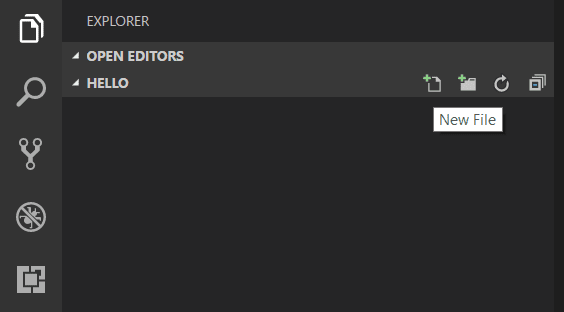
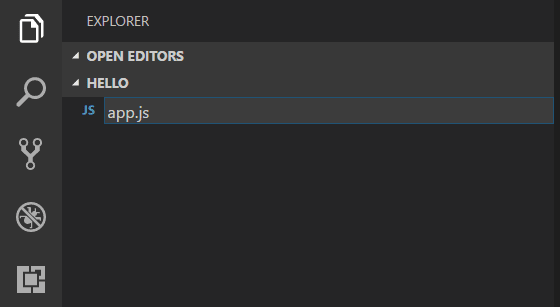
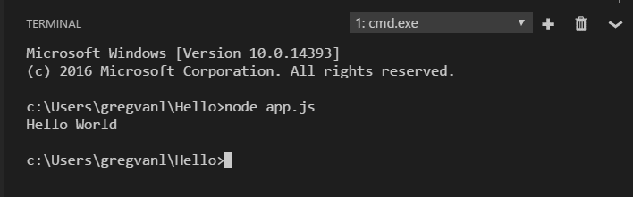
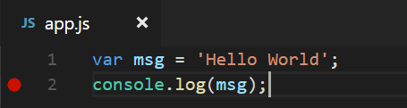
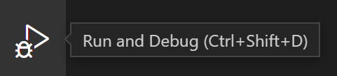
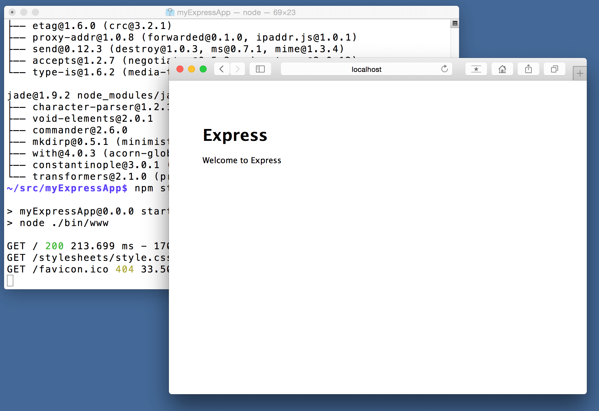
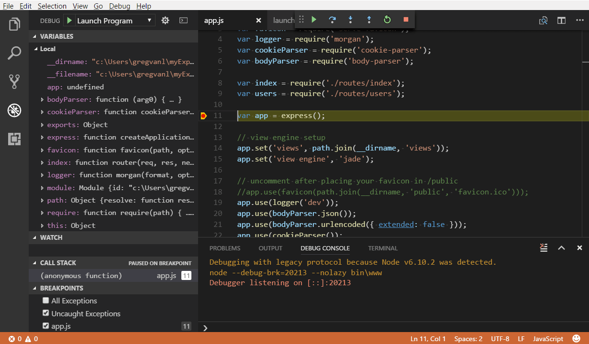

# Visual Studio Code에서의 Node.js 튜토리얼 {#nodejs-tutorial-in-visual-studio-code}

[Node.js](https://nodejs.org/)는 JavaScript를 사용하여 빠르고 확장 가능한 서버 애플리케이션을 구축하기 위한 플랫폼입니다. Node.js는 런타임이며, [npm](https://www.npmjs.com/)은 Node.js 모듈을 위한 패키지 관리자입니다.

Visual Studio Code는 JavaScript 및 TypeScript 언어에 대한 기본 지원과 Node.js 디버깅 기능을 제공합니다. 그러나 Node.js 애플리케이션을 실행하려면 머신에 Node.js 런타임을 설치해야 합니다.

이 안내서를 시작하려면, [플랫폼에 맞는 Node.js를 설치하세요](https://nodejs.org/en/download/). Node Package Manager는 Node.js 배포판에 포함되어 있습니다. `node` 및 `npm` 명령줄 도구가 PATH에 있도록 새 터미널(명령 프롬프트)을 열어야 합니다.

Node.js가 컴퓨터에 올바르게 설치되었는지 테스트하려면 새 터미널을 열고 `node --version`을 입력하세요. 현재 설치된 Node.js 버전을 확인할 수 있습니다.

> **Linux**: 다양한 리눅스 배포판에 맞는 특정 Node.js 패키지가 있습니다. [패키지 관리자를 통한 Node.js 설치](https://nodejs.org/en/download/package-manager)를 참조하여 리눅스 버전에 맞는 Node.js 패키지 및 설치 지침을 확인하세요.

> **Windows Subsystem for Linux**: Windows에서 작업 중이라면 WSL은 Node.js 개발을 위한 훌륭한 방법입니다. Windows에서 리눅스 배포판을 실행하고 리눅스 환경에 Node.js를 설치할 수 있습니다. [WSL](https://marketplace.visualstudio.com/items?itemName=ms-vscode-remote.remote-wsl) 확장과 함께 사용하면 WSL의 컨텍스트에서 실행하면서 VS Code의 전체 편집 및 디버깅 지원을 받을 수 있습니다. 더 알아보려면 [WSL에서 개발하기](/docs/remote/wsl.md)로 가거나 [WSL에서 작업하기](/docs/remote/wsl-tutorial.md) 튜토리얼을 시도해 보세요.

## Hello World {#hello-world}

가장 간단한 Node.js 애플리케이션인 "Hello World"를 만들어 보겠습니다.

"hello"라는 빈 폴더를 만들고, 그 안으로 이동하여 VS Code를 엽니다:

```bash
mkdir hello
cd hello
code .
```

:::tip
명령줄에서 파일이나 폴더를 직접 열 수 있습니다. 마침표 '.'는 현재 폴더를 나타내므로 VS Code가 시작되고 `Hello` 폴더가 열립니다.
:::

파일 탐색기 도구 모음에서 새 파일 버튼을 누릅니다:



그리고 파일 이름을 `app.js`로 지정합니다:



`.js` 파일 확장자를 사용하면 VS Code는 이 파일을 JavaScript로 해석하고 JavaScript 언어로 내용을 평가합니다. JavaScript 지원에 대한 자세한 내용은 VS Code [JavaScript 언어](/docs/languages/javascript.md) 주제를 참조하세요.

`app.js`에서 간단한 문자열 변수를 만들고 문자열의 내용을 콘솔에 출력합니다:

```javascript
var msg = "Hello World";
console.log(msg);
```

`console.`을 입력했을 때 [IntelliSense](/docs/editor/intellisense.md)가 `console` 객체에 대해 자동으로 제공된 것에 주목하세요.


또한 VS Code가 `msg`가 `'Hello World'`로 초기화되었음을 기반으로 문자열임을 인식하는 것도 주목하세요. `msg.`를 입력하면 `msg`에서 사용할 수 있는 모든 문자열 함수가 IntelliSense에 표시됩니다.


IntelliSense를 실험한 후, 위의 소스 코드 예제에서 추가된 변경 사항을 되돌리고 파일을 저장합니다 (`kb(workbench.action.files.save)`).

### Hello World 실행하기 {#running-hello-world}

`app.js`를 Node.js로 실행하는 것은 간단합니다. 터미널에서 다음을 입력하세요:

```bash
node app.js
```

터미널에 "Hello World"가 출력되고 Node.js가 반환되는 것을 확인할 수 있습니다.

### 통합 터미널 {#integrated-terminal}

VS Code에는 셸 명령을 실행하는 데 사용할 수 있는 [통합 터미널](/docs/terminal/basics.md)이 있습니다. 여기에서 Node.js를 직접 실행할 수 있으며, 명령줄 도구를 실행하는 동안 VS Code에서 벗어날 필요가 없습니다.

**보기** > **터미널** (`kb(workbench.action.terminal.toggleTerminal)` 백틱 문자 사용)은 통합 터미널을 열고, 그곳에서 `node app.js`를 실행할 수 있습니다:



이 안내서에서는 외부 터미널이나 VS Code 통합 터미널을 사용하여 명령줄 도구를 실행할 수 있습니다.

### Hello World 디버깅하기 {#debugging-hello-world}

소개에서 언급했듯이, VS Code는 Node.js 애플리케이션을 위한 디버거를 제공합니다. 간단한 Hello World 애플리케이션을 디버깅해 보겠습니다.

`app.js`에서 중단점을 설정하려면 편집기 커서를 첫 번째 줄에 놓고 `kb(editor.debug.action.toggleBreakpoint)`를 누르거나 줄 번호 옆의 편집기 왼쪽 여백을 클릭하세요. 여백에 빨간 원이 나타납니다.



디버깅을 시작하려면 활동 표시줄에서 **Run and Debug** 보기를 선택합니다:



이제 디버그 도구 모음의 녹색 화살표를 클릭하거나 `kb(workbench.action.debug.start)`를 눌러 "Hello World"를 실행하고 디버깅할 수 있습니다. 설정한 중단점에 도달하고 간단한 애플리케이션을 살펴보며 단계별로 진행할 수 있습니다. VS Code가 디버그 모드에 있음을 나타내기 위해 다른 색상의 상태 표시줄을 표시하고 DEBUG CONSOLE이 나타납니다.


"Hello World"에서 VS Code의 작동을 보았으니, 다음 섹션에서는 전체 스택 Node.js 웹 앱과 함께 VS Code를 사용하는 방법을 보여줍니다.

:::note
"Hello World" 예제는 완료되었으므로 Express 앱을 만들기 전에 해당 폴더에서 나가세요. 나머지 안내서에 필요하지 않으므로 "Hello" 폴더를 삭제해도 됩니다.
:::

## Express 애플리케이션 {#an-express-application}

[Express](https://expressjs.com/)는 Node.js 애플리케이션을 구축하고 실행하기 위한 매우 인기 있는 애플리케이션 프레임워크입니다. Express Generator 도구를 사용하여 새 Express 애플리케이션의 기본 구조를 자동으로 생성할 수 있습니다. Express Generator는 npm 모듈로 제공되며 npm 명령줄 도구 `npm`을 사용하여 설치됩니다.

:::tip
컴퓨터에 `npm`이 올바르게 설치되었는지 테스트하려면 터미널에서 `npm --help`를 입력하세요. 사용 문서를 확인할 수 있습니다.
:::

다음 명령어를 터미널에서 실행하여 Express Generator를 설치합니다:

```bash
npm install -g express-generator
```

`-g` 스위치는 Express Generator를 머신에 전역적으로 설치하여 어디서든 실행할 수 있게 합니다.

이제 다음 명령어를 실행하여 `myExpressApp`이라는 새 Express 애플리케이션의 기본 구조를 자동으로 생성할할 수 있습니다:

```bash
express myExpressApp --view pug
```

이 명령은 애플리케이션의 내용을 포함하는 `myExpressApp`이라는 새 폴더를 생성합니다. `--view pug` 매개변수는 생성기에게 [pug](https://pugjs.org/api/getting-started.html) 템플릿 엔진을 사용하도록 지시합니다.

모든 애플리케이션 종속성을 설치하려면 새 폴더로 이동하여 `npm install`을 실행합니다:

```bash
cd myExpressApp
npm install
```

이 시점에서 애플리케이션이 실행되는지 테스트해야 합니다. 생성된 Express 애플리케이션에는 `node ./bin/www`를 실행하는 `start` 스크립트가 포함된 `package.json` 파일이 있습니다. 이 명령은 Node.js 애플리케이션을 시작합니다.

Express 애플리케이션 폴더의 터미널에서 다음을 실행합니다:

```bash
npm start
```

Node.js 웹 서버가 시작되고 [http://localhost:3000](http://localhost:3000)으로 이동하여 실행 중인 애플리케이션을 확인할 수 있습니다.



## 훌륭한 코드 편집 {#great-code-editing}

브라우저를 닫고 `myExpressApp` 폴더의 터미널에서 `kbstyle(CTRL+C)`를 눌러 Node.js 서버를 중지합니다.

이제 VS Code를 실행합니다:

```bash
code .
```

:::note
Express 생성기를 설치하고 애플리케이션의 기본 구조를 자동으로 생성하는데 VS Code 통합 터미널을 사용했다면, 실행 중인 VS Code 인스턴스에서 **File** > **Open Folder** 명령으로 `myExpressApp` 폴더를 열 수 있습니다.
:::

[Node.js](https://nodejs.org/api/) 및 [Express](https://expressjs.com/api.html) 문서는 플랫폼과 프레임워크를 사용하여 풍부한 애플리케이션을 구축하는 방법을 잘 설명합니다. Visual Studio Code는 이러한 유형의 애플리케이션을 개발하는 데 있어 훌륭한 코드 편집 및 탐색 경험을 제공하여 생산성을 높여줍니다.

`app.js` 파일을 열고 Node.js 전역 객체 `__dirname` 위에 마우스를 올려보세요. VS Code가 `__dirname`이 문자열임을 이해하는 방식을 확인할 수 있습니다. 더욱 흥미로운 점은 Node.js 프레임워크에 대해 전체 IntelliSense를 사용할 수 있다는 것입니다. 예를 들어, `http`를 require하면 Visual Studio Code에서 입력할 때 `http` 클래스에 대한 전체 IntelliSense를 받을 수 있습니다.


VS Code는 TypeScript 타입 선언(타이핑) 파일(예: `node.d.ts`)을 사용하여 애플리케이션에서 사용하는 JavaScript 기반 프레임워크에 대한 메타데이터를 VS Code에 제공합니다. 타입 선언 파일은 TypeScript로 작성되어 매개변수와 함수의 데이터 유형을 표현할 수 있어 VS Code가 풍부한 IntelliSense 경험을 제공할 수 있게 합니다. `자동 타입 획득`이라는 기능 덕분에 이러한 타입 선언 파일을 다운로드하는 것에 대해 걱정할 필요가 없으며, VS Code가 자동으로 설치해 줍니다.

또한 다른 파일의 모듈을 참조하는 코드를 작성할 수 있습니다. 예를 들어, `app.js`에서 `./routes/index` 모듈을 require하면 `Express.Router` 클래스를 내보냅니다. `index`에서 IntelliSense를 호출하면 `Router` 클래스의 구조를 확인할 수 있습니다.


## Express 앱 디버깅하기 {#debug-your-express-app}

Express 애플리케이션을 위해 디버거 구성 파일 `launch.json`을 생성해야 합니다. **Activity Bar**에서 **Run and Debug**를 클릭하고 **create a launch.json file** 링크를 선택하여 기본 `launch.json` 파일을 생성합니다. `configurations`의 `type` 속성이 `"node"`로 설정되어 있는지 확인하여 **Node.js** 환경을 선택합니다. 파일이 처음 생성될 때 VS Code는 `package.json`에서 `start` 스크립트를 찾아 해당 값을 **Launch Program** 구성의 `program`으로 사용합니다(이 경우 `"${workspaceFolder}\\bin\\www"`).

```json
{
    "version": "0.2.0",
    "configurations": [
        {
            "type": "node",
            "request": "launch",
            "name": "Launch Program",
            "program": "${workspaceFolder}\\bin\\www"
        }
    ]
}
```

새 파일을 저장하고 **Run and Debug** 보기 상단의 구성 드롭다운에서 **Launch Program**이 선택되어 있는지 확인합니다. `app.js`를 열고 Express 앱 객체가 생성되는 파일 상단 근처에 중단점을 설정하려면 줄 번호 왼쪽의 여백을 클릭하세요. `kb(workbench.action.debug.start)`를 눌러 애플리케이션 디버깅을 시작합니다. VS Code는 새 터미널에서 서버를 시작하고 설정한 중단점에 도달합니다. 그곳에서 변수를 검사하고, 감시를 생성하며, 코드를 단계별로 실행할 수 있습니다.



## 애플리케이션 배포하기 {#deploy-your-application}

웹 애플리케이션을 배포하는 방법을 배우고 싶다면, [Azure에 애플리케이션 배포하기](/docs/azure/deployment.md) 튜토리얼을 확인하세요. 여기에서 Azure에서 웹사이트를 실행하는 방법을 보여줍니다.

---

## 다음 단계 {#next-steps}

Visual Studio Code로 탐색할 것이 많습니다. 다음 주제를 시도해 보세요:

- [Node.js 프로필 템플릿](/docs/editor/profiles.md#nodejs-profile-template) - 확장, 설정 및 스니펫의 선별된 세트를 사용하여 새 [프로필](/docs/editor/profiles)을 생성합니다.
- [설정](/docs/editor/settings.md) - 작업하는 방식을 위해 VS Code를 사용자 정의하는 방법을 배웁니다.
- [디버깅](/docs/editor/debugging.md) - VS Code가 정말 빛을 발하는 부분입니다.
- [비디오: VS Code에서 디버깅 시작하기](https://www.youtube.com/watch?v=3HiLLByBWkg) - VS Code에서 디버깅을 사용하는 방법을 배웁니다.
- [Node.js 디버깅](/docs/nodejs/nodejs-debugging.md) - VS Code의 내장 Node.js 디버깅에 대해 더 알아보세요.
- [디버깅 레시피](/docs/nodejs/debugging-recipes.md) - 클라이언트 측 및 컨테이너 디버깅과 같은 시나리오에 대한 예제입니다.
- [작업](/docs/editor/tasks.md) - Gulp, Grunt 및 Jake로 작업 실행하기. 오류 및 경고 표시하기.
