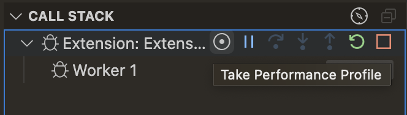
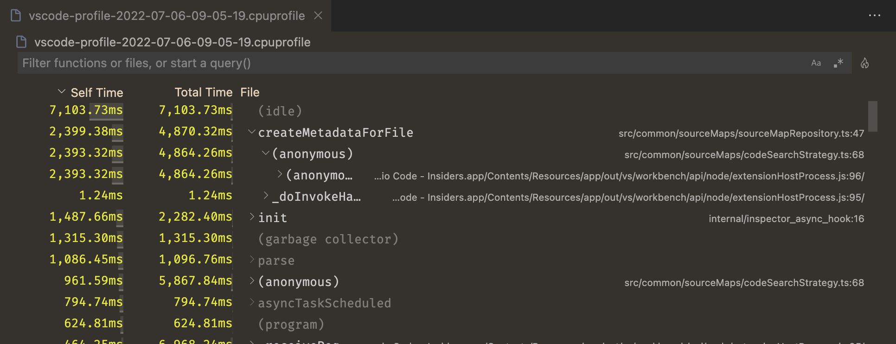
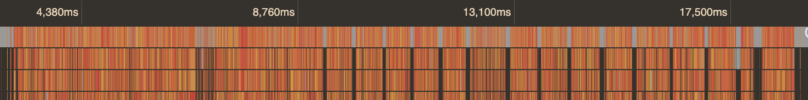

# JavaScript 성능 프로파일링 {#performance-profiling-javascript}

Visual Studio Code는 JavaScript 프로그램의 성능 프로파일을 수집하고 볼 수 있는 기능을 지원합니다. 시작하려면 먼저 [Node.js 프로그램](/docs/nodejs/nodejs-debugging.md) 또는 [브라우저 앱](/docs/nodejs/browser-debugging.md)에 대해 디버거를 설정해야 합니다.

## 프로파일의 종류 {#types-of-profiles}

최적화하려는 내용에 따라 여러 종류의 프로파일을 수집할 수 있습니다.

* **CPU 프로파일** - CPU 프로파일은 JavaScript에서 프로그램이 시간을 소비하는 위치를 알려줍니다. 비동기 프로미스나 콜백을 기다릴 수 있지만, 한 번에 하나의 JavaScript 표현식만 실행된다는 점을 기억하세요. CPU 프로파일은 초당 약 10,000개의 샘플을 수집하여 현재 어떤 표현식이 실행되고 있는지를 알려줍니다.
* **힙 프로파일** - 힙 프로파일은 프로그램에서 메모리가 시간에 따라 어떻게 할당되는지를 알려줍니다. 메모리 할당은 비용이 많이 들 수 있으며, 코드가 할당하는 메모리 양을 줄이면 성능 향상으로 이어질 수 있습니다.
* **힙 스냅샷** - 힙 스냅샷은 프로그램이 메모리를 할당한 위치를 순간적으로 보여줍니다. 프로그램이 많은 RAM을 사용하고 그 원인을 찾고 싶다면 힙 스냅샷이 유용할 수 있습니다. 복잡한 프로그램의 경우 힙 스냅샷을 수집하는 데 몇 분이 걸릴 수 있으며, 내장 편집기에서 힙 스냅샷을 보는 것은 현재 지원되지 않습니다.

## 프로파일 수집하기 {#collecting-a-profile}

프로파일을 수집하려면 프로그램을 디버깅 중이어야 합니다. 디버깅 중이라면 몇 가지 방법으로 프로파일을 수집할 수 있습니다:

* **호출 스택** 뷰의 '레코드' 버튼을 사용합니다. 이를 통해 CPU 프로파일, 힙 프로파일 및 힙 스냅샷을 수집할 수 있습니다.
* 프로그램에서 `console.profile()`을 호출합니다. 이 호출은 CPU 프로파일을 수집합니다.

### 레코드 버튼 사용하기 {#using-the-record-button}

디버깅 중이라면 실행 및 디버그 뷰(`kb(workbench.view.debug)`)로 전환하고 **호출 스택** 뷰를 찾습니다. 디버깅할 세션 위에 마우스를 올리고 **성능 프로파일 수집** 버튼을 선택합니다. 이 명령은 명령 팔레트(`kb(workbench.action.showCommands)`)에서도 실행할 수 있습니다.



그런 다음 VS Code는 어떤 [성능](#types-of-profiles) 프로파일을 수집할 것인지 물어봅니다. 자신에게 적합한 것을 선택하세요.

마지막으로, VS Code는 프로파일 수집을 언제 중지할 것인지 물어봅니다. 다음 중 하나를 선택할 수 있습니다:

* 수동으로 중지할 때까지 프로파일을 수집합니다.
* 설정된 기간 동안 프로파일을 수집합니다.
* 특정 중단점에 도달할 때까지 프로파일을 수집합니다.

첫 번째 옵션을 선택한 경우, 디버그 툴바에 표시된 큰 빨간 "레코드" 아이콘을 클릭하여 프로파일을 중지할 수 있습니다. 프로파일이 수집된 후, [프로파일 뷰어](#analyzing-a-profile)가 자동으로 열립니다.

### console.profile 사용하기 {#using-consoleprofile}

코드를 수동으로 계측하려면 `console.profile`을 호출하여 프로파일을 시작하고, `console.profileEnd`를 호출하여 프로파일을 중지할 수 있습니다. 이 두 호출 사이에 CPU 프로파일이 수집됩니다.

```js
console.profile();
// 매우 비싼 작업 수행
doSomeVeryExpensiveWork();
console.profileEnd();
```

결과로 생성된 `.cpuprofile` 파일은 작업 공간 폴더에 자동으로 저장됩니다. 해당 파일을 선택하여 내장된 [프로파일 뷰어](#analyzing-a-profile)에서 열 수 있습니다.

## 프로파일 분석하기 {#analyzing-a-profile}

### 테이블 뷰 {#table-view}

VS Code는 JavaScript `.cpuprofile` 및 `.heapprofile` 파일을 볼 수 있는 통합 시각화 도구를 제공합니다. 이러한 파일 중 하나를 열면 먼저 다음과 같은 테이블 뷰가 표시됩니다:



이것은 프로그램의 **하향식** 뷰입니다. 각 행은 프로그램의 함수를 나타내며, 기본적으로 특정 함수에서 소비된 시간에 따라 정렬됩니다. 이를 "자기 시간(Self Time)"이라고도 합니다. 함수의 "총 시간(Total Time)"은 해당 함수와 호출된 모든 함수에서 소비된 시간의 합입니다. 각 테이블 행을 확장하여 해당 함수가 어디서 호출되었는지 확인할 수 있습니다.

예를 들어, 다음 코드를 살펴보세요:

```js
function a() {
  doSomethingFor5Seconds();
  b();
}

function b() {
  doSomethingFor3Seconds();
}

a();
```

이 경우, `a`의 자기 시간은 5초이고 `a`의 총 시간은 8초입니다. `b`의 자기 시간과 총 시간은 모두 3초입니다. 힙 프로파일도 같은 방식으로 작동하지만, 각 함수 또는 호출된 함수에서 할당된 메모리 양을 나타내기 위해 자기 크기(Self Size)와 총 크기(Total Size)를 사용합니다.

### 플레임 뷰 {#flame-view}

테이블 뷰는 특정 경우에 유용하지만, 종종 프로파일의 더 시각적인 표현을 보고 싶을 수 있습니다. 이를 위해 테이블 뷰의 오른쪽 상단에 있는 불꽃 🔥 아이콘을 클릭하면 됩니다. 아직 설치하지 않았다면, 플레임 뷰 편집기를 제공하는 추가 확장을 설치하라는 메시지가 표시됩니다.


처음에는 혼란스러울 수 있지만 걱정하지 마세요, 이해할 수 있도록 설명하겠습니다!

CPU 프로파일의 경우, 수평 축은 프로파일의 타임라인으로, 각 순간에 프로그램이 무엇을 하고 있었는지를 보여줍니다. 힙 프로파일의 경우, 수평 축은 프로그램이 할당한 총 메모리입니다.

그래프의 각 막대 또는 '플레임'은 호출 스택을 나타냅니다. 가장 바깥쪽의 최상위 함수 호출(즉, 호출 스택의 '하단')은 편집기 상단에 표시되며, 그 아래에는 호출된 함수들이 표시됩니다. 막대의 너비는 총 시간(Total Time) 또는 총 메모리(Total Memory)에 따라 결정됩니다.

플레임 그래프의 항목을 클릭하면 해당 항목에 대한 추가 정보를 볼 수 있으며, 마우스 휠을 사용하여 확대 및 축소할 수 있습니다. 확대된 경우 차트의 아무 곳이나 드래그하여 탐색할 수 있습니다.

### 왼쪽 무게 중심 뷰 {#left-heavy-view}

CPU 프로파일을 작업 중이라면, 보고 있는 플레임 그래프가 위의 그래프만큼 이해하기 쉽지 않을 수 있습니다. 다음과 같이 많은 개별 호출 스택이 있을 수 있습니다:



더 쉽게 분석하기 위해 VS Code는 모든 유사한 호출 스택을 함께 그룹화하는 "왼쪽 무게 중심" 뷰를 제공합니다.


이 버튼을 클릭하면 프로파일의 시간 순서 뷰에서 힙 프로파일과 유사한 뷰로 전환됩니다. 수평 축은 여전히 총 프로파일 기간이지만, 각 막대는 해당 호출 스택에서 호출된 모든 시간에 대한 총 시간을 나타냅니다.


이 뷰는 특정 애플리케이션, 예를 들어 서버와 같은 경우에 훨씬 더 유용합니다. 개별 호출이 상대적으로 빠를 수 있지만, 여러 호출에서 가장 비용이 많이 드는 함수가 무엇인지 알아내고 싶을 때 유용합니다.