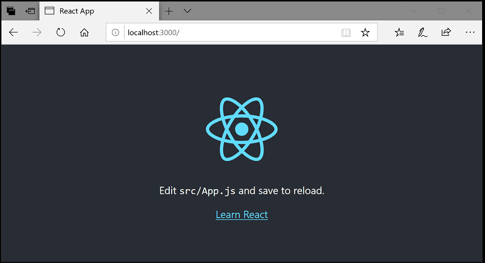
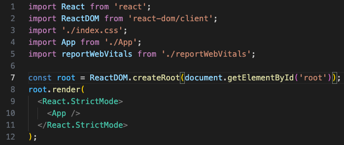
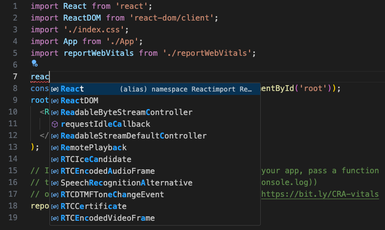
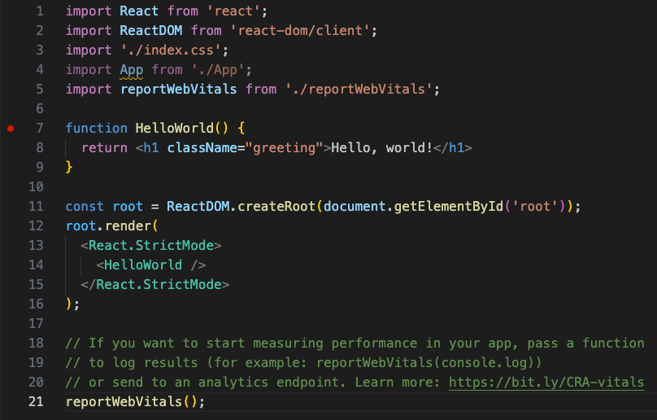
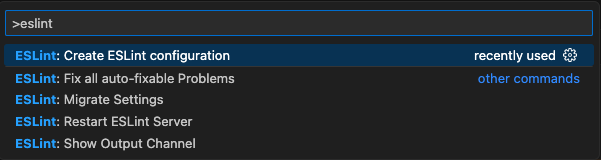
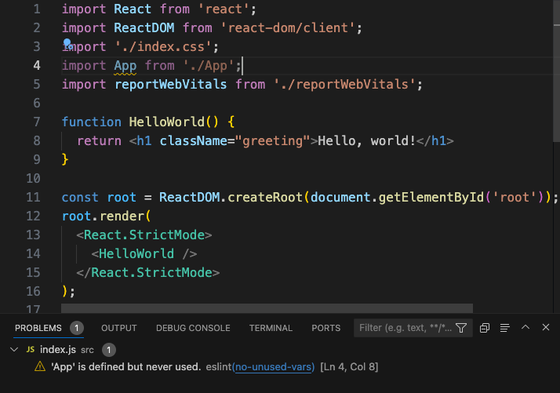

# Visual Studio Code에서 React 사용하기 {#using-react-in-visual-studio-code}

[React](https://reactjs.org)는 사용자 인터페이스를 구축하기 위해 Facebook에서 개발한 인기 있는 JavaScript 라이브러리입니다. Visual Studio Code 편집기는 React.js IntelliSense 및 코드 탐색을 기본적으로 지원합니다.



## React에 오신 것을 환영합니다 {#welcome-to-react}

이번 튜토리얼에서는 `create-react-app` [제너레이터](https://reactjs.org/docs/create-a-new-react-app.html#create-react-app)를 사용할 것입니다. 제너레이터를 사용하고 React 애플리케이션 서버를 실행하려면 [Node.js](https://nodejs.org/) JavaScript 런타임과 [npm](https://www.npmjs.com/) (Node.js 패키지 관리자)을 설치해야 합니다. npm은 Node.js에 포함되어 있으며, [Node.js 다운로드](https://nodejs.org/en/download/)에서 다운로드하여 설치할 수 있습니다.

> **팁**: Node.js와 npm이 올바르게 설치되었는지 테스트하려면 터미널이나 명령 프롬프트에 `node --version`과 `npm --version`을 입력할 수 있습니다.

이제 다음 명령어를 입력하여 새로운 React 애플리케이션을 생성할 수 있습니다:

```bash
npx create-react-app my-app
```

여기서 `my-app`은 애플리케이션의 폴더 이름입니다. React 애플리케이션을 생성하고 종속성을 설치하는 데 몇 분이 걸릴 수 있습니다.

> **참고**: 이전에 `npm install -g create-react-app`을 통해 `create-react-app`을 전역으로 설치한 경우, npx가 항상 최신 버전을 사용하도록 보장하기 위해 `npm uninstall -g create-react-app`을 사용하여 패키지를 제거하는 것이 좋습니다.

새로운 폴더로 이동하여 `npm start`를 입력하여 웹 서버를 시작하고 브라우저에서 애플리케이션을 열어 빠르게 React 애플리케이션을 실행해 보겠습니다:

```bash
cd my-app
npm start
```

<!-- TBD yarn 언급 및 링크 -->

브라우저에서 [http://localhost:3000](http://localhost:3000)에서 React 로고와 "Learn React" 링크를 볼 수 있어야 합니다. 애플리케이션을 VS Code로 살펴보는 동안 웹 서버를 계속 실행해 두겠습니다.

VS Code에서 React 애플리케이션을 열려면 다른 터미널이나 명령 프롬프트 창을 열고 `my-app` 폴더로 이동한 후 `code .`을 입력합니다:

```bash
cd my-app
code .
```

### Markdown 미리보기 {#markdown-preview}

파일 탐색기에서 볼 수 있는 파일 중 하나는 애플리케이션의 `README.md` Markdown 파일입니다. 이 파일에는 애플리케이션 및 React에 대한 유용한 정보가 많이 포함되어 있습니다. README를 검토하는 좋은 방법은 VS Code의 [Markdown 미리보기](/docs/languages/markdown.md#markdown-preview)를 사용하는 것입니다. 현재 편집기 그룹에서 미리보기를 열거나 (**Markdown: Open Preview** `kb(markdown.showPreview)`) 새 편집기 그룹에서 옆으로 열 수 있습니다 (**Markdown: Open Preview to the Side** `kb(markdown.showPreviewToSide)`). 멋진 형식, 헤더에 대한 하이퍼링크 탐색 및 코드 블록의 구문 강조를 제공합니다.


### 구문 강조 및 괄호 일치 {#syntax-highlighting-and-bracket-matching}

이제 `src` 폴더를 확장하고 `index.js` 파일을 선택합니다. VS Code가 다양한 소스 코드 요소에 대해 구문 강조를 제공하며, 괄호 위에 커서를 두면 일치하는 괄호도 선택된다는 것을 알 수 있습니다.



### IntelliSense {#intellisense}

`index.js`에 입력하기 시작하면 스마트 제안이나 완성을 볼 수 있습니다.



제안을 선택하고 `.`을 입력하면 [IntelliSense](/docs/editor/intellisense.md)를 통해 객체의 유형 및 메서드를 볼 수 있습니다.


VS Code는 JavaScript 코드 인텔리전스를 위해 TypeScript 언어 서비스를 사용하며, [자동 타입 획득](/docs/nodejs/working-with-javascript.md#typings-and-automatic-type-acquisition) (ATA)라는 기능이 있습니다. ATA는 `package.json`에 참조된 npm 모듈에 대한 npm 타입 선언 파일(`*.d.ts`)을 다운로드합니다.

메서드를 선택하면 매개변수 도움말도 제공됩니다:


### 정의로 이동, 정의 미리보기 {#go-to-definition-peek-definition}

TypeScript 언어 서비스를 통해 VS Code는 **정의로 이동** (`kb(editor.action.revealDefinition)`) 또는 **정의 미리보기** (`kb(editor.action.peekDefinition)`)를 통해 편집기에서 타입 정의 정보를 제공할 수 있습니다. `App` 위에 커서를 두고 마우스 오른쪽 버튼을 클릭한 후 **정의 미리보기**를 선택합니다. 그러면 `App.js`에서 `App` 정의를 보여주는 [미리보기 창](/docs/editor/editingevolved.md#peek)이 열립니다.


`kbstyle(Escape)`를 눌러 미리보기 창을 닫습니다.

## Hello World {#hello-world}

샘플 애플리케이션을 "Hello World!"로 업데이트해 보겠습니다. `index.js` 안에 "Hello, world!"라는 H1 헤더를 포함하는 `HelloWorld`라는 컴포넌트를 만들고, `root.render`의 `<App />` 태그를 `<HelloWorld />`로 교체합니다.

```js
import React from "react";
import ReactDOM from "react-dom/client";
import "./index.css";
import App from "./App";
import reportWebVitals from "./reportWebVitals";

function HelloWorld() {
  return <h1 className="greeting">Hello, world!</h1>;
}

const root = ReactDOM.createRoot(document.getElementById("root"));
root.render(
  <React.StrictMode>
    <HelloWorld />
  </React.StrictMode>
);

// 애플리케이션의 성능을 측정하려면 결과를 기록할 함수를 전달하세요
// (예: reportWebVitals(console.log))
// 또는 분석 엔드포인트로 전송하세요. 자세한 내용은: https://bit.ly/CRA-vitals
reportWebVitals();
```

`index.js` 파일을 저장하면 서버의 실행 인스턴스가 웹 페이지를 업데이트하고 브라우저를 새로 고침할 때 "Hello World!"를 볼 수 있습니다.

> **팁**: VS Code는 기본적으로 지연 후 파일을 저장하는 자동 저장을 지원합니다. 자동 저장을 켜려면 **파일** 메뉴에서 **자동 저장** 옵션을 확인하거나 `files.autoSave` 사용자 [설정](/docs/editor/settings.md)을 직접 구성하세요.


## React 디버깅 {#debugging-react}

클라이언트 측 React 코드를 디버깅하기 위해 내장된 JavaScript 디버거를 사용할 것입니다.

> 참고: 이 튜토리얼은 Edge 브라우저가 설치되어 있다고 가정합니다. Chrome을 사용하여 디버깅하려면 `type`을 `chrome`으로 변경하세요. [Firefox](https://marketplace.visualstudio.com/items?itemName=hbenl.vscode-firefox-debug) 브라우저에 대한 디버거도 있습니다.

### 중단점 설정 {#set-a-breakpoint}

`index.js`에서 중단점을 설정하려면 줄 번호 왼쪽의 여백을 클릭합니다. 이렇게 하면 빨간 원으로 표시되는 중단점이 설정됩니다.



### 디버거 구성 {#configure-the-debugger}

먼저 [디버거](/docs/editor/debugging.md)를 구성해야 합니다. 이를 위해 **실행 및 디버그** 뷰 (`kb(workbench.view.debug)`)로 이동하고 **launch.json 파일 만들기** 링크를 선택하여 `launch.json` 디버거 구성 파일을 생성합니다. **디버거 선택** 드롭다운 목록에서 **Web App (Edge)**를 선택합니다. 이렇게 하면 웹사이트를 시작하는 구성이 포함된 새로운 `.vscode` 폴더에 `launch.json` 파일이 생성됩니다.

예제를 위해 하나의 변경을 해야 합니다: `url`의 포트를 `8080`에서 `3000`으로 변경합니다. `launch.json`은 다음과 같아야 합니다:

```json
{
    "version": "0.2.0",
    "configurations": [
        {
            "type": "msedge",
            "request": "launch",
            "name": "Launch Edge against localhost",
            "url": "http://localhost:3000",
            "webRoot": "$\{workspaceFolder\}
"
        }
    ]
}
```

개발 서버가 실행 중인지 확인하세요 (`npm start`). 그런 다음 `kb(workbench.action.debug.start)`를 누르거나 녹색 화살표를 눌러 디버거를 시작하고 새로운 브라우저 인스턴스를 엽니다. 중단점이 설정된 소스 코드는 디버거가 연결되기 전에 시작 시 실행되므로 웹 페이지를 새로 고침할 때까지 중단점에 도달하지 않습니다. 페이지를 새로 고침하면 중단점에 도달해야 합니다.


소스 코드를 단계별로 실행할 수 있으며 (`kb(workbench.action.debug.stepOver)`), `HelloWorld`와 같은 변수를 검사하고 클라이언트 측 React 애플리케이션의 호출 스택을 볼 수 있습니다.


디버거 및 사용 가능한 옵션에 대한 자세한 내용은 [브라우저 디버깅](/docs/nodejs/browser-debugging.md) 문서를 참조하세요.

### 실시간 편집 및 디버깅 {#live-editing-and-debugging}

[webpack](https://webpack.js.org/)을 React 앱과 함께 사용하면 VS Code에서 직접 실시간 편집 및 디버깅을 할 수 있는 더 효율적인 워크플로우를 가질 수 있습니다. 이에 대한 자세한 내용은 [VS Code에서 React 앱을 직접 실시간으로 편집하고 디버깅하기](https://medium.com/@auchenberg/live-edit-and-debug-your-react-apps-directly-from-vs-code-without-leaving-the-editor-3da489ed905f) 블로그 게시물과 [webpack 핫 모듈 교체 문서](https://webpack.js.org/concepts/hot-module-replacement/)를 참조하세요.

## 린팅 {#linting}

린터는 소스 코드를 분석하고 애플리케이션을 실행하기 전에 잠재적인 문제에 대해 경고할 수 있습니다. VS Code에 포함된 JavaScript 언어 서비스는 기본적으로 구문 오류 검사 지원을 제공하며, 이는 **문제** 패널 (**보기** > **문제** `kb(workbench.actions.view.problems)`)에서 확인할 수 있습니다.

React 소스 코드에서 작은 오류를 만들어 보면 빨간 물결선과 함께 **문제** 패널에 오류가 표시됩니다.


린터는 더 정교한 분석을 제공하여 코딩 규칙을 강제하고 안티 패턴을 감지할 수 있습니다. 인기 있는 JavaScript 린터는 [ESLint](https://eslint.org/)입니다. ESLint는 ESLint VS Code [확장](https://marketplace.visualstudio.com/items/dbaeumer.vscode-eslint)과 결합하여 훌륭한 제품 내 린팅 경험을 제공합니다.

먼저 ESLint 명령줄 도구를 설치합니다:

```bash
npm install -g eslint
```

그런 다음 **확장** 뷰로 이동하여 'eslint'를 입력하여 ESLint 확장을 설치합니다.


ESLint 확장이 설치되고 VS Code가 다시 로드되면 ESLint 구성 파일인 `.eslintrc.js`를 생성해야 합니다. **명령 팔레트** (`kb(workbench.action.showCommands)`)에서 확장의 **ESLint: Create ESLint configuration** 명령을 사용하여 생성할 수 있습니다.



명령이 **터미널** 패널에서 일련의 질문에 답하도록 요청합니다. 기본값을 선택하면 프로젝트 루트에 다음과 같은 `.eslintrc.js` 파일이 생성됩니다:

```js
module.exports = {
  env: {
    browser: true,
    es2020: true,
  },
  extends: ["eslint:recommended", "plugin:react/recommended"],
  parserOptions: {
    ecmaFeatures: {
      jsx: true,
    },
    ecmaVersion: 11,
    sourceType: "module",
  },
  plugins: ["react"],
  rules: {},
};
```

이제 ESLint가 열린 파일을 분석하고 `index.js`에서 'App'이 정의되었지만 사용되지 않았다는 경고를 표시합니다.



`.eslintrc.js` 파일에서 ESLint [규칙](https://eslint.org/docs/rules/)을 수정할 수 있습니다.

여기서 추가 세미콜론에 대한 오류 규칙을 추가해 보겠습니다:

```js
 "rules": {
        "no-extra-semi":"error"
    }
```

이제 한 줄에 세미콜론이 여러 개 있는 실수를 하면 편집기에서 오류(빨간 물결선)와 **문제** 패널에 오류 항목이 표시됩니다.


## 인기 있는 스타터 키트 {#popular-starter-kits}

이번 튜토리얼에서는 `create-react-app` 제너레이터를 사용하여 간단한 React 애플리케이션을 만들었습니다. 첫 번째 React 애플리케이션을 구축하는 데 도움이 되는 훌륭한 샘플과 스타터 키트가 많이 있습니다.

### VS Code React 샘플 {#vs-code-react-sample}

이것은 [샘플](https://github.com/microsoft/vscode-react-sample) React 애플리케이션으로, 간단한 TODO 애플리케이션을 생성하고 Node.js [Express](https://expressjs.com/) 서버의 소스 코드를 포함합니다. 또한 [Babel](https://babeljs.io) ES6 트랜스파일러를 사용하는 방법과 [webpack](https://webpack.js.org/)을 사용하여 사이트 자산을 번들하는 방법을 보여줍니다.

### TypeScript React {#typescript-react}

TypeScript와 React에 대해 궁금하다면 TypeScript 템플릿을 사용하여 `create-react-app` 애플리케이션의 TypeScript 버전을 생성할 수 있습니다:

```bash
npx create-react-app my-app --template typescript
```

자세한 내용은 [TypeScript 추가하기](https://create-react-app.dev/docs/adding-typescript)에서 확인할 수 있습니다.

### Angular {#angular}

[Angular](https://angular.io/)는 또 다른 인기 있는 웹 프레임워크입니다. VS Code와 함께 작동하는 Angular의 예를 보고 싶다면 [Angular CLI로 디버깅하기](https://github.com/microsoft/vscode-recipes/tree/main/Angular-CLI) 레시피를 확인하세요. Angular 애플리케이션을 생성하고 JavaScript 디버거를 위한 `launch.json` 파일을 구성하는 방법을 안내합니다.

## 자주 묻는 질문 {#common-questions}

### 선언적 JSX 내에서 IntelliSense를 받을 수 있나요? {#can-i-get-intellisense-within-declarative-jsx}

네. 예를 들어, `create-react-app` 프로젝트의 `App.js` 파일을 열면 `render()` 메서드 내의 React JSX에서 IntelliSense를 볼 수 있습니다.

