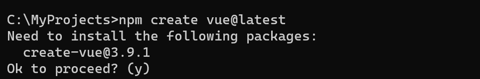
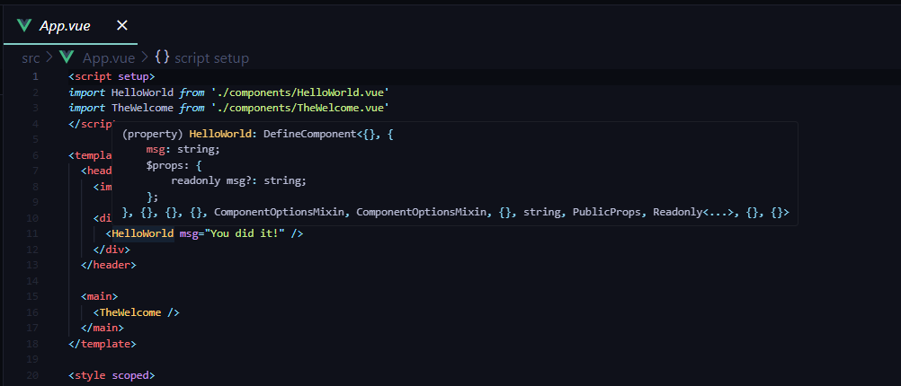
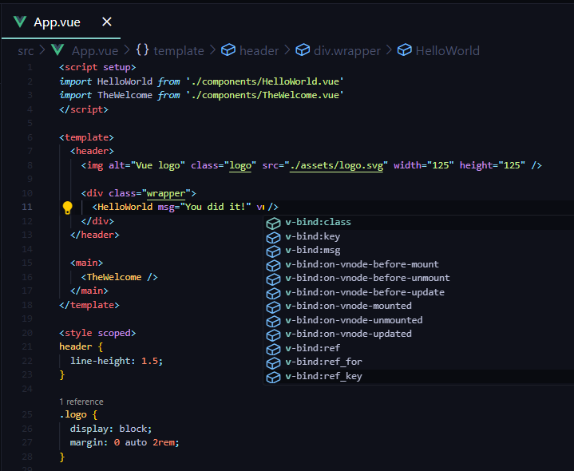
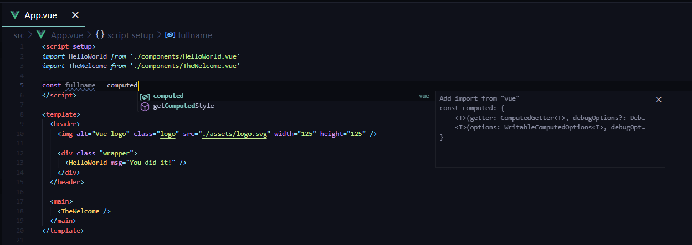
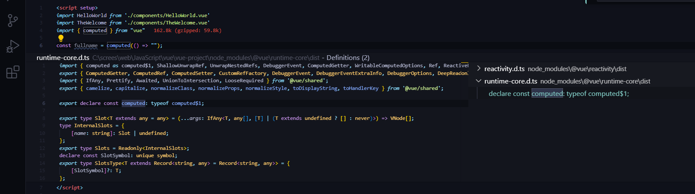

# Visual Studio Code에서 Vue 사용하기 {#using-vue-in-visual-studio-code}

[Vue.js](https://vuejs.org/)는 웹 애플리케이션과 사용자 인터페이스를 구축하기 위한 인기 있는 JavaScript 라이브러리이며, Visual Studio Code는 [HTML](/docs/languages/html.md), [CSS](/docs/languages/css.md), [JavaScript](/docs/languages/javascript.md)와 같은 Vue.js 빌딩 블록에 대한 기본 지원을 제공합니다. 더 풍부한 Vue.js 개발 환경을 위해 [Vue - Official (이전 Volar)](https://marketplace.visualstudio.com/items?itemName=Vue.volar) 확장을 설치하면 IntelliSense, [TypeScript](/docs/languages/typescript), 포맷팅 등을 지원받을 수 있습니다.

>**참고**: [Vue 2 지원은 2023년 12월 31일에 종료되었습니다](https://v2.vuejs.org/lts/), 따라서 [Vetur](https://marketplace.visualstudio.com/items?itemName=octref.vetur) 확장의 사용은 [권장되지 않습니다](https://github.com/vuejs/vetur/discussions/3378). Vue - Official 확장을 사용하려면 [Vetur를 비활성화해야](https://vuejs.org/guide/typescript/overview.html#ide-support) 합니다.

---


---

## Vue에 오신 것을 환영합니다 {#welcome-to-vue}

이번 튜토리얼에서는 [Vite](https://vitejs.dev/) 도구를 사용할 것입니다. Vue.js 프레임워크가 처음이라면 [vuejs.org](https://vuejs.org) 웹사이트에서 훌륭한 문서와 튜토리얼을 찾을 수 있습니다.

Vite와 Vue.js를 설치하고 사용하려면 [Node.js](https://nodejs.org/) JavaScript 런타임과 [npm](https://www.npmjs.com/) (Node.js 패키지 관리자)을 설치해야 합니다. npm은 Node.js에 포함되어 있으며, [Node.js 다운로드](https://nodejs.org/en/download/)에서 설치할 수 있습니다.

>**팁**: Node.js와 npm이 올바르게 설치되었는지 테스트하려면 `node --version`과 `npm --version`을 입력해 보세요.

시작하려면 프로젝트를 생성할 부모 디렉토리에 있는지 확인하세요. 그런 다음 터미널이나 명령 프롬프트를 열고 다음을 입력합니다:

```bash
npm create vue@latest
```

`create-vue` 설치를 요청받게 됩니다.



이 과정은 몇 분 정도 소요될 수 있으며, Vue 프로젝트를 스캐폴딩하는 데 도움이 되는 [create-vue](https://github.com/vuejs/create-vue)를 실행합니다. 선택적 기능에 대한 프롬프트를 따르세요. 옵션에 대해 확실하지 않다면 "아니오"를 선택할 수 있습니다.


프로젝트가 생성되면 해당 디렉토리로 이동하여 종속성을 설치합니다. 종속성을 설치하는 데 몇 분 정도 소요될 수 있습니다.

```bash
cd <your-project-name>
npm install
```

웹 서버를 시작하고 브라우저에서 애플리케이션을 열기 위해 `npm run dev`를 입력하여 Vue 애플리케이션을 빠르게 실행해 보겠습니다:

```bash
npm run dev
```

브라우저에서 [http://localhost:5173](http://localhost:5173)에서 "Welcome to your Vue.js App"을 볼 수 있어야 합니다.

VS Code에서 Vue 애플리케이션을 열려면, 터미널(또는 명령 프롬프트)에서 `vue-project` 폴더로 이동한 후 `code .`을 입력합니다:

```bash
cd vue-project
code .
```

VS Code가 실행되며 파일 탐색기에서 Vue 애플리케이션이 표시됩니다.

## Vue - Official 확장 {#vue---official-extension}

이제 `src` 폴더를 확장하고 `App.vue` 파일을 선택하세요. VS Code가 구문 강조를 표시하지 않으며, 파일을 **일반 텍스트**로 처리하는 것을 하단 오른쪽 상태 표시줄에서 확인할 수 있습니다. 또한 `.vue` 파일 유형에 대해 [Vue - Official](https://marketplace.visualstudio.com/items?itemName=Vue.volar) 확장을 추천하는 알림이 표시됩니다.

Vue 확장은 VS Code에 Vue.js 언어 기능(구문 강조, IntelliSense 및 포맷팅)을 제공합니다.


알림에서 **설치**를 눌러 Vue 확장을 다운로드하고 설치하세요. 확장 보기에서 Vue 확장이 **설치 중**으로 표시됩니다. 설치가 완료되면(몇 분 소요될 수 있음) **설치** 버튼이 **관리** 기어 버튼으로 변경됩니다.

이제 `.vue`가 Vue.js 언어의 인식된 파일 유형이 되었으며, 구문 강조, 괄호 일치 및 호버 설명과 같은 언어 기능을 사용할 수 있습니다.



## IntelliSense {#intellisense}

`App.vue`에서 입력을 시작하면 HTML과 CSS뿐만 아니라 Vue.js 특정 항목(예: Vue `template` 섹션의 선언(`v-bind`, `v-for`))에 대한 스마트 제안이나 완성을 볼 수 있습니다:



그리고 `scripts` 섹션의 `computed`와 같은 Vue 속성도 볼 수 있습니다:



### 정의로 이동, 정의 미리 보기 {#go-to-definition-peek-definition}

VS Code의 Vue - Official 확장은 유형 정의와 같은 언어 서비스 기능을 제공하여 Vue.js 개발 경험을 향상시킵니다. 이러한 기능에 접근하려면:

- **정의로 이동** (`kb(editor.action.revealDefinition)`): 코드에서 유형 정의로 직접 이동합니다.
- **정의 미리 보기** (`kb(editor.action.peekDefinition)`): 현재 컨텍스트를 떠나지 않고 인라인에서 유형 정의를 봅니다.

정의 미리 보기를 사용하려면 다음 단계를 따르세요:
1. `App` 위에 커서를 놓습니다.
2. 마우스 오른쪽 버튼을 클릭하고 컨텍스트 메뉴에서 **Peek** 위로 마우스를 가져간 후 **Peek Definition**을 선택합니다.
3. [Peek 창](/docs/editor/editingevolved.md#peek)이 열리며 `App.js`의 `App` 정의가 표시됩니다.



`kbstyle(Escape)`를 눌러 Peek 창을 닫습니다.

## Hello World {#hello-world}

샘플 애플리케이션을 업데이트하여 "Hello World!"를 렌더링해 보겠습니다. `App.vue`에서 HelloWorld 컴포넌트의 `msg` 사용자 정의 속성 텍스트를 "Hello World!"로 교체합니다.

```html
<template>
  <header>
    

    <div class="wrapper">
      <HelloWorld msg="Hello World!" />
    </div>
  </header>

  <main>
    <TheWelcome />
  </main>
</template>
```

`App.vue` 파일을 저장하면(`kb(workbench.action.files.save)`), Vite의 [핫 모듈 교체(HMR)](https://vite.dev/guide/features.html#hot-module-replacement) 기능이 브라우저에서 즉시 업데이트를 반영하며 "Hello World!"를 볼 수 있습니다. Vue.js 클라이언트 측 디버깅에 대해 배우기 위해 서버를 계속 실행해 두세요.

>**팁**: VS Code는 기본적으로 지연 후 파일을 저장하는 자동 저장을 지원합니다. **파일** 메뉴에서 **자동 저장** 옵션을 확인하여 자동 저장을 켜거나 `files.autoSave` 사용자 [설정](/docs/editor/settings.md)을 직접 구성하세요.

---


---

## 린팅 {#linting}

린터는 소스 코드를 분석하고 애플리케이션을 실행하기 전에 잠재적인 문제에 대해 경고할 수 있습니다. Vue ESLint 플러그인([eslint-plugin-vue](https://eslint.vuejs.org/))은 Vue.js 특정 구문 오류를 검사하며, 이는 편집기에서 빨간 물결선으로 표시되고 **문제** 패널(**보기** > **문제** `kb(workbench.actions.view.problems)`)에 표시됩니다.

아래에서 Vue 린터가 템플릿에서 두 개 이상의 루트 요소를 감지했을 때의 오류를 볼 수 있습니다:


## 디버깅 {#debugging}

내장된 JavaScript 디버거를 사용하여 클라이언트 측 Vue.js 코드를 디버깅할 수 있습니다. Microsoft Edge를 사용하여 VS Code와 함께 Vite/Vue.js 3 프로젝트를 사용하는 방법에 대한 [이 대화](https://github.com/vitejs/vite/discussions/4065#discussioncomment-1359932)를 참조하세요.

현재 유지 관리 모드에 있는 Vue CLI에 대해서는 [VS Code에서의 Vue.js 디버깅](https://github.com/microsoft/vscode-recipes/tree/main/vuejs-cli) 레시피를 확인하여 더 많은 정보를 얻으세요.

Vue.js 디버깅을 위한 또 다른 인기 있는 도구는 환경에 관계없이 사용할 수 있는 [vue-devtools](https://devtools.vuejs.org/) 플러그인입니다.

## 기타 확장 {#other-extensions}

- 확장 보기에서 _vue_를 입력하여 다른 Vue 확장을 찾습니다 (`kb(workbench.view.extensions)`).

  

- [Vue VS Code Snippets](https://marketplace.visualstudio.com/items?itemName=sdras.vue-vscode-snippets)와 같은 확장은 Vue 스니펫에 유용할 수 있습니다.

  

- 다른 사람들이 Vue.js 개발에 유용하다고 생각하는 확장을 묶은 확장 팩도 있습니다.

  