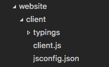
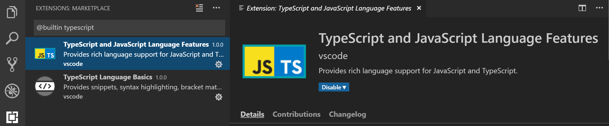
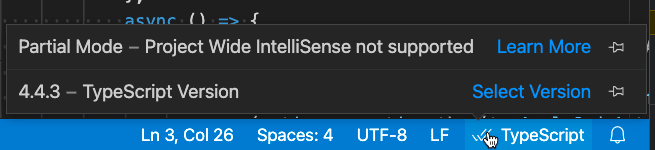

# 자바스크립트 작업하기 {#working-with-javascript}

이 주제에서는 Visual Studio Code에서 지원하는 고급 자바스크립트 기능에 대해 설명합니다. TypeScript 언어 서비스를 사용하여 VS Code는 자바스크립트에 대한 스마트 완성(IntelliSense) 및 타입 검사를 제공할 수 있습니다.

## IntelliSense {#intellisense}

Visual Studio Code의 자바스크립트 [IntelliSense](/docs/editor/intellisense.md)는 지능형 코드 완성, 매개변수 정보, 참조 검색 및 기타 많은 고급 언어 기능을 제공합니다. 우리의 자바스크립트 IntelliSense는 TypeScript 팀이 개발한 [자바스크립트 언어 서비스](https://github.com/microsoft/TypeScript/wiki/JavaScript-Language-Service-in-Visual-Studio)에 의해 지원됩니다. IntelliSense는 대부분의 자바스크립트 프로젝트에서 별도의 구성 없이 작동하지만, [JSDoc](/docs/languages/javascript.md#jsdoc-support)를 사용하거나 `jsconfig.json` 프로젝트를 구성하여 IntelliSense를 더욱 유용하게 만들 수 있습니다.

자바스크립트 IntelliSense가 작동하는 방식에 대한 자세한 내용은 [자바스크립트 언어 서비스 문서](https://github.com/microsoft/TypeScript/wiki/JavaScript-Language-Service-in-Visual-Studio)를 참조하십시오. 여기에는 타입 추론, JSDoc 주석, TypeScript 선언 및 자바스크립트와 TypeScript 프로젝트 혼합에 대한 내용이 포함되어 있습니다.

타입 추론이 원하는 정보를 제공하지 않을 경우, JSDoc 주석을 사용하여 타입 정보를 명시적으로 제공할 수 있습니다. 이 문서에서는 현재 지원되는 [JSDoc 주석](https://www.typescriptlang.org/docs/handbook/type-checking-javascript-files.html#supported-jsdoc)에 대해 설명합니다.

객체, 메서드 및 속성 외에도 자바스크립트 IntelliSense 창은 파일 내 기호에 대한 기본 단어 완성을 제공합니다.

### 타입 정의 및 자동 타입 획득 {#typings-and-automatic-type-acquisition}

자바스크립트 라이브러리 및 프레임워크에 대한 IntelliSense는 TypeScript 타입 선언(타입 정의) 파일에 의해 지원됩니다. 타입 선언 파일은 TypeScript로 작성되어 매개변수 및 함수의 데이터 타입을 표현할 수 있으며, 이를 통해 VS Code는 성능이 뛰어난 IntelliSense 경험을 제공합니다.

많은 인기 라이브러리는 타입 정의 파일과 함께 제공되므로 자동으로 IntelliSense를 사용할 수 있습니다. 타입 정의가 포함되지 않은 라이브러리의 경우, VS Code의 `자동 타입 획득` 기능이 커뮤니티에서 유지 관리하는 타입 정의 파일을 자동으로 설치합니다.

자동 타입 획득은 [npmjs](https://www.npmjs.com), Node.js 패키지 관리자를 필요로 하며, 이는 [Node.js](https://nodejs.org) 런타임에 포함되어 있습니다. 아래 이미지는 인기 있는 [lodash](https://lodash.com/) 라이브러리에 대한 메서드 서명, 매개변수 정보 및 메서드 문서를 포함한 IntelliSense를 보여줍니다.


타입 선언 파일은 프로젝트의 `package.json`에 나열된 패키지 또는 자바스크립트 파일에 가져온 패키지에 대해 Visual Studio Code에 의해 자동으로 다운로드되고 관리됩니다.

```json
{
  "dependencies": {
    "lodash": "^4.17.0"
  }
}
```

대안으로, [jsconfig.json](#javascript-projects-jsconfigjson)에서 타입 선언 파일을 획득할 패키지를 명시적으로 나열할 수 있습니다.

```json
{
  "typeAcquisition": {
    "include": ["jquery"]
  }
}
```

가장 일반적인 자바스크립트 라이브러리는 선언 파일을 포함하거나 사용할 수 있는 타입 선언 파일이 있습니다.

### 자동 타입 획득을 위한 npm 미설치 경고 수정하기 {#fixing-npm-not-installed-warning-for-automatic-type-acquisition}

[자동 타입 획득](#typings-and-automatic-type-acquisition)은 [npm](https://www.npmjs.com), Node.js 패키지 관리자를 사용하여 타입 선언(타입 정의) 파일을 설치하고 관리합니다. 자동 타입 획득이 제대로 작동하려면 먼저 머신에 npm이 설치되어 있는지 확인해야 합니다.

터미널 또는 명령 프롬프트에서 `npm --version`을 실행하여 npm이 설치되어 있고 사용 가능한지 빠르게 확인할 수 있습니다.

npm은 Node.js 런타임과 함께 설치되며, [Nodejs.org](https://nodejs.org)에서 다운로드할 수 있습니다. 현재 LTS(장기 지원) 버전을 설치하면 npm 실행 파일이 기본적으로 시스템 경로에 추가됩니다.

npm이 설치되어 있지만 여전히 경고 메시지가 표시되는 경우, `typescript.npm` [설정](/docs/editor/settings.md)을 사용하여 VS Code에 npm이 설치된 위치를 명시적으로 알려줄 수 있습니다. 이 설정은 머신에서 npm 실행 파일의 전체 경로로 설정해야 하며, 이는 작업 공간에서 패키지를 관리하는 데 사용하는 npm 버전과 일치할 필요는 없습니다. `typescript.npm`은 TypeScript 2.3.4 이상이 필요합니다.

예를 들어, Windows에서는 `settings.json` 파일에 다음과 같은 경로를 추가합니다:

```json
{
  "typescript.npm": "C:\\Program Files\\nodejs\\npm.cmd"
}
```

## 자바스크립트 프로젝트 (jsconfig.json) {#javascript-projects-jsconfigjson}

디렉토리에 [jsconfig.json](/docs/languages/jsconfig.md) 파일이 존재하면 해당 디렉토리가 자바스크립트 프로젝트의 루트임을 나타냅니다. `jsconfig.json`은 루트 파일과 [자바스크립트 언어 서비스](https://github.com/microsoft/TypeScript/wiki/JavaScript-Language-Service-in-Visual-Studio)에서 제공하는 언어 기능에 대한 옵션을 지정합니다. 일반적인 설정에서는 `jsconfig.json` 파일이 필요하지 않지만, 특정 상황에서는 `jsconfig.json`을 추가해야 할 수 있습니다.

- 모든 파일이 자바스크립트 프로젝트에 포함되어야 하는 것은 아닙니다(예: IntelliSense에서 일부 파일을 제외하고 싶을 때). 이 상황은 프론트엔드와 백엔드 코드에서 일반적입니다.
- 작업 공간에 여러 프로젝트 컨텍스트가 포함되어 있습니다. 이 경우 각 프로젝트의 루트 폴더에 `jsconfig.json` 파일을 추가해야 합니다.
- TypeScript 컴파일러를 사용하여 자바스크립트 소스 코드를 다운레벨 컴파일하고 있습니다.

### jsconfig.json의 위치 {#location-of-jsconfigjson}

코드를 자바스크립트 프로젝트로 정의하려면 아래와 같이 자바스크립트 코드의 루트에 `jsconfig.json`을 생성합니다. 자바스크립트 프로젝트는 프로젝트의 소스 파일이며 파생되거나 패키징된 파일(예: `dist` 디렉토리)은 포함되지 않아야 합니다.



더 복잡한 프로젝트에서는 작업 공간 내에 여러 개의 `jsconfig.json` 파일이 정의될 수 있습니다. 이렇게 하면 한 프로젝트의 소스 코드가 다른 프로젝트의 IntelliSense에 나타나지 않도록 할 수 있습니다.

아래 이미지는 `client`와 `server` 폴더가 있는 프로젝트를 보여주며, 두 개의 별도 자바스크립트 프로젝트를 나타냅니다:


### jsconfig.json 작성하기 {#writing-jsconfigjson}

아래는 `jsconfig.json` 파일의 간단한 템플릿으로, 자바스크립트 `target`을 `ES6`로 설정하고 `exclude` 속성으로 `node_modules` 폴더를 제외합니다. 이 코드를 `jsconfig.json` 파일에 복사하여 붙여넣을 수 있습니다.

```json
{
  "compilerOptions": {
    "module": "CommonJS",
    "target": "ES6"
  },
  "exclude": ["node_modules", "**/node_modules/*"]
}
```

`exclude` 속성은 언어 서비스에 소스 코드의 일부가 아닌 파일을 알려줍니다. IntelliSense가 느린 경우, `exclude` 목록에 폴더를 추가하세요(느린 완성을 감지하면 VS Code가 이를 제안합니다). 빌드 프로세스에서 생성된 파일(예: `dist` 디렉토리)은 `exclude`해야 합니다. 이러한 파일은 제안이 두 번 나타나게 하고 IntelliSense를 느리게 만듭니다.

`include` 속성을 사용하여 프로젝트의 파일을 명시적으로 설정할 수 있습니다. `include` 속성이 없으면 기본적으로 포함된 디렉토리와 하위 디렉토리의 모든 파일이 포함됩니다. `include` 속성이 지정되면 해당 파일만 포함됩니다.

명시적인 `include` 속성이 있는 예는 다음과 같습니다:

```json
{
  "compilerOptions": {
    "module": "CommonJS",
    "target": "ES6"
  },
  "include": ["src/**/*"]
}
```

최선의 방법은 단일 `src` 폴더와 함께 `include` 속성을 사용하는 것입니다. `exclude` 및 `include`의 파일 경로는 `jsconfig.json`의 위치를 기준으로 상대적입니다.

자세한 내용은 전체 [jsconfig.json 문서](/docs/languages/jsconfig.md)를 참조하십시오.

### TypeScript로 마이그레이션하기 {#migrating-to-typescript}

TypeScript와 자바스크립트를 혼합하여 사용할 수 있습니다. TypeScript로 마이그레이션을 시작하려면 `jsconfig.json` 파일의 이름을 `tsconfig.json`으로 변경하고 `allowJs` 속성을 `true`로 설정합니다. 자세한 내용은 [JavaScript에서 마이그레이션하기](https://www.typescriptlang.org/docs/handbook/migrating-from-javascript.html)를 참조하십시오.

> **참고:** `jsconfig.json`은 `allowJs`가 true로 설정된 `tsconfig.json` 파일과 동일합니다. 다른 사용 가능한 옵션을 보려면 [tsconfig.json 문서](https://www.typescriptlang.org/docs/handbook/tsconfig-json.html)를 참조하십시오.

## 자바스크립트 타입 검사 {#type-checking-javascript}

VS Code는 일반 자바스크립트 파일에서 TypeScript의 고급 타입 검사 및 오류 보고 기능을 활용할 수 있도록 합니다. 이는 일반적인 프로그래밍 실수를 잡는 좋은 방법입니다. 이러한 타입 검사는 자바스크립트에 대한 흥미로운 빠른 수정 기능을 가능하게 하며, **누락된 가져오기 추가** 및 **누락된 속성 추가**와 같은 기능을 포함합니다.


TypeScript는 `.js` 파일에서 `.ts` 파일과 동일하게 타입을 추론할 수 있습니다. 타입을 추론할 수 없는 경우 JSDoc 주석을 사용하여 명시할 수 있습니다. TypeScript가 자바스크립트 타입 검사를 위해 JSDoc을 사용하는 방법에 대한 자세한 내용은 [자바스크립트 파일의 타입 검사](https://www.typescriptlang.org/docs/handbook/type-checking-javascript-files.html)를 참조하십시오.

자바스크립트의 타입 검사는 선택 사항이며 선택적으로 활성화할 수 있습니다. ESLint와 같은 기존 자바스크립트 검증 도구는 새로운 내장 타입 검사 기능과 함께 사용할 수 있습니다.

필요에 따라 타입 검사를 시작하는 몇 가지 방법이 있습니다.

**파일별로**

자바스크립트 파일에서 타입 검사를 활성화하는 가장 쉬운 방법은 파일 상단에 `// @ts-check`를 추가하는 것입니다.

```js
// @ts-check
let itsAsEasyAs = "abc";
itsAsEasyAs = 123; // 오류: 타입 '123'은 타입 'string'에 할당할 수 없습니다.
```

`// @ts-check`를 사용하는 것은 몇 개의 파일에서만 타입 검사를 시도하고 전체 코드베이스에 대해 활성화하지 않으려는 경우 좋은 접근 방식입니다.

**설정 사용하기**

코드를 변경하지 않고 모든 자바스크립트 파일에 대해 타입 검사를 활성화하려면 작업 공간 또는 사용자 설정에 `"js/ts.implicitProjectConfig.checkJs": true`를 추가하기만 하면 됩니다. 이렇게 하면 `jsconfig.json` 또는 `tsconfig.json` 프로젝트의 일부가 아닌 모든 자바스크립트 파일에 대해 타입 검사가 활성화됩니다.

파일 상단에 `// @ts-nocheck` 주석을 추가하여 특정 파일에서 타입 검사를 제외할 수 있습니다:

```js
// @ts-nocheck
let easy = "abc";
easy = 123; // 오류 없음
```

또한 오류가 발생하기 전의 줄에 `// @ts-ignore` 주석을 사용하여 자바스크립트 파일에서 개별 오류를 비활성화할 수 있습니다:

```js
let easy = "abc";
// @ts-ignore
easy = 123; // 오류 없음
```

**jsconfig 또는 tsconfig 사용하기**

`jsconfig.json` 또는 `tsconfig.json`의 일부인 자바스크립트 파일에 대해 타입 검사를 활성화하려면 프로젝트의 컴파일러 옵션에 `"checkJs": true`를 추가합니다:

`jsconfig.json`:

```json
{
  "compilerOptions": {
    "checkJs": true
  },
  "exclude": ["node_modules", "**/node_modules/*"]
}
```

`tsconfig.json`:

```json
{
  "compilerOptions": {
    "allowJs": true,
    "checkJs": true
  },
  "exclude": ["node_modules", "**/node_modules/*"]
}
```

이렇게 하면 프로젝트의 모든 자바스크립트 파일에 대해 타입 검사가 활성화됩니다. 파일별로 타입 검사를 비활성화하려면 `// @ts-nocheck`를 사용할 수 있습니다.

자바스크립트 타입 검사는 TypeScript 2.3이 필요합니다. 현재 작업 공간에서 어떤 버전의 TypeScript가 활성화되어 있는지 확실하지 않은 경우 **TypeScript: Select TypeScript Version** 명령을 실행하여 확인할 수 있습니다. 이 명령을 실행하려면 편집기에서 `.js/.ts` 파일을 열어야 합니다. TypeScript 파일을 열면 하단 오른쪽 모서리에 버전이 표시됩니다.

### 전역 변수 및 타입 검사 {#global-variables-and-type-checking}

레거시 자바스크립트 코드에서 전역 변수 또는 비표준 DOM API를 사용하는 경우를 가정해 보겠습니다:

```ts
window.onload = function () {
  if (window.webkitNotifications.requestPermission() === CAN_NOTIFY) {
    window.webkitNotifications.createNotification(null, "Woof!", "🐶").show();
  } else {
    alert("알림을 보낼 수 없습니다.");
  }
};
```

위 코드에서 `// @ts-check`를 사용하려고 하면 전역 변수 사용에 대한 여러 오류가 표시됩니다:

1. `2행` - `Property 'webkitNotifications' does not exist on type 'Window'.`
2. `2행` - `Cannot find name 'CAN_NOTIFY'.`
3. `3행` - `Property 'webkitNotifications' does not exist on type 'Window'.`

`// @ts-check`를 계속 사용하고 싶지만 이러한 문제가 실제 애플리케이션의 문제는 아니라고 확신하는 경우, TypeScript에 이러한 전역 변수에 대해 알려야 합니다.

먼저, [jsconfig.json](#javascript-projects-jsconfigjson)을 프로젝트의 루트에 생성합니다:

```json
{
  "compilerOptions": {},
  "exclude": ["node_modules", "**/node_modules/*"]
}
```

그런 다음 변경 사항이 적용되도록 VS Code를 다시 로드합니다. `jsconfig.json`의 존재는 TypeScript에 자바스크립트 파일이 더 큰 프로젝트의 일부임을 알려줍니다.

이제 작업 공간의 어딘가에 `globals.d.ts` 파일을 생성합니다:

```ts
interface Window {
  webkitNotifications: any;
}

declare var CAN_NOTIFY: number;
```

`d.ts` 파일은 타입 선언입니다. 이 경우 `globals.d.ts`는 TypeScript에 전역 `CAN_NOTIFY`가 존재하고 `window`에 `webkitNotifications` 속성이 존재함을 알려줍니다. `d.ts` 작성에 대한 자세한 내용은 [TypeScript 문서](https://www.typescriptlang.org/docs/handbook/declaration-files/introduction.html)를 참조하십시오. `d.ts` 파일은 자바스크립트 평가 방식에 영향을 주지 않으며, 더 나은 자바스크립트 언어 지원을 제공하는 데만 사용됩니다.

## 작업 사용하기 {#using-tasks}

### TypeScript 컴파일러 사용하기 {#using-the-typescript-compiler}

TypeScript의 주요 기능 중 하나는 최신 자바스크립트 언어 기능을 사용할 수 있는 능력이며, 이러한 최신 기능을 아직 이해하지 못하는 자바스크립트 런타임에서 실행할 수 있는 코드를 생성할 수 있습니다. 자바스크립트도 동일한 언어 서비스를 사용하므로 이제 이 기능을 활용할 수 있습니다.

TypeScript 컴파일러 `tsc`는 자바스크립트 파일을 ES6에서 다른 언어 수준으로 다운레벨 컴파일할 수 있습니다. 원하는 옵션으로 `jsconfig.json`을 구성한 다음, `-p` 인수를 사용하여 `tsc`가 `jsconfig.json` 파일을 사용하도록 합니다. 예를 들어 `tsc -p jsconfig.json`을 사용하여 다운레벨 컴파일합니다.

다운레벨 컴파일에 대한 컴파일러 옵션에 대한 자세한 내용은 [jsconfig 문서](/docs/languages/jsconfig.md#jsconfig-options)를 참조하십시오.

### Babel 실행하기 {#running-babel}

[Babel](https://babeljs.io) 트랜스파일러는 ES6 파일을 읽을 수 있는 ES5 자바스크립트로 변환하며, 소스 맵을 제공합니다. 아래 구성을 `tasks.json` 파일(작업 공간의 `.vscode` 폴더 아래에 위치)에 추가하여 **Babel**을 쉽게 통합할 수 있습니다. `group` 설정은 이 작업을 기본 **Task: Run Build Task** 제스처로 만듭니다. `isBackground`는 VS Code에 이 작업을 백그라운드에서 계속 실행하도록 지시합니다. 자세한 내용은 [작업](/docs/editor/tasks.md)을 참조하십시오.

```json
{
    "version": "2.0.0",
    "tasks": [
        {
            "label": "watch",
            "command": "${workspaceFolder}/node_modules/.bin/babel",            "args": ["src", "--out-dir", "lib", "-w", "--source-maps"],
            "type": "shell",
            "group": { "kind": "build", "isDefault": true },
            "isBackground": true
        }
    ]
}
```

이 구성을 추가한 후, `kb(workbench.action.tasks.build)` (**Task: Run Build Task**) 명령으로 **Babel**을 시작하면 `src` 디렉토리의 모든 파일이 `lib` 디렉토리로 컴파일됩니다.

:::tip
Babel CLI에 대한 도움은 [Babel 사용하기](https://babeljs.io/docs/setup/#installation)에서 확인하십시오. 위 예제는 CLI 옵션을 사용합니다.
:::

## 자바스크립트 지원 비활성화하기 {#disable-javascript-support}

[Flow](https://flow.org/)와 같은 다른 자바스크립트 언어 도구에서 지원하는 자바스크립트 언어 기능을 사용하려는 경우, VS Code의 내장 자바스크립트 지원을 비활성화할 수 있습니다. 이는 내장 TypeScript 언어 확장인 **TypeScript and JavaScript Language Features** (vscode.typescript-language-features)를 비활성화하여 수행됩니다. 이 확장은 자바스크립트 언어 지원도 제공합니다.

자바스크립트/TypeScript 지원을 비활성화하려면 확장 보기(`kb(workbench.view.extensions)`)로 이동하여 내장 확장을 필터링한 후(**...** **More Actions** 드롭다운에서 **Show Built-in Extensions** 선택), 'typescript'를 입력합니다. **TypeScript and JavaScript Language Features** 확장을 선택하고 **비활성화** 버튼을 누릅니다. VS Code의 내장 확장은 제거할 수 없으며, 비활성화만 가능하고 언제든지 다시 활성화할 수 있습니다.



## 부분 IntelliSense 모드 {#partial-intellisense-mode}

VS Code는 자바스크립트와 TypeScript에 대해 프로젝트 전체 IntelliSense를 제공하려고 하며, 이는 자동 가져오기 및 **Go to Definition**과 같은 기능을 가능하게 합니다. 그러나 VS Code가 현재 열려 있는 파일만 작업할 수 있고 자바스크립트 또는 TypeScript 프로젝트를 구성하는 다른 파일을 로드할 수 없는 경우가 있습니다.

이런 경우는 몇 가지 있습니다:

- [vscode.dev](https://vscode.dev) 또는 [github.dev](https://docs.github.com/codespaces/developing-in-codespaces/web-based-editor)에서 자바스크립트 또는 TypeScript 코드를 작업하고 있으며 VS Code가 브라우저에서 실행되고 있습니다.
- 가상 파일 시스템에서 파일을 열었습니다(예: [GitHub Repositories](https://marketplace.visualstudio.com/items?itemName=GitHub.remotehub) 확장을 사용할 때).
- 프로젝트가 현재 로드 중입니다. 로드가 완료되면 프로젝트 전체에 대한 IntelliSense를 받기 시작합니다.

이러한 경우 VS Code의 IntelliSense는 **부분 모드**로 작동합니다. 부분 모드는 열려 있는 자바스크립트 또는 TypeScript 파일에 대해 최선을 다해 IntelliSense를 제공하지만 제한적이며 교차 파일 IntelliSense 기능을 제공할 수 없습니다.

### 어떤 기능이 영향을 받나요? {#which-features-are-impacted}

부분 모드에서 비활성화되거나 기능이 제한된 기능의 불완전한 목록은 다음과 같습니다:

- 열린 모든 파일이 하나의 프로젝트로 간주됩니다.
- `jsconfig` 또는 `tsconfig`의 구성 옵션(예: `target`)이 무시될 수 있습니다.
- 문법 오류만 감지되며, 잘못된 속성 접근이나 함수에 잘못된 타입을 전달하는 등의 의미론적 오류는 감지되지 않습니다.
- 의미론적 오류에 대한 빠른 수정(Quick Fix) 기능이 비활성화됩니다.
- 기호(Symbol)는 현재 파일 내에서만 확인할 수 있으며, 다른 파일에서 가져온 기호는 `any` 타입으로 간주됩니다.
- **정Go to Definition** 및 **Find All References**와 같은 기능은 열린 파일에서만 작동하며, 프로젝트 전체에서는 동작하지 않습니다. 따라서 `node_modules`에 설치된 패키지의 기호(Symbol)도 찾을 수 없습니다.
- 작업 공간 내에서 기호(Symbol)를 검색할 때, 현재 열린 파일의 기호만 검색됩니다.
- 자동 임포트 기능이 비활성화됩니다.
- 변수 및 함수 이름 변경 기능이 비활성화됩니다.
- 여러 리팩토링 기능이 비활성화됩니다.

`vscode.dev` 및 `github.dev`에서 비활성화되는 추가 기능이 있습니다:

- [자동 타입 획득](/docs/nodejs/working-with-javascript.md#typings-and-automatic-type-acquisition)은 현재 지원되지 않습니다.

### 부분 모드인지 확인하기 {#checking-if-you-are-in-partial-mode}

현재 파일이 프로젝트 전체 IntelliSense 대신 부분 모드 IntelliSense를 사용하고 있는지 확인하려면 상태 표시줄에서 `JavaScript` 또는 `TypeScript` 언어 상태 항목 위에 마우스를 올리십시오:



현재 파일이 부분 모드에 있을 경우 상태 항목에 `Partial mode`가 표시됩니다.
