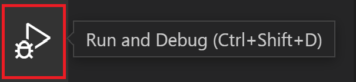

# VS Code에서 Python 디버깅 {#python-debugging-in-vs-code}

Python 확장은 여러 유형의 Python 애플리케이션을 위한 [Python Debugger 확장](https://marketplace.visualstudio.com/items?itemName=ms-python.debugpy)을 통해 디버깅을 지원합니다. 기본 디버깅에 대한 간단한 안내는 [튜토리얼 - 디버거 구성 및 실행](/docs/python/python-tutorial.md#configure-and-run-the-debugger)을 참조하세요. 또한 [Flask 튜토리얼](/docs/python/tutorial-flask.md)도 확인하세요. 두 튜토리얼 모두 중단점 설정 및 코드 단계 실행과 같은 핵심 기술을 보여줍니다.

변수 검사, 중단점 설정 및 언어에 의존하지 않는 기타 활동과 같은 일반적인 디버깅 기능에 대해서는 [VS Code 디버깅](/docs/editor/debugging.md)을 검토하세요.

이 문서에서는 특정 앱 유형 및 원격 디버깅을 위한 필수 단계를 포함하여 Python 전용 디버깅 _구성_에 주로 다룹니다.

## Python Debugger 확장 {#python-debugger-extension}

[Python Debugger 확장](https://marketplace.visualstudio.com/items?itemName=ms-python.debugpy)은 VS Code의 [Python 확장](https://marketplace.visualstudio.com/items?itemName=ms-python.python)과 함께 자동으로 설치됩니다. 이 확장은 스크립트, 웹 앱, 원격 프로세스 등 여러 유형의 Python 애플리케이션을 위한 [debugpy](https://pypi.org/project/debugpy/)와 함께 디버깅 기능을 제공합니다.

설치 여부를 확인하려면 **확장** 뷰(`kb(workbench.view.extensions)`)를 열고 `@installed python debugger`를 검색하세요. 결과에서 Python Debugger 확장이 나열되어야 합니다.


지원되는 Python 버전에 대한 정보는 확장의 [README](https://github.com/microsoft/vscode-python-debugger/blob/main/README.md) 페이지를 참조하세요.

## 구성 초기화 {#initialize-configurations}

구성은 디버깅 세션 중 VS Code의 동작을 제어합니다. 구성은 작업 공간의 `.vscode` 폴더에 저장된 `launch.json` 파일에 정의됩니다.

> **참고**: 디버깅 구성을 변경하려면 코드가 폴더에 저장되어 있어야 합니다.

디버그 구성을 초기화하려면 먼저 사이드바에서 **실행** 뷰를 선택하세요:



아직 정의된 구성이 없다면 **실행 및 디버그** 버튼과 구성(launch.json) 파일을 생성하는 링크가 표시됩니다:


Python 구성이 포함된 `launch.json` 파일을 생성하려면 다음 단계를 따르세요:

1. **launch.json 파일 생성** 링크(위 이미지에서 강조 표시됨)를 선택하거나 **실행** > **구성 열기** 메뉴 명령을 사용하세요.

1. 디버거 옵션 목록에서 **Python Debugger**를 선택하세요.

1. Command Palette에서 구성 메뉴가 열리며 Python 프로젝트 파일에 사용할 디버그 구성 유형을 선택할 수 있습니다. 단일 Python 스크립트를 디버깅하려면 나타나는 **디버그 구성 선택** 메뉴에서 **Python 파일**을 선택하세요.

   

   > **참고**: 구성 없이 디버그 패널, `kbstyle(F5)`, 또는 **실행 > 디버깅 시작**을 통해 디버깅 세션을 시작하면 디버그 구성 메뉴가 나타나지만 `launch.json` 파일은 생성되지 않습니다.

1. 그런 다음 Python Debugger 확장은 이전에 선택한 내용을 기반으로 미리 정의된 구성이 포함된 `launch.json` 파일을 생성하고 엽니다. 이 경우 **Python 파일**입니다. 구성을 수정할 수 있으며(예: 인수를 추가) 사용자 정의 구성을 추가할 수도 있습니다.

   

구성 속성의 세부 사항은 이 문서의 [표준 구성 및 옵션](#set-configuration-options) 섹션에서 다룹니다. 다른 구성은 [특정 앱 유형 디버깅](#debugging-specific-app-types) 섹션에서도 설명됩니다.

## 추가 구성 {#additional-configurations}

기본적으로 VS Code는 Python Debugger 확장에서 제공하는 가장 일반적인 구성만 표시합니다. **구성 추가** 명령을 사용하여 `launch.json`에 포함할 다른 구성을 선택할 수 있습니다. 명령을 사용하면 VS Code가 사용 가능한 모든 구성 목록을 표시합니다(반드시 **Python** 옵션을 선택하세요):


**프로세스 ID 사용하여 연결**을 선택하면 다음과 같은 결과가 나타납니다:


이러한 모든 구성에 대한 세부정보는 [특정 앱 유형 디버깅](#debugging-specific-app-types)에서 확인하세요.

디버깅 중 상태 표시줄에는 현재 구성과 현재 디버깅 인터프리터가 표시됩니다. 구성을 선택하면 다른 구성을 선택할 수 있는 목록이 나타납니다:


기본적으로 디버거는 VS Code의 Python 확장에서 선택한 것과 동일한 인터프리터를 사용합니다. 디버깅을 위해 다른 인터프리터를 사용하려면 해당 디버거 구성의 `launch.json`에서 `python`의 값을 설정하세요. 또는 상태 표시줄의 Python 인터프리터 표시기를 사용하여 다른 인터프리터를 선택할 수 있습니다.

## 기본 디버깅 {#basic-debugging}

Python 스크립트를 디버깅하는 데만 관심이 있다면 가장 간단한 방법은 편집기에서 실행 버튼 옆의 아래 화살표를 선택하고 **Python Debugger: Python 파일 디버그**를 선택하는 것입니다.


Flask, Django 또는 FastAPI를 사용하여 웹 애플리케이션을 디버깅하려는 경우, Python Debugger 확장은 **모든 자동 디버그 구성 표시** 옵션 아래에서 프로젝트 구조에 따라 동적으로 생성된 디버그 구성을 제공합니다. 이는 **실행 및 디버그** 뷰를 통해 가능합니다.


다른 종류의 애플리케이션을 디버깅하려는 경우 **실행** 뷰에서 **실행 및 디버그** 버튼을 클릭하여 디버거를 시작할 수 있습니다.


구성이 설정되지 않은 경우 디버깅 옵션 목록이 표시됩니다. 여기에서 적절한 옵션을 선택하여 코드를 빠르게 디버깅할 수 있습니다.

두 가지 일반적인 옵션은 현재 열려 있는 Python 파일을 실행하기 위해 **Python 파일** 구성을 사용하거나 이미 실행 중인 프로세스에 디버거를 연결하기 위해 **프로세스 ID 사용하여 연결** 구성을 사용하는 것입니다.

디버깅 구성 생성 및 사용에 대한 정보는 [구성 초기화](#initialize-configurations) 및 [추가 구성](#additional-configurations) 섹션을 참조하세요. 구성이 추가되면 드롭다운 목록에서 선택할 수 있으며 **디버깅 시작** 버튼(`kbstyle(F5)`)을 사용하여 시작할 수 있습니다.


## 명령줄 디버깅 {#command-line-debugging}

디버거는 Python 환경에 `debugpy`가 설치되어 있는 경우 명령줄에서도 실행할 수 있습니다.

### debugpy 설치 {#install-debugpy}

Python 환경에 `python -m pip install --upgrade debugpy`를 사용하여 [debugpy](https://pypi.org/project/debugpy/)를 설치할 수 있습니다.

> **팁**: 가상 환경을 사용하는 것은 필수가 아니지만 권장되는 모범 사례입니다. VS Code에서 Command Palette(`kb(workbench.action.showCommands)`)를 열고 **Python: 가상 환경 만들기** 명령(`kb(workbench.action.terminal.newWithProfilePython)`)을 실행하여 가상 환경을 만들 수 있습니다.

### 명령줄 구문 {#command-line-syntax}

디버거 명령줄 구문은 다음과 같습니다:

```bash
python -m debugpy
    --listen | --connect
    [<host>:]<port>
    [--wait-for-client]
    [--configure-<name> <value>]...
    [--log-to <path>] [--log-to-stderr]
    <filename> | -m <module> | -c <code> | --pid <pid>
    [<arg>]...
```

### 예시 {#example}

명령줄에서 지정된 포트(5678)와 스크립트를 사용하여 디버거를 시작할 수 있습니다. 이 예시는 스크립트가 장기 실행되며 `--wait-for-client` 플래그를 생략하므로 클라이언트가 연결될 때까지 기다리지 않습니다.

```bash
python -m debugpy --listen 5678 ./myscript.py
```

그런 다음 VS Code Python Debugger 확장에서 연결하기 위해 다음 구성을 사용할 수 있습니다.

```json
{
  "name": "Python Debugger: Attach",
  "type": "debugpy",
  "request": "attach",
  "connect": {
    "host": "localhost",
    "port": 5678
  }
}
```

> **참고**: **listen**에 대한 호스트 지정은 선택 사항이며 기본적으로 127.0.0.1이 사용됩니다.

원격 코드 또는 Docker 컨테이너에서 실행 중인 코드를 디버깅하려는 경우, 이전 CLI 명령을 수정하여 호스트를 지정해야 합니다.

```bash
python -m debugpy --listen 0.0.0.0:5678 ./myscript.py
```

연관된 구성 파일은 다음과 같이 보일 것입니다.

```json
{
  "name": "Attach",
  "type": "debugpy",
  "request": "attach",
  "connect": {
    "host": "remote-machine-name", // 원격 머신 이름으로 교체
    "port": 5678
  }
}
```

> **참고**: `127.0.0.1` 또는 `localhost` 이외의 호스트 값을 지정하면 모든 머신에서 접근할 수 있도록 포트를 열게 되므로 보안 위험이 따릅니다. 원격 디버깅을 수행할 때 SSH 터널을 사용하는 등 적절한 보안 조치를 취하고 있는지 확인해야 합니다.

### 명령줄 옵션 {#command-line-options}

| 플래그                          | 옵션             | 설명                                                                                                                                                                                                                                                                                                                                                                                                         |
| ----------------------------- | ----------------- | ------------------------------------------------------------------------------------------------------------------------------------------------------------------------------------------------------------------------------------------------------------------------------------------------------------------------------------------------------------------------------------------------------------------- |
| **--listen** 또는 **--connect** | `[<host>:]<port>` | **필수**. 디버그 어댑터 서버가 수신 연결을 기다리거나(--listen) 클라이언트와 연결하기 위해 사용되는 호스트 주소와 포트를 지정합니다(--connect). 이는 VS Code 디버그 구성에서 사용되는 동일한 주소입니다. 기본적으로 호스트 주소는 `localhost (127.0.0.1)`입니다.                                                                   |
| **--wait-for-client**         | 없음              | **선택 사항**. 디버그 서버에서 연결이 있을 때까지 코드를 실행하지 않도록 지정합니다. 이 설정을 통해 코드의 첫 번째 줄에서 디버깅할 수 있습니다.                                                                                                                                                                                                                                           |
| **--log-to**                  | `<path>`          | **선택 사항**. 로그를 저장할 기존 디렉토리의 경로를 지정합니다.                                                                                                                                                                                                                                                                                                                                            |
| **--log-to-stderr**           | 없음              | **선택 사항**. debugpy가 stderr에 직접 로그를 작성하도록 활성화합니다.                                                                                                                                                                                                                                                                                                                                                     |
| **--pid**                     | `<pid>`           | **선택 사항**. 이미 실행 중인 프로세스를 지정하여 디버그 서버를 주입합니다.                                                                                                                                                                                                                                                                                                                          |
| **--configure-\<name>**       | `<value>`         | **선택 사항**. 클라이언트가 연결되기 전에 디버그 서버에서 알아야 하는 디버그 속성을 설정합니다. 이러한 속성은 _launch_ 구성에서 직접 사용할 수 있지만 _attach_ 구성에서는 이 방식으로 설정해야 합니다. 예를 들어, 디버그 서버가 연결 중인 프로세스에서 생성된 하위 프로세스에 자동으로 주입되지 않도록 하려면 `--configure-subProcess false`를 사용하세요. |

> **참고**: `[<arg>]`는 시작되는 앱에 명령줄 인수를 전달하는 데 사용할 수 있습니다.

## 네트워크 연결을 통한 연결 디버깅 {#debugging-by-attaching-over-a-network-connection}

### 로컬 스크립트 디버깅 {#local-script-debugging}

다른 프로세스에 의해 로컬에서 호출된 Python 스크립트를 디버깅해야 하는 경우가 있을 수 있습니다. 예를 들어, 특정 처리 작업을 위해 다양한 Python 스크립트를 실행하는 웹 서버를 디버깅하는 경우가 있습니다. 이러한 경우 스크립트가 실행된 후 VS Code 디버거를 스크립트에 연결해야 합니다:

1. VS Code를 실행하고 스크립트가 포함된 폴더 또는 작업 공간을 열고, 해당 작업 공간에 대해 `launch.json`을 생성합니다(아직 없는 경우).

1. 스크립트 코드에 다음을 추가하고 파일을 저장하세요:

   ```python
   import debugpy

   # 5678은 VS Code 디버그 구성의 기본 연결 포트입니다. 호스트와 포트를 지정하지 않으면 호스트는 기본적으로 127.0.0.1입니다.
   debugpy.listen(5678)
   print("디버거 연결 대기 중")
   debugpy.wait_for_client()
   debugpy.breakpoint()
   print('이 줄에서 중단')
   ```

1. **터미널: 새 터미널 만들기**를 사용하여 터미널을 열고, 스크립트의 선택된 환경을 활성화합니다.

1. 터미널에서 [debugpy 패키지 설치](#install-debugpy)를 수행합니다.

1. 터미널에서 스크립트와 함께 Python을 시작합니다. 예를 들어, `python3 myscript.py`를 실행합니다. 코드에 포함된 "디버거 연결 대기 중" 메시지가 표시되고, 스크립트는 `debugpy.wait_for_client()` 호출에서 중단됩니다.

1. **실행 및 디버그** 뷰(`kb(workbench.view.debug)`)로 전환하고, 디버거 드롭다운 목록에서 적절한 구성을 선택한 후 디버거를 시작합니다.

1. 디버거는 `debugpy.breakpoint()` 호출에서 중단되며, 그 시점부터는 디버거를 정상적으로 사용할 수 있습니다. 또한 UI를 사용하여 스크립트 코드에서 다른 중단점을 설정할 수도 있습니다.

### SSH를 통한 원격 스크립트 디버깅 {#remote-script-debugging-with-ssh}

원격 디버깅을 통해 원격 컴퓨터에서 실행되는 프로그램을 VS Code 내에서 로컬로 단계별로 실행할 수 있습니다. 원격 컴퓨터에 VS Code를 설치할 필요는 없습니다. 보안을 강화하기 위해 디버깅할 때 원격 컴퓨터에 대한 안전한 연결(예: SSH)을 사용해야 할 수 있습니다.

> **참고**: Windows 컴퓨터에서는 `ssh` 명령을 사용하기 위해 [Windows 10 OpenSSH](https://learn.microsoft.com/windows-server/administration/openssh/openssh_install_firstuse)를 설치해야 할 수 있습니다.

다음 단계는 SSH 터널을 설정하는 일반적인 프로세스를 설명합니다. SSH 터널을 사용하면 공용 액세스를 위해 포트를 열어두는 것보다 더 안전한 방식으로 로컬 머신에서 작업하는 것처럼 원격 머신에서 작업할 수 있습니다.

**원격 컴퓨터에서:**

1. `/etc/ssh/` 아래에 있는 `sshd_config` 구성 파일을 열고 다음 설정을 추가하거나 수정하여 포트 포워딩을 활성화합니다:

   ```
   AllowTcpForwarding yes
   ```

   > **참고**: AllowTcpForwarding의 기본값은 yes이므로 변경할 필요가 없을 수 있습니다.

1. `AllowTcpForwarding`을 추가하거나 수정해야 했다면 SSH 서버를 재시작합니다. Linux/macOS에서는 `sudo service ssh restart`를 실행하고, Windows에서는 `services.msc`를 실행하여 서비스 목록에서 OpenSSH 또는 `sshd`를 선택한 후 **재시작**을 선택합니다.

**로컬 컴퓨터에서:**

1. `ssh -2 -L sourceport:localhost:destinationport -i identityfile user@remoteaddress`를 실행하여 SSH 터널을 생성합니다. `destinationport`에 대해 선택한 포트와 적절한 사용자 이름 및 원격 컴퓨터의 IP 주소를 사용합니다. 예를 들어, IP 주소 1.2.3.4에서 포트 5678을 사용하려면 명령은 `ssh -2 -L 5678:localhost:5678 -i identityfile user@1.2.3.4`가 됩니다. `-i` 플래그를 사용하여 신원 파일의 경로를 지정할 수 있습니다.

1. SSH 세션에서 프롬프트를 볼 수 있는지 확인합니다.

1. VS Code 작업 공간에서 `launch.json` 파일에 원격 디버깅을 위한 구성을 생성하고, 포트를 SSH 명령에서 사용한 포트와 일치하도록 설정하며, 호스트를 `localhost`로 설정합니다. SSH 터널을 설정했기 때문에 여기서 `localhost`를 사용합니다.

        ```json
        {
            "name": "Python Debugger: Attach",
            "type": "debugpy",
            "request": "attach",
            "port": 5678,
            "host": "localhost",
            "pathMappings": [
                {
                    "localRoot": "$\{workspaceFolder\}
    ", // C:\Users\user1\project1에 매핑
    "remoteRoot": "." // 현재 작업 디렉토리 ~/project1에 매핑
    }
    ]
    }
    ```

**디버깅 시작하기**

이제 원격 컴퓨터에 대한 SSH 터널이 설정되었으므로 디버깅을 시작할 수 있습니다.

1. 두 컴퓨터 모두: 동일한 소스 코드가 사용 가능해야 합니다.

1. 두 컴퓨터 모두: [debugpy 설치](#install-debugpy)를 수행합니다.

1. 원격 컴퓨터: 원격 프로세스에 연결하는 방법을 두 가지로 지정할 수 있습니다.

   1. 소스 코드에 다음 줄을 추가하고, `address`를 원격 컴퓨터의 IP 주소와 포트 번호로 교체합니다(여기서는 IP 주소 1.2.3.4가 예시로 사용됩니다).

      ```python
      import debugpy

      # 다른 컴퓨터가 이 IP 주소와 포트에서 debugpy에 연결할 수 있도록 허용합니다.
      debugpy.listen(('1.2.3.4', 5678))

      # 원격 디버거가 연결될 때까지 프로그램을 일시 중지합니다.
      debugpy.wait_for_client()
      ```

      `listen`에서 사용된 IP 주소는 원격 컴퓨터의 개인 IP 주소여야 합니다. 그런 다음 프로그램을 정상적으로 실행하면 디버거가 연결될 때까지 일시 중지됩니다.

   1. debugpy를 통해 원격 프로세스를 시작합니다. 예를 들어:

      ```bash
      python3 -m debugpy --listen 1.2.3.4:5678 --wait-for-client -m myproject
      ```

      이는 `python3`를 사용하여 패키지 `myproject`를 시작하며, 원격 컴퓨터의 개인 IP 주소인 `1.2.3.4`에서 포트 `5678`을 수신 대기합니다(파일 경로를 지정하여 원격 Python 프로세스를 시작할 수도 있습니다. 예: `./hello.py`).

1. 로컬 컴퓨터: **원격 컴퓨터에서 위에 설명한 대로 소스 코드를 수정한 경우에만**, 소스 코드에 원격 컴퓨터에서 추가한 동일한 코드의 주석 처리된 복사본을 추가합니다. 이러한 줄을 추가하면 두 컴퓨터의 소스 코드가 줄 단위로 일치하는지 확인할 수 있습니다.

   ```python
   #import debugpy

   # 다른 컴퓨터가 이 IP 주소와 포트에서 debugpy에 연결할 수 있도록 허용합니다.
   #debugpy.listen(('1.2.3.4', 5678))

   # 원격 디버거가 연결될 때까지 프로그램을 일시 중지합니다.
   #debugpy.wait_for_client()
   ```

1. 로컬 컴퓨터: VS Code에서 **실행 및 디버그** 뷰(`kb(workbench.view.debug)`)로 전환하고, **Python Debugger: Attach** 구성을 선택합니다.

1. 로컬 컴퓨터: 디버깅을 시작할 위치에 중단점을 설정합니다.

1. 로컬 컴퓨터: 수정된 **Python Debugger: Attach** 구성을 사용하여 VS Code 디버거를 시작하고 디버깅 시작 버튼을 클릭합니다. VS Code는 로컬에서 설정한 중단점에서 중단되며, 코드를 단계별로 실행하고 변수를 검사하고 모든 디버깅 작업을 수행할 수 있습니다. **디버그 콘솔**에 입력한 표현식은 원격 컴퓨터에서도 실행됩니다.

   `print` 문과 같은 stdout에 대한 텍스트 출력은 두 컴퓨터 모두에 표시됩니다. 그러나 matplotlib과 같은 패키지에서 생성된 그래픽 플롯과 같은 다른 출력은 원격 컴퓨터에만 표시됩니다.

1. 원격 디버깅 중 디버깅 도구 모음은 아래와 같이 표시됩니다:

   

   이 도구 모음에서 연결 끊기 버튼(`kb(workbench.action.debug.stop)`)은 디버거를 중지하고 원격 프로그램이 완료될 때까지 실행할 수 있도록 합니다. 재시작 버튼(`kb(workbench.action.debug.restart)`)은 로컬 컴퓨터에서 디버거를 재시작하지만 원격 프로그램은 **재시작하지 않습니다**. 원격 프로그램을 이미 재시작한 경우에만 재시작 버튼을 사용하여 디버거를 다시 연결하세요.

## 구성 옵션 설정 {#set-configuration-options}

`launch.json`을 처음 생성할 때, 통합 터미널(내부 VS Code) 또는 외부 터미널(외부 VS Code)에서 활성 파일을 실행하는 두 가지 표준 구성이 있습니다:

```json
{
    "configurations": [
        {
            "name": "Python Debugger: Current File (Integrated Terminal)",
            "type": "debugpy",
            "request": "launch",
            "program": "$\{file\}
",
            "console": "integratedTerminal"
        },
        {
            "name": "Python Debugger: Current File (External Terminal)",
            "type": "debugpy",
            "request": "launch",
            "program": "$\{file\}
",
            "console": "externalTerminal"
        }
    ]
}
```

특정 설정은 다음 섹션에서 설명합니다. 표준 구성에 포함되지 않은 `args`와 같은 다른 설정도 추가할 수 있습니다.

> **팁**: 프로젝트에서 특정 시작 파일을 실행하는 구성을 만드는 것이 유용할 수 있습니다. 예를 들어, 디버거를 시작할 때 항상 `startup.py`를 `--port 1593` 인수와 함께 실행하려면 다음과 같이 구성 항목을 생성하세요:

```json
 {
     "name": "Python Debugger: startup.py",
     "type": "debugpy",
     "request": "launch",
     "program": "$\{workspaceFolder\}
/startup.py",
     "args" : ["--port", "1593"]
 },
```

### `name` {#name}

VS Code 드롭다운 목록에 표시되는 디버그 구성 이름을 제공합니다.

### `type` {#type}

사용할 디버거 유형을 식별합니다. Python 코드를 디버깅할 때는 `debugpy`로 설정하세요.

### `request` {#request}

디버깅을 시작할 모드를 지정합니다:

- `launch`: `program`에 지정된 파일에서 디버거를 시작합니다.
- `attach`: 이미 실행 중인 프로세스에 디버거를 연결합니다. [원격 디버깅](#remote-script-debugging-with-ssh)에서 예를 참조하세요.

### `program` {#program}

Python 프로그램의 진입 모듈(시작 파일)에 대한 전체 경로를 제공합니다. 기본 구성에서 자주 사용되는 값 `$\{file\}
`는 편집기에서 현재 활성 파일을 사용합니다. 특정 시작 파일을 지정하면 어떤 파일이 열려 있든 항상 동일한 진입점으로 프로그램을 시작할 수 있습니다. 예를 들어:

```json
"program": "/Users/Me/Projects/MyProject/src/event_handlers/__init__.py",
```

작업 공간 루트에서 상대 경로를 사용할 수도 있습니다. 예를 들어, 루트가 `/Users/Me/Projects/MyProject`인 경우 다음 예제를 사용할 수 있습니다:

```json
"program": "$\{workspaceFolder\}
/src/event_handlers/__init__.py",
```

### `module` {#module}

명령줄에서 `-m` 인수와 유사하게 디버깅할 모듈의 이름을 지정할 수 있는 기능을 제공합니다. 자세한 내용은 [Python.org](https://docs.python.org/3/using/cmdline.html#cmdoption-m)를 참조하세요.

### `python` {#python}

디버깅에 사용할 Python 인터프리터를 가리키는 전체 경로입니다.

지정하지 않으면 이 설정은 작업 공간에 대해 선택한 인터프리터로 기본 설정됩니다. 이는 `$\{command:python.interpreterPath\}
` 값을 사용하는 것과 같습니다. 다른 인터프리터를 사용하려면 디버그 구성의 `python` 속성에 경로를 지정하세요.

또는 각 플랫폼에서 사용할 Python 인터프리터의 전체 경로를 포함하는 사용자 정의 환경 변수를 사용할 수 있습니다. 이 경우 다른 폴더 경로가 필요하지 않습니다.

Python 인터프리터에 인수를 전달해야 하는 경우 `pythonArgs` 속성을 사용할 수 있습니다.

### `pythonArgs` {#pythonargs}

Python 인터프리터에 전달할 인수를 지정합니다. 구문은 `"pythonArgs": ["<arg 1>", "<arg 2>",...]`입니다.

### `args` {#args}

Python 프로그램에 전달할 인수를 지정합니다. 공백으로 구분된 각 인수 문자열 요소는 따옴표로 묶여야 합니다. 예를 들어:

```json
"args": ["--quiet", "--norepeat", "--port", "1593"],
```

디버그 실행마다 다른 인수를 제공하려면 `args`를 `"$\{command:pickArgs\}
"`로 설정하세요. 이렇게 하면 디버그 세션을 시작할 때마다 인수를 입력하라는 메시지가 표시됩니다.

> **참고**: `"$\{command:pickArgs\}
"`와 `["$\{command:pickArgs\}
"]`의 구문 분석 방식에는 차이가 있으며, `[]` 사용에 주의해야 합니다. 배열로 사용될 경우 모든 인수가 단일 문자열로 전달되며, 괄호 없이 각 인수는 개별 문자열로 전달됩니다.

### `stopOnEntry` {#stoponentry}

`true`로 설정하면 디버깅 중인 프로그램의 첫 번째 줄에서 디버거가 중단됩니다. 생략되거나(`false`로 설정된 경우 기본값) 디버거는 첫 번째 중단점까지 프로그램을 실행합니다.

### `console` {#console}

프로그램 출력을 표시하는 방법을 지정합니다. 기본값인 `redirectOutput`이 수정되지 않은 경우에 해당합니다.

| 값                            | 출력이 표시되는 위치                                                                                                                   |
| ----------------------------- | ------------------------------------------------------------------------------------------------------------------------------------------- |
| `"internalConsole"`              | **VS Code 디버그 콘솔.** `redirectOutput`이 False로 설정된 경우 출력이 표시되지 않습니다.                                                     |
| `"integratedTerminal"` (기본값) | [VS Code 통합 터미널](/docs/terminal/basics.md). `redirectOutput`이 True로 설정된 경우 출력이 디버그 콘솔에도 표시됩니다. |
| `"externalTerminal"`             | **별도의 콘솔 창**. `redirectOutput`이 True로 설정된 경우 출력이 디버그 콘솔에도 표시됩니다.                             |

### `purpose` {#purpose}

`purpose` 옵션을 사용하여 **실행** 버튼을 구성하는 방법이 여러 가지 있습니다. 옵션을 `debug-test`로 설정하면 구성은 VS Code에서 테스트를 디버깅할 때 사용됩니다. 그러나 옵션을 `debug-in-terminal`로 설정하면 구성은 편집기 오른쪽 상단의 **Python 파일 실행** 버튼에 접근할 때만 사용됩니다(버튼이 제공하는 **Python 파일 실행** 또는 **Python 파일 디버그** 옵션과 관계없이).
**참고**: `purpose` 옵션은 `kbstyle(F5)` 또는 **실행 > 디버깅 시작**을 통해 디버거를 시작하는 데 사용할 수 없습니다.

### `autoReload` {#autoreload}

디버거 실행 중 중단점에 도달한 후 코드에 변경 사항이 있을 경우 디버거를 자동으로 다시 로드할 수 있도록 합니다. 이 기능을 활성화하려면 다음 코드와 같이 `{"enable": true}`로 설정하세요.

```json
{
   "name": "Python Debugger: Current File",
   "type": "debugpy",
   "request": "launch",
   "program": "$\{file\}
",
   "console": "integratedTerminal",
   "autoReload": {
      "enable": true
 }
}
```

> **참고**: 디버거가 다시 로드할 때, 가져오기 시 실행되는 코드가 다시 실행될 수 있습니다. 이러한 상황을 피하려면 모듈에서 가져오기, 상수 및 정의만 사용하고 모든 코드를 함수에 배치하는 것이 좋습니다. 또는 `if __name__=="__main__"` 검사를 사용할 수도 있습니다.

### `subProcess` {#subprocess}

하위 프로세스 디버깅을 활성화할지 여부를 지정합니다. 기본값은 `false`이며, `true`로 설정하여 활성화합니다. 자세한 내용은 [다중 대상 디버깅](/docs/editor/debugging.md#multi-target-debugging)을 참조하세요.

### `cwd` {#cwd}

디버거의 현재 작업 디렉토리를 지정합니다. 이는 코드에서 사용되는 모든 상대 경로의 기본 폴더입니다. 생략하면 기본값은 `$\{workspaceFolder\}
`(VS Code에서 열려 있는 폴더)입니다.

예를 들어, `$\{workspaceFolder\}
`에 `py_code` 폴더가 포함되어 있고 `app.py`가 있으며, `data` 폴더에 `salaries.csv`가 포함되어 있다고 가정합니다. `py_code/app.py`에서 디버거를 시작하면 데이터 파일에 대한 상대 경로는 `cwd`의 값에 따라 달라집니다:

| cwd | 데이터 파일에 대한 상대 경로 |
| --- | -------------------------- |

| 생략되거나 `$\{workspaceFolder\}
` | `data/salaries.csv` |
| `$\{workspaceFolder\}
/py_code` | `../data/salaries.csv` |
| `$\{workspaceFolder\}
/data` | `salaries.csv` |

### `redirectOutput` {#redirectoutput}

`true`로 설정하면(내부 콘솔의 기본값) 디버거가 프로그램의 모든 출력을 VS Code 디버그 출력 창에 인쇄합니다. `false`로 설정하면(통합 터미널 및 외부 터미널의 기본값) 프로그램 출력이 디버거 출력 창에 표시되지 않습니다.

이 옵션은 일반적으로 `"console": "integratedTerminal"` 또는 `"console": "externalTerminal"`을 사용할 때 비활성화됩니다. 디버그 콘솔에 출력을 중복할 필요가 없기 때문입니다.

### `justMyCode` {#justmycode}

생략되거나 `true`로 설정되면(기본값) 사용자 작성 코드로 디버깅을 제한합니다. `false`로 설정하면 표준 라이브러리 함수의 디버깅도 활성화됩니다.

### `django` {#django}
---

### 가이드라인:
- 모든 Markdown 형식을 유지합니다: 헤더(`#`), 목록(`-`, `*`), 코드 블록(```)을 변경하지 않습니다.
- 코드 블록을 제거하지 않습니다. 그대로 유지합니다.
- 코드 내부의 주석은 번역하지만, 코드 자체는 번역하지 않습니다.
  - 예시:
    - 영어:
      ```js
      // This function returns a number
      function getNumber() { return 42; }
      ```
    - 한국어:
      ```js
      // 이 함수는 숫자를 반환합니다.
      function getNumber() { return 42; }
      ```
- 보이는 텍스트만 번역합니다. 링크, 파일 경로 또는 Markdown 구문은 수정하지 않습니다.
- 헤딩(`#`)의 경우, 원본에 ID가 존재하면 번역 후에도 그대로 유지합니다.
  - 예시:  
    - 영어: `## Apple {#apple}`  
    - 한국어: `## 사과 {#apple}` (ID `{#apple}`는 변경되지 않음)
- 번역이 자연스럽게 흐르도록 합니다.  
  - 문장 구조가 자연스러운 한국어 작문에 맞도록 합니다.  
  - 필요에 따라 문장을 결합하거나 재구성하되, 원래 의미는 유지합니다.  
  - 지나치게 직역하지 않도록 하며, 적절한 한국어 표현을 사용합니다.  
  - 여러 포인트를 나열할 때는 더 읽기 쉬운 한국어 형식으로 재구성하는 것을 고려합니다.

---
`true`로 설정하면 Django 웹 프레임워크에 특정한 디버깅 기능이 활성화됩니다.

### `sudo` {#sudo}

`true`로 설정하고 `"console": "externalTerminal"`과 함께 사용하면 권한 상승이 필요한 앱을 디버깅할 수 있습니다. 비밀번호를 캡처하기 위해 외부 콘솔을 사용하는 것이 필요합니다.

### `pyramid` {#pyramid}

`true`로 설정하면 [필요한 `pserve` 명령](https://docs.pylonsproject.org/projects/pyramid/en/latest/narr/startup.html?highlight=pserve)으로 Pyramid 앱이 시작됩니다.

### `env` {#env}

디버거 프로세스에 대한 선택적 환경 변수를 설정합니다. 이 변수들은 시스템 환경 변수를 넘어 디버거가 항상 상속받는 변수입니다. 이러한 변수의 값은 문자열로 입력해야 합니다.

### `envFile` {#envfile}

환경 변수 정의가 포함된 파일에 대한 선택적 경로입니다. [Python 환경 구성 - 환경 변수 정의 파일](/docs/python/environments.md#environment-variable-definitions-file)을 참조하십시오.

### `gevent` {#gevent}

`true`로 설정하면 [gevent 몽키 패치된 코드](https://www.gevent.org/intro.html)의 디버깅이 활성화됩니다.

### `jinja` {#jinja}

`true`로 설정하면 [Jinja](https://jinja.palletsprojects.com) 템플릿 프레임워크에 특정한 디버깅 기능이 활성화됩니다.

## 중단점 및 로그 포인트 {#breakpoints-and-logpoints}

Python Debugger 확장은 코드 디버깅을 위한 [중단점](/docs/editor/debugging.md#breakpoints) 및 [로그 포인트](/docs/editor/debugging.md#logpoints)를 지원합니다. 기본 디버깅 및 중단점 사용에 대한 간단한 안내는 [튜토리얼 - 디버거 구성 및 실행](/docs/python/python-tutorial.md#configure-and-run-the-debugger)을 참조하십시오.

### 조건부 중단점 {#conditional-breakpoints}

중단점은 표현식, 히트 수 또는 두 가지 조합에 따라 트리거되도록 설정할 수 있습니다. Python Debugger 확장은 정수 외에도 `==`, `>`, `>=`, `<`, `<=`, 및 `%` 연산자가 앞에 붙은 정수의 히트 수를 지원합니다. 예를 들어, 히트 수를 `>5`로 설정하여 다섯 번 발생한 후에 중단점이 트리거되도록 설정할 수 있습니다. 자세한 내용은 [조건부 중단점](/docs/editor/debugging.md#conditional-breakpoints)을 참조하십시오.

### 코드에서 중단점 호출하기 {#invoking-a-breakpoint-in-code}

Python 코드에서 디버깅 세션 중에 디버거를 일시 중지하고 싶은 지점에 `debugpy.breakpoint()`를 호출할 수 있습니다.

### 중단점 검증 {#breakpoint-validation}

Python Debugger 확장은 `pass` 문이나 다중 문장 중간과 같이 실행할 수 없는 줄에 설정된 중단점을 자동으로 감지합니다. 이러한 경우, 디버거를 실행하면 중단점이 가장 가까운 유효한 줄로 이동하여 코드 실행이 해당 지점에서 중지되도록 합니다.

## 특정 앱 유형 디버깅 {#debugging-specific-app-types}

구성 드롭다운은 일반 앱 유형에 대한 다양한 옵션을 제공합니다:

| 구성                                                                                                                                                                                                                                                                 | 설명                                                                                             |
| --------------------------------------------------------------------------------------------------------------------------------------------------------------------------------------------------------------------------------------------------------------------- | ------------------------------------------------------------------------------------------------ |
| Attach                                                                                                                                                                                                                                                                | 이전 섹션의 [원격 디버깅](#debugging-by-attaching-over-a-network-connection)을 참조하십시오. |
| Django                                                                                                                                                                                                                                                                | `"program": "$\{workspaceFolder\}/manage.py"`, `"args": ["runserver"]`를 지정합니다. 또한 Django HTML 템플릿 디버깅을 활성화하기 위해 `"django": true`를 추가합니다. |
| Flask                                                                                                                                                                                                                                                                 | 아래의 [Flask 디버깅](#flask-debugging)을 참조하십시오.                                        |
| Gevent                                                                                                                                                                                                                                                                | 표준 통합 터미널 구성에 `"gevent": true`를 추가합니다.                                         |
| Pyramid                                                                                                                                                                                                                                                                 | `program`을 제거하고 `"args": ["$\{workspaceFolder\}/development.ini"]`를 추가하며, 템플릿 디버깅을 활성화하기 위해 `"jinja": true`를 추가하고, [필요한 `pserve` 명령](https://docs.pylonsproject.org/projects/pyramid/en/latest/narr/startup.html?highlight=pserve)으로 프로그램이 시작되도록 `"pyramid": true`를 추가합니다. |

원격 디버깅 및 Google App Engine에 대한 특정 단계도 필요합니다. 테스트 디버깅에 대한 자세한 내용은 [테스트](/docs/python/testing.md)를 참조하십시오.

관리자 권한이 필요한 앱을 디버깅하려면 `"console": "externalTerminal"` 및 `"sudo": "True"`를 사용하십시오.

### Flask 디버깅 {#flask-debugging}

```json
{
    "name": "Python Debugger: Flask",
    "type": "debugpy",
    "request": "launch",
    "module": "flask",
    "env": {
        "FLASK_APP": "app.py"
    },
    "args": [
        "run",
        "--no-debugger"
    ],
    "jinja": true
},
```

보시다시피, 이 구성은 `"env": {"FLASK_APP": "app.py"}` 및 `"args": ["run", "--no-debugger"]`를 지정합니다. `"module": "flask"` 속성이 `program` 대신 사용됩니다. (환경 속성에서 `"FLASK_APP": "$\{workspaceFolder\}/app.py"`를 볼 수 있는 경우, 구성을 파일 이름만 참조하도록 수정하십시오. 그렇지 않으면 C라는 드라이브 문자에서 "Cannot import module C" 오류가 발생할 수 있습니다.)

`"jinja": true` 설정은 Flask의 기본 Jinja 템플릿 엔진에 대한 디버깅도 활성화합니다.

Flask의 개발 서버를 개발 모드에서 실행하려면 다음 구성을 사용하십시오:

```json
{
    "name": "Python Debugger: Flask (development mode)",
    "type": "debugpy",
    "request": "launch",
    "module": "flask",
    "env": {
        "FLASK_APP": "app.py",
        "FLASK_ENV": "development"
    },
    "args": [
        "run"
    ],
    "jinja": true
},
```

<a name="debugger-not-working"></a>

## 문제 해결 {#troubleshooting}

디버거가 작동하지 않는 이유는 여러 가지가 있습니다. 때때로 디버그 콘솔이 특정 원인을 드러내지만, 주요 이유는 다음과 같습니다:

- [Python Debugger 확장](https://marketplace.visualstudio.com/items?itemName=ms-python.debugpy)이 설치되어 있고 VS Code에서 활성화되어 있는지 확인합니다. **확장** 뷰(`kb(workbench.view.extensions)`)를 열고 `@installed python debugger`를 검색합니다.

- Python 실행 파일의 경로가 잘못되었습니다: **Python: 인터프리터 선택** 명령을 실행하여 선택한 인터프리터의 경로를 확인하고 현재 값을 확인합니다:

  

- `launch.json` 파일에서 `"type"`이 더 이상 사용되지 않는 값인 `"python"`으로 설정되어 있습니다: `"python"`을 `"debugpy"`로 교체하여 Python Debugger 확장과 함께 작동하도록 합니다.

- 감시 창에 잘못된 표현식이 있습니다: 감시 창에서 모든 표현식을 지우고 디버거를 다시 시작합니다.
- 네이티브 스레드 API(예: Python 스레딩 API 대신 Win32 `CreateThread` 함수)를 사용하는 다중 스레드 앱에서 작업하는 경우, 디버깅하려는 파일의 맨 위에 다음 소스 코드를 포함해야 합니다:

  ```python
  import debugpy
  debugpy.debug_this_thread()
  ```

- **Linux** 시스템에서 작업하는 경우, 실행 중인 프로세스에 디버거를 적용하려고 할 때 "timed out" 오류 메시지가 표시될 수 있습니다. 이를 방지하려면 다음 명령을 임시로 실행할 수 있습니다:

  ```bash
  echo 0 | sudo tee /proc/sys/kernel/yama/ptrace_scope
  ```

## 다음 단계 {#next-steps}

- [Python 환경](/docs/python/environments.md) - 편집 및 디버깅에 사용되는 Python 인터프리터를 제어합니다.
- [테스트](/docs/python/testing.md) - 테스트 환경을 구성하고 테스트를 발견, 실행 및 디버깅합니다.
- [설정 참조](/docs/python/settings-reference.md) - VS Code의 Python 관련 설정을 전체적으로 탐색합니다.
- [일반 디버깅](/docs/editor/debugging.md) - VS Code의 디버깅 기능에 대해 알아봅니다.