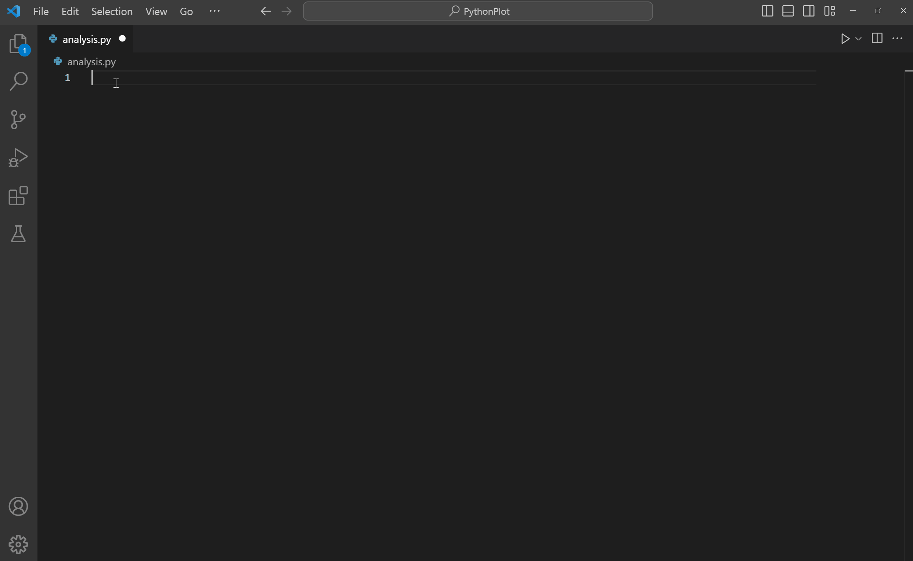
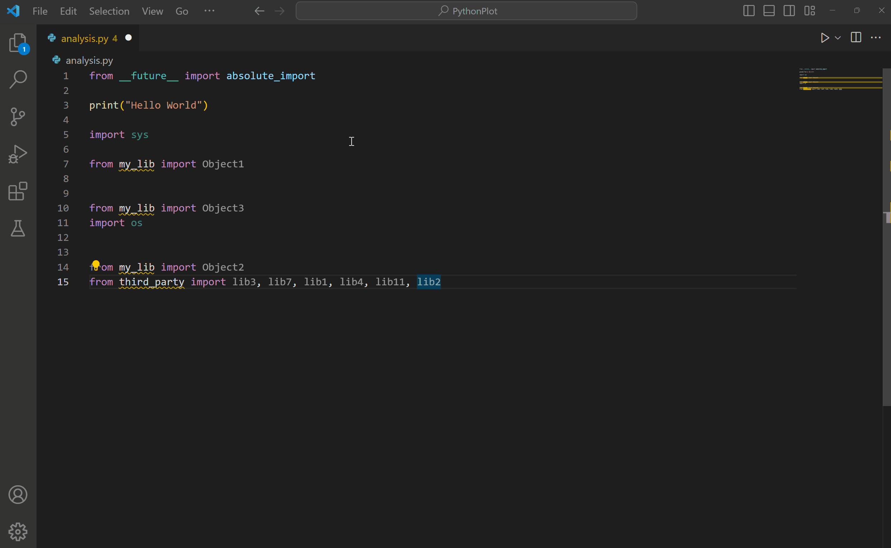

# Visual Studio Code에서 Python 편집하기 {#editing-python-in-visual-studio-code}

Visual Studio Code는 Python 소스 코드를 위한 강력한 편집 도구입니다. 이 편집기는 코드를 작성할 때 생산성을 높일 수 있는 다양한 기능을 포함하고 있습니다. Visual Studio Code에서 편집하는 방법에 대한 자세한 내용은 [기본 편집](/docs/editor/codebasics.md) 및 [코드 탐색](/docs/editor/editingevolved.md)을 참조하세요.

이 개요에서는 [Python 확장](https://marketplace.visualstudio.com/items?itemName=ms-python.python)에서 제공하는 특정 편집 기능과 이러한 기능을 사용자 및 작업 공간 [설정](/docs/editor/settings.md)을 통해 사용자화하는 방법에 대해 설명합니다.

## 자동 완성과 IntelliSense {#autocomplete-and-intellisense}

IntelliSense는 코드 완성과 관련된 코드 편집 기능을 총칭하는 일반 용어입니다. 아래 예제를 잠시 살펴보세요. **print**를 입력하면 IntelliSense가 자동 완성 옵션을 채워주는 것을 확인할 수 있습니다. 사용자가 **greeting**이라는 변수의 이름을 입력하기 시작하면 옵션 목록도 제공됩니다.


자동 완성과 IntelliSense는 현재 작업 폴더 내의 모든 파일에 대해 제공됩니다. 또한 표준 위치에 설치된 Python 패키지에 대해서도 사용할 수 있습니다.

[Pylance](https://marketplace.visualstudio.com/items?itemName=ms-python.vscode-pylance)는 VS Code에서 Python의 기본 언어 서버이며, IntelliSense 기능을 제공하기 위해 Python 확장과 함께 설치됩니다.

Pylance는 Microsoft의 [Pyright](https://github.com/microsoft/pyright) 정적 타입 검사 도구를 기반으로 하며, [타입 스텁](https://typing.readthedocs.io/en/latest/source/stubs.html) (`.pyi` 파일) 및 지연 타입 추론을 활용하여 매우 높은 성능의 개발 경험을 제공합니다.

IntelliSense에 대한 자세한 내용은 [IntelliSense](/docs/editor/intellisense.md)를 참조하세요.

> **팁**: [VS Code용 IntelliCode 확장](https://go.microsoft.com/fwlink/?linkid=2006060)을 확인해 보세요. IntelliCode는 현재 코드 컨텍스트에 따라 가장 관련성 높은 자동 완성을 추론하는 등 Python의 IntelliSense를 위한 AI 지원 기능 세트를 제공합니다. 자세한 내용은 [VS Code용 IntelliCode FAQ](https://learn.microsoft.com/visualstudio/intellicode/intellicode-visual-studio-code)를 참조하세요.

### IntelliSense 동작 사용자화 {#customize-intellisense-behavior}

기본적으로 IntelliSense 기능의 전체 세트를 활성화하면 개발 경험이 느려질 수 있으므로, Python 확장은 생산성을 유지하면서도 성능이 좋은 경험을 제공할 수 있도록 최소한의 기능 세트를 활성화합니다. 그러나 여러 설정을 통해 분석 엔진의 동작을 원하는 대로 사용자화할 수 있습니다.

### 자동 가져오기 활성화 {#enable-auto-imports}

Pylance는 작업 공간 내의 모듈 및 환경에 설치된 패키지에 대한 자동 가져오기 제안을 제공합니다. 편집기에서 입력할 때 자동 완성 제안을 받을 수 있습니다. 제안을 수락하면 자동 가져오기가 해당 가져오기 문을 파일에 자동으로 추가합니다.

설정에서 `python.analysis.autoImportCompletions`를 `true`로 설정하여 자동 가져오기를 활성화할 수 있습니다. 기본적으로 자동 가져오기는 비활성화되어 있습니다.


### 사용자 정의 패키지 위치에 대한 IntelliSense 활성화 {#enable-intellisense-for-custom-package-locations}

비표준 위치에 설치된 패키지에 대한 IntelliSense를 활성화하려면, `settings.json` 파일의 `python.analysis.extraPaths` 컬렉션에 해당 위치를 추가하세요 (기본 컬렉션은 비어 있습니다). 예를 들어, Flask를 사용하는 경우 `app.yaml`에 지정된 사용자 정의 위치에 Google App Engine이 설치되어 있을 수 있습니다. 이 경우, 다음과 같이 해당 위치를 지정할 수 있습니다:

**Windows:**

```json
"python.analysis.extraPaths": [
    "C:/Program Files (x86)/Google/google_appengine",
    "C:/Program Files (x86)/Google/google_appengine/lib/flask-0.12"]
```

**macOS/Linux:**

```json
"python.analysis.extraPaths": [
    "~/.local/lib/Google/google_appengine",
    "~/.local/lib/Google/google_appengine/lib/flask-0.12" ]
```

사용 가능한 IntelliSense 제어의 전체 목록은 Python 확장 [코드 분석 설정](/docs/python/settings-reference.md#code-analysis-settings) 및 [자동 완성 설정](/docs/python/settings-reference.md#autocomplete-settings)을 참조하세요.

자동 완성과 IntelliSense의 일반적인 동작을 사용자화하거나 기능을 완전히 비활성화할 수도 있습니다. [IntelliSense 사용자화](/docs/editor/intellisense.md#customizing-intellisense)에서 더 많은 정보를 확인할 수 있습니다.

## AI로 완성 향상하기 {#enhance-completions-with-ai}

[GitHub Copilot](https://copilot.github.com/)는 코드를 더 빠르고 스마트하게 작성할 수 있도록 도와주는 AI 기반 코드 완성 도구입니다. VS Code에서 [GitHub Copilot 확장](https://marketplace.visualstudio.com/items?itemName=GitHub.copilot)을 사용하여 코드를 생성하거나 생성된 코드에서 학습할 수 있습니다.

[](https://marketplace.visualstudio.com/items?itemName=GitHub.copilot)

GitHub Copilot은 여러 언어와 다양한 프레임워크에 대한 제안을 제공하며, Python, JavaScript, TypeScript, Ruby, Go, C#, C++에 특히 잘 작동합니다.

Copilot을 시작하는 방법에 대한 자세한 내용은 [Copilot 문서](/docs/editor/github-copilot.md)를 참조하세요.

## 탐색 {#navigation}

편집 중에 다양한 식별자에서 마우스 오른쪽 버튼을 클릭하여 여러 편리한 명령을 활용할 수 있습니다.

- **정의로 이동** (`kb(editor.action.revealDefinition)`)은 코드에서 객체를 정의하는 코드로 점프합니다. 이 명령은 라이브러리 작업 시 유용합니다.

- **정의 미리 보기** (`kb(editor.action.peekDefinition)`)는 비슷하지만, 편집기에서 직접 정의를 표시합니다 (코드가 가려지지 않도록 편집기 창에 공간을 만듭니다). `kbstyle(Escape)`를 눌러 미리 보기 창을 닫거나 오른쪽 상단의 **x**를 사용하세요.

- **선언으로 이동**은 변수 또는 다른 객체가 코드에서 선언된 지점으로 점프합니다.

- **선언 미리 보기**는 비슷하지만, 편집기에서 직접 선언을 표시합니다. 다시 한 번, `kbstyle(Escape)` 또는 오른쪽 상단의 **x**를 사용하여 미리 보기 창을 닫습니다.

## 빠른 수정 {#quick-fixes}

### 가져오기 추가 {#add-import}

Pylance를 사용할 때, 가져오기 추가 빠른 수정 기능을 통해 환경에 설치된 모듈의 가져오기 문을 빠르게 완성할 수 있습니다. 편집기에서 패키지 이름을 입력하기 시작하면, 소스 코드의 줄을 자동으로 완성할 수 있는 코드 작업이 제공됩니다. 텍스트(물결표로 표시된 부분)에 마우스를 올리고 코드 작업 아이콘을 선택하세요. 그런 다음 가능한 가져오기 목록에서 선택할 수 있습니다.


이 코드 작업은 다음과 같은 일반 Python 패키지에 대한 인기 있는 약어를 인식합니다: `numpy`는 np, `tensorflow`는 tf, `pandas`는 pd, `matplotlib.pyplot`은 plt, `matplotlib`은 mpl, `math`는 m, `scipy.io`는 spio, `scipy`는 sp, `panel`은 pn, `holoviews`는 hv로 인식됩니다.



가져오기 제안 목록은 가장 최근에 사용된 가져오기, 동일 모듈의 기호, 표준 라이브러리의 기호, 사용자 모듈의 기호, 타사 패키지의 기호, 마지막으로 모듈 및 기호 이름으로 정렬된 상위 3개의 높은 신뢰도 가져오기 옵션을 표시합니다.

### 추가 가져오기 일치 검색 {#search-for-additional-import-matches}

기본적으로, 가져오기 추가 빠른 수정은 3개의 높은 신뢰도 가져오기 옵션만 표시합니다. 원하는 항목이 목록에 없으면, Pylance의 **추가 가져기 일치 검색** 빠른 수정을 사용하여 누락된 가져오기 오류를 해결할 수 있습니다. 이 빠른 수정은 누락된 가져오기 기호와 접두사가 일치하는 가져오기 옵션을 검색할 수 있는 빠른 선택 메뉴를 표시합니다.


### 철자 변경 {#change-spelling}

Pylance는 해결되지 않은 변수나 누락된 가져오기 진단에서 **철자 변경** 빠른 수정을 표시합니다. 이는 오타로 인해 발생할 가능성이 있는 경우입니다. 이 코드 작업은 작업 공간에서 발견된 가장 가까운 일치 항목을 기반으로 기호의 올바른 철자를 제안합니다.


> **참고**: 사용자 기호에 대해 이러한 빠른 수정은 정의된 파일에서만 가져기를 제안합니다. 외부/가져온 사용자 기호의 파일에서 가져오기 제안은 지원되지 않습니다.
>
> 또한 설치된 패키지에서 오는 기호(일반적으로 Python 환경의 `site-packages` 폴더에 위치)는 패키지의 루트 폴더, 예를 들어 `__init__.py` 파일에 정의된 것만 이 빠른 수정에서 제안됩니다. 특정 패키지에 대해 이 동작을 사용자화할 수 있는 `python.analysis.packageIndexDepths` 설정이 있지만, 이는 Pylance의 성능에 영향을 미칠 수 있습니다.

## 리팩토링 {#refactorings}

Python 확장은 Pylance 확장을 통해 다음과 같은 리팩토링 기능을 추가합니다: **변수 추출**, **메서드 추출**, **모듈 이름 변경**, **기호 이동** 및 **모든 상속된 추상 클래스 구현**. 또한 **가져오기 정렬**과 같은 추가 리팩토링 기능을 구현하는 확장을 지원합니다.

### 변수 추출 {#extract-variable}

현재 범위 내에서 선택된 텍스트의 모든 유사한 발생을 추출하고 새로운 변수로 대체합니다.

변수를 추출하려는 코드 줄을 선택하여 이 명령을 호출할 수 있습니다. 그런 다음 그 옆에 표시된 전구 아이콘을 선택하세요.


### 메서드 추출 {#extract-method}

현재 범위 내에서 선택된 표현식이나 블록의 모든 유사한 발생을 추출하고 메서드 호출로 대체합니다.

메서드로 추출하려는 코드 줄을 선택하여 이 명령을 호출할 수 있습니다. 그런 다음 그 옆에 표시된 전구 아이콘을 선택하세요.


### 모듈 이름 변경 {#rename-module}

Python 파일/모듈의 이름이 변경된 후, Pylance는 업데이트가 필요할 수 있는 모든 인스턴스를 찾아내고 모든 변경 사항의 미리 보기를 제공합니다.

어떤 참조를 업데이트해야 하는지 사용자화하려면 **리팩토링 미리 보기**에서 줄 또는 파일 수준에서 체크박스를 전환할 수 있습니다. 선택을 마친 후 **리팩토링 적용** 또는 **리팩토링 취소**를 선택할 수 있습니다.


### 기호 이동 {#move-symbol}

Pylance 확장은 기호를 다른 파일로 이동하는 과정을 간소화하기 위해 두 가지 코드 작업을 제공합니다:

- **기호를...로 이동**: 기호를 이동할 대상 파일을 선택하는 파일 선택기를 표시합니다.
- **기호를 새 파일로 이동**: 기호 이름으로 새 파일을 생성하며, 이는 코드 작업이 호출된 소스 파일과 동일한 디렉터리에 위치합니다.

이 코드 작업에 접근하려면 이동하려는 기호 위에 마우스를 올리고 원하는 작업 옆에 나타나는 전구 아이콘을 선택하세요. 또는 기호에서 마우스 오른쪽 버튼을 클릭하고 컨텍스트 메뉴에서 **리팩토링...**을 선택할 수 있습니다.


### 모든 상속된 추상 클래스 구현 {#implement-all-inherited-abstract-classes}

Python에서 추상 클래스는 다른 클래스의 "청사진" 역할을 하며, 하위 클래스가 준수해야 할 명확한 구조와 요구 사항을 촉진하여 모듈화되고 재사용 가능한 코드를 구축하는 데 도움을 줍니다. Python에서 추상 클래스를 정의하려면 `abc` 모듈의 `ABC` 클래스를 상속받는 클래스를 만들고, 그 메서드에 `@abstractmethod` 데코레이터를 추가하면 됩니다. 그런 다음 이 추상 클래스를 상속받는 새로운 클래스를 만들고 기본 메서드에 대한 구현을 정의할 수 있습니다.

Pylance는 이러한 클래스를 생성하는 과정을 간소화하기 위해 코드 작업을 제공합니다. 추상 클래스를 상속받는 새로운 클래스를 정의할 때, 이제 **모든 상속된 추상 클래스 구현** 코드 작업을 사용하여 부모 클래스의 모든 추상 메서드와 속성을 자동으로 구현할 수 있습니다:


### 가져오기 정렬 {#sort-imports}

Python 확장은 **가져오기 정렬** 기능을 구현하는 [isort](https://marketplace.visualstudio.com/items?itemName=ms-python.isort) 및 [Ruff](https://marketplace.visualstudio.com/items?itemName=charliermarsh.ruff)와 같은 확장을 지원합니다. 이 명령은 동일한 모듈의 특정 가져기를 하나의 `import` 문으로 통합하고, `import` 문을 알파벳 순으로 정리합니다.

가져오기 정렬을 지원하는 확장을 설치한 후, 명령 팔레트(`kb(workbench.action.showCommands)`)를 열고 **가져오기 정리**를 실행하여 이 기능을 호출할 수 있습니다.

> **팁**: `editor.action.organizeImports` 명령에 키보드 단축키를 할당할 수 있습니다.



## 문제 해결 {#troubleshooting}

일반적인 IntelliSense 및 Python 편집 문제에 대한 도움은 아래 표를 확인하세요:

| 문제                                                                                                              | 원인                                                                                                                                                                                                                                                                                             | 해결책                                                                                                                                                                                                                                                                                                                                                                                                                                              |
| -------------------------------------------------------------------------------------------------------------------- | ------------------------------------------------------------------------------------------------------------------------------------------------------------------------------------------------------------------------------------------------------------------------------------------------- | ----------------------------------------------------------------------------------------------------------------------------------------------------------------------------------------------------------------------------------------------------------------------------------------------------------------------------------------------------------------------------------------------------------------------------------------------------- |
| Pylance가 가져오기 추가 시 최상위 기호 옵션만 제공하고 있습니다.                                               | 기본적으로 최상위 모듈만 인덱싱됩니다 (깊이=1). <br />예를 들어, 기본적으로 `import matplotlib`는 제안되지만 `import matplotlib.pyplot`는 제안되지 않을 수 있습니다.                                                                                                                      | `python.analysis.packageIndexDepths`를 통해 Pylance가 설치된 라이브러리를 인덱싱할 수 있는 깊이를 늘려보세요. [코드 분석 설정](/docs/python/settings-reference.md#code-analysis-settings)을 확인하세요.                                                                                                                                                                                                                             |
| Pylance가 누락된 가져기를 자동으로 추가하지 않습니다.                                                                  | 자동 가져오기 완성 설정이 비활성화되어 있을 수 있습니다.                                                                                                                                                                                                                                               | [자동 가져오기 활성화 섹션](/docs/python/editing.md#customize-intellisense-behavior)을 확인하세요.                                                                                                                                                                                                                                                                                                                                                     |
| 자동 가져오기가 활성화되어 있지만 Pylance가 작업 공간의 다른 파일에 정의된 기호를 자동으로 가져오지 않습니다. | 사용자 정의 기호(설치된 패키지나 라이브러리에서 오는 것이 아닌)는 편집기에서 열린 파일에서 이미 사용된 경우에만 자동으로 가져옵니다.<br /> 그렇지 않으면 [가져오기 추가 빠른 수정](/docs/python/editing.md#quick-fixes)을 통해서만 사용할 수 있습니다. | 가져오기 추가 빠른 수정을 사용하거나, 먼저 작업 공간에서 관련 파일을 열어보세요.                                                                                                                                                                                                                                                                                                                                                       |
| Pylance가 큰 작업 공간에서 느리거나 너무 많은 메모리를 사용하고 있는 것 같습니다.                                | Pylance 분석은 주어진 작업 공간에 있는 모든 파일에서 수행됩니다.                                                                                                                                                                                                                               | Pylance의 분석에서 제외할 수 있는 하위 폴더가 있다면, 해당 경로를 `python.analysis.exclude` 설정에 추가할 수 있습니다. 또는 `python.analysis.indexing`을 `false`로 설정하여 Pylance의 인덱서를 비활성화할 수 있습니다 (**참고**: 이렇게 하면 완성과 자동 가져오기 경험에도 영향을 미칩니다. [코드 분석 설정](/docs/python/settings-reference.md#code-analysis-settings)에서 인덱싱에 대해 더 알아보세요). |
| Python 프로젝트에 사용자 정의 모듈을 설치할 수 없습니다.                                                  | 사용자 정의 모듈이 비표준 위치에 있습니다 (pip을 사용하여 설치되지 않음).                                                                                                                                                                                                                | 해당 위치를 `python.autoComplete.extraPaths` 설정에 추가하고 VS Code를 재시작하세요.                                                                                                                                                                                                                                                                                                                                                                 |

### Pylance 진단 {#pylance-diagnostics}

Pylance는 기본적으로 문제 패널에서 Python 파일에 대한 진단을 제공합니다.

아래 목록은 Pylance에서 제공하는 가장 일반적인 진단과 이를 해결하는 방법입니다.

#### importResolveSourceFailure {#importresolvesourcefailure}

이 오류는 Pylance가 가져온 패키지에 대한 타입 스텁을 찾을 수 있지만, 패키지 자체를 찾을 수 없을 때 발생합니다. 이는 가져오려는 패키지가 선택한 Python 환경에 설치되어 있지 않을 때 발생할 수 있습니다.

**해결 방법**

- 패키지가 다른 인터프리터나 커널에 이미 설치되어 있는 경우, [올바른 인터프리터 선택](/docs/python/environments.md#select-and-activate-an-environment)을 수행하세요.
- 패키지가 설치되어 있지 않은 경우, 활성화된 터미널에서 다음 명령을 실행하여 설치할 수 있습니다: `python -m pip install {package_name}`.

#### importResolveFailure {#importresolvefailure}

이 오류는 Pylance가 가져오려는 패키지나 모듈, 또는 그 타입 스텁을 찾을 수 없을 때 발생합니다.

**해결 방법**

- 모듈을 가져오는 경우, 해당 모듈이 작업 공간에 존재하거나 `python.autoComplete.extraPaths` 설정에 포함된 위치에 있는지 확인하세요.
- 설치되지 않은 패키지를 가져오는 경우, 활성화된 터미널에서 다음 명령을 실행하여 설치할 수 있습니다: `python -m pip install {package_name}`.
- 다른 인터프리터나 커널에 이미 설치된 패키지를 가져오는 경우, [올바른 인터프리터 선택](/docs/python/environments.md#select-and-activate-an-environment)을 수행하세요.
- 편집 가능한 설치를 사용하고 있고 현재 가져오기 훅을 사용하도록 설정되어 있는 경우, 호환성을 높이고 더 원활한 가져오기 동작을 보장하기 위해 파일 경로만 포함된 `.pth` 파일을 사용하는 것으로 전환하는 것을 고려하세요. [Pyright 문서](https://microsoft.github.io/pyright/#/import-resolution?id=editable-installs)에서 더 알아보세요.

#### importCycleDetected {#importcycledetected}

이 오류는 Pylance가 두 개 이상의 모듈 간의 순환 종속성을 감지할 때 발생합니다.

**해결 방법**

가져오기 문을 재정렬하여 순환 종속성을 끊어보세요.

---

Pylance의 진단 심각도는 `python.analysis.diagnosticSeverityOverrides` 설정을 통해 사용자화할 수 있습니다. 더 많은 정보는 [설정 참조](/docs/python/settings-reference.md)를 확인하세요.

## 다음 단계 {#next-steps}

- [Linting](/docs/python/linting.md) - 다양한 Python 린터를 활성화, 구성 및 적용합니다.
- [Debugging](/docs/python/debugging.md) - Python을 로컬 및 원격으로 디버깅하는 방법을 배웁니다.
- [Testing](/docs/python/testing.md) - 테스트 환경을 구성하고 테스트를 발견, 실행 및 디버깅합니다.
- [기본 편집](/docs/editor/codebasics.md) - 강력한 VS Code 편집기에 대해 알아봅니다.
- [코드 탐색](/docs/editor/editingevolved.md) - 소스 코드를 빠르게 이동합니다.
- [IntelliSense](/docs/editor/intellisense.md) - IntelliSense 기능에 대해 알아봅니다.
- [Jupyter 지원](/docs/datascience/jupyter-notebooks.md) - Jupyter 노트북을 시작하는 방법을 배웁니다.
- [Python 확장 템플릿](/api/advanced-topics/python-extension-template.md) - 좋아하는 Python 도구를 통합하는 확장을 만듭니다.