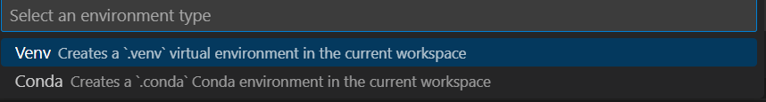
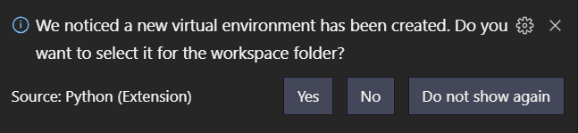
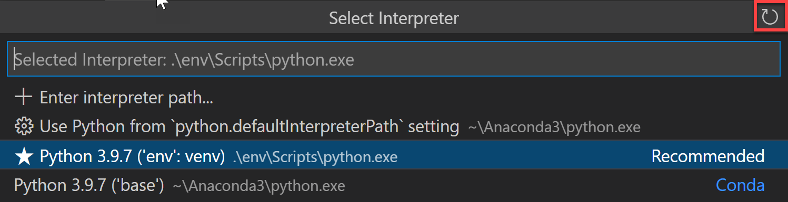
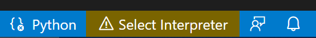
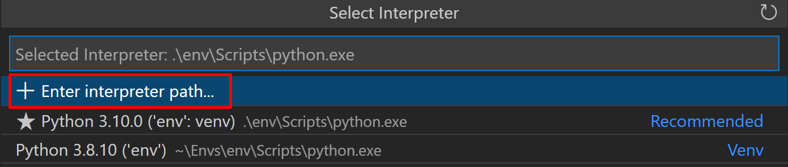
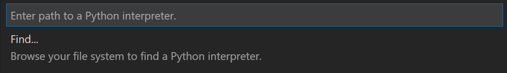

# VS Code에서의 Python 환경 {#python-environments-in-vs-code}

Python에서 "환경"은 Python 프로그램이 실행되는 맥락으로, 인터프리터와 설치된 패키지의 수를 포함합니다.

> **참고**: Python 프로그래밍 언어에 대해 더 익숙해지고 싶다면 [추가 Python 자료](#more-python-resources)를 검토하세요.

## Python 환경의 종류 {#types-of-python-environments}

### 글로벌 환경 {#global-environments}

기본적으로 설치된 모든 Python 인터프리터는 자체 **글로벌 환경**에서 실행됩니다. 예를 들어, 새 터미널에서 `python`, `python3`, 또는 `py`를 실행하면 (Python을 설치한 방법에 따라) 해당 인터프리터의 글로벌 환경에서 실행되는 것입니다. 설치하거나 제거하는 모든 패키지는 글로벌 환경과 그 안에서 실행되는 모든 프로그램에 영향을 미칩니다.

> **팁**: Python에서는 작업 공간 전용 환경을 만드는 것이 모범 사례입니다. 예를 들어, 로컬 환경을 사용하는 것입니다.

### 로컬 환경 {#local-environments}

작업 공간을 위해 생성할 수 있는 두 가지 유형의 환경이 있습니다: **가상** 및 **conda**. 이러한 환경은 다른 환경에 영향을 주지 않고 패키지를 설치할 수 있게 하여 작업 공간의 패키지 설치를 격리합니다.

#### 가상 환경 {#virtual-environments}

[**가상 환경**](https://docs.python.org/3/glossary.html#term-virtual-environment)은 환경을 생성하는 내장 방법입니다. 가상 환경은 특정 인터프리터에 대한 복사본(또는 심볼릭 링크)을 포함하는 폴더를 생성합니다. 가상 환경에 패키지를 설치하면 이 새로운 폴더에 설치되며, 따라서 다른 작업 공간에서 사용하는 다른 패키지와 격리됩니다.

> **참고**: 가상 환경 폴더를 작업 공간으로 여는 것은 가능하지만, 그렇게 하는 것은 권장되지 않으며 Python 확장 사용에 문제가 발생할 수 있습니다.

#### Conda 환경 {#conda-environments}

**conda 환경**은 `conda` 패키지 관리자를 사용하여 관리되는 Python 환경입니다 (자세한 내용은 [conda 시작하기](https://conda.io/projects/conda/en/latest/user-guide/getting-started.html)를 참조하세요). conda와 가상 환경 중에서 선택하는 것은 패키징 요구 사항, 팀 표준 등에 따라 다릅니다.

### Python 환경 도구 {#python-environment-tools}

다음 표는 Python 환경과 관련된 다양한 도구를 나열합니다:

|                        도구                         | 정의 및 목적                                                                                                                                                                          |
| :-------------------------------------------------: | ----------------------------------------------------------------------------------------------------------------------------------------------------------------------------------- |
|             [pip](https://pip.pypa.io/)             | 패키지를 설치하고 업데이트하는 Python 패키지 관리자입니다. 기본적으로 Python 3.9+와 함께 설치됩니다 (Debian 기반 OS에서는 `python3-pip`를 설치해야 합니다).            |
| [venv](https://docs.python.org/3/library/venv.html) | 서로 다른 프로젝트에 대해 별도의 패키지 설치를 관리할 수 있게 해주며, 기본적으로 Python 3와 함께 설치됩니다 (Debian 기반 OS에서는 `python3-venv`를 설치해야 합니다). |
|           [conda](https://docs.conda.io/)           | [**Miniconda**](https://docs.conda.io/en/latest/miniconda.html)와 함께 설치됩니다. 패키지와 가상 환경 모두를 관리하는 데 사용할 수 있습니다. 일반적으로 데이터 과학 프로젝트에 사용됩니다.      |

## 환경 생성 {#creating-environments}

### Create Environment 명령 사용 {#using-the-create-environment-command}

VS Code에서 가상 환경이나 Anaconda를 사용하여 로컬 환경을 생성하려면 다음 단계를 따르세요: 명령 팔레트(`kb(workbench.action.showCommands)`)를 열고 **Python: Create Environment** 명령을 검색하여 선택합니다.

명령은 환경 유형 목록을 표시합니다: **Venv** 또는 **Conda**.



**Venv**를 사용하여 환경을 생성하는 경우, 명령은 새로운 가상 환경의 기본으로 사용할 수 있는 인터프리터 목록을 표시합니다.


**Conda**를 사용하여 환경을 생성하는 경우, 명령은 프로젝트에 사용할 수 있는 Python 버전 목록을 표시합니다.


원하는 인터프리터 또는 Python 버전을 선택한 후, 환경 생성 진행 상황을 보여주는 알림이 표시되며, 환경 폴더가 작업 공간에 나타납니다.


> **참고**: 이 명령은 또한 프로젝트 폴더에 위치한 `requirements.txt`, `pyproject.toml`, 또는 `environment.yml`과 같은 요구 사항/종속성 파일에 명시된 필요한 패키지를 설치합니다. 또한 가상 환경에 `.gitignore` 파일을 추가하여 가상 환경이 소스 제어에 실수로 커밋되는 것을 방지합니다.

### 터미널에서 가상 환경 생성 {#create-a-virtual-environment-in-the-terminal}

가상 환경을 수동으로 생성하려면 다음 명령을 사용하세요 (여기서 ".venv"는 환경 폴더의 이름입니다):

```bash
# macOS/Linux {#macoslinux}
# Debian 기반 OS에서는 먼저 `sudo apt-get install python3-venv`를 실행해야 할 수 있습니다. {#you-may-need-to-run-sudo-apt-get-install-python3-venv-first-on-debian-based-oss}
python3 -m venv .venv

# Windows {#windows}
# `py -3 -m venv .venv`를 사용할 수도 있습니다. {#you-can-also-use-py--3--m-venv-venv}
python -m venv .venv
```

> **참고**: `venv` 모듈에 대해 더 알아보려면 Python.org의 [가상 환경 생성](https://docs.python.org/3/library/venv.html)을 읽어보세요.

새로운 가상 환경을 생성하면 VS Code에서 작업 공간을 선택할 수 있도록 프롬프트가 표시됩니다.



> **팁**: 소스 제어 설정을 업데이트하여 가상 환경이 실수로 커밋되지 않도록 하세요 (예: `.gitignore`에 추가). 가상 환경은 이식성이 없기 때문에 일반적으로 다른 사람들이 사용할 수 있도록 커밋하는 것은 의미가 없습니다.

### 터미널에서 conda 환경 생성 {#create-a-conda-environment-in-the-terminal}

Python 확장은 기존 conda 환경을 자동으로 감지합니다. conda 환경에 Python 인터프리터를 설치하는 것이 좋습니다. 그렇지 않으면 환경을 선택한 후에 하나가 설치됩니다. 예를 들어, 다음 명령은 Python 3.9 인터프리터와 여러 라이브러리를 가진 `env-01`이라는 이름의 conda 환경을 생성합니다:

```bash
conda create -n env-01 python=3.9 scipy=0.15.0 numpy
```

> **참고**: conda 명령줄에 대한 자세한 정보는 [Conda 환경](https://conda.io/docs/user-guide/tasks/manage-environments.html)을 읽어보세요.

추가 참고 사항:

- VS Code가 실행 중일 때 새로운 conda 환경을 생성하면 **Python: Select Interpreter** 창의 오른쪽 상단에 있는 새로 고침 아이콘을 사용하세요. 그렇지 않으면 그곳에서 환경을 찾지 못할 수 있습니다.

  

- 셸 관점에서 환경이 제대로 설정되었는지 확인하려면 Anaconda 프롬프트를 사용하고 원하는 환경을 활성화하세요. 그런 다음 `code .` 명령을 입력하여 VS Code를 시작할 수 있습니다. VS Code가 열리면 명령 팔레트를 사용하거나 상태 표시줄을 클릭하여 인터프리터를 선택할 수 있습니다.

- VS Code의 Python 확장은 현재 conda `environment.yml` 파일과 직접 통합되지 않지만, VS Code 자체는 훌륭한 YAML 편집기입니다.

- PowerShell이 기본 셸로 설정된 경우, VS Code 통합 터미널에서 conda 환경이 자동으로 활성화되지 않습니다. 셸을 변경하려면 [통합 터미널 - 터미널 프로필](/docs/terminal/profiles.md)을 참조하세요.

- 활성화를 위해 사용할 `conda` 실행 파일의 경로를 수동으로 지정할 수 있습니다 (버전 4.4+). 그렇게 하려면 명령 팔레트를 열고(`kb(workbench.action.showCommands)`) **Preferences: Open User Settings**를 실행하세요. 그런 다음 사용자 설정의 Python 확장 섹션에 있는 `python.condaPath`를 적절한 경로로 설정하세요.

## Python 인터프리터 작업하기 {#working-with-python-interpreters}

### 환경 선택 및 활성화 {#select-and-activate-an-environment}

Python 확장은 작업 공간에 가장 적합한 환경을 찾고 선택하려고 합니다. 특정 환경을 선택하려면 **Command Palette**(`kb(workbench.action.showCommands)`)에서 **Python: Select Interpreter** 명령을 사용하세요.


> **참고**: Python 확장이 인터프리터를 찾지 못하면 경고를 발행합니다. macOS 12.2 및 이전 버전에서는 OS에 설치된 Python 인터프리터를 사용하는 경우 호환성 문제로 인해 경고가 발생합니다. 두 경우 모두, 사용자 [설정](/docs/editor/settings.md)에서 `python.disableInstallationCheck`를 `true`로 설정하여 이러한 경고를 비활성화할 수 있습니다.

**Python: Select Interpreter** 명령은 사용 가능한 글로벌 환경, conda 환경 및 가상 환경의 목록을 표시합니다. (이러한 환경 유형 간의 구별을 포함하여 확장이 환경을 찾는 위치에 대한 자세한 내용은 [확장이 환경을 찾는 위치](#where-the-extension-looks-for-environments) 섹션을 참조하세요.) 예를 들어, 다음 이미지는 여러 Anaconda 및 CPython 설치와 함께 작업 공간 폴더 내에 있는 가상 환경(`env`)을 보여줍니다:


> **참고:** Windows에서는 VS Code가 사용 가능한 conda 환경을 감지하는 데 시간이 걸릴 수 있습니다. 이 과정에서 환경 경로 앞에 "(cached)"가 표시될 수 있습니다. 이 레이블은 VS Code가 현재 해당 환경에 대한 캐시된 정보를 사용하고 있음을 나타냅니다.

VS Code에서 폴더나 작업 공간을 열고 목록에서 인터프리터를 선택하면 Python 확장은 해당 정보를 내부적으로 저장합니다. 이렇게 하면 작업 공간을 다시 열 때 동일한 인터프리터가 사용됩니다.

선택된 환경은 Python 코드 실행( **Python: Run Python File in Terminal** 명령 사용), 언어 서비스 제공(자동 완성, 구문 검사, 린팅, 포맷팅 등) 및 **Terminal: Create New Terminal** 명령으로 터미널을 열 때 Python 확장에서 사용됩니다. 후자의 경우, VS Code는 자동으로 선택된 환경을 활성화합니다.

> **팁**: 선택된 환경의 자동 활성화를 방지하려면 `settings.json` 파일에 `"python.terminal.activateEnvironment": false`를 추가하세요 (기존 설정과 형제 관계로 어디에나 배치할 수 있습니다).

> **팁**: 활성화 명령이 "Activate.ps1은 디지털 서명이 없습니다. 현재 시스템에서 이 스크립트를 실행할 수 없습니다."라는 메시지를 생성하면, 스크립트 실행을 허용하기 위해 PowerShell 실행 정책을 일시적으로 변경해야 합니다 (PowerShell 문서의 [실행 정책에 대한 설명](https://go.microsoft.com/fwlink/?LinkID=135170)을 참조하세요):
> `Set-ExecutionPolicy -ExecutionPolicy RemoteSigned -Scope Process`

> **참고**: 기본적으로 VS Code는 코드 디버깅 시 작업 공간에 선택된 인터프리터를 사용합니다. 디버그 구성의 `python` 속성에서 다른 경로를 지정하여 이 동작을 재정의할 수 있습니다. [디버깅 환경 선택](#choose-a-debugging-environment)을 참조하세요.

선택된 인터프리터 버전은 상태 표시줄의 오른쪽에 표시됩니다.


상태 표시줄은 선택된 인터프리터가 없을 때도 반영합니다.



어느 경우든 상태 표시줄의 이 영역을 클릭하면 **Python: Select Interpreter** 명령에 대한 편리한 바로 가기가 됩니다.

> **팁**: VS Code가 가상 환경을 인식하는 데 문제가 있는 경우, [문제를 제기해 주세요](https://github.com/microsoft/vscode-python/issues) 우리가 원인을 파악하는 데 도움을 드릴 수 있습니다.

### 인터프리터 수동 지정 {#manually-specify-an-interpreter}

VS Code가 사용하려는 인터프리터를 자동으로 찾지 못하는 경우, 파일 시스템에서 인터프리터를 찾아보거나 경로를 수동으로 제공할 수 있습니다.

**Python: Select Interpreter** 명령을 실행하고 인터프리터 목록 상단에 표시되는 **Enter interpreter path...** 옵션을 선택하여 수행할 수 있습니다:



그런 다음 텍스트 상자에 Python 인터프리터의 전체 경로를 직접 입력하거나 (예: ".venv/Scripts/python.exe"), **Find...** 버튼을 선택하여 파일 시스템을 탐색하여 선택하려는 Python 실행 파일을 찾을 수 있습니다.



작업 공간을 처음 열 때 사용할 기본 인터프리터를 수동으로 지정하려면 `python.defaultInterpreterPath` 설정에 대한 항목을 생성하거나 수정할 수 있습니다.

> **참고**: 인터프리터가 이미 작업 공간에 대해 선택된 후에는 `python.defaultInterpreterPath` 설정의 변경 사항이 반영되지 않습니다. 초기 인터프리터가 선택되면 설정의 모든 변경 사항은 무시됩니다.

또한 모든 Python 애플리케이션에 대한 기본 인터프리터를 설정하려면 사용자 설정 내에서 `python.defaultInterpreterPath`에 대한 항목을 수동으로 추가할 수 있습니다. 그렇게 하려면 명령 팔레트를 열고(`kb(workbench.action.showCommands)`) **Preferences: Open User Settings**를 입력하세요. 그런 다음 사용자 설정의 Python 확장 섹션에 있는 `python.defaultInterpreterPath`를 적절한 인터프리터로 설정하세요.

### 확장이 자동으로 환경을 선택하는 방법 {#how-the-extension-chooses-an-environment-automatically}

인터프리터가 지정되지 않은 경우, Python 확장은 다음 우선 순위에 따라 가장 높은 버전의 인터프리터를 자동으로 선택합니다:

1. 작업 공간 폴더 바로 아래에 위치한 가상 환경.
2. 작업 공간과 관련 있지만 전역적으로 저장된 가상 환경. 예를 들어, 작업 공간 폴더 외부에 위치한 [Pipenv](https://pypi.org/project/pipenv/) 또는 [Poetry](https://python-poetry.org/) 환경.
3. 전역적으로 설치된 인터프리터. 예를 들어, `/usr/local/bin`, `C:\\python38` 등에서 발견되는 인터프리터.

> **참고**: 선택된 인터프리터는 터미널에서 `python`이 참조하는 것과 다를 수 있습니다.

Visual Studio Code가 인터프리터를 자동으로 찾지 못하는 경우, [인터프리터를 수동으로 지정](#manually-specify-an-interpreter)할 수 있습니다.

### 확장이 환경을 찾는 위치 {#where-the-extension-looks-for-environments}

확장은 다음 위치에서 인터프리터를 자동으로 찾습니다. 순서는 중요하지 않습니다:

- `/usr/local/bin`, `/usr/sbin`, `/sbin`, `c:\\python36` 등과 같은 표준 설치 경로.
- 작업 공간(프로젝트) 폴더 바로 아래에 위치한 가상 환경.
- `python.venvPath` 설정에 의해 식별된 폴더에 위치한 가상 환경 (여러 가상 환경을 포함할 수 있음). 확장은 `venvPath`의 1단계 하위 폴더에서 가상 환경을 찾습니다.
- [virtualenvwrapper](https://virtualenvwrapper.readthedocs.io/)를 위한 `~/.virtualenvs` 폴더에 위치한 가상 환경.
- [pyenv](https://github.com/pyenv/pyenv), [Pipenv](https://pypi.org/project/pipenv/), 및 [Poetry](https://poetry.eustace.io/)에 의해 생성된 인터프리터.
- [virtualenvwrapper](https://virtualenvwrapper.readthedocs.io/)에서 사용되는 `WORKON_HOME`에 의해 식별된 경로에 위치한 가상 환경.
- `conda env list`에 의해 발견된 conda 환경. 인터프리터가 없는 conda 환경은 선택 시 하나가 설치됩니다.
- 작업 공간 폴더 아래의 [direnv](https://direnv.net/)를 위한 `.direnv` 폴더에 설치된 인터프리터.

### 환경과 터미널 창 {#environments-and-terminal-windows}

**Python: Select Interpreter**를 사용한 후, 해당 인터프리터는 파일을 마우스 오른쪽 버튼으로 클릭하고 **Python: Run Python File in Terminal**을 선택할 때 적용됩니다. 또한 **Terminal: Create New Terminal** 명령을 사용할 때 환경이 자동으로 활성화됩니다. 단, `python.terminal.activateEnvironment` 설정을 `false`로 변경한 경우는 제외입니다.

특정 Python 환경이 활성화된 셸에서 VS Code를 시작하면 기본 통합 터미널에서 해당 환경이 자동으로 활성화되지 않습니다.

> **참고:** PowerShell이 통합 셸로 설정된 경우, 통합 터미널에서 conda 환경이 자동으로 활성화되지 않습니다. 셸을 변경하려면 [통합 터미널 - 터미널 프로필](/docs/terminal/profiles.md)을 참조하세요.

**Python: Select Interpreter** 명령으로 인터프리터를 변경해도 이미 열려 있는 터미널 패널에는 영향을 미치지 않습니다. 따라서 분할 터미널에서 별도의 환경을 활성화할 수 있습니다: 첫 번째 인터프리터를 선택하고, 해당 인터프리터에 대한 터미널을 생성한 다음, 다른 인터프리터를 선택하고 터미널 제목 표시줄에서 분할 버튼(`kb(workbench.action.terminal.split)`)을 사용하세요.

### 디버깅 환경 선택 {#choose-a-debugging-environment}

기본적으로 디버거는 Python 확장에서 선택한 Python 인터프리터를 사용합니다. 그러나 `launch.json`의 디버그 구성에서 `python` 속성이 지정된 경우 우선합니다. 이 속성이 정의되지 않은 경우, 작업 공간에 대해 선택된 Python 인터프리터 경로를 사용하게 됩니다.

디버그 구성에 대한 자세한 내용은 [디버깅 구성](/docs/python/debugging.md)을 참조하세요.

## 환경 변수 {#environment-variables}

### 환경 변수 정의 파일 {#environment-variable-definitions-file}

환경 변수 정의 파일은 `environment_variable=value` 형식의 키-값 쌍을 포함하는 텍스트 파일로, `#`는 주석으로 사용됩니다. 여러 줄 값은 지원되지 않지만, 이전에 정의된 환경 변수를 참조하는 것은 허용됩니다. 환경 변수 정의 파일은 디버깅 및 도구 실행(린터, 포맷터, IntelliSense 및 테스트 도구 포함)과 같은 시나리오에 사용할 수 있지만, 터미널에는 적용되지 않습니다.

> **참고**: 환경 변수 정의 파일은 반드시 크로스 플랫폼이 아닙니다. 예를 들어, Unix는 환경 변수에서 경로 구분자로 `:`를 사용하지만, Windows는 `;`를 사용합니다. 이러한 운영 체제 차이에 대한 정규화는 없으므로, 환경 정의 파일이 사용하는 값이 운영 체제와 호환되는지 확인해야 합니다.

기본적으로 Python 확장은 현재 작업 공간 폴더에서 `.env`라는 이름의 파일을 찾고 로드한 다음, 해당 정의를 적용합니다. 이 파일은 사용자 설정에서 기본 항목 `"python.envFile": "$\{workspaceFolder\}/.env"`에 의해 식별됩니다 (자세한 내용은 [일반 Python 설정](/docs/python/settings-reference.md#general-python-settings)을 참조하세요). 언제든지 `python.envFile` 설정을 변경하여 다른 정의 파일을 사용할 수 있습니다.

> **참고**: 환경 변수 정의 파일은 환경 변수를 사용할 수 있는 모든 상황에서 사용되지 않습니다. Visual Studio Code 문서에서 달리 명시하지 않는 한, 이러한 파일은 정의에 따라 특정 시나리오에만 영향을 미칩니다. 예를 들어, 확장은 설정 값을 해결할 때 환경 변수 정의 파일을 사용하지 않습니다.

디버그 구성에는 `envFile` 속성도 포함되어 있으며, 기본적으로 현재 작업 공간의 `.env` 파일을 가리킵니다 (자세한 내용은 [디버깅 - 구성 옵션 설정](/docs/python/debugging.md#set-configuration-options)). 이 속성을 사용하면 기본 `.env` 파일에 지정된 변수를 대체하는 디버깅 목적으로 변수를 쉽게 설정할 수 있습니다.

예를 들어, 웹 애플리케이션을 개발할 때 개발 서버와 프로덕션 서버 간에 쉽게 전환하고 싶을 수 있습니다. 애플리케이션에 직접 다른 URL 및 기타 설정을 코딩하는 대신, 각기 다른 정의 파일을 사용할 수 있습니다. 예를 들어:

**dev.env 파일**

```bash
# dev.env - 개발 구성 {#devenv---development-configuration}

# API 엔드포인트 {#api-endpoint}
MYPROJECT_APIENDPOINT=https://my.domain.com/api/dev/

# 데이터베이스 변수 {#variables-for-the-database}
MYPROJECT_DBURL=https://my.domain.com/db/dev
MYPROJECT_DBUSER=devadmin
MYPROJECT_DBPASSWORD=!dfka**213=
```

**prod.env 파일**

```bash
# prod.env - 프로덕션 구성 {#prodenv---production-configuration}

# API 엔드포인트 {#api-endpoint}
MYPROJECT_APIENDPOINT=https://my.domain.com/api/

# 데이터베이스 변수 {#variables-for-the-database}
MYPROJECT_DBURL=https://my.domain.com/db/
MYPROJECT_DBUSER=coreuser
MYPROJECT_DBPASSWORD=kKKfa98*11@
```

그런 다음 `python.envFile` 설정을 `$\{workspaceFolder\}/prod.env`로 설정하고, 디버그 구성에서 `envFile` 속성을 `$\{workspaceFolder\}/dev.env`로 설정할 수 있습니다.

> **참고**: 여러 방법으로 환경 변수가 지정된 경우, 우선 순위가 있습니다. `launch.json` 파일에 정의된 모든 `env` 변수는 사용자 또는 작업 공간에 의해 지정된 `.env` 파일의 변수 값을 덮어씁니다. 마찬가지로, `launch.json` 파일에 정의된 `env` 변수는 `launch.json`에 지정된 `envFile`에서 정의된 환경 변수를 덮어씁니다.

### PYTHONPATH 변수 사용 {#use-of-the-pythonpath-variable}

[PYTHONPATH](https://docs.python.org/3/using/cmdline.html#envvar-PYTHONPATH) 환경 변수는 Python 인터프리터가 모듈을 찾기 위해 추가로 검색해야 하는 위치를 지정합니다. VS Code에서 PYTHONPATH는 터미널 설정(`terminal.integrated.env.*`)을 통해 설정할 수 있으며, 또는 `.env` 파일 내에서도 설정할 수 있습니다.

터미널 설정이 사용될 때, PYTHONPATH는 사용자가 터미널 내에서 실행하는 모든 도구와 디버깅과 같은 터미널을 통해 라우팅되는 확장의 모든 작업에 영향을 미칩니다. 그러나 이 경우, 린터나 포맷터와 같이 터미널을 통해 라우팅되지 않는 작업을 수행할 때는 이 설정이 모듈 검색에 영향을 미치지 않습니다.

## 다음 단계 {#next-steps}

- [코드 편집하기](/docs/python/editing.md) - Python에 대한 자동 완성, IntelliSense, 포맷팅 및 리팩토링에 대해 알아보세요.
- [디버깅](/docs/python/debugging.md) - Python을 로컬 및 원격으로 디버깅하는 방법을 배우세요.
- [테스트](/docs/python/testing.md) - 테스트 환경을 구성하고, 테스트를 발견하고 실행하며 디버깅하는 방법을 알아보세요.
- [설정 참조](/docs/python/settings-reference.md) - VS Code의 Python 관련 설정을 전체적으로 탐색하세요.

## 추가 Python 자료 {#more-python-resources}

- [VS Code에서 Python 시작하기](/docs/python/python-tutorial.md) - VS Code에서 코드를 편집하고 실행하며 디버깅하는 방법을 배우세요.
- [가상 환경 및 패키지 (Python.org)](https://docs.python.org/3/tutorial/venv.html) - 가상 환경 및 패키지에 대해 더 알아보세요.
- [Python 모듈 설치 (Python.org)](https://docs.python.org/3/installing/index.html#installing-index) - Python 모듈을 설치하는 방법을 배우세요.
- [Python 튜토리얼 (Python.org)](https://docs.python.org/3/tutorial/index.html) - Python 언어에 대해 더 알아보세요.