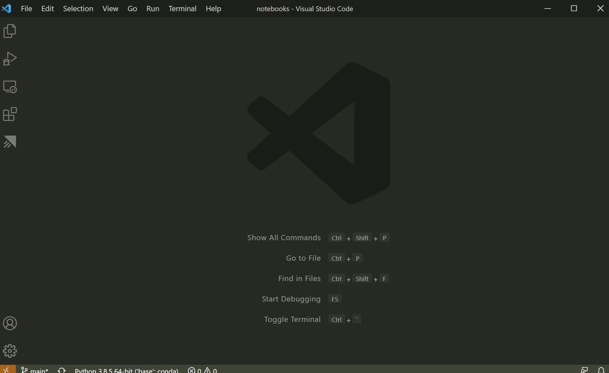
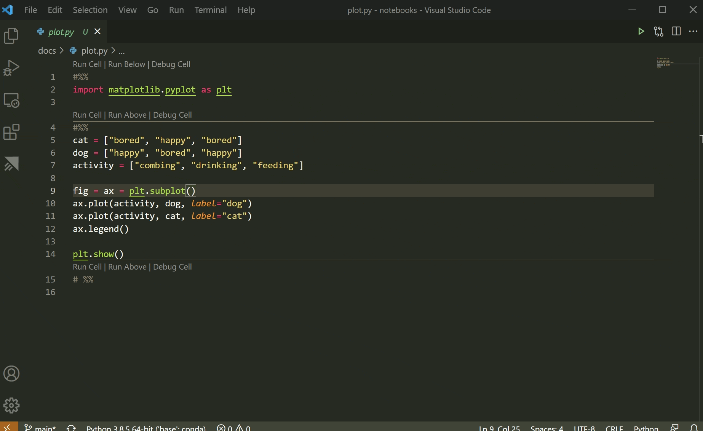
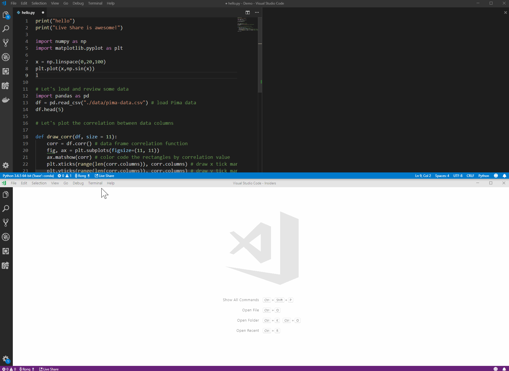
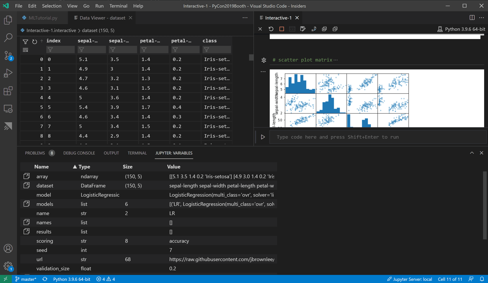
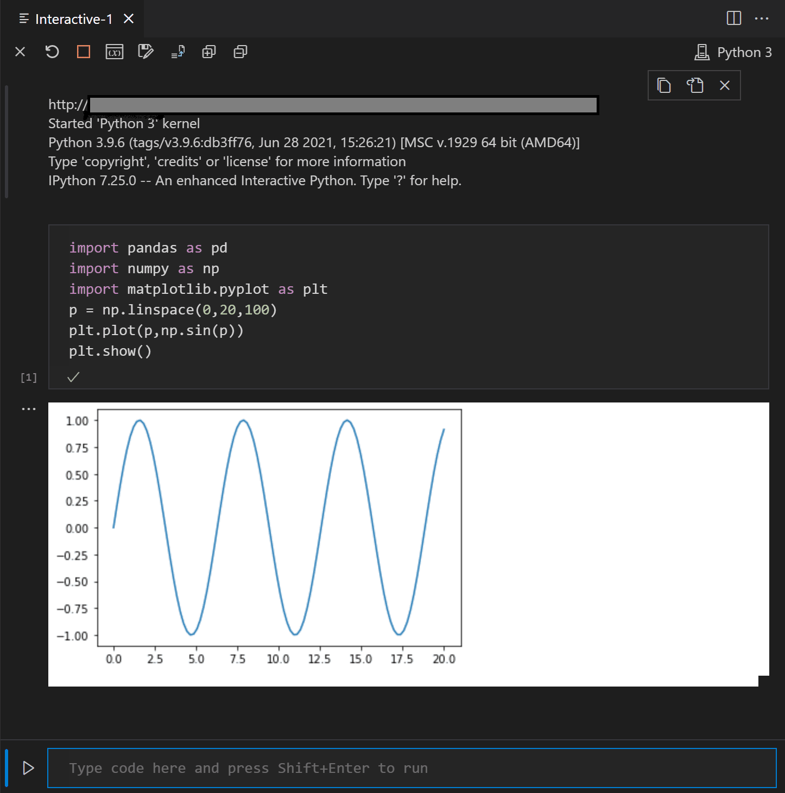

# Python 인터랙티브 창 {#python-interactive-window}

[Jupyter](https://jupyter-notebook.readthedocs.io/en/latest/) (이전의 IPython Notebook)은 Markdown 텍스트와 실행 가능한 Python 소스 코드를 **노트북**이라는 하나의 캔버스에서 쉽게 결합할 수 있게 해주는 오픈 소스 프로젝트입니다. Visual Studio Code는 [Jupyter 노트북을 기본적으로 지원](/docs/datascience/jupyter-notebooks.md)하며, Python 코드 파일을 통해서도 작업할 수 있습니다. 이 주제에서는 Python 코드 파일을 통해 제공되는 지원을 다루고, 다음과 같은 방법을 보여줍니다:

- Jupyter와 유사한 코드 셀 작업하기
- Python 인터랙티브 창에서 코드 실행하기
- 변수 탐색기 및 데이터 뷰어를 사용하여 변수 보기, 검사 및 필터링하기
- 원격 Jupyter 서버에 연결하기
- Jupyter 노트북 디버깅하기
- Jupyter 노트북 내보내기

Jupyter 노트북을 사용하려면 VS Code에서 Anaconda 환경을 활성화하거나 [Jupyter 패키지](https://pypi.org/project/jupyter/)를 설치한 다른 Python 환경을 활성화해야 합니다. 환경을 선택하려면 명령 팔레트에서 **Python: 인터프리터 선택** 명령을 사용하세요 (`kb(workbench.action.showCommands)`).

적절한 환경이 활성화되면 Jupyter와 유사한 코드 셀을 생성하고 실행할 수 있으며, 원격 Jupyter 서버에 연결하여 코드 셀을 실행하고 Python 파일을 Jupyter 노트북으로 내보낼 수 있습니다.

## Jupyter 코드 셀 {#jupyter-code-cells}

Python 코드 내에서 Jupyter와 유사한 코드 셀을 정의하려면 `# %%` 주석을 사용합니다:

```python
# %% {#}
msg = "Hello World"
print(msg)

# %% {#}
msg = "Hello again"
print(msg)
```

> **참고**: 위에 표시된 코드를 .py 확장자를 가진 파일에 저장해야 합니다.

Python 확장이 코드 셀을 감지하면 **셀 실행** 및 **셀 디버그** 코드 렌즈 장식이 추가됩니다. 첫 번째 셀에는 **아래 실행**이 포함되고, 이후 모든 셀에는 **위 실행**이 포함됩니다:


> **참고:** 기본적으로 **셀 디버그**는 사용자 코드로만 진입합니다. 비사용자 코드로 진입하려면 Jupyter 확장 설정에서 **내 코드만 디버그**를 선택 해제해야 합니다 (`kb(workbench.action.openSettings)`).

**셀 실행**은 단지 하나의 코드 셀에만 적용됩니다. **아래 실행**은 첫 번째 셀에서 나타나며, 파일의 모든 코드를 실행합니다. **위 실행**은 장식이 있는 셀을 포함하지 않고 그 위의 모든 코드 셀에 적용됩니다. 예를 들어, 특정 셀을 실행하기 전에 런타임 환경의 상태를 초기화하기 위해 **위 실행**을 사용할 수 있습니다.

명령을 선택하면 Jupyter가 시작되고 (필요한 경우, 이 과정은 1분 정도 걸릴 수 있습니다), 그 후 **Python 인터랙티브** 창에서 적절한 셀을 실행합니다:


또한 (`kbstyle(Ctrl+Enter)`) 또는 **Python: Python 터미널에서 선택/라인 실행** 명령 (`kbstyle(Shift+Enter)`)을 사용하여 코드 셀을 실행할 수 있습니다. 이 명령을 사용한 후, Python 확장은 자동으로 커서를 다음 셀로 이동시킵니다. 파일의 마지막 셀에 있는 경우, 확장은 자동으로 새로운 셀을 위한 또 다른 `# %%` 구분자를 삽입하여 Jupyter 노트북의 동작을 모방합니다.

줄 번호 왼쪽 여백을 클릭하여 중단점을 설정할 수도 있습니다. 그런 다음 **셀 디버그**를 사용하여 해당 코드 셀에 대한 디버깅 세션을 시작할 수 있습니다. 디버거는 중단점에서 실행을 중지하고 코드를 한 줄씩 단계별로 실행하며 변수를 검사할 수 있게 해줍니다 (자세한 내용은 [디버깅](/docs/editor/debugging.md)을 참조하세요).

### 추가 명령 및 키보드 단축키 {#additional-commands-and-keyboard-shortcuts}

다음 표는 코드 셀 작업 시 지원되는 추가 명령 및 키보드 단축키를 나열합니다.

|명령  |키보드 단축키  |
|---------|---------|
|Python: 다음 셀로 이동                  | `kbstyle(Ctrl+Alt+])`      |
|Python: 이전 셀로 이동              | `kbstyle(Ctrl+Alt+[)`      |
|Python: 위의 셀로 선택 확장   | `kbstyle(Ctrl+Shift+Alt+[)` |
|Python: 아래의 셀로 선택 확장   | `kbstyle(Ctrl+Shift+Alt+])` |
|Python: 선택한 셀 위로 이동           | `kbstyle(Ctrl+; U)`        |
|Python: 선택한 셀 아래로 이동         | `kbstyle(Ctrl+; D)`        |
|Python: 위에 셀 삽입                | `kbstyle(Ctrl+; A)`        |
|Python: 아래에 셀 삽입                | `kbstyle(Ctrl+; B)`        |
|Python: 위치 아래에 셀 삽입       | `kbstyle(Ctrl+; S)`        |
|Python: 선택한 셀 삭제            | `kbstyle(Ctrl+; X)`        |
|Python: 셀을 코드로 변경              | `kbstyle(Ctrl+; C)`        |
|Python: 셀을 Markdown으로 변경          | `kbstyle(Ctrl+; M)`        |

## Python 인터랙티브 창 사용하기 {#using-the-python-interactive-window}

이전 섹션에서 언급한 **Python 인터랙티브** 창은 임의의 코드(코드 셀 유무에 관계없이)로 사용할 수 있는 독립형 콘솔로 사용할 수 있습니다. 콘솔로 사용하려면 명령 팔레트에서 **Jupyter: 인터랙티브 창 만들기** 명령을 사용하여 창을 엽니다. 그런 다음 코드를 입력하고, `kbstyle(Enter)`를 사용하여 새 줄로 이동하고 `kbstyle(Shift+Enter)`를 사용하여 코드를 실행할 수 있습니다.

파일과 함께 창을 사용하려면 명령 팔레트에서 **Jupyter: 현재 파일을 Python 인터랙티브 창에서 실행** 명령을 사용하세요.

### IntelliSense {#intellisense}

Python 인터랙티브 창은 완전한 IntelliSense를 제공합니다 – 코드 완성, 멤버 목록, 메서드에 대한 빠른 정보 및 매개변수 힌트. Python 인터랙티브 창에서 입력하는 것은 코드 편집기에서 입력하는 것만큼 생산적일 수 있습니다.



### 플롯 뷰어 {#plot-viewer}

플롯 뷰어는 플롯을 더 깊이 작업할 수 있는 기능을 제공합니다. 뷰어에서 현재 세션의 플롯을 팬, 줌 및 탐색할 수 있습니다. 또한 플롯을 PDF, SVG 및 PNG 형식으로 내보낼 수 있습니다.

Python 인터랙티브 창 내에서 플롯을 더블 클릭하여 뷰어에서 열거나, 플롯의 왼쪽 상단 모서리에 있는 확장 버튼을 선택하세요.
<!--
```
#%%
import matplotlib.pyplot as plt

#%%
cat = ["bored", "happy", "bored"]
dog = ["happy", "bored", "happy"]
activity = ["combing", "drinking", "feeding"]

fig = ax = plt.subplot()
ax.plot(activity, dog, label="dog")
ax.plot(activity, cat, label="cat")
ax.legend()

plt.show()
``` -->



> **참고:** Python 인터랙티브 창은 [matplotlib](https://matplotlib.org/) 및 [Altair](https://altair-viz.github.io/index.html)로 생성된 플롯 렌더링을 지원합니다.

<!-- ### Python 인터랙티브를 위한 라이브 공유

Python 인터랙티브 창은 실시간 협업을 위한 [Visual Studio Live Share](https://visualstudio.microsoft.com/services/live-share/)도 지원합니다. 라이브 공유를 통해 오디오, 서버, 터미널, 차이, 주석 등을 공유하면서 공동 편집 및 공동 디버깅을 할 수 있습니다.



이 기능은 호스트와 게스트 머신 모두에 [라이브 공유 확장](https://marketplace.visualstudio.com/items?itemName=MS-vsliveshare.vsliveshare)을 설치해야 합니다. -->

## 변수 탐색기 및 데이터 뷰어 {#variables-explorer-and-data-viewer}

Python 인터랙티브 창 내에서 현재 Jupyter 세션의 변수를 보고, 검사하고, 필터링할 수 있습니다. 코드를 실행한 후 **변수** 버튼을 선택하여 변수 탐색기를 열면 현재 변수 목록이 표시되며, 코드에서 변수가 사용될 때 자동으로 업데이트됩니다.


변수에 대한 추가 정보를 보려면 행을 더블 클릭하거나 **데이터 뷰어에서 변수 보기** 버튼을 사용하여 데이터 뷰어에서 변수의 더 자세한 보기를 확인할 수 있습니다. 열리면 행을 검색하여 값을 필터링할 수 있습니다.



## 원격 Jupyter 서버에 연결하기 {#connect-to-a-remote-jupyter-server}

Jupyter 노트북에서 집약적인 계산을 다른 컴퓨터로 오프로드하려면 원격 Jupyter 서버에 연결할 수 있습니다. 연결되면 코드 셀은 로컬 컴퓨터가 아닌 원격 서버에서 실행됩니다.

원격 Jupyter 서버에 연결하려면:

1. 명령 팔레트에서 **Jupyter: 연결을 위한 로컬 또는 원격 Jupyter 서버 지정** 명령을 실행합니다 (`kb(workbench.action.showCommands)`).
2. Jupyter 서버에 연결하는 방법을 선택합니다.
    
3. 원격으로 작업하는 경우, 프롬프트가 나타나면 인증 토큰이 포함된 서버의 URI(호스트 이름)를 `?token=` URL 매개변수와 함께 제공해야 합니다. (VS Code 터미널에서 인증 토큰이 활성화된 상태로 서버를 시작하면, 토큰이 포함된 URL이 터미널 출력에 나타나며, 여기서 복사할 수 있습니다.) 또는 URI를 제공한 후 사용자 이름과 비밀번호를 지정할 수 있습니다.

    

4. Python 인터랙티브 창은 코드가 실행되는 위치를 URI를 표시하여 나타냅니다 (아래 이미지에서 흐리게 처리됨):

    

> **참고:** 보안을 강화하기 위해 Microsoft는 SSL 및 토큰 지원과 같은 보안 예방 조치를 통해 Jupyter 서버를 구성할 것을 권장합니다. 이는 Jupyter 서버에 전송되는 요청이 인증되고 원격 서버와의 연결이 암호화되도록 도와줍니다. 노트북 서버 보안에 대한 안내는 [Jupyter 문서](https://jupyter-notebook.readthedocs.io/en/stable/public_server.html#securing-a-notebook-server)를 참조하세요.

## Jupyter 노트북을 Python 코드 파일로 변환하기 {#convert-jupyter-notebooks-to-python-code-file}

Jupyter가 설치된 환경을 활성화하면 VS Code에서 Jupyter 노트북 파일(`.ipynb`)을 열고 이를 Python 코드로 변환할 수 있습니다. 파일을 변환한 후에는 다른 Python 파일과 마찬가지로 코드를 실행하고 VS Code 디버거를 사용할 수 있습니다. VS Code에서 노트북을 열고 디버깅하는 것은 Jupyter 노트북에서 직접 수행하기 어려운 코드 버그를 찾고 해결하는 편리한 방법입니다.

노트북 파일을 열면 Visual Studio Code가 자동으로 노트북 편집기에서 엽니다. 도구 모음의 변환 아이콘을 사용하여 노트북(.ipynb) 파일을 Python 파일(.py)로 변환합니다.


변환 아이콘을 선택한 후 "Python 스크립트"를 선택하고 몇 초 기다리면 VS Code가 변환된 노트북을 제목 없는 파일로 엽니다. 노트북의 셀은 Python 파일 내에서 `# %%` 주석으로 구분되며, Markdown 셀은 `# %% [markdown]`로 시작하는 주석으로 완전히 변환되고, 코드 및 그래프와 같은 출력과 함께 인터랙티브 창에서 HTML로 렌더링됩니다:


> **참고:** Python 파일에서 코드 셀을 처음 실행할 때, Python 확장은 Jupyter 서버를 시작합니다. 서버가 시작되고 **Python 인터랙티브** 창이 코드 결과와 함께 나타나는 데 시간이 걸릴 수 있습니다.

## Jupyter 노트북 디버깅하기 {#debug-a-jupyter-notebook}

Visual Studio Code 디버거를 사용하면 코드를 단계별로 실행하고, 중단점을 설정하고, 상태를 검사하며, 문제를 분석할 수 있습니다. 디버거를 사용하는 것은 노트북 코드에서 문제를 찾고 수정하는 데 유용한 방법입니다.

1. VS Code에서 Jupyter가 설치된 Python 환경을 활성화합니다. 이 기사의 시작 부분에서 설명한 대로 진행하세요.

1. 이전 섹션에서 설명한 대로 노트북의 `.ipynb` 파일을 VS Code로 가져옵니다. (Azure Notebooks와 같은 클라우드 기반 Jupyter 환경을 사용하는 경우, 먼저 파일을 다운로드하세요.)

1. 디버거를 시작하려면 다음 옵션 중 하나를 사용합니다:

    - 전체 노트북의 경우, 명령 팔레트를 열고 (`kb(workbench.action.showCommands)`) **Jupyter: Python 인터랙티브 창에서 현재 파일 디버그** 명령을 실행합니다.
    - 개별 셀의 경우, 셀 위에 나타나는 **셀 디버그** 장식을 사용합니다. 디버거는 해당 셀의 코드에서만 시작됩니다. 기본적으로 **셀 디버그**는 사용자 코드로만 진입합니다. 비사용자 코드로 진입하려면 Jupyter 확장 설정에서 **내 코드만 디버그**를 선택 해제해야 합니다 (`kb(workbench.action.openSettings)`).

1. 변수를 검사하고, 중단점을 설정하는 등 VS Code의 일반적인 디버깅 기능에 익숙해지려면 [VS Code 디버깅](/docs/editor/debugging.md)을 검토하세요.

1. 문제를 발견하면 디버거를 중지하고 코드를 수정한 후 파일을 저장하고 디버거를 다시 시작합니다.

1. 모든 코드가 올바르다고 확신되면 파일을 저장한 후 다음 섹션에서 설명한 대로 노트북을 내보냅니다. 그런 다음 노트북을 일반 Jupyter 환경에 업로드할 수 있습니다.

## Jupyter 노트북 내보내기 {#export-a-jupyter-notebook}

Jupyter 노트북을 여는 것 외에도, VS Code의 Python 파일에서 Jupyter 노트북(`.ipynb` 확장자)으로 콘텐츠를 내보내기 위해 명령 팔레트(`kb(workbench.action.showCommands)`)에서 다음 명령 중 하나를 사용할 수 있습니다.

- **Jupyter: 현재 Python 파일을 Jupyter 노트북으로 내보내기**: 현재 파일의 내용을 사용하여 Jupyter 노트북을 생성하며, `# %%` 및 `# %% [markdown]` 구분자를 사용하여 각 셀의 유형을 지정합니다.
- **Jupyter: 현재 Python 파일 및 출력을 Jupyter 노트북으로 내보내기**: 현재 파일의 내용을 사용하여 Jupyter 노트북을 생성하고 코드 셀의 출력을 포함합니다.
- **Jupyter: 인터랙티브 창을 Jupyter 노트북으로 내보내기**: Python 인터랙티브 창의 내용을 사용하여 Jupyter 노트북을 생성합니다.

내용을 내보낸 후, VS Code는 브라우저에서 노트북을 열 수 있는 프롬프트를 표시합니다.
---