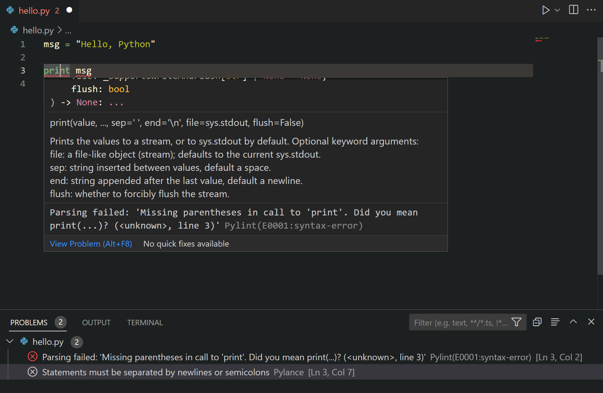

# Visual Studio Code에서 Python 린팅 {#linting-python-in-visual-studio-code}

린팅은 Python 소스 코드에서 의미적 및 스타일적 문제를 강조 표시하여 미세한 프로그래밍 오류나 오류를 초래할 수 있는 코딩 관행을 식별하고 수정하는 데 도움을 줍니다. 예를 들어, 린팅은 정의되지 않은 변수 사용, 정의되지 않은 함수 호출, 누락된 괄호 및 내장 유형이나 함수를 재정의하려는 시도와 같은 더 미세한 문제를 감지할 수 있습니다. 린팅은 코드가 어떻게 실행되는지를 분석하고 오류를 감지하는 반면, 포맷팅은 코드의 모양만 재구성하기 때문에 [포맷팅](/docs/python/formatting.md)와는 다릅니다.

> **참고**: 구문 오류 감지는 Python 확장의 언어 서버에서 기본적으로 활성화되어 있습니다. 언어 서버를 구성하는 방법에 대한 자세한 내용은 [언어 서버 설정](/docs/python/settings-reference.md#python-language-server-settings)을 참조하세요. 이 문서에서는 스타일 검사와 같은 추가 코드 감지를 위한 린팅을 활성화하는 방법을 다룹니다.

## 린터 선택하기 {#choose-a-linter}

원하는 린터 확장을 위해 [VS Code 마켓플레이스](https://marketplace.visualstudio.com/vscode)에서 검색하세요. 원하신다면 여러 개의 린터를 동시에 사용할 수 있습니다.

Microsoft는 Python을 위한 다음 린팅 확장을 제공합니다:
| 린터   | 확장                                                                                             |
| ------ | ------------------------------------------------------------------------------------------------- |
| Pylint | [https://marketplace.visualstudio.com/items?itemName=ms-python.pylint](https://marketplace.visualstudio.com/items?itemName=ms-python.pylint) |
| flake8 | [https://marketplace.visualstudio.com/items?itemName=ms-python.flake8](https://marketplace.visualstudio.com/items?itemName=ms-python.flake8) |
| mypy   | [https://marketplace.visualstudio.com/items?itemName=ms-python.mypy-type-checker](https://marketplace.visualstudio.com/items?itemName=ms-python.mypy-type-checker) |

커뮤니티에서 제공하는 린팅 확장:

| 린터   | 확장                                                                                                                                                   |
| ------ | ------------------------------------------------------------------------------------------------------------------------------------------------------- |
| Ruff   | [https://marketplace.visualstudio.com/items?itemName=charliermarsh.ruff](https://marketplace.visualstudio.com/items?itemName=charliermarsh.ruff) |
| mypy   | [https://marketplace.visualstudio.com/items?itemName=matangover.mypy](https://marketplace.visualstudio.com/items?itemName=matangover.mypy)       |

> **참고**: 위의 표나 마켓플레이스에서 원하는 린터를 찾지 못한 경우, 확장을 통해 지원을 추가할 수 있습니다. [Python 확장 템플릿](/api/advanced-topics/python-extension-template.md)을 사용하여 새로운 Python 도구를 VS Code에 통합할 수 있습니다.

## 일반 설정 {#general-settings}

각 린터 확장의 README를 참조하여 지원되는 설정에 대한 자세한 내용을 확인할 수 있습니다. 대부분의 린터 확장에서 지원하는 설정은 다음과 같습니다:

| 설정               | 기본값       | 설명                                                                                                                                                                                                                              |
| ----------------- | ------------ | ---------------------------------------------------------------------------------------------------------------------------------------------------------------------------------------------------------------------------------- |
| args              | `[]`         | 린터에 전달될 인수입니다. **참고**: 공식적으로 지원되는 린터는 개별 열린 파일에서 실행됩니다. 해당 시나리오에서 구성 적용이 이루어지는지 확인하세요.                                                                                  |
| importStrategy    | `useBundled` | `useBundled`로 설정하면 확장은 함께 제공되는 도구의 버전을 사용합니다. `fromEnvironment`로 설정하면 선택한 Python 환경에서 먼저 로드하려고 시도하며, 그렇지 않으면 번들된 버전으로 돌아갑니다.                                   |
| path              | `""`         | 린팅에 사용할 린터 바이너리의 경로입니다. **참고**: 이 옵션을 사용하면 포맷팅 속도가 느려질 수 있습니다.                                                                                                                                  |
| interpreter       | `[]`         | Python 실행 파일의 경로로 설정하면, 확장은 이를 사용하여 린팅 서버와 그 하위 프로세스를 시작합니다.                                                                                                                                       |
| showNotifications | `off`        | 확장에서 알림이 표시되는 시점을 제어합니다. 지원되는 값은 `off`, `always`, `onError`, `onWarning`입니다.                                                                                                                            |

## 린팅 비활성화 {#disable-linting}

설치된 린터는 기본적으로 활성화되어 있습니다. 작업 공간별로 [확장을 비활성화](/docs/editor/extension-marketplace.md#disable-an-extension)하여 비활성화할 수 있습니다.

## 린팅 실행 {#run-linting}

Python 파일이 열리거나 저장될 때 린팅이 자동으로 실행됩니다.

오류 및 경고는 열린 파일의 **문제** 패널(`kb(workbench.actions.view.problems)`)에 표시되며, 코드 편집기에서도 강조 표시됩니다. 밑줄이 그어진 문제 위에 마우스를 올리면 세부정보가 표시됩니다:

## 코드 작업 {#code-actions}

일부 린터는 보고된 문제를 해결하는 데 도움이 되는 [코드 작업](/docs/editor/refactoring.md#code-actions-quick-fixes-and-refactorings)을 제공할 수 있습니다. 원하는 린터 확장에서 어떤 코드 작업을 제공하는지 확인하려면 [기능 기여](/docs/editor/extension-marketplace.md#extension-details) 섹션을 참조하세요.

## 로깅 {#logging}

린터의 로그는 드롭다운 메뉴에서 `<린터 이름>`을 선택할 때 **출력** 패널(`kb(workbench.action.output.toggleOutput)`)에서 확인할 수 있습니다.

명령 팔레트(`kb(workbench.action.showCommands)`)에서 **개발자: 로그 수준 설정** 명령을 실행하여 린터 확장의 로그 수준을 변경할 수 있습니다. **확장 로그** 그룹에서 확장을 선택한 다음 원하는 로그 수준을 선택하세요.

## 심각도 {#severity}

린터는 일부 미리 정의된 심각도로 문제를 보고합니다. 이는 린터의 `severity` 설정을 사용하여 변경할 수 있습니다. 지원되는 값 및 심각도 수준에 대한 자세한 내용은 각 린터 확장의 README를 참조하세요.

## 린팅 문제 해결 {#troubleshooting-linting}

| 문제                                                                                  | 원인                                                                                                                                                                                                                                                                                                                                                          | 해결책                                                                                                                                                                                                                                                                                                                                                                                                                                                                                                                                                                                                                     |
| ------------------------------------------------------------------------------------- | --------------------------------------------------------------------------------------------------------------------------------------------------------------------------------------------------------------------------------------------------------------------------------------------------------------------------------------------------------------- | --------------------------------------------------------------------------------------------------------------------------------------------------------------------------------------------------------------------------------------------------------------------------------------------------------------------------------------------------------------------------------------------------------------------------------------------------------------------------------------------------------------------------------------------------------------------------------------------------------------------------- |
| 린터 확장이 문제를 보고하지 않습니다.                                               | 작업 공간에 선택된 Python이 없습니다.                                                                                                                                                                                                                                                                                                                       | 사용 중인 린터의 로그를 확인하고 사용 중인 Python 환경의 경로를 확인하세요. Python이 선택되지 않은 경우, 명령 팔레트에서 **Python: 인터프리터 선택** 명령을 실행하고 작업 공간에 대한 기존 인터프리터를 선택하세요.                                                                                                                                                                                                                                                                                                                                                                        |
| "사용 중인 린팅 또는 포맷팅 설정이 더 이상 지원되지 않습니다" 알림이 표시됩니다. | 이 알림이 표시되면 VS Code에 `python.linting` 또는 `python.formatting`과 같은 설정이 있다는 의미입니다. 이러한 설정은 Python 확장에서 더 이상 지원되지 않으며, [린팅 및 포맷팅 지원이 도구 확장으로 이전되었습니다](https://github.com/microsoft/vscode-python/wiki/Migration-to-Python-Tools-Extensions). | 명령 팔레트(`kb(workbench.action.showCommands)`)를 열고 **환경 설정: 사용자 설정 열기 (JSON)** 명령을 실행하여 VS Code에서 이러한 설정이 정의된 위치를 찾으세요. 사용자 설정에 없다면 **환경 설정: 작업 공간 설정 열기 (JSON)** 명령을 실행하세요. 그런 다음 더 이상 지원되지 않는 설정을 삭제하세요.   **참고**: [원격 개발 확장 팩](/docs/remote/remote-overview.md#remote-development-extension-pack)에서 확장을 사용하는 경우, **환경 설정: 원격 설정 열기 (JSON)** 명령을 실행하여 원격 설정도 확인할 수 있습니다. |
| 린터 확장이 설치되어 있음에도 불구하고 린팅이 작동하지 않습니다.                     | 린팅은 사용 중인 Python의 지원되지 않는 버전이나 린터가 올바르게 구성되지 않은 경우 등 여러 가지 이유로 실패할 수 있습니다. 린터 확장의 출력 채널을 확인하여 린터가 실패한 이유를 이해하세요 (명령 팔레트에서 **출력: 출력에 집중하기** 명령을 실행한 후 린터 확장 채널을 선택).                                                                 |

## 다음 단계 {#next-steps}

- [포맷팅](/docs/python/formatting.md) - Python 코드를 포맷하는 방법에 대해 알아보세요.
- [디버깅](/docs/python/debugging.md) - 로컬 및 원격에서 Python을 디버깅하는 방법을 배우세요.
- [테스트](/docs/python/testing.md) - 테스트 환경을 구성하고 테스트를 발견, 실행 및 디버깅하세요.
- [기본 편집](/docs/editor/codebasics.md) - 강력한 VS Code 편집기에 대해 알아보세요.
- [Python 확장 템플릿](/api/advanced-topics/python-extension-template.md) - 좋아하는 린터를 VS Code에 통합하는 확장을 만드세요.
---