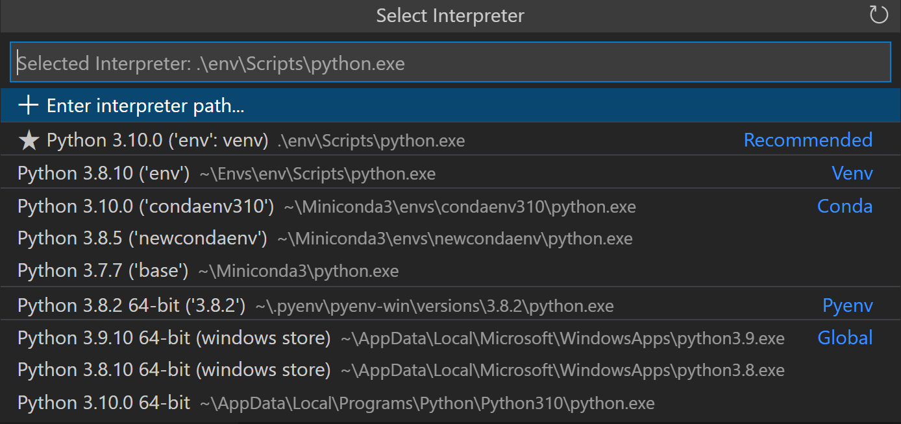
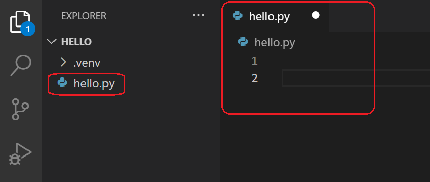
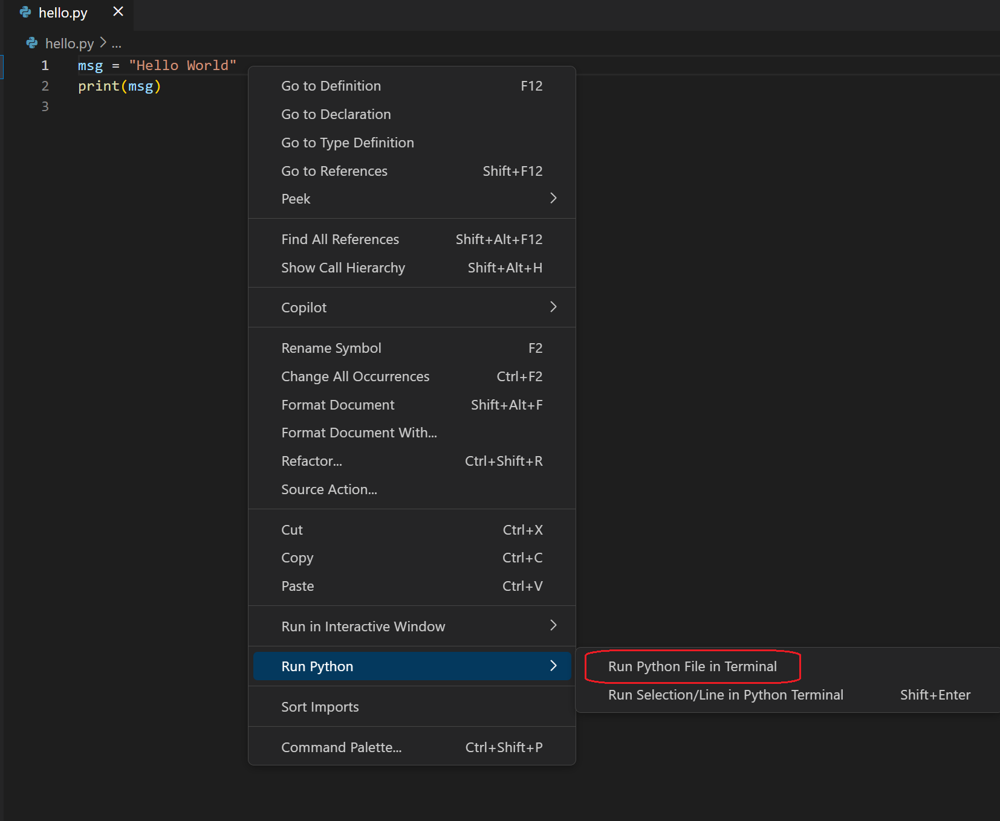
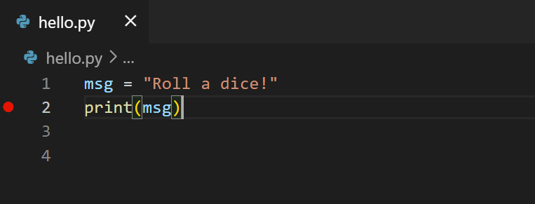
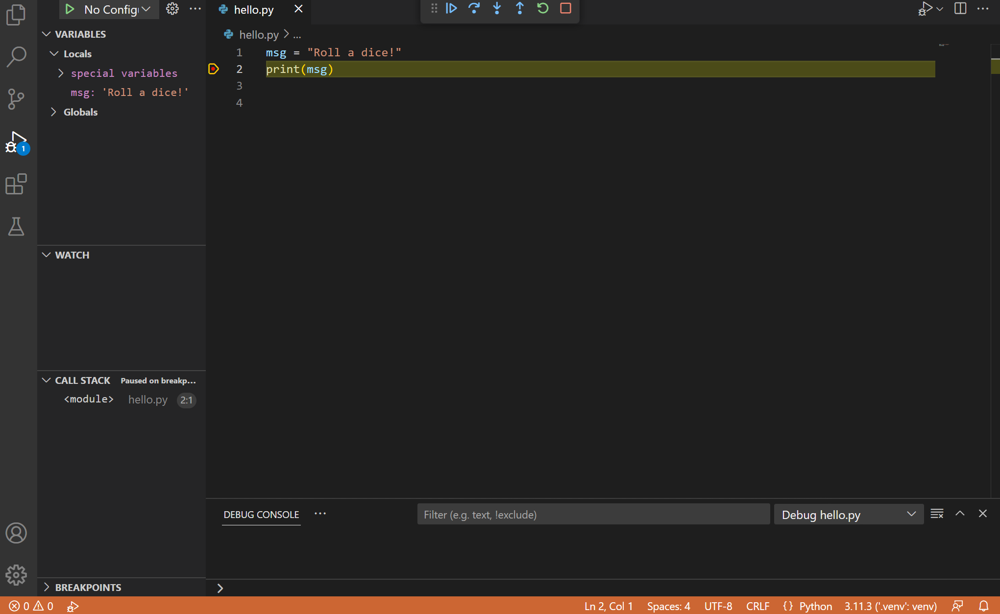

# Visual Studio Code에서 Python 시작하기 {#getting-started-with-python-in-vs-code}

이 튜토리얼에서는 Visual Studio Code에서 Python 3를 사용하여 "주사위를 굴리기!" 애플리케이션을 생성하고 실행하며 디버깅하는 방법, 가상 환경 작업, 패키지 사용 등을 배웁니다! [Python 확장](https://marketplace.visualstudio.com/items?itemName=ms-python.python)을 사용하면 VS Code를 훌륭하고 가벼운 Python 편집기로 변환할 수 있습니다.

프로그래밍이 처음이라면 [Visual Studio Code for Education - Python 소개](https://vscodeedu.com/courses/intro-to-python) 과정을 확인해 보세요. 이 과정은 Python에 대한 포괄적인 소개를 제공하며, 코드 작성이 가능한 브라우저 기반 개발 환경에서 구조화된 모듈을 제공합니다.

Python 언어에 대한 더 깊은 이해를 원하신다면, VS Code의 맥락에서 python.org에 나열된 [프로그래밍 튜토리얼](https://wiki.python.org/moin/BeginnersGuide/Programmers)을 탐색해 보세요.

Python을 사용한 데이터 과학 중심의 튜토리얼을 원하신다면, [데이터 과학 섹션](/docs/datascience/data-science-tutorial.md)을 확인해 보세요.

## 필수 조건 {#prerequisites}

이 튜토리얼을 성공적으로 완료하려면 먼저 Python 개발 환경을 설정해야 합니다. 구체적으로, 이 튜토리얼에서는 다음이 필요합니다:

- [Python 3](/docs/python/python-tutorial.md#install-a-python-interpreter)
- [VS Code](https://code.visualstudio.com/)
- [VS Code Python 확장](https://marketplace.visualstudio.com/items?itemName=ms-python.python) (확장 설치에 대한 추가 세부정보는 [Extension Marketplace](/docs/editor/extension-marketplace.md)를 참조하세요)

## Python 인터프리터 설치하기 {#install-a-python-interpreter}

Python 확장과 함께 Python 인터프리터를 설치해야 합니다. 어떤 인터프리터를 사용할지는 특정 요구 사항에 따라 다르지만, 아래에 몇 가지 지침을 제공합니다.

### Windows {#windows}

[python.org에서 Python을 다운로드](https://www.python.org/downloads/)합니다. 페이지에서 가장 먼저 나타나는 **Download Python** 버튼을 사용하여 최신 버전을 다운로드합니다.

>**참고**: 관리자 권한이 없는 경우, Windows에서 Python을 설치하는 또 다른 방법은 Microsoft Store를 사용하는 것입니다. Microsoft Store는 [지원되는 Python 버전](https://apps.microsoft.com/store/search?publisher=Python%20Software%20Foundation)을 제공합니다.

Windows에서 Python을 사용하는 방법에 대한 추가 정보는 [Python.org의 Windows에서 Python 사용하기](https://docs.python.org/3.9/using/windows.html)를 참조하세요.

### macOS {#macos}

macOS에서 시스템 설치된 Python은 지원되지 않습니다. 대신 [Homebrew](https://brew.sh/)와 같은 패키지 관리 시스템을 사용하는 것이 좋습니다. macOS에서 Homebrew를 사용하여 Python을 설치하려면 터미널 프롬프트에서 `brew install python3`를 입력하세요.

> **참고**: macOS에서는 VS Code 설치 위치가 PATH 환경 변수에 포함되어 있는지 확인하세요. 자세한 내용은 [이 설정 지침](/docs/setup/mac.md#launching-from-the-command-line)을 참조하세요.

### Linux {#linux}

Linux의 내장 Python 3 설치는 잘 작동하지만, 다른 Python 패키지를 설치하려면 [get-pip.py](https://pip.pypa.io/en/stable/installation/#get-pip-py)로 `pip`를 설치해야 합니다.

### 기타 옵션 {#other-options}

- **데이터 과학**: Python을 사용하는 주된 목적이 데이터 과학이라면 [Anaconda](https://www.anaconda.com/download/)에서 다운로드하는 것을 고려해 볼 수 있습니다. Anaconda는 Python 인터프리터뿐만 아니라 데이터 과학을 위한 많은 유용한 라이브러리와 도구를 제공합니다.

- **Windows Subsystem for Linux**: Windows에서 작업 중이며 Python 작업을 위한 Linux 환경이 필요하다면 [Windows Subsystem for Linux](https://learn.microsoft.com/windows/wsl/about) (WSL)를 선택할 수 있습니다. 이 옵션을 선택하면 [WSL 확장](https://marketplace.visualstudio.com/items?itemName=ms-vscode-remote.remote-wsl)도 설치해야 합니다. WSL을 VS Code와 함께 사용하는 방법에 대한 자세한 내용은 [VS Code 원격 개발](/docs/remote/remote-overview.md)을 참조하거나 [WSL 튜토리얼](/docs/remote/wsl-tutorial.md)을 시도하여 WSL 설정, Python 설치 및 WSL에서 실행되는 Hello World 애플리케이션 생성 과정을 안내받을 수 있습니다.

>**참고**: Python이 성공적으로 설치되었는지 확인하려면 운영 체제에 따라 다음 명령 중 하나를 실행하세요:
>
>Linux/macOS: 터미널 창을 열고 다음 명령을 입력하세요:
> ```bash
>python3 --version
>```
>Windows: 명령 프롬프트를 열고 다음 명령을 실행하세요:
>```bat
>py -3 --version
>```
>설치가 성공적이었다면 출력 창에 설치한 Python 버전이 표시되어야 합니다.
>또는 VS Code 통합 터미널에서 `py -0` 명령을 사용하여 머신에 설치된 Python 버전을 확인할 수 있습니다. 기본 인터프리터는 별표(*)로 표시됩니다.

## 작업 공간 폴더에서 VS Code 시작하기 {#start-vs-code-in-a-workspace-folder}

VS Code를 폴더에서 시작하면 해당 폴더가 "작업 공간"이 됩니다.

명령 프롬프트나 터미널을 사용하여 "hello"라는 빈 폴더를 만들고, 그 안으로 이동한 후 다음 명령을 입력하여 VS Code(`code`)를 해당 폴더(`.`)에서 엽니다:

```bash
mkdir hello
cd hello
code .
```

>**참고**: Anaconda 배포판을 사용하는 경우 Anaconda 명령 프롬프트를 사용해야 합니다.

또는 운영 체제 UI를 통해 폴더를 생성한 후 VS Code의 **파일 > 폴더 열기**를 사용하여 프로젝트 폴더를 열 수 있습니다.

## 가상 환경 만들기 {#create-a-virtual-environment}

Python 개발자들 사이에서 모범 사례는 프로젝트별 `가상 환경`을 사용하는 것입니다. 해당 환경을 활성화하면 설치하는 모든 패키지가 다른 환경, 즉 전역 인터프리터 환경과 격리되어 패키지 버전 충돌로 인해 발생할 수 있는 많은 복잡성을 줄일 수 있습니다. VS Code에서 Venv 또는 Anaconda를 사용하여 비전역 환경을 만들 수 있습니다. **Python: Create Environment**를 사용하세요.

명령 팔레트를 열고(`kb(workbench.action.showCommands)`), **Python: Create Environment** 명령을 입력하여 검색한 후 해당 명령을 선택합니다.

명령은 Venv 또는 Conda와 같은 환경 유형 목록을 제공합니다. 이 예제에서는 **Venv**를 선택합니다.


그 다음, 프로젝트에 사용할 수 있는 인터프리터 목록이 표시됩니다. 튜토리얼 시작 시 설치한 인터프리터를 선택하세요.



인터프리터를 선택한 후, 환경 생성 진행 상황을 보여주는 알림이 표시되며, 환경 폴더(`/.venv`)가 작업 공간에 나타납니다.


**Python: Select Interpreter** 명령을 사용하여 새 환경이 선택되었는지 확인하세요.


> **참고**: 가상 환경에 대한 추가 정보나 환경 생성 과정에서 오류가 발생한 경우 [Environments](/docs/python/environments.md#creating-environments)를 참조하세요.

## Python 소스 코드 파일 만들기 {#create-a-python-source-code-file}

파일 탐색기 도구 모음에서 `hello` 폴더의 **새 파일** 버튼을 선택하세요:


파일 이름을 `hello.py`로 지정하면 VS Code가 자동으로 편집기에서 열립니다:



`.py` 파일 확장자를 사용하면 VS Code에 이 파일을 Python 프로그램으로 해석하도록 지시하여 Python 확장 및 선택한 인터프리터로 내용을 평가합니다.

>**참고**: 파일 탐색기 도구 모음에서는 작업 공간 내에서 코드를 더 잘 정리하기 위해 폴더를 생성할 수도 있습니다. **새 폴더** 버튼을 사용하여 빠르게 폴더를 생성할 수 있습니다.

작업 공간에 코드 파일이 생겼으니, `hello.py`에 다음 소스 코드를 입력하세요:

```python
msg = "Roll a dice!"
print(msg)
```

`print`를 입력하기 시작하면 [IntelliSense](/docs/editor/intellisense.md)가 자동 완성 옵션을 제공합니다.


IntelliSense와 자동 완성은 표준 Python 모듈뿐만 아니라 선택한 Python 인터프리터의 환경에 설치한 다른 패키지에도 작동합니다. 또한 객체 유형에서 사용할 수 있는 메서드에 대한 완성도 제공합니다. 예를 들어, `msg` 변수가 문자열을 포함하고 있기 때문에 `msg.`를 입력하면 IntelliSense가 문자열 메서드를 제공합니다:


마지막으로 파일을 저장하세요(`kb(workbench.action.files.save)`). 이 시점에서 VS Code에서 첫 번째 Python 파일을 실행할 준비가 되었습니다.

편집, 형식 지정 및 리팩토링에 대한 전체 세부정보는 [코드 편집](/docs/python/editing.md)을 참조하세요. Python 확장은 [Linting](/docs/python/linting.md)도 완벽하게 지원합니다.

## Python 코드 실행하기 {#run-python-code}

편집기 오른쪽 상단에 있는 **Run Python File** 재생 버튼을 클릭하세요.


버튼을 클릭하면 터미널 패널이 열리고 Python 인터프리터가 자동으로 활성화된 후 `python3 hello.py` (macOS/Linux) 또는 `python hello.py` (Windows)를 실행합니다:


VS Code 내에서 Python 코드를 실행하는 세 가지 방법이 더 있습니다:

1. 편집기 창의 아무 곳이나 마우스 오른쪽 버튼을 클릭하고 **Run Python > Run Python File in Terminal**을 선택하세요 (이 경우 파일이 자동으로 저장됩니다):

   

2. 하나 이상의 줄을 선택한 후 `kbstyle(Shift+Enter)`를 누르거나 마우스 오른쪽 버튼을 클릭하고 **Run Python > Run Selection/Line in Python Terminal**을 선택하세요. 또는 선택 없이 `kbstyle(Shift+Enter)`를 눌러 Smart Send를 활성화하면 Python 확장이 커서가 위치한 곳 근처의 가장 작은 실행 가능한 코드 블록을 터미널로 전송합니다. 이 명령은 파일의 일부만 테스트할 때 편리합니다.

   > **참고**: 커서가 위치한 특정 줄에서 코드를 전송하려면 **User** 설정에서 `python.REPL.enableREPLSmartSend : "false"`로 설정하여 Smart Send를 끌 수 있습니다.

3. 명령 팔레트(`kb(workbench.action.showCommands)`)에서 **Python: Start Terminal REPL** 명령을 선택하여 현재 선택된 Python 인터프리터에 대한 REPL 터미널(`>>>`로 표기됨)을 엽니다. REPL에서 한 줄씩 코드를 입력하고 실행할 수 있습니다.

축하합니다, Visual Studio Code에서 첫 번째 Python 코드를 실행했습니다!

## 디버거 구성 및 실행하기 {#configure-and-run-the-debugger}

이제 Python 프로그램을 디버깅해 보겠습니다. 디버깅 지원은 Python 확장과 함께 자동으로 설치되는 [Python Debugger extension](https://marketplace.visualstudio.com/items?itemName=ms-python.debugpy)에서 제공됩니다. 올바르게 설치되었는지 확인하려면 **확장** 뷰(`kb(workbench.view.extensions)`)를 열고 `@installed python debugger`를 검색하세요. 결과에 Python Debugger 확장이 나열되어야 합니다.


다음으로, `hello.py`의 2행에 중단점을 설정합니다. `print` 호출 위에 커서를 놓고 `kb(editor.debug.action.toggleBreakpoint)`를 누르세요. 또는 편집기의 왼쪽 여백에서 줄 번호 옆을 클릭하세요. 중단점을 설정하면 여백에 빨간 원이 나타납니다.



그 다음, 디버거를 초기화하려면 `kb(workbench.action.debug.start)`를 누르세요. 이 파일을 처음 디버깅하는 것이므로, 명령 팔레트에서 열려 있는 파일에 대해 원하는 디버그 구성 유형을 선택할 수 있는 구성 메뉴가 열립니다.


> **참고**: VS Code는 다양한 구성에 대해 JSON 파일을 사용합니다. `launch.json`은 디버깅 구성을 포함하는 파일의 표준 이름입니다.

**Python File**을 선택하세요. 이는 현재 편집기에서 표시된 파일을 현재 선택된 Python 인터프리터를 사용하여 실행하는 구성입니다.

디버거가 시작되고, 파일 중단점의 첫 번째 줄에서 멈춥니다. 현재 줄은 왼쪽 여백에 노란색 화살표로 표시됩니다. 이 시점에서 **로컬** 변수 창을 확인하면 `msg` 변수가 **로컬** 패널에 나타나는 것을 볼 수 있습니다.



디버깅 도구 모음이 상단에 나타나며, 왼쪽에서 오른쪽으로 다음 명령이 포함됩니다: 계속(`kb(workbench.action.debug.start)`), 단계 건너뛰기(`kb(workbench.action.debug.stepOver)`), 단계 들어가기(`kb(workbench.action.debug.stepInto)`), 단계 나가기(`kb(workbench.action.debug.stepOut)`), 다시 시작(`kb(workbench.action.debug.restart)`), 및 중지(`kb(workbench.action.debug.stop)`).


상태 표시줄의 색상도 변경되어(많은 테마에서 주황색) 디버그 모드에 있음을 나타냅니다. **Python Debug Console**도 자동으로 하단 오른쪽 패널에 나타나 실행 중인 명령과 프로그램 출력을 보여줍니다.

프로그램 실행을 계속하려면 디버깅 도구 모음에서 계속 명령을 선택하세요(`kb(workbench.action.debug.start)`). 디버거는 프로그램을 끝까지 실행합니다.

> **팁**: 디버깅 정보는 코드 위에 마우스를 올려 변수와 같은 항목을 확인할 때도 볼 수 있습니다. `msg`의 경우, 변수를 마우스 오버하면 `Roll a dice!`라는 문자열이 변수 위의 상자에 표시됩니다.

**Debug Console**에서 변수와 함께 작업할 수도 있습니다 (보이지 않는 경우, VS Code의 하단 오른쪽 영역에서 **Debug Console**을 선택하거나 **...** 메뉴에서 선택하세요). 그런 다음, 콘솔 하단의 **>** 프롬프트에서 다음 줄을 하나씩 입력해 보세요:

```python
msg
msg.capitalize()
msg.split()
```


도구 모음에서 파란색 **계속** 버튼을 다시 선택하거나(`kb(workbench.action.debug.continue)`) 프로그램을 완료할 때까지 실행하세요. **Python Debug Console**로 돌아가면 "Roll a dice!"가 나타나고, 프로그램이 완료되면 VS Code는 디버그 모드를 종료합니다.

디버거를 다시 시작하면 디버거가 다시 첫 번째 중단점에서 멈춥니다.

프로그램이 완료되기 전에 실행을 중지하려면 디버깅 도구 모음의 빨간 사각형 중지 버튼(`kb(workbench.action.debug.stop)`)을 사용하거나 **실행 > 디버깅 중지** 메뉴 명령을 사용하세요.

전체 세부정보는 [디버깅 구성](/docs/python/debugging.md)을 참조하세요. 여기에는 디버깅을 위해 특정 Python 인터프리터를 사용하는 방법에 대한 노트가 포함되어 있습니다.

> **팁: print 문 대신 Logpoints 사용하기**: 개발자들은 종종 디버거에서 각 코드 줄을 단계별로 검사하지 않고도 변수를 빠르게 확인하기 위해 소스 코드에 `print` 문을 남깁니다. VS Code에서는 대신 **Logpoints**를 사용할 수 있습니다. Logpoint는 중단점과 비슷하지만 메시지를 콘솔에 기록하고 프로그램을 중지하지 않습니다. 자세한 내용은 VS Code 디버깅 기사의 [Logpoints](/docs/editor/debugging.md#logpoints)를 참조하세요.

## 패키지 설치 및 사용하기 {#install-and-use-packages}

이전 예제를 바탕으로 패키지를 사용해 보겠습니다.

Python에서 패키지는 일반적으로 [PyPI](https://pypi.org/)에서 유용한 코드 라이브러리를 얻는 방법으로, 프로그램에 추가 기능을 제공합니다. 이 예제에서는 `numpy` 패키지를 사용하여 무작위 숫자를 생성합니다.

**Explorer** 뷰(왼쪽 가장 위 아이콘, 파일을 표시함)로 돌아가서 `hello.py`를 열고 다음 소스 코드를 붙여넣습니다:

```python
import numpy as np

msg = "Roll a dice!"
print(msg)

print(np.random.randint(1,9))
```

> **팁**: 위 코드를 손으로 입력하면, 줄 끝에서 `kbstyle(Enter)`를 누를 때 `as` 키워드 이후의 이름이 자동 완성으로 변경될 수 있습니다. 이를 피하려면 공백을 입력한 후 `kbstyle(Enter)`를 누르세요.

다음으로, 마지막 섹션에서 설명한 "Python: Current file" 구성을 사용하여 디버거에서 파일을 실행하세요.

**"ModuleNotFoundError: No module named 'numpy'"**라는 메시지가 표시되어야 합니다. 이 메시지는 필요한 패키지가 인터프리터에 없음을 나타냅니다. Anaconda 배포판을 사용 중이거나 이전에 `numpy` 패키지를 설치한 경우 이 메시지가 표시되지 않을 수 있습니다.

`numpy` 패키지를 설치하려면 디버거를 중지하고 명령 팔레트를 사용하여 **Terminal: Create New Terminal**(`kb(workbench.action.terminal.new)`)을 실행하세요. 이 명령은 선택한 인터프리터에 대한 명령 프롬프트를 엽니다.

가상 환경에 필요한 패키지를 설치하려면 운영 체제에 따라 다음 명령을 입력하세요:

1. 패키지 설치

   ```bash
   # Anaconda 배포판에서는 matplotlib이 이미 포함되어 있으므로 사용하지 마세요.

   # macOS
   python3 -m pip install numpy

   # Windows (권한 상승이 필요할 수 있음)
   py -m pip install numpy

   # Linux (Debian)
   apt-get install python3-tk
   python3 -m pip install numpy
   ```

2. 이제 프로그램을 다시 실행하여 출력을 확인하세요!

### 환경 간 종속성 관리하기 {#managing-dependencies-across-environments}
Python 프로젝트 작업 시 종속성을 효과적으로 관리하는 것이 중요합니다. 유용한 팁 중 하나는 `pip freeze > requirements.txt` 명령을 사용하는 것입니다. 이 명령은 가상 환경에 설치된 모든 패키지를 나열하는 `requirements.txt` 파일을 생성하는 데 도움이 됩니다. 이 파일은 다른 곳에서 동일한 환경을 재생성하는 데 사용할 수 있습니다.

`requirements.txt` 파일을 생성하는 방법은 다음과 같습니다:
1. 가상 환경을 활성화합니다. 아직 활성화하지 않았다면.

   ```bash
   source venv/bin/activate  # macOS/Linux에서
   ```

   ```powershell
   .\venv\Scripts\activate   # Windows에서
   ```

2. `requirements.txt` 파일을 생성합니다.

   ```powershell
   pip freeze > requirements.txt
   ```

이제 새로 생성된 `requirements.txt` 파일을 사용하여 다른 환경에서 종속성을 설치할 수 있습니다. 또한 프로젝트가 복잡해짐에 따라 종속성을 계속 추가할 수 있습니다.

   ```powershell
   pip install -r requirements.txt
   ```

이러한 단계를 따르면 프로젝트 종속성이 다양한 환경에서 일관되게 유지되어 다른 사람과 협업하거나 프로젝트를 배포하는 것이 더 쉬워집니다.

Python 튜토리얼을 완료하신 것을 축하합니다! 이 튜토리얼을 통해 Python 프로젝트를 생성하고, 가상 환경을 만들고, Python 코드를 실행 및 디버깅하고, Python 패키지를 설치하는 방법을 배웠습니다. Visual Studio Code에서 Python을 최대한 활용하는 방법을 배우기 위해 추가 리소스를 탐색해 보세요!

## 다음 단계 {#next-steps}

인기 있는 Python 웹 프레임워크로 웹 앱을 구축하는 방법을 배우려면 다음 튜토리얼을 참조하세요:

- [Visual Studio Code에서 Django 사용하기](/docs/python/tutorial-django.md)
- [Visual Studio Code에서 Flask 사용하기](/docs/python/tutorial-flask.md)
- [Visual Studio Code에서 FastAPI 사용하기](/docs/python/tutorial-fastapi.md)

그 외에도 Visual Studio Code에서 Python으로 탐색할 수 있는 많은 것들이 있습니다:

- [Python 프로필 템플릿](/docs/editor/profiles.md#python-profile-template) - curated된 확장, 설정 및 스니펫 세트를 사용하여 새 [프로필](/docs/editor/profiles) 생성
- [코드 편집](/docs/python/editing.md) - Python에 대한 자동 완성, IntelliSense, 형식 지정 및 리팩토링에 대해 알아보기.
- [Linting](/docs/python/linting.md) - 다양한 Python 린터를 활성화, 구성 및 적용하기.
- [디버깅](/docs/python/debugging.md) - Python을 로컬 및 원격으로 디버깅하는 방법 배우기.
- [테스트](/docs/python/testing.md) - 테스트 환경 구성 및 테스트 발견, 실행 및 디버깅하기.
- [설정 참조](/docs/python/settings-reference.md) - VS Code의 Python 관련 설정 전체 범위 탐색하기.
- [Python을 Azure App Service에 배포하기](https://learn.microsoft.com/azure/developer/python/tutorial-containerize-deploy-python-web-app-azure-01)
- [Python을 Container Apps에 배포하기](https://learn.microsoft.com/azure/developer/python/tutorial-deploy-python-web-app-azure-container-apps-01)