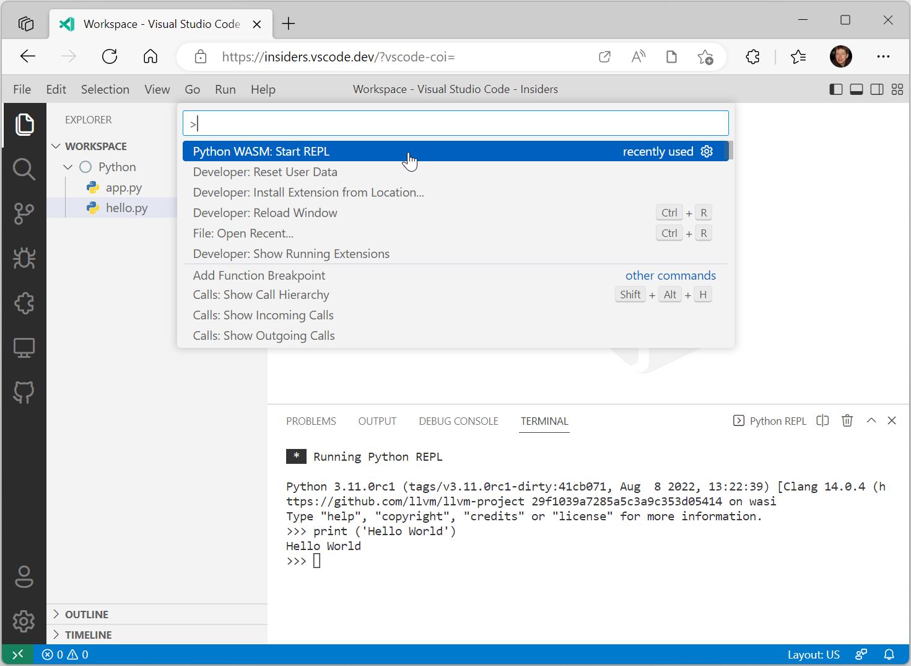
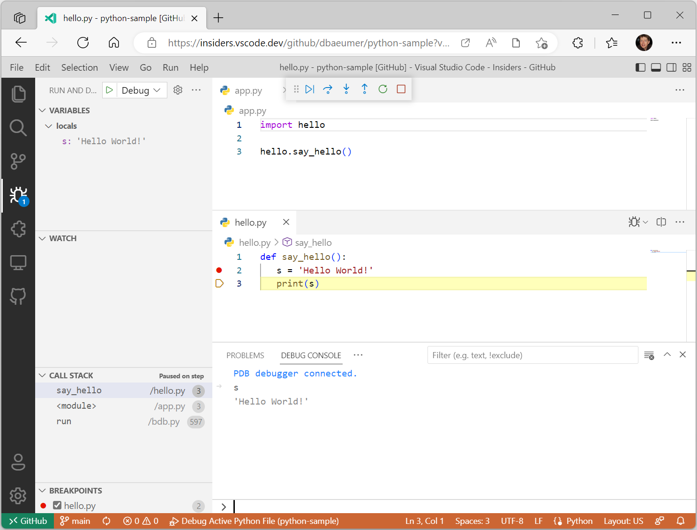

# 웹에서 Python 실행 및 디버깅 {#run-and-debug-python-in-the-web}

웹에서 Python 코드를 실행하는 **실험적인** 지원을 발표하게 되어 기쁩니다. 이를 시도해 보려면, 마켓플레이스에서 [Experimental - Python for the Web](https://marketplace.visualstudio.com/items?itemName=ms-vscode.vscode-python-web-wasm) 확장 프로그램의 최신 프리 릴리스 버전을 설치하세요. 이 작업은 현재 개발 중인 Python의 WASM을 기반으로 합니다. 작동 방식과 진행 중인 내용을 더 알고 싶다면 [Python을 WebAssembly(WASM)로 컴파일하기](https://pythondev.readthedocs.io/wasm.html)를 읽어보세요.

## 필수 조건 {#prerequisites}

확장 프로그램을 사용하기 위해 필요한 필수 조건은 다음과 같습니다:

* [GitHub Repositories](https://marketplace.visualstudio.com/items?itemName=GitHub.remotehub) 확장 프로그램이 설치되어 있어야 합니다.
* GitHub에 인증해야 합니다.
* [교차 출처 격리](https://developer.chrome.com/docs/extensions/mv3/cross-origin-isolation/)를 지원하는 브라우저를 사용해야 합니다. 이 확장은 Microsoft Edge와 Google Chrome 브라우저에서 테스트되었습니다.
* [VS Code for the Web](/docs/editor/vscode-web.md)의 인사이더 버전을 사용해야 합니다 (예: `https://insiders.vscode.dev/`).
* 소스 코드는 로컬 파일 시스템이나 [GitHub Repositories](https://marketplace.visualstudio.com/items?itemName=GitHub.remotehub) 확장을 통해 접근할 수 있는 GitHub 리포지토리에 호스팅되어야 합니다.
* [VS Code for the Web](/docs/editor/vscode-web.md)를 시작할 때, URL 끝에 다음 쿼리 매개변수를 추가해야 합니다: `?vscode-coi=`.

## Hello World 실행하기 {#run-hello-world}

아래 스크린샷은 브라우저에서 간단한 Python 프로그램을 실행하는 모습을 보여줍니다. 이 프로그램은 로컬 파일 시스템에 저장된 `app.py`와 `hello.py` 두 개의 파일로 구성되어 있습니다.


## REPL 시작하기 {#start-a-repl}

이 확장 프로그램에는 통합된 Python REPL이 포함되어 있습니다. 이를 활성화하려면 **Python WASM: Start REPL** 명령을 실행하세요.



## 디버깅 {#debugging}

웹에서 Python 파일을 디버깅할 수 있는 지원이 있으며, VS Code 데스크톱 [디버깅](/docs/python/debugging.md)와 동일한 UI를 사용합니다. 현재 지원되는 기능은 다음과 같습니다:

* 중단점 설정
* 함수 내부 및 외부로 단계별 실행
* 모듈 간 디버깅
* 디버그 콘솔에서 변수 평가
* 통합 터미널에서 프로그램 디버깅

아래 스크린샷은 활성 디버그 세션을 보여줍니다. 파일은 이 [샘플 리포지토리](https://github.com/dbaeumer/python-sample)에서 GitHub에 직접 호스팅되고 있습니다.



## 나만의 Python 환경 만들기 {#create-your-own-python-environment}

이 확장 프로그램은 [CPython WebAssembly 빌드](https://github.com/tiran/cpython-wasm-test/releases)를 기반으로 한 미리 구성된 Python 환경을 사용합니다. 사용된 빌드는 `Python-3.11.0-wasm32-wasi-16.zip`입니다.

소스 휠 Python 패키지를 포함하여 나만의 Python 환경을 만들려면 다음 단계를 따르세요:

* 새 GitHub 리포지토리를 만듭니다.
* [cpython-wasm-test/releases](https://github.com/tiran/cpython-wasm-test/releases)에서 wasm-wasi-16 빌드를 다운로드하고 리포지토리의 루트에 확장합니다.
* 소스 휠 패키지를 추가하려면 다음을 수행합니다:
  * 루트에 `site-packages` 폴더를 만듭니다.
  * 다음 명령을 사용하여 패키지를 설치합니다: `pip install my_package --target ./site-packages`. OS에 pip를 포함한 Python 설치가 필요합니다.
* 변경 사항을 커밋합니다.
* `python.wasm.runtime` 설정을 GitHub 리포지토리를 가리키도록 변경합니다. 예를 들어:

  ```json
  {
    "python.wasm.runtime": "https://github.com/dbaeumer/python-3.11.0"
  }
  ```

## 제한 사항 {#limitations}

웹에서의 Python 지원은 로컬 머신에서 소스 코드를 실행할 때 사용할 수 있는 모든 기능을 제공하지 않습니다. Python 인터프리터의 주요 제한 사항은 다음과 같습니다:

* 소켓 지원 없음.
* 스레드 지원 없음. 따라서 비동기 지원이 없습니다.
* pip 지원 없음.
* 네이티브 Python 모듈에 대한 지원 없음.

## 감사의 말 {#acknowledgment}

이 작업은 CPython의 필요한 WASM 파일을 구축하고 유지하는 Python 커뮤니티의 지원 없이는 불가능했을 것입니다.

## 피드백 {#feedback}

웹용 Python 확장을 사용하는 동안 문제가 발생하면 [vscode-python-web-wasm](https://github.com/microsoft/vscode-python-web-wasm) 리포지토리에 문제를 입력할 수 있습니다.
---