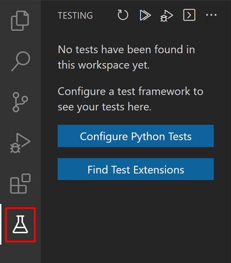
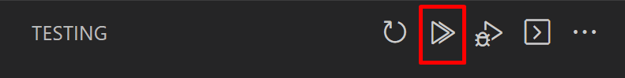
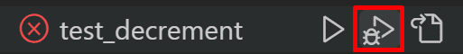
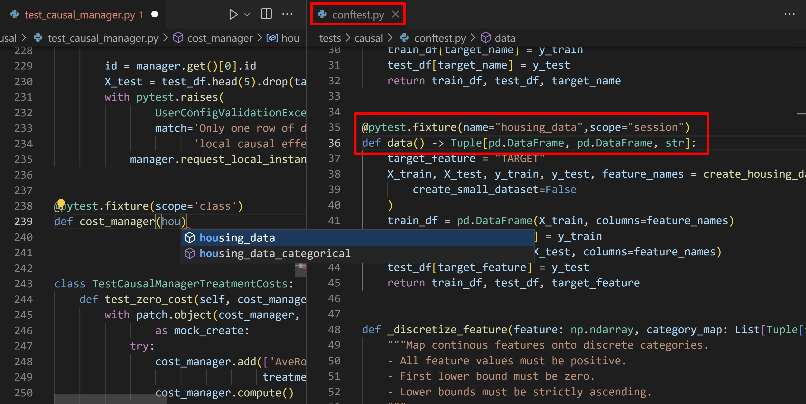
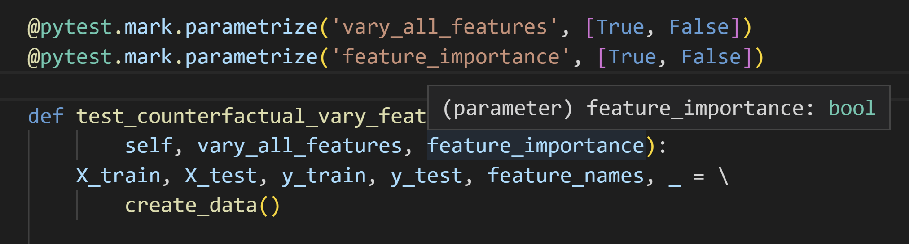
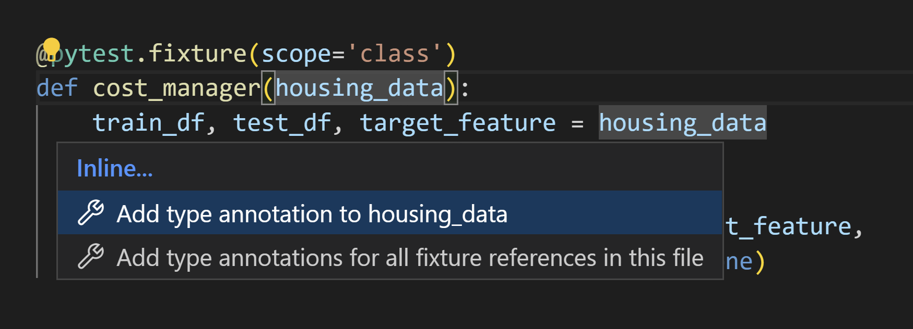

# Visual Studio Code에서의 Python 테스트 {#python-testing-in-visual-studio-code}

[Python 확장](https://marketplace.visualstudio.com/items?itemName=ms-python.python)은 Python의 내장 [unittest](https://docs.python.org/3/library/unittest.html) 프레임워크와 [pytest](https://docs.pytest.org/)를 사용한 테스트를 지원합니다.

## 단위 테스트에 대한 간단한 배경 {#a-little-background-on-unit-testing}

(단위 테스트에 이미 익숙하다면 [워크스루](#example-test-walkthroughs)로 건너뛰어도 됩니다.)

**단위**는 테스트할 특정 코드 조각으로, 함수나 클래스와 같은 것입니다. **단위 테스트**는 코드 단위를 다양한 입력으로 테스트하는 다른 코드 조각입니다. 여기에는 경계 및 엣지 케이스가 포함됩니다. unittest와 pytest 프레임워크 모두 단위 테스트를 작성하는 데 사용할 수 있습니다.

예를 들어, 사용자가 웹 양식에 입력한 계좌 번호의 형식을 검증하는 함수가 있다고 가정해 보겠습니다:

```python
def validate_account_number_format(account_string):
    # 유효하지 않으면 False를 반환하고, 유효하면 True를 반환합니다.
    # ...
```

단위 테스트는 단위의 **인터페이스**—즉, 인수와 반환 값에만 관심이 있으며—구현에는 관심이 없습니다(이 함수 본체에 코드가 표시되지 않는 이유입니다; 종종 다른 잘 테스트된 라이브러리를 사용하여 함수를 구현하게 됩니다). 이 예제에서 함수는 어떤 문자열도 받아들이고, 그 문자열이 적절하게 형식화된 계좌 번호를 포함하면 true를 반환하고, 그렇지 않으면 false를 반환합니다.

이 함수를 철저히 테스트하려면 모든 가능한 입력을 던져야 합니다: 유효한 문자열, 오타가 있는 문자열(한두 문자 차이 또는 유효하지 않은 문자가 포함된), 너무 짧거나 긴 문자열, 빈 문자열, null 인수, 제어 문자가 포함된 문자열(비텍스트 코드), HTML이 포함된 문자열, SQL 명령이나 JavaScript 코드와 같은 인젝션 공격이 포함된 문자열 등. 검증된 문자열이 나중에 데이터베이스 쿼리에서 사용되거나 앱의 UI에 표시되는 경우 인젝션 공격과 같은 보안 사례를 테스트하는 것이 특히 중요합니다.

각 입력에 대해 함수의 예상 반환 값(또는 값)을 정의합니다. 이 예제에서는 함수가 적절하게 형식화된 문자열에 대해서만 true를 반환해야 합니다. (숫자 자체가 실제 계좌인지 여부는 데이터베이스 쿼리를 통해 다른 곳에서 처리될 문제입니다.)

모든 인수와 예상 반환 값을 가지고 이제 테스트 자체를 작성합니다. 이는 특정 입력으로 함수를 호출한 다음 실제 반환 값을 예상 반환 값과 비교하는 코드 조각입니다(이 비교를 **assertion**이라고 합니다):

```python
# 테스트할 코드를 가져옵니다 {#import-the-code-to-be-tested}
import validator

# 테스트 프레임워크를 가져옵니다(이는 가상의 모듈입니다) {#import-the-test-framework-this-is-a-hypothetical-module}
import test_framework

# 이는 특정 테스트 프레임워크에 국한되지 않은 일반화된 예입니다 {#this-is-a-generalized-example-not-specific-to-a-test-framework}
class Test_TestAccountValidator(test_framework.TestBaseClass):
    def test_validator_valid_string():
        # 정확한 assertion 호출은 프레임워크에 따라 다릅니다
        assert(validate_account_number_format("1234567890"), True)

    # ...

    def test_validator_blank_string():
        # 정확한 assertion 호출은 프레임워크에 따라 다릅니다
        assert(validate_account_number_format(""), False)

    # ...

    def test_validator_sql_injection():
        # 정확한 assertion 호출은 프레임워크에 따라 다릅니다
        assert(validate_account_number_format("drop database master"), False)

    # ... 모든 다른 경우에 대한 테스트
```

코드의 정확한 구조는 사용하는 테스트 프레임워크에 따라 다르며, 이 기사 후반부에 구체적인 예가 제공됩니다. 어쨌든, 각 테스트는 간단합니다: 인수로 함수를 호출하고 예상 반환 값을 assert합니다.

모든 테스트의 결합된 결과는 테스트 보고서로, 함수(단위)가 모든 테스트 케이스에서 예상대로 작동하는지 여부를 알려줍니다. 즉, 단위가 모든 테스트를 통과하면 제대로 작동하고 있다고 확신할 수 있습니다. (**테스트 주도 개발**의 관행은 실제로 테스트를 먼저 작성한 다음 점점 더 많은 테스트를 통과하도록 코드를 작성하는 것입니다.)

단위 테스트는 작고 독립적인 코드 조각이기 때문에(단위 테스트에서는 외부 종속성을 피하고 모의 데이터 또는 기타 시뮬레이션된 입력을 사용합니다), 실행이 빠르고 비용이 적습니다. 이러한 특성 덕분에 단위 테스트를 조기에 자주 실행할 수 있습니다. 개발자는 일반적으로 코드를 리포지토리에 커밋하기 전에 단위 테스트를 실행합니다. 게이트 체크인 시스템은 커밋을 병합하기 전에 단위 테스트를 실행할 수도 있습니다. 많은 지속적 통합 시스템도 매 빌드 후 단위 테스트를 실행합니다. 단위 테스트를 조기에 자주 실행하면 **회귀**를 빠르게 발견할 수 있습니다. 회귀는 이전에 모든 단위 테스트를 통과했던 코드의 동작에서 예상치 못한 변화입니다. 테스트 실패는 특정 코드 변경으로 쉽게 추적할 수 있으므로 실패 원인을 찾고 수정하기가 쉽습니다. 이는 프로세스의 훨씬 나중에 문제를 발견하는 것보다 확실히 더 좋습니다!

단위 테스트에 대한 일반적인 배경은 [단위 테스트](https://wikipedia.org/wiki/Unit_testing)를 Wikipedia에서 읽어보세요. 유용한 단위 테스트 예제를 보려면 다양한 정렬 알고리즘에 대한 테스트가 포함된 리포지토리인 [https://github.com/gwtw/py-sorting](https://github.com/gwtw/py-sorting)를 검토할 수 있습니다.

## 예제 테스트 워크스루 {#example-test-walkthroughs}

Python 테스트는 테스트할 코드와 별도의 파일에 위치한 Python 클래스입니다. 각 테스트 프레임워크는 테스트 및 테스트 파일의 구조와 명명 규칙을 지정합니다. 테스트를 작성하고 테스트 프레임워크를 활성화하면 VS Code가 해당 테스트를 찾아 다양한 명령을 제공하여 실행하고 디버그할 수 있습니다.

이 섹션을 위해 폴더를 만들고 VS Code에서 엽니다. 그런 다음 테스트할 코드가 포함된 `inc_dec.py`라는 파일을 생성합니다:

```python
def increment(x):
    return x + 1

def decrement(x):
    return x - 1
```

이 코드로, 다음 섹션에서 설명하는 대로 VS Code에서 테스트 작업을 경험할 수 있습니다.

## 테스트 구성 {#configure-tests}

Python 확장을 설치하고 편집기 내에서 Python 파일을 열면 VS Code 활동 표시줄에 테스트 비커 아이콘이 표시됩니다. 비커 아이콘은 **테스트 탐색기** 뷰를 위한 것입니다. 테스트 탐색기를 열면 테스트 프레임워크가 활성화되지 않은 경우 **테스트 구성** 버튼이 표시됩니다. **테스트 구성**을 선택하면 테스트 프레임워크와 테스트가 포함된 폴더를 선택하라는 메시지가 표시됩니다. unittest를 사용하는 경우 테스트 파일을 식별하는 데 사용되는 파일 glob 패턴을 선택하라는 메시지도 표시됩니다.

> **참고**: 파일 glob 패턴은 와일드카드를 기반으로 파일 또는 폴더 이름과 일치하는 정의된 문자열 패턴입니다.



**Python: 테스트 구성** 명령을 사용하여 언제든지 테스트를 구성할 수 있습니다. [명령 팔레트](/docs/getstarted/userinterface.md#command-palette)에서 설정 편집기 또는 `settings.json` 파일에서 `python.testing.unittestEnabled` 또는 `python.testing.pytestEnabled`를 설정하여 수동으로 테스트를 구성할 수도 있습니다. 각 프레임워크에는 [테스트 구성 설정](#test-configuration-settings)에서 설명하는 특정 구성 설정도 있습니다.

두 프레임워크가 모두 활성화된 경우 Python 확장은 `pytest`만 실행합니다.

pytest를 활성화하면 VS Code는 현재 활성화된 환경에 프레임워크 패키지가 없으면 설치하라는 메시지를 표시합니다:


> **참고**: Python 확장을 위한 pytest의 최소 지원 버전은 7.0.0입니다.

## 테스트 생성 {#create-tests}

각 테스트 프레임워크는 테스트 파일의 명명 및 테스트 구조에 대한 고유한 규칙을 가지고 있으며, 다음 섹션에서 설명합니다. 각 경우에는 두 개의 테스트 메서드가 포함되어 있으며, 그 중 하나는 시연 목적으로 의도적으로 실패하도록 설정되어 있습니다.

### unittest의 테스트 {#tests-in-unittest}

`test_unittest.py`라는 파일을 생성하고 두 개의 테스트 메서드가 포함된 테스트 클래스를 작성합니다:

```python
import inc_dec    # 테스트할 코드
import unittest   # 테스트 프레임워크

class Test_TestIncrementDecrement(unittest.TestCase):
    def test_increment(self):
        self.assertEqual(inc_dec.increment(3), 4)

    # 이 테스트는 시연 목적으로 실패하도록 설계되었습니다.
    def test_decrement(self):
        self.assertEqual(inc_dec.decrement(3), 4)

if __name__ == '__main__':
    unittest.main()
```

### pytest의 테스트 {#tests-in-pytest}

`test_pytest.py`라는 파일을 생성하고 두 개의 테스트 메서드를 포함합니다:

```python
import inc_dec    # 테스트할 코드

def test_increment():
    assert inc_dec.increment(3) == 4

# 이 테스트는 시연 목적으로 실패하도록 설계되었습니다. {#this-test-is-designed-to-fail-for-demonstration-purposes}
def test_decrement():
    assert inc_dec.decrement(3) == 4
```

## 테스트 발견 {#test-discovery}

기본적으로 Python 확장은 프레임워크를 활성화하면 테스트를 발견하려고 시도합니다. 언제든지 명령 팔레트에서 **테스트: 테스트 새로 고침** 명령을 사용하여 테스트 발견을 트리거할 수 있습니다.

`python.testing.autoTestDiscoverOnSaveEnabled`는 기본적으로 `true`로 설정되어 있으며, 이는 작업 공간의 Python 파일을 추가, 삭제 또는 업데이트할 때마다 자동으로 테스트 발견이 수행됨을 의미합니다. 이 기능을 비활성화하려면 값을 `false`로 설정합니다. 자동 테스트 발견이 발생하는 파일을 세분화하려면 `python.testing.autoTestDiscoverOnSavePattern` 설정에 glob 패턴을 지정할 수 있습니다. 기본값은 `**/*.py`입니다.

설정 편집기에서 [설정 구성](/docs/editor/settings.md)하거나 `settings.json` 파일에서 직접 설정할 수 있습니다. 테스트 발견 설정이 적용되려면 창을 다시 로드해야 합니다.

테스트 발견은 현재 프레임워크에 대한 발견 패턴을 적용합니다(이는 [테스트 구성 설정](#test-configuration-settings)을 사용하여 사용자 지정할 수 있습니다). 기본 동작은 다음과 같습니다:

- `python.testing.unittestArgs`: 최상위 프로젝트 폴더에서 이름에 "test"가 포함된 모든 Python(`.py`) 파일을 찾습니다. 모든 테스트 파일은 가져올 수 있는 모듈 또는 패키스여야 합니다. `-p` 구성 설정으로 파일 일치 패턴을 사용자 지정하고, `-t` 설정으로 폴더를 사용자 지정할 수 있습니다.

- `python.testing.pytestArgs`: 현재 폴더 및 모든 하위 폴더 내에서 이름이 "test\_"로 시작하거나 "\_test"로 끝나는 모든 Python(`.py`) 파일을 찾습니다.

> **팁**: 때때로 하위 폴더에 배치된 테스트는 발견되지 않는데, 이는 해당 테스트 파일을 가져올 수 없기 때문입니다. 가져올 수 있도록 하려면 해당 폴더에 빈 파일 `__init__.py`를 생성하세요.

테스트 발견이 성공하면 테스트 탐색기에 테스트가 나열됩니다:


발견이 실패하면(예: 테스트 프레임워크가 설치되지 않았거나 테스트 파일에 구문 오류가 있는 경우) 테스트 탐색기에 오류 메시지가 표시됩니다. 전체 오류 메시지를 보려면 **Python** 출력 패널을 확인할 수 있습니다( **보기** > **출력** 메뉴 명령을 사용하여 **출력** 패널을 표시한 다음 오른쪽 드롭다운에서 **Python**을 선택).


VS Code가 테스트를 인식하면 [테스트 실행](#run-tests)에서 설명하는 대로 해당 테스트를 실행하는 여러 방법을 제공합니다.

## 테스트 실행 {#run-tests}

다음 작업 중 하나를 사용하여 테스트를 실행할 수 있습니다:

- 테스트 파일이 열려 있는 상태에서 테스트 정의 줄 옆에 표시된 녹색 실행 아이콘을 선택합니다. 이 명령은 해당 메서드만 실행합니다.

  

- **명령 팔레트**에서 다음 명령 중 하나를 실행합니다:

  - **테스트: 모든 테스트 실행** - 발견된 모든 테스트를 실행합니다.
  - **테스트: 현재 파일의 테스트 실행** - 편집기에서 열려 있는 파일의 모든 테스트를 실행합니다.
  - **테스트: 커서에서 테스트 실행** - 편집기에서 커서 아래에 있는 테스트 메서드만 실행합니다.

- **테스트 탐색기**에서:

  - 발견된 모든 테스트를 실행하려면 **테스트 탐색기** 상단의 재생 버튼을 선택합니다:

    

  - 특정 테스트 그룹이나 단일 테스트를 실행하려면 파일, 클래스 또는 테스트를 선택한 다음 해당 항목 오른쪽의 재생 버튼을 선택합니다:

    

  - 테스트 탐색기를 통해 테스트 선택을 실행할 수도 있습니다. 그렇게 하려면 실행하려는 테스트에서 `kbstyle(Ctrl+Click)` (또는 macOS에서는 `kbstyle(Cmd+Click)`)을 클릭하고, 그 중 하나를 마우스 오른쪽 버튼으로 클릭한 다음 **테스트 실행**을 선택합니다.

테스트 실행 후 VS Code는 결과를 편집기에서 직접 가장자리 장식으로 표시합니다. 실패한 테스트는 편집기에서 강조 표시되며, 테스트 실행 오류 메시지와 모든 테스트 실행의 기록을 표시하는 Peek View가 나타납니다. `kbstyle(Escape)`를 눌러 뷰를 닫을 수 있으며, 사용자 설정을 열어 **테스트: 자동으로 Peek View 열기** 설정의 값을 `never`로 변경하여 비활성화할 수 있습니다.

**테스트 탐색기**에서는 개별 테스트 및 해당 테스트를 포함하는 클래스와 파일에 대한 결과가 표시됩니다. 폴더 내의 테스트 중 하나라도 통과하지 못한 경우 실패 아이콘이 표시됩니다.


VS Code는 **Python 테스트 로그** 출력 패널에서도 테스트 결과를 표시합니다.


## 병렬로 테스트 실행 {#run-tests-in-parallel}

pytest와 함께 테스트를 병렬로 실행하는 지원은 `pytest-xdist` 패키지를 통해 제공됩니다. 병렬 테스트를 활성화하려면:

1. 통합 터미널을 열고 `pytest-xdist` 패키지를 설치합니다. 자세한 내용은 [프로젝트 문서 페이지](https://pypi.org/project/pytest-xdist/)를 참조하세요.

   **Windows**

   ```bat
   py -3 -m pip install pytest-xdist
   ```

   **macOS/Linux**

   ```bash
   python3 -m pip install pytest-xdist
   ```

2. 다음으로, 프로젝트 디렉터리에 `pytest.ini`라는 파일을 생성하고 사용할 CPU 수를 지정하는 아래 내용을 추가합니다. 예를 들어, 4개의 CPU를 설정하려면:

   ```ini
    [pytest]
    addopts=-n4
   ```

   또는 `pyproject.toml` 파일을 사용하는 경우:

   ```toml
    [tool.pytest.ini_options]
    addopts="-n 4"
   ```

3. 이제 테스트를 실행하면 병렬로 실행됩니다.

## 커버리지와 함께 테스트 실행 {#run-tests-with-coverage}

테스트 커버리지는 코드의 얼마나 많은 부분이 테스트로 커버되는지를 측정하는 것으로, 코드의 완전히 테스트되지 않은 영역을 식별하는 데 도움이 될 수 있습니다. 테스트 커버리지에 대한 자세한 내용은 VS Code의 [테스트 커버리지 문서](/docs/editor/testing#_test-coverage.md)를 방문하세요.

> **팁**: 현재 `"python.experiments.optInto": ["pythonTestAdapter"]`가 사용자 `settings.json`에 추가된 경우에만 커버리지를 사용하여 Python 테스트를 실행할 수 있습니다.

커버리지가 활성화된 상태에서 테스트를 실행하려면 테스트 탐색기에서 커버리지 실행 아이콘을 선택하거나 일반적으로 테스트 실행을 트리거하는 메뉴에서 “커버리지로 실행” 옵션을 선택합니다. Python 확장은 pytest를 사용하는 경우 [`pytest-cov`](https://pypi.org/project/pytest-cov/) 플러그인을 사용하여 커버리지를 실행하거나 unittest의 경우 [`coverage.py`](https://coverage.readthedocs.io/)를 사용하여 커버리지를 실행합니다.

> **참고**: 커버리지와 함께 테스트를 실행하기 전에 프로젝트에 적합한 테스트 커버리지 패키지를 설치해야 합니다.

커버리지 실행이 완료되면 편집기에서 라인 레벨 커버리지에 대해 강조 표시됩니다. 테스트 커버리지 결과는 테스트 탐색기에서 "테스트 커버리지" 하위 탭으로 나타나며, 이 패널은 명령 팔레트에서 **테스트: 테스트 커버리지 뷰에 집중**을 통해 탐색할 수 있습니다(`F1`). 이 패널에서는 작업 공간의 각 파일 및 폴더에 대한 라인 커버리지 메트릭을 볼 수 있습니다.


pytest를 사용할 때 커버리지 실행을 보다 세밀하게 제어하려면 `python.testing.pytestArgs` 설정을 편집하여 사양을 포함할 수 있습니다. pytest 인수 `--cov`가 `python.testing.pytestArgs`에 존재하면 Python 확장은 커버리지 인수에 추가 편집을 하지 않으며, 사용자 정의가 적용될 수 있도록 합니다. `--cov` 인수가 발견되지 않으면 확장은 실행 전에 pytest 인수에 `--cov=.`를 추가하여 작업 공간 루트에서 커버리지를 활성화합니다.

## 테스트 디버그 {#debug-tests}

테스트에 코드 결함이 있거나 테스트 중인 코드 영역이 실패하는 이유를 더 잘 이해하기 위해 디버거에서 테스트를 단계별로 분석해야 할 때가 있습니다. 디버깅에 대한 자세한 내용이나 VS Code에서 작동하는 방식에 대한 이해를 원하시면 [Python 디버깅 구성](/docs/python/debugging.md) 및 일반 VS Code [디버깅](/docs/editor/debugging.md) 기사를 읽어보세요.

예를 들어, 앞서 제공된 `test_decrement` 함수는 assertion 자체가 잘못되어 실패합니다. 다음 단계에서는 테스트를 분석하는 방법을 보여줍니다:

1. `test_decrement` 함수의 첫 번째 줄에 중단점을 설정합니다.

1. 함수 정의 옆의 가장자리 장식에서 마우스 오른쪽 버튼을 클릭하고 **테스트 디버그**를 선택하거나 **테스트 탐색기**에서 해당 테스트 옆의 **테스트 디버그** 아이콘을 선택합니다. VS Code는 디버거를 시작하고 중단점에서 일시 중지합니다.

   

1. **디버그 콘솔** 패널에서 `inc_dec.decrement(3)`을 입력하여 실제 결과가 2임을 확인합니다. 반면 테스트에서 지정한 예상 결과는 잘못된 값인 4입니다.

1. 디버거를 중지하고 잘못된 코드를 수정합니다:

   ```python
   # unittest
   self.assertEqual(inc_dec.decrement(3), 2)

   # pytest
   assert inc_dec.decrement(3) == 2
   ```

1. 파일을 저장하고 테스트를 다시 실행하여 통과하는지 확인하고, 가장자리 장식도 통과 상태를 나타내는지 확인합니다.

   > **참고**: 테스트를 실행하거나 디버깅할 때 테스트 파일이 자동으로 저장되지 않습니다. 테스트를 실행하기 전에 항상 테스트에 대한 변경 사항을 저장해야 합니다. 그렇지 않으면 결과가 이전 버전의 파일을 반영하기 때문에 혼란스러울 수 있습니다!

명령 팔레트에서 테스트를 디버그하기 위해 다음 명령을 사용할 수 있습니다:

- **테스트: 모든 테스트 디버그** - 작업 공간의 모든 테스트에 대해 디버거를 시작합니다.
- **테스트: 현재 파일의 테스트 디버그** - 편집기에서 열려 있는 파일에 정의된 테스트에 대해 디버거를 시작합니다.
- **테스트: 커서에서 테스트 디버그** - 편집기에서 커서가 위치한 메서드에 대해서만 디버거를 시작합니다. 선택된 범위와 발견된 모든 테스트에 대해 디버거를 시작하기 위해 테스트 탐색기에서 **테스트 디버그** 아이콘을 사용할 수도 있습니다.

가장자리 장식 클릭 시 디버그 대신 테스트를 실행하도록 기본 동작을 변경하려면 `settings.json` 파일에서 `testing.defaultGutterClickAction` 설정 값을 `debug`로 변경하세요.

디버거는 다른 Python 코드와 마찬가지로 테스트에서도 작동하며, 중단점, 변수 검사 등을 포함합니다. 테스트 디버깅을 위한 설정을 사용자 지정하려면 작업 공간의 `.vscode` 폴더 내의 `launch.json` 파일에 `"purpose": ["debug-test"]`를 지정할 수 있습니다. 이 구성은 **테스트: 모든 테스트 디버그**, **테스트: 현재 파일의 테스트 디버그** 및 **테스트: 커서에서 테스트 디버그** 명령을 실행할 때 사용됩니다.

예를 들어, `launch.json` 파일의 아래 구성은 테스트 디버깅을 위해 `justMyCode` 설정을 비활성화합니다:

```json
{
    "name": "Python: 테스트 디버그",
    "type": "debugpy",
    "request": "launch",
    "program": "$\{file\}
",
    "purpose": ["debug-test"],
    "console": "integratedTerminal",
    "justMyCode": false
}
```

`"purpose": ["debug-test"]`가 있는 구성 항목이 여러 개 있는 경우, 현재 이 요청 유형에 대해 여러 정의를 지원하지 않기 때문에 첫 번째 정의가 사용됩니다.

## 테스트 명령 {#test-commands}

아래는 VS Code에서 Python 확장을 사용하여 테스트를 지원하는 모든 명령입니다. 이들은 모두 명령 팔레트를 통해 찾을 수 있습니다:

| 명령 이름                             | 설명                                                                                                                                                                 |
| -------------------------------------- | --------------------------------------------------------------------------------------------------------------------------------------------------------------------- |
| **Python: 테스트 구성**              | Python 확장에서 사용할 테스트 프레임워크를 구성합니다.                                                                                                          |
| **테스트: 모든 결과 지우기**         | UI가 세션 간에 테스트 결과를 유지하므로 모든 테스트 상태를 지웁니다.                                                                                              |
| **테스트: 실패한 테스트 디버그**     | 가장 최근 테스트 실행에서 실패한 테스트를 디버그합니다.                                                                                                          |
| **테스트: 마지막 실행 디버그**       | 가장 최근 테스트 실행에서 실행된 테스트를 디버그합니다.                                                                                                          |
| **테스트: 커서에서 테스트 디버그**   | 편집기에서 커서가 위치한 테스트 메서드를 디버그합니다. 2021.9 이전 버전에서는 **Python: 테스트 메서드 디버그...**와 유사합니다.                                |
| **테스트: 현재 파일의 테스트 디버그**| 현재 편집기에서 열려 있는 파일의 테스트를 디버그합니다.                                                                                                          |
| **테스트: 다음 테스트 실패로 이동**   | 오류 Peek View가 열려 있는 경우, 탐색기에서 실패한 다음 테스트의 Peek View로 이동합니다.                                                                          |
| **테스트: 이전 테스트 실패로 이동**   | 오류 Peek View가 열려 있는 경우, 탐색기에서 실패한 이전 테스트의 Peek View로 이동합니다.                                                                          |
| **테스트: 출력 Peek**                | 실패한 테스트 메서드에 대한 오류 Peek View를 엽니다.                                                                                                            |
| **테스트: 테스트 새로 고침**         | 테스트 발견을 수행하고 테스트 변경, 추가 또는 삭제를 반영하도록 테스트 탐색기를 업데이트합니다. 2021.9 이전 버전에서는 **Python: 테스트 발견**과 유사합니다. |
| **테스트: 실패한 테스트 다시 실행**   | 가장 최근 테스트 실행에서 실패한 테스트를 실행합니다. 2021.9 이전 버전에서는 **Python: 실패한 테스트 실행**과 유사합니다.                                     |
| **테스트: 마지막 실행 다시 실행**     | 가장 최근 테스트 실행에서 실행된 테스트를 다시 실행합니다.                                                                                                        |
| **테스트: 모든 테스트 실행**          | 발견된 모든 테스트를 실행합니다. 2021.9 이전 버전에서는 **Python: 모든 테스트 실행**과 유사합니다.                                                                |
| **테스트: 커서에서 테스트 실행**      | 편집기에서 커서가 위치한 테스트 메서드를 실행합니다. 2021.9 이전 버전에서는 **Python: 테스트 메서드 실행...**와 유사합니다.                                    |
| **테스트: 현재 파일의 테스트 실행**   | 현재 편집기에서 열려 있는 파일의 테스트를 실행합니다. 2021.9 이전 버전에서는 **Python: 현재 테스트 파일 실행**과 유사합니다.                                   |
| **테스트: 출력 표시**                | 모든 테스트 실행의 세부 정보를 포함한 출력을 엽니다. 2021.9 이전 버전에서는 **Python: 테스트 출력 표시**와 유사합니다.                                         |
| **테스트: 테스트 탐색기 뷰에 집중**  | 테스트 탐색기 뷰를 엽니다. 2021.9 이전 버전에서는 **테스트: Python 뷰에 집중**과 유사합니다.                                                                      |
| **테스트: 테스트 새로 고침 중지**     | 테스트 발견을 취소합니다.                                                                                                                                          |

## Django 단위 테스트 {#django-unit-tests}

Python 확장은 Django 단위 테스트를 발견하고 실행하는 것도 지원합니다! 몇 가지 추가 설정 단계를 통해 Django 테스트를 발견할 수 있습니다:

> **팁**: Django 테스트 지원은 현재 `"python.experiments.optInto": ["pythonTestAdapter"]`가 사용자 `settings.json`에 추가된 경우에만 지원됩니다.

1. `settings.json` [파일](/docs/editor/settings.md#settingsjson)에서 `"python.testing.unittestEnabled": true,`를 설정합니다.
2. 환경 변수로 `MANAGE_PY_PATH`를 추가합니다:
   1. 프로젝트의 루트에 `.env` 파일을 생성합니다.
   2. `.env` 파일에 `MANAGE_PY_PATH='<path-to-manage.py>'`를 추가하고, `<path-to-manage.py>`를 애플리케이션의 `manage.py` 파일 경로로 바꿉니다.
      > **팁**: 탐색기 뷰에서 파일을 마우스 오른쪽 버튼으로 클릭하고 **경로 복사**를 선택하여 경로를 복사할 수 있습니다.
3. 필요에 따라 `settings.json` [파일](/docs/editor/settings.md#settingsjson)에서 `"python.testing.unittestArgs": []`에 Django 테스트 인수를 추가하고 Django와 호환되지 않는 인수는 제거합니다.

> **참고**: 기본적으로 Python 확장은 프로젝트 루트에서 `.env` 파일을 찾고 로드합니다. `.env` 파일이 프로젝트 루트에 없거나 [VS Code 변수 치환](/docs/reference/variables-reference.md)을 사용하는 경우, `settings.json` [파일](/docs/editor/settings.md#settingsjson)에 `"python.envFile": "$\{workspaceFolder\}
/<path-to-.env>"`를 추가하여 Python 확장이 테스트를 실행하고 발견할 때 이 파일에서 환경 변수를 로드할 수 있도록 합니다. [Python 환경 변수](/docs/python/environments.md#_environment-variables)에 대한 자세한 정보를 얻으세요.

테스트 뷰로 이동하여 **테스트 새로 고침** 버튼을 선택하면 Django 테스트가 표시됩니다!

### 문제 해결 {#troubleshooting}

Django 단위 테스트가 테스트 뷰에 표시되지 않는 경우 다음 문제 해결 단계를 시도해 보세요:

- **Python** 출력 패널에서 오류 메시지를 검색하세요. 이 메시지는 테스트가 발견되지 않는 이유에 대한 힌트를 제공할 수 있습니다.
- [터미널에서 Django 테스트를 실행](https://docs.djangoproject.com/en/dev/topics/testing/overview/#running-tests)해 보세요. 그런 다음 동일한 명령을 VS Code 설정으로 "변환"합니다.
  예를 들어, 터미널에서 `python manage.py test --arg`를 실행하면 `.env` 파일에 `MANAGE_PY_PATH='./manage.py'`를 추가하고, VS Code 설정에서 `"python.testing.unittestArgs": [--arg]`를 설정합니다.

  또는 Python 확장에서 실행되는 명령을 **Python** 출력 패널에서 찾을 수도 있습니다.

- `MANAGE_PY_PATH` 환경 변수를 설정할 때 상대 경로를 사용한 경우 절대 경로를 사용하세요.

## pytest에 대한 IntelliSense {#intellisense-for-pytest}

[Pylance](https://marketplace.visualstudio.com/items?itemName=ms-python.vscode-pylance)는 [pytest fixtures](https://docs.pytest.org/en/6.2.x/fixture.html) 및 [매개변수화된 테스트](https://docs.pytest.org/en/6.2.x/parametrize.html)와 함께 작업할 때 더 효율적으로 작업할 수 있도록 도와주는 IntelliSense 기능을 제공합니다.

테스트 함수의 매개변수를 입력하는 동안 Pylance는 `@pytest.mark.parametrize` 데코레이터의 인수 이름과 테스트 파일이나 `conftest.py`에 정의된 기존 pytest fixtures를 포함하는 [완성 목록](/docs/python/editing.md#autocomplete-and-intellisense)을 제공합니다. **정의로 이동** 및 **모든 참조 찾기**와 같은 [코드 탐색](/docs/python/editing.md#navigation) 기능과 [기호 이름 바꾸기 리팩토링](/docs/editor/refactoring.md#rename-symbol)도 지원됩니다.



fixture 참조 또는 매개변수화된 인수 참조 위에 마우스를 올리면 Pylance는 fixture의 반환 값을 기반으로 하거나 매개변수화 데코레이터에 전달된 인수의 추론된 유형을 기반으로 추론된 유형 주석을 표시합니다.



Pylance는 fixture 매개변수가 있는 테스트 함수에 유형 주석을 추가하는 [코드 작업](/docs/editor/refactoring.md#code-actions--quick-fixes-and-refactorings)도 제공합니다. 추론된 fixture 매개변수 유형에 대한 인레이 힌트도 사용자 설정에서 `python.analysis.inlayHints.pytestParameters`를 `true`로 설정하여 활성화할 수 있습니다.



## 테스트 구성 설정 {#test-configuration-settings}

Python으로 테스트하는 동작은 VS Code에서 제공하는 일반 UI 설정과 Python 및 활성화된 프레임워크에 특정한 설정에 의해 결정됩니다.

### 일반 UI 설정 {#general-ui-settings}

테스트 기능의 UI에 영향을 미치는 설정은 VS Code 자체에서 제공되며, "테스트"를 검색할 때 [VS Code 설정 편집기](/docs/editor/settings.md)에서 찾을 수 있습니다.

### 일반 Python 설정 {#general-python-settings}

| 설정<br/>(python.testing.) | 기본값   | 설명                                                                                                                                                                          |
| --------------------------- | --------- | ------------------------------------------------------------------------------------------------------------------------------------------------------------------------------ |
| autoTestDiscoverOnSaveEnabled | `true`    | 테스트 파일을 저장할 때 자동으로 테스트 발견을 활성화하거나 비활성화할지를 지정합니다. 이 설정을 변경한 후에는 창을 다시 로드해야 할 수 있습니다.                           |
| autoTestDiscoverOnSavePattern | `**/*.py` | `autoTestDiscoverOnSaveEnabled`가 `true`일 때 자동 테스트 발견을 트리거하는 파일 변경을 결정하는 glob 패턴을 지정합니다.                                                  |
| cwd                         | null      | 테스트를 위한 선택적 작업 디렉터리를 지정합니다.                                                                                                                                   |
| debugPort                   | `3000`    | unittest 테스트 디버깅에 사용되는 포트 번호입니다.                                                                                                                                |
| promptToConfigure           | `true`    | 잠재적인 테스트가 발견되면 VS Code가 테스트 프레임워크를 구성하라는 메시지를 표시할지를 지정합니다.                                                                               |

### unittest 구성 설정 {#unittest-configuration-settings}

| unittest 설정<br/>(python.testing.) | 기본값                                | 설명                                                                                                                                                       |
| ------------------------------------ | ------------------------------------- | --------------------------------------------------------------------------------------------------------------------------------------------------------- |
| unittestEnabled                      | `false`                               | unittest가 테스트 프레임워크로 활성화되는지를 지정합니다. pytest에 대한 동등한 설정은 비활성화되어야 합니다.                                             |
| unittestArgs                         | `["-v", "-s", ".", "-p", "*test*.py"]` | unittest에 전달할 인수로, 공백으로 구분된 각 요소는 목록의 별도 항목입니다. 기본값에 대한 설명은 아래를 참조하세요.                                        |

unittest의 기본 인수는 다음과 같습니다:

- `-v`는 기본적인 자세한 출력을 설정합니다. 이 인수를 제거하면 더 간단한 출력을 얻을 수 있습니다.
- `-s .`는 테스트 발견을 위한 시작 디렉터리를 지정합니다. "test" 폴더에 테스트가 있는 경우 인수를 `-s test`로 변경합니다(즉, 인수 배열에서 `"-s", "test"`를 의미합니다).
- `-p *test*.py`는 테스트를 찾기 위해 사용되는 발견 패턴입니다. 이 경우 "test"라는 단어가 포함된 모든 `.py` 파일입니다. 테스트 파일 이름을 다르게 지정하는 경우(예: 모든 파일 이름에 "_test"를 추가하는 경우), 배열의 적절한 인수에서 `*_test.py`와 같은 패턴을 사용합니다.

첫 번째 실패에서 테스트 실행을 중단하려면 인수 배열에 `"-f"`를 추가하여 빠른 실패 옵션을 추가합니다.

[unittest 명령줄 인터페이스](https://docs.python.org/3/library/unittest.html#command-line-interface)에서 사용 가능한 전체 옵션 세트를 확인하세요.

### pytest 구성 설정 {#pytest-configuration-settings}

| pytest 설정<br/>(python.testing.) | 기본값    | 설명                                                                                                                                                                                                                   |
| ---------------------------------- | ---------- | --------------------------------------------------------------------------------------------------------------------------------------------------------------------------------------------------------------------- |
| pytestEnabled                      | `false`    | pytest가 테스트 프레임워크로 활성화되는지를 지정합니다. unittest에 대한 동등한 설정은 비활성화되어야 합니다.                                                                                                      |
| pytestPath                         | `"pytest"` | pytest의 경로입니다. pytest가 현재 환경 외부에 위치한 경우 전체 경로를 사용하세요.                                                                                                                                 |
| pytestArgs                         | `[]`       | pytest에 전달할 인수로, 공백으로 구분된 각 요소는 목록의 별도 항목입니다. [pytest 명령줄 옵션](https://docs.pytest.org/en/latest/reference/reference.html#command-line-flags)을 참조하세요. |

`pytest.ini` 파일을 사용하여 pytest를 구성할 수도 있습니다. [pytest 구성](https://docs.pytest.org/en/latest/reference/customize.html)에서 설명합니다.

> **참고**
> pytest-cov 커버리지 모듈이 설치된 경우, VS Code는 디버깅 중에 중단점에서 멈추지 않습니다. 이는 pytest-cov가 실행 중인 소스 코드에 접근하기 위해 동일한 기술을 사용하기 때문입니다. 이 동작을 방지하려면 디버깅할 때 `pytestArgs`에 `--no-cov`를 포함하세요. 예를 들어, 디버그 구성에 `"env": {"PYTEST_ADDOPTS": "--no-cov"}`를 추가합니다. (디버그 구성 설정 방법에 대한 자세한 내용은 [테스트 디버그](#debug-tests) 위를 참조하세요.) (자세한 내용은 [디버거 및 PyCharm](https://pytest-cov.readthedocs.io/en/latest/debuggers.html)에서 pytest-cov 문서를 참조하세요.)

### IntelliSense 설정 {#intellisense-settings}

| IntelliSense 설정<br/>(python.analysis.) | 기본값 | 설명                                                                                               |
| ---------------------------------------- | ------- | ------------------------------------------------------------------------------------------------- |
| inlayHints.pytestParameters              | false   | pytest fixture 인수 유형에 대한 인레이 힌트를 표시할지를 지정합니다. 허용되는 값은 `true` 또는 `false`입니다. |

## 참조 {#see-also}

- [Python 환경](/docs/python/environments.md) - 편집 및 디버깅에 사용되는 Python 인터프리터를 제어합니다.
- [설정 참조](/docs/python/settings-reference.md) - VS Code에서 Python 관련 설정의 전체 범위를 탐색합니다.