# Visual Studio Code에서의 Django 튜토리얼 {#django-tutorial-in-visual-studio-code}

Django는 빠르고 안전하며 확장 가능한 웹 개발을 위해 설계된 고급 Python 프레임워크입니다. Django는 URL 라우팅, 페이지 템플릿 및 데이터 작업에 대한 풍부한 지원을 포함합니다.

이 Django 튜토리얼에서는 공통 기본 템플릿을 사용하는 세 개의 페이지로 구성된 간단한 Django 앱을 생성합니다. 이 앱은 Visual Studio Code의 맥락에서 생성되어 VS Code 터미널, 편집기 및 디버거에서 Django와 작업하는 방법을 이해하는 데 도움이 됩니다. 이 튜토리얼은 데이터 모델 작업 및 관리 인터페이스 생성과 같은 Django 자체에 대한 다양한 세부 사항을 탐구하지 않습니다. 이러한 측면에 대한 안내는 이 튜토리얼 끝에 있는 Django 문서 링크를 참조하십시오.

이 Django 튜토리얼의 완성된 코드 프로젝트는 GitHub에서 확인할 수 있습니다: [python-sample-vscode-django-tutorial](https://github.com/microsoft/python-sample-vscode-django-tutorial).

문제가 있는 경우 [Python 확장 토론 Q&A](https://github.com/microsoft/vscode-python/discussions/categories/q-a)에서 답변을 검색하거나 질문할 수 있습니다.

## 필수 조건 {#prerequisites}

이 Django 튜토리얼을 성공적으로 완료하려면 다음을 수행해야 합니다(이는 [일반 Python 튜토리얼](/docs/python/python-tutorial.md)와 동일한 단계입니다):

1. [Python 확장](https://marketplace.visualstudio.com/items?itemName=ms-python.python)을 설치합니다.

1. Python 3 버전을 설치합니다(이 튜토리얼은 이 버전을 기준으로 작성되었습니다). 옵션은 다음과 같습니다:

   - (모든 운영 체제) [python.org](https://www.python.org/downloads/)에서 다운로드; 일반적으로 페이지에 처음 나타나는 **Download Python 3.9.1** 버튼(또는 최신 버전)을 사용합니다.
   - (Linux) 내장된 Python 3 설치가 잘 작동하지만 다른 Python 패키지를 설치하려면 터미널에서 `sudo apt install python3-pip`를 실행해야 합니다.
   - (macOS) `brew install python3`를 사용하여 macOS에서 [Homebrew](https://brew.sh/)를 통해 설치합니다(시스템에 설치된 Python은 macOS에서 지원되지 않습니다).
   - (모든 운영 체제) [Anaconda](https://www.anaconda.com/download/)에서 다운로드합니다(데이터 과학 용도).

1. Windows에서는 Python 인터프리터의 위치가 PATH 환경 변수에 포함되어 있는지 확인합니다. 명령 프롬프트에서 `path`를 실행하여 위치를 확인할 수 있습니다. Python 인터프리터의 폴더가 포함되어 있지 않으면 Windows 설정을 열고 "환경"을 검색한 다음 **내 계정에 대한 환경 변수 편집**을 선택하고 **Path** 변수를 편집하여 해당 폴더를 포함시킵니다.

## Django 튜토리얼을 위한 프로젝트 환경 만들기 {#create-a-project-environment-for-the-django-tutorial}

이 섹션에서는 Django가 설치된 가상 환경을 생성합니다. 가상 환경을 사용하면 Django를 전역 Python 환경에 설치하는 것을 피하고 애플리케이션에서 사용하는 라이브러리를 정확하게 제어할 수 있습니다. 가상 환경은 또한 [환경을 위한 requirements.txt 파일 만들기](#create-a-requirementstxt-file-for-the-environment)를 쉽게 만듭니다.

1. 파일 시스템에서 이 튜토리얼을 위한 프로젝트 폴더를 생성합니다. 예를 들어 `hello_django`와 같은 이름을 사용할 수 있습니다.

1. 해당 폴더에서 다음 명령을 사용하여 현재 인터프리터를 기반으로 `.venv`라는 이름의 가상 환경을 생성합니다(컴퓨터에 적합한 명령을 사용):

   ```bash
   # Linux
   sudo apt-get install python3-venv    # 필요한 경우
   python3 -m venv .venv
   source .venv/bin/activate

   # macOS
   python3 -m venv .venv
   source .venv/bin/activate

   # Windows
   py -3 -m venv .venv
   .venv\scripts\activate
   ```

   > **참고**: 위 명령을 실행할 때는 기본 Python 설치를 사용하십시오. Anaconda 설치에서 `python.exe`를 사용하면 ensurepip 모듈이 없기 때문에 오류가 발생하고 환경이 미완료 상태로 남게 됩니다.

1. `code .`를 실행하여 VS Code에서 프로젝트 폴더를 열거나 VS Code를 실행하고 **파일** > **폴더 열기** 명령을 사용합니다.

1. VS Code에서 명령 팔레트를 열고 (**보기** > **명령 팔레트** 또는 (`kb(workbench.action.showCommands)`)). 그런 다음 **Python: 인터프리터 선택** 명령을 선택합니다:

   

1. 명령은 VS Code가 자동으로 찾을 수 있는 사용 가능한 인터프리터 목록을 표시합니다(목록은 다를 수 있습니다. 원하는 인터프리터가 보이지 않으면 [Python 환경 구성](/docs/python/environments.md)을 참조하십시오). 목록에서 `./.venv` 또는 `.\.venv`로 시작하는 프로젝트 폴더의 가상 환경을 선택합니다:

   

1. 명령 팔레트에서 [**터미널: 새 터미널 만들기**](/docs/terminal/basics.md) (`kb(workbench.action.terminal.new)`)를 실행하여 터미널을 생성하고 자동으로 가상 환경을 활성화합니다.

   > **참고**: Windows에서 기본 터미널 유형이 PowerShell인 경우 스크립트 실행이 시스템에서 비활성화되어 activate.ps1을 실행할 수 없다는 오류가 발생할 수 있습니다. 오류는 스크립트를 허용하는 방법에 대한 정보를 제공하는 링크를 제공합니다. 그렇지 않으면 **터미널: 기본 프로필 선택**을 사용하여 "명령 프롬프트" 또는 "Git Bash"를 기본값으로 설정합니다.

1. 선택한 환경은 VS Code 상태 표시줄의 오른쪽에 나타나며, 가상 환경을 사용하고 있음을 나타내는 **('.venv': venv)** 표시기가 나타납니다:

   

1. VS Code 터미널에서 다음 명령을 실행하여 가상 환경에서 pip를 업데이트합니다:

   ```bash
   python -m pip install --upgrade pip
   ```

1. VS Code 터미널에서 다음 명령을 실행하여 가상 환경에 Django를 설치합니다:

   ```bash
   python -m pip install django
   ```

이제 Django 코드를 작성할 준비가 된 독립적인 환경이 마련되었습니다. VS Code는 [**터미널: 새 터미널 만들기**](/docs/terminal/basics.md) (`kb(workbench.action.terminal.new)`)를 사용할 때 환경을 자동으로 활성화합니다. 별도의 명령 프롬프트나 터미널을 열면 `source .venv/bin/activate` (Linux/macOS) 또는 `.venv\Scripts\Activate.ps1` (Windows)를 실행하여 환경을 활성화합니다. 명령 프롬프트의 시작 부분에 **(.venv)**가 표시되면 환경이 활성화된 것입니다.

## 최소한의 Django 앱 만들기 및 실행 {#create-and-run-a-minimal-django-app}

Django 용어에서 "Django 프로젝트"는 여러 사이트 수준 구성 파일과 웹 호스트에 배포하여 전체 웹 애플리케이션을 생성하는 하나 이상의 "앱"으로 구성됩니다. Django 프로젝트는 여러 개의 앱을 포함할 수 있으며, 각 앱은 일반적으로 프로젝트에서 독립적인 기능을 가지고 있으며, 동일한 앱은 여러 Django 프로젝트에 포함될 수 있습니다. 앱은 Django가 기대하는 특정 규칙을 따르는 Python 패키지일 뿐입니다.

따라서 최소한의 Django 앱을 만들려면 먼저 앱의 컨테이너 역할을 할 Django 프로젝트를 생성한 다음 앱 자체를 생성해야 합니다. 두 가지 목적을 위해 Django 패키지를 설치할 때 설치되는 Django 관리 유틸리티인 `django-admin`을 사용합니다.

### Django 프로젝트 만들기 {#create-the-django-project}

1. 가상 환경이 활성화된 VS Code 터미널에서 다음 명령을 실행합니다:

   ```bash
   django-admin startproject web_project .
   ```

   이 `startproject` 명령은 현재 폴더가 프로젝트 폴더라는 가정을 하며(`.` 사용), 그 안에 다음을 생성합니다:

   - `manage.py`: 프로젝트를 위한 Django 명령줄 관리 유틸리티입니다. 프로젝트에 대한 관리 명령은 `python manage.py <command> [options]`를 사용하여 실행합니다.

   - `web_project`라는 하위 폴더가 생성되며, 이 폴더에는 다음 파일이 포함됩니다:
     - `__init__.py`: 이 폴더가 Python 패키지임을 Python에 알리는 빈 파일입니다.
     - `asgi.py`: [ASGI 호환](https://asgi.readthedocs.io/en/latest/) 웹 서버가 프로젝트를 제공하는 진입점입니다. 이 파일은 일반적으로 그대로 두며, 프로덕션 웹 서버를 위한 훅을 제공합니다.
     - `settings.py`: Django 프로젝트의 설정을 포함하며, 웹 앱 개발 과정에서 수정합니다.
     - `urls.py`: Django 프로젝트의 목차를 포함하며, 개발 과정에서 수정합니다.
     - `wsgi.py`: WSGI 호환 웹 서버가 프로젝트를 제공하는 진입점입니다. 이 파일은 일반적으로 그대로 두며, 프로덕션 웹 서버를 위한 훅을 제공합니다.

1. 다음 명령을 실행하여 빈 개발 데이터베이스를 생성합니다:

   ```bash
   python manage.py migrate
   ```

   서버를 처음 실행할 때 기본 SQLite 데이터베이스가 `db.sqlite3` 파일에 생성되며, 이는 개발 용도로 의도되지만 저용량 웹 앱의 프로덕션에서도 사용할 수 있습니다. 데이터베이스에 대한 추가 정보는 [데이터베이스 유형](#types-of-databases) 섹션을 참조하십시오.

1. Django 프로젝트를 확인하려면 가상 환경이 활성화되어 있는지 확인한 후 `python manage.py runserver` 명령을 사용하여 Django의 개발 서버를 시작합니다. 서버는 기본 포트 8000에서 실행되며, 터미널 창에 다음과 같은 출력이 표시됩니다:

   ```bash
   Watching for file changes with StatReloader
   Performing system checks...

   System check identified no issues (0 silenced).
   June 13, 2023 - 18:38:07
   Django version 4.2.2, using settings 'web_project.settings'
   Starting development server at http://127.0.0.1:8000/
   Quit the server with CTRL-BREAK.
   ```

   Django의 내장 웹 서버는 _오직_ 로컬 개발 용도로만 의도되었습니다. 그러나 웹 호스트에 배포할 때 Django는 호스트의 웹 서버를 사용합니다. Django 프로젝트의 `wsgi.py` 및 `asgi.py` 모듈은 프로덕션 서버와의 연결을 처리합니다.

   기본 8000 포트 외에 다른 포트를 사용하려면 명령줄에서 포트 번호를 지정합니다. 예: `python manage.py runserver 5000`.

1. 터미널 출력 창에서 `http://127.0.0.1:8000/` URL을 `kbstyle(Ctrl+click)`하여 기본 브라우저에서 해당 주소를 엽니다. Django가 올바르게 설치되고 프로젝트가 유효하면 아래에 표시된 기본 페이지가 나타납니다. VS Code 터미널 출력 창에도 서버 로그가 표시됩니다.

   

1. 작업이 끝나면 브라우저 창을 닫고 터미널 출력 창에 표시된 대로 `kbstyle(Ctrl+C)`를 사용하여 VS Code에서 서버를 중지합니다.

### Django 앱 만들기 {#create-a-django-app}

1. 가상 환경이 활성화된 VS Code 터미널에서 프로젝트 폴더(여기서 `manage.py`가 위치한 곳)에서 관리 유틸리티의 `startapp` 명령을 실행합니다:

   ```bash
   python manage.py startapp hello
   ```

   이 명령은 여러 코드 파일과 하나의 하위 폴더를 포함하는 `hello`라는 폴더를 생성합니다. 이 중에서 자주 작업하는 파일은 웹 앱의 페이지를 정의하는 함수가 포함된 `views.py`와 데이터 객체를 정의하는 클래스가 포함된 `models.py`입니다. `migrations` 폴더는 이 튜토리얼 후반부에서 논의할 데이터베이스 버전을 관리하기 위해 Django의 관리 유틸리티에서 사용됩니다. 또한 `apps.py` (앱 구성), `admin.py` (관리 인터페이스 생성용), `tests.py` (테스트 생성용) 파일도 있지만 여기서는 다루지 않습니다.

1. `hello/views.py`를 수정하여 앱의 홈 페이지에 대한 단일 보기를 생성하는 다음 코드와 일치하도록 합니다:

   ```python
   from django.http import HttpResponse

   def home(request):
       return HttpResponse("안녕하세요, Django!")
   ```

1. `hello/urls.py`라는 파일을 생성하고 아래 내용을 추가합니다. `urls.py` 파일은 다양한 URL을 적절한 뷰로 라우팅하기 위한 패턴을 지정하는 곳입니다. 아래 코드는 앱의 루트 URL(`""`)을 방금 `hello/views.py`에 추가한 `views.home` 함수에 매핑하는 하나의 경로를 포함합니다:

   ```python
   from django.urls import path
   from hello import views

   urlpatterns = [
       path("", views.home, name="home"),
   ]
   ```

1. `web_project` 폴더에도 URL 라우팅이 실제로 처리되는 `urls.py` 파일이 포함되어 있습니다. `web_project/urls.py`를 열고 다음 코드와 일치하도록 수정합니다(원하는 경우 설명 주석을 유지할 수 있습니다). 이 코드는 앱의 `hello/urls.py`를 `django.urls.include`를 사용하여 가져오며, 앱의 경로를 앱 내에 포함시킵니다. 이러한 분리는 프로젝트에 여러 앱이 포함될 때 유용합니다.

   ```python
   from django.contrib import admin
   from django.urls import include, path

   urlpatterns = [
       path("", include("hello.urls")),
       path('admin/', admin.site.urls)
   ]
   ```

1. 수정된 모든 파일을 저장합니다.

1. VS Code 터미널에서 다시 가상 환경이 활성화된 상태에서 `python manage.py runserver`를 실행하고 브라우저에서 `http://127.0.0.1:8000/`로 이동하여 "안녕하세요, Django"라는 페이지를 확인합니다.

   

## 디버거 실행 프로필 만들기 {#create-a-debugger-launch-profile}

서버를 실행하고 앱을 테스트하는 더 쉬운 방법이 있는지 궁금할 것입니다. 다행히도 있습니다! VS Code에서 사용자 정의 실행 프로필을 생성할 수 있으며, 이는 불가피한 디버깅 작업에도 사용됩니다.

1. VS Code에서 **실행** 보기로 전환합니다(왼쪽 활동 표시줄 또는 `kb(workbench.action.debug.start)` 사용). "실행 및 디버그를 사용자 정의하려면 launch.json 파일을 생성하십시오."라는 메시지가 표시될 수 있습니다. 이는 아직 디버그 구성이 포함된 `launch.json` 파일이 없음을 의미합니다. **launch.json 파일 생성** 링크를 클릭하면 VS Code가 이를 생성할 수 있습니다:

   

1. 링크를 선택하면 VS Code가 디버그 구성을 요청합니다. 드롭다운에서 **Django**를 선택하면 VS Code가 Django 실행 구성이 포함된 새 `launch.json` 파일을 채웁니다. `launch.json` 파일에는 각각이 `configuration` 배열 내의 별도의 JSON 객체인 여러 디버깅 구성이 포함됩니다.

1. 아래로 스크롤하여 "Python: Django"라는 이름의 구성을 확인합니다:

   ```json
   {
       // 가능한 속성에 대해 IntelliSense를 사용하십시오.
       // 설명을 보려면 마우스를 올리십시오.
       // 자세한 내용은 다음을 방문하십시오: https://go.microsoft.com/fwlink/?linkid=830387
       "version": "0.2.0",
       "configurations": [
           {
               "name": "Python Debugger: Django",
               "type": "debugpy",
               "request": "launch",
               "program": "$\{workspaceFolder\}/manage.py",
               "args": [
                   "runserver"
               ],
               "django": true,
               "justMyCode": true
           }
       ]
   }
   ```

   이 구성은 VS Code에 선택한 Python 인터프리터와 `args` 목록의 인수를 사용하여 `"$\{workspaceFolder\}/manage.py"`를 실행하도록 지시합니다. 따라서 이 구성을 사용하여 VS Code 디버거를 시작하는 것은 활성화된 가상 환경에서 VS Code 터미널에서 `python manage.py runserver`를 실행하는 것과 동일합니다. (원하는 경우 `args`에 포트 번호를 추가할 수 있습니다.) `"django": true` 항목은 또한 VS Code에 Django 페이지 템플릿의 디버깅을 활성화하도록 지시합니다. 이는 이 튜토리얼 후반부에서 확인할 수 있습니다.

1. **실행** > **디버깅 시작** 메뉴 명령을 선택하거나 목록 옆의 녹색 **디버깅 시작** 화살표를 선택하여 구성을 테스트합니다 (`kb(workbench.action.debug.continue)`):

   

1. 터미널 출력 창에서 `http://127.0.0.1:8000/` URL을 `kbstyle(Ctrl+click)`하여 브라우저를 열고 앱이 제대로 실행되고 있는지 확인합니다.

1. 작업이 끝나면 브라우저를 닫고 디버거를 중지합니다. 디버거를 중지하려면 중지 도구 모음 버튼(빨간 사각형) 또는 **실행** > **디버깅 중지** 명령 (`kb(workbench.action.debug.stop)`)을 사용합니다.

1. 이제 언제든지 **실행** > **디버깅 시작**을 사용하여 앱을 테스트할 수 있으며, 이 방법은 수정된 모든 파일을 자동으로 저장하는 이점도 있습니다.

## 디버거 탐색 {#explore-the-debugger}

디버깅은 특정 코드 줄에서 실행 중인 프로그램을 일시 중지할 수 있는 기회를 제공합니다. 프로그램이 일시 중지되면 변수를 검사하고, 디버그 콘솔 패널에서 코드를 실행하며, [디버깅](/docs/python/debugging.md)에서 설명한 기능을 활용할 수 있습니다. 디버거를 실행하면 디버깅 세션이 시작되기 전에 수정된 파일이 자동으로 저장됩니다.

**시작하기 전에**: 마지막 섹션의 끝에서 `kbstyle(Ctrl+C)`를 사용하여 실행 중인 앱을 중지했는지 확인합니다. 한 터미널에서 앱을 실행한 상태로 두면 해당 포트를 계속 소유하게 됩니다. 결과적으로 동일한 포트를 사용하여 디버거에서 앱을 실행하면 원래 실행 중인 앱이 모든 요청을 처리하고 디버깅 중인 앱에서는 아무런 활동이 보이지 않으며 프로그램이 중단점에서 멈추지 않습니다. 즉, 디버거가 작동하지 않는 것처럼 보이면 다른 인스턴스의 앱이 여전히 실행되고 있지 않은지 확인하십시오.

1. `hello/urls.py`에서 `urlpatterns` 목록에 경로를 추가합니다:

   ```python
   path("hello/<name>", views.hello_there, name="hello_there"),
   ```

   `path`의 첫 번째 인수는 변수 문자열인 _name_을 수용하는 "hello/" 경로를 정의합니다. 이 문자열은 `path`의 두 번째 인수로 지정된 `views.hello_there` 함수에 전달됩니다.

   URL 경로는 대소문자를 구분합니다. 예를 들어, 경로 `/hello/<name>`는 `/Hello/<name>`와 다릅니다. 동일한 보기 함수를 두 경로 모두 처리하도록 하려면 각 변형에 대한 경로를 정의하십시오.

1. `views.py`의 내용을 다음 코드로 교체하여 디버거에서 단계별로 실행할 수 있는 `hello_there` 함수를 정의합니다:

   ```python
   import re
   from django.utils.timezone import datetime
   from django.http import HttpResponse

   def home(request):
       return HttpResponse("안녕하세요, Django!")

   def hello_there(request, name):
       now = datetime.now()
       formatted_now = now.strftime("%A, %d %B, %Y at %X")

       # 이름 인수를 정규 표현식을 사용하여 문자만 필터링합니다. URL 인수는
       # 임의의 텍스트를 포함할 수 있으므로 안전한 문자로 제한합니다.
       match_object = re.match("[a-zA-Z]+", name)

       if match_object:
           clean_name = match_object.group(0)
       else:
           clean_name = "친구"

       content = "안녕하세요, " + clean_name + "! 현재 시간은 " + formatted_now + "입니다."
       return HttpResponse(content)
   ```

   URL 경로에서 정의된 `name` 변수는 `hello_there` 함수에 인수로 전달됩니다. 코드 주석에서 설명한 대로, 항상 임의의 사용자 제공 정보를 필터링하여 앱에 대한 다양한 공격을 피해야 합니다. 이 경우 코드는 이름 인수를 문자만 포함하도록 필터링하여 제어 문자, HTML 등을 주입하는 것을 방지합니다. (다음 섹션에서 템플릿을 사용할 때 Django는 자동 필터링을 수행하므로 이 코드는 필요하지 않습니다.)

1. `hello_there` 함수의 첫 번째 코드 줄(`now = datetime.now()`)에 중단점을 설정합니다. 다음 방법 중 하나를 사용하여 설정할 수 있습니다:

   - 커서를 해당 줄에 놓고 `kb(editor.debug.action.toggleBreakpoint)`를 누르거나,
   - 커서를 해당 줄에 놓고 **실행** > **중단점 전환** 메뉴 명령을 선택하거나,
   - 줄 번호 왼쪽 여백을 클릭하여 중단점을 설정합니다(여기에서 마우스를 올리면 흐릿한 빨간 점이 나타납니다).

   중단점은 왼쪽 여백에 빨간 점으로 표시됩니다:

   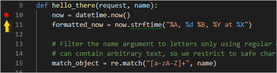

1. **실행** > **디버깅 시작** 메뉴 명령을 선택하거나 목록 옆의 녹색 **디버깅 시작** 화살표를 선택하여 디버거를 시작합니다 (`kb(workbench.action.debug.continue)`):

   

   디버깅 중임을 나타내기 위해 상태 표시줄의 색상이 변경됩니다:

   

   디버깅 도구 모음(아래 그림 참조)이 VS Code에 나타나며, 다음 순서로 명령이 포함됩니다: 일시 중지(또는 계속, `kb(workbench.action.debug.continue)`), 한 단계 건너뛰기(`kb(workbench.action.debug.stepOver)`), 한 단계 들어가기(`kb(workbench.action.debug.stepInto)`), 한 단계 나가기(`kb(workbench.action.debug.stepOut)`), 다시 시작(`kb(workbench.action.debug.restart)`), 중지(`kb(workbench.action.debug.stop)`). 각 명령에 대한 설명은 [VS Code 디버깅](/docs/editor/debugging.md)을 참조하십시오.

   

1. "Python Debug Console" 터미널에 출력이 나타납니다. 브라우저를 열고 `http://127.0.0.1:8000/hello/VSCode`로 이동합니다. 페이지가 렌더링되기 전에 VS Code는 설정한 중단점에서 프로그램을 일시 중지합니다. 중단점에 있는 작은 노란색 화살표는 다음에 실행될 코드 줄을 나타냅니다.

   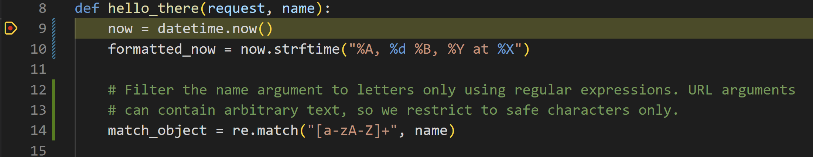

1. 한 단계 건너뛰기를 사용하여 `now = datetime.now()` 문을 실행합니다.

1. VS Code 창의 왼쪽에 있는 **변수** 패널에서 `now`와 같은 지역 변수와 `name`과 같은 인수를 확인할 수 있습니다. 그 아래에는 **감시**, **호출 스택**, **중단점** 패널이 있습니다(자세한 내용은 [VS Code 디버깅](/docs/editor/debugging.md)을 참조하십시오). **로컬** 섹션에서 다양한 값을 확장해 보십시오. 값을 두 번 클릭하거나 `kb(debug.setVariable)`를 사용하여 수정할 수도 있습니다. 그러나 `now`와 같은 변수를 변경하면 프로그램이 중단될 수 있습니다. 개발자는 일반적으로 코드가 처음에 올바른 값을 생성하지 않았을 때 수정하기 위해서만 값을 변경합니다.

   

1. 프로그램이 일시 중지되면 **디버그 콘솔** 패널(터미널 패널의 "Python Debug Console"과는 다름)에서 표현식을 실험하고 현재 프로그램 상태를 사용하여 코드 조각을 시도할 수 있습니다. 예를 들어, `now = datetime.now()` 줄을 건너뛴 후에는 다양한 날짜/시간 형식으로 실험할 수 있습니다. 편집기에서 `now.strftime("%A, %d %B, %Y at %X")`라는 코드를 선택한 다음 마우스 오른쪽 버튼을 클릭하고 **디버그: 평가**를 선택하여 해당 코드를 디버그 콘솔로 전송하여 실행합니다:

   ```bash
   now.strftime("%A, %d %B, %Y at %X")
   'Friday, 07 September, 2018 at 07:46:32'
   ```

   > **팁**: **디버그 콘솔**은 터미널에 나타나지 않을 수 있는 앱 내의 예외도 표시합니다. 예를 들어, **실행 및 디버그** 보기의 **호출 스택** 영역에서 "예외에서 일시 중지됨" 메시지가 표시되면 **디버그 콘솔**로 전환하여 예외 메시지를 확인하십시오.

1. 해당 줄을 디버그 콘솔 하단의 > 프롬프트에 복사하고 형식을 변경해 보십시오:

   ```bash
   now.strftime("%A, %d %B, %Y at %X")
   'Tuesday, 13 June, 2023 at 18:03:19'
   now.strftime("%a, %d %b, %Y at %X")
   'Tue, 13 Jun, 2023 at 18:03:19'
   now.strftime("%a, %d %b, %y at %X")
   'Tue, 13 Jun, 23 at 18:03:19'
   ```

1. 원하신다면 몇 줄의 코드를 더 단계별로 실행한 후 계속하기를 선택하여 프로그램을 실행하도록 합니다. 브라우저 창에 결과가 표시됩니다:

   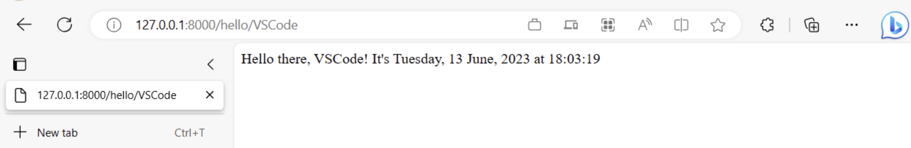

1. 코드에서 다른 날짜/시간 형식을 사용하도록 줄을 변경하고, 예를 들어 `now.strftime("%a, %d %b, %y at %X")`로 변경한 후 파일을 저장합니다. Django 서버는 자동으로 다시 로드되므로 디버거를 다시 시작할 필요 없이 변경 사항이 적용됩니다. 브라우저에서 페이지를 새로 고쳐 업데이트를 확인합니다.

1. 작업이 끝나면 브라우저를 닫고 디버거를 중지합니다. 디버거를 중지하려면 중지 도구 모음 버튼(빨간 사각형) 또는 **실행** > **디버깅 중지** 명령 (`kb(workbench.action.debug.stop)`)을 사용합니다.

> **팁**: `http://127.0.0.1:8000/hello/VSCode`와 같은 특정 URL로 반복적으로 이동하기 쉽게 하려면 `views.py`와 같은 파일의 어딘가에 `print` 문을 사용하여 해당 URL을 출력하십시오. URL은 VS Code 터미널에 나타나며, 여기서 `kbstyle(Ctrl+click)`를 사용하여 브라우저에서 열 수 있습니다.

## 정의로 이동 및 정의 미리 보기 명령 {#go-to-definition-and-peek-definition-commands}

Django 또는 다른 라이브러리 작업 중에 해당 라이브러리의 코드를 검사하고 싶을 수 있습니다. VS Code는 코드에서 클래스 및 기타 객체의 정의로 직접 이동하는 두 가지 편리한 명령을 제공합니다:

- **정의로 이동**는 코드에서 객체를 정의하는 코드로 점프합니다. 예를 들어, `views.py`에서 `home` 함수의 `HttpResponse`를 마우스 오른쪽 버튼으로 클릭하고 **정의로 이동**을 선택하면(또는 `kb(editor.action.revealDefinition)`를 사용하면) Django 라이브러리의 클래스 정의로 이동합니다.

- **정의 미리 보기** (`kb(editor.action.peekDefinition)`, 오른쪽 클릭 컨텍스트 메뉴에서도 사용 가능)는 유사하지만 클래스 정의를 편집기에서 직접 표시합니다(코드를 가리지 않도록 편집기 창에 공간을 만듭니다). `kbstyle(Escape)`를 눌러 미리 보기 창을 닫거나 오른쪽 상단의 **x**를 사용합니다.

  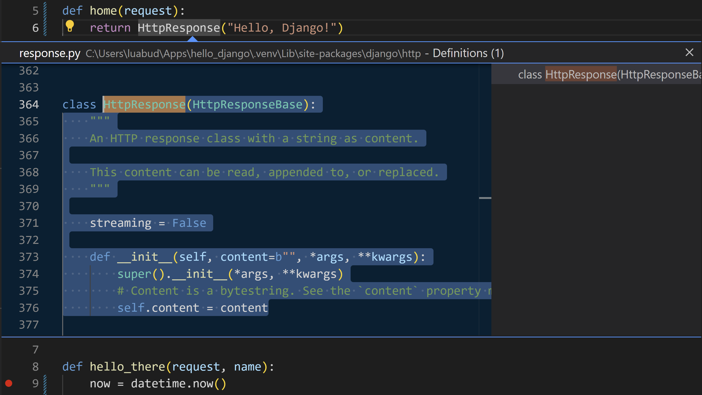

## 페이지 렌더링을 위한 템플릿 사용 {#use-a-template-to-render-a-page}

이 튜토리얼에서 지금까지 생성한 앱은 Python 코드에서 일반 텍스트 웹 페이지만 생성합니다. HTML을 코드에서 직접 생성하는 것이 가능하지만, 개발자는 이러한 관행을 피하는 것이 좋습니다. 이는 앱을 [교차 사이트 스크립팅(XSS) 공격](https://en.wikipedia.org/wiki/Cross-site_scripting)에 노출시키기 때문입니다. 예를 들어, 이 튜토리얼의 `hello_there` 함수에서 출력 형식을 `content = "<h1>안녕하세요, " + clean_name + "!</h1>"`와 같이 코드로 지정하고, 결과를 브라우저에 직접 제공하는 것을 생각할 수 있습니다. 이렇게 하면 공격자가 악성 HTML, JavaScript 코드를 URL에 삽입하여 `clean_name`에 도달하게 되고, 결국 브라우저에서 실행됩니다.

더 나은 방법은 **템플릿**을 사용하여 HTML을 코드에서 완전히 분리하는 것입니다. 이렇게 하면 코드가 렌더링이 아닌 데이터 값에만 관심을 가지게 됩니다.

Django에서 템플릿은 코드가 런타임에 제공하는 값에 대한 자리 표시자를 포함하는 HTML 파일입니다. 그런 다음 Django 템플릿 엔진은 페이지를 렌더링할 때 치환을 처리하고 XSS 공격을 방지하기 위해 자동으로 이스케이프를 제공합니다(즉, 데이터 값에 HTML을 사용하려고 하면 HTML이 일반 텍스트로만 렌더링됩니다). 따라서 코드는 데이터 값에만 관심을 가지며 템플릿은 마크업에만 관심을 가집니다. Django 템플릿은 템플릿 상속과 같은 유연한 옵션을 제공하여 공통 마크업이 있는 기본 페이지를 정의한 다음 해당 기본 페이지를 기반으로 페이지별 추가 사항을 구축할 수 있습니다.

이 섹션에서는 템플릿을 사용하여 단일 페이지를 만드는 것으로 시작합니다. 이후 섹션에서는 앱이 정적 파일을 제공하도록 구성한 다음 각 페이지에 기본 템플릿에서 내비게이션 바를 포함하는 여러 페이지를 생성합니다. Django 템플릿은 또한 제어 흐름 및 반복을 지원하며, 이는 후속 섹션에서 템플릿 디버깅의 맥락에서 확인할 수 있습니다.

1. `web_project/settings.py` 파일에서 `INSTALLED_APPS` 목록을 찾아 다음 항목을 추가하여 프로젝트가 템플릿 처리를 위해 앱을 인식하도록 합니다:

   ```python
   'hello',
   ```

1. `hello` 폴더 내에 `templates`라는 폴더를 만들고, 그 안에 앱 이름과 일치하는 `hello`라는 하위 폴더를 만듭니다(이 두 단계의 폴더 구조는 Django의 일반적인 관례입니다).

1. `templates/hello` 폴더에 아래 내용을 포함하는 `hello_there.html`이라는 파일을 생성합니다. 이 템플릿은 "name" 및 "date"라는 두 개의 데이터 값에 대한 자리 표시자를 포함하며, 이는 중괄호 쌍 `\{{` 및 `}}`로 구분됩니다. 모든 다른 불변 텍스트는 템플릿의 일부이며, 형식 마크업(예: `<strong>`)이 포함됩니다. 보시다시피, 템플릿 자리 표시자는 형식도 포함할 수 있으며, 파이프 `|` 기호 뒤의 표현식은 Django의 내장 [date 필터](https://docs.djangoproject.com/en/3.1/ref/templates/builtins/#date) 및 [time 필터](https://docs.djangoproject.com/en/3.1/ref/templates/builtins/#time)를 사용합니다. 따라서 코드는 사전 형식화된 문자열이 아닌 날짜/시간 _값_만 전달하면 됩니다:

   ```html
   <!DOCTYPE html>
   <html>
     <head>
       <meta charset="utf-8" />
       <title>안녕하세요, Django</title>
     </head>
     <body>
       <strong>안녕하세요, \{{ name }}!</strong> 현재 시간은 \{{ date | date:"l, d F, Y" }} at \{{ date | time:"H:i:s" }}입니다.
     </body>
   </html>
   ```

1. `views.py`의 맨 위에 다음 import 문을 추가합니다:

   ```python
   from django.shortcuts import render
   ```

1. `views.py`에서도 `hello_there` 함수를 수정하여 `django.shortcuts.render` 메서드를 사용하여 템플릿을 로드하고 _템플릿 컨텍스트_를 제공하도록 합니다. 컨텍스트는 템플릿 내에서 사용할 변수 집합입니다. `render` 함수는 요청 객체, 템플릿의 경로(템플릿 폴더에 상대적임), 그런 다음 컨텍스트 객체를 인수로 받습니다. (개발자는 일반적으로 템플릿 이름을 이를 사용하는 함수와 동일하게 지정하지만, 코드에서 정확한 파일 이름을 참조하므로 일치하는 이름은 필수는 아닙니다.)

   ```python
   def hello_there(request, name):
       print(request.build_absolute_uri()) #선택 사항
       return render(
           request,
           'hello/hello_there.html',
           {
               'name': name,
               'date': datetime.now()
           }
       )
   ```

   이제 코드는 훨씬 간단해졌으며, 마크업과 형식이 모두 템플릿에 포함되어 있으므로 데이터 값에만 관심을 가집니다.

1. 프로그램을 시작합니다(디버거 내에서 또는 외부에서 `kb(workbench.action.debug.run)` 사용). `/hello/name` URL로 이동하여 결과를 관찰합니다.

1. `<a%20value%20that%20could%20be%20HTML>`와 같은 이름을 사용하여 `/hello/name` URL로 이동하여 Django의 자동 이스케이프가 작동하는 것을 확인해 보십시오. "name" 값은 브라우저에 일반 텍스트로 표시되며 실제 요소로 렌더링되지 않습니다.

## 정적 파일 제공 {#serve-static-files}

정적 파일은 CSS 파일과 같은 특정 요청에 대해 웹 앱이 있는 그대로 반환하는 콘텐츠 조각입니다. 정적 파일을 제공하려면 `settings.py`의 `INSTALLED_APPS` 목록에 `django.contrib.staticfiles`가 포함되어 있어야 하며, 이는 기본적으로 포함되어 있습니다.

Django에서 정적 파일을 제공하는 것은 예술의 일종이며, 특히 프로덕션에 배포할 때 그렇습니다. 여기에서 보여주는 것은 Django 개발 서버와 Gunicorn과 같은 프로덕션 서버에서 작동하는 간단한 접근 방식입니다. 그러나 정적 파일에 대한 전체 처리는 이 튜토리얼의 범위를 넘어가므로 자세한 내용은 Django 문서의 [정적 파일 관리](https://docs.djangoproject.com/en/3.1/howto/static-files/)를 참조하십시오.

프로덕션으로 전환할 때는 `settings.py`로 이동하여 `DEBUG=False`로 설정하고 `ALLOWED_HOSTS = ['*']`를 변경하여 특정 호스트를 허용합니다. 이는 컨테이너를 사용할 때 추가 작업이 필요할 수 있습니다. 자세한 내용은 [문제 13](https://github.com/microsoft/python-sample-vscode-django-tutorial/issues/13)을 참조하십시오.

### 정적 파일을 위한 앱 준비 {#ready-the-app-for-static-files}

1. 프로젝트의 `web_project/urls.py`에서 다음 `import` 문을 추가합니다:

   ```python
   from django.contrib.staticfiles.urls import staticfiles_urlpatterns
   ```

1. 같은 파일의 끝에 다음 줄을 추가하여 프로젝트가 인식하는 목록에 표준 정적 파일 URL을 포함합니다:

   ```python
   urlpatterns += staticfiles_urlpatterns()
   ```

### 템플릿에서 정적 파일 참조 {#refer-to-static-files-in-a-template}

1. `hello` 폴더에 `static`이라는 폴더를 생성합니다.

1. `static` 폴더 내에 앱 이름과 일치하는 `hello`라는 하위 폴더를 생성합니다.

   이 추가 하위 폴더의 이유는 Django 프로젝트를 프로덕션 서버에 배포할 때 모든 정적 파일을 단일 폴더에 수집하여 전용 정적 파일 서버에서 제공하기 때문입니다. `static/hello` 하위 폴더는 앱의 정적 파일이 수집될 때 앱별 하위 폴더에 위치하여 동일한 프로젝트의 다른 앱의 파일과 충돌하지 않도록 보장합니다.

1. `static/hello` 폴더에 다음 내용을 포함하는 `site.css`라는 파일을 생성합니다. 이 코드를 입력한 후 CSS 파일에 대해 VS Code가 제공하는 구문 강조 및 색상 미리 보기를 관찰하십시오.

   ```css
   .message {
     font-weight: 600;
     color: blue;
   }
   ```

1. `templates/hello/hello_there.html`에서 `<title>` 요소 다음에 다음 줄을 추가합니다. `` 태그는 사용자 정의 Django 템플릿 태그 세트로, ``를 사용하여 스타일시트와 같은 파일을 참조할 수 있게 해줍니다.

   ```html
   
   <link
     rel="stylesheet"
     type="text/css"
     href=""
   />
   ```

1. 또한 `templates/hello/hello_there.html`에서 `<body>` 요소의 내용을 다음 마크업으로 교체하여 `<strong>` 태그 대신 `message` 스타일을 사용합니다:

   ```html
   <span class="message">안녕하세요, \{{ name }}!</span> 현재 시간은 \{{ date | date:'l, d F, Y' }} at \{{ date | time:'H:i:s' }}입니다.
   ```

1. 앱을 실행하고 `/hello/name` URL로 이동하여 메시지가 파란색으로 렌더링되는 것을 확인합니다. 작업이 끝나면 앱을 중지합니다.

### collectstatic 명령 사용 {#use-the-collectstatic-command}

프로덕션 배포의 경우 일반적으로 `python manage.py collectstatic` 명령을 사용하여 앱의 모든 정적 파일을 단일 폴더로 수집합니다. 그런 다음 전용 정적 파일 서버를 사용하여 이러한 파일을 제공하며, 이는 일반적으로 전반적인 성능을 향상시킵니다. 다음 단계에서는 이 수집이 어떻게 이루어지는지 보여주지만, Django 개발 서버로 실행할 때는 수집을 사용하지 않습니다.

1. `web_project/settings.py`에서 `collectstatic` 명령을 사용할 때 정적 파일이 수집되는 위치를 정의하는 다음 줄을 추가합니다:

   ```python
   STATIC_ROOT = BASE_DIR / 'static_collected'
   ```

1. 터미널에서 `python manage.py collectstatic` 명령을 실행하고 `hello/site.css`가 `manage.py`와 나란히 최상위 `static_collected` 폴더로 복사되는 것을 확인합니다.

1. 실제로는 정적 파일을 변경할 때마다 `collectstatic`을 실행하고 프로덕션으로 배포하기 전에 실행합니다.

## 기본 템플릿을 확장하는 여러 템플릿 만들기 {#create-multiple-templates-that-extend-a-base-template}

대부분의 웹 앱은 하나 이상의 페이지를 가지며, 이러한 페이지는 일반적으로 많은 공통 요소를 공유하므로 개발자는 이러한 공통 요소를 기본 페이지 템플릿으로 분리하여 다른 페이지 템플릿이 이를 확장하도록 합니다. (이것은 템플릿 상속이라고도 하며, 확장된 페이지가 기본 페이지의 요소를 상속받는 것을 의미합니다.)

### 지침:
- 모든 Markdown 형식을 유지합니다: 헤더(`#`), 목록(`-`, `*`), 코드 블록(```)을 변경하지 않고 그대로 유지합니다.
- 코드 블록을 제거하지 마십시오. 코드 블록은 그대로 유지합니다.
- 코드 내부의 주석은 번역하되, 코드 자체는 번역하지 않습니다.
  - 예:
    - 영어:
      ```js
      // This function returns a number
      function getNumber() { return 42; }
      ```
    - 한국어:
      ```js
      // 이 함수는 숫자를 반환합니다.
      function getNumber() { return 42; }
      ```
- 보이는 텍스트만 번역합니다. 링크, 파일 경로 또는 Markdown 구문을 수정하지 마십시오.
- 헤딩(`#`)의 경우, 원본에 ID가 존재하면 번역 후에도 그대로 유지합니다.
  - 예:  
    - 영어: `## Apple {#apple}`  
    - 한국어: `## 사과 {#apple}` (ID `{#apple}`는 변경되지 않음)
- 번역이 자연스럽게 흐르도록 합니다.  
  - 문장 구조가 자연스러운 한국어 작문에 맞도록 합니다.  
  - 필요에 따라 문장을 결합하거나 재구성하되 원래 의미는 유지합니다.  
  - 지나치게 직역하지 않도록 하며 적절한 한국어 표현을 사용합니다.  
  - 여러 포인트를 나열할 때는 더 읽기 쉬운 한국어 형식으로 재구성하는 것을 고려합니다.

---
또한, 동일한 템플릿을 확장하는 많은 페이지를 생성할 가능성이 높기 때문에, 새로운 페이지 템플릿을 빠르게 초기화할 수 있는 코드 스니펫을 VS Code에서 만드는 것이 유용합니다. 스니펫을 사용하면 지루하고 오류가 발생하기 쉬운 복사-붙여넣기 작업을 피할 수 있습니다.

다음 섹션에서는 이 프로세스의 다양한 부분을 설명합니다.

### 기본 페이지 템플릿 및 스타일 만들기 {#create-a-base-page-template-and-styles}

Django의 기본 페이지 템플릿은 CSS 파일, 스크립트 파일 등에 대한 참조를 포함하여 일련의 페이지의 모든 공유 부분을 포함합니다. 기본 템플릿은 또한 확장된 템플릿이 재정의할 것으로 예상되는 콘텐츠가 포함된 하나 이상의 **블록** 태그를 정의합니다. 블록 태그는 기본 템플릿과 확장된 템플릿 모두에서 `` 및 ``로 구분됩니다.

다음 단계에서는 기본 템플릿을 만드는 방법을 보여줍니다.

1. `templates/hello` 폴더에 `layout.html`이라는 이름의 파일을 만들고 아래 내용을 추가합니다. 이 파일에는 "title" 및 "content"라는 블록이 포함되어 있습니다. 보시다시피, 마크업은 나중에 생성할 홈, 소개 및 연락처 페이지에 대한 링크가 포함된 간단한 내비게이션 바 구조를 정의합니다. Django의 `` 태그를 사용하여 상대 경로가 아닌 해당 URL 패턴의 이름을 통해 다른 페이지를 참조하는 것을 주목하십시오.

   ```html
   <!DOCTYPE html>
   <html>
     <head>
       <meta charset="utf-8" />
       <title></title>
       
       <link
         rel="stylesheet"
         type="text/css"
         href=""
       />
     </head>

     <body>
       <div class="navbar">
         <a href="" class="navbar-brand">홈</a>
         <a href="" class="navbar-item">소개</a>
         <a href="" class="navbar-item">연락처</a>
       </div>

       <div class="body-content">
          
         <hr />
         <footer>
           <p>&copy; 2018</p>
         </footer>
       </div>
     </body>
   </html>
   ```

2. 기존 "message" 스타일 아래에 `static/hello/site.css` 파일에 다음 스타일을 추가하고 파일을 저장합니다. (이 설명서는 반응형 디자인을 보여주지 않으며, 이 스타일은 단순히 적절히 흥미로운 결과를 생성합니다.)

   ```css
   .navbar {
     background-color: lightslategray;
     font-size: 1em;
     font-family: "Trebuchet MS", "Lucida Sans Unicode", "Lucida Grande",
       "Lucida Sans", Arial, sans-serif;
     color: white;
     padding: 8px 5px 8px 5px;
   }

   .navbar a {
     text-decoration: none;
     color: inherit;
   }

   .navbar-brand {
     font-size: 1.2em;
     font-weight: 600;
   }

   .navbar-item {
     font-variant: small-caps;
     margin-left: 30px;
   }

   .body-content {
     padding: 5px;
     font-family: "Segoe UI", Tahoma, Geneva, Verdana, sans-serif;
   }
   ```

이 시점에서 앱을 실행할 수 있지만, 기본 템플릿을 어디에서도 사용하지 않았고 코드 파일을 변경하지 않았기 때문에 결과는 이전 단계와 동일합니다. 나머지 섹션을 완료하여 최종 효과를 확인하십시오.

### 코드 스니펫 만들기 {#create-a-code-snippet}

다음 섹션에서 생성하는 세 페이지는 `layout.html`을 확장하므로, 기본 템플릿에 대한 적절한 참조로 새 템플릿 파일을 초기화하는 **코드 스니펫**을 만드는 것이 시간을 절약합니다. 코드 스니펫은 단일 소스에서 일관된 코드 조각을 제공하여 기존 코드에서 복사-붙여넣기를 사용할 때 발생할 수 있는 오류를 피합니다.

1. VS Code에서 **파일**(Windows/Linux) 또는 **코드**(macOS) 메뉴를 선택한 후 **환경 설정** > **사용자 스니펫**을 선택합니다.

2. 나타나는 목록에서 **html**을 선택합니다. (이전 스니펫을 생성한 경우 목록의 **기존 스니펫** 섹션에 "html.json"으로 표시될 수 있습니다.)

3. VS Code가 `html.json`을 열면 기존 중괄호 내에 아래 코드를 추가합니다. (여기에는 `$0` 줄이 스니펫 삽입 후 커서를 어디에 놓을지를 나타내는 방법과 같은 세부 사항을 설명하는 주석이 포함되어 있습니다):

   ```json
   "Django Tutorial: template extending layout.html": {
       "prefix": "djextlayout",
       "body": [
           "",
           "",
           "$0",
           "",
           "",
           ""
       ],

       "description": "layout.html을 확장하는 보일러플레이트 템플릿"
   },
   ```

4. `html.json` 파일을 저장합니다 (`kb(workbench.action.files.save)`).

5. 이제 스니펫의 접두사인 `djext`를 입력하면 VS Code가 스니펫을 자동 완성 옵션으로 제공합니다. 또한 **스니펫 삽입** 명령을 사용하여 메뉴에서 스니펫을 선택할 수 있습니다.

코드 스니펫에 대한 일반적인 정보는 [스니펫 만들기](/docs/editor/userdefinedsnippets.md)를 참조하십시오.

### 코드 스니펫을 사용하여 페이지 추가하기 {#use-the-code-snippet-to-add-pages}

코드 스니펫이 준비되었으므로 홈, 소개 및 연락처 페이지에 대한 템플릿을 신속하게 생성할 수 있습니다.

1. `templates/hello` 폴더에 `home.html`이라는 새 파일을 만들고, `djext`를 입력하여 스니펫이 자동 완성으로 나타나는 것을 확인합니다:

   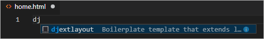

   자동 완성 항목을 선택하면 스니펫의 코드가 삽입 지점에 커서와 함께 나타납니다:

   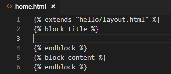

2. "title" 블록의 삽입 지점에 `홈`을 작성하고, "content" 블록에 `<p>Visual Studio Code Django 튜토리얼의 홈 페이지입니다.</p>`를 작성한 후 파일을 저장합니다. 이 줄들은 확장된 페이지 템플릿의 유일한 고유 부분입니다.

3. `templates/hello` 폴더에 `about.html`을 만들고, 스니펫을 사용하여 보일러플레이트 마크업을 삽입한 후, "title" 및 "content" 블록에 각각 `소개합니다` 및 `<p>Visual Studio Code Django 튜토리얼의 소개 페이지입니다.</p>`를 삽입한 후 파일을 저장합니다.

4. 이전 단계를 반복하여 `templates/hello/contact.html`을 만들고 `연락처` 및 `<p>Visual Studio Code Django 튜토리얼의 연락처 페이지입니다.</p>`를 사용합니다.

5. 앱의 `urls.py`에서 /about 및 /contact 페이지에 대한 경로를 추가합니다. `path` 함수의 `name` 인자는 템플릿의 `` 태그에서 페이지를 참조할 때 사용하는 이름을 정의합니다.

   ```python
   path("about/", views.about, name="about"),
   path("contact/", views.contact, name="contact"),
   ```

6. `views.py`에서 /about 및 /contact 경로에 대한 함수를 추가하여 해당 페이지 템플릿을 참조합니다. 또한 `home` 함수를 수정하여 `home.html` 템플릿을 사용하도록 합니다.

   ```python
   # 기존의 home 함수를 아래의 것으로 교체합니다.
   def home(request):
       return render(request, "hello/home.html")

   def about(request):
       return render(request, "hello/about.html")

   def contact(request):
       return render(request, "hello/contact.html")
   ```

### 앱 실행하기 {#run-the-app}

모든 페이지 템플릿이 준비되었으므로 `views.py`를 저장하고 앱을 실행한 후 브라우저에서 홈 페이지를 열어 결과를 확인합니다. 페이지 간에 탐색하여 페이지 템플릿이 기본 템플릿을 제대로 확장하고 있는지 확인합니다.

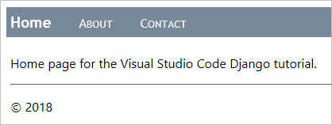

## 데이터, 데이터 모델 및 마이그레이션 작업하기 {#work-with-data-data-models-and-migrations}

많은 웹 앱은 데이터베이스에 저장된 정보를 사용하며, Django는 이러한 데이터베이스의 객체를 _모델_을 사용하여 쉽게 표현할 수 있도록 합니다. Django에서 모델은 특정 데이터베이스 객체를 나타내는 `django.db.models.Model`에서 파생된 Python 클래스입니다. 이러한 클래스는 앱의 `models.py` 파일에 배치합니다.

Django를 사용하면 코드에서 정의한 모델을 통해 거의 독점적으로 데이터베이스와 작업합니다. Django의 "마이그레이션"은 시간이 지남에 따라 모델을 발전시킬 때 기본 데이터베이스의 모든 세부 사항을 자동으로 처리합니다. 일반적인 워크플로우우는 다음과 같습니다:

1. `models.py` 파일에서 모델을 변경합니다.
2. `python manage.py makemigrations`를 실행하여 현재 상태에서 새로운 상태로 데이터베이스를 마이그레이션하는 스크립트를 `migrations` 폴더에 생성합니다.
3. `python manage.py migrate`를 실행하여 실제 데이터베이스에 스크립트를 적용합니다.

마이그레이션 스크립트는 시간이 지남에 따라 데이터 모델에 대해 수행한 모든 점진적인 변경 사항을 기록합니다. 마이그레이션을 적용하면 Django는 모델에 맞게 데이터베이스를 업데이트합니다. 각 점진적 변경 사항에는 고유한 스크립트가 있으므로 Django는 데이터베이스의 _모든_ 이전 버전을 현재 버전으로 자동으로 마이그레이션할 수 있습니다. 따라서 `models.py`의 모델에만 신경 쓰면 되며, 기본 데이터베이스 스키마나 마이그레이션 스크립트에 대해서는 걱정할 필요가 없습니다. 이 부분은 Django에 맡기면 됩니다!

코드에서도 데이터를 저장하고 검색하기 위해 모델 클래스와만 작업하며, Django가 기본 세부 사항을 처리합니다. 유일한 예외는 Django 관리 유틸리티인 [loaddata 명령](https://docs.djangoproject.com/en/3.1/ref/django-admin/#loaddata)을 사용하여 데이터베이스에 데이터를 작성할 수 있다는 것입니다. 이 유틸리티는 `migrate` 명령이 스키마를 초기화한 후 데이터 세트를 초기화하는 데 자주 사용됩니다.

`db.sqlite3` 파일을 사용할 때는 [SQLite 브라우저](https://sqlitebrowser.org/)와 같은 도구를 사용하여 데이터베이스와 직접 작업할 수도 있습니다. 이러한 도구를 사용하여 테이블의 레코드를 추가하거나 삭제하는 것은 괜찮지만, 데이터베이스 스키마를 변경하는 것은 피해야 합니다. 그렇지 않으면 데이터베이스가 앱의 모델과 동기화되지 않게 됩니다. 대신 모델을 변경하고 `makemigrations`를 실행한 다음 `migrate`를 실행합니다.

### 데이터베이스 유형 {#types-of-databases}

기본적으로 Django는 개발 작업에 적합한 앱의 데이터베이스에 `db.sqlite3` 파일을 포함합니다. [SQLite 사용 시기](https://www.sqlite.org/whentouse.html) (sqlite.org)에서 설명한 바와 같이, SQLite는 하루에 100K 미만의 트래픽을 가진 저중간 트래픽 사이트에 적합하지만, 더 높은 볼륨에는 권장되지 않습니다. 또한 단일 컴퓨터에 제한되므로 로드 밸런싱 및 지리적 복제와 같은 다중 서버 시나리오에서는 사용할 수 없습니다.

이러한 이유로 [PostgreSQL](https://www.postgresql.org/), [MySQL](https://www.mysql.com/) 및 [SQL Server](https://www.microsoft.com/en-ca/sql-server/)와 같은 프로덕션 수준의 데이터 저장소를 사용하는 것을 고려하십시오. Django의 다른 데이터베이스 지원에 대한 정보는 [데이터베이스 설정](https://docs.djangoproject.com/en/3.1/intro/tutorial02/#database-setup)을 참조하십시오. 또한 [Azure SDK for Python](https://learn.microsoft.com/azure/developer/python/sdk/azure-sdk-overview)을 사용하여 테이블 및 Blob과 같은 Azure 저장 서비스와 작업할 수 있습니다.

### 모델 정의하기 {#define-models}

Django 모델은 다시 말해 `django.db.model.Models`에서 파생된 Python 클래스이며, 앱의 `models.py` 파일에 배치합니다. 데이터베이스에서 각 모델은 자동으로 `id`라는 고유한 ID 필드를 부여받습니다. 다른 모든 필드는 `CharField`(제한된 텍스트), `TextField`(무제한 텍스트), `EmailField`, `URLField`, `IntegerField`, `DecimalField`, `BooleanField`, `DateTimeField`, `ForeignKey`, `ManyToMany` 등과 같은 `django.db.models`의 유형을 사용하여 클래스의 속성으로 정의됩니다. (자세한 내용은 Django 문서의 [모델 필드 참조](https://docs.djangoproject.com/en/3.1/ref/models/fields/)를 참조하십시오.)

각 필드는 `max_length`와 같은 몇 가지 속성을 가집니다. `blank=True` 속성은 필드가 선택 사항임을 의미하며, `null=true`는 값이 선택 사항임을 의미합니다. 또한 값이 데이터 값/표시 값 튜플의 배열에 제한되는 `choices` 속성도 있습니다.

예를 들어, 다음 클래스를 `models.py`에 추가하여 간단한 메시지 로그에서 날짜가 있는 항목을 나타내는 데이터 모델을 정의합니다:

```python
from django.db import models
from django.utils import timezone

class LogMessage(models.Model):
    message = models.CharField(max_length=300)
    log_date = models.DateTimeField("로그된 날짜")

    def __str__(self):
        """메시지의 문자열 표현을 반환합니다."""
        date = timezone.localtime(self.log_date)
        return f"'{self.message}'가 {date.strftime('%A, %d %B, %Y at %X')}에 기록되었습니다."
```

모델 클래스는 다른 클래스 속성에서 계산된 값을 반환하는 메서드를 포함할 수 있습니다. 모델에는 일반적으로 인스턴스의 문자열 표현을 반환하는 `__str__` 메서드가 포함됩니다.

### 데이터베이스 마이그레이션 {#migrate-the-database}

`models.py`를 편집하여 데이터 모델을 변경했으므로 데이터베이스 자체를 업데이트해야 합니다. VS Code에서 가상 환경이 활성화된 상태에서 터미널을 열고 ( **터미널: 새 터미널 만들기** 명령 사용, `kb(workbench.action.terminal.new)`), 프로젝트 폴더로 이동한 후 다음 명령을 실행합니다:

```bash
python manage.py makemigrations
python manage.py migrate
```

`makemigrations`가 생성한 스크립트를 보려면 `migrations` 폴더를 확인하십시오. 데이터베이스 자체를 살펴보면 스키마가 업데이트된 것을 확인할 수 있습니다.

명령을 실행할 때 오류가 발생하면 이전 단계에서 남아 있는 디버깅 터미널을 사용하고 있지 않은지 확인하십시오. 이러한 터미널은 가상 환경이 활성화되지 않았을 수 있습니다.

### 모델을 통해 데이터베이스 사용하기 {#use-the-database-through-the-models}

모델이 준비되고 데이터베이스가 마이그레이션되었으므로 모델만 사용하여 데이터를 저장하고 검색할 수 있습니다. 이 섹션에서는 메시지를 기록할 수 있는 양식 페이지를 앱에 추가합니다. 그런 다음 홈 페이지를 수정하여 이러한 메시지를 표시합니다. 여기서는 많은 코드 파일을 수정하므로 세부 사항에 유의하십시오.

1. `hello` 폴더(여기서 `views.py`가 있음)에 `forms.py`라는 새 파일을 만들고 다음 코드를 추가합니다. 이 코드는 데이터 모델인 `LogMessage`에서 가져온 필드를 포함하는 Django 양식을 정의합니다:

   ```python
   from django import forms
   from hello.models import LogMessage

   class LogMessageForm(forms.ModelForm):
       class Meta:
           model = LogMessage
           fields = ("message",)   # 주의: 후행 쉼표가 필요합니다.
   ```

2. `templates/hello` 폴더에 `log_message.html`이라는 새 템플릿을 만들고 다음 내용을 추가합니다. 이 템플릿은 양식 본문을 정의하기 위해 `form`이라는 변수를 제공받는다고 가정합니다. 그런 다음 "로그"라는 레이블이 있는 제출 버튼을 추가합니다.

   ```html
     메시지 기록  
   <form method="POST" class="log-form">
      \{{ form.as_p }}
     <button type="submit" class="save btn btn-default">로그</button>
   </form>
   
   ```

   > **참고**: Django의 `` 태그는 교차 사이트 요청 위조로부터 보호합니다. 자세한 내용은 Django 문서의 [교차 사이트 요청 위조 방지](https://docs.djangoproject.com/en/3.1/ref/csrf/)를 참조하십시오.

3. 앱의 `static/hello/site.css` 파일에 입력 양식을 더 넓게 만들기 위한 규칙을 추가합니다:

   ```css
   input[name="message"] {
     width: 80%;
   }
   ```

4. 앱의 `urls.py` 파일에 새 페이지에 대한 경로를 추가합니다:

   ```python
   path("log/", views.log_message, name="log"),
   ```

5. `views.py`에서 URL 경로에 의해 참조되는 `log_message`라는 뷰를 정의합니다. 이 뷰는 HTTP GET 및 POST 케이스를 모두 처리합니다. GET 케이스(즉, `else:` 섹션)에서는 이전 단계에서 정의한 양식을 표시합니다. POST 케이스에서는 양식에서 데이터를 데이터 객체(`message`)로 가져오고, 타임스탬프를 설정한 다음 해당 객체를 저장하여 데이터베이스에 기록합니다:

   ```python
   # 파일 상단의 기존 가져오기 항목에 추가합니다:
   from django.shortcuts import redirect
   from hello.forms import LogMessageForm
   from hello.models import LogMessage

   # 파일의 다른 곳에 이 코드를 추가합니다:
   def log_message(request):
       form = LogMessageForm(request.POST or None)

       if request.method == "POST":
           if form.is_valid():
               message = form.save(commit=False)
               message.log_date = datetime.now()
               message.save()
               return redirect("home")
       else:
           return render(request, "hello/log_message.html", {"form": form})
   ```

6. 모든 것을 시도하기 전에 한 가지 더 단계가 필요합니다! `templates/hello/layout.html`에서 메시지 기록 페이지에 대한 링크를 "navbar" div에 추가합니다:

   ```html
   <!-- 홈 링크 아래에 삽입합니다 -->
   <a href="" class="navbar-item">메시지 기록</a>
   ```

7. 앱을 실행하고 브라우저에서 홈 페이지를 엽니다. 내비게이션 바에서 **메시지 기록** 링크를 선택하면 메시지 기록 페이지가 표시되어야 합니다:

   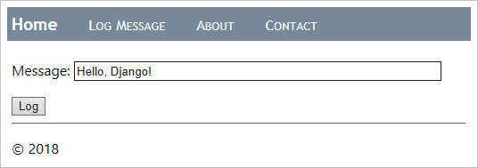

8. 메시지를 입력하고 **로그**를 선택하면 홈 페이지로 돌아가야 합니다. 홈 페이지는 아직 기록된 메시지를 표시하지 않지만(곧 수정할 것입니다), 몇 개의 메시지를 기록해 보십시오. 원하신다면 SQLite 브라우저와 같은 도구를 사용하여 레코드가 생성되었는지 확인할 수 있습니다. 데이터베이스를 읽기 전용으로 열거나, 앱을 사용하기 전에 데이터베이스를 닫는 것을 기억하십시오. 그렇지 않으면 데이터베이스가 잠겨서 앱이 실패합니다.

9. 작업이 끝나면 앱을 중지합니다.

10. 이제 홈 페이지를 수정하여 기록된 메시지를 표시합니다. 앱의 `templates/hello/home.html` 파일의 내용을 아래 마크업으로 교체합니다. 이 템플릿은 `message_list`라는 컨텍스트 변수를 기대합니다. 이를 수신하면 (`` 태그로 확인) 해당 목록을 반복하여 (`` 태그) 각 메시지에 대한 테이블 행을 생성합니다. 그렇지 않으면 페이지에 아직 기록된 메시지가 없음을 나타냅니다.

   ```html
     홈  
   <h2>기록된 메시지</h2>

   
   <table class="message_list">
     <thead>
       <tr>
         <th>날짜</th>
         <th>시간</th>
         <th>메시지</th>
       </tr>
     </thead>
     <tbody>
       
       <tr>
         <td>\{{ message.log_date | date:'d M Y' }}</td>
         <td>\{{ message.log_date | time:'H:i:s' }}</td>
         <td>\{{ message.message }}</td>
       </tr>
       
     </tbody>
   </table>
   
   <p>
     기록된 메시지가 없습니다. 
     <a href="">메시지 기록 양식</a>을 사용하십시오.
   </p>
    
   ```

11. `static/hello/site.css`에 테이블을 약간 형식화하는 규칙을 추가합니다:

   ```css
   .message_list th,
   td {
     text-align: left;
     padding-right: 15px;
   }
   ```

12. `views.py`에서 Django의 일반 `ListView` 클래스를 가져옵니다. 이 클래스를 사용하여 홈 페이지를 구현할 것입니다:

   ```python
   from django.views.generic import ListView
   ```

13. `views.py`에서 `home` 함수를 `ListView`에서 파생된 _클래스_인 `HomeListView`로 교체합니다. 이 클래스는 `LogMessage` 모델에 연결되며, 템플릿에 대한 컨텍스트를 생성하기 위해 `get_context_data` 함수를 구현합니다.

   ```python
   # 더 이상 사용되지 않으므로 기존의 home 함수를 제거합니다.

   class HomeListView(ListView):
       """모든 메시지 목록과 함께 홈 페이지를 렌더링합니다."""
       model = LogMessage

       def get_context_data(self, **kwargs):
           context = super(HomeListView, self).get_context_data(**kwargs)
           return context
   ```

14. 앱의 `urls.py`에서 데이터 모델을 가져옵니다:

   ```python
   from hello.models import LogMessage
   ```

15. `urls.py`에서 새로운 뷰에 대한 변수를 만들고, 가장 최근의 `LogMessage` 객체 5개를 내림차순으로 검색한 다음, 템플릿 컨텍스트에서 데이터의 이름(`message_list`)을 제공하고 사용할 템플릿을 식별합니다:

   ```python
   home_list_view = views.HomeListView.as_view(
       queryset=LogMessage.objects.order_by("-log_date")[:5],  # :5는 결과를 가장 최근의 5개로 제한합니다.
       context_object_name="message_list",
       template_name="hello/home.html",
   )
   ```

16. `urls.py`에서 홈 페이지에 대한 경로를 `home_list_view` 변수를 사용하도록 수정합니다:

   ```python
       # ""에 대한 기존 경로를 교체합니다.
       path("", home_list_view, name="home"),
   ```

17. 앱을 시작하고 브라우저에서 홈 페이지를 열면 이제 메시지가 표시되어야 합니다:

   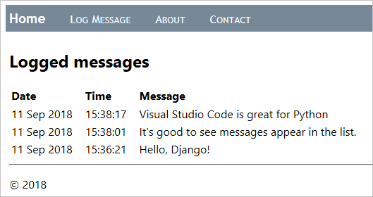

18. 작업이 끝나면 앱을 중지합니다.

## 페이지 템플릿과 함께 디버거 사용하기 {#use-the-debugger-with-page-templates}

이전 섹션에서 보여준 바와 같이, 페이지 템플릿은 `` 및 ``와 같은 절차적 지시문을 포함할 수 있으며, `` 및 ``와 같은 수동적 선언적 요소만 포함하지 않습니다. 따라서 템플릿 내에서 프로그래밍 오류가 발생할 수 있습니다.

다행히도, VS Code의 Python 확장은 디버깅 구성에 `"django": true`가 설정되어 있을 때 템플릿 디버깅을 제공합니다 (이미 설정되어 있습니다). 다음 단계에서는 이 기능을 보여줍니다:

1. `templates/hello/home.html`에서 `` 및 `` 줄에 중단점을 설정합니다. 아래 이미지에서 노란색 화살표로 표시된 부분입니다:

   

2. 디버거에서 앱을 실행하고 브라우저에서 홈 페이지를 엽니다. (중단점을 설정한 후 앱을 다시 시작할 필요는 없습니다. 페이지를 새로 고치기만 하면 됩니다.) VS Code가 템플릿의 `` 문에서 디버거를 중단하고 **변수** 창에 모든 컨텍스트 변수를 표시하는 것을 확인합니다:

   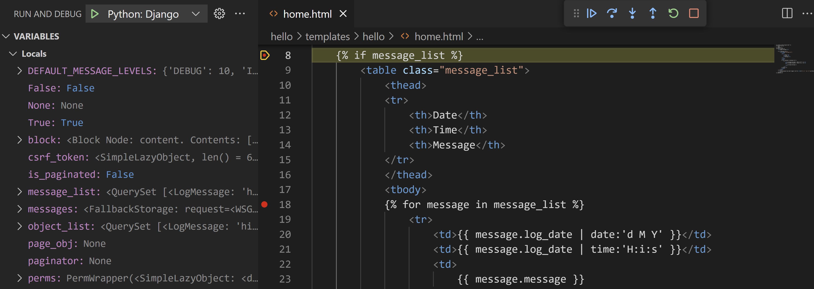

3. 스텝 오버(`kb(workbench.action.debug.stepOver)`) 명령을 사용하여 템플릿 코드를 단계별로 실행합니다. 디버거가 모든 선언적 문을 건너뛰고 절차적 코드에서 일시 중지하는 것을 관찰합니다. 예를 들어, `` 루프를 단계별로 실행하면 `message`의 각 값을 검사할 수 있으며 `<td>\{{ message.log_date | date:'d M Y' }}</td>`와 같은 줄로 이동할 수 있습니다.

4. **디버그 콘솔** 패널에서 변수와 함께 작업할 수도 있습니다. (그러나 Django 필터와 같은 `date`는 현재 콘솔에서 사용할 수 없습니다.)

5. 준비가 되면 계속하기(`kb(workbench.action.debug.continue)`)를 선택하여 앱 실행을 마치고 브라우저에서 렌더링된 페이지를 확인합니다. 작업이 끝나면 디버거를 중지합니다.

## 선택적 활동 {#optional-activities}

다음 섹션에서는 Python 및 Visual Studio Code 작업에 도움이 될 수 있는 추가 단계를 설명합니다.

### 환경을 위한 requirements.txt 파일 만들기 {#create-a-requirementstxt-file-for-the-environment}

앱 코드를 소스 제어 또는 기타 수단을 통해 공유할 때, 수신자가 항상 해당 환경을 스스로 재생성할 수 있으므로 가상 환경의 모든 파일을 복사하는 것은 의미가 없습니다.

따라서 개발자는 일반적으로 가상 환경 폴더를 소스 제어에서 제외하고 대신 `requirements.txt` 파일을 사용하여 앱의 종속성을 설명합니다.

파일을 수동으로 생성할 수 있지만, `pip freeze` 명령을 사용하여 활성화된 환경에 설치된 정확한 라이브러리를 기반으로 파일을 생성할 수도 있습니다:

1. **Python: 인터프리터 선택** 명령을 사용하여 선택한 환경이 활성화된 상태에서 **터미널: 새 터미널 만들기** 명령(`kb(workbench.action.terminal.new)`)을 실행하여 해당 환경이 활성화된 터미널을 엽니다.

2. 터미널에서 `pip freeze > requirements.txt`를 실행하여 프로젝트 폴더에 `requirements.txt` 파일을 생성합니다.

프로젝트의 복사본을 받는 사람(또는 빌드 서버)은 `pip install -r requirements.txt` 명령을 실행하여 활성 환경 내에서 앱이 의존하는 패키지를 재설치하기만 하면 됩니다.

> **참고**: `pip freeze`는 현재 환경에 설치된 모든 Python 패키지를 나열하며, 현재 사용하지 않는 패키지도 포함됩니다. 이 명령은 또한 정확한 버전 번호가 있는 패키지를 나열하므로, 향후 더 유연성을 위해 범위로 변환할 수 있습니다. 자세한 내용은 pip 명령 문서의 [요구 사항 파일](https://pip.pypa.io/en/stable/user_guide/#requirements-files)을 참조하십시오.

### 슈퍼유저 생성 및 관리 인터페이스 활성화 {#create-a-superuser-and-enable-the-administrative-interface}

기본적으로 Django는 인증으로 보호된 웹 앱의 관리 인터페이스를 제공합니다. 이 인터페이스는 기본적으로 프로젝트의 `INSTALLED_APPS` 목록에 포함된 내장 `django.contrib.admin` 앱을 통해 구현되며, 인증은 기본적으로 `INSTALLED_APPS`에 포함된 내장 `django.contrib.auth` 앱으로 처리됩니다.

관리 인터페이스를 활성화하려면 다음 단계를 수행하십시오:

1. VS Code에서 가상 환경을 위한 터미널을 열고 `python manage.py createsuperuser --username=<username> --email=<email>` 명령을 실행하여 앱에 슈퍼유저 계정을 생성합니다. `<username>` 및 `<email>`은 물론 개인 정보를 입력합니다. 명령을 실행하면 Django가 비밀번호를 입력하고 확인하라고 요청합니다.

   사용자 이름과 비밀번호 조합을 기억해 두십시오. 이 자격 증명을 사용하여 앱에 인증합니다.

2. 프로젝트 수준의 `urls.py`(`web_project/urls.py`에서 이 튜토리얼)에서 내장 관리 인터페이스를 가리키는 다음 URL 경로를 추가합니다:

   ```python
   # 이 경로는 앱을 생성할 때 기본적으로 포함됩니다.
   path("admin/", admin.site.urls),
   ```

3. 서버를 실행한 후 브라우저에서 앱의 /admin 페이지(예: 개발 서버를 사용할 때 `http://127.0.0.1:8000/admin`)를 엽니다.

4. `django.contrib.auth` 덕분에 로그인 페이지가 나타납니다. 슈퍼유저 자격 증명을 입력합니다.

   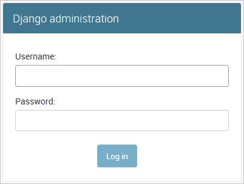

5. 인증이 완료되면 사용자 및 그룹을 관리할 수 있는 기본 관리 페이지가 표시됩니다:

   

관리 인터페이스는 원하는 만큼 사용자 정의할 수 있습니다. 예를 들어, 데이터베이스의 항목을 편집하고 제거하는 기능을 제공할 수 있습니다. 사용자 정의에 대한 자세한 내용은 [Django 관리 사이트 문서](https://docs.djangoproject.com/en/3.1/ref/contrib/admin/)를 참조하십시오.

### Docker 확장을 사용하여 Django 앱의 컨테이너 만들기 {#create-a-container-for-a-django-app-using-the-docker-extension}

[Docker 확장](https://marketplace.visualstudio.com/items?itemName=ms-azuretools.vscode-docker)은 Visual Studio Code에서 컨테이너화된 애플리케이션을 쉽게 빌드, 관리 및 배포할 수 있도록 합니다. 이 튜토리얼에서 개발한 Django 앱을 위한 Python 컨테이너를 만드는 방법을 배우고 싶다면, [컨테이너 내 Python](/docs/containers/quickstart-python.md) 튜토리얼을 확인하십시오. 이 튜토리얼은 다음을 안내합니다:

- 간단한 Python 컨테이너를 설명하는 `Dockerfile` 파일 만들기.
- [Django](https://www.djangoproject.com/) 앱의 기능을 빌드하고 실행하며 확인하기.
- 컨테이너에서 실행 중인 앱을 디버깅하기.

## 다음 단계 {#next-steps}

Visual Studio Code에서 Django 작업에 대한 이 설명서를 완료한 것을 축하합니다!

이 튜토리얼의 완료된 코드 프로젝트는 GitHub에서 찾을 수 있습니다: [python-sample-vscode-django-tutorial](https://github.com/microsoft/python-sample-vscode-django-tutorial).

이 튜토리얼에서는 Django가 할 수 있는 모든 것의 표면만 긁어보았습니다. [Django 문서](https://docs.djangoproject.com/en/3.1/) 및 [공식 Django 튜토리얼](https://docs.djangoproject.com/en/3.1/intro/tutorial01/)을 방문하여 뷰, 템플릿, 데이터 모델, URL 라우팅, 관리 인터페이스, 다른 종류의 데이터베이스 사용, 프로덕션 배포 등에 대한 더 많은 세부 정보를 확인하십시오.

프로덕션 웹사이트에서 앱을 사용해 보려면 [Docker 컨테이너를 사용하여 Azure App Service에 Python 앱 배포](https://learn.microsoft.com/azure/developer/python/tutorial-deploy-containers-01) 튜토리얼을 확인하십시오. Azure는 또한 [Linux에서의 앱 서비스](https://learn.microsoft.com/azure/developer/python/configure-python-web-app-local-environment)라는 표준 컨테이너를 제공하여 VS Code 내에서 웹 앱을 배포할 수 있습니다.

또한 Python과 관련된 VS Code 문서의 다음 기사를 검토할 수 있습니다:

- [Python 코드 편집하기](/docs/python/editing.md)
- [Linting](/docs/python/linting.md)
- [Python 환경 관리](/docs/python/environments.md)
- [Python 디버깅](/docs/python/debugging.md)
- [테스트](/docs/python/testing.md)