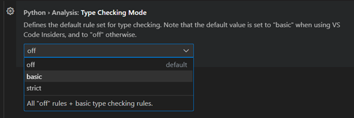
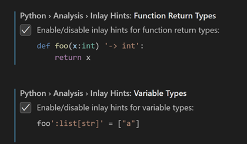
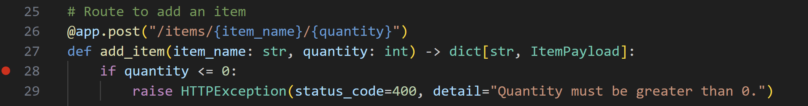
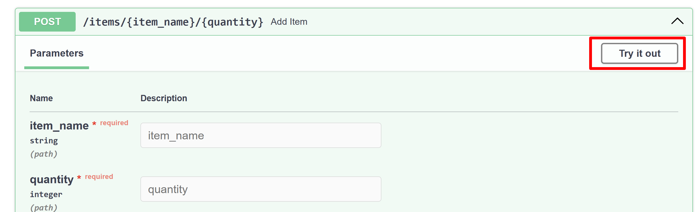
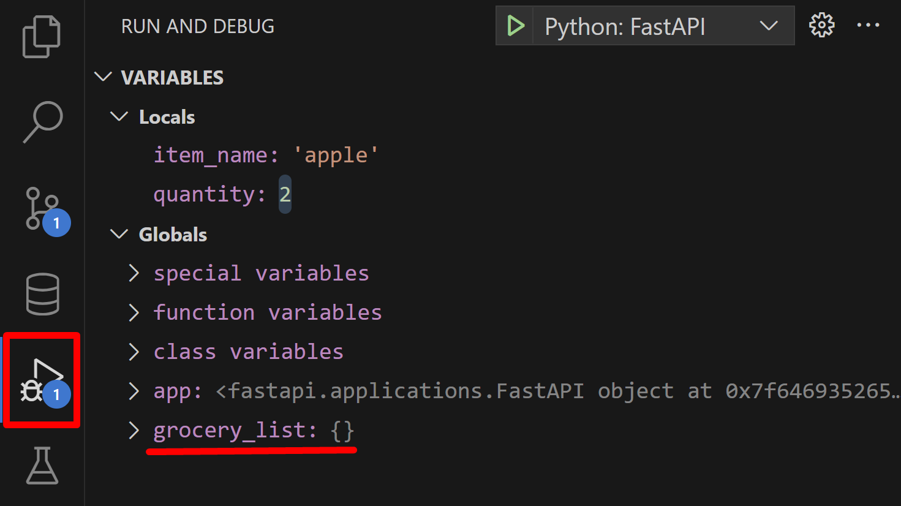
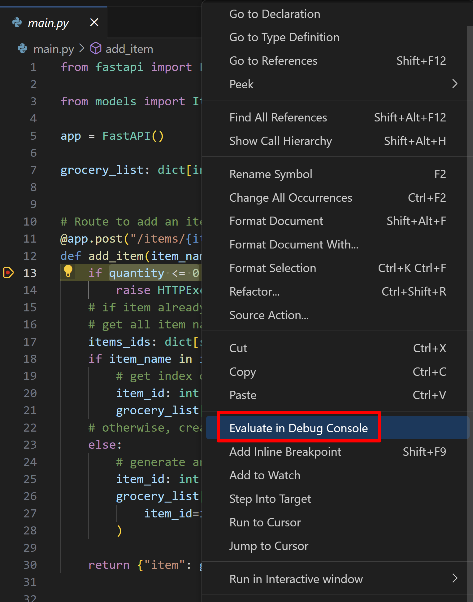
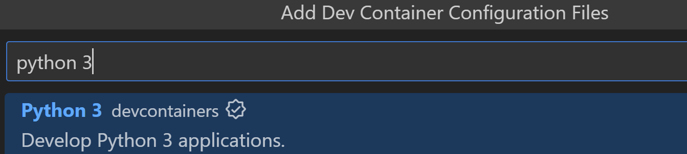
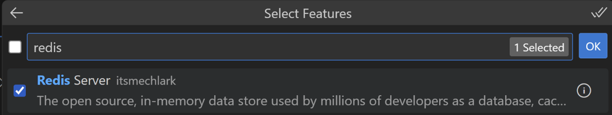
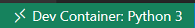
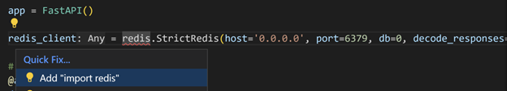

# FastAPI Tutorial in Visual Studio Code {#fastapi-tutorial-in-visual-studio-code}

[FastAPI](https://fastapi.tiangolo.com/)는 Python으로 API를 구축하기 위한 현대적이고 고성능의 웹 프레임워크입니다. 이 프레임워크는 API를 신속하고 효율적으로 구축할 수 있도록 설계되었으며, 자동 검증, 직렬화 및 API 문서화와 같은 기능을 제공하여 웹 서비스 및 마이크로서비스 구축에 인기 있는 선택입니다.

이 FastAPI 튜토리얼에서는 FastAPI를 사용하여 장바구니 목록 앱을 만들 것입니다. 튜토리얼이 끝날 때쯤이면 Visual Studio Code의 터미널, 편집기 및 디버거에서 FastAPI를 사용하는 방법을 이해하게 될 것입니다. 이 튜토리얼은 FastAPI에 대한 심층적인 내용이 아닙니다. 그런 내용을 원하신다면 [공식 FastAPI 문서](https://fastapi.tiangolo.com/)를 참조하시기 바랍니다.

Python을 처음 사용하신다면, 언어와 VS Code의 Python 지원에 익숙해지기 위해 [Python 튜토리얼](/docs/python/python-tutorial.md)부터 시작하는 것을 권장합니다. 이 튜토리얼은 이미 Python에 익숙한 분들이 VS Code에서 FastAPI를 사용하는 방법을 배우기에 더 적합합니다.

이 FastAPI 튜토리얼의 완성된 코드 프로젝트는 GitHub에서 찾을 수 있습니다: [python-sample-vscode-fastapi-tutorial](https://github.com/microsoft/python-sample-vscode-fastapi-tutorial).

문제가 발생하면 [Python 확장 Discussions Q&A](https://github.com/microsoft/vscode-python/discussions/categories/q-a)에서 답변을 검색하거나 질문할 수 있습니다.

## Set up the project {#set-up-the-project}

이 튜토리얼을 위한 프로젝트를 설정하는 방법에는 여러 가지가 있습니다. [GitHub Codespaces](#github-codespaces)와 [로컬 머신의 VS Code](#locally-in-vs-code)에서 설정하는 방법을 다룰 것입니다.

### GitHub Codespaces {#github-codespaces}

이 프로젝트를 [GitHub Codespaces](https://github.com/features/codespaces)에서 개발하도록 설정할 수 있습니다. 여기서 코드를 작성하고, 디버깅하며, 원격으로 앱을 실행할 수 있습니다. Codespace는 클라우드에서 호스팅되는 완전히 구성된 개발 환경을 제공하여 로컬 설정의 필요성을 없애줍니다. 이 환경에는 프로젝트의 종속성, 도구 및 확장이 포함되어 일관되고 재현 가능한 개발 경험을 보장합니다. 실시간 편집, 통합 버전 관리 및 디버깅 및 테스트 도구에 대한 손쉬운 접근을 제공하여 협업을 간소화하며, 프로젝트의 보안성과 신뢰성을 유지합니다.

>**참고**: 모든 GitHub.com 계정은 무료 또는 프로 요금제에 포함된 GitHub Codespaces의 월간 무료 사용 할당량이 있습니다. 자세한 내용은 [GitHub Codespaces 요금에 대한 설명](https://docs.github.com/billing/managing-billing-for-github-codespaces/about-billing-for-github-codespaces)을 참조하세요.

이 튜토리얼을 위한 codespace를 설정하려면 [이 프로젝트의 GitHub 리포지토리](https://github.com/microsoft/python-sample-vscode-fastapi-tutorial)로 이동합니다. 이 codespace에는 FastAPI 개발을 신속하게 시작하는 데 필요한 모든 구성 및 종속성이 포함되어 있습니다.

이 튜토리얼에서는 **dictionarybased** 브랜치를 선택하세요:


그런 다음 **Code** > **Codespaces** > **Create Codespace on \<dictionarybased\>** 브랜치를 선택하여 프로젝트를 위한 codespace를 생성하고 엽니다.

작업이 완료되면 아래의 [Replace the database](#replace-the-database) 섹션으로 계속 진행할 수 있습니다.

### Locally in VS Code {#locally-in-vs-code}

[VS Code](https://code.visualstudio.com/)에서 이 튜토리얼을 성공적으로 완료하려면 먼저 Python 개발 환경을 설정해야 합니다. 특히, 이 튜토리얼은 다음을 요구합니다:

* Python 3 (설치되어 있지 않다면 [설치 가이드](/docs/python/python-tutorial.md#install-a-python-interpreter)를 확인하세요)
* [VS Code용 Python 확장](https://marketplace.visualstudio.com/items?itemName=ms-python.python) (확장 설치에 대한 추가 세부정보는 [Extension Marketplace](/docs/editor/extension-marketplace.md)를 참조하세요).

이 섹션에서는 VS Code에서 작업 공간으로 열기 위해 폴더를 만들고, Python 가상 환경을 설정하고, 프로젝트의 종속성을 설치합니다.

1. 파일 시스템에서 이 튜토리얼을 위한 프로젝트 폴더를 생성합니다. 예를 들어 `groceries-plugin`이라는 이름으로 생성합니다.

2. 이 새 폴더를 VS Code에서 엽니다 (**File** > **Open Folder…**).

3. [Workspace Trust](/docs/editor/workspaces/workspace-trust.md) 프롬프트가 나타나면 **Yes, I trust the authors**를 선택하여 작업 공간이 필요한 리소스와 확장에 접근할 수 있도록 허용합니다. Workspace Trust에 대한 자세한 내용은 [문서](/docs/editor/workspaces/workspace-trust.md)를 참조하세요.

이제 애플리케이션에 설치할 종속성을 나열하는 `requirements.txt` 파일을 생성해 보겠습니다. `requirements.txt` 파일은 Python 개발에서 일반적인 관행으로, 프로젝트가 의존하는 라이브러리와 그 버전을 지정하는 데 사용됩니다. 이 파일은 프로젝트에서 작업하는 모든 사람이 유사한 개발 환경을 재현할 수 있도록 도와주어 일관성을 유지하는 데 편리한 구성 요소입니다.

우리는 앱을 만들기 위해 FastAPI를 설치하고, 서버 역할을 할 [uvicorn](https://www.uvicorn.org)과 데이터 저장 및 Redis 데이터베이스와의 상호작용을 위해 [Redis](https://redis.io) 및 `type-redis`를 설치할 것입니다.

4. VS Code에서 새 파일을 만듭니다 (**File** > **New Text File** 또는 `kb(workbench.action.files.newUntitledFile)`).

5. 다음 내용을 추가합니다:

    ```text
    fastapi
    redis
    types-redis
    uvicorn
    ```

6. 파일을 저장하고 (`kb(workbench.action.files.save)`) 이름을 `requirements.txt`로 지정합니다.

7. Command Palette를 열고 (`kb(workbench.action.showCommands)`) **Python: Create Environment** 명령을 실행하여 가상 환경을 생성합니다.

    >**참고**: 이 단계는 완료하는 데 몇 분 정도 걸릴 수 있습니다.

8. 환경 유형을 묻는 질문이 나오면 **Venv**를 선택합니다:

    

9. 그런 다음 머신에서 사용 가능한 최신 버전의 Python을 선택합니다:

    

10. 드롭다운 목록에서 `requirements.txt` 파일을 선택하여 종속성이 자동으로 설치되도록 하고, **OK**를 선택합니다:

    

가상 환경이 생성되고 종속성이 자동으로 설치되며 Python 확장에서 사용할 작업 공간에 대해 환경이 선택됩니다. VS Code의 오른쪽 하단 모서리에서 선택된 것을 확인할 수 있습니다:


>**참고**: 상태 표시줄에서 새로 생성된 환경 정보를 찾을 수 없는 경우 Python 인터프리터 표시기를 클릭하거나 Command Palette에서 **Python: Select Interpreter** 명령을 실행하여 가상 환경을 수동으로 선택할 수 있습니다.

## Start Coding {#start-coding}

이제 애플리케이션을 만들어 보겠습니다!

1. **File** > **New File…**를 사용하여 새 Python 파일을 만들고 **Python File**을 선택합니다.

2. `main.py`로 저장합니다 (`kb(workbench.action.files.saveAs)`) `groceries-plugin` 폴더에 저장합니다.

3. `main.py`에 다음 코드를 추가하고 파일을 저장합니다:

    ```python
    from fastapi import FastAPI

    app = FastAPI()

    @app.get("/")
    def root():
        return {"message": "Hello World"}
    ```

4. 디버거를 시작하여 코드를 실행합니다 (`kb(workbench.action.debug.start)`).

5. 드롭다운 메뉴에서 목록에서 **FastAPI** 구성 옵션을 선택합니다:

    

    이렇게 하면 uvicorn을 호출하여 디버거를 통해 애플리케이션 서버를 시작하는 디버그 구성이 자동으로 생성되며, 소스 코드를 단계별로 검사할 수 있습니다. 터미널에서 다음과 같은 메시지를 볼 수 있습니다:

    

   >**팁**: 기본 포트가 이미 사용 중인 경우 디버거를 중지하고 Command Palette를 열어 (`kb(workbench.action.showCommands)`), **Debug: Add Configuration**을 검색하여 Python Debugger를 선택한 다음 FastAPI를 선택합니다. 이렇게 하면 `.vscode/launch.json`에 사용자 정의 구성 파일이 생성되어 편집할 수 있습니다. `"args":[]`에 `"--port=5000"`을 추가하여 사용자 정의 포트를 설정합니다. 파일을 저장하고 디버거를 다시 시작합니다 (`kb(workbench.action.debug.start)`).

7. 터미널에서 `http://127.0.0.1:8000/` URL을 `kbstyle(Ctrl+Click)`하여 기본 브라우저에서 해당 주소를 엽니다:

    

    축하합니다! FastAPI 앱이 실행 중입니다!

8. 디버거를 중지하려면 디버그 도구 모음의 **Stop** 버튼을 사용하거나 `kb(workbench.action.debug.stop)`를 통해 중지합니다.

## Create a model for grocery list items {#create-a-model-for-grocery-list-items}

이제 FastAPI 앱이 작동하므로 [Pydantic](https://docs.pydantic.dev/latest/)을 사용하여 장바구니 목록 항목을 정의할 수 있습니다. Pydantic은 FastAPI와 원활하게 통합되는 데이터 검증 및 구문 분석 라이브러리입니다. Pydantic을 사용하면 Python 클래스를 사용하여 데이터 모델을 정의하고 API 요청에서 수신되는 데이터(일명 "페이로드")의 자동 검증 및 구문 분석을 위한 [타입 힌트](https://docs.python.org/3/library/typing.html)를 사용할 수 있습니다.

장바구니 목록 항목을 위한 모델을 만들어 보겠습니다. `ItemPayload` 모델을 사용하여 장바구니 목록에 추가할 항목의 데이터 구조를 정의합니다. 이 모델에는 `item_id`, `item_name` 및 `quantity`라는 세 개의 필드가 있습니다.

1. **File** > **New File…**를 사용하여 새 Python 파일을 만들고 **Python File**을 선택합니다.

2. 파일에 다음 줄을 추가한 후 `groceries-plugin` 폴더에 `models.py`라는 이름으로 저장합니다 (`kb(workbench.action.files.saveAs)`):

    ```python
    from typing import Optional
    from pydantic import BaseModel

    class ItemPayload(BaseModel):
        item_id: Optional[int]
        item_name: str
        quantity: int
    ```

[Pylance](https://marketplace.visualstudio.com/items?itemName=ms-python.vscode-pylance)는 VS Code에서 Python의 기본 언어 서버로, Pydantic 모델 및 FastAPI 작업에 유용한 타입 힌팅 기능을 지원합니다. Pylance는 [Pyright](https://github.com/microsoft/pyright) 위에 구축된 정적 타입 검사기로, 코드에서 타입 오류를 감지하여 버그를 방지하고 코드 품질을 향상시킬 수 있습니다.

아래의 세 단계는 선택 사항이지만, FastAPI가 코드 가독성과 검증을 개선하기 위해 타입 힌트를 광범위하게 사용하므로, Pylance의 타입 검사 기능을 활용하여 오류를 조기에 발견할 수 있습니다:

1. 설정 편집기를 엽니다 (`kb(workbench.action.openSettings)`).

2. "python type checking mode"를 검색하고 기본 타입 검사를 위해 `basic`으로 설정합니다. 이제 Pylance는 간단한 타입 관련 오류를 잡기 위해 진단 및 경고를 표시합니다. 또는 `strict`로 설정하여 더 고급 [타입 검사 규칙](https://microsoft.github.io/pyright/#/configuration?id=diagnostic-rule-defaults)을 적용할 수 있습니다.

    

3. 다음으로 "Python inlay type hints"를 검색하고 **변수 타입** 및 **함수 반환 타입**에 대한 인레이 힌트를 활성화합니다:

    

## Create routes {#create-routes}

이제 장바구니 목록 항목을 저장할 장소가 필요합니다. 간단하게 빈 딕셔너리로 시작해 보겠습니다.

1. 먼저 샘플에 필요한 모든 패키지를 가져옵니다. `main.py` 파일을 열고 첫 번째 import 줄을 다음으로 교체합니다:

    ```python
    from fastapi import FastAPI, HTTPException

    from models import ItemPayload
    ```

2. 이제 `app = FastAPI()` 바로 아래에 다음 줄을 추가합니다:

    ```python
    grocery_list: dict[int, ItemPayload] = {}
    ```

    이는 `int` 타입의 키(항목 ID)와 `ItemPayload` 타입의 값을 받는 새로운 빈 딕셔너리를 생성합니다.

    이제 FastAPI 애플리케이션에서 라우트를 정의하겠습니다. 웹 애플리케이션의 맥락에서 라우트는 특정 URL을 해당 URL을 처리하는 코드에 매핑하는 경로와 같습니다. 이러한 라우트는 애플리케이션 내의 다양한 기능에 대한 진입점 역할을 합니다. 클라이언트(예: 웹 브라우저 또는 다른 프로그램)가 특정 URL로 요청을 보내면 FastAPI는 URL에 따라 해당 요청을 적절한 함수(라우트 핸들러 또는 뷰 함수라고도 함)로 라우팅하고, 그 함수가 요청을 처리하고 응답을 생성합니다.

    이제 개별 항목을 추가하고 검색하며 장바구니 목록의 모든 항목을 반환하는 라우트를 정의해 보겠습니다.

3. `main.py` 파일의 끝에 다음 라우트를 추가합니다:

    ```python
    # Route to add a item
    @app.post("/items/{item_name}/{quantity}")
    def add_item(item_name: str, quantity: int):
        if quantity <= 0:
            raise HTTPException(status_code=400, detail="Quantity must be greater than 0.")
        # 항목이 이미 존재하면 수량만 추가합니다.
        # 모든 항목 이름 가져오기
        items_ids = {item.item_name: item.item_id if item.item_id is not None else 0 for item in grocery_list.values()}
        if item_name in items_ids.keys():
            # item_ids에서 item_name의 인덱스를 가져옵니다. 이는 item_id입니다.
            item_id = items_ids[item_name]
            grocery_list[item_id].quantity += quantity
        # 그렇지 않으면 새 항목을 생성합니다.
        else:
            # grocery_list에서 가장 높은 ID를 기반으로 항목 ID를 생성합니다.
            item_id = max(grocery_list.keys()) + 1 if grocery_list else 0
            grocery_list[item_id] = ItemPayload(
                item_id=item_id, item_name=item_name, quantity=quantity
            )

        return {"item": grocery_list[item_id]}
    ```

    타입 힌트를 활성화한 경우, Pylance는 함수 반환 타입과 `item_ids` 및 `item_id`의 타입에 대한 인레이 힌트를 추가합니다. 각 제안을 더블 클릭하여 코드에 삽입할 수 있습니다:

    

    이제 이 라우트가 예상대로 작동하는지 확인해 보겠습니다. 가장 빠른 방법은 VS Code의 디버거와 FastAPI의 `/docs` 엔드포인트를 사용하는 것입니다. 이 엔드포인트는 사용 가능한 모든 API 라우트에 대한 정보를 제공하고 API와 상호작용하여 매개변수 및 응답을 탐색할 수 있게 해줍니다. 이 문서는 FastAPI 애플리케이션에 정의된 메타데이터 및 타입 힌트를 기반으로 동적으로 생성됩니다.

4. `if quantity <= 0` 문 옆의 여백을 클릭하여 중단점을 추가합니다 (또는 `kb(editor.debug.action.toggleBreakpoint)`). 디버거는 해당 줄의 실행 전에 중지되므로 코드를 한 줄씩 검사할 수 있습니다.

    

5. 디버거를 시작합니다 (`kb(workbench.action.debug.start)`), 그런 다음 브라우저에서 `http://127.0.0.1:8000/docs`로 이동합니다.

    앱에서 사용할 수 있는 두 개의 엔드포인트인 `/items` 및 루트(`/`)가 있는 Swagger 인터페이스가 표시되어야 합니다.

    

6. `/items` 라우트 옆의 아래 화살표를 선택하여 확장한 다음, 오른쪽에 나타나는 **Try it out** 버튼을 클릭합니다.

    

7. `item_name` 필드에 문자열을, `quantity`에 숫자를 입력하여 장바구니 목록 항목을 추가합니다. 예를 들어, `item_name`에 apple을, `quantity`에 2를 제공할 수 있습니다.

8. **Execute**를 선택합니다.

    

9. VS Code로 돌아가면 디버거가 이전에 설정한 중단점에서 중지되었음을 알 수 있습니다.

    

    왼쪽에는 이 시점에서 정의된 모든 로컬 및 전역 변수가 **Run and Debug** 보기의 변수 창에 표시됩니다. 예를 들어, `item_name`은 'apple'로 설정되고, `quantity`는 2로 설정되며, 전역 변수 보기에는 빈 `grocery_list` 딕셔너리가 표시됩니다.

    

    이제 VS Code의 Debug Console을 사용하여 탐색해 보겠습니다.

10. `quantity <= 0` 문을 선택하고, 편집기에서 마우스 오른쪽 버튼을 클릭하여 **Evaluate in Debug Console**을 선택합니다:

    

    이렇게 하면 Debug Console이 열리고 선택한 표현식이 실행됩니다. 예제에서 예상대로 표현식은 `False`로 평가됩니다.

    Debug Console은 표현식을 빠르게 테스트하고 중단점에서 코드의 상태를 더 잘 이해하는 데 유용한 도구가 될 수 있습니다. 또한 함수를 호출하거나 변수를 출력하는 등 임의의 코드를 실행하는 데 사용할 수 있습니다. VS Code에서 Python 디버깅에 대한 자세한 내용은 [Python 튜토리얼](/docs/python/python-tutorial.md#configure-and-run-the-debugger)을 참조하세요.

    이제 **Continue**를 선택하여 코드 실행을 계속할 수 있습니다. 디버그 보기 도구 모음에서 또는 `kb(workbench.action.debug.continue)`를 눌러 계속할 수 있습니다.

    마지막으로, 장바구니 목록에서 모든 항목을 나열하거나 특정 항목을 나열하고 삭제할 수 있도록 애플리케이션에 나머지 라우트를 추가해 보겠습니다. 다음 단계에서 변경 사항을 저장하면 애플리케이션이 자동으로 다시 로드되므로 디버거를 실행한 채로 두어도 됩니다.

11. `main.py`의 내용을 아래 코드로 교체합니다:

    ```python
    from fastapi import FastAPI, HTTPException

    from models import ItemPayload

    app = FastAPI()

    grocery_list: dict[int, ItemPayload] = {}

    # Route to add an item
    @app.post("/items/{item_name}/{quantity}")
    def add_item(item_name: str, quantity: int) -> dict[str, ItemPayload]:
        if quantity <= 0:
            raise HTTPException(status_code=400, detail="Quantity must be greater than 0.")
        # 항목이 이미 존재하면 수량만 추가합니다.
        # 모든 항목 이름 가져오기
        items_ids: dict[str, int] = {
            item.item_name: item.item_id if item.item_id is not None else 0
            for item in grocery_list.values()
        }
        if item_name in items_ids.keys():
            # item_ids에서 item_name의 인덱스를 가져옵니다. 이는 item_id입니다.
            item_id: int = items_ids[item_name]
            grocery_list[item_id].quantity += quantity
        # 그렇지 않으면 새 항목을 생성합니다.
        else:
            # grocery_list에서 가장 높은 ID를 기반으로 항목 ID를 생성합니다.
            item_id: int = max(grocery_list.keys()) + 1 if grocery_list else 0
            grocery_list[item_id] = ItemPayload(
                item_id=item_id, item_name=item_name, quantity=quantity
            )

        return {"item": grocery_list[item_id]}


    # Route to list a specific item by ID
    @app.get("/items/{item_id}")
    def list_item(item_id: int) -> dict[str, ItemPayload]:
        if item_id not in grocery_list:
            raise HTTPException(status_code=404, detail="Item not found.")
        return {"item": grocery_list[item_id]}


    # Route to list all items
    @app.get("/items")
    def list_items() -> dict[str, dict[int, ItemPayload]]:
        return {"items": grocery_list}


    # Route to delete a specific item by ID
    @app.delete("/items/{item_id}")
    def delete_item(item_id: int) -> dict[str, str]:
        if item_id not in grocery_list:
            raise HTTPException(status_code=404, detail="Item not found.")
        del grocery_list[item_id]
        return {"result": "Item deleted."}


    # Route to remove some quantity of a specific item by ID
    @app.delete("/items/{item_id}/{quantity}")
    def remove_quantity(item_id: int, quantity: int) -> dict[str, str]:
        if item_id not in grocery_list:
            raise HTTPException(status_code=404, detail="Item not found.")
        # 제거할 수량이 항목의 수량보다 크거나 같으면 항목을 삭제합니다.
        if grocery_list[item_id].quantity <= quantity:
            del grocery_list[item_id]
            return {"result": "Item deleted."}
        else:
            grocery_list[item_id].quantity -= quantity
        return {"result": f"{quantity} items removed."}

    ```

12. 파일을 저장합니다 (`kb(workbench.action.files.save)`). 애플리케이션이 자동으로 다시 로드되어야 합니다.

이제 `/docs` 페이지를 다시 열고 새로운 라우트를 테스트할 수 있으며, 디버거와 Debug Console을 사용하여 코드 실행을 더 잘 이해할 수 있습니다. 작업이 완료되면 디버거를 중지합니다 (`kb(workbench.action.debug.stop)`). 또한 4단계에서 추가한 중단점을 클릭하여 제거할 수 있습니다.

축하합니다! 이제 장바구니 목록에서 항목을 추가, 나열 및 삭제할 수 있는 FastAPI 애플리케이션이 완성되었습니다.

## Set up the data storage {#set-up-the-data-storage}

이 시점에서 기본 기능이 있는 애플리케이션의 작동 버전이 있습니다. 이 섹션에서는 지속성을 위한 데이터 저장소 설정을 안내하지만, 이미 배운 내용에 만족한다면 이 단계를 건너뛸 수 있습니다.

지금까지 우리는 데이터를 딕셔너리에 저장하고 있습니다. 이는 애플리케이션이 재시작될 때 모든 데이터가 손실되기 때문에 이상적이지 않습니다.

데이터를 지속적으로 저장하기 위해 [Redis](https://redis.io)를 사용할 것입니다. Redis는 오픈 소스 인메모리 데이터 구조 저장소입니다. 속도와 다재다능성 덕분에 Redis는 웹 애플리케이션, 실시간 분석 시스템, 캐싱 레이어 등 다양한 애플리케이션에서 데이터 저장 시스템으로 일반적으로 사용됩니다.

기존 템플릿으로 **GitHub Codespaces**에서 작업 중이라면 [Replace the database](#replace-the-database) 섹션으로 바로 건너뛸 수 있습니다.

Windows에서 작업 중이라면 [Docker 컨테이너](https://www.docker.com/products/docker-desktop) 또는 [GitHub Codespace](https://github.com/features/codespaces)를 설정하여 Redis와 함께 작업할 수 있습니다. 이 튜토리얼에서는 Docker 컨테이너를 사용할 것이지만, GitHub Codespace 설정 방법은 [위 섹션](#github-codespaces)을 참조하세요.

그렇지 않으면 Linux 또는 macOS 머신에서 Redis를 설치하려면 [그들의 웹사이트의 지침](https://redis.io/docs/install)을 따르시고, 그런 다음 [Replace the database](#replace-the-database) 섹션으로 건너뛰세요.

### Setting up a Docker Container on Windows {#setting-up-a-docker-container-on-windows}

VS Code [Dev Containers](https://marketplace.visualstudio.com/items?itemName=ms-vscode-remote.remote-containers) 확장은 프로젝트, 종속성 및 필요한 모든 도구를 하나의 깔끔한 컨테이너로 통합하는 간소화된 접근 방식을 제공합니다. 이 확장을 사용하면 VS Code에서 컨테이너 내에서(또는 마운트된 상태로) 프로젝트를 열 수 있으며, 전체 기능 세트를 사용할 수 있습니다.

아래 단계에서는 머신에 다음 요구 사항이 설치되어 있는지 확인하세요:

#### Requirements {#requirements}

* [Docker for Windows](https://www.docker.com/)
* [Dev Containers](https://marketplace.visualstudio.com/items?itemName=ms-vscode-remote.remote-containers) 확장

#### Create the Dev container configuration {#create-the-dev-container-configuration}

1. Command Palette를 열고 **Dev Containers: Add Dev Container Configuration Files…**를 실행합니다.

2. **Python 3**를 선택합니다:

    

3. 기본 버전을 선택합니다.

4. 추가 기능으로 **Redis Server**를 선택하고 **OK**를 누른 후 **Keep Defaults**를 선택합니다.

    우리는 선택적으로 컨테이너에 포함할 [Features](https://github.com/devcontainers/features)를 설치할 수 있습니다. 이 튜토리얼에서는 Redis에 대한 적절한 개발 컨테이너 설정을 설치하고 추가하는 커뮤니티 기여 기능인 [Redis Server](https://github.com/itsmechlark/features/tree/main/src/redis-server)를 설치할 것입니다.

    

    이렇게 하면 작업 공간에 `.devcontainer` 폴더가 생성되고, `devcontainer.json` 파일이 생성됩니다. 이 파일을 수정하여 VS Code에서 필요한 확장 및 프로젝트 종속성을 설치하는 단계를 포함하도록 컨테이너 설정을 조정합니다.

5. `devcontainer.json` 파일을 엽니다.

6. `"features" : { ... }` 항목 뒤에 ","를 추가하여 파일에 더 많은 설정을 추가할 수 있도록 합니다.

    다음으로, 컨테이너가 생성될 때 애플리케이션이 실행 준비가 되도록 `devcontainer.json` 파일의 `postCreateCommand` 속성에 필요한 종속성 설치 명령을 추가합니다.

7. 아래 내용을 찾아 주석(`//`)을 제거하여 컨테이너가 생성될 때 종속성이 설치되도록 합니다:

    ```json
    "postCreateCommand": "pip3 install --user -r requirements.txt",
    ```

    `postCreateCommand` 및 기타 라이프사이클 스크립트에 대한 자세한 내용은 [Development Containers Specification](https://containers.dev/implementors/json_reference/#lifecycle-scripts)에서 확인할 수 있습니다.

    이제 `customizations` 속성을 사용하여 컨테이너에 설치할 VS Code 확장을 추가합니다.

8. `devcontainer.json`에 다음 설정을 추가합니다:

    ```jsonc
        // Use 'postCreateCommand' to run commands after the container is created.
        "postCreateCommand": "pip3 install --user -r requirements.txt",

        // Configure tool-specific properties.
        "customizations": {
            "vscode": {
                "extensions": [
                    "ms-python.python", //Python extension ID
                    "ms-python.vscode-pylance" //Pylance extension ID
                ]
            }
        }
    ```

9. 파일을 저장합니다.

10. 오른쪽 하단에 표시된 알림에서 **Reopen in Container**를 선택하거나 Command Palette에서 **Dev Containers: Reopen in Container** 명령을 실행합니다.

    >**참고**: 컨테이너를 빌드하는 데 몇 분 정도 걸릴 수 있으며, 이는 인터넷 속도와 머신 성능에 따라 다릅니다.

    Dev 컨테이너 구성에 대한 자세한 내용은 [Dev Containers 문서](/docs/devcontainers/containers.md#create-a-devcontainerjson-file)를 참조하세요.

빌드가 완료되면 Python 3 및 Redis Server가 설치된 완전히 구성된 Linux 기반 작업 공간이 생성됩니다.

컨테이너가 설정되면 VS Code의 왼쪽 하단 모서리에 표시기가 나타납니다:



>**참고**: 컨테이너에 Python 및 Pylance 확장이 성공적으로 설치되었는지 확인하려면 확장 보기(`kb(workbench.view.extensions)`)를 열고 검색해 보세요. 설치되지 않았다면 **Install in Dev Container**를 실행하여 설치할 수 있습니다.

선택된 Python 인터프리터 정보는 상태 표시줄의 오른쪽 하단 모서리에 표시되며, `devcontainer.json` 파일에 지정된 버전과 일치합니다:


>**참고**: 상태 표시줄에서 Python 인터프리터 정보를 찾을 수 없는 경우 Python 인터프리터 표시기를 클릭하거나 Command Palette에서 **Python: Select Interpreter** 명령을 실행하여 컨테이너의 Python 인터프리터를 수동으로 선택할 수 있습니다.

이제 데이터 저장소를 교체하는 다음 섹션으로 넘어갈 준비가 되었습니다.

## Replace the database {#replace-the-database}

장바구니 목록 항목을 저장하는 딕셔너리가 있지만, 이를 Redis 데이터베이스로 교체하고자 합니다. 이 튜토리얼에서는 Redis 해시를 사용하여 데이터를 저장할 것입니다. 해시는 여러 키-값 쌍을 저장할 수 있는 데이터 구조입니다.

전통적인 데이터베이스와 달리 ID를 모른 채 항목을 검색할 수 없으며, Redis 해시에서 값을 검색하려면 해시 키를 알아야 합니다. 이 튜토리얼에서는 `item_name_to_id`라는 해시를 생성하여 이름으로 항목을 검색하고 ID에 매핑할 것입니다. 또한 ID로 항목을 검색하기 위해 다른 해시를 생성하여 이름과 수량에 매핑할 것입니다. 각 항목 해시는 `item_id:{item_id}`라는 이름을 가지며 두 개의 필드(`item_name` 및 `quantity`)를 가집니다.

먼저 딕셔너리를 Redis 서버에 연결하는 Redis 클라이언트 객체로 교체해 보겠습니다.

1. `main.py` 파일에서 파일의 시작 부분에 있는 `grocery_list: dict[int, ItemPayload] = {}`를 아래 줄로 교체합니다:

    ```python
    redis_client = redis.StrictRedis(host='0.0.0.0', port=6379, db=0, decode_responses=True)
    ```

    Pylance는 Redis가 아직 가져오지 않았기 때문에 오류 메시지를 표시합니다.

2. 편집기에서 "redis" 위에 커서를 놓고 표시된 전구를 클릭합니다 (또는 `kb(editor.action.quickFix)`). 그런 다음 **Add 'import redis'**를 선택합니다.

    

    >**팁**: Pylance가 자동으로 가져오기를 추가하도록 설정하려면 설정 편집기(`kb(workbench.action.openSettings)`)에서 **Auto Import Completions** 설정을 찾아 활성화하세요.

    이제 로컬 호스트(`host="0.0.0.0"`)에서 실행 중인 Redis 서버에 연결하는 Redis 클라이언트 객체가 있습니다. 포트 6379(`port=6379`)에서 수신 대기합니다. `db` 매개변수는 사용할 Redis 데이터베이스를 지정합니다. Redis는 여러 데이터베이스를 지원하며, 이 코드에서는 기본 데이터베이스인 데이터베이스 0을 사용할 것입니다. 또한 응답이 문자열로 디코딩되도록 `decode_responses=True`를 전달합니다.

    이제 첫 번째 라우트인 `add_item`에서 몇 가지 교체를 진행하겠습니다. 제공된 항목 이름을 찾기 위해 딕셔너리의 모든 키를 살펴보는 대신, Redis 해시에서 직접 해당 정보를 가져올 수 있습니다.

    `item_name_to_id` 해시가 이미 존재하여 항목 이름을 ID에 매핑하고 있다고 가정하겠습니다(걱정하지 마세요, 곧 이 코드를 추가할 것입니다!). 요청에서 수신하는 항목 이름의 ID를 가져오기 위해 Redis의 `hget` 메서드를 호출하면, 요청된 이름이 해시에 이미 존재하면 항목 ID를 반환하고, 그렇지 않으면 `None`을 반환합니다.

3. 아래 내용을 포함하는 줄을 삭제합니다:

    ```python
    items_ids = {item.item_name: item.item_id if item.item_id is not None else 0 for item in grocery_list.values()}
    ```

    그리고 이를 다음으로 교체합니다:

    ```python
      item_id = redis_client.hget("item_name_to_id", item_name)
     ```

    Pylance는 이 변경 사항에 대해 문제를 제기합니다. 이는 `hget` 메서드가 `str` 또는 `None`(항목이 존재하지 않을 경우)을 반환하기 때문입니다. 그러나 아직 교체하지 않은 아래 코드 줄은 `item_id`가 `int` 타입일 것이라고 예상합니다. 이 경고를 해결하기 위해 `item_id` 기호의 이름을 바꿔보겠습니다.

4. `item_id`를 `item_id_str`로 이름을 변경합니다.

5. 타입 힌트를 활성화한 경우, Pylance는 `item_id_str` 옆에 변수 타입 힌트를 표시해야 합니다. 선택적으로 더블 클릭하여 수락할 수 있습니다:

    

6. 항목이 존재하지 않으면 `item_id_str`는 `None`입니다. 따라서 이제 아래 내용을 포함하는 줄을 삭제할 수 있습니다:

    ```python
    if item_name in items_ids.keys():
    ```

### 지침:
- 모든 Markdown 형식을 유지합니다: 헤더(`#`), 목록(`-`, `*`), 코드 블록(```)을 변경하지 않고 그대로 유지합니다.
- 코드 블록 내의 코드는 변경하지 않지만, 주석은 번역합니다.
  - 예시:
    - 영어:
      ```js
      // This function returns a number
      function getNumber() { return 42; }
      ```
    - 한국어:
      ```js
      // 이 함수는 숫자를 반환합니다.
      function getNumber() { return 42; }
      ```
- 보이는 텍스트만 번역합니다. 링크, 파일 경로, 또는 Markdown 구문은 수정하지 않습니다.
- 헤딩(`#`)의 경우, 원본에 ID가 존재하면 번역 후에도 그대로 유지합니다.
  - 예시:  
    - 영어: `## Apple {#apple}`  
    - 한국어: `## 사과 {#apple}` (ID `{#apple}`는 변경되지 않음)
- 번역이 자연스럽게 흐르도록 합니다.  
  - 문장 구조가 자연스러운 한국어 문체에 맞도록 합니다.  
  - 필요에 따라 문장을 결합하거나 재구성하되 원래 의미는 유지합니다.  
  - 지나치게 직역하지 않고 적절한 한국어 표현을 사용합니다.  
  - 여러 포인트를 나열할 때는 더 읽기 쉬운 한국어 형식으로 재구성하는 것을 고려합니다.

---

```
    And replace it with:

    ```python
    if item_id_str is not None:
    ```

    Now that we have the item ID as a string, we need to convert it to an `int` and update the quantity for the item. Currently, our Redis hash only maps item names to their IDs. To also map item IDs to their names and quantities, we will create a separate Redis hash for each item, using `"item_id:{item_id}"` as our hash name to make retrieval by ID easier. We'll also add  `item_name` and `quantity` fields for each of these hashes.

7. Delete the code within the `if` block:

    ```python
    item_id: int = items_ids[item_name]
    grocery_list[item_id].quantity += quantity
    ```

    And add the following, to convert the `item_id` to an `int`, and then to increment the quantity of the item by calling the `hincrby` method from Redis. This method increments the value of the `"quantity"` field by the given amount in the request (`quantity`):

    ```python
    item_id = int(item_id_str)
    redis_client.hincrby(f"item_id:{item_id}", "quantity", quantity)
    ```

    We now only need to replace the code for when the item does not exist, when `item_id_str` is `None`. In this case, we generate a new `item_id`, create a new Redis hash for the item, and then add the provided item name and quantity.

    To generate a new `item_id`, let's use the `incr` method from Redis, passing a new hash called `"item_ids"`. This hash is used to store the last generated ID, so we can increment it each time we create a new item, ensuring that they all have a unique ID.

8. Delete the line with the following content:

    ```python
    item_id: int = max(grocery_list.keys()) + 1 if grocery_list else 0
    ```

    And add the following:

    ```python
    item_id: int = redis_client.incr("item_ids")
    ```

    When this `incr` call is run for the first time with the `item_ids` key, Redis creates the key and maps it to the value `1`.  Then, each subsequent time it's run, it increments the stored value by 1.

    Now we will add the item to the Redis hash, using the `hset` method and by providing a mapping for the fields (`item_id`, `item_name`, and `quantity`), and the values (the item's newly created ID, and its provided name and quantity).

9. Delete the line with the following content:

    ```python
    grocery_list[item_id] = ItemPayload(
            item_id=item_id, item_name=item_name, quantity=quantity
        )
    ```

    And replace it with the following:

    ```python
    redis_client.hset(
                f"item_id:{item_id}",
                mapping={
                    "item_id": item_id,
                    "item_name": item_name,
                    "quantity": quantity,
                })
    ```

    Now we only need to map the newly created ID to the item name by setting the hash we referenced in the beginning, `item_name_to_id`.

10. Add this line to the end of the route, inside the `else` block:

    ```python
    redis_client.hset("item_name_to_id", item_name, item_id)
    ```

11. Delete the line with the following content:

    ```python
    return {"item": grocery_list[item_id]}
    ```

    And replace it with:

    ```python
    return {"item": ItemPayload(item_id=item_id, item_name=item_name, quantity=quantity)}
    ```

12. If you would like, you can try to do a similar replacement for the other routes. Otherwise, you can just replace the entire content of the file with the lines below:

    ```python
    import redis
    from fastapi import FastAPI, HTTPException

    from models import ItemPayload

    app = FastAPI()

    redis_client = redis.StrictRedis(host="0.0.0.0", port=6379, db=0, decode_responses=True)

    # Route to add an item
    @app.post("/items/{item_name}/{quantity}")
    def add_item(item_name: str, quantity: int) -> dict[str, ItemPayload]:
        if quantity <= 0:
            raise HTTPException(status_code=400, detail="Quantity must be greater than 0.")

        # Check if item already exists
        item_id_str: str | None = redis_client.hget("item_name_to_id", item_name)

        if item_id_str is not None:
            item_id = int(item_id_str)
            redis_client.hincrby(f"item_id:{item_id}", "quantity", quantity)
        else:
            # Generate an ID for the item
            item_id: int = redis_client.incr("item_ids")
            redis_client.hset(
                f"item_id:{item_id}",
                mapping={
                    "item_id": item_id,
                    "item_name": item_name,
                    "quantity": quantity,
                },
            )
            # Create a set so we can search by name too
            redis_client.hset("item_name_to_id", item_name, item_id)

        return {
            "item": ItemPayload(item_id=item_id, item_name=item_name, quantity=quantity)
        }


    # Route to list a specific item by ID but using Redis
    @app.get("/items/{item_id}")
    def list_item(item_id: int) -> dict[str, dict[str, str]]:
        if not redis_client.hexists(f"item_id:{item_id}", "item_id"):
            raise HTTPException(status_code=404, detail="Item not found.")
        else:
            return {"item": redis_client.hgetall(f"item_id:{item_id}")}


    @app.get("/items")
    def list_items() -> dict[str, list[ItemPayload]]:
        items: list[ItemPayload] = []
        stored_items: dict[str, str] = redis_client.hgetall("item_name_to_id")

        for name, id_str in stored_items.items():
            item_id: int = int(id_str)

            item_name_str: str | None = redis_client.hget(f"item_id:{item_id}", "item_name")
            if item_name_str is not None:
                item_name: str = item_name_str
            else:
                continue  # skip this item if it has no name

            item_quantity_str: str | None = redis_client.hget(
                f"item_id:{item_id}", "quantity"
            )
            if item_quantity_str is not None:
                item_quantity: int = int(item_quantity_str)
            else:
                item_quantity = 0

            items.append(
                ItemPayload(item_id=item_id, item_name=item_name, quantity=item_quantity)
            )

        return {"items": items}


    # Route to delete a specific item by ID but using Redis
    @app.delete("/items/{item_id}")
    def delete_item(item_id: int) -> dict[str, str]:
        if not redis_client.hexists(f"item_id:{item_id}", "item_id"):
            raise HTTPException(status_code=404, detail="Item not found.")
        else:
            item_name: str | None = redis_client.hget(f"item_id:{item_id}", "item_name")
            redis_client.hdel("item_name_to_id", f"{item_name}")
            redis_client.delete(f"item_id:{item_id}")
            return {"result": "Item deleted."}


    # Route to remove some quantity of a specific item by ID but using Redis
    @app.delete("/items/{item_id}/{quantity}")
    def remove_quantity(item_id: int, quantity: int) -> dict[str, str]:
        if not redis_client.hexists(f"item_id:{item_id}", "item_id"):
            raise HTTPException(status_code=404, detail="Item not found.")

        item_quantity: str | None = redis_client.hget(f"item_id:{item_id}", "quantity")

        # if quantity to be removed is higher or equal to item's quantity, delete the item
        if item_quantity is None:
            existing_quantity: int = 0
        else:
            existing_quantity: int = int(item_quantity)
        if existing_quantity <= quantity:
            item_name: str | None = redis_client.hget(f"item_id:{item_id}", "item_name")
            redis_client.hdel("item_name_to_id", f"{item_name}")
            redis_client.delete(f"item_id:{item_id}")
            return {"result": "Item deleted."}
        else:
            redis_client.hincrby(f"item_id:{item_id}", "quantity", -quantity)
            return {"result": f"{quantity} items removed."}

    ```

13. Re-run the debugger to test this application by interacting with the `/docs` route. You can stop the debugger once you're done.

Congrats! You now have a working FastAPI application with routes to add, list, and delete items from a grocery list, and the data is persisted in a Redis database.

## 선택 사항: 데이터베이스 삭제 설정 {#optional-set-up-database-deletion}

이제 Redis에 데이터가 지속되므로 모든 테스트 데이터를 지우는 스크립트를 만들고 싶을 수 있습니다. 그렇게 하려면 `flushdb.py`라는 새 파일을 만들고 다음 내용을 추가합니다:

```python
import redis

redis_client = redis.StrictRedis(host='0.0.0.0', port=6379, db=0, decode_responses=True)
redis_client.flushdb()

```

그런 다음 데이터베이스를 재설정하려면 VS Code에서 `flushdb.py` 파일을 열고 편집기 오른쪽 상단의 **실행** 버튼을 선택하거나 명령 팔레트에서 **Python: 터미널에서 Python 파일 실행** 명령을 실행할 수 있습니다.

이 작업은 현재 데이터베이스의 모든 키를 삭제하므로 주의해서 수행해야 하며, 프로덕션 환경에서 수행하면 데이터 손실이 발생할 수 있습니다.

## 선택 사항: ChatGPT 플러그인 만들기 {#optional-create-a-chatgpt-plugin}

GitHub Codespaces를 사용하면 [ChatGPT 플러그인](https://platform.openai.com/docs/plugins/introduction) 테스트 목적으로 애플리케이션을 호스팅할 수 있습니다. ChatGPT 플러그인은 [ChatGPT](https://chat.openai.com/)가 기존 API와 상호작용하여 ChatGPT의 기능을 향상시키고 다양한 작업을 수행할 수 있도록 하는 도구입니다. ChatGPT 플러그인은 현재 공개적으로 제공되지 않지만, 접근을 위해 [대기자 명단](https://openai.com/waitlist/plugins)에 가입할 수 있습니다. 가입 후 아래의 라이브 스트림 녹화에 따라 ChatGPT를 위한 나만의 장바구니 목록 플러그인을 만들 수 있습니다:

<iframe width="560" height="315" src="https://www.youtube-nocookie.com/embed/fPCjEbRpK1M" title="Build a ChatGPT plugin with VS Code and Codespaces" frameborder="0" allow="accelerometer; autoplay; clipboard-write; encrypted-media; gyroscope; picture-in-picture; web-share" allowfullscreen></iframe>

>**참고**: 모든 개인 GitHub.com 계정은 무료 또는 프로 요금제에 포함된 GitHub Codespaces의 월간 무료 사용 한도가 있습니다. 자세한 내용은 [GitHub Codespaces 요금에 대한 설명](https://docs.github.com/billing/managing-billing-for-github-codespaces/about-billing-for-github-codespaces)을 참조하세요.

## 다음 단계 {#next-steps}

이 튜토리얼을 따라 주셔서 감사합니다! FastAPI와 VS Code와 함께 사용하는 방법에 대해 새로운 것을 배웠기를 바랍니다.

이 튜토리얼의 완성된 코드 프로젝트는 GitHub에서 찾을 수 있습니다: [python-sample-vscode-fastapi-tutorial](https://github.com/microsoft/python-sample-vscode-fastapi-tutorial).

FastAPI에 대한 자세한 내용은 [공식 문서](https://fastapi.tiangolo.com/)를 참조하세요.

프로덕션 웹사이트에서 앱을 사용해 보려면 [Docker 컨테이너를 사용하여 Azure App Service에 Python 앱 배포하기](https://learn.microsoft.com/azure/developer/python/tutorial-deploy-containers-01) 튜토리얼을 확인하세요.

다음은 다른 VS Code Python 기사입니다:

* [Python 코드 편집하기](/docs/python/editing.md)
* [Python 환경 관리하기](/docs/python/environments.md)
* [Python 디버깅](/docs/python/debugging.md)
* [테스트](/docs/python/testing.md)