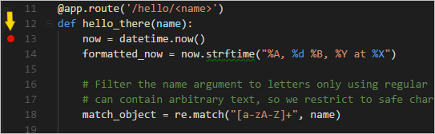
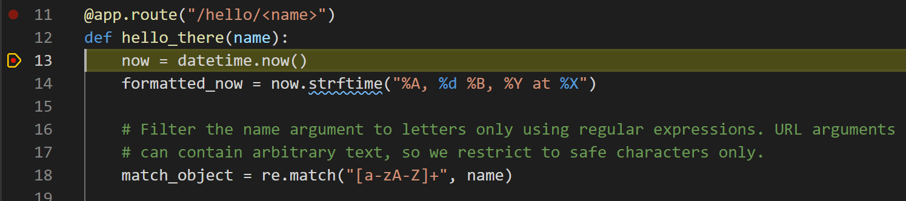
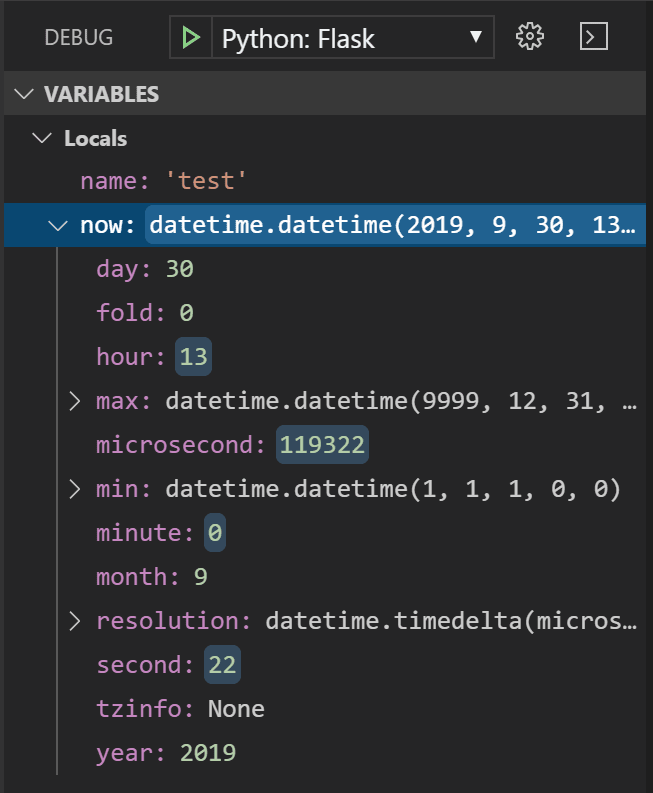
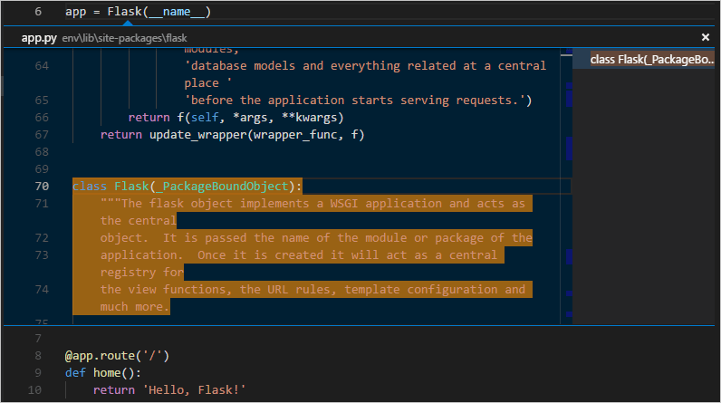
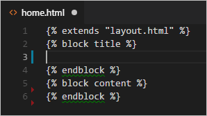
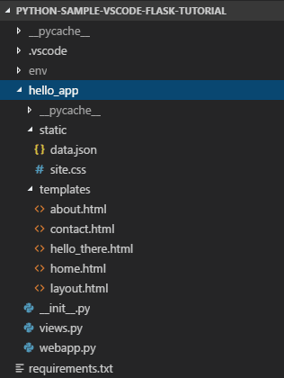

# Visual Studio Code에서의 Flask 튜토리얼 {#flask-tutorial-in-visual-studio-code}

Flask는 URL 라우팅 및 페이지 렌더링의 기본을 제공하는 경량 Python 웹 애플리케이션 프레임워크입니다.

Flask는 폼 검증, 데이터베이스 추상화, 인증 등과 같은 기능을 직접 제공하지 않기 때문에 "마이크로" 프레임워크라고 불립니다. 이러한 기능은 대신 Flask 확장이라고 하는 특별한 Python 패키지에 의해 제공됩니다. 확장은 Flask와 원활하게 통합되어 마치 Flask의 일부인 것처럼 보입니다. 예를 들어, Flask는 페이지 템플릿 엔진을 제공하지 않지만 Flask를 설치하면 기본적으로 Jinja 템플릿 엔진이 포함됩니다. 편의상, 우리는 일반적으로 이러한 기본값을 Flask의 일부로 이야기합니다.

이 Flask 튜토리얼에서는 공통 기본 템플릿을 사용하는 세 개의 페이지로 구성된 간단한 Flask 앱을 생성합니다. 그 과정에서 터미널, 편집기, 디버거, 코드 스니펫 등 Visual Studio Code의 여러 기능을 경험하게 됩니다.

이 Flask 튜토리얼의 완성된 코드 프로젝트는 GitHub에서 확인할 수 있습니다: [python-sample-vscode-flask-tutorial](https://github.com/microsoft/python-sample-vscode-flask-tutorial).

문제가 발생하면 [Python 확장 토론 Q&A](https://github.com/microsoft/vscode-python/discussions/categories/q-a)에서 답을 검색하거나 질문할 수 있습니다.

## 필수 조건 {#prerequisites}

이 Flask 튜토리얼을 성공적으로 완료하려면 다음을 수행해야 합니다(이는 [일반 Python 튜토리얼](/docs/python/python-tutorial.md)와 동일한 단계입니다):

1. [Python 확장](https://marketplace.visualstudio.com/items?itemName=ms-python.python)을 설치합니다.

1. 이 튜토리얼에 맞는 Python 3 버전을 설치합니다. 옵션은 다음과 같습니다:

   - (모든 운영 체제) [python.org](https://www.python.org/downloads/)에서 다운로드; 일반적으로 페이지에 처음 나타나는 **다운로드** 버튼을 사용합니다.
   - (리눅스) 내장된 Python 3 설치가 잘 작동하지만 다른 Python 패키지를 설치하려면 터미널에서 `sudo apt install python3-pip`를 실행해야 합니다.
   - (macOS) `brew install python3`를 사용하여 macOS에서 [Homebrew](https://brew.sh/)를 통해 설치합니다.
   - (모든 운영 체제) [Anaconda](https://www.anaconda.com/download/)에서 다운로드합니다(데이터 과학 용도).

1. Windows에서는 Python 인터프리터의 위치가 PATH 환경 변수에 포함되어 있는지 확인합니다. 명령 프롬프트에서 `path`를 실행하여 위치를 확인할 수 있습니다. Python 인터프리터의 폴더가 포함되어 있지 않다면 Windows 설정을 열고 "환경"을 검색한 후 **내 계정의 환경 변수 편집**을 선택하여 **Path** 변수를 편집하여 해당 폴더를 포함시킵니다.

## Flask 튜토리얼을 위한 프로젝트 환경 만들기 {#create-a-project-environment-for-the-flask-tutorial}

이 섹션에서는 Flask가 설치된 가상 환경을 생성합니다. 가상 환경을 사용하면 Flask를 전역 Python 환경에 설치하는 것을 피하고 애플리케이션에서 사용되는 라이브러리를 정확하게 제어할 수 있습니다.

1. 파일 시스템에서 이 튜토리얼을 위한 폴더를 생성합니다. 예를 들어 `hello_flask`라는 이름으로 생성합니다.

1. 터미널에서 해당 폴더로 이동한 후 `code .`를 실행하거나 VS Code를 실행하고 **파일** > **폴더 열기** 명령을 사용하여 이 폴더를 VS Code에서 엽니다.

1. VS Code에서 명령 팔레트를 열고(**보기** > **명령 팔레트** 또는 (`kb(workbench.action.showCommands)`)) **Python: 환경 만들기** 명령을 선택하여 작업 공간에 가상 환경을 생성합니다. `venv`를 선택한 후 사용할 Python 환경을 선택하여 생성합니다.

   > **참고**: 환경을 수동으로 만들고 싶거나 환경 생성 과정에서 오류가 발생하면 [환경](/docs/python/environments.md#create-a-virtual-environment-in-the-terminal) 페이지를 방문하세요.

   

1. 가상 환경 생성이 완료되면 명령 팔레트에서 [**터미널: 새 터미널 만들기**](/docs/terminal/basics.md) (`kb(workbench.action.terminal.new)`)를 실행하여 터미널을 생성하고 자동으로 가상 환경을 활성화합니다.

   > **참고**: Windows에서 기본 터미널 유형이 PowerShell인 경우, 스크립트 실행이 시스템에서 비활성화되어 `activate.ps1`을 실행할 수 없다는 오류가 발생할 수 있습니다. 오류 메시지에는 스크립트를 허용하는 방법에 대한 링크가 제공됩니다. 그렇지 않으면 **터미널: 기본 프로필 선택**을 사용하여 기본값을 "명령 프롬프트" 또는 "Git Bash"로 설정합니다.

1. VS Code 터미널에서 다음 명령을 실행하여 가상 환경에 Flask를 설치합니다:

   ```bash
   python -m pip install flask
   ```

이제 Flask 코드를 작성할 준비가 된 독립적인 환경이 마련되었습니다. **터미널: 새 터미널 만들기**를 사용할 때 VS Code가 자동으로 환경을 활성화합니다. 별도의 명령 프롬프트나 터미널을 열면 `source .venv/bin/activate` (리눅스/macOS) 또는 `.venv\Scripts\Activate.ps1` (Windows)를 실행하여 환경을 활성화합니다. 명령 프롬프트에 **(.venv)**가 표시되면 환경이 활성화된 것입니다.

## 최소한의 Flask 앱 만들고 실행하기 {#create-and-run-a-minimal-flask-app}

1. VS Code에서 프로젝트 폴더에 `app.py`라는 새 파일을 생성합니다. 메뉴에서 **파일** > **새로 만들기**를 선택하거나 `kbstyle(Ctrl+N)`을 누르거나 탐색기 보기에서 새 파일 아이콘을 사용합니다.

   

1. `app.py`에서 Flask를 가져오고 Flask 객체의 인스턴스를 생성하는 코드를 추가합니다. 아래 코드를 입력하면(복사-붙여넣기 대신) VS Code의 [IntelliSense 및 자동 완성](/docs/python/editing.md#autocomplete-and-intellisense)을 관찰할 수 있습니다:

   ```python
   from flask import Flask
   app = Flask(__name__)
   ```

1. `app.py`에서도 콘텐츠를 반환하는 함수를 추가합니다. 이 경우 간단한 문자열을 반환하고 Flask의 `app.route` 데코레이터를 사용하여 URL 경로 `/`를 해당 함수에 매핑합니다:

   ```python
   @app.route("/")
   def home():
       return "안녕하세요, Flask!"
   ```

   > **팁**: 동일한 함수에 여러 데코레이터를 사용할 수 있으며, 각 줄마다 하나씩 사용할 수 있습니다. 이는 동일한 함수에 매핑할 다양한 경로의 수에 따라 다릅니다.

1. `app.py` 파일을 저장합니다 (`kb(workbench.action.files.save)`).

1. 통합 터미널에서 `python -m flask run`을 입력하여 앱을 실행합니다. 이는 Flask 개발 서버를 실행합니다. 개발 서버는 기본적으로 `app.py`를 찾습니다. Flask를 실행하면 다음과 유사한 출력이 표시됩니다:

   ```bash
   (.venv) D:\py\\hello_flask>python -m flask run
    * 환경: production
      경고: 프로덕션 환경에서 개발 서버를 사용하지 마십시오.
      대신 프로덕션 WSGI 서버를 사용하십시오.
    * 디버그 모드: 꺼짐
    * http://127.0.0.1:5000/에서 실행 중 (CTRL+C를 눌러 종료)
   ```

   Flask 모듈을 찾을 수 없다는 오류가 발생하면 이전 섹션의 설명대로 가상 환경에서 `python -m pip install flask`를 실행했는지 확인하십시오.

   또한, 개발 서버를 다른 IP 주소나 포트에서 실행하려면 `--host=0.0.0.0 --port=80`과 같은 호스트 및 포트 명령줄 인수를 사용하십시오.

1. 기본 브라우저에서 렌더링된 페이지를 열려면 터미널에서 `http://127.0.0.1:5000/` URL을 `kbstyle(Ctrl+click)`합니다.

   

1. `/`와 같은 URL을 방문하면 HTTP 요청을 보여주는 메시지가 디버그 터미널에 나타나는 것을 관찰합니다:

   ```bash
   127.0.0.1 - - [11/Jul/2018 08:40:15] "GET / HTTP/1.1" 200 -
   ```

1. 터미널에서 `kbstyle(Ctrl+C)`를 사용하여 앱을 중지합니다.

> **팁**: `app.py`가 아닌 다른 파일 이름을 사용하는 경우, 예를 들어 `webapp.py`, FLASK_APP이라는 환경 변수를 정의하고 그 값을 선택한 파일로 설정해야 합니다. Flask의 개발 서버는 기본 파일 `app.py` 대신 FLASK_APP의 값을 사용합니다. 자세한 내용은 [Flask 명령줄 인터페이스](https://flask.palletsprojects.com/en/1.1.x/cli/)를 참조하십시오.

## 디버거에서 앱 실행하기 {#run-the-app-in-the-debugger}

디버깅은 특정 코드 줄에서 실행 중인 프로그램을 일시 중지할 수 있는 기회를 제공합니다. 프로그램이 일시 중지되면 변수를 검사하고 디버그 콘솔 패널에서 코드를 실행하며, [디버깅](/docs/python/debugging.md)에서 설명한 기능을 활용할 수 있습니다. 디버거를 실행하면 디버깅 세션이 시작되기 전에 수정된 파일이 자동으로 저장됩니다.

**시작하기 전에**: 마지막 섹션의 끝에서 터미널에서 `kbstyle(Ctrl+C)`를 사용하여 실행 중인 앱을 중지했는지 확인합니다. 한 터미널에서 앱을 실행한 상태로 두면 포트를 계속 소유하게 됩니다. 결과적으로 동일한 포트를 사용하여 디버거에서 앱을 실행하면 원래 실행 중인 앱이 모든 요청을 처리하게 되어 디버깅 중인 앱에서는 아무런 활동도 보이지 않으며 프로그램이 중단점에서 멈추지 않습니다. 즉, 디버거가 작동하지 않는 것처럼 보인다면 다른 인스턴스의 앱이 여전히 실행되고 있지 않은지 확인하십시오.

1. `app.py`의 내용을 다음 코드로 교체합니다. 이 코드는 디버거에서 단계별로 실행할 수 있는 두 번째 경로와 함수를 추가합니다:

    ```python
    import re
    from datetime import datetime

    from flask import Flask

    app = Flask(__name__)


    @app.route("/")
    def home():
        return "안녕하세요, Flask!"


    @app.route("/hello/<name>")
    def hello_there(name):
        now = datetime.now()
        formatted_now = now.strftime("%A, %d %B, %Y at %X")

        # 정규 표현식을 사용하여 이름 인수를 문자만 필터링합니다. URL 인수는
        # 임의의 텍스트를 포함할 수 있으므로 안전한 문자만 제한합니다.
        match_object = re.match("[a-zA-Z]+", name)

        if match_object:
            clean_name = match_object.group(0)
        else:
            clean_name = "친구"

        content = "안녕하세요, " + clean_name + "! 현재 시간은 " + formatted_now + "입니다."
        return content
    ```

    새로운 URL 경로 `/hello/<name>`에 사용된 데코레이터는 추가 값을 수용할 수 있는 엔드포인트 /hello/를 정의합니다. 경로의 `<` 및 `>` 안의 식별자는 함수에 전달되는 변수로, 코드에서 사용할 수 있습니다.

    URL 경로는 대소문자를 구분합니다. 예를 들어, 경로 `/hello/<name>`는 `/Hello/<name>`와 다릅니다. 동일한 함수가 두 경로를 처리하도록 하려면 각 변형에 대해 데코레이터를 사용하십시오.

    코드 주석에서 설명한 대로, 다양한 공격으로부터 앱을 보호하기 위해 항상 임의의 사용자 제공 정보를 필터링해야 합니다. 이 경우, 코드는 이름 인수를 문자만 포함하도록 필터링하여 제어 문자, HTML 등을 주입하는 것을 방지합니다. (다음 섹션에서 템플릿을 사용할 때 Flask는 자동으로 필터링을 수행하므로 이 코드는 필요하지 않습니다.)

1. `hello_there` 함수의 첫 번째 코드 줄(`now = datetime.now()`)에 중단점을 설정합니다. 다음 중 하나를 수행하여 설정할 수 있습니다:

    - 해당 줄에 커서를 두고 `kb(editor.debug.action.toggleBreakpoint)`를 누르거나,
    - 해당 줄에 커서를 두고 **실행** > **중단점 전환** 메뉴 명령을 선택하거나,
    - 줄 번호 왼쪽 여백을 클릭하여 중단점을 설정합니다(여기서 마우스를 올리면 흐릿한 빨간 점이 나타납니다).

    중단점은 왼쪽 여백에 빨간 점으로 나타납니다:

    

1. VS Code에서 **실행 및 디버그** 뷰로 전환합니다(왼쪽 사이드 활동 표시줄 또는 `kb(workbench.view.debug)` 사용). "실행 및 디버그를 사용자 정의하려면 launch.json 파일을 생성하세요"라는 메시지가 표시될 수 있습니다. 이는 아직 디버그 구성이 포함된 `launch.json` 파일이 없음을 의미합니다. **launch.json 파일 생성** 링크를 클릭하면 VS Code가 이를 생성할 수 있습니다:

    

1. 링크를 선택하면 VS Code가 디버그 구성을 요청합니다. 드롭다운에서 **Flask**를 선택하면 VS Code가 Flask 실행 구성이 포함된 새로운 `launch.json` 파일을 채웁니다. `launch.json` 파일에는 각각의 디버깅 구성이 `configuration` 배열 내의 별도의 JSON 객체로 포함되어 있습니다.

1. 아래로 스크롤하여 "Python: Flask"라는 이름의 구성을 확인합니다. 이 구성에는 `"module": "flask",`가 포함되어 있어 VS Code가 디버거를 시작할 때 `-m flask`로 Python을 실행하도록 지시합니다. 또한 `env` 속성에서 FLASK_APP 환경 변수를 정의하여 시작 파일을 식별합니다. 기본값은 `app.py`이지만 다른 파일을 쉽게 지정할 수 있습니다. 호스트 및/또는 포트를 변경하려면 `args` 배열을 사용할 수 있습니다.

        ```json
        {
            "name": "Python Debugger: Flask",
            "type": "debugpy",
            "request": "launch",
            "module": "flask",
            "env": {
                "FLASK_APP": "app.py",
                "FLASK_DEBUG": "1"
            },
            "args": [
                "run",
                "--no-debugger",
                "--no-reload"
            ],
            "jinja": true,
            "justMyCode": true
        },
        ```

        > **참고**: 구성의 `env` 항목에 `"FLASK_APP": "$\{workspaceFolder\}/app.py"`가 포함되어 있는 경우, 위와 같이 `"FLASK_APP": "app.py"`로 변경하십시오. 그렇지 않으면 "모듈 C를 가져올 수 없습니다"와 같은 오류 메시지가 표시될 수 있으며, 여기서 C는 프로젝트 폴더가 있는 드라이브 문자입니다.

        > **참고**: `launch.json`이 생성되면 편집기에서 **구성 추가** 버튼이 나타납니다. 이 버튼은 구성 목록의 시작 부분에 추가할 수 있는 추가 구성 목록을 표시합니다. (**실행** > **구성 추가** 메뉴 명령도 동일한 작업을 수행합니다.).

1. `launch.json`을 저장합니다 (`kb(workbench.action.files.save)`). 디버그 구성 드롭다운 목록에서 **Python: Flask** 구성을 선택합니다.

    

1. **실행** > **디버깅 시작** 메뉴 명령을 선택하거나 목록 옆의 녹색 **디버깅 시작** 화살표를 선택하여 디버거를 시작합니다 (`kb(workbench.action.debug.continue)`):

    

    디버깅 상태를 나타내기 위해 상태 표시줄의 색상이 변경되는 것을 관찰합니다:

    

    디버깅 도구 모음(아래 그림 참조)도 VS Code에 나타나며, 다음 순서로 명령이 포함되어 있습니다: 일시 중지(또는 계속, `kb(workbench.action.debug.continue)`), 한 단계 건너뛰기(`kb(workbench.action.debug.stepOver)`), 한 단계 들어가기(`kb(workbench.action.debug.stepInto)`), 한 단계 나가기(`kb(workbench.action.debug.stepOut)`), 재시작(`kb(workbench.action.debug.restart)`), 중지(`kb(workbench.action.debug.stop)`). 각 명령에 대한 설명은 [VS Code 디버깅](/docs/editor/debugging.md)을 참조하십시오.

    

1. "Python Debug Console" 터미널에 출력이 나타납니다. 해당 터미널에서 `http://127.0.0.1:5000/` 링크를 `kbstyle(Ctrl+click)`하여 브라우저에서 해당 URL을 엽니다. 브라우저의 주소 표시줄에서 `http://127.0.0.1:5000/hello/VSCode`로 이동합니다. 페이지가 렌더링되기 전에 VS Code는 설정한 중단점에서 프로그램을 일시 중지합니다. 중단점에 있는 작은 노란색 화살표는 다음에 실행될 코드 줄을 나타냅니다.

    

1. 한 단계 건너뛰기를 사용하여 `now = datetime.now()` 문을 실행합니다.

1. VS Code 창의 왼쪽에 **변수** 패널이 표시되어 `now`와 같은 지역 변수와 `name`과 같은 인수를 보여줍니다. 그 아래에는 **감시**, **호출 스택**, **중단점**을 위한 패널이 있습니다(자세한 내용은 [VS Code 디버깅](/docs/editor/debugging.md)을 참조하십시오). **로컬** 섹션에서 다양한 값을 확장해 보십시오. 값을 더블 클릭하거나(`kb(debug.setVariable)`)하여 수정할 수도 있습니다. 그러나 `now`와 같은 변수를 변경하면 프로그램이 중단될 수 있습니다. 개발자는 일반적으로 코드가 처음에 올바른 값을 생성하지 않았을 때만 값을 수정합니다.

    

1. 프로그램이 일시 중지되면 **디버그 콘솔** 패널(터미널 패널의 "Python Debug Console"과는 다름)을 사용하여 표현식을 실험하고 프로그램의 현재 상태를 사용하여 코드 조각을 시도할 수 있습니다. 예를 들어, `now = datetime.now()` 줄을 건너뛰면 다양한 날짜/시간 형식으로 실험할 수 있습니다. 편집기에서 `now.strftime("%A, %d %B, %Y at %X")`라는 코드를 선택한 후 마우스 오른쪽 버튼을 클릭하고 **디버그 콘솔에서 평가**를 선택하여 해당 코드를 디버그 콘솔로 전송하여 실행합니다:

    ```bash
    now.strftime("%A, %d %B, %Y at %X")
    '2018년 10월 31일 수요일 18:13:39'
    ```

    > **팁**: **디버그 콘솔**은 터미널에 나타나지 않을 수 있는 앱 내의 예외도 표시합니다. 예를 들어, **실행 및 디버그** 뷰의 **호출 스택** 영역에 "예외에서 일시 중지됨" 메시지가 표시되면 **디버그 콘솔**로 전환하여 예외 메시지를 확인하십시오.

1. 해당 줄을 디버그 콘솔 하단의 > 프롬프트에 복사하고 형식을 변경해 보십시오:

    ```bash
    now.strftime("%a, %d %B, %Y at %X")
    '2018년 10월 31일 수요일 18:13:39'
    now.strftime("%a, %d %b, %Y at %X")
    '2018년 10월 31일 수요일 18:13:39'
    now.strftime("%a, %d %b, %y at %X")
    '18년 10월 31일 수요일 18:13:39'
    ```

1. 원하시면 몇 줄 더 단계별로 실행한 후 계속(`kb(workbench.action.debug.continue)`)을 선택하여 프로그램을 실행합니다. 브라우저 창에 결과가 표시됩니다:

    

1. 코드의 줄을 변경하여 다른 날짜/시간 형식을 사용합니다. 예를 들어 `now.strftime("%a, %d %b, %y at %X")`로 변경한 후 파일을 저장합니다. Flask 서버는 자동으로 다시 로드되므로 변경 사항이 적용됩니다. 브라우저에서 페이지를 새로 고쳐 업데이트를 확인합니다.

1. 작업이 끝나면 브라우저를 닫고 디버거를 중지합니다. 디버거를 중지하려면 중지 도구 모음 버튼(빨간 사각형)이나 **실행** > **디버깅 중지** 명령(`kb(workbench.action.debug.stop)`)을 사용합니다.

> **팁**: `http://127.0.0.1:5000/hello/VSCode`와 같은 특정 URL로 반복적으로 탐색하기 쉽게 하려면 `print` 문을 사용하여 해당 URL을 출력합니다. URL은 터미널에 나타나며, 여기서 `kbstyle(Ctrl+click)`를 사용하여 브라우저에서 열 수 있습니다.

## 정의로 이동 및 정의 미리 보기 명령 {#go-to-definition-and-peek-definition-commands}

Flask 또는 다른 라이브러리 작업 중에 해당 라이브러리의 코드를 검사하고 싶을 수 있습니다. VS Code는 클래스 및 기타 객체의 정의로 직접 이동하는 두 가지 편리한 명령을 제공합니다:

- **정의로 이동**는 코드에서 객체를 정의하는 코드로 점프합니다. 예를 들어, `app.py`에서 `Flask` 클래스(줄 `app = Flask(__name__)`)를 마우스 오른쪽 버튼으로 클릭하고 **정의로 이동**을 선택하면(`kb(editor.action.revealDefinition)`) Flask 라이브러리의 클래스 정의로 이동합니다.

- **정의 미리 보기**(`kb(editor.action.peekDefinition)`, 오른쪽 클릭 컨텍스트 메뉴에서도 사용 가능)는 유사하지만 클래스 정의를 편집기에서 직접 표시합니다(코드를 가리지 않도록 편집기 창에 공간을 만듭니다). 미리 보기 창을 닫으려면 `kbstyle(Escape)`를 누르거나 오른쪽 상단의 **x**를 사용합니다.

  

## 템플릿을 사용하여 페이지 렌더링하기 {#use-a-template-to-render-a-page}

지금까지 이 튜토리얼에서 생성한 앱은 Python 코드에서 일반 텍스트 웹 페이지만 생성합니다. HTML을 코드에서 직접 생성하는 것이 가능하지만, 개발자는 이러한 관행을 피하는 것이 좋습니다. 이는 앱이 [교차 사이트 스크립팅(XSS) 공격](https://flask.palletsprojects.com/security/#cross-site-scripting-xss)에 노출될 수 있기 때문입니다. 예를 들어, 이 튜토리얼의 `hello_there` 함수에서 `content = "<h1>안녕하세요, " + clean_name + "!</h1>"`와 같이 코드를 사용하여 출력을 형식화하려고 할 수 있습니다. 여기서 `content`의 결과는 브라우저에 직접 제공됩니다. 이는 공격자가 URL에 악성 HTML, JavaScript 코드를 삽입할 수 있는 여지를 제공합니다. 이 경우 `clean_name`에 삽입된 악성 코드가 브라우저에서 실행됩니다.

더 나은 방법은 **템플릿**을 사용하여 HTML을 코드에서 완전히 분리하는 것입니다. 이렇게 하면 코드가 데이터 값에만 관심을 가지게 되고 렌더링에는 관여하지 않게 됩니다.

- 템플릿은 코드가 런타임에 제공하는 값의 자리 표시자를 포함하는 HTML 파일입니다. 템플릿 엔진은 페이지를 렌더링할 때 치환 작업을 처리합니다. 따라서 코드는 데이터 값에만 관심을 가지며 템플릿은 마크업에만 관심을 가집니다.
- Flask의 기본 템플릿 엔진은 [Jinja](https://jinja.palletsprojects.com)로, Flask를 설치할 때 자동으로 설치됩니다. 이 엔진은 XSS 공격을 방지하기 위한 자동 이스케이프 및 템플릿 상속과 같은 유연한 옵션을 제공합니다. 상속을 사용하면 공통 마크업이 있는 기본 페이지를 정의한 다음 해당 기본 페이지를 기반으로 페이지별 추가 사항을 구축할 수 있습니다.

이 섹션에서는 템플릿을 사용하여 단일 페이지를 생성합니다. 이후 섹션에서는 앱이 정적 파일을 제공하도록 구성하고, 각 페이지에 기본 템플릿에서 내비게이션 바가 포함된 여러 페이지를 생성합니다.

1. `hello_flask` 폴더 내에 Flask가 기본적으로 템플릿을 찾는 `templates`라는 폴더를 생성합니다.

1. `templates` 폴더 내에 `hello_there.html`이라는 파일을 생성하고 아래 내용을 추가합니다. 이 템플릿은 "name"과 "date"라는 두 개의 자리 표시자를 포함하고 있으며, 이는 쌍의 중괄호 `{{` 및 `}}`로 구분됩니다. 보시다시피, 템플릿 내에 직접 형식화 코드를 포함할 수도 있습니다:

   ```html
   <!DOCTYPE html>
   <html>
     <head>
       <meta charset="utf-8" />
       <title>안녕하세요, Flask</title>
     </head>
     <body>
       
       <strong>안녕하세요, \{{ name }}!</strong> 현재 시간은 \{{ date.strftime("%A, %d
       %B, %Y at %X") }}입니다.  당신의 이름은 무엇인가요? URL에서 /hello/
       뒤에 제공하세요. 
     </body>
   </html>
   ```

   > **팁**: Flask 개발자는 날짜 형식을 위해 `strftime` 대신 [flask-babel](https://pythonhosted.org/Flask-Babel/) 확장을 자주 사용합니다. 이는 로케일 및 시간대를 고려합니다.

1. `app.py`의 상단 근처에 Flask의 `render_template` 함수를 가져옵니다:

   ```python
   from flask import render_template
   ```

1. `app.py`에서도 `hello_there` 함수를 수정하여 `render_template`를 사용하여 템플릿을 로드하고 이름 값을 적용합니다(이름 없이 인식할 수 있는 경로를 추가합니다). `render_template`는 첫 번째 인수가 `templates` 폴더에 상대적이라고 가정합니다. 일반적으로 개발자는 템플릿을 사용하는 함수와 동일한 이름으로 명명하지만, 코드에서 정확한 파일 이름을 참조하기 때문에 일치하는 이름이 필요하지 않습니다.

   ```python
   @app.route("/hello/")
   @app.route("/hello/<name>")
   def hello_there(name = None):
       return render_template(
           "hello_there.html",
           name=name,
           date=datetime.now()
       )
   ```

   이제 코드는 데이터 값에만 관심을 가지게 되어 훨씬 간단해졌습니다. 마크업과 형식화는 모두 템플릿에 포함되어 있습니다.

1. 프로그램을 시작합니다(디버거 내에서 또는 외부에서 `kb(workbench.action.debug.run)` 사용). `/hello/name` URL로 이동하여 결과를 관찰합니다.

1. 또한 `<a%20value%20that%20could%20be%20HTML>`와 같은 이름을 사용하여 `/hello/name` URL로 이동하여 Flask의 자동 이스케이프가 작동하는 것을 확인해 보십시오. "name" 값은 브라우저에 일반 텍스트로 표시되며 실제 요소로 렌더링되지 않습니다.

## 정적 파일 제공하기 {#serve-static-files}

정적 파일은 두 가지 유형이 있습니다. 첫 번째는 페이지 템플릿이 직접 참조할 수 있는 스타일시트와 같은 파일입니다. 이러한 파일은 앱의 어떤 폴더에나 존재할 수 있지만 일반적으로 `static` 폴더 내에 배치됩니다.

두 번째 유형은 API 엔드포인트를 구현할 때와 같이 코드에서 다루고 싶은 파일입니다. 이를 위해 Flask 객체에는 앱의 `static` 폴더 내에 포함된 정적 파일로 응답을 생성하는 내장 메서드인 `send_static_file`이 포함되어 있습니다.

다음 섹션에서는 두 가지 유형의 정적 파일을 모두 시연합니다.

### 템플릿에서 정적 파일 참조하기 {#refer-to-static-files-in-a-template}

1. `hello_flask` 폴더 내에 `static`이라는 폴더를 생성합니다.

1. `static` 폴더 내에 `site.css`라는 파일을 생성하고 다음 내용을 추가합니다. 이 코드를 입력한 후, VS Code가 CSS 파일에 대해 제공하는 구문 강조 표시와 색상 미리 보기를 관찰하십시오:

   ```css
   .message {
     font-weight: 600;
     color: blue;
   }
   ```

1. `templates/hello_there.html`에서 `</head>` 태그 이전에 다음 줄을 추가하여 스타일시트에 대한 참조를 생성합니다.

   ```html
   <link
     rel="stylesheet"
     type="text/css"
     href="\{{ url_for('static', filename='site.css')}}"
   />
   ```

   여기서 사용된 Flask의 [url_for](https://flask.palletsprojects.com/api/#flask.url_for) 태그는 파일에 대한 적절한 경로를 생성합니다. 변수 인수를 허용할 수 있기 때문에 `url_for`를 사용하면 생성된 경로를 프로그래밍 방식으로 제어할 수 있습니다.

1. 또한 `templates/hello_there.html`에서 `<body>` 요소의 내용을 다음 마크업으로 교체하여 `<strong>` 태그 대신 `message` 스타일을 사용하고 이름 없이 `/hello/` URL을 사용할 경우 메시지를 표시합니다:

   ```html
    <span class="message">안녕하세요, \{{ name }}!</span> 현재 시간은 \{{
   date.strftime("%A, %d %B, %Y at %X") }}입니다. 
   <span class="message"
     >당신의 이름은 무엇인가요? URL에서 /hello/ 뒤에 제공하세요.</span
   >
   
   ```

1. 앱을 실행하고 `/hello/name` URL로 이동하여 메시지가 파란색으로 렌더링되는 것을 관찰합니다. 작업이 끝나면 앱을 중지합니다.

### 코드에서 정적 파일 제공하기 {#serve-a-static-file-from-code}

1. `static` 폴더 내에 `data.json`이라는 JSON 데이터 파일을 생성하고 다음 내용을 추가합니다(의미 없는 샘플 데이터입니다):

   ```json
   {
     "01": {
       "note": "이 데이터는 메커니즘만 보여주기 때문에 매우 간단합니다."
     }
   }
   ```

1. `app.py`에 `/api/data` 경로가 있는 함수를 추가하여 `send_static_file` 메서드를 사용하여 정적 데이터 파일을 반환합니다:

   ```python
   @app.route("/api/data")
   def get_data():
       return app.send_static_file("data.json")
   ```

1. 앱을 실행하고 `/api/data` 엔드포인트로 이동하여 정적 파일이 반환되는 것을 확인합니다. 작업이 끝나면 앱을 중지합니다.

## 기본 템플릿을 확장하는 여러 템플릿 만들기 {#create-multiple-templates-that-extend-a-base-template}

대부분의 웹 앱은 하나 이상의 페이지를 가지며, 이러한 페이지는 일반적으로 많은 공통 요소를 공유하므로 개발자는 이러한 공통 요소를 기본 페이지 템플릿으로 분리하여 다른 페이지 템플릿이 이를 확장할 수 있도록 합니다(이를 템플릿 상속이라고도 합니다).

또한 동일한 템플릿을 확장하는 여러 페이지를 만들 가능성이 높기 때문에, VS Code에서 새로운 페이지 템플릿을 신속하게 초기화할 수 있는 코드 스니펫을 만드는 것이 유용합니다. 스니펫은 단일 소스에서 일관된 코드 조각을 제공하여 기존 코드에서 복사-붙여넣기할 때 발생할 수 있는 오류를 방지합니다.

다음 섹션에서는 이 프로세스의 다양한 부분을 안내합니다.

### 기본 페이지 템플릿 및 스타일 만들기 {#create-a-base-page-template-and-styles}

Flask의 기본 페이지 템플릿은 CSS 파일, 스크립트 파일 등에 대한 참조를 포함하여 페이지 집합의 모든 공유 부분을 포함합니다. 기본 템플릿은 또한 다른 템플릿이 기본 템플릿을 확장할 때 재정의할 것으로 예상되는 하나 이상의 **블록** 태그를 정의합니다. 블록 태그는 기본 템플릿과 확장된 템플릿 모두에서 `` 및 ``로 구분됩니다.

다음 단계에서는 기본 템플릿을 만드는 방법을 보여줍니다.

1. `templates` 폴더 내에 `layout.html`이라는 파일을 생성하고 아래 내용을 추가합니다. 이 파일에는 "title" 및 "content"라는 블록이 포함되어 있습니다. 마크업은 홈, 소개 및 연락처 페이지에 대한 링크가 있는 간단한 내비게이션 바 구조를 정의합니다. 이러한 페이지는 나중 섹션에서 생성할 것입니다. 각 링크는 다시 Flask의 `url_for` 태그를 사용하여 런타임에 일치하는 경로에 대한 링크를 생성합니다.

   ```html
   <!DOCTYPE html>
   <html>
     <head>
       <meta charset="utf-8" />
       <title></title>
       <link
         rel="stylesheet"
         type="text/css"
         href="\{{ url_for('static', filename='site.css')}}"
       />
     </head>

     <body>
       <div class="navbar">
         <a href="\{{ url_for('home') }}" class="navbar-brand">홈</a>
         <a href="\{{ url_for('about') }}" class="navbar-item">소개</a>
         <a href="\{{ url_for('contact') }}" class="navbar-item">연락처</a>
       </div>

       <div class="body-content">
          
         <hr />
         <footer>
           <p>&copy; 2018</p>
         </footer>
       </div>
     </body>
   </html>
   ```

1. `static/site.css`에 기존 "message" 스타일 아래에 다음 스타일을 추가하고 파일을 저장합니다. 이 안내서는 반응형 디자인을 시연하려는 것이 아니므로, 이러한 스타일은 그저 적절히 흥미로운 결과를 생성합니다.

   ```css
   .navbar {
     background-color: lightslategray;
     font-size: 1em;
     font-family: "Trebuchet MS", "Lucida Sans Unicode", "Lucida Grande",
       "Lucida Sans", Arial, sans-serif;
     color: white;
     padding: 8px 5px 8px 5px;
   }

   .navbar a {
     text-decoration: none;
     color: inherit;
   }

   .navbar-brand {
     font-size: 1.2em;
     font-weight: 600;
   }

   .navbar-item {
     font-variant: small-caps;
     margin-left: 30px;
   }

   .body-content {
     padding: 5px;
     font-family: "Segoe UI", Tahoma, Geneva, Verdana, sans-serif;
   }
   ```

이 시점에서 앱을 실행할 수 있지만, 기본 템플릿을 어디에서도 사용하지 않았고 코드 파일도 변경하지 않았기 때문에 결과는 이전 단계와 동일합니다. 나머지 섹션을 완료하여 최종 효과를 확인하십시오.

### 코드 스니펫 만들기 {#create-a-code-snippet}

다음 섹션에서 생성할 세 페이지가 `layout.html`을 확장하므로, 기본 템플릿에 대한 적절한 참조로 새로운 템플릿 파일을 초기화할 수 있는 **코드 스니펫**을 만드는 것이 시간을 절약합니다. 코드 스니펫은 단일 소스에서 일관된 코드 조각을 제공하여 기존 코드에서 복사-붙여넣기할 때 발생할 수 있는 오류를 방지합니다.

1. VS Code에서 **파일** > **환경 설정** > **스니펫 구성**을 선택합니다.

1. 나타나는 목록에서 **html**을 선택합니다. 이전에 스니펫을 생성한 경우, 옵션이 목록의 **기존 스니펫** 섹션에서 "html.json"으로 나타날 수 있습니다.

1. VS Code가 `html.json`을 열면 기존 중괄호 내에 다음 항목을 추가합니다(설명 주석은 스니펫 삽입 후 커서가 위치할 곳을 나타내는 `$0` 줄과 같은 세부 사항을 설명합니다):

   ```json
   "Flask Tutorial: template extending layout.html": {
       "prefix": "flextlayout",
       "body": [
           "",
           "",
           "$0",
           "",
           "",
           ""
       ],

       "description": "Boilerplate template that extends layout.html"
   },
   ```

1. `html.json` 파일을 저장합니다 (`kb(workbench.action.files.save)`).

1. 이제 `flext`와 같은 스니펫의 접두사를 입력하기 시작하면, VS Code가 다음 섹션에 표시된 것처럼 스니펫을 자동 완성 옵션으로 제공합니다. 메뉴에서 스니펫을 선택하려면 **Insert Snippet** 명령을 사용할 수도 있습니다.

코드 스니펫에 대한 일반적인 정보는 [Creating snippets](/docs/editor/userdefinedsnippets.md)를 참조하십시오.

### 코드 스니펫을 사용하여 페이지 추가하기 {#use-the-code-snippet-to-add-pages}

코드 스니펫이 준비되면, Home, About 및 Contact 페이지의 템플릿을 빠르게 생성할 수 있습니다.

1. `templates` 폴더에 `home.html`이라는 새 파일을 생성한 후, `flext`를 입력하여 스니펫이 자동 완성으로 나타나는 것을 확인합니다:

   

   자동 완성을 선택하면 스니펫의 코드가 나타나고 커서는 스니펫의 삽입 지점에 위치합니다:

   

1. "title" 블록의 삽입 지점에 `Home`을 작성하고, "content" 블록에 `<p>Visual Studio Code Flask 튜토리얼의 홈 페이지입니다.</p>`를 작성한 후 파일을 저장합니다. 이 줄들은 확장된 페이지 템플릿의 유일한 고유 부분입니다:

1. `templates` 폴더에 `about.html`을 생성하고, 스니펫을 사용하여 보일러플레이트 마크업을 삽입한 후, "title" 및 "content" 블록에 각각 `About us`와 `<p>Visual Studio Code Flask 튜토리얼의 소개 페이지입니다.</p>`를 삽입한 후 파일을 저장합니다.

1. 이전 단계를 반복하여 `templates/contact.html`을 생성하고, 두 개의 콘텐츠 블록에 `Contact us`와 `<p>Visual Studio Code Flask 튜토리얼의 연락처 페이지입니다.</p>`를 사용합니다.

1. `app.py`에서 /about/ 및 /contact/ 경로에 대한 함수를 추가하여 각 페이지 템플릿을 참조합니다. 또한 `home` 함수를 수정하여 `home.html` 템플릿을 사용하도록 합니다.

   ```python
   # 기존 home 함수를 아래의 함수로 교체합니다.
   @app.route("/")
   def home():
       return render_template("home.html")

   # 새로운 함수들
   @app.route("/about/")
   def about():
       return render_template("about.html")

   @app.route("/contact/")
   def contact():
       return render_template("contact.html")
   ```

### 앱 실행하기 {#run-the-app}

모든 페이지 템플릿이 준비되면, `app.py`를 저장하고 앱을 실행한 후 브라우저를 열어 결과를 확인합니다. 페이지 간에 탐색하여 페이지 템플릿이 기본 템플릿을 제대로 확장하고 있는지 확인합니다.


> **참고**: 최신 변경 사항이 보이지 않는 경우, 캐시된 파일을 피하기 위해 페이지를 강제로 새로 고쳐야 할 수 있습니다.

## 선택적 활동 {#optional-activities}

다음 섹션에서는 Python 및 Visual Studio Code 작업에 유용할 수 있는 추가 단계를 설명합니다.

### 환경을 위한 requirements.txt 파일 만들기 {#create-a-requirementstxt-file-for-the-environment}

소스 제어 또는 다른 방법을 통해 앱 코드를 공유할 때, 수신자가 항상 환경을 재생성할 수 있기 때문에 가상 환경의 모든 파일을 복사하는 것은 의미가 없습니다.

따라서 개발자는 일반적으로 소스 제어에서 가상 환경 폴더를 생략하고 대신 `requirements.txt` 파일을 사용하여 앱의 종속성을 설명합니다.

파일을 수동으로 생성할 수 있지만, 활성화된 환경에 설치된 정확한 라이브러리를 기반으로 파일을 생성하기 위해 `pip freeze` 명령을 사용할 수도 있습니다:

1. **Python: Select Interpreter** 명령을 사용하여 선택한 환경을 선택한 후, **Terminal: Create New Terminal** 명령(`kb(workbench.action.terminal.new)`)을 실행하여 해당 환경이 활성화된 터미널을 엽니다.

1. 터미널에서 `pip freeze > requirements.txt`를 실행하여 프로젝트 폴더에 `requirements.txt` 파일을 생성합니다.

프로젝트의 복사본을 받는 사람(또는 빌드 서버)은 원래 환경에서 패키지를 재설치하기 위해 `pip install -r requirements.txt` 명령만 실행하면 됩니다. (수신자는 여전히 자신의 가상 환경을 생성해야 합니다.)

> **참고**: `pip freeze`는 현재 환경에 설치된 모든 Python 패키지를 나열하며, 현재 사용하지 않는 패키지도 포함됩니다. 이 명령은 또한 정확한 버전 번호가 있는 패키지를 나열하므로, 향후 더 유연성을 위해 범위로 변환할 수 있습니다. 자세한 내용은 pip 명령 문서의 [Requirements Files](https://pip.pypa.io/en/stable/user_guide/#requirements-files)를 참조하십시오.

### 프로젝트를 리팩토링하여 추가 개발 지원하기 {#refactor-the-project-to-support-further-development}

이 Flask 튜토리얼 전반에 걸쳐 모든 앱 코드는 단일 `app.py` 파일에 포함되어 있습니다. 추가 개발을 허용하고 관심사를 분리하기 위해, `app.py`의 구성 요소를 별도의 파일로 리팩토링하는 것이 유용합니다.

1. 프로젝트 폴더에 `hello_app`과 같은 앱을 위한 폴더를 생성하여 이 파일들을 `requirements.txt` 및 VS Code가 설정 및 디버그 구성 파일을 저장하는 `.vscode` 폴더와 같은 다른 프로젝트 수준 파일과 분리합니다.

1. `static` 및 `templates` 폴더를 `hello_app`으로 이동합니다. 이 폴더들은 확실히 앱 코드를 포함하고 있습니다.

1. `hello_app` 폴더에 라우팅 및 뷰 함수를 포함하는 `views.py`라는 파일을 생성합니다:

   ```python
   from flask import Flask
   from flask import render_template
   from datetime import datetime
   from . import app

   @app.route("/")
   def home():
       return render_template("home.html")

   @app.route("/about/")
   def about():
       return render_template("about.html")

   @app.route("/contact/")
   def contact():
       return render_template("contact.html")

   @app.route("/hello/")
   @app.route("/hello/<name>")
   def hello_there(name = None):
       return render_template(
           "hello_there.html",
           name=name,
           date=datetime.now()
       )

   @app.route("/api/data")
   def get_data():
       return app.send_static_file("data.json")
   ```

1. `hello_app` 폴더에 다음 내용을 포함하는 `__init__.py` 파일을 생성합니다:

   ```python
   import flask
   app = flask.Flask(__name__)
   ```

1. `hello_app` 폴더에 다음 내용을 포함하는 `webapp.py` 파일을 생성합니다:

   ```python
   # 애플리케이션의 진입점입니다.
   from . import app    # 'flask' 명령에 의한 애플리케이션 발견을 위해.
   from . import views  # 라우트를 설정하는 부작용을 위해 가져옵니다.
   ```

1. 디버그 구성 파일 `launch.json`을 열고 `env` 속성을 다음과 같이 업데이트하여 시작 객체를 가리키도록 합니다:

   ```json
   "env": {
       "FLASK_APP": "hello_app.webapp"
   },
   ```

1. 원래의 `app.py` 파일을 프로젝트 루트에서 삭제합니다. 그 내용은 다른 앱 파일로 이동되었습니다.

1. 이제 프로젝트의 구조는 다음과 유사해야 합니다:

   

1. 앱이 제대로 작동하는지 확인하기 위해 디버거에서 앱을 다시 실행합니다. VS Code 디버거 외부에서 앱을 실행하려면 터미널에서 다음 단계를 따르십시오:
   1. `FLASK_APP`에 대한 환경 변수를 설정합니다. Linux 및 macOS에서는 `export set FLASK_APP=webapp`를 사용하고, Windows에서는 PowerShell을 사용하는 경우 `$env:FLASK_APP=webapp`를 사용하거나, Command Prompt를 사용하는 경우 `set FLASK_APP=webapp`를 사용합니다.
   1. `hello_app` 폴더로 이동한 후, `python -m flask run`을 사용하여 프로그램을 시작합니다.

### Docker 확장을 사용하여 Flask 앱을 위한 컨테이너 만들기 {#create-a-container-for-a-flask-app-using-the-docker-extension}

[Docker 확장](https://marketplace.visualstudio.com/items?itemName=ms-azuretools.vscode-docker)은 Visual Studio Code에서 컨테이너화된 애플리케이션을 쉽게 빌드, 관리 및 배포할 수 있게 해줍니다. 이 튜토리얼에서 개발한 Flask 앱을 위한 Python 컨테이너를 만드는 방법을 배우고 싶다면, [Python in a container](/docs/containers/quickstart-python.md) 튜토리얼을 확인해 보세요. 이 튜토리얼은 다음과 같은 방법을 안내합니다:

- 간단한 Python 컨테이너를 설명하는 `Dockerfile` 파일을 생성합니다.
- [Flask](https://flask.palletsprojects.com) 앱의 기능을 빌드, 실행 및 검증합니다.
- 컨테이너에서 실행 중인 앱을 디버깅합니다.

문제가 발생하면 [Python 확장 Discussions Q&A](https://github.com/microsoft/vscode-python/discussions/categories/q-a)에서 답변을 검색하거나 질문할 수 있습니다.

## 다음 단계 {#next-steps}

Visual Studio Code에서 Flask 작업에 대한 이 안내서를 완료한 것을 축하합니다!

이 튜토리얼의 완성된 코드 프로젝트는 GitHub에서 찾을 수 있습니다: [python-sample-vscode-flask-tutorial](https://github.com/microsoft/python-sample-vscode-flask-tutorial).

이 튜토리얼은 페이지 템플릿의 표면만 다루었으므로, 템플릿에 대한 더 많은 정보는 [Jinja2 문서](https://jinja.palletsprojects.com)를 참조하십시오. [템플릿 디자이너 문서](https://jinja.palletsprojects.com/templates/#synopsis)에는 템플릿 언어에 대한 모든 세부 정보가 포함되어 있습니다. 또한 [공식 Flask 튜토리얼](https://flask.palletsprojects.com/tutorial) 및 Flask [확장](https://flask.palletsprojects.com/extensions/)에 대한 문서를 검토하는 것도 좋습니다.

프로덕션 웹사이트에서 앱을 시도하려면 [Docker 컨테이너를 사용하여 Azure App Service에 Python 앱 배포하기](https://learn.microsoft.com/azure/developer/python/tutorial-deploy-containers-01) 튜토리얼을 확인하세요. Azure는 또한 [Linux에서의 App Service](https://learn.microsoft.com/azure/developer/python/configure-python-web-app-local-environment)라는 표준 컨테이너를 제공하여, VS Code 내에서 웹 앱을 배포할 수 있습니다.

다음 VS Code 문서에서 Python과 관련된 다음 기사를 검토하는 것도 좋습니다:

- [Python 코드 편집하기](/docs/python/editing.md)
- [Linting](/docs/python/linting.md)
- [Python 환경 관리하기](/docs/python/environments.md)
- [Python 디버깅하기](/docs/python/debugging.md)
- [테스트하기](/docs/python/testing.md)