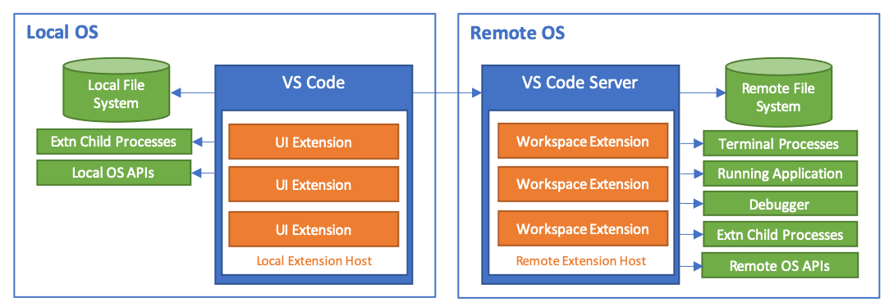
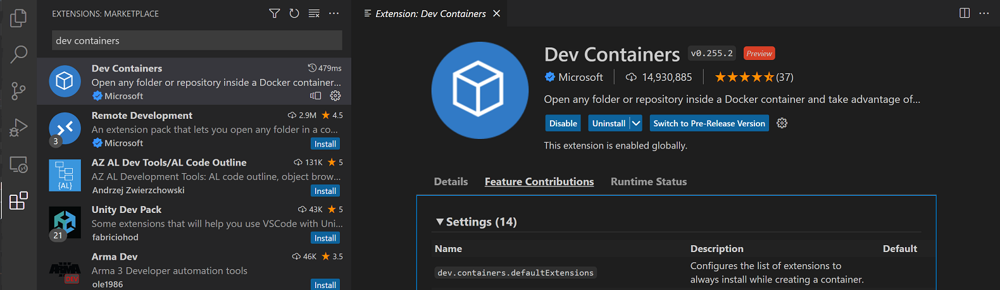

# 원격 개발 FAQ {#remote-development-faq}

이 문서는 **Visual Studio Code 원격 개발** 확장에 대한 자주 묻는 질문을 다룹니다. 각 기능을 설정하고 작업하는 방법에 대한 자세한 내용은 [SSH](/docs/remote/ssh.md), [컨테이너](/docs/devcontainers/containers.md), [WSL](/docs/remote/wsl.md) 문서를 참조하세요. 또는 원격 환경에서 빠르게 작업을 시작하는 데 도움이 되는 소개 [튜토리얼](/docs/remote/ssh-tutorial.md)을 시도해 보세요.

[GitHub Codespaces](https://github.com/features/codespaces)에 대한 질문은 [GitHub Codespaces 문서](https://docs.github.com/github/developing-online-with-codespaces)를 참조하세요.

## 일반 {#general}

### Visual Studio Code 원격 개발이란 무엇인가요? {#what-is-visual-studio-code-remote-development}

Visual Studio Code [원격 개발 확장 팩](https://aka.ms/vscode-remote/download/extension)을 사용하면 컨테이너, 원격 머신(SSH를 통해) 또는 Windows Subsystem for Linux에서 모든 폴더를 열고 VS Code의 전체 기능을 활용할 수 있습니다. 이는 코드가 위치하거나 호스팅되는 곳에 관계없이 VS Code가 로컬 품질의 개발 경험을 제공할 수 있음을 의미합니다. 여기에는 전체 IntelliSense(완성), 디버깅 등이 포함됩니다.

### VS Code 원격 개발이 로컬 편집에 비해 제공하는 이점은 무엇인가요? {#what-advantages-does-vs-code-remote-development-provide-over-local-editing}

원격 개발의 몇 가지 이점은 다음과 같습니다:

* 로컬에서 실행 중인 OS와 다른 OS에서 편집, 빌드 또는 디버깅할 수 있습니다.
* 대상 배포 환경과 일치하는 환경에서 개발할 수 있습니다.
* 로컬 머신보다 더 크거나 전문화된 하드웨어를 사용하여 개발할 수 있습니다.
* 클라우드나 고객 사이트와 같은 다른 위치에 저장된 코드를 편집할 수 있습니다.
* 개발자 환경을 분리하여 충돌을 피하고 보안을 개선하며 온보딩 속도를 높일 수 있습니다.

네트워크 공유를 사용하거나 파일을 동기화하는 것과 비교할 때, VS Code 원격 개발은 개발 환경과 도구에 대한 더 나은 제어와 함께 성능이 크게 향상됩니다.

### 원격 개발 확장과 GitHub Codespaces는 어떻게 관련이 있나요? {#how-do-the-remote-development-extensions-relate-to-github-codespaces}

[GitHub Codespaces](https://github.com/features/codespaces)는 VS Code와 새로운 브라우저 기반 편집기에서 접근할 수 있는 관리형 클라우드 호스팅 개발 환경을 제공하는 서비스입니다. 이 서비스는 또한 VS Code와 브라우저 기반 편집기가 SSH 서버나 직접 네트워크 경로 없이 자체 호스팅 환경(데스크탑 또는 서버)에 접근할 수 있도록 합니다. 자세한 내용은 [GitHub Codespaces 문서](https://docs.github.com/github/developing-online-with-codespaces)를 참조하세요.

원격 개발 및 Codespaces 확장은 기술과 기능을 공유하지만, 원격 개발 확장은 별도로 출시되며 GitHub Codespaces와 독립적으로 작동할 수 있습니다.

### 원격 개발 확장은 어떻게 작동하나요? {#how-do-the-remote-development-extensions-work}

Visual Studio Code 원격 개발은 로컬 VS Code 설치가 다른 머신(가상 또는 물리적)의 소스 코드 및 런타임 환경과 투명하게 상호작용할 수 있도록 하며, 특정 명령의 실행을 "원격 서버"로 이동합니다. **VS Code 서버**는 원격 엔드포인트에 연결할 때 VS Code에 의해 신속하게 설치되며, 원격 작업 공간, 머신 및 파일 시스템과 직접 상호작용하는 확장을 호스팅할 수 있습니다.



추가적인 확장에 대한 세부정보는 [원격 개발 지원](/api/advanced-topics/remote-extensions.md)을 참조하세요.

### 원격 개발 확장은 원격 머신, VM 또는 컨테이너에 대한 접근을 어떻게 보안하나요? {#how-do-the-remote-development-extensions-secure-access-to-a-remote-machine-vm-or-container}

Visual Studio Code 원격 개발은 [보안 셸](https://en.wikipedia.org/wiki/Secure_Shell)과 같은 기존의 잘 알려진 전송 방법을 사용하여 인증하고 트래픽을 보안합니다. 이러한 잘 알려진 보안 전송 방법이 사용하는 포트 외에는 공개적으로 열 필요가 없습니다.

주입된 VS Code 서버는 머신에 로그인할 때 사용한 사용자로 실행되며, 이는 VS Code와 그 확장이 허가 없이 부적절한 상승된 접근 권한을 부여받지 않도록 보장합니다. 서버는 VS Code에 의해 시작되고 중지되며, 사용자 또는 전역 로그인 또는 시작 스크립트에 연결되어 있지 않습니다. VS Code는 서버의 생명 주기를 관리하므로 서버가 실행 중인지 여부에 대해 걱정할 필요가 없습니다.

### VS Code 서버를 독립적으로 설치하거나 사용할 수 있나요? {#can-vs-code-server-be-installed-or-used-on-its-own}

아니요. VS Code 서버는 원격 개발 확장의 구성 요소이며 VS Code 클라이언트에 의해 관리됩니다. 엔드포인트에 연결할 때 VS Code에 의해 자동으로 설치 및 업데이트되며, 별도로 설치할 경우 빠르게 구식이 될 수 있습니다. 다른 클라이언트에서 사용하기 위한 것이 아니며 [라이센스](#license-and-privacy)가 부여되지 않았습니다.

### VS Code 서버의 연결 요구 사항은 무엇인가요? {#what-are-the-connectivity-requirements-for-vs-code-server}

VS Code 서버 설치를 위해서는 로컬 머신이 다음에 대한 아웃바운드 HTTPS(포트 443) 연결을 가져야 합니다:

* `update.code.visualstudio.com`
* `*.vo.msecnd.net` (Azure CDN)

기본적으로 Remote - SSH는 원격 호스트에서 다운로드를 시도하며, 연결이 설정되면 VS Code 서버를 로컬에서 다운로드하고 원격으로 전송하는 방식으로 실패합니다. `setting(remote.SSH.localServerDownload)` 설정을 사용하여 항상 로컬에서 다운로드한 후 전송하도록 변경하거나, 로컬에서 다운로드하지 않도록 설정할 수 있습니다.

Dev Containers 확장은 항상 로컬에서 다운로드하고 컨테이너로 전송합니다.

인터넷 연결 없이 수동으로 확장을 설치할 수 있는 **Extensions: Install from VSIX...** 명령을 사용할 수 있지만, 확장 패널이나 `devcontainer.json`을 사용하여 확장을 설치하는 경우 로컬 머신과 VS Code 서버는 다음에 대한 아웃바운드 HTTPS(포트 443) 접근이 필요합니다:

* `marketplace.visualstudio.com`
* `vscode.blob.core.windows.net`
* `*.vo.msecnd.net` (Azure CDN)
* `*.gallerycdn.vsassets.io` (Azure CDN)

마지막으로, 일부 확장(C#와 같은)은 `download.microsoft.com` 또는 `download.visualstudio.microsoft.com`에서 추가 종속성을 다운로드합니다. 다른 확장([Visual Studio Live Share](https://learn.microsoft.com/visualstudio/liveshare/reference/connectivity#requirements-for-connection-modes)와 같은)는 추가적인 연결 요구 사항이 있을 수 있습니다. 문제가 발생하면 확장 문서를 참조하세요.

서버와 VS Code 클라이언트 간의 모든 다른 통신은 확장에 따라 다음 전송 채널을 통해 이루어집니다:

* SSH: 인증된 보안 SSH 터널.
* 컨테이너: Docker의 구성된 통신 채널(`docker exec`를 통해).
* WSL: 임의의 로컬 포트.

VS Code가 접근해야 하는 위치 목록은 [네트워크 연결 문서](/docs/setup/network.md#common-hostnames)에서 확인할 수 있습니다.

### 원격 확장을 사용할 때 Docker 확장에서 로컬 컨테이너를 볼 수 없는 이유는 무엇인가요? {#why-cant-i-see-my-local-containers-in-the-docker-extension-when-using-the-remote---extensions}

기본적으로 Docker 확장은 원격에서 실행됩니다. 이는 일부 경우에 합리적인 기본값이지만, VS Code가 원격 SSH 호스트, 컨테이너 또는 WSL에 연결되어 있을 때 확장이 로컬 컨테이너를 표시하지 않을 수 있습니다.

이 문제를 해결하기 위해 다음 솔루션 중 하나를 사용할 수 있습니다:

* 새 로컬 창을 열고 (**파일 > 새 창**) 로컬 컨테이너와 작업합니다.

* [Dev Containers](https://aka.ms/vscode-remote/download/containers) 확장을 설치하고 로컬 컨테이너를 볼 필요가 있을 때 [원격 탐색기](/docs/devcontainers/containers.md#managing-containers)를 사용합니다.

* **WSL 전용**: [WSL 2용 Docker 기술 미리보기](https://docs.docker.com/docker-for-windows/wsl-tech-preview/)를 사용하거나 [WSL 1에서 사용할 Docker Desktop 구성](https://nickjanetakis.com/blog/setting-up-docker-for-windows-and-wsl-to-work-flawlessly)을 설정합니다.

* **Dev Containers 전용**: [Docker 소켓을 포워딩하고 Docker CLI를 설치](https://github.com/devcontainers/templates/tree/main/src/docker-outside-of-docker)합니다(컨테이너 내에서만).

* [extensionKind 속성](/docs/devcontainers/containers.md#advanced-forcing-an-extension-to-run-locally-or-remotely)을 사용하여 확장을 `ui`로 강제할 수 있습니다. 그러나 이 경우 일부 명령이 작동하지 않을 수 있습니다.

### 원격 개발을 사용하기 위해 호스트에 설치해야 하는 Linux 패키지나 라이브러리는 무엇인가요? {#what-linux-packages-or-libraries-need-to-be-installed-on-a-host-to-use-remote-development}

원격 개발은 kernel >= 4.18, glibc >=2.28, libstdc++ >= 3.4.25가 필요합니다. 최근 x86_64 glibc 기반 배포판이 가장 좋은 지원을 제공하지만, 정확한 요구 사항은 배포판에 따라 다를 수 있습니다.

musl 기반 [Alpine Linux](https://alpinelinux.org)에 대한 지원은 Dev Containers 및 WSL 확장에서 제공되며 ARMv7l (AArch32) / ARMv8l (AArch64)는 Remote - SSH에서 사용할 수 있습니다. 그러나 특정 확장에서의 네이티브 종속성으로 인해 비 x86_64 glibc 배포판에서 작동하지 않을 수 있습니다. 실험적인 ARMv8l (AArch64)는 [VS Code Insiders](https://code.visualstudio.com/insiders/)에서만 사용할 수 있습니다.

추가 세부정보는 [Linux와 함께하는 원격 개발](/docs/remote/linux.md)을 참조하세요.

### 오래된 Linux 배포판에서 VS Code 서버를 실행할 수 있나요? {#can-i-run-vs-code-server-on-older-linux-distributions}

VS Code 버전 1.99(2025년 3월)부터 VS Code에서 배포하는 미리 빌드된 서버는 glibc 2.28 이상을 기반으로 하는 Linux 배포판과만 호환됩니다. 예를 들어 Debian 10, RHEL 8 또는 Ubuntu 20.04가 이에 해당합니다.

VS Code는 여전히 사용자가 VS Code에서 지원하지 않는 OS(즉, glibc >= 2.28 및 libstdc++ >= 3.4.25가 없는 OS)에 [Remote - SSH](https://aka.ms/vscode-remote/download/ssh) 확장을 통해 연결할 수 있도록 허용합니다. 이 경우 이러한 필수 라이브러리 버전이 포함된 sysroot가 제공되어야 합니다. 이 접근 방식은 귀하와 귀하의 조직이 최신 Linux 배포판으로 마이그레이션할 수 있는 시간을 더 제공합니다.

| VS Code 버전 | 기본 요구 사항 | 비고 |
|--------------|-------------------|-------|
| 1.99.x | kernel >= 4.18, glibc >=2.28, libstdc++ >= 3.4.25, binutils >= 2.29 | &lt;없음&gt; |

> [!중요]
> 이 접근 방식은 기술적인 우회 방법이며 공식적으로 지원되는 사용 시나리오는 아닙니다.

이 우회 방법을 위해 환경을 구성하려면 다음 단계를 따르세요:

1. sysroot 빌드

    sysroot를 빌드하기 위해 [Crosstool-ng](https://crosstool-ng.github.io/docs/)를 사용하는 것을 권장합니다. 시작할 수 있는 몇 가지 예제 구성은 다음과 같습니다:

    * [x86_64-gcc-8.5.0-glibc-2.28](https://github.com/microsoft/vscode-linux-build-agent/blob/main/x86_64-gcc-8.5.0-glibc-2.28.config)
    * [aarch64-gcc-8.5.0-glibc-2.28](https://github.com/microsoft/vscode-linux-build-agent/blob/main/aarch64-gcc-8.5.0-glibc-2.28.config)
    * [armhf-gcc-8.5.0-glibc-2.28](https://github.com/microsoft/vscode-linux-build-agent/blob/main/armhf-gcc-8.5.0-glibc-2.28.config)

    다음 예제 컨테이너를 사용하여 [Crosstool-ng](https://crosstool-ng.github.io/docs/)가 설치된 환경을 만들 수도 있습니다:

    ```docker
    FROM ubuntu:latest

    RUN apt-get update
    RUN apt-get install -y gcc g++ gperf bison flex texinfo help2man make libncurses5-dev \
    python3-dev autoconf automake libtool libtool-bin gawk wget bzip2 xz-utils unzip \
    patch rsync meson ninja-build

    # crosstool-ng 설치
    RUN wget http://crosstool-ng.org/download/crosstool-ng/crosstool-ng-1.26.0.tar.bz2
    RUN tar -xjf crosstool-ng-1.26.0.tar.bz2
    RUN cd crosstool-ng-1.26.0 && ./configure --prefix=/crosstool-ng-1.26.0/out && make && make install
    ENV PATH=$PATH:/crosstool-ng-1.26.0/out/bin
    ```

    [Crosstool-ng](https://crosstool-ng.github.io/docs/)와 관련된 구성이 준비되면 다음 명령을 실행하여 sysroot를 생성합니다.

    ```sh
    mkdir toolchain-dir
    cd toolchain-dir
    cp <path-to-config-file> > .config
    ct-ng build
    ```

2. VS Code 서버는 설치 과정에서 [patchelf](https://github.com/NixOS/patchelf)를 사용하여 sysroot에서 필요한 라이브러리를 사용합니다.

> [!중요]
> patchelf `v0.17.x`는 원격 서버에서 세그멘테이션 오류를 유발하는 것으로 알려져 있으며, patchelf `>=v0.18.x`를 사용하는 것이 좋습니다.

3. 원격 호스트에 patchelf 바이너리와 sysroot를 설치합니다.

4. 다음 3개의 환경 변수를 생성합니다:

    * **VSCODE_SERVER_CUSTOM_GLIBC_LINKER**: sysroot의 동적 링커 경로( [patchelf](https://github.com/NixOS/patchelf)와 함께 `--set-interpreter` 옵션에 사용)
    * **VSCODE_SERVER_CUSTOM_GLIBC_PATH**: sysroot의 라이브러리 위치 경로( [patchelf](https://github.com/NixOS/patchelf)와 함께 `--set-rpath` 옵션에 사용)
    * **VSCODE_SERVER_PATCHELF_PATH**: 원격 호스트의 [patchelf](https://github.com/NixOS/patchelf) 바이너리 경로

이제 [Remote - SSH](https://aka.ms/vscode-remote/download/ssh) 확장을 사용하여 원격에 연결할 수 있습니다. 연결이 성공하면 VS Code는 연결이 지원되지 않는다는 대화 상자와 배너 메시지를 표시합니다.

### 개별 확장을 설치할 수 있나요, 아니면 확장 팩만 설치해야 하나요? {#can-i-install-individual-extensions-instead-of-the-extension-pack}

네. [원격 개발 확장 팩](https://aka.ms/vscode-remote/download/extension)은 최신 원격 기능에 접근할 수 있는 편리한 방법을 제공합니다. 그러나 항상 마켓플레이스나 VS Code 확장 보기에서 개별 확장을 설치할 수 있습니다.

* [Remote - SSH](https://aka.ms/vscode-remote/download/ssh)
* [Dev Containers](https://aka.ms/vscode-remote/download/containers)
* [WSL](https://aka.ms/vscode-remote/download/wsl)

## 확장 설정을 검토하고 구성하려면 어떻게 해야 하나요? {#how-can-i-review-and-configure-extension-settings}

[Visual Studio Code의 다른 부분](/docs/editor/settings.md)와 마찬가지로, 각 원격 개발 확장은 설정을 통해 사용자 정의할 수 있습니다. Dev Containers를 예로 들면, 확장 보기에서 확장을 열고 **기능 기여**로 이동하여 모든 Dev Containers 설정 목록을 검토할 수 있습니다:



## WSL {#wsl}

### 터미널로 WSL을 사용하는 것에 비해 확장의 장점은 무엇인가요? {#what-is-the-advantage-of-the-extension-over-using-wsl-as-the-terminal}

WSL을 Windows에서 실행되는 Linux 머신으로 생각할 수 있으며, Windows 설정에 영향을 주지 않고 Linux 전용 프레임워크/도구(예: Python, Go, Rust 등)를 설치할 수 있습니다. 그런 다음 VS Code와 WSL 확장을 사용하여 WSL에 설치된 내용을 기반으로 개발할 수 있으며, Windows에 설치된 내용과는 격리됩니다.

예를 들어, WSL에 Go 스택(컴파일러, 디버거, 린터 등)을 설치할 수 있습니다. Windows에서만 VS Code를 실행하면 스마트 완성, 디버깅, 정의로 이동과 같은 기능을 얻기 위해 동일한 Go 스택을 Windows에 설치해야 합니다. 그리고 언어 서비스가 Windows에서 실행되기 때문에 WSL에 무엇이 있는지 알지 못합니다.

WSL에서 Windows로, 또는 그 반대로 바이너리를 실행할 수 있지만, 일반적인 VS Code 확장은 이를 수행하는 방법을 알지 못합니다. 이것이 우리가 WSL에서 디버깅을 지원하기 시작한 방법이지만, 모든 확장을 WSL에 대해 업데이트해야 한다는 것을 빠르게 깨달았습니다.

대신 VS Code의 일부를 WSL에서 실행하고 Windows에서 실행되는 UI가 WSL에서 실행되는 VS Code 서버와 통신하도록 하기로 결정했습니다. 이것이 WSL 확장이 가능하게 하며, 이를 통해 Go 확장은 WSL에서 나머지 Go 도구(컴파일러, 디버거, 린터)와 함께 실행되며, VS Code는 Windows에서 실행됩니다.

이 접근 방식을 통해 스마트 완성과 같은 언어 기능이 Windows에서 아무것도 설정할 필요 없이 WSL에 있는 내용을 대상으로 작동합니다. 경로 문제에 대해 걱정할 필요가 없으며 Windows에서 개발 스택의 다른 버전을 설정할 필요가 없습니다. Linux에 애플리케이션을 배포하는 경우, WSL 인스턴스를 런타임 환경처럼 설정하면서도 Windows에서 풍부한 편집 경험을 얻을 수 있습니다.

## 확장 작성자 {#extensions-authors}

### 확장 작성자로서 무엇을 해야 하나요? {#as-an-extension-author-what-do-i-need-to-do}

VS Code 확장 API는 로컬/원격 세부 정보를 추상화하므로 대부분의 확장은 수정 없이 작동합니다. 그러나 확장이 원하는 모든 노드 모듈이나 런타임을 사용할 수 있기 때문에 조정이 필요할 수 있는 상황이 있습니다. 확장을 테스트하여(특히 컨테이너에서) 업데이트가 필요한지 확인하는 것이 좋습니다. 자세한 내용은 [원격 개발 지원](/api/advanced-topics/remote-extensions.md)을 참조하세요.

### 사용자가 원격으로 연결할 때 확장이 로컬 리소스나 API에 접근할 수 있나요? {#can-an-extension-access-local-resources-or-apis-when-a-user-is-connected-remotely}

VS Code가 원격 환경에 연결할 때 확장은 **UI** 또는 **작업 공간** 확장으로 분류됩니다. UI 확장은 **로컬 확장 호스트**에서 실행되며, UI 또는 개인화 기능(예: 테마)을 기여할 수 있고 로컬 파일이나 API에 접근할 수 있습니다. 작업 공간 확장은 **원격 확장 호스트**에서 실행되며, 작업 공간과 함께 소스 코드, 원격 파일 시스템 및 원격 API에 대한 전체 접근 권한을 가집니다. 작업 공간 확장은 UI 사용자 정의에 중점을 두지 않지만, 탐색기, 보기 및 기타 UI 요소를 기여할 수 있습니다.

사용자가 확장을 설치하면 VS Code는 올바른 위치를 유추하고 유형에 따라 설치를 시도합니다. 테마 및 기타 UI 사용자 정의와 같이 원격으로 실행할 필요가 없는 확장은 자동으로 UI 측에 설치됩니다. 나머지는 가장 기능이 풍부한 작업 공간 확장으로 처리됩니다. 그러나 확장 작성자는 `package.json`의 `extensionKind` 속성을 사용하여 이 위치를 재정의할 수도 있습니다.

확장이 예상대로 작동하지 않는 경우, [확장이 올바른 위치에서 실행되고 있는지 확인하는 단계](/api/advanced-topics/remote-extensions#incorrect-execution-location)를 확인하거나 다른 `extensionKind`를 가질 수 있는지 확인하세요. 또한 원격 개발 및 Codespaces에 대해 확장 작성자가 알아야 할 추가 세부정보는 [원격 개발 지원](/api/advanced-topics/remote-extensions.md)을 참조하세요.

## 라이센스 및 개인 정보 보호 {#license-and-privacy}

### 위치 {#location}

VS Code 원격 개발 확장의 라이센스는 다음에서 확인할 수 있습니다:

* [Remote-SSH 라이센스](https://marketplace.visualstudio.com/items/ms-vscode-remote.remote-ssh/license)
* [WSL 라이센스](https://marketplace.visualstudio.com/items/ms-vscode-remote.remote-wsl/license)
* [Dev Containers 라이센스](https://marketplace.visualstudio.com/items/ms-vscode-remote.remote-containers/license)

### 왜 원격 개발 확장이나 그 구성 요소가 오픈 소스가 아닌가요? {#why-arent-the-remote-development-extensions-or-their-components-open-source}

Visual Studio Code 원격 개발 확장 및 관련 구성 요소는 [오픈 계획, 문제 및 기능 요청 프로세스](https://aka.ms/vscode-remote/feedback)를 사용하지만 현재 오픈 소스가 아닙니다. 이 확장은 [GitHub Codespaces](https://github.com/features/codespaces)와 같은 완전 관리형 원격 개발 서비스에서 사용되는 소스 코드를 공유합니다.

자세한 내용은 [Visual Studio Code와 'Code - OSS'의 차이점](https://github.com/microsoft/vscode/wiki/Differences-between-the-repository-and-Visual-Studio-Code) 및 [Microsoft 확장 라이센스](/docs/supporting/oss-extensions.md) 문서를 참조하세요.

### 원격 개발 확장이 연결할 수 있는 위치에 제한이 있나요? {#are-there-any-restrictions-on-where-the-remote-development-extensions-can-connect}

개인적 또는 기업적 용도로 자신의 물리적 머신, 가상 머신 또는 컨테이너에 연결하기 위해 확장을 자유롭게 사용할 수 있습니다. 이들은 온프레미스, 개인 클라우드 또는 데이터 센터, Azure 또는 기타 클라우드/비클라우드 호스팅 제공업체에 있을 수 있습니다. 확장이나 관련 구성 요소(다음 질문 참조) 위에 공개 제품이나 서비스를 구축할 수는 없습니다.

### VS Code 원격 개발 확장을 사용하여 자신의 제품이나 서비스를 구축할 수 있나요? {#can-i-use-the-vs-code-remote-development-extensions-to-build-my-own-product-or-service}

자신의 내부 또는 개인 서비스와 함께 확장을 사용할 수 있습니다. 그러나 VS Code 원격 개발 확장이나 관련 구성 요소(예: VS Code 서버) 위에 공개 또는 상업적 서비스를 구축할 수는 없습니다. 원격 개발 확장을 확장하거나 조작하는 다른 확장을 만들 수 없습니다. 라이센스에 "소프트웨어를 독립형 또는 통합 제공으로 제공하거나 다른 사람들이 사용할 수 있도록 귀하의 애플리케이션과 결합할 수 없다"고 명시되어 있지만, 귀하의 서비스와 함께 확장을 사용하는 방법을 문서화할 수 있습니다.

### VS Code 서버를 자신의 공개 서비스 제공에 재포장하거나 재사용할 수 있나요? {#can-i-repackage-or-reuse-vs-code-server-in-my-own-public-service-offering}

아니요. 라이센스에 "소프트웨어를 독립형 또는 통합 제공으로 제공하거나 다른 사람들이 사용할 수 있도록 귀하의 애플리케이션과 결합할 수 없다"고 명시되어 있어 VS Code 서버 위에 공개 제품이나 서비스를 구축할 수 없습니다.

### X에 대해 확장을 사용할 수 있는지에 대한 질문이 있습니다. 누구에게 물어봐야 하나요? {#i-have-a-question-about-whether-i-can-use-the-extensions-for-x-who-can-i-ask}

[문제](https://github.com/microsoft/vscode-remote-release/issues)를 제기해 주세요.

### GDPR 및 VS Code 원격 개발 {#gdpr-and-vs-code-remote-development}

VS Code 원격 개발 확장은 Visual Studio Code 자체와 동일한 GDPR 정책을 따릅니다. 자세한 내용은 [일반 FAQ](/docs/supporting/faq.md#gdpr-and-vs-code)를 참조하세요.

## 질문이나 피드백 {#questions-or-feedback}

질문이나 피드백이 있으신가요?

* [팁과 요령](/docs/remote/troubleshooting.md)을 참조하세요.
* [Stack Overflow](https://stackoverflow.com/questions/tagged/vscode-remote)에서 검색하세요.
* [기능 요청](https://aka.ms/vscode-remote/feature-requests)을 추가하거나 [문제를 보고](https://aka.ms/vscode-remote/issues/new)하세요.