# SSH를 통한 원격 개발 {#remote-development-over-ssh}

이 튜토리얼은 Visual Studio Code의 [Remote - SSH](https://marketplace.visualstudio.com/items?itemName=ms-vscode-remote.remote-ssh) 확장을 사용하여 Azure에서 가상 머신(VM)을 생성하고 연결하는 방법을 안내합니다. Node.js Express 웹 앱을 생성하여 소스 코드가 로컬에 있는 것처럼 VS Code에서 원격 머신에서 편집하고 디버깅할 수 있는 방법을 보여줍니다.

> **참고**: 귀하의 Linux VM은 로컬 호스트, 온프레미스, Azure 또는 기타 클라우드에 호스팅될 수 있으며, 선택한 Linux 배포판이 이러한 [전제 조건](/docs/remote/linux.md#local-linux-prerequisites)을 충족하는 한 가능합니다.

## 전제 조건 {#prerequisites}

시작하려면 다음 단계를 완료해야 합니다:

1. [OpenSSH 호환 SSH 클라이언트](/docs/remote/troubleshooting.md#installing-a-supported-ssh-client)를 설치합니다 (PuTTY는 지원되지 않습니다).
2. [Visual Studio Code](https://code.visualstudio.com)를 설치합니다.
3. Azure 구독이 있어야 합니다 (Azure 구독이 없는 경우 시작하기 전에 [무료 계정](https://azure.microsoft.com/free/?WT.mc_id=A261C142F)을 생성하세요).

### 확장 설치 {#install-the-extension}

Remote - SSH 확장은 SSH 호스트에 연결하는 데 사용됩니다.

> <a class="install-extension-btn" href="vscode:extension/ms-vscode-remote.remote-ssh">Remote - SSH 확장 설치</a>


### Remote - SSH {#remote---ssh}

Remote - SSH 확장을 설치하면 왼쪽 끝에 새로운 상태 표시줄 항목이 표시됩니다.

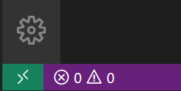

원격 상태 표시줄 항목은 VS Code가 실행되고 있는 컨텍스트(로컬 또는 원격)를 빠르게 보여주며, 항목을 클릭하면 Remote - SSH 명령이 나타납니다.

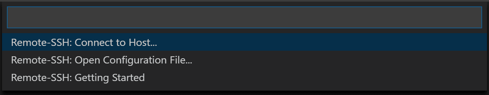

## 가상 머신 생성 {#create-a-virtual-machine}

기존 Linux 가상 머신이 없는 경우 [Azure 포털](https://portal.azure.com)을 통해 새 VM을 생성할 수 있습니다. Azure 포털에서 "가상 머신"을 검색하고 **추가**를 선택합니다. 거기에서 Azure 구독을 선택하고, 이미 없는 경우 새 리소스 그룹을 생성할 수 있습니다.

> **참고**: 이 튜토리얼에서는 Azure를 사용하고 있지만, 귀하의 Linux VM은 이러한 [전제 조건](/docs/remote/linux.md#local-linux-prerequisites)을 충족하는 한 어디에나 호스팅될 수 있습니다.

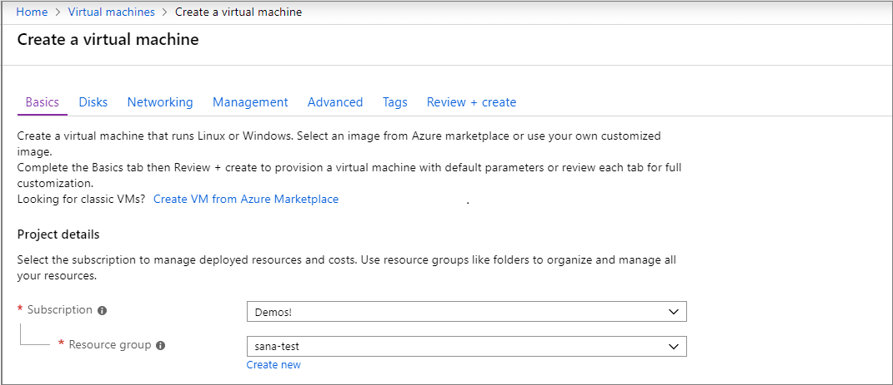

이제 VM의 이름, 크기 및 기본 이미지를 지정할 수 있습니다. 이 예제에서는 Ubuntu Server 18.04 LTS를 선택하지만, 최근 버전의 다른 Linux 배포판을 선택하고 VS Code의 [지원되는 SSH 서버](/docs/remote/troubleshooting.md#installing-a-supported-ssh-server)를 확인할 수 있습니다.

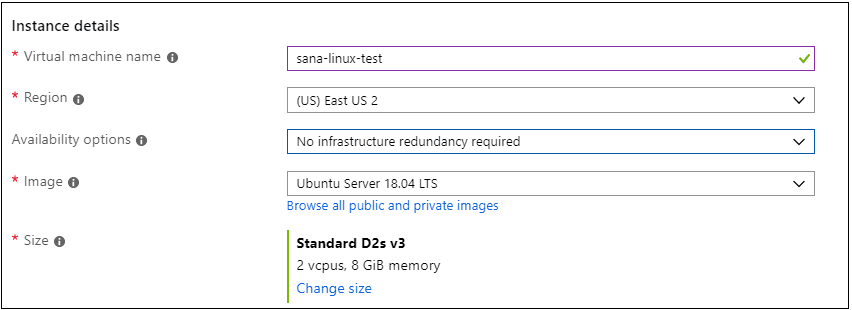

## SSH 설정 {#set-up-ssh}

VM에 대한 여러 인증 방법이 있으며, SSH 공개/개인 키 쌍 또는 사용자 이름과 비밀번호를 포함합니다. 키 기반 인증을 사용하는 것을 권장합니다 (사용자 이름/비밀번호를 사용하는 경우 확장에서 자격 증명을 여러 번 입력하라는 메시지가 표시됩니다). Windows에서 PuttyGen을 사용하여 이미 키를 생성한 경우 [재사용할 수 있습니다](/docs/remote/troubleshooting.md#reusing-a-key-generated-in-puttygen).

### SSH 키 생성 {#create-an-ssh-key}

SSH 키 쌍이 없는 경우, bash 셸 또는 명령줄을 열고 다음을 입력합니다:

```bash
ssh-keygen -t ed25519
```

이 명령은 SSH 키를 생성합니다. 다음 프롬프트에서 `kbstyle(Enter)`를 눌러 기본 위치(사용자 디렉토리 아래 `.ssh`라는 폴더)에 키를 저장합니다.

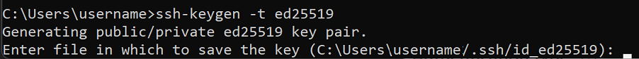

그런 다음 안전한 암호 구문을 입력하라는 메시지가 표시되지만, 비워 두어도 됩니다. 이제 새로운 공개 SSH 키가 포함된 `id_ed25519.pub` 파일이 생성되었습니다.

> **참고**: Ed25519 알고리즘을 지원하지 않는 레거시 시스템을 사용하는 경우 대신 rsa를 사용할 수 있습니다: `ssh-keygen -t rsa -b 4096`.

## VM에 SSH 키 추가 {#add-ssh-key-to-your-vm}

이전 단계에서 SSH 키 쌍을 생성했습니다. **SSH 공개 키 소스**의 드롭다운에서 **기존 공개 키 사용**을 선택하여 방금 생성한 공개 키를 사용할 수 있습니다. 공개 키를 복사하여 VM 설정의 **SSH 공개 키**에 붙여넣습니다. 또한 **선택한 포트 허용**을 선택하고 **인바운드 포트 선택** 드롭다운 목록에서 **SSH (22)**를 선택하여 VM이 인바운드 SSH 트래픽을 수락하도록 허용해야 합니다.


### 자동 종료 {#auto-shutdown}

Azure VM을 사용할 때의 멋진 기능 중 하나는 자동 종료를 활성화할 수 있다는 것입니다 (사실, 우리는 모두 VM을 끄는 것을 잊어버리곤 하죠…). **관리** 탭으로 이동하면 매일 VM을 종료할 시간을 설정할 수 있습니다.


**검토 및 생성**을 선택한 다음 **생성**을 클릭하면 Azure가 VM을 배포합니다!

배포가 완료되면 (몇 분이 걸릴 수 있습니다) 생성한 가상 머신의 새 리소스 보기를 확인합니다.

## SSH를 사용하여 연결 {#connect-using-ssh}

이제 SSH 호스트를 생성했으므로 연결해 보겠습니다!

상태 표시줄의 왼쪽 하단 모서리에 표시된 지표를 확인했을 것입니다. 이 지표는 VS Code가 실행되고 있는 컨텍스트(로컬 또는 원격)를 알려줍니다. 지표를 클릭하면 Remote 확장 명령 목록이 나타납니다.

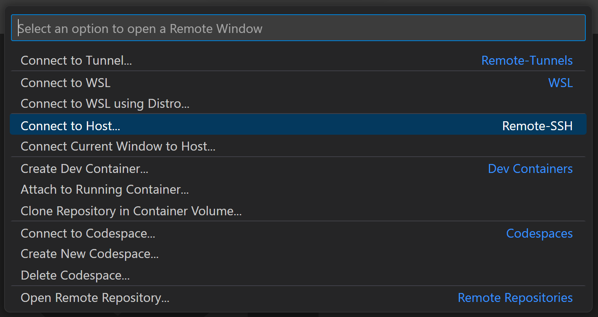

**Remote-SSH** 섹션에서 **호스트에 연결...** 명령을 선택하고 다음 형식으로 VM의 연결 정보를 입력하여 호스트에 연결합니다: `user@hostname`.

`user`는 SSH 공개 키를 VM에 추가할 때 설정한 사용자 이름입니다. `hostname`의 경우, [Azure 포털](https://portal.azure.com)로 돌아가서 생성한 VM의 **개요** 창에서 **공용 IP 주소**를 복사합니다.


Remote - SSH에서 연결하기 전에 `ssh user@hostname`을 사용하여 명령 프롬프트에서 VM에 연결할 수 있는지 확인할 수 있습니다.

> 참고: `ssh: connect to host <host ip> port 22: Connection timed out` 오류가 발생하면 VM의 네트워킹 탭에서 NRMS-Rule-106을 삭제해야 할 수 있습니다:

   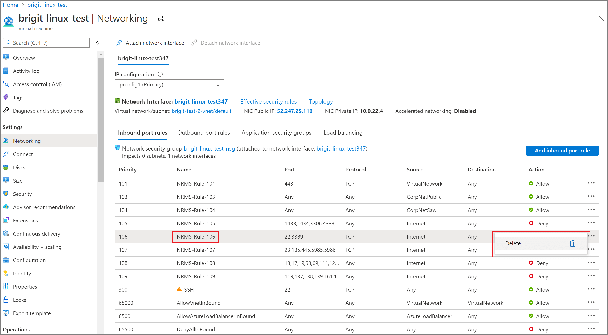

연결 정보 텍스트 상자에 사용자와 호스트 이름을 설정합니다.


VS Code는 이제 새 창(인스턴스)을 엽니다. 그러면 "VS Code Server"가 SSH 호스트에서 초기화되고 있다는 알림이 표시됩니다. 원격 호스트에 VS Code Server가 설치되면 확장을 실행하고 로컬 VS Code 인스턴스와 통신할 수 있습니다.


상태 표시줄의 지표를 보면 VM에 연결되었음을 알 수 있습니다. VM의 호스트 이름이 표시됩니다.


Remote - SSH 확장은 활동 표시줄에 새로운 아이콘을 추가하며, 클릭하면 원격 탐색기가 열립니다. 드롭다운에서 **SSH 대상**을 선택하면 SSH 연결을 구성할 수 있습니다. 예를 들어, 가장 자주 연결하는 호스트를 저장하고 여기에서 사용자와 호스트 이름을 입력하는 대신 액세스할 수 있습니다.

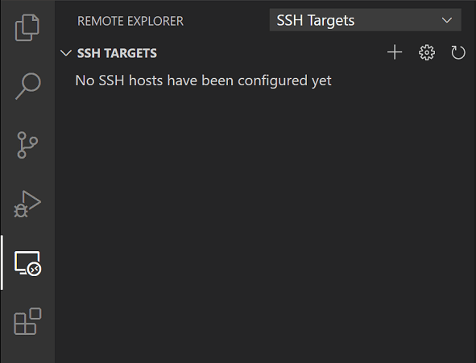

SSH 호스트에 연결되면 원격 머신에서 파일과 폴더를 상호작용할 수 있습니다. 통합 터미널(`kb(workbench.action.terminal.toggleTerminal)`)을 열면 **Windows에서 작업 중인 bash 셸** 안에 있다는 것을 알 수 있습니다.


bash 셸을 사용하여 VM의 파일 시스템을 탐색할 수 있습니다. 또한 **파일** > **폴더 열기**를 통해 원격 홈 디렉토리에서 폴더를 탐색하고 열 수 있습니다.


## Node.js 애플리케이션 만들기 {#create-your-nodejs-application}

이 단계에서는 간단한 Node.js 애플리케이션을 생성합니다. 애플리케이션 생성기를 사용하여 터미널에서 애플리케이션을 빠르게 스캐폴드합니다.

### Node.js 및 npm 설치 {#install-nodejs-and-npm}

통합 터미널(`kb(workbench.action.terminal.toggleTerminal)`)에서 Linux VM의 패키지를 업데이트한 다음, npm( Node.js 패키지 관리자)을 포함한 Node.js를 설치합니다.

```bash
sudo apt-get update
curl -sL https://deb.nodesource.com/setup_lts.x | sudo -E bash -
sudo apt-get install -y nodejs
```

설치가 완료되었는지 확인하려면 다음을 실행합니다:

```bash
node --version
npm --version
```

### Express 생성기 설치 {#install-the-express-generator}

[Express](https://www.expressjs.com)는 Node.js 애플리케이션을 구축하고 실행하기 위한 인기 있는 프레임워크입니다. [Express Generator](https://expressjs.com/en/starter/generator.html) 도구를 사용하여 새 Express 애플리케이션을 스캐폴드(생성)할 수 있습니다. Express Generator는 npm 모듈로 제공되며 npm 명령줄 도구 `npm`을 사용하여 설치됩니다.

```bash
sudo npm install -g express-generator
```

`-g` 스위치는 Express Generator를 전역적으로 설치하여 어디에서나 실행할 수 있도록 합니다.

### 새 애플리케이션 생성 {#create-a-new-application}

이제 `myExpressApp`이라는 새 Express 애플리케이션을 생성할 수 있습니다:

```bash
express myExpressApp --view pug
```

`--view pug` 매개변수는 생성기에게 [pug](https://pugjs.org/api/getting-started.html) 템플릿 엔진을 사용하도록 지시합니다.

애플리케이션의 모든 종속성을 설치하려면 새 폴더로 이동하여 `npm install`을 실행합니다.

```bash
cd myExpressApp
npm install
```

### 애플리케이션 실행 {#run-the-application}

마지막으로 애플리케이션이 실행되는지 확인해 보겠습니다. 터미널에서 `npm start` 명령을 사용하여 서버를 시작합니다.

```bash
npm start
```

Express 앱은 기본적으로 [http://localhost:3000](http://localhost:3000)에서 실행됩니다. 웹 앱이 가상 머신에서 실행되고 있기 때문에 로컬 브라우저에서 localhost:3000에서 아무것도 보이지 않을 것입니다.

### 포트 포워딩 {#port-forwarding}

로컬 머신에서 웹 앱을 탐색할 수 있도록 [포트 포워딩](/docs/remote/ssh.md#temporarily-forwarding-a-port)이라는 또 다른 기능을 활용할 수 있습니다.

공개되지 않을 수 있는 원격 머신의 포트에 접근하려면 로컬 머신의 포트와 서버 간에 연결 또는 터널을 설정해야 합니다. 앱이 여전히 실행 중인 상태에서 SSH 탐색기를 열고 **포워딩된 포트** 보기를 찾습니다. **포트 포워딩** 링크를 클릭하고 포트 3000을 포워딩하도록 지정합니다:

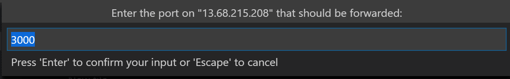

연결 이름을 "browser"로 지정합니다:

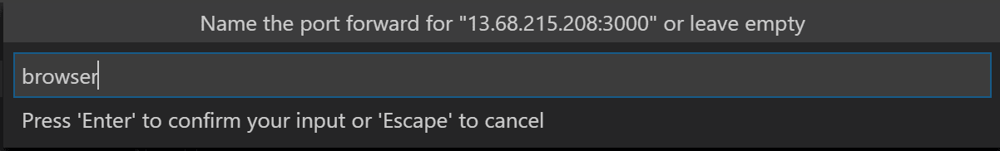

서버는 이제 포트 3000에서 로컬 머신으로 트래픽을 포워딩합니다. [http://localhost:3000](http://localhost:3000)으로 이동하면 실행 중인 웹 앱을 볼 수 있습니다.


## 편집 및 디버깅 {#edit-and-debug}

Visual Studio Code 파일 탐색기(`kb(workbench.view.explorer)`)에서 새로 생성한 `myExpressApp` 폴더로 이동하여 `app.js` 파일을 두 번 클릭하여 편집기에서 엽니다.

### IntelliSense {#intellisense}

JavaScript 파일에 대한 구문 강조와 함께 IntelliSense가 제공되며, 소스 코드가 로컬 머신에 있는 경우와 마찬가지로 호버 기능이 작동합니다.

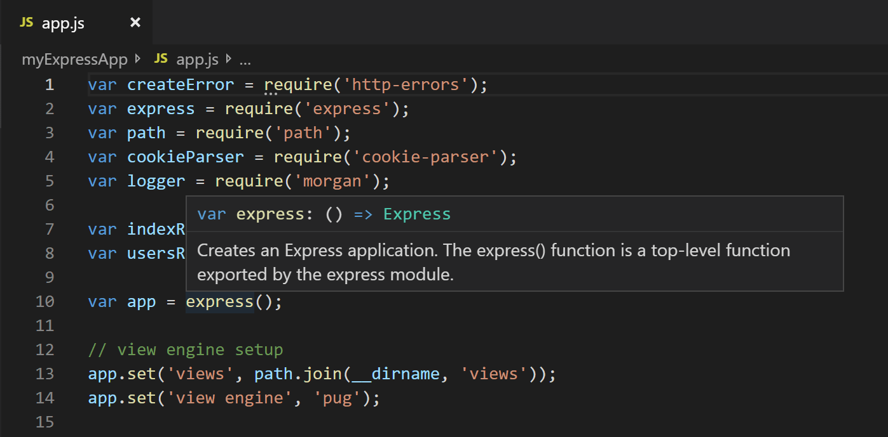

타이핑을 시작하면 객체 메서드와 속성에 대한 스마트 완성이 제공됩니다.


### 디버깅 {#debugging}

`app.js`의 10행에 중단점을 설정하려면 행 번호 왼쪽의 여백을 클릭하거나 해당 행에 커서를 두고 `kb(editor.debug.action.toggleBreakpoint)`를 누릅니다. 중단점은 빨간 원으로 표시됩니다.

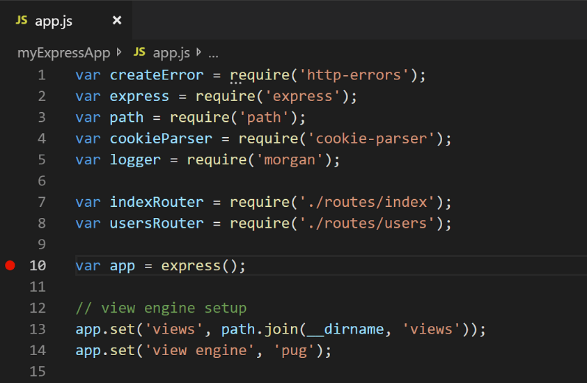

이제 `kb(workbench.action.debug.start)`를 눌러 애플리케이션을 실행합니다. 애플리케이션 실행 방법을 묻는 메시지가 표시되면 **Node.js**를 선택합니다.

앱이 시작되고 중단점에 도달합니다. 변수를 검사하고, 감시를 생성하고, 호출 스택을 탐색할 수 있습니다.

`kb(workbench.action.debug.stepOver)`를 눌러 한 단계 진행하거나 `kb(workbench.action.debug.start)`를 다시 눌러 디버깅 세션을 종료합니다.

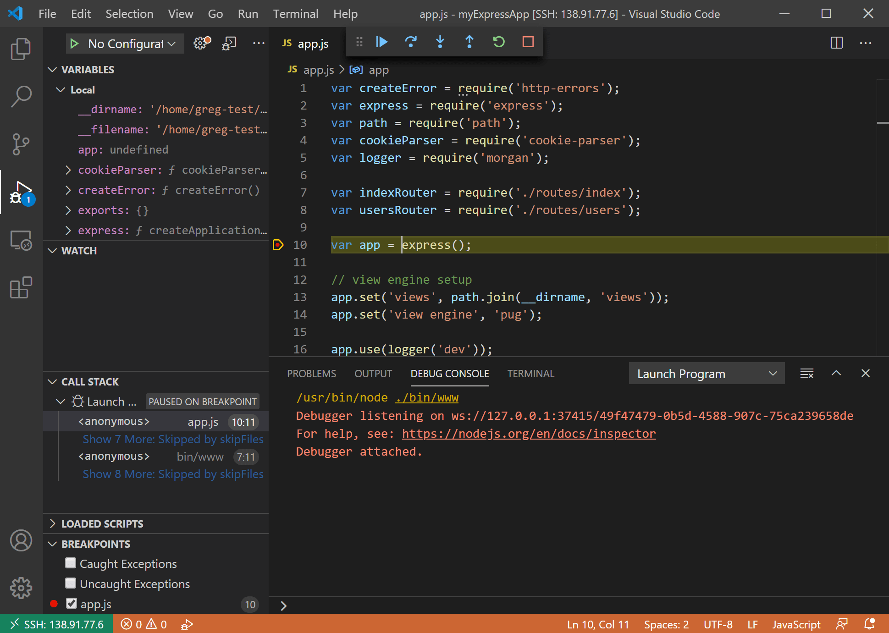

SSH를 통해 연결된 Visual Studio Code의 전체 개발 경험을 누릴 수 있습니다.

### SSH 연결 종료 {#ending-your-ssh-connection}

SSH 세션을 종료하고 로컬에서 VS Code를 계속 실행하려면 **파일** > **원격 연결 닫기**를 선택합니다.

### 축하합니다 {#congratulations}

축하합니다, 이 튜토리얼을 성공적으로 완료했습니다!

다음으로 다른 원격 개발 확장을 확인해 보세요.

* [WSL](https://marketplace.visualstudio.com/items?itemName=ms-vscode-remote.remote-wsl)
* [Dev Containers](https://marketplace.visualstudio.com/items?itemName=ms-vscode-remote.remote-containers)

또는 [원격 개발](https://marketplace.visualstudio.com/items?itemName=ms-vscode-remote.vscode-remote-extensionpack) 확장 팩을 설치하여 모두 얻을 수 있습니다.