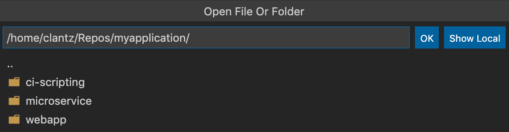
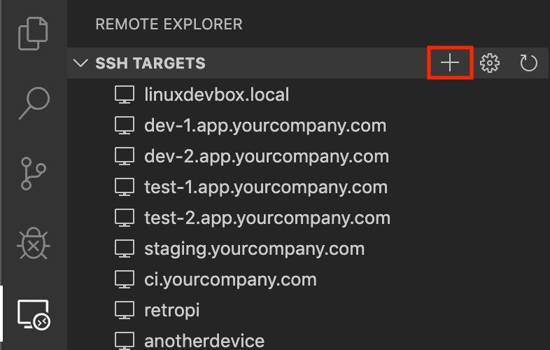
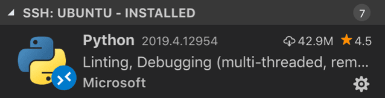
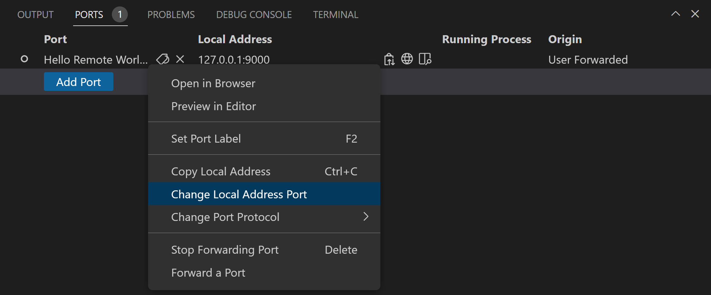
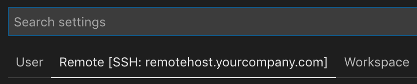

# SSH를 이용한 원격 개발 {#remote-development-using-ssh}

**Visual Studio Code Remote - SSH** 확장 기능을 사용하면 SSH 서버가 실행 중인 원격 머신, 가상 머신 또는 컨테이너의 원격 폴더를 열고 VS Code의 모든 기능을 최대한 활용할 수 있습니다. 서버에 연결되면 원격 파일 시스템의 어디에서나 파일 및 폴더와 상호작용할 수 있습니다.

이러한 이점을 얻기 위해 소스 코드를 로컬 머신에 두어야 할 필요는 없습니다. 확장 기능은 원격 머신에서 직접 명령과 다른 확장 기능을 실행합니다. 이 확장 기능은 원격 OS에 VS Code Server를 설치하며, 이 서버는 원격 OS에 존재하는 기존 VS Code 설치와는 독립적입니다.


이로 인해 VS Code는 **코드가 호스팅되는 위치에 관계없이** 전체 IntelliSense(완성), 코드 탐색 및 디버깅을 포함한 **로컬 품질의 개발 경험**을 제공합니다.

## 시작하기 {#getting-started}

:::note
이 주제를 검토한 후, 소개 [SSH 튜토리얼](/docs/remote/ssh-tutorial.md)로 시작할 수 있습니다.
:::

### 시스템 요구 사항 {#system-requirements}

**로컬:** 지원되는 [OpenSSH 호환 SSH 클라이언트](/docs/remote/troubleshooting.md#installing-a-supported-ssh-client)도 설치되어 있어야 합니다.

**원격 SSH 호스트**: 다음에서 실행 중인 [SSH 서버](/docs/remote/troubleshooting.md#installing-a-supported-ssh-server):

- x86_64 Debian 8+, Ubuntu 16.04+, CentOS / RHEL 7+.
- ARMv7l (AArch32) Raspberry Pi OS (이전 이름: Raspbian) Stretch/9+ (32비트).
- ARMv8l (AArch64) Ubuntu 18.04+ (64비트).
- Windows 10 / Server 2016/2019 (1803+)에서 [공식 OpenSSH Server](https://learn.microsoft.com/windows-server/administration/openssh/openssh_install_firstuse)를 사용.
- macOS 10.14+ (Mojave) SSH 호스트에서 [원격 로그인 활성화](https://support.apple.com/guide/mac-help/allow-a-remote-computer-to-access-your-mac-mchlp1066/mac).
- 원격 호스트에는 1GB RAM이 필요하지만, 최소 2GB RAM과 2코어 CPU를 권장합니다.

필요한 전제 조건이 충족된다면 다른 `glibc` 기반 Linux 배포판도 x86_64, ARMv7l (AArch32) 및 ARMv8l (AArch64)에서 작동해야 합니다. 커뮤니티 지원 배포판을 설정하는 방법에 대한 정보는 [Linux로 원격 개발](/docs/remote/linux.md) 기사를 참조하세요.

ARMv7l (AArch32) 및 ARMv8l (AArch64) 지원이 가능하지만, 이러한 장치에 설치된 일부 확장은 확장에서 x86 네이티브 코드를 사용하기 때문에 작동하지 않을 수 있습니다.

### 설치 {#installation}

시작하려면 다음을 수행해야 합니다:

1. [OpenSSH 호환 SSH 클라이언트](/docs/remote/troubleshooting.md#installing-a-supported-ssh-client)를 설치합니다. 이미 설치되어 있지 않은 경우.

2. [Visual Studio Code](https://code.visualstudio.com/) 또는 [Visual Studio Code Insiders](https://code.visualstudio.com/insiders/)를 설치합니다.

3. [Remote-SSH 확장](https://marketplace.visualstudio.com/items?itemName=ms-vscode-remote.remote-ssh)을 설치합니다. VS Code에서 다른 원격 확장 기능과 함께 작업할 계획이라면 [Remote Development 확장 팩](https://aka.ms/vscode-remote/download/extension)을 설치할 수도 있습니다.

### SSH 호스트 설정 {#ssh-host-setup}

1. SSH 호스트가 설정되어 있지 않은 경우, [Linux](/docs/remote/troubleshooting.md#installing-a-supported-ssh-server), [Windows 10 / Server (1803+)](https://learn.microsoft.com/windows-server/administration/openssh/openssh_install_firstuse) 또는 [macOS](https://support.apple.com/guide/mac-help/allow-a-remote-computer-to-access-your-mac-mchlp1066/mac) SSH 호스트에 대한 지침을 따르거나 [Azure에서 VM 생성](https://learn.microsoft.com/azure/virtual-machines/linux/quick-create-portal)합니다.

2. **선택 사항:** Linux 또는 macOS SSH 호스트에 여러 사용자가 동시에 접근할 경우, 보안을 강화하기 위해 VS Code [사용자 설정](/docs/editor/settings.md)에서 **Remote.SSH: Remote Server Listen On Socket**을 활성화하는 것을 고려하세요.

    설정 편집기에서:

    

    자세한 내용은 [팁과 요령](/docs/remote/troubleshooting.md#improving-security-on-multi-user-servers) 기사를 참조하세요.

3. **선택 사항:** 비밀번호 기반 인증이 지원되지만, 호스트에 대해 **키 기반 인증**을 설정하는 것이 좋습니다. 자세한 내용은 [팁과 요령](/docs/remote/troubleshooting.md#configuring-key-based-authentication) 기사를 참조하세요.

### 원격 호스트에 연결 {#connect-to-a-remote-host}

원격 호스트에 처음 연결하려면 다음 단계를 따르세요:

1. 터미널 / PowerShell 창에서 다음 명령을 실행하여 SSH 호스트에 연결할 수 있는지 확인합니다. `user@hostname`을 적절히 바꿉니다.

    ```bash
    ssh user@hostname
    # 도메인 / AAD 계정을 사용하는 Windows의 경우
    ssh user@domain@hostname
    ```

2. VS Code에서 명령 팔레트(`kbstyle(F1)`, `kb(workbench.action.showCommands)`)에서 **Remote-SSH: Connect to Host...**를 선택하고 1단계에서 사용한 것과 동일한 `user@hostname`을 사용합니다.

    

3. VS Code가 연결하는 서버의 유형을 자동으로 감지할 수 없는 경우, 수동으로 유형을 선택하라는 메시지가 표시됩니다.

    

    플랫폼을 선택하면 [VS Code 설정](/docs/editor/settings.md)에서 `remote.SSH.remotePlatform` 속성 아래에 저장되므로 언제든지 변경할 수 있습니다.

4. 잠시 후, VS Code가 SSH 서버에 연결되고 설정을 완료합니다. VS Code는 진행 알림을 통해 최신 정보를 제공하며, `Remote - SSH` 출력 채널에서 자세한 로그를 확인할 수 있습니다.

    :::tip
    연결이 멈추거나 실패합니까? 일반적인 문제를 해결하는 방법에 대한 정보는 [문제 해결 팁](/docs/remote/troubleshooting.md#troubleshooting-hanging-or-failing-connections)을 참조하세요.

    SSH 파일 권한에 대한 오류가 표시되면 [SSH 파일 권한 오류 수정](/docs/remote/troubleshooting.md#fixing-ssh-file-permission-errors) 섹션을 참조하세요.
    :::

5. 연결되면 빈 창이 열립니다. 상태 표시줄을 참조하여 어떤 호스트에 연결되어 있는지 확인할 수 있습니다.

    

    상태 표시줄 항목을 클릭하면 연결된 동안 사용할 수 있는 원격 명령 목록이 제공됩니다.

6. 그런 다음 **File > Open...** 또는 **File > Open Workspace...**를 사용하여 원격 머신에서 원하는 폴더나 작업 공간을 열 수 있습니다!

    

여기서 [호스트에 연결할 때 사용할 확장 기능](#managing-extensions)을 설치하고 편집을 시작하세요!

:::note
ARMv7l / ARMv8l `glibc` SSH 호스트에서는 x86으로 컴파일된 네이티브 코드로 인해 일부 확장이 작동하지 않을 수 있습니다.
:::

### 컨테이너 내 원격 SSH 호스트의 폴더 열기 {#open-a-folder-on-a-remote-ssh-host-in-a-container}

Linux 또는 macOS SSH 호스트를 사용하는 경우, Remote - SSH와 [Dev Containers](/docs/devcontainers/containers.md) 확장을 함께 사용하여 컨테이너 내의 원격 호스트에서 폴더를 열 수 있습니다. 로컬에 Docker 클라이언트를 설치할 필요도 없습니다.

이를 위해:

1. 원격 호스트에 Docker를 설치하고 VS Code 및 Dev Containers 확장을 로컬에 설치하는 [설치](/docs/devcontainers/containers.md#installation) 단계를 따르세요.
2. **선택 사항:** 서버에 SSH [키 기반 인증](/docs/remote/troubleshooting.md#configuring-key-based-authentication)을 설정하여 비밀번호를 여러 번 입력할 필요가 없도록 합니다.
3. Remote - SSH 확장을 사용하여 호스트에 연결하고 그곳에서 폴더를 여는 [빠른 시작](#connect-to-a-remote-host)을 따르세요.
4. 명령 팔레트(`kbstyle(F1)`, `kb(workbench.action.showCommands)`)에서 **Dev Containers: Reopen in Container** 명령을 사용합니다.

나머지 [Dev Containers 빠른 시작](/docs/devcontainers/containers.md#quick-start-open-an-existing-folder-in-a-container) 내용은 그대로 적용됩니다. [Dev Containers 확장 문서](/docs/devcontainers/containers.md)에서 더 많은 정보를 얻을 수 있습니다. 이 모델이 필요에 맞지 않는 경우 [원격 Docker 호스트에서 개발하기](/remote/advancedcontainers/develop-remote-host.md) 기사를 참조하여 다른 옵션을 확인할 수 있습니다.

### 원격 호스트에서 연결 끊기 {#disconnect-from-a-remote-host}

원격 호스트에서 파일 편집을 마친 후 연결을 종료하려면 **File > Close Remote Connection**를 선택하여 호스트와의 연결을 끊습니다. 기본 구성에서는 이 명령에 대한 키보드 단축키가 포함되어 있지 않습니다. VS Code를 종료하여 원격 연결을 닫을 수도 있습니다.

### 호스트 및 고급 설정 기억하기 {#remember-hosts-and-advanced-settings}

자주 사용하는 호스트 세트가 있거나 추가 옵션을 사용하여 호스트에 연결해야 하는 경우, [SSH 구성 파일 형식](https://man7.org/linux/man-pages/man5/ssh_config.5.html)을 따르는 로컬 파일에 추가할 수 있습니다.

설정을 쉽게 하기 위해, 확장 기능은 이 파일을 수동으로 편집하지 않고도 호스트를 추가하는 방법을 안내할 수 있습니다.

명령 팔레트(`kbstyle(F1)`, `kb(workbench.action.showCommands)`)에서 **Remote-SSH: Add New SSH Host...**를 선택하거나 활동 표시줄의 SSH **Remote Explorer**에서 **Add New*** 아이콘을 클릭하여 시작하세요.



그런 다음 SSH 연결 정보를 입력하라는 메시지가 표시됩니다. 호스트 이름을 입력할 수 있습니다:


또는 명령줄에서 호스트에 연결하는 데 사용할 전체 `ssh` 명령을 입력할 수 있습니다:


마지막으로 사용할 구성 파일을 선택하라는 메시지가 표시됩니다. 나열된 구성 파일과 다른 구성 파일을 사용하려면 사용자 `settings.json` 파일에서 `"remote.SSH.configFile"` 속성을 설정할 수도 있습니다. 확장 기능이 나머지를 처리합니다!

예를 들어, 입력 상자에 `ssh -i ~/.ssh/id_rsa-remote-ssh yourname@remotehost.yourcompany.com`을 입력하면 다음 항목이 생성됩니다:

```ssh-config
Host remotehost.yourcompany.com
    User yourname
    HostName another-host-fqdn-or-ip-goes-here
    IdentityFile ~/.ssh/id_rsa-remote-ssh
```

여기서 보여준 키 생성에 대한 자세한 내용은 [팁과 요령](/docs/remote/troubleshooting.md#improving-your-security-with-a-dedicated-key)을 참조하세요. 이 파일은 [SSH 구성 파일 형식](https://man7.org/linux/man-pages/man5/ssh_config.5.html)에서 지원하는 모든 것으로 수동으로 편집할 수 있으므로, 이는 단지 하나의 예일 뿐입니다.

이 시점부터 호스트는 명령 팔레트(`kbstyle(F1)`, `kb(workbench.action.showCommands)`)에서 **Remote-SSH: Connect to Host...**를 선택하거나 **Remote Explorer**의 **SSH Targets** 섹션에서 선택할 때 호스트 목록에 나타납니다.


**Remote Explorer**를 사용하면 원격 호스트에서 새 빈 창을 열거나 이전에 열었던 폴더를 직접 열 수 있습니다. 호스트를 확장하고 열고자 하는 폴더 옆의 **Open Folder** 아이콘을 클릭하세요.


## 확장 프로그램 관리 {#managing-extensions}

VS Code는 확장 프로그램을 두 곳 중 하나에서 실행합니다: 로컬 UI / 클라이언트 측 또는 원격 SSH 호스트에서. 테마 및 스니펫과 같이 VS Code UI에 영향을 미치는 확장은 로컬에 설치되지만, 대부분의 확장은 SSH 호스트에 존재합니다. 이는 원활한 경험을 보장하고, 로컬 머신에서 SSH 호스트의 특정 작업 공간에 필요한 확장 프로그램을 설치할 수 있게 해줍니다. 이렇게 하면 다른 머신에서 확장과 함께 중단한 지점에서 정확히 이어서 작업할 수 있습니다.

확장 프로그램을 확장 프로그램 화면에서 설치하면 자동으로 올바른 위치에 설치됩니다. 설치가 완료되면 확장이 설치된 위치를 카테고리 그룹화에 따라 알 수 있습니다.

원격 SSH 호스트에 대한 카테고리가 있습니다:



또한 **Local - Installed** 카테고리도 있습니다:


:::note
확장 작성자이고 확장이 제대로 작동하지 않거나 잘못된 위치에 설치되는 경우, [원격 개발 지원](/api/advanced-topics/remote-extensions.md)에서 자세한 내용을 확인하세요.
:::

실제로 원격에서 실행해야 하는 로컬 확장은 **Local - Installed** 카테고리에서 흐릿하게 표시되고 비활성화됩니다. 원격 호스트에 확장을 설치하려면 **Install**를 선택하세요.


또한 확장 보기로 이동하여 **Install Local Extensions in SSH: \{Hostname\}**를 선택하여 SSH 호스트에 모든 로컬 설치된 확장을 설치할 수 있습니다. 이렇게 하면 SSH 호스트에 설치할 로컬 설치된 확장을 선택할 수 있는 드롭다운이 표시됩니다.

### "항상 설치됨" 확장 {#always-installed-extensions}

모든 SSH 호스트에 항상 설치하고 싶은 확장이 있는 경우, `settings.json`의 `remote.SSH.defaultExtensions` 속성을 사용하여 어떤 확장을 설치할지 지정할 수 있습니다. 예를 들어, [GitLens](https://marketplace.visualstudio.com/items?itemName=eamodio.gitlens) 및 [Resource Monitor](https://marketplace.visualstudio.com/items?itemName=mutantdino.resourcemonitor) 확장을 설치하고 싶다면, 다음과 같이 확장 ID를 지정합니다:

```json
"remote.SSH.defaultExtensions": [
    "eamodio.gitlens",
    "mutantdino.resourcemonitor"
]
```

### 고급: 확장을 로컬 / 원격에서 실행하도록 강제하기 {#advanced-forcing-an-extension-to-run-locally-remotely}

확장은 일반적으로 로컬 또는 원격에서 실행되도록 설계되고 테스트되며, 둘 다는 아닙니다. 그러나 확장이 이를 지원하는 경우, `settings.json` 파일에서 특정 위치에서 실행되도록 강제할 수 있습니다.

예를 들어, 아래 설정은 [Docker](https://marketplace.visualstudio.com/items?itemName=ms-azuretools.vscode-docker) 확장을 로컬에서 실행하고 [Remote - SSH: Editing Configuration Files](https://marketplace.visualstudio.com/items?itemName=ms-vscode-remote.remote-ssh-edit) 확장을 원격에서 실행하도록 강제합니다:

```json
"remote.extensionKind": {
    "ms-azuretools.vscode-docker": [ "ui" ],
    "ms-vscode-remote.remote-ssh-edit": [ "workspace" ]
}
```

`"workspace"` 대신 `"ui"` 값을 사용하면 확장이 로컬 UI/클라이언트 측에서 실행되도록 강제합니다. 일반적으로 이는 테스트 용도로만 사용해야 하며, 확장 문서에서 달리 언급되지 않는 한 **확장을 손상시킬 수 있습니다**. [원격 개발 지원](/api/advanced-topics/remote-extensions.md) 기사를 참조하여 자세한 내용을 확인하세요.

## 포트 전달 / SSH 터널 생성 {#forwarding-a-port-creating-ssh-tunnel}

개발 중에 공개적으로 노출되지 않은 원격 머신의 포트에 접근해야 할 경우가 있습니다. 이를 위해 [SSH 터널](https://www.ssh.com/ssh/tunneling/example)을 사용하여 원하는 원격 포트를 로컬 머신으로 "전달"하는 두 가지 방법이 있습니다.

### 포트를 임시로 전달하기 {#temporarily-forwarding-a-port}

호스트에 연결된 후, 세션 기간 동안 **임시로 새로운 포트를 전달**하려면 명령 팔레트(`kbstyle(F1)`, `kb(workbench.action.showCommands)`)에서 **포트 전달**을 선택하거나 **포트 보기**에서 **포트 추가** 버튼을 선택합니다. 포트 보기는 하단 패널에서 확인하거나 **Ports: Focus on Ports View** 명령을 실행하여 확인할 수 있습니다.


전달할 포트를 입력하라는 메시지가 표시되며, 이름을 지정할 수 있습니다.


알림이 표시되어 원격 포트에 접근하기 위해 사용해야 하는 로컬호스트 포트를 알려줍니다. 예를 들어, 포트 3000에서 수신 대기하는 HTTP 서버를 전달한 경우, 알림은 3000이 이미 사용 중이므로 로컬호스트의 포트 4123으로 매핑되었다고 알려줄 수 있습니다. 그런 다음 `http://localhost:4123`를 사용하여 이 원격 HTTP 서버에 연결할 수 있습니다.

이 정보는 나중에 필요할 경우 **Forwarded Ports** 섹션의 Remote Explorer에서도 확인할 수 있습니다.

VS Code가 전달한 포트를 기억하도록 하려면 설정 편집기(`kb(workbench.action.openSettings)`)에서 **Remote: Restore Forwarded Ports**를 체크하거나 `settings.json`에 `"remote.restoreForwardedPorts": true`를 설정하세요.


#### 터널의 로컬 포트 변경 {#change-local-port-on-tunnel}

터널의 로컬 포트를 원격 서버의 포트와 다르게 설정하려면 **Forwarded Ports** 패널에서 변경할 수 있습니다.

수정하려는 터널을 마우스 오른쪽 버튼으로 클릭하고, 컨텍스트 메뉴에서 **Change Local Address Port**를 선택합니다.



### 항상 포트 전달하기 {#always-forwarding-a-port}

**항상 전달하고 싶은 포트**가 있는 경우, [호스트 및 고급 설정 기억하기](#remember-hosts-and-advanced-settings)에서 사용하는 동일한 SSH 구성 파일에 `LocalForward` 지시어를 사용할 수 있습니다.

예를 들어, 포트 3000과 27017을 전달하고 싶다면 파일을 다음과 같이 업데이트할 수 있습니다:

```ssh-config
Host remote-linux-machine
    User myuser
    HostName remote-linux-machine.mydomain
    LocalForward 127.0.0.1:3000 127.0.0.1:3000
    LocalForward 127.0.0.1:27017 127.0.0.1:27017
```

## 원격 호스트에서 터미널 열기 {#opening-a-terminal-on-a-remote-host}

VS Code에서 원격 호스트의 터미널을 여는 것은 간단합니다. 연결되면 VS Code에서 열어보는 **모든 터미널 창**(**Terminal > New Terminal**)이 로컬이 아닌 원격 호스트에서 자동으로 실행됩니다.

이 동일한 터미널 창에서 `code` 명령줄을 사용하여 원격 호스트에서 새 파일이나 폴더를 여는 등의 여러 작업을 수행할 수 있습니다. `code --help`를 입력하여 명령줄에서 사용할 수 있는 모든 옵션을 확인하세요.


## SSH 호스트에서 디버깅 {#debugging-on-the-ssh-host}

원격 호스트에 연결되면, VS Code의 디버거를 로컬에서 애플리케이션을 실행할 때와 동일한 방식으로 사용할 수 있습니다. 예를 들어, `launch.json`에서 실행 구성을 선택하고 디버깅을 시작하면(`kb(workbench.action.debug.start)`), 애플리케이션이 원격 호스트에서 시작되고 디버거가 연결됩니다.

VS Code의 디버깅 기능을 `.vscode/launch.json`에서 구성하는 방법에 대한 자세한 내용은 [디버깅](/docs/editor/debugging.md) 문서를 참조하세요.

## SSH 호스트 전용 설정 {#ssh-host-specific-settings}

VS Code의 로컬 사용자 설정은 SSH 호스트에 연결될 때 재사용됩니다. 이는 사용자 경험을 일관되게 유지하지만, 로컬 머신과 각 호스트 간에 일부 설정을 다르게 조정하고 싶을 수 있습니다. 다행히도 호스트에 연결한 후, 명령 팔레트(`kbstyle(F1)`, `kb(workbench.action.showCommands)`)에서 **Preferences: Open Remote Settings** 명령을 실행하거나 설정 편집기에서 **Remote** 탭을 선택하여 호스트 전용 설정을 설정할 수 있습니다. 이 설정은 호스트에 연결할 때마다 기존 사용자 설정을 무시합니다. 작업 공간 설정은 원격 및 사용자 설정을 무시합니다.



## 로컬 도구와 작업하기 {#working-with-local-tools}

Remote - SSH 확장은 원격 호스트의 콘텐츠와 함께 소스 코드를 동기화하거나 로컬 도구를 사용하는 직접적인 지원을 제공하지 않습니다. 그러나 대부분의 Linux 호스트와 함께 작동하는 일반 도구를 사용하여 이를 수행하는 두 가지 방법이 있습니다. 구체적으로, 다음을 수행할 수 있습니다:

1. [SSHFS를 사용하여 원격 파일 시스템 마운트](/docs/remote/troubleshooting.md#using-sshfs-to-access-files-on-your-remote-host).
2. [원격 호스트와 로컬 머신 간에 파일 동기화 `rsync` 사용](/docs/remote/troubleshooting.md#using-rsync-to-maintain-a-local-copy-of-your-source-code).

SSHFS는 가장 편리한 옵션이며 파일 동기화가 필요하지 않습니다. 그러나 성능은 VS Code를 통해 작업하는 것보다 상당히 느리므로, 단일 파일 편집 및 콘텐츠 업로드/다운로드에 가장 적합합니다. 많은 파일을 동시에 읽거나 쓰는 애플리케이션(예: 로컬 소스 제어 도구)을 사용해야 하는 경우 `rsync`가 더 나은 선택입니다.

## 알려진 제한 사항 {#known-limitations}

### Remote - SSH 제한 사항 {#remote---ssh-limitations}

- 키 기반 인증을 사용하는 것이 좋습니다. [대체 인증 방법](/docs/remote/troubleshooting.md#enabling-alternate-ssh-authentication-methods)으로 입력된 비밀번호 및 기타 토큰은 저장되지 않습니다.
- Alpine Linux 및 비-glibc 기반 Linux SSH 호스트는 지원되지 않습니다.
- 이전(커뮤니티 지원) Linux 배포판은 [필요한 전제 조건](/docs/remote/linux.md)을 설치하기 위한 우회 방법이 필요합니다.
- Windows에서 PuTTY는 지원되지 않습니다.
- SSH를 사용하여 Git 리포지토리를 복제하고 SSH 키에 비밀번호가 있는 경우, VS Code의 풀 및 동기화 기능이 원격 실행 시 멈출 수 있습니다. 비밀번호가 없는 SSH 키를 사용하거나 HTTPS를 사용하여 복제하거나, 명령줄에서 `git push`를 실행하여 문제를 우회하세요.
- 로컬 프록시 설정은 원격 호스트에서 재사용되지 않으며, 적절한 프록시 정보가 원격 호스트에 구성되지 않으면 확장이 작동하지 않을 수 있습니다(예: 적절한 프록시 정보가 포함된 전역 `HTTP_PROXY` 또는 `HTTPS_PROXY` 환경 변수).
- SSH와 관련된 활성 문제 목록은 [여기](https://aka.ms/vscode-remote/ssh/issues)를 참조하세요.

### Docker 확장 제한 사항 {#docker-extension-limitations}

WSL, Remote - Tunnels 또는 Remote - SSH 창에서 Docker 또는 Kubernetes 확장을 사용하는 경우, Docker 또는 Kubernetes 보기에서 **Visual Studio Code 연결** 컨텍스트 메뉴 작업을 사용할 때 사용 가능한 컨테이너 중에서 두 번째로 선택하라는 메시지가 표시됩니다.

### 확장 제한 사항 {#extension-limitations}

많은 확장이 수정 없이 원격 SSH 호스트에서 작동합니다. 그러나 경우에 따라 특정 기능이 변경을 요구할 수 있습니다. 확장 문제에 직면한 경우, [확장 팁](/docs/remote/troubleshooting.md#extension-tips)에서 문제를 보고할 때 확장 작성자에게 언급할 수 있는 일반적인 문제 및 해결 방법의 요약이 있습니다.

또한 ARMv7l (AArch32) / ARMv8l (AArch64) 장치에 설치된 일부 확장은 x86_64만 지원하는 네이티브 모듈 또는 런타임으로 인해 작동하지 않을 수 있습니다. 이러한 경우, 확장은 ARMv7l / ARMv8l을 지원하도록 선택해야 합니다.

## 자주 묻는 질문 {#common-questions}

### SSH 클라이언트를 어떻게 설정하나요? {#how-do-i-set-up-an-ssh-client-on}

자세한 내용은 [지원되는 SSH 클라이언트 설치](/docs/remote/troubleshooting.md#installing-a-supported-ssh-client)를 참조하세요.

### SSH 서버를 어떻게 설정하나요? {#how-do-i-set-up-an-ssh-server-on}

호스트에 대한 SSH 서버 설정에 대한 자세한 내용은 [지원되는 SSH 서버 설치](/docs/remote/troubleshooting.md#installing-a-supported-ssh-server)를 참조하세요.

### 비밀번호와 같은 다른/추가 인증 메커니즘으로 SSH 서버에 로그인할 수 있나요? {#can-i-sign-in-to-my-ssh-server-with-anotheradditional-authentication-mechanism-like-a-password}

예, 자동으로 토큰이나 비밀번호를 입력하라는 메시지가 표시됩니다. 그러나 비밀번호는 저장되지 않으므로 [키 기반 인증](/docs/remote/troubleshooting.md#configuring-key-based-authentication)을 사용하는 것이 일반적으로 더 편리합니다.

### "잘못된 권한"에 대한 SSH 오류를 어떻게 수정하나요? {#how-do-i-fix-ssh-errors-about-bad-permissions}

이러한 유형의 오류를 해결하는 방법에 대한 자세한 내용은 [SSH 파일 권한 오류 수정](/docs/remote/troubleshooting.md#fixing-ssh-file-permission-errors)을 참조하세요.

### 원격 SSH 호스트에 설치해야 하는 Linux 패키지 / 라이브러리는 무엇인가요? {#what-linux-packages-libraries-need-to-be-installed-on-remote-ssh-hosts}

대부분의 Linux 배포판은 추가 종속성 설치 단계를 요구하지 않습니다. SSH의 경우, Linux 호스트에는 Bash(`/bin/bash`), `tar`, 그리고 `curl` 또는 `wget`이 설치되어 있어야 하며, 이러한 유틸리티는 특정 축소된 배포판에서 누락될 수 있습니다. 원격 개발은 또한 커널 >= 3.10, glibc >=2.17, libstdc++ >= 3.4.18을 요구합니다. 현재 glibc 기반 배포판만 지원되므로, [Alpine Linux](https://alpinelinux.org)는 지원되지 않습니다.

자세한 내용은 [Linux 전제 조건](/docs/remote/linux.md)을 참조하세요.

### 원격 머신 / VM에서 VS Code Server가 실행될 때의 연결 요구 사항은 무엇인가요? {#what-are-the-connectivity-requirements-for-the-vs-code-server-when-it-is-running-on-a-remote-machine-vm}

VS Code Server 설치를 위해 로컬 머신이 다음에 대한 아웃바운드 HTTPS(포트 443) 연결을 가져야 합니다:

- `update.code.visualstudio.com`
- `vscode.blob.core.windows.net`
- `*.vo.msecnd.net` (Azure CDN)

기본적으로 Remote - SSH는 원격 호스트에서 다운로드를 시도하며, 연결이 설정되면 로컬에서 VS Code Server를 다운로드하고 원격으로 전송하는 방식으로 실패합니다. 이 동작을 변경하려면 `setting(remote.SSH.localServerDownload)` 설정을 사용하여 항상 로컬에서 다운로드한 후 전송하거나, 로컬에서 다운로드하지 않도록 설정할 수 있습니다.

인터넷 연결 없이 **Extensions: Install from VSIX...** 명령을 사용하여 확장을 수동으로 설치할 수 있지만, 확장 패널을 사용하여 확장을 설치하는 경우 로컬 머신과 VS Code Server 서버는 다음에 대한 아웃바운드 HTTPS(포트 443) 접근이 필요합니다:

- `marketplace.visualstudio.com`
- `*.vo.msecnd.net` (Azure CDN)
- `*.gallerycdn.vsassets.io` (Azure CDN)

마지막으로, 일부 확장(예: C#)은 `download.microsoft.com` 또는 `download.visualstudio.microsoft.com`에서 추가 종속성을 다운로드합니다. 다른 확장(예: [Visual Studio Live Share](https://learn.microsoft.com/visualstudio/liveshare/reference/connectivity#requirements-for-connection-modes))은 추가 연결 요구 사항이 있을 수 있습니다. 문제가 발생하면 확장 문서를 참조하세요.

서버와 VS Code 클라이언트 간의 모든 다른 통신은 인증된 안전한 SSH 터널을 통해 이루어집니다.

### 원격 SSH 호스트에 있는 소스 코드에서 로컬 도구를 사용할 수 있나요? {#can-i-use-local-tools-on-source-code-sitting-on-the-remote-ssh-host}

예. 일반적으로 이는 [SSHFS](/docs/remote/troubleshooting.md#using-sshfs-to-access-files-on-your-remote-host)를 사용하거나 [rsync](/docs/remote/troubleshooting.md#using-rsync-to-maintain-a-local-copy-of-your-source-code)를 사용하여 로컬 머신에 파일 복사본을 가져오는 방식으로 수행됩니다. SSHFS는 원격 파일 시스템을 마운트하여 개별 파일을 편집하거나 소스 트리를 탐색해야 할 때 이상적이며, 사용하기 위해 동기화 단계가 필요하지 않습니다. 그러나 많은 파일을 대량으로 관리하는 소스 제어 도구와 같은 것을 사용하는 데는 이상적이지 않습니다. 이 경우 `rsync` 접근 방식이 더 나은 선택입니다. 자세한 내용은 [팁과 요령](/docs/remote/troubleshooting.md#using-sshfs-to-access-files-on-your-remote-host)을 참조하세요.

### 원격 호스트에 SFTP/FTP 파일 시스템 접근만 있을 때 VS Code를 사용할 수 있나요(쉘 접근 없음)? {#can-i-use-vs-code-when-i-only-have-sftpftp-filesystem-access-to-my-remote-host-no-shell-access}

일부 클라우드 플랫폼은 개발자에게 직접 쉘 접근 대신 원격 파일 시스템 접근만 제공합니다. VS Code 원격 개발은 이 사용 사례를 염두에 두고 설계되지 않았기 때문에 성능 및 사용자 경험 이점을 무효화합니다.

그러나 이 사용 사례는 일반적으로 [SFTP](https://marketplace.visualstudio.com/items?itemName=liximomo.sftp)와 같은 확장을 원격 디버깅 기능과 결합하여 처리할 수 있습니다. [Node.js](/docs/nodejs/nodejs-debugging.md#remote-debugging), [Python](/docs/python/debugging.md#remote-script-debugging-with-ssh), [C#](https://marketplace.visualstudio.com/items?itemName=ms-dotnettools.csharp) 또는 기타 확장과 함께 사용할 수 있습니다.

### 확장 프로그램 개발자로서 무엇을 해야 하나요? {#as-an-extension-author-what-do-i-need-to-do}

VS Code 확장 프로그램 API는 로컬/원격 세부 정보를 추상화하므로 대부분의 확장은 수정 없이 작동합니다. 그러나 확장이 원하는 모든 노드 모듈이나 런타임을 사용할 수 있기 때문에 조정이 필요할 수 있는 상황이 있습니다. 확장이 업데이트가 필요한지 확인하기 위해 테스트하는 것을 권장합니다. [원격 개발 지원](/api/advanced-topics/remote-extensions.md)에서 자세한 내용을 확인하세요.

### 질문이나 피드백 {#questions-or-feedback}

- [팁과 요령](/docs/remote/troubleshooting.md#ssh-tips) 또는 [FAQ](/docs/remote/faq.md)를 참조하세요.
- [Stack Overflow](https://stackoverflow.com/questions/tagged/vscode-remote)에서 검색하세요.
- [기능 요청](https://aka.ms/vscode-remote/feature-requests) 또는 [문제 보고](https://aka.ms/vscode-remote/issues/new)를 추가하세요.
- [우리 문서](https://github.com/microsoft/vscode-docs) 또는 [VS Code 자체](https://github.com/microsoft/vscode)에 기여하세요.
- 자세한 내용은 [기여 가이드](https://aka.ms/vscode-remote/contributing)를 참조하세요.
