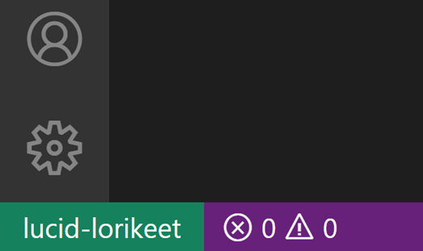

# 원격 터널을 이용한 개발 {#developing-with-remote-tunnels}

Visual Studio Code [Remote - Tunnels](https://marketplace.visualstudio.com/items?itemName=ms-vscode.remote-server) 확장을 사용하면 데스크탑 PC나 가상 머신(VM)과 같은 원격 머신에 안전한 터널을 통해 연결할 수 있습니다. SSH 없이도 VS Code 클라이언트에서 언제 어디서나 해당 머신에 연결할 수 있습니다.

터널링은 [Microsoft dev tunnels](https://learn.microsoft.com/azure/developer/dev-tunnels/overview)를 통해 한 네트워크에서 다른 네트워크로 데이터를 안전하게 전송합니다.

이로 인해 소스 코드가 VS Code 클라이언트 머신에 있을 필요가 없어지며, 확장은 원격 머신에서 직접 명령과 다른 확장을 실행합니다. 이 확장은 원격 OS에 VS Code Server를 설치하며, 이 서버는 원격 OS에 이미 설치된 VS Code와는 독립적입니다.


VS Code는 **코드가 호스팅되는 위치에 관계없이** **로컬 품질의 개발 경험**을 제공할 수 있습니다. 여기에는 전체 IntelliSense(완성), 코드 탐색 및 디버깅이 포함됩니다.

<iframe width="560" height="315" src="https://www.youtube-nocookie.com/embed/SyLHXdXhE1U?si=J8ndBzVB0RPEsB7R" title="VS Code로 어디서나 컴퓨터에 접근하기" frameborder="0" allow="accelerometer; autoplay; clipboard-write; encrypted-media; gyroscope; picture-in-picture" allowfullscreen></iframe>

## 시작하기 {#getting-started}

터널을 작업하는 두 가지 경로가 있습니다:

* `code` [명령줄 인터페이스(CLI)](/docs/editor/command-line.md#create-remote-tunnel)의 `tunnel` 명령을 실행합니다.
* VS Code 데스크탑 UI를 통해 터널링을 활성화합니다.

이 두 경로 모두 동일한 터널링 기능을 제공합니다. 자신에게 가장 적합한 도구를 사용할 수 있습니다. CLI는 원격 머신에 전체 VS Code 데스크탑을 설치할 수 없는 경우에 좋은 옵션입니다. VS Code 데스크탑 UI를 사용하는 것은 이미 VS Code에서 작업을 하고 있는 경우 편리하며, 현재 머신에 대해 터널링을 활성화할 수 있습니다.

아래 섹션에서 두 경로를 설명하겠습니다.

## 'code' CLI 사용하기 {#using-the-code-cli}

`code` [CLI](/docs/editor/command-line.md)를 통해 터널을 생성하고 사용할 수 있습니다.

1. VS Code 클라이언트에서 개발할 원격 머신에 `code` CLI를 설치합니다. CLI는 VS Code 클라이언트와 원격 머신 간에 터널을 설정합니다. CLI는 VS Code 데스크탑에 자동으로 내장되어 있으며, 추가 설정이 필요하지 않습니다.

    ### 대체 다운로드

    또는 [독립형 설치](https://code.visualstudio.com/#alt-downloads)를 통해 CLI를 다운로드할 수 있으며, 이는 VS Code 데스크탑 설치와는 별개입니다:

    

    원격 머신의 터미널을 통해 CLI를 설치하고 압축을 풀 수도 있습니다. 이는 원격 머신에 UI가 없는 경우 특히 유용할 수 있습니다:

    ```bash
    curl -Lk 'https://code.visualstudio.com/sha/download?build=stable&os=cli-alpine-x64' --output vscode_cli.tar.gz

    tar -xf vscode_cli.tar.gz
    ```

    > **참고:** 독립형 또는 터미널 설치를 사용하는 경우, 다음 섹션의 명령은 `code` 대신 `./code`로 시작합니다.

2. `tunnel` 명령으로 안전한 터널을 생성합니다:

    ```bash
    code tunnel
    ```

    이 명령은 이 머신에서 VS Code Server를 다운로드하고 시작한 다음, 이에 대한 터널을 생성합니다.

    >**참고:** 머신에서 터널을 처음 시작할 때 서버 라이센스 약관에 동의하라는 메시지가 표시됩니다. 프롬프트를 피하려면 명령줄에 `--accept-server-license-terms`를 전달할 수 있습니다.

3. 이 CLI는 원격 머신에 연결된 vscode.dev URL을 출력합니다. 예: `https://vscode.dev/tunnel/<machine_name>/<folder_name>`입니다. 이 URL을 원하는 클라이언트에서 열 수 있습니다.

4. 클라이언트에서 vscode.dev URL을 처음 열 때, `https://github.com/login/oauth/authorize...` URL에서 GitHub 계정에 로그인하라는 메시지가 표시됩니다. 이는 터널링 서비스에 대한 인증을 통해 올바른 원격 머신에 접근할 수 있도록 합니다.

## VS Code UI 사용하기 {#using-the-vs-code-ui}

1. 터널 액세스를 활성화할 원격 머신에서 VS Code를 엽니다.

2. VS Code 계정 메뉴에서 **원격 터널 액세스 켜기** 옵션을 선택합니다. 아래 이미지에서 보여주는 것처럼, VS Code에서 명령 팔레트(`kbstyle(F1)`)를 열고 **Remote Tunnels: Turn on Remote Tunnel Access...** 명령을 실행할 수도 있습니다.

    

3. GitHub에 로그인하라는 메시지가 표시됩니다. 로그인하면 현재 머신에서 터널이 시작되고, 이 머신에 원격으로 연결할 수 있습니다.

    

4. 원하는 클라이언트에서 위 알림의 vscode.dev 링크를 열고 코딩을 시작할 수 있습니다!

>**참고:** 원격 머신은 VS Code가 실행되는 동안에만 터널을 통해 접근할 수 있습니다. VS Code를 종료하면 다시 VS Code를 시작하거나 `code tunnel` CLI 명령을 실행할 때까지 터널링할 수 없습니다.

## 원격 터널 확장 {#remote-tunnels-extension}

`code` CLI 또는 VS Code UI를 통해 여는 vscode.dev 인스턴스는 Remote - Tunnels 확장이 사전 설치되어 있습니다.

이미 VS Code(데스크탑 또는 웹)에서 작업 중이고 원격 터널에 연결하고 싶다면, [Remote - Tunnels](https://marketplace.visualstudio.com/items?itemName=ms-vscode.remote-server) 확장을 직접 설치하고 사용할 수 있습니다. 확장을 설치한 후, 명령 팔레트(`kbstyle(F1)`)를 열고 **Remote Tunnels: Connect to Tunnel** 명령을 실행하면 활성 터널이 있는 모든 원격 머신에 연결할 수 있습니다.

또한 원격 탐색기에서 원격 머신을 볼 수 있으며, 명령 **Remote Explorer: Focus on Remote View**를 통해 포커스를 맞출 수 있습니다:


다른 원격 개발 확장과 마찬가지로, 원격 머신의 이름은 왼쪽 하단의 녹색 원격 표시기에 나열됩니다. 이 표시기를 클릭하면 원격 터널 명령을 탐색할 수 있으며, 원격 연결을 종료하거나 VS Code 데스크탑을 설치하는 옵션도 있습니다.



### 컨테이너 내 원격 터널 호스트에서 폴더 열기 {#open-a-folder-on-a-remote-tunnels-host-in-a-container}

Remote - Tunnels 및 [Dev Containers](/docs/devcontainers/containers.md) 확장을 함께 사용하여 원격 호스트의 폴더를 컨테이너 내에서 열 수 있습니다. 로컬에 Docker 클라이언트를 설치할 필요도 없습니다.

이를 위해:

1. 원격 호스트에 Docker를 설치하고 VS Code 및 Dev Containers 확장을 로컬에 설치하는 [설치](https://docs/devcontainers/containers.md#installation) 단계를 따릅니다.
1. 터널을 설정하고 연결하여 그곳에서 폴더를 여는 Remote - Tunnels 확장의 [시작하기](#getting-started) 지침을 따릅니다.
1. 명령 팔레트(`kbstyle(F1)`, `kb(workbench.action.showCommands)`)에서 **Dev Containers: Reopen in Container** 명령을 사용합니다.

나머지 [Dev Containers 빠른 시작](/docs/devcontainers/containers.md#quick-start-open-an-existing-folder-in-a-container) 지침은 그대로 적용됩니다. [Dev Containers 확장 문서](/docs/devcontainers/containers.md)에서 더 많은 정보를 확인할 수 있으며, 이 모델이 필요에 맞지 않는 경우 [원격 Docker 호스트에서 개발하기](/remote/advancedcontainers/develop-remote-host.md) 기사를 참조할 수 있습니다.

## 자주 묻는 질문 {#common-questions}

### 원격 터널, VS Code Server 및 원격 개발 간의 관계는 무엇인가요? {#what-is-the-relationship-between-the-remote-tunnels-vs-code-server-and-remote-development}

Visual Studio Code [원격 개발](/docs/remote/remote-overview.md)은 컨테이너, 원격 머신 또는 Windows Subsystem for Linux(WSL)를 완전한 기능을 갖춘 개발 환경으로 사용할 수 있게 해줍니다.

원격 개발은 로컬 VS Code 설치가 다른 머신(가상 또는 물리적)의 소스 코드 및 런타임 환경과 투명하게 상호작용할 수 있도록 하며, 특정 명령의 실행을 "원격 서버"인 VS Code Server로 이동합니다. VS Code Server는 원격 엔드포인트에 연결할 때 VS Code에 의해 신속하게 설치되며, 원격 작업 공간, 머신 및 파일 시스템과 직접 상호작용하는 확장을 호스팅할 수 있습니다.

이 VS Code Server 백엔드 구성 요소는 원격 개발 확장에 의해 단독으로 설치되고 관리되는 것이 아니라, 사용자가 직접 실행할 수 있는 서비스로 출시되었습니다. 이에 대한 자세한 내용은 [문서](/docs/remote/vscode-server.md)를 참조하세요.

VS Code Server에 접근하는 데는 몇 가지 구성 요소가 포함됩니다:

* VS Code Server: VS Code의 원격 경험을 가능하게 하는 백엔드 서버입니다.
* Remote - Tunnels 확장: 원격 머신에 연결을 용이하게 하는 확장으로, 서버 인스턴스가 실행되고 있습니다.

### 확장 작성자로서 무엇을 해야 하나요? {#as-an-extension-author-what-do-i-need-to-do}

VS Code 확장 API는 로컬/원격 세부 사항을 추상화하므로 대부분의 확장은 수정 없이 작동합니다. 그러나 확장이 원하는 모든 노드 모듈이나 런타임을 사용할 수 있기 때문에 조정이 필요할 수 있는 상황이 있습니다. 확장을 테스트하여 업데이트가 필요하지 않은지 확인하는 것이 좋습니다. 자세한 내용은 [원격 개발 지원](/api/advanced-topics/remote-extensions.md)을 참조하세요.

### 여러 사용자 또는 클라이언트가 동시에 동일한 원격 인스턴스에 접근할 수 있나요? {#can-multiple-users-or-clients-access-the-same-remote-instance-simultaneously}

아니요, 서버의 인스턴스는 한 사용자 또는 클라이언트가 한 번에 접근할 수 있도록 설계되었습니다.

### 터널이나 머신을 제거하려면 어떻게 하나요? {#how-do-i-remove-a-tunnel-or-machine}

CLI를 통해 실행 중인 터널을 중지하려면 `kbstyle(Ctrl + C)`를 사용하여 활성 터널을 종료할 수 있습니다. VS Code UI를 통해 터널링을 활성화한 경우, VS Code에서 **Remote Tunnels: Turn off Remote Tunnel Access...** 명령을 실행할 수 있습니다.

해당 머신에서 `code tunnel unregister`를 실행하여 머신의 터널링과의 연관성을 제거할 수 있습니다. 또한 VS Code 클라이언트를 열고 원격 탐색기 보기를 선택한 후, 제거할 머신을 마우스 오른쪽 버튼으로 클릭하고 **unregister**를 선택할 수 있습니다.

### 터널은 어떻게 보안이 유지되나요? {#how-are-tunnels-secured}

터널을 호스팅하고 연결하려면 각 끝에서 동일한 GitHub 또는 Microsoft 계정으로 인증이 필요합니다. 두 경우 모두 VS Code는 Azure에 호스팅된 서비스에 아웃바운드 연결을 수행합니다. 일반적으로 방화벽 변경이 필요하지 않으며, VS Code는 네트워크 리스너를 설정하지 않습니다.

원격 VS Code 인스턴스에서 연결하면 터널을 통해 SSH 연결이 생성되어 종단 간 암호화를 제공합니다. 현재 이 암호화에 대한 선호 암호는 CTR 모드의 AES 256이며, 이를 구현하는 코드는 [오픈 소스](https://github.com/microsoft/dev-tunnels)입니다.

기본 dev tunnels 서비스의 보안에 대한 자세한 내용은 [문서](https://learn.microsoft.com/azure/developer/dev-tunnels/security)를 참조하세요.

### 터널링 서비스에 사용 제한이 있나요? {#are-there-usage-limits-for-the-tunneling-service}

기본 터널링 서비스의 남용을 방지하기 위해 터널 수 및 대역폭과 같은 리소스에 대한 사용 제한이 있습니다. 대부분의 사용자는 이러한 제한에 도달하지 않을 것으로 예상합니다.

예를 들어, 현재 계정에 대해 10개의 터널을 등록할 수 있습니다. 새 터널을 생성하려고 할 때 이미 10개의 터널이 등록되어 있다면, CLI는 사용되지 않는 터널을 무작위로 선택하여 삭제합니다. 이 제한은 변경될 수 있습니다.

제한에 도달하고 더 많은 사용량에 대해 논의하고 싶다면, 귀하의 시나리오와 필요한 사용량에 대한 정보를 포함하여 `vscodeserver@microsoft.com`으로 연락해 주시면 감사하겠습니다.

### 조직 전체에서 정책을 구성할 수 있나요? {#can-i-configure-policies-across-my-organization}

포트 포워딩에 대한 접근을 제어하고자 하는 조직의 일원이라면, `global.rel.tunnels.api.visualstudio.com` 도메인에 대한 접근을 허용하거나 거부하여 이를 수행할 수 있습니다.

Windows 장치를 사용하는 사용자에게는 dev tunnels에 대한 그룹 정책 설정을 구성하고 배포할 수 있습니다. 자세한 내용은 [dev tunnels 문서](https://learn.microsoft.com/azure/developer/dev-tunnels/policies)를 참조하세요.

### 터널을 계속 실행하려면 어떻게 해야 하나요? {#how-can-i-ensure-i-keep-my-tunnel-running}

몇 가지 옵션이 있습니다:

* `service` 명령을 사용하여 서비스로 실행합니다. `code tunnel service install` 및 `code tunnel service uninstall`을 사용하여 설치 및 제거할 수 있습니다.
* `no-sleep` 옵션인 `code tunnel --no-sleep`를 사용하여 원격 머신이 잠자기 상태로 들어가지 않도록 합니다.

[`code` CLI 문서](/docs/editor/command-line.md#create-remote-tunnel)에서 모든 가능한 CLI 명령 및 옵션을 `code tunnel --help`를 통해 탐색할 수 있습니다.

### 터널링 중에 다른 원격 개발 확장이나 dev 컨테이너를 사용할 수 있나요? {#can-i-use-other-remote-development-extensions-or-a-dev-container-while-im-tunneling}

네! 현재 Remote - Tunnels를 통해 [WSL](/docs/remote/wsl.md) 및 [dev 컨테이너](/docs/devcontainers/containers.md#open-a-folder-on-a-remote-tunnel-host-in-a-container)에 연결할 수 있습니다.