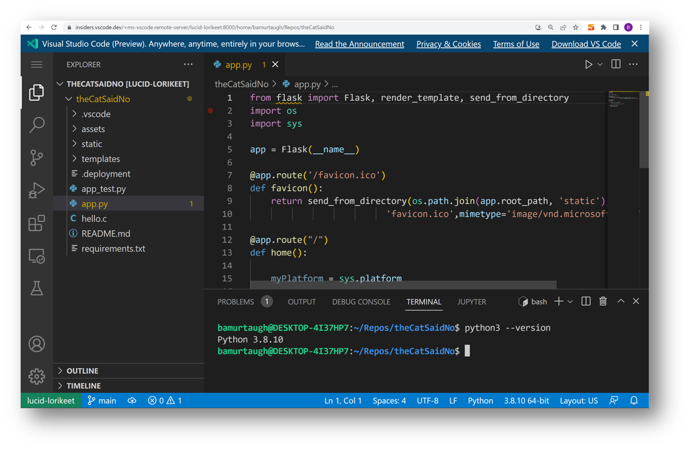

# Visual Studio Code Server {#visual-studio-code-server}

Visual Studio Code Server는 데스크탑 PC나 가상 머신(VM)과 같은 원격 개발 머신에서 실행할 수 있는 서비스입니다. 이를 통해 SSH 없이도 로컬 VS Code 클라이언트를 통해 어디서든 안전하게 원격 머신에 연결할 수 있습니다.

## VS Code Server란 무엇인가요? {#what-is-the-vs-code-server}

VS Code에서는 사용자가 가장 생산적인 환경을 원활하게 활용할 수 있도록 하고자 합니다. [VS Code Remote Development 확장](/docs/remote/remote-overview.md)을 사용하면 Windows Subsystem for Linux(WSL), SSH를 통한 원격 머신, 그리고 VS Code에서 직접 개발 컨테이너에서 작업할 수 있습니다. 이러한 확장은 원격 환경에 서버를 설치하여 로컬 VS Code가 원격 소스 코드 및 런타임과 원활하게 상호작용할 수 있도록 합니다.

이제 우리는 원격 확장에서 사용되는 동일한 기본 서버를 기반으로 한 독립형 "VS Code Server"를 제공하며, 대화형 CLI 및 vscode.dev에 대한 안전한 연결을 지원하는 등의 추가 기능을 포함하고 있습니다.



## 아키텍처 {#architecture}

우리는 편집기를 사용하는 방식에 관계없이 통합된 VS Code 경험을 제공하고자 합니다. 로컬이든 원격이든, 데스크탑이든 브라우저에서든 상관없이 말이죠.

VS Code Server에 대한 접근은 기존의 [`code` CLI](/docs/editor/command-line.md#launching-from-command-line)에 내장되어 있습니다.

CLI는 VS Code 클라이언트와 원격 머신 간에 터널을 설정합니다. 터널링은 데이터를 한 네트워크에서 다른 네트워크로 안전하게 전송합니다.


VS Code Server 경험에는 몇 가지 구성 요소가 포함됩니다:

* VS Code Server: VS Code의 원격 경험을 가능하게 하는 백엔드 서버입니다.
* [Remote - Tunnels 확장](/docs/remote/tunnels.md): 로컬 VS Code 클라이언트에서 자동으로 로드되며, 원격 머신에 대한 연결을 용이하게 합니다.

## 시나리오 {#scenarios}

VS Code Server를 사용하면 다음과 같은 새로운 방식으로 VS Code를 사용할 수 있습니다:

* SSH 지원이 제한되거나 웹 기반 접근이 필요한 원격 머신에서 개발하기.
* VS Code 데스크탑 설치를 지원하지 않는 머신(예: iPad/태블릿 또는 Chromebook)에서 개발하기.
* 모든 코드가 브라우저 샌드박스에서 실행될 수 있는 클라이언트 측 보안 이점을 경험하기.

## 시작하기 {#getting-started}

터널링을 활성화하기 위해 두 가지 경로 중에서 선택할 수 있으며, 각 경로에 대한 자세한 내용은 해당 문서에서 확인할 수 있습니다:

* [`code` CLI에서 `tunnel` 명령 실행하기](/docs/remote/tunnels.md#using-the-code-cli)
* [VS Code UI를 통해 터널링 활성화하기](/docs/remote/tunnels.md#using-the-vs-code-ui)

## 시도해볼 사항 {#things-to-try}

### 라이센스 및 기타 명령 {#licensing-and-other-commands}

VS Code Server를 처음 실행하면 라이센스 조건에 대한 안내가 표시됩니다. VS Code Server의 라이센스는 [여기](https://aka.ms/vscode-server-license)에서 확인할 수 있습니다.

```bash
* Visual Studio Code Server
*
* 소프트웨어를 사용함으로써 귀하는
* Visual Studio Code Server 라이센스 조건(https://aka.ms/vscode-server-license) 및
* Microsoft 개인정보 보호 성명(https://privacy.microsoft.com/en-US/privacystatement)에 동의합니다.
```

`code -h`를 실행하여 CLI의 다른 명령을 탐색할 수 있으며, `code tunnel -help`를 실행하여 터널링 명령을 확인할 수 있습니다:


### 확장 명령 {#extension-commands}

CLI와 마찬가지로, VS Code Remote Tunnels 확장에도 추가 명령이 있으며, VS Code에서 명령 팔레트(`F1`)를 열고 **Remote Tunnels**를 입력하여 탐색할 수 있습니다. [Remote Tunnels 문서](/docs/remote/tunnels.md)에서 더 많은 정보를 확인할 수 있습니다.

## 원격 데이터 수집 {#telemetry}

원격 데이터 수집을 비활성화하려면 VS Code Server를 실행할 때 `--disable-telemetry`를 전달할 수 있습니다: `code tunnel --disable-telemetry`. 또는 오류만 수집하는 등의 초기 데이터 수집 수준을 지정하려면 `--telemetry-level` 뒤에 수준(예: `error`)을 전달할 수 있습니다.

CLI를 통해 데이터 수집이 비활성화되지 않은 경우, VS Code Server는 성공적으로 연결된 후 클라이언트 데이터 수집 설정(vscode.dev 또는 데스크탑의 데이터 수집 설정)을 존중하기 시작합니다.

## 자주 묻는 질문 {#common-questions}

### VS Code Server는 여러 사용자가 동일한 원격 인스턴스에 접근하도록 설계되었나요? {#is-the-vs-code-server-designed-for-multiple-users-to-access-the-same-remote-instance}

아니요, 서버의 인스턴스는 단일 사용자가 접근하도록 설계되었습니다.

### VS Code Server를 서비스로 호스팅할 수 있나요? {#can-i-host-the-vs-code-server-as-a-service}

아니요, [VS Code Server 라이센스](https://aka.ms/vscode-server-license)에서 명시된 바와 같이 서비스로 호스팅하는 것은 허용되지 않습니다.

### VS Code Server가 사용하는 엔드포인트 목록이 있나요? {#is-there-a-list-of-endpoints-the-vs-code-server-uses}

제한된 환경에서 작업하는 경우, VS Code Server가 다음 기사에 나열된 엔드포인트에 접근할 수 있도록 해야 할 수 있습니다:

* [https://code.visualstudio.com/docs/setup/network#_common-hostnames](https://code.visualstudio.com/docs/setup/network#_common-hostnames)
* [https://code.visualstudio.com/docs/remote/ssh#_what-are-the-connectivity-requirements-for-the-vs-code-server-when-it-is-running-on-a-remote-machine-vm](https://code.visualstudio.com/docs/remote/ssh#_what-are-the-connectivity-requirements-for-the-vs-code-server-when-it-is-running-on-a-remote-machine-vm)

### 다른 확장 제한 사항이 있나요? {#are-there-any-other-extension-limitations}

순수 UI 확장은 웹 기반 VS Code 인스턴스를 사용할 때 지원되지 않으며, 이에 대한 자세한 내용은 확장 작성자를 위한 [원격 개발](/api/advanced-topics/remote-extensions.md#architecture-and-extension-kinds) 가이드를 참조하세요.

### 브라우저 제한 사항이 있나요? {#are-there-browser-limitations}

브라우저에서 작업할 때는 특정 제한 사항 및 구성 단계를 고려해야 합니다. 이에 대한 자세한 내용은 [웹용 VS Code](/docs/editor/vscode-web.md#additional-browser-setup) 문서에서 확인할 수 있습니다.

### VS Code Server를 최신 상태로 유지하려면 어떻게 해야 하나요? {#how-can-i-keep-the-vs-code-server-up-to-date}

원격 머신에 연결할 때 업데이트가 가능한 경우 VS Code에서 알림을 받게 되며, 이 알림을 통해 직접 업데이트할 수 있습니다.

### 키링 저장소에 대한 오류가 발생했습니다. 어떻게 해야 하나요? {#i-see-an-error-about-keyring-storage-what-should-i-do}

설정 동기화는 설정 동기화 서버에 대한 인증이 필요합니다. 해당 비밀은 서버에 지속적으로 저장됩니다. 이를 위해 서버에 키링을 설정해야 합니다. 키링이 설정되지 않은 경우, VS Code Server는 서버에 저장된 메모리 내 비밀로 대체됩니다. 이 경우 비밀은 서버의 수명 동안만 지속됩니다.

[이 문제](https://github.com/microsoft/vscode-remote-release/issues/8628)는 더 많은 맥락을 제공하며 문제 해결에 도움이 될 수 있습니다. 여전히 문제가 발생하는 경우, [VS Code Remote GitHub 리포지토리](https://github.com/microsoft/vscode-remote-release/issues)에 새로운 문제를 제기해 주시기 바랍니다.

### 피드백을 제공하거나 문제를 보고하려면 어디로 가야 하나요? {#where-can-i-provide-feedback-or-report-an-issue}

문제가 있거나 피드백이 있는 경우, [VS Code Remote GitHub 리포지토리](https://github.com/microsoft/vscode-remote-release/issues)에 문제를 제기해 주시기 바랍니다. 문제를 제기할 때는 자세한 로그를 포함해 주시기 바라며, 이는 `-v` 플래그로 VS Code Server를 실행하여 활성화할 수 있습니다: `code -v tunnel`.

VS Code Server 문제에 대해서는 [`code-server` 레이블](https://github.com/microsoft/vscode-remote-release/issues?q=is%3Aissue+is%3Aopen+label%3Acode-server)로 필터링할 수 있습니다.