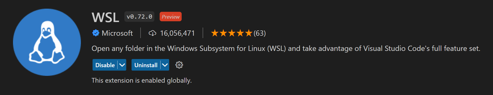
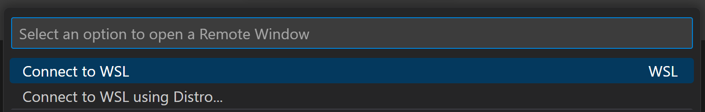
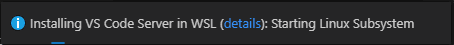
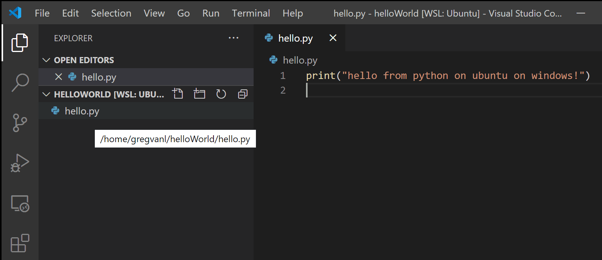
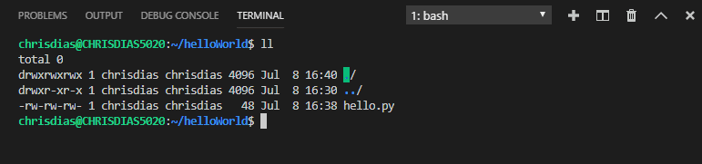
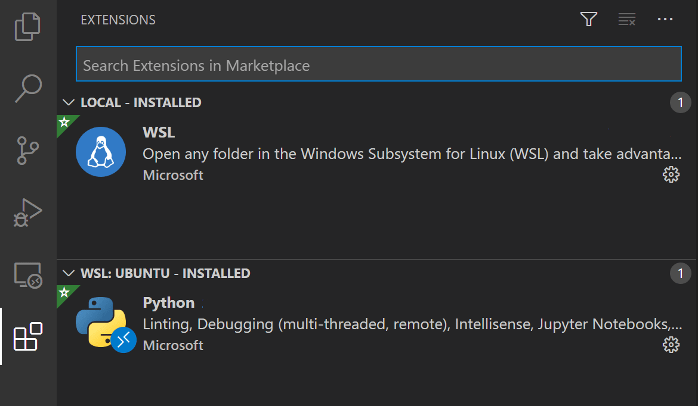

# WSL에서 원격 개발하기 {#remote-development-in-wsl}

이 튜토리얼은 [Windows Subsystem for Linux](https://learn.microsoft.com/windows/wsl/install) (WSL)를 활성화하고 [WSL](https://marketplace.visualstudio.com/items?itemName=ms-vscode-remote.remote-wsl) 확장을 사용하여 WSL에서 Visual Studio Code를 실행하는 방법을 안내합니다.

## 필수 조건 {#prerequisites}

[Visual Studio Code](https://code.visualstudio.com/)가 설치되어 있어야 합니다.

### 확장 프로그램 설치하기 {#install-the-extension}

WSL 확장 프로그램은 Windows Subsystem for Linux (WSL) 내에서 Visual Studio Code를 실행할 수 있게 해줍니다.

- [WSL 확장 프로그램 설치하기](vscode:extension/ms-vscode-remote.remote-wsl)



### 필수 조건 확인 {#prerequisite-check}

WSL 확장이 설치되면 가장 왼쪽에 새로운 상태 표시줄 항목이 나타납니다.


원격 상태 표시줄 항목은 VS Code가 실행 중인 컨텍스트(로컬 또는 원격)를 빠르게 보여주며, 해당 항목을 클릭하면 WSL 확장 명령이 표시됩니다.



## WSL 활성화하기 {#enable-wsl}

Windows Subsystem for Linux (WSL)는 Windows 10의 선택적 기능입니다. Windows 기능 대화상자 또는 PowerShell을 통해 활성화할 수 있습니다.

### Windows 기능 대화상자 {#windows-features-dialog}

Windows 검색창에 'features'를 입력하여 **Turn Windows Features on and off** 대화상자를 엽니다. 아래로 스크롤하여 **Windows Subsystem for Linux**를 체크합니다.


**확인**을 선택하면 Windows를 재시작하라는 메시지가 표시됩니다.

### PowerShell {#powershell}

원하는 경우, 관리자 권한으로 PowerShell을 열고 다음을 입력할 수 있습니다:

```powershell
Enable-WindowsOptionalFeature -Online -FeatureName Microsoft-Windows-Subsystem-Linux
```

명령이 실행된 후, Windows를 재시작하라는 메시지가 표시됩니다.


### WSL 확인하기 {#check-wsl}

Windows를 재시작한 후, 명령 프롬프트를 열고 'wsl'을 입력하여 WSL이 활성화되었는지 확인할 수 있습니다.


WSL이 활성화되었지만, 아직 Linux 배포판을 설치하지 않았습니다.

## Linux 배포판 설치하기 {#install-a-linux-distro}

WSL용 Linux 배포판은 Microsoft Store에서 설치합니다. 스토어 앱을 사용하거나 Windows 검색창에서 Linux 배포판을 검색할 수 있습니다. 설치할 Linux 배포판(예: Ubuntu)을 선택하고 안내에 따라 진행합니다.


**설치**를 선택합니다.


설치가 완료되면 **실행**을 선택하여 시작합니다. 이렇게 하면 Linux 터미널이 열리고 설치가 완료됩니다. 전체 Linux 인스턴스를 설정하고 있으므로 사용자 ID와 비밀번호를 생성해야 합니다. 이제 Windows에서 Linux를 실행하고 있습니다.


## Python 개발 {#python-development}

Python이 아직 설치되어 있지 않다면, 다음 명령을 실행하여 Python3와 Python의 패키지 관리자 pip를 Linux 설치에 설치합니다.

```bash
sudo apt update
sudo apt install python3 python3-pip
```

확인을 위해 다음을 실행합니다:

```bash
python3 --version
```

전형적인 "Hello World" 앱으로 시작합니다. "helloWorld"라는 새 폴더를 만들고 실행 시 메시지를 출력하는 Python 파일을 추가합니다:

```bash
mkdir helloWorld && cd helloWorld
echo 'print("hello from python on ubuntu on windows!")' >> hello.py
python3 hello.py
```

원격 Linux 환경(이 WSL 배포판은 기술적으로 UI가 없는 다른 머신으로, 단지 로컬 컴퓨터에서 실행되고 있습니다)에서는 개발 도구와 경험이 상당히 제한적입니다. 파일을 편집하기 위해 터미널에서 [Vim](https://stackoverflow.blog/2017/05/23/stack-overflow-helping-one-million-developers-exit-vim/)을 실행하거나 `\\wsl$` 마운트를 통해 Windows 측에서 소스를 편집할 수 있습니다:


이 모델의 문제는 Python 런타임, pip 또는 어떤 conda 패키지도 Windows에 설치되어 있지 않다는 것입니다.


Python은 Linux 배포판에 설치되어 있으므로, Windows 측에서 Python 파일을 편집하는 경우 동일한 Python 개발 스택을 Windows에 설치하지 않는 한 실행하거나 디버깅할 수 없습니다. 이는 모든 Python 도구와 런타임이 설정된 격리된 Linux 인스턴스를 갖는 목적을 무색하게 만듭니다!

## WSL에서 실행하기 {#run-in-wsl}

WSL 터미널에서 helloWorld 폴더에 있는지 확인하고 `'code .'`를 입력하여 Visual Studio Code를 실행합니다. `'.'` 인자는 VS Code에 현재 폴더를 열도록 지시합니다. [Insiders](/insiders) 버전의 VS Code를 사용하는 경우, 대신 `'code-insiders .'`를 실행해야 합니다.

:::note
이 명령이 작동하지 않으면 터미널을 재시작해야 하거나 설치할 때 VS Code를 경로에 추가하지 않았을 수 있습니다.
:::


가장 먼저 "VS Code 서버 설치 중"에 대한 메시지가 표시됩니다(숫자 c7d83e57…는 방금 설치한 클라이언트 측 도구와 일치하는 VS Code 서버의 버전입니다). VS Code는 Linux 측에 작은 서버를 설치하고, 데스크톱 VS Code가 이 서버와 통신합니다. 그 서버는 WSL에서 확장을 설치하고 호스팅하여 WSL에 설치된 도구와 프레임워크의 컨텍스트에서 실행되도록 합니다. 즉, 언어 확장은 WSL에 설치된 도구와 프레임워크에 대해 실행되며, Windows 측에 설치된 것에 대해 실행되지 않습니다. 이는 적절한 개발 경험을 위해 필요합니다.

다음으로 VS Code가 시작되고 `helloWorld` 폴더가 열립니다. VS Code가 WSL에 연결 중이라는 빠른 알림이 표시될 수 있으며, Node.js 기반 서버에 대한 액세스를 허용하라는 메시지가 표시될 수 있습니다.



이제 `hello.py` 위에 마우스를 올리면 올바른 Linux 경로가 표시됩니다.



### 통합 터미널 {#integrated-terminal}

**Terminal** > **New Terminal** (`kb(workbench.action.terminal.toggleTerminal)`)을 실행하여 새 터미널 인스턴스를 엽니다.



WSL에서 bash 셸의 새 인스턴스가 시작되며, 다시 Windows에서 실행되는 VS Code에서 시작됩니다.

:::tip
상태 표시줄의 왼쪽 하단에서 **WSL: Ubuntu** 인스턴스에 연결되어 있음을 확인할 수 있습니다.
:::


## 편집 및 디버깅 {#edit-and-debug}

### Python 확장(및 추가 도구) 설치하기 {#installing-the-python-extension-and-additional-tools}

`hello.py`를 클릭하여 편집을 위해 엽니다. 이 경우 [Microsoft Python](https://marketplace.visualstudio.com/items?itemName=ms-python.python) 확장을 설치하라는 확장 추천 메시지가 표시됩니다. 이 확장은 풍부한 편집 및 디버깅 경험을 제공합니다. **설치**를 선택하고 요청 시 다시 로드합니다.


확장이 WSL에 설치되었는지 확인하기 위해 확장 보기(`kb(workbench.view.extensions)`)를 다시 엽니다. **WSL: Ubuntu – Installed**이라는 섹션이 표시되며, WSL 측에 설치된 확장을 확인할 수 있습니다.



다시 로드하면 pylint 린터가 설치되지 않았다는 알림이 표시됩니다. 린터는 소스 코드의 오류와 경고를 표시하는 데 사용됩니다. **설치**를 선택합니다.


이제 코드를 편집하면 다양한 색상 강조와 자동 완성 기능을 사용할 수 있습니다.


파일을 저장할 때(`kb(workbench.action.files.save)`) 파일에 린팅 오류와 경고가 표시됩니다.


### 디버깅 {#debugging}

도구가 설정되었으므로 한 단계 더 나아가 보겠습니다. hello.py의 1행에 중단점을 설정하려면 행 번호 왼쪽의 여백을 클릭하거나 해당 행에 커서를 두고 `kb(editor.debug.action.toggleBreakpoint)`를 누릅니다.


이제 `kb(workbench.action.debug.start)`를 눌러 애플리케이션을 실행합니다. 애플리케이션을 실행하는 방법을 묻는 메시지가 표시되며, 이는 간단한 파일이므로 **Python 파일**을 선택합니다.


앱이 시작되고 중단점에 도달합니다. 변수를 검사하고, 감시를 생성하며, 호출 스택을 탐색할 수 있습니다.

`kb(workbench.action.debug.stepOver)`를 눌러 단계를 진행하면 디버그 콘솔에 print 문 출력이 표시됩니다.


WSL에 설치된 Linux 인스턴스를 사용하여 Visual Studio Code의 전체 개발 경험을 누릴 수 있습니다.

WSL에서 다른 폴더를 열고 싶다면 **File** 메뉴를 열고 **Open Folder**를 선택합니다. Windows 파일 시스템이 아닌 Linux 파일 시스템을 위한 최소한의 파일 및 폴더 탐색기가 표시됩니다.


Windows로 다시 전환하고 싶다면 **Show Local** 옵션을 선택하면 표준 Windows 파일 열기 대화상자가 표시됩니다.

### WSL 연결 종료하기 {#ending-your-wsl-connection}

WSL에서 세션을 종료하고 로컬에서 VS Code를 실행하려면 **File** > **Close Remote Connection**를 선택합니다.

### 축하합니다 {#congratulations}

축하합니다, 이 튜토리얼을 성공적으로 완료하셨습니다!

다음으로 다른 원격 개발 확장을 확인해 보세요.

* [원격 - SSH](https://marketplace.visualstudio.com/items?itemName=ms-vscode-remote.remote-ssh)
* [개발 컨테이너](https://marketplace.visualstudio.com/items?itemName=ms-vscode-remote.remote-containers)

또는 [원격 개발](https://marketplace.visualstudio.com/items?itemName=ms-vscode-remote.vscode-remote-extensionpack) 확장 팩을 설치하여 모두 얻을 수 있습니다.
