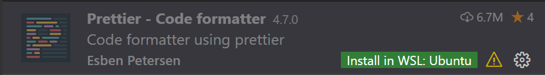

# WSL에서 개발하기 {#developing-in-wsl}

**Visual Studio Code WSL** 확장 기능을 사용하면 [Windows Subsystem for Linux (WSL)](https://learn.microsoft.com/windows/wsl)을 VS Code에서 전용 개발 환경으로 사용할 수 있습니다. 리눅스 기반 환경에서 개발하고, 리눅스 전용 툴 체인과 유틸리티를 사용하며, 리눅스 기반 애플리케이션을 Windows의 편안함 속에서 실행하고 디버깅할 수 있습니다.

이 확장은 WSL에서 직접 명령과 다른 확장을 실행하므로, 경로 문제, 이진 호환성 또는 기타 OS 간 문제에 대해 걱정하지 않고 WSL 또는 마운트된 Windows 파일 시스템(예: `/mnt/c`)에 있는 파일을 편집할 수 있습니다. 이 확장은 WSL 내부에 VS Code 서버를 설치하며, 이 서버는 WSL 내의 기존 VS Code 설치와 독립적입니다.


이로 인해 VS Code는 **로컬 품질의 개발 경험**을 제공할 수 있습니다. 전체 IntelliSense, 코드 탐색 및 디버깅을 포함하여, **코드가 호스팅되는 위치와 관계없이** 가능합니다.

## 시작하기 {#getting-started}

:::note
이 주제를 검토한 후, 소개용 [WSL 튜토리얼](/docs/remote/wsl-tutorial.md)을 통해 시작할 수 있습니다.
:::

### 설치 {#installation}

시작하려면 다음을 수행해야 합니다:

1. 선호하는 리눅스 배포판과 함께 [Windows Subsystem for Linux](https://learn.microsoft.com/windows/wsl/install)를 설치합니다.

    :::note
    WSL 1은 특정 유형의 개발에 대해 [알려진 제한 사항](#known-limitations)이 있습니다. 또한, Alpine Linux에 설치된 확장은 확장 내부의 네이티브 소스 코드에서 `glibc` 의존성으로 인해 작동하지 않을 수 있습니다. 자세한 내용은 [원격 개발 및 리눅스](https://aka.ms/vscode-remote/linux) 페이지를 참조하세요.
    :::

2. WSL이 아닌 **Windows**에 [Visual Studio Code](https://code.visualstudio.com/)를 설치합니다.

    :::note
    설치 중 **Select Additional Tasks** 메시지가 표시되면, `code` 명령을 사용하여 WSL에서 폴더를 쉽게 열 수 있도록 **Add to PATH*** 옵션을 선택해야 합니다.
    :::

3. [WSL 확장](https://marketplace.visualstudio.com/items?itemName=ms-vscode-remote.remote-wsl)을 설치합니다. VS Code에서 다른 원격 확장과 함께 작업할 계획이라면, [원격 개발 확장 팩](https://aka.ms/vscode-remote/download/extension)을 설치할 수도 있습니다.

### 원격 폴더 또는 작업 공간 열기 {#open-a-remote-folder-or-workspace}

#### WSL 터미널에서 {#from-the-wsl-terminal}

VS Code에서 Windows Subsystem for Linux 내부의 폴더를 여는 것은 명령 프롬프트나 PowerShell에서 Windows 폴더를 여는 것과 매우 유사합니다.

1. 시작 메뉴 항목을 사용하거나 명령 프롬프트/PowerShell에서 `wsl` 입력하여, **WSL terminal window**을 실행합니다.

2. VS Code에서 열고 싶은 폴더((Windows 파일 시스템 마운트인 `/mnt/c` 포함)로 이동합니다.

3. 터미널에 **`code .`** 를 입력합니다. 처음 이 작업을 수행할 때, VS Code가 WSL에서 실행하는 데 필요한 구성 요소를 가져오는 것을 볼 수 있습니다. 이 작업은 잠시 걸리며, 한 번만 필요합니다.

    :::note
    이 명령이 작동하지 않으면 터미널을 다시 시작해야 하거나 설치할 때 VS Code를 경로에 추가하지 않았을 수 있습니다.
    :::

4. 잠시 후, 새로운 VS Code 창이 나타나고 WSL에서 폴더를 열고 있다는 알림이 표시됩니다.

   

    이제 VS Code는 WSL에서 계속 구성되며 진행 상황을 업데이트합니다.

5. 완료되면, 왼쪽 하단 모서리에 WSL 표시기가 나타나고, VS Code를 정상적으로 사용할 수 있습니다!

    

그게 전부입니다! 이 창에서 수행하는 모든 VS Code 작업은 WSL 환경에서 실행되며, 파일 편집 및 작업, 디버깅, 터미널 사용 등 모든 작업이 포함됩니다.

#### VS Code에서 {#from-vs-code}

또는 VS Code에서 직접 WSL 창을 열 수 있습니다:

1. VS Code를 시작합니다.
2. `kbstyle(F1)`을 눌러 기본 배포판에 대해 **WSL: Connect to WSL**을 선택하거나 특정 배포판에 대해 **WSL: Connect to WSL using Distro**을 선택합니다.
3. 파일 메뉴를 사용하여 폴더를 엽니다.

이미 폴더가 열려 있는 경우, **WSL: Reopen Folder in WSL** 명령을 사용할 수도 있습니다. 어떤 배포판을 사용할지 선택하라는 메시지가 표시됩니다.

WSL 창에 있고 현재 입력을 로컬 창에서 열고 싶다면, **WSL: Reopen in Windows**를 사용하세요.

#### Windows 명령 프롬프트에서 {#from-the-windows-command-prompt}

Windows 프롬프트에서 WSL 창을 직접 열려면 `--remote` 명령 줄 매개변수를 사용합니다:

`code --remote wsl+<배포판 이름> <WSL 내 경로>`

예: `code --remote wsl+Ubuntu /home/jim/projects/c`

입력 경로가 파일인지 폴더인지 추측해야 합니다. 파일 확장이 있으면 파일로 간주됩니다.

폴더가 열리도록 강제하려면 경로에 슬래시를 추가하거나 다음을 사용하세요:

`code --folder-uri vscode-remote://wsl+Ubuntu/home/ubuntu/folder.with.dot`

파일이 열리도록 강제하려면 `--goto`를 추가하거나 다음을 사용하세요:

`code --file-uri vscode-remote://wsl+Ubuntu/home/ubuntu/fileWithoutExtension`

## Git 작업하기 {#working-with-git}

WSL과 Windows에서 동일한 Repository로 작업하는 경우, 일관된 줄 끝을 설정해야 합니다. 자세한 내용은 [팁과 요령](/docs/remote/troubleshooting.md#resolving-git-line-ending-issues-in-wsl-resulting-in-many-modified-files)을 참조하세요.

또한 WSL을 Windows Git 자격 증명 관리자를 사용하도록 구성하여 비밀번호를 피할 수 있습니다. 자세한 내용은 [팁과 요령](/docs/remote/troubleshooting.md#sharing-git-credentials-between-windows-and-wsl)을 참조하세요.

## 확장 프로그램 관리 {#managing-extensions}

VS Code의 확장 프로그램은 두 가지 방식으로 실행됩니다. 로컬(UI/클라이언트 측)에서 실행되거나, WSL 내에서 실행됩니다. 테마나 스니펫처럼 VS Code의 UI에 영향을 미치는 확장 프로그램은 로컬에 설치되지만, 대부분의 확장 프로그램은 WSL 내부에서 실행됩니다.

확장을 확장 화면에서 설치하면 자동으로 올바른 위치에 설치됩니다. 설치 후, 확장이 설치된 위치는 카테고리 그룹화에 따라 알 수 있습니다. **Local - Installed** 카테고리와 WSL용 카테고리가 있습니다.


:::note
확장 작성자이고 확장이 제대로 작동하지 않거나 잘못된 위치에 설치되는 경우, [원격 개발 지원](/api/advanced-topics/remote-extensions.md)을 참조하세요.
:::

실제로 원격에서 실행해야 하는 로컬 확장은 **Local - Installed** 카테고리에서 흐릿하게 표시되고 비활성화됩니다. 원격 호스트에 확장을 설치하려면 **Install**를 선택하세요.



또한 확장 화면로 가서 **Install Local Extensions in WSL: \{Name\}** 을 선택하여 모든 로컬 설치된 확장을 WSL 내부에 설치할 수 있습니다. 이렇게 하면 드롭다운이 표시되어 WSL 인스턴스에 설치할 로컬 설치된 확장을 선택할 수 있습니다.


## WSL에서 터미널 열기 {#opening-a-terminal-in-wsl}

VS Code에서 WSL의 터미널을 여는 것은 간단합니다. WSL에서 폴더가 열리면, VS Code에서 여는 **모든 터미널 창**(**Terminal > New Terminal**)은 자동으로 로컬이 아닌 WSL에서 실행됩니다.

이 동일한 터미널 창에서 `code` 명령 줄을 사용하여 WSL에서 새 파일이나 폴더를 여는 등의 여러 작업을 수행할 수 있습니다. `code --help`를 입력하여 명령 줄에서 사용할 수 있는 옵션을 확인하세요.


## WSL에서 디버깅 {#debugging-in-wsl}

WSL에서 폴더를 열면, 애플리케이션을 로컬에서 실행할 때와 같은 방식으로 VS Code의 디버거를 사용할 수 있습니다. 예를 들어, `launch.json`에서 실행 구성 요소를 선택하고 디버깅을 시작하면(`kb(workbench.action.debug.start)`), 애플리케이션이 원격 호스트에서 시작되고 디버거가 연결됩니다.

VS Code의 디버깅 기능을 `.vscode/launch.json`에서 구성하는 방법에 대한 자세한 내용은 [디버깅](/docs/editor/debugging.md) 페이지를 참조하세요.

## WSL 특정 설정 {#wsl-specific-settings}

VS Code의 로컬 사용자 설정은 WSL에서 폴더를 열 때 재사용됩니다. 이는 사용자 경험을 일관되게 유지하지만, 로컬 머신과 WSL 간에 일부 설정을 다르게 하고 싶을 수 있습니다. 다행히도 WSL에 연결한 후, **Preferences: Open Remote Settings** 명령을 실행하거나 설정 편집기에서 **Remote** 탭을 선택하여 WSL 특정 설정을 설정할 수 있습니다. 이렇게 하면 WSL에서 폴더를 열 때마다 기존의 로컬 설정을 무시합니다.

## 고급: 환경 설정 스크립트 {#advanced-environment-setup-script}

WSL에서 VS Code 원격이 시작될 때, 셸 시작 스크립트는 실행되지 않습니다. 이는 셸에 맞춰 조정된 시작 스크립트와 관련된 문제를 피하기 위해서입니다. 추가 명령을 실행하거나 환경을 수정하려면 `~/.vscode-server/server-env-setup` (Insiders: `~/.vscode-server-insiders/server-env-setup`)에 설정 스크립트를 작성할 수 있습니다. 스크립트가 존재하면 서버가 시작되기 전에 처리됩니다.

스크립트는 유효한 Bourne 셸 스크립트여야 합니다. 유효하지 않은 스크립트는 서버가 시작되는 것을 방지합니다. 서버가 시작되지 않도록 하는 스크립트가 생기면, 일반 WSL 셸을 사용하여 설정 스크립트를 삭제하거나 이름을 변경해야 합니다.

출력 및 오류를 보려면 WSL 로그(**WSL: Show Log**)를 확인하세요.

## 고급: 컨테이너에서 WSL 2 폴더 열기 {#advanced-opening-a-wsl-2-folder-in-a-container}

WSL 2와 [Docker Desktop의 WSL 2 백엔드](https://docs.docker.com/docker-for-windows/wsl-tech-preview/)를 사용하고 있다면, [Dev Containers](/docs/devcontainers/containers.md) 확장을 사용하여 WSL 내부에 저장된 소스 코드로 작업할 수 있습니다! 다음 단계를 따르세요:

1. 아직 설치하지 않았다면, [Docker Desktop의 WSL 2 지원을 설치하고 설정](https://docs.docker.com/docker-for-windows/wsl-tech-preview/)합니다.

    :::tip
    **Settings > Resources > WSL Integration**으로 가서 사용할 WSL 배포판과 Docker 통합을 활성화합니다.
    :::

2. 아직 설치하지 않았다면, [Dev Containers](https://aka.ms/vscode-remote/download/containers) 확장과 WSL 확장을 설치합니다.

3. 다음으로, [WSL에서 소스 코드 폴더를 열기](#open-a-remote-folder-or-workspace)합니다.

4. WSL에서 폴더가 열리면, 명령 팔레트(`kbstyle(F1)`)에서 **Dev Containers: Reopen in Container**를 선택합니다.

5. 폴더에 `.devcontainer/devcontainer.json` 파일이 없으면, 필터링 가능한 목록이나 기존 [Dockerfile](https://docs.docker.com/engine/reference/builder/) 또는 [Docker Compose 파일](https://docs.docker.com/compose/compose-file/#compose-file-structure-and-examples)에서 시작점을 선택하라는 메시지가 표시됩니다(존재하는 경우).

    

6. VS Code 창(인스턴스)이 다시 로드되고 개발 컨테이너를 빌드하기 시작합니다. 진행 알림이 상태 업데이트를 제공합니다.

    

7. 빌드가 완료되면, VS Code가 자동으로 컨테이너에 연결됩니다. 이제 컨테이너 내부에서 소스 코드로 작업할 수 있습니다.

자세한 내용은 [Dev Containers 문서](/docs/devcontainers/containers.md)를 참조하세요.

## 알려진 제한 사항 {#known-limitations}

이 섹션에는 WSL과 관련된 일반적인 알려진 문제 목록이 포함되어 있습니다. 의도는 문제의 전체 목록을 제공하는 것이 아니라 WSL에서 자주 발생하는 문제를 강조하는 것입니다.

WSL과 관련된 [활성 문제 목록](https://aka.ms/vscode-remote/wsl/issues)을 참조하세요.

### WSL 1에서 열린 작업 공간에서 폴더 이름을 바꾸려고 할 때 EACCES: permission denied 오류가 발생합니다 {#i-see-eacces-permission-denied-error-trying-to-rename-a-folder-in-the-open-workspace-in-wsl-1}

이는 VSCode에서 활성화된 파일 변경 감지 기능으로 인해 발생하는 WSL 파일 시스템 구현의 알려진 문제입니다 ([Microsoft/WSL#3395](https://github.com/microsoft/WSL/issues/3395), [Microsoft/WSL#1956](https://github.com/microsoft/WSL/issues/1956)). 이 문제는 WSL 2에서만 수정될 것입니다.

문제를 피하려면 `remote.WSL.fileWatcher.polling`을 true로 설정하세요. 그러나 폴링 기반 파일 감시는 대규모 작업 공간의 성능에 영향을 미칩니다.

대규모 작업 공간의 경우, 폴링 간격을 늘리고(`remote.WSL.fileWatcher.pollingInterval`) 감시할 폴더를 제어하세요(`setting(files.watcherExclude)`).

[WSL 2](https://learn.microsoft.com/windows/wsl/compare-versions#whats-new-in-wsl-2)에서는 해당 파일 감시자 문제가 없으며 새로운 설정의 영향을 받지 않습니다.

### WSL 1에서 Golang {#golang-in-wsl-1}

| 문제 | 기존 문제 |
|---|---|
Delve 디버거가 WSL에서 작동하지 않음 | [go-delve/delve#810](https://github.com/go-delve/delve/issues/810),  [Microsoft/vscode-go#926](https://github.com/microsoft/vscode-go/issues/926) |

### WSL 1에서 Node.js {#nodejs-in-wsl-1}

| 문제 | 기존 문제 |
|---|---|
NodeJS 오류: spawn EACCES (이 오류의 다양한 변형) | [Microsoft/WSL#3886](https://github.com/microsoft/WSL/issues/3886) |
Webpack HMR 작동하지 않음 | [Microsoft/WSL#2709](https://github.com/microsoft/WSL/issues/2709) |
WSL에서만 Firebase가 비정상적으로 느림 | [Microsoft/WSL#2657](https://github.com/microsoft/WSL/issues/2657) |

### Git 제한 사항 {#git-limitations}

SSH를 사용하여 Git Repository를 복제하고 SSH 키에 비밀번호가 있는 경우, VS Code의 풀 및 동기화 기능이 원격으로 실행될 때 멈출 수 있습니다. 비밀번호가 없는 SSH 키를 사용하거나 HTTPS를 사용하여 복제하거나, 문제를 해결하기 위해 명령 줄에서 `git push`를 실행하세요.

### Docker 확장 프로그램 제한 사항 {#docker-extension-limitations}

Docker 확장은 원격 및 로컬 모두에서 실행할 수 있지만, 이미 로컬에 설치된 경우 원격 SSH 호스트에 설치할 수 없습니다. 이를 해결하기 위해서는 먼저 로컬에서 제거해야 합니다. 이 문제는 향후 VS Code 릴리스에서 해결할 예정입니다.

### 확장 프로그램 제한 사항 {#extension-limitations}

많은 확장이 수정 없이 WSL에서 작동합니다. 그러나 경우에 따라 특정 기능이 변경을 요구할 수 있습니다. 확장 프로그램 문제에 직면한 경우, 문제를 보고할 때 확장 작성자에게 언급할 수 있는 [일반적인 문제 및 해결책 요약](https://docs/remote/troubleshooting.md#extension-tips)을 참조하세요.

또한 Alpine Linux 기반 배포판에서 WSL에 설치된 일부 확장 프로그램은 확장 내부의 네이티브 코드에서 `glibc` 의존성으로 인해 작동하지 않을 수 있습니다. 자세한 내용은 [리눅스와 함께하는 원격 개발](/docs/remote/linux.md) 페이지를 참조하세요.

## 일반적인 질문 {#common-questions}

### 기본 배포판을 변경하라는 메시지가 표시되는 이유는 무엇인가요? {#why-am-i-asked-to-change-the-default-distro}

**WSL: Connect to WSL using Distro**을 사용하고 Windows 10 이전 버전(2019년 5월 업데이트(버전 1903) 이전)에서 실행하는 경우, WSL 명령이 기본 배포판에서만 작동하므로 **기본 배포판**을 전환하라는 메시지가 표시됩니다. `-d` 옵션을 아직 지원하지 않기 때문입니다.

[Wslconfig.exe](https://learn.microsoft.com/windows/wsl/wsl-config)를 사용하여 기본 배포판을 수동으로 전환할 수 있습니다.

예를 들어:

```bat
wslconfig /setdefault Ubuntu
```

설치된 배포판을 보려면:

```bat
wslconfig /l
```

### 누락된 라이브러리 또는 의존성에 대한 오류가 표시됩니다 {#im-seeing-an-error-about-a-missing-library-or-dependency}

일부 확장은 특정 WSL 리눅스 배포판의 기본 설치에서 찾을 수 없는 라이브러리에 의존합니다. 패키지 관리자를 사용하여 리눅스 배포판에 추가 라이브러리를 추가할 수 있습니다. Ubuntu 및 Debian 기반 배포판의 경우, 필요한 라이브러리를 설치하려면 `sudo apt-get install <package>`를 실행하세요. 추가 설치 세부정보는 확장 문서나 언급된 런타임을 확인하세요.

### WSL 확장의 연결 요구 사항은 무엇인가요? {#what-are-the-connectivity-requirements-for-the-wsl-extension}

WSL 확장과 VS Code 서버는 다음에 대한 아웃바운드 HTTPS(포트 443) 연결이 필요합니다:

- `update.code.visualstudio.com`
- `marketplace.visualstudio.com`
- `vscode.blob.core.windows.net`
- `*.vo.msecnd.net` (Azure CDN)
- `*.gallerycdn.vsassets.io` (Azure CDN)

일부 확장(예: C#)은 `download.microsoft.com` 또는 `download.visualstudio.microsoft.com`에서 추가 의존성을 다운로드합니다. 다른 확장([Visual Studio Live Share](https://learn.microsoft.com/visualstudio/liveshare/reference/connectivity#requirements-for-connection-modes))은 추가 연결 요구 사항이 있을 수 있습니다. 문제가 발생하면 확장 페이지를 참조하세요.

서버와 VS Code 클라이언트 간의 모든 다른 통신은 임의의 로컬 TCP 포트를 통해 이루어집니다. VS Code가 접근해야 하는 위치 목록은 [네트워크 연결 문서](/docs/setup/network.md#common-hostnames)에서 확인할 수 있습니다.

### 프록시 환경에서 연결 문제가 발생합니다 {#im-behind-a-proxy-and-have-connectivity-issues}

프록시 설정이 Windows 측 또는 WSL 측에서 누락되었을 수 있습니다.

VSCode에서 원격 창이 열리면 WSL 확장은 Windows 측에서 VSCode 서버를 다운로드하려고 합니다. 따라서 Windows 측 프록시 구성을 사용합니다:

- OS 설정에서 상속됨
- [Visual Studio Code의 네트워크 연결](/docs/setup/network)에서 설명된 대로

WSL 터미널에서 원격 VSCode가 시작되면 다운로드는 WSL 배포판에서 `wget`을 사용하여 수행됩니다. 프록시 설정은 다음에서 구성할 수 있습니다:

- wget 프록시 설정: [https://stackoverflow.com/questions/11211705/how-to-set-proxy-for-wget](https://stackoverflow.com/questions/11211705/how-to-set-proxy-for-wget)
- [서버 설정 스크립트](/docs/remote/wsl.md#advanced-environment-setup-script)에서 수동으로

서버가 실행되고 나면 *원격* 탭의 프록시 설정이 사용됩니다.

### 확장을 로컬/원격으로 강제 실행할 수 있나요? {#can-i-force-an-extension-to-run-locally-remotely}

확장은 일반적으로 로컬 또는 원격 중 하나에서 실행되도록 설계되고 테스트되며, 둘 다는 아닙니다. 그러나 확장이 이를 지원하는 경우, `settings.json` 파일에서 특정 위치에서 실행되도록 강제할 수 있습니다.

예를 들어, 아래 설정은 [Docker](https://marketplace.visualstudio.com/items?itemName=ms-azuretools.vscode-docker) 확장을 로컬에서 실행하고 [Remote - SSH: 구성 파일 편집](https://marketplace.visualstudio.com/items?itemName=ms-vscode-remote.remote-ssh-edit) 확장을 원격에서 실행하도록 강제합니다:

```json
"remote.extensionKind": {
    "ms-azuretools.vscode-docker": [ "ui" ],
    "ms-vscode-remote.remote-ssh-edit": [ "workspace" ]
}
```

`"workspace"` 대신 `"ui"` 값을 사용하면 확장이 로컬 UI/클라이언트 측에서 실행되도록 강제합니다. 일반적으로 이는 테스트 용도로만 사용해야 하며, 확장 문서에 다른 지침이 없는 한 사용해야 합니다. 이는 **확장을 손상시킬 수 있습니다**. [원격 개발 지원](/api/advanced-topics/remote-extensions.md) 페이지를 참조하세요.

### 확장 프로그램 개발자로서 무엇을 해야 하나요? {#as-an-extension-author-what-do-i-need-to-do}

VS Code 확장 API는 로컬/원격 세부 정보를 추상화하므로 대부분의 확장 프로그램은 수정 없이 작동합니다. 그러나 확장이 원하는 모든 노드 모듈이나 런타임을 사용할 수 있기 때문에 조정이 필요할 수 있는 상황이 있습니다. 확장을 테스트하여 업데이트가 필요한지 확인하는 것이 좋습니다. 자세한 내용은 [원격 개발 지원](/api/advanced-topics/remote-extensions.md)을 참조하세요.

## 질문이나 피드백 {#questions-or-feedback}

- [팁과 요령](/docs/remote/troubleshooting.md#wsl-tips) 또는 [자주 묻는 질문(FAQ)](/docs/remote/faq.md)을 참조하세요.
- [Stack Overflow](https://stackoverflow.com/questions/tagged/vscode-remote)에서 검색하세요.
- [기능 요청](https://aka.ms/vscode-remote/feature-requests) 또는 [문제 보고](https://aka.ms/vscode-remote/issues/new)를 추가하세요.
- [우리 문서](https://github.com/microsoft/vscode-docs) 또는 [VS Code 자체](https://github.com/microsoft/vscode)에 기여하세요.
- 자세한 내용은 [기여 가이드](https://aka.ms/vscode-remote/contributing)를 참조하세요.
