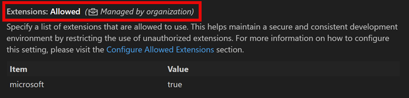

# 기업 지원 {#enterprise-support}

Visual Studio Code는 모든 규모의 기업 팀을 위한 개발 도구로 사용될 수 있습니다. IT 관리자로서, 당신은 조직 내에서 일관성과 호환성을 달성하기 위해 VS Code를 구성할 수 있습니다.

## 네트워크: 일반 호스트 이름 {#network-common-hostnames}

VS Code 내의 몇 가지 기능은 자동 업데이트 메커니즘, 확장 프로그램 쿼리 및 설치, 사용 데이터 수집과 같은 네트워크 통신이 필요합니다. 이러한 기능이 프록시 환경에서 제대로 작동하려면 프로그램이 올바르게 구성되어야 합니다.

필요한 도메인에 대한 [네트워크 일반 호스트 이름 목록](/docs/setup/network.md#common-hostnames)을 참조하세요.

## 허용된 확장 프로그램 구성 {#configure-allowed-extensions}

VS Code에서 `extensions.allowed` 애플리케이션 전체 설정을 구성하여 설치할 수 있는 확장 프로그램을 제어합니다. 설정이 구성되지 않으면 모든 확장 프로그램이 허용됩니다. 설정이 구성되면 나열되지 않은 모든 확장 프로그램은 설치가 차단됩니다. 이미 설치된 확장 프로그램이나 버전을 차단하면 해당 확장 프로그램이 비활성화됩니다.

조직의 허용된 확장 프로그램을 중앙에서 관리하려면 Windows 그룹 정책과 같은 [장치 관리](#centrally-manage-allowed-extensions)를 사용하여 개별 장치의 VS Code 설정을 재정의하는 정책을 생성하세요.

:::note
허용된 확장 프로그램에 대한 지원은 VS Code 버전 1.96부터 제공됩니다.
:::

`extensions.allowed` 설정에는 확장 프로그램 필터 목록이 포함되어 있으며, 이를 통해 어떤 확장 프로그램을 허용하거나 차단할지 결정할 수 있습니다. 다음과 같은 유형의 필터를 지정할 수 있습니다:

* 특정 게시자의 모든 확장 프로그램 허용 또는 차단
* 특정 확장 프로그램 허용 또는 차단
* 특정 확장 프로그램 버전 허용
* 특정 확장 프로그램 버전 및 플랫폼 허용
* 확장 프로그램의 안정적인 버전만 허용
* 특정 게시자의 안정적인 확장 버전만 허용

다음 JSON 스니펫은 다양한 `extensions.allowed` 설정 값의 예를 보여줍니다:

```json
"extensions.allowed": {
    // 'microsoft' 게시자의 모든 확장 프로그램을 허용합니다. 키에 '.'가 없으면 게시자 ID를 의미합니다.
    "microsoft": true,

    // 'github' 게시자의 모든 확장 프로그램을 허용합니다.
    "github": true,

    // prettier 확장 프로그램을 허용합니다.
    "esbenp.prettier-vscode": true,

    // docker 확장 프로그램을 허용하지 않습니다.
    "ms-azuretools.vscode-docker": false,

    // eslint 확장의 버전 3.0.0만 허용합니다.
    "dbaeumer.vscode-eslint": ["3.0.0"],

    // figma 확장의 여러 버전을 허용합니다.
    "figma.figma-vscode-extension": ["3.0.0", "4.2.3", "4.1.2"],

    // Windows 및 macOS에서 rust 확장의 버전 5.0.0을 허용합니다.
    "rust-lang.rust-analyzer": ["5.0.0@win32-x64", "5.0.0@darwin-x64"],

    // GitHub Pull Requests 확장의 안정적인 버전만 허용합니다.
    "github.vscode-pull-request-github": "stable",

    // redhat 게시자의 안정적인 버전만 허용합니다.
    "redhat": "stable",
}
```

게시자는 게시자 ID로 지정합니다. 키에 마침표(`.`)가 없으면 게시자 ID로 간주됩니다. 키에 마침표가 있으면 확장 ID로 간주됩니다. 현재 와일드카드 사용은 지원되지 않습니다.

:::tip
`microsoft`를 게시자 ID로 사용하여 Microsoft에서 게시한 모든 확장 프로그램을 참조할 수 있습니다. 각 확장 프로그램이 서로 다른 게시자 ID를 가질 수도 있지만, `microsoft`로 통합하여 지정할 수 있습니다.
:::

버전 범위는 지원되지 않습니다. 여러 버전의 확장을 허용하려면 각 버전을 개별적으로 지정해야 합니다. 플랫폼별로 버전을 더 제한하려면 `@` 기호를 사용하여 플랫폼을 지정합니다. 예를 들어, `"rust-lang.rust-analyzer": ["5.0.0@win32-x64", "5.0.0@darwin-x64"]`.

확장 프로그램 필터가 구체적일수록 우선 순위가 높습니다. 예를 들어, `"microsoft": true`와 `"microsoft.cplusplus": false`는 C++ 확장을 제외한 모든 Microsoft 확장을 허용합니다.

중복 키 값은 지원되지 않습니다. 예를 들어, `"microsoft": true`와 `"microsoft": false`를 모두 포함하면 잘못된 정책이 됩니다.

VS Code의 확장 프로그램에 대해 더 알고 싶다면 [확장 프로그램 문서](/docs/editor/extension-marketplace.md)를 참조하세요.

### 허용된 확장 프로그램 중앙 관리 {#centrally-manage-allowed-extensions}

[장치 관리](#device-management)를 사용하여 조직 내에서 설치할 수 있는 확장 프로그램을 중앙에서 제어합니다. `AllowedExtensions` VS Code 정책을 구성하여 사용자의 장치에서 해당 `extensions.allowed` VS Code 설정을 재정의합니다. 이 정책의 값은 허용된 확장 프로그램을 포함하는 JSON 문자열입니다.



:::important
정책 값에 구문 오류가 있는 경우 `extensions.allowed` 설정이 적용되지 않습니다. 오류를 확인하려면 VS Code에서 Window 로그를 확인하세요 (키보드 단축키 `kb(workbench.action.showCommands)`를 누르고 **Show Window Log**를 입력합니다).
:::

## 자동 업데이트 구성 {#configure-automatic-updates}

`update.mode` VS Code 설정은 새 버전이 출시될 때 VS Code가 자동으로 업데이트되는지 여부를 제어합니다. 업데이트는 Microsoft 온라인 서비스에서 가져옵니다.

설정에는 다음과 같은 옵션이 있습니다:

* `none` - 업데이트가 비활성화됩니다.
* `manual` - 자동 업데이트 확인이 비활성화되지만 사용자가 수동으로 업데이트를 확인할 수 있습니다.
* `start` - VS Code가 시작될 때만 업데이트를 확인하며, 자동 업데이트 확인은 비활성화됩니다.
* `default` - 자동 업데이트 확인이 활성화되며 주기적으로 백그라운드에서 실행됩니다.

### 자동 업데이트 중앙 관리 {#centrally-manage-automatic-updates}

[장치 관리](#device-management)를 사용하여 조직 내에서 VS Code가 업데이트를 관리하는 방식을 중앙에서 제어합니다. `UpdateMode` VS Code 정책을 구성하여 사용자의 장치에서 해당 `update.mode` VS Code 설정을 재정의합니다. 이 정책의 값은 업데이트 모드를 포함하는 문자열입니다.

## 장치 관리 {#device-management}

조직의 요구를 충족하도록 VS Code의 특정 기능을 장치 관리 솔루션을 통해 제어할 수 있습니다.

VS Code는 현재 다음과 같은 관리자가 제어하는 기능을 지원합니다:

| 정책 | 설명 | VS Code 설정 |
| ------ | ----------- | --------------- |
| `AllowedExtensions` | 설치할 수 있는 확장 프로그램을 제어합니다. | `extensions.allowed` |
| `UpdateMode` | 새 버전이 출시될 때 VS Code가 자동으로 업데이트되는지 여부를 제어합니다. | `update.mode` |

:::note
현재 VS Code는 Windows 그룹 정책만 지원합니다. macOS의 구성 프로필 지원은 곧 제공될 예정입니다 ([추적 문제](https://github.com/microsoft/vscode/issues/148942)).
:::

### Windows의 그룹 정책 {#group-policy-on-windows}

시스템 관리자는 조직의 모든 클라이언트 머신에서 기본 소프트웨어 설정을 제어할 수 있는 방법이 필요합니다. 그룹 정책은 관리자가 사용 가능한 정책 및 설정에 대한 동작을 구현할 수 있는 유연성을 제공하는 클라이언트 솔루션입니다.

VS Code는 [Windows 레지스트리 기반 그룹 정책](https://learn.microsoft.com/previous-versions/windows/desktop/policy/implementing-registry-based-policy)을 지원합니다. VS Code 버전 1.69부터 각 릴리스에는 ADMX 템플릿 파일이 포함된 `policies` 디렉토리가 제공되며, 이를 다음 경로에 추가할 수 있습니다: `C:\Windows\PolicyDefinitions`. 해당하는 `adml` 파일도 `C:\Windows\PolicyDefinitions\<your-locale>` 디렉토리에 복사해야 합니다.

정책 정의가 설치되면 관리자는 [로컬 그룹 정책 편집기](https://learn.microsoft.com/previous-versions/windows/it-pro/windows-server-2012-R2-and-2012/dn265982(v=ws.11))를 사용하여 정책 값을 관리할 수 있습니다.

정책은 컴퓨터 수준과 사용자 수준 모두에서 설정할 수 있습니다. 두 수준 모두 설정된 경우 컴퓨터 수준이 우선합니다. 정책 값이 설정되면 해당 값은 모든 수준(기본값, 사용자, 작업 공간 등)에서 구성된 VS Code [설정](/docs/editor/settings.md) 값을 재정의합니다.

### 추가 정책 {#additional-policies}

목표는 현재 VS Code 설정을 정책화하여 기존 설정을 밀접하게 따르는 것입니다. 이렇게 하면 설정의 이름과 동작이 일관되게 유지됩니다. 추가적인 정책이 필요하다면, VS Code [GitHub 리포지토리](https://github.com/microsoft/vscode/issues)에 이슈를 열어 주세요. 팀은 해당 동작에 대한 기존 설정이 있는지 또는 원하는 동작을 제어하기 위해 새로운 설정을 생성해야 하는지를 결정할 것입니다.

## 사전 설치된 확장 프로그램으로 VS Code 설정 {#set-up-vs-code-with-preinstalled-extensions}

사전 설치된 확장 프로그램 세트로 VS Code를 설정할 수 있습니다 (*부트스트랩*). 이 기능은 VS Code가 사전 설치되고 특정 확장 프로그램이 사용자에게 즉시 제공되는 머신 이미지, 가상 머신 또는 클라우드 워크스테이션을 준비하는 경우에 유용합니다.

:::note
사전 설치된 확장 프로그램 지원은 현재 Windows에서만 제공됩니다.
:::

확장 프로그램을 부트스트랩하려면 다음 단계를 따르세요:

1. VS Code 설치 디렉토리에 `bootstrap\extensions` 폴더를 만듭니다.

1. 사전 설치하려는 확장의 [VSIX 파일](/docs/editor/extension-marketplace.md#can-i-download-an-extension-directly-from-the-marketplace)을 다운로드하여 `bootstrap\extensions` 폴더에 배치합니다.

1. 사용자가 처음으로 VS Code를 실행할 때, `bootstrap\extensions` 폴더의 모든 확장이 백그라운드에서 조용히 설치됩니다.

사용자는 여전히 사전 설치된 확장 프로그램을 제거할 수 있습니다. 확장 프로그램을 제거한 후 VS Code를 다시 시작하면 해당 확장이 재설치되지 않습니다.

## 자주 묻는 질문 {#frequently-asked-questions}

### VS Code가 macOS 또는 Linux에서 구성 프로필을 지원하나요? {#does-vs-code-support-configuration-profiles-on-macos-or-linux}

현재 VS Code는 Windows 그룹 정책만 지원합니다. macOS의 구성 프로필 지원은 곧 제공될 예정입니다 ([이슈 확인하기](https://github.com/microsoft/vscode/issues/148942)).

Linux에 대한 지원은 예정되어 있지 않습니다. Linux에서 구성 프로필에 관심이 있다면 VS Code [GitHub 리포지토리](https://github.com/microsoft/vscode/issues)에 문제를 열고 당신의 생각에 대해 자세히 공유해 주세요.
