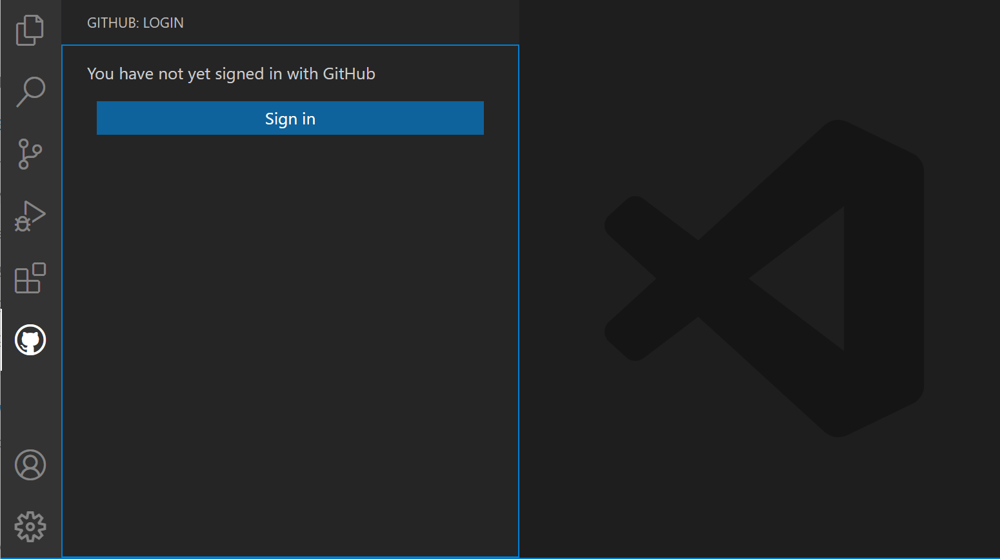
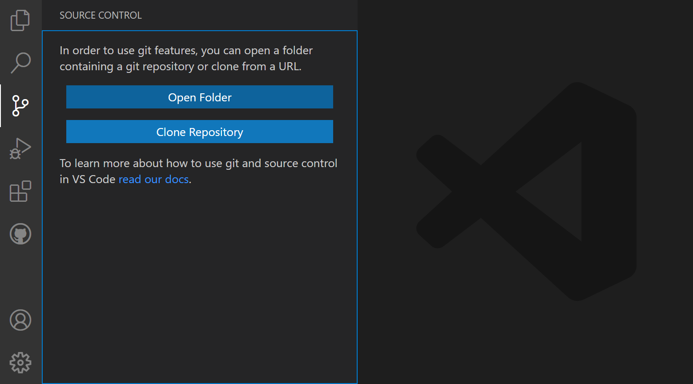
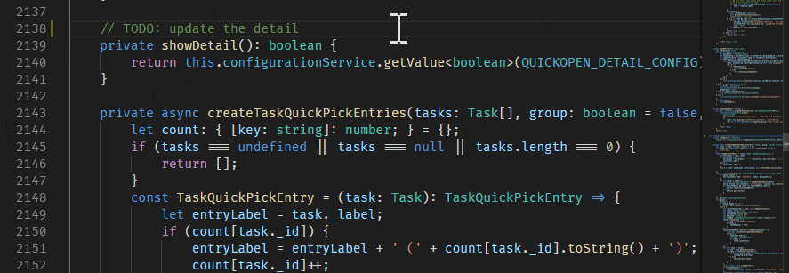
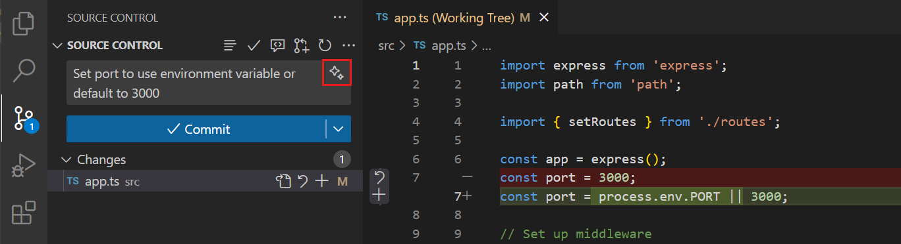
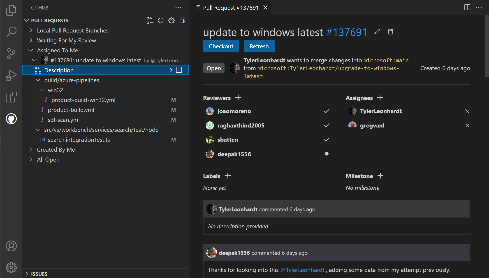
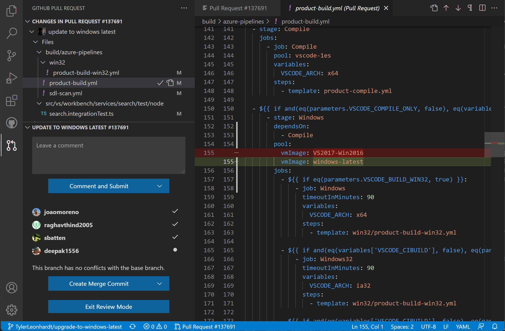
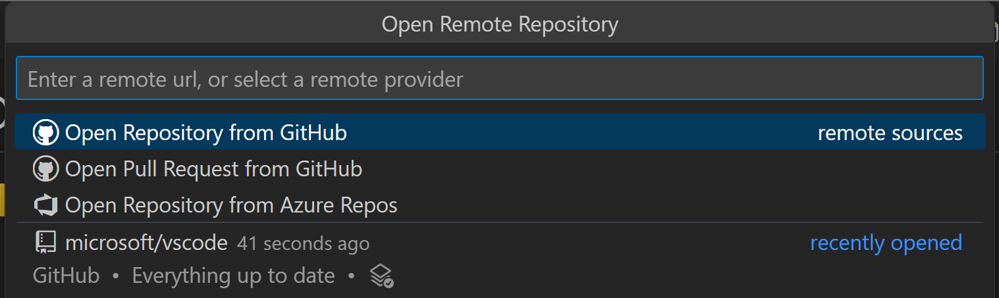

# Visual Studio Code에서 GitHub 작업하기 {#working-with-github-in-vs-code}

[GitHub](https://github.com)는 소스 코드를 저장하고 공유하기 위한 클라우드 기반 서비스입니다. Visual Studio Code와 함께 GitHub를 사용하면 소스 코드를 공유하고 편집기 내에서 다른 사람들과 협업할 수 있습니다. GitHub와 상호작용하는 방법은 여러 가지가 있으며, 예를 들어 [https://github.com](https://github.com) 웹사이트나 [Git](https://git-scm.com) 명령줄 인터페이스(CLI)를 통해 가능하지만, VS Code에서는 [GitHub Pull Requests and Issues](https://marketplace.visualstudio.com/items?itemName=GitHub.vscode-pull-request-github) 확장을 통해 풍부한 GitHub 통합 기능을 제공합니다.

<a class="install-extension-btn" href="vscode:extension/GitHub.vscode-pull-request-github">GitHub Pull Requests and Issues 확장 설치하기</a>

VS Code에서 GitHub를 시작하려면 [Git](https://git-scm.com/download)을 설치하고, [GitHub 계정](https://docs.github.com/get-started/signing-up-for-github/signing-up-for-a-new-github-account)을 생성한 후 [GitHub Pull Requests and Issues](https://marketplace.visualstudio.com/items?itemName=GitHub.vscode-pull-request-github) 확장을 설치해야 합니다. 이 주제에서는 VS Code를 떠나지 않고도 GitHub의 일부 좋아하는 기능을 사용하는 방법을 보여줍니다.

소스 제어에 익숙하지 않거나 VS Code의 기본 Git 지원에 대해 더 알고 싶다면 [소스 제어](/docs/sourcecontrol/overview.md) 주제를 시작할 수 있습니다.

## GitHub Pull Requests 및 Issues 시작하기 {#getting-started-with-github-pull-requests-and-issues}

[GitHub Pull Requests and Issues](https://marketplace.visualstudio.com/items?itemName=GitHub.vscode-pull-request-github) 확장을 설치한 후에는 로그인해야 합니다. 브라우저에서 GitHub에 인증하기 위한 프롬프트를 따르고 VS Code로 돌아오세요.



VS Code로 리디렉션되지 않는 경우, 인증 토큰을 수동으로 추가할 수 있습니다. 브라우저 창에서 인증 토큰을 받게 됩니다. 토큰을 복사한 후 VS Code로 돌아가서 상태 표시줄에서 **github.com에 로그인 중...**을 선택하고 토큰을 붙여넣은 후 `kbstyle(Enter)`를 누릅니다.

## 리포지토리 설정하기 {#setting-up-a-repository}

### 리포지토리 복제하기 {#cloning-a-repository}

**Git: Clone** 명령을 사용하여 명령 팔레트(`kb(workbench.action.showCommands)`)에서 GitHub에서 리포지토리를 검색하고 복제할 수 있습니다. 또는 소스 제어 보기에서 **Clone Repository** 버튼을 사용할 수 있습니다(폴더가 열려 있지 않을 때 사용 가능).



GitHub 리포지토리 드롭다운에서 로컬로 복제할 리포지토리를 필터링하고 선택할 수 있습니다.


### 기존 리포지토리 인증하기 {#authenticating-with-an-existing-repository}

GitHub 인증은 VS Code에서 GitHub 인증이 필요한 Git 작업을 실행할 때 활성화됩니다. 예를 들어, 자신이 소속된 리포지토리에 푸시하거나 비공개 리포지토리를 복제할 때입니다. 인증을 위해 특별한 확장을 설치할 필요는 없으며, VS Code에 내장되어 있어 리포지토리를 효율적으로 관리할 수 있습니다.

GitHub 인증이 필요한 작업을 수행할 때 로그인 프롬프트가 표시됩니다:


GitHub에 로그인하고 VS Code로 돌아가는 단계를 따르세요. 개인 액세스 토큰(PAT)으로 로그인하는 것은 GitHub Enterprise Server에서만 지원됩니다. GitHub Enterprise Server를 사용하고 PAT를 사용하려는 경우, 로그인 프롬프트에서 "취소"를 눌러 PAT 요청이 올 때까지 기다릴 수 있습니다.

GitHub에 인증하는 방법에는 사용자 이름과 비밀번호를 사용하는 2단계 인증(2FA), 개인 액세스 토큰 또는 SSH 키를 사용하는 여러 가지 방법이 있습니다. 각 옵션에 대한 자세한 정보는 [GitHub에 대한 인증 정보](https://docs.github.com/github/authenticating-to-github/about-authentication-to-github)를 참조하세요.

>**참고**: 로컬 머신에 내용을 복제하지 않고 리포지토리에서 작업하려면 [GitHub Repositories](https://marketplace.visualstudio.com/items?itemName=github.remotehub) 확장을 설치하여 GitHub에서 직접 탐색하고 편집할 수 있습니다. 아래 [GitHub Repositories 확장](/docs/sourcecontrol/github.md#github-repositories-extension) 섹션에서 더 많은 정보를 확인할 수 있습니다.

## 편집기 통합 {#editor-integration}

### 호버 {#hovers}

리포지토리가 열려 있고 사용자가 @-멘션된 경우, 해당 사용자 이름 위에 마우스를 올리면 GitHub 스타일의 호버가 표시됩니다.


#-멘션된 이슈 번호, 전체 GitHub 이슈 URL 및 리포지토리 지정 이슈에 대해서도 유사한 호버가 있습니다.


### 제안 {#suggestions}

사용자 제안은 "@" 문자로 트리거되고 이슈 제안은 "#" 문자로 트리거됩니다. 제안은 편집기와 **소스 제어** 보기의 입력 상자에서 사용할 수 있습니다.



제안에 나타나는 이슈는 **GitHub Issues: Queries** (`setting(githubIssues.queries)`) [설정](/docs/editor/settings.md)으로 구성할 수 있습니다. 쿼리는 [GitHub 검색 구문](https://docs.github.com/search-github/getting-started-with-searching-on-github/understanding-the-search-syntax)을 사용합니다.

어떤 파일이 이러한 제안을 표시할지 설정할 수도 있으며, **GitHub Issues: Ignore Completion Trigger** (`setting(githubIssues.ignoreCompletionTrigger)`) 및 **GitHub Issues: Ignore User Completion Trigger** (`setting(githubIssues.ignoreUserCompletionTrigger)`) 설정을 사용하여 구성할 수 있습니다. 이러한 설정은 파일 유형을 지정하기 위해 [언어 식별자](/docs/languages/identifiers.md)의 배열을 사용합니다.

```jsonc
// '#' 문자를 사용하여 이슈 완성 제안을 트리거하지 않아야 하는 언어.
"githubIssues.ignoreCompletionTrigger": [
  "python"
]
```

## Pull Requests {#pull-requests}

**Pull Requests** 보기에서 Pull Requests를 보고 관리하며 생성할 수 있습니다.


Pull Requests를 표시하는 데 사용되는 쿼리는 **GitHub Pull Requests: Queries** (`setting(githubPullRequests.queries)`) 설정으로 구성할 수 있으며, [GitHub 검색 구문](https://docs.github.com/search-github/getting-started-with-searching-on-github/understanding-the-search-syntax)을 사용합니다.

```json
"githubPullRequests.queries": [
    {
        "label": "나에게 할당됨",
        "query": "is:open assignee:${user}"
    },
```

### Pull Requests 생성하기 {#creating-pull-requests}

포크 또는 브랜치에 변경 사항을 커밋한 후, **GitHub Pull Requests: Create Pull Request** 명령이나 **Pull Requests** 보기의 **Create Pull Request** 버튼을 사용하여 Pull Request를 생성할 수 있습니다.


새로운 **생성** 보기에서 Pull Request의 대상이 될 기본 리포지토리와 기본 브랜치를 선택하고 제목과 설명을 입력할 수 있습니다. 리포지토리에 Pull Request 템플릿이 있는 경우, 설명에 자동으로 사용됩니다.

상단의 작업 표시줄에서 **할당자**, **검토자**, **레이블** 및 **마일스톤**을 추가하는 버튼을 사용할 수 있습니다.


**생성** 버튼 메뉴에서는 **초안 생성** 또는 **자동 병합** 방법을 활성화하는 등의 대체 생성 옵션을 선택할 수 있습니다.

**생성**을 선택하면, 아직 GitHub 원격에 브랜치를 푸시하지 않았다면, 확장은 브랜치를 게시할 것인지 묻고 특정 원격을 선택할 수 있는 드롭다운을 제공합니다.

**Pull Request 생성** 보기는 이제 **검토 모드**로 전환되며, PR의 세부 정보를 검토하고 댓글을 추가하며 준비가 되면 PR을 병합할 수 있습니다. PR이 병합된 후에는 원격 및 로컬 브랜치를 모두 삭제할 수 있는 옵션이 제공됩니다.

> [!TIP]
> GitHub Copilot을 사용하여 PR에 포함된 커밋을 기반으로 PR 제목과 설명을 생성하세요. PR 제목 필드 옆의 _스파클_ 아이콘을 선택하여 PR 제목과 설명을 생성합니다.



### 검토하기 {#reviewing}

Pull Requests는 **Pull Requests** 보기에서 검토할 수 있습니다. 검토자와 레이블을 할당하고, 댓글을 추가하고, 승인하고, 닫고, 병합할 수 있습니다. 모든 작업은 Pull Request **설명**에서 수행할 수 있습니다.



**설명** 페이지에서 **체크아웃** 버튼을 사용하여 Pull Request를 로컬에서 쉽게 체크아웃할 수 있습니다. 이 작업은 VS Code를 Pull Request의 포크 및 브랜치로 전환하며(상태 표시줄에 표시됨) 현재 변경 사항의 차이와 모든 커밋 및 이러한 커밋 내의 변경 사항을 볼 수 있는 새로운 **Pull Request의 변경 사항** 보기를 추가합니다. 댓글이 달린 파일은 다이아몬드 아이콘으로 장식됩니다. 디스크에서 파일을 보려면 **파일 열기** 인라인 작업을 사용할 수 있습니다.



이 보기의 차이 편집기는 로컬 파일을 사용하므로 파일 탐색, IntelliSense 및 편집이 정상적으로 작동합니다. 이러한 차이에서 편집기 내에 댓글을 추가할 수 있습니다. 단일 댓글 추가와 전체 검토 생성 모두 지원됩니다.

Pull Request 변경 사항 검토가 완료되면 PR을 병합하거나 **검토 모드 종료**를 선택하여 작업 중이던 이전 브랜치로 돌아갈 수 있습니다.

> [!TIP]
> PR을 생성하기 전에 [Copilot이 PR의 코드 검토를 수행하도록 할 수 있습니다](https://docs.github.com/en/copilot/using-github-copilot/code-review/using-copilot-code-review?tool=vscode). GitHub Pull Request 보기에서 **Copilot 코드 검토** 버튼을 선택하세요.

## Issues {#issues}

### Issues 생성하기 {#creating-issues}

Issues는 **Issues** 보기의 **+** 버튼을 사용하거나 **GitHub Issues: Create Issue from Selection** 및 **GitHub Issues: Create Issue from Clipboard** 명령을 사용하여 생성할 수 있습니다. "TODO" 댓글에 대한 코드 작업을 사용하여 생성할 수도 있습니다. Issues를 생성할 때 기본 설명을 사용할 수 있으며, 오른쪽 상단의 **설명 편집** 연필 아이콘을 선택하여 이슈 본문을 위한 편집기를 열 수 있습니다.


코드 작업의 트리거를 **GitHub Issues: Create Issue Triggers** (`setting(githubIssues.createIssueTriggers)`) 설정을 사용하여 구성할 수 있습니다.

기본 이슈 트리거는 다음과 같습니다:

```json
"githubIssues.createIssueTriggers": [
  "TODO",
  "todo",
  "BUG",
  "FIXME",
  "ISSUE",
  "HACK"
]
```

### Issues 작업하기 {#working-on-issues}

**Issues** 보기에서 자신의 이슈를 보고 작업할 수 있습니다.


기본적으로 이슈 작업을 시작할 때(**이슈 작업 시작** 컨텍스트 메뉴 항목), 상태 표시줄에 표시된 대로 브랜치가 생성됩니다.


상태 표시줄은 활성 이슈를 표시하며, 해당 항목을 선택하면 GitHub 웹사이트에서 이슈를 열거나 Pull Request를 생성하는 등의 이슈 작업 목록이 표시됩니다.


브랜치 이름을 구성하려면 **GitHub Issues: Issue Branch Title** (`setting(githubIssues.issueBranchTitle)`) 설정을 사용할 수 있습니다. 워크플로우에 브랜치 생성이 포함되지 않거나 매번 브랜치 이름을 입력하라는 프롬프트를 받고 싶다면, **GitHub Issues: Use Branch For Issues** (`setting(githubIssues.useBranchForIssues)`) 설정을 끄면 해당 단계를 건너뛸 수 있습니다.

이슈 작업이 완료되고 변경 사항을 커밋하려는 경우, **소스 제어** 보기의 커밋 메시지 입력 상자가 메시지로 채워지며, 이는 **GitHub Issues: Working Issue Format SCM** (`setting(githubIssues.workingIssueFormatScm)`)으로 구성할 수 있습니다.

## GitHub Repositories 확장 {#github-repositories-extension}

[GitHub Repositories](https://marketplace.visualstudio.com/items?itemName=github.remotehub) 확장을 사용하면 Visual Studio Code 내에서 원격 GitHub 리포지토리를 빠르게 탐색하고 검색하며 편집하고 커밋할 수 있습니다. 이를 통해 리포지토리를 로컬로 복제할 필요 없이 소스 코드를 검토하거나 파일이나 자산에 작은 변경을 가할 수 있습니다.


### 리포지토리 열기 {#opening-a-repository}

GitHub Repositories 확장을 설치한 후, 명령 팔레트(`kb(workbench.action.showCommands)`)에서 **GitHub Repositories: Open Repository...** 명령을 사용하거나 상태 표시줄 왼쪽 하단의 원격 표시기를 클릭하여 리포지토리를 열 수 있습니다.


**Open Repository** 명령을 실행하면 GitHub에서 리포지토리를 열거나, GitHub에서 Pull Request를 열거나, 이전에 연결했던 리포지토리를 다시 열 것인지 선택할 수 있습니다.

이전에 VS Code에서 GitHub에 로그인하지 않았다면, GitHub 계정으로 인증하라는 프롬프트가 표시됩니다.



리포지토리 URL을 직접 제공하거나 텍스트 상자에 입력하여 원하는 리포지토리를 GitHub에서 검색할 수 있습니다.

리포지토리나 Pull Request를 선택하면 VS Code 창이 새로 고쳐지고 파일 탐색기에서 리포지토리 내용을 볼 수 있습니다. 그런 다음 파일을 열고(전체 구문 강조 및 괄호 일치 포함), 편집하고 변경 사항을 커밋할 수 있습니다. 이는 로컬 리포지토리에서 작업하는 것과 유사합니다.

로컬 리포지토리와의 차이점은 GitHub Repositories 확장을 사용하여 변경 사항을 커밋할 때, 변경 사항이 원격 리포지토리로 직접 푸시된다는 점입니다. 이는 GitHub 웹 인터페이스에서 작업하는 것과 유사합니다.

GitHub Repositories 확장의 또 다른 기능은 리포지토리나 브랜치를 열 때마다 GitHub에서 최신 소스를 받을 수 있다는 점입니다. 로컬 리포지토리와 달리 새로 고침을 위해 풀을 기억할 필요가 없습니다.

GitHub Repositories 확장은 [Git LFS](https://git-lfs.github.com) (Large File System)를 로컬에 설치하지 않고도 LFS로 추적되는 파일을 보고 커밋하는 것을 지원합니다. LFS로 추적할 파일 유형을 [`.gitattributes` 파일](https://git-lfs.com)에 추가한 후, 소스 제어 보기를 사용하여 GitHub에 직접 변경 사항을 커밋할 수 있습니다.

### 브랜치 전환 {#switching-branches}

상태 표시줄의 브랜치 표시기를 클릭하여 브랜치를 쉽게 전환할 수 있습니다. GitHub Repositories 확장의 훌륭한 기능 중 하나는 커밋되지 않은 변경 사항을 스태시할 필요 없이 브랜치를 전환할 수 있다는 점입니다. 확장은 변경 사항을 기억하고 브랜치를 전환할 때 다시 적용합니다.


### 원격 탐색기 {#remote-explorer}

활동 표시줄에서 사용할 수 있는 원격 탐색기를 통해 원격 리포지토리를 빠르게 다시 열 수 있습니다. 이 보기에서는 이전에 열었던 리포지토리와 브랜치를 보여줍니다.


### Pull Requests 생성하기 {#create-pull-requests}

워크플로우가 리포지토리에 직접 커밋하는 대신 Pull Requests를 사용하는 경우, 소스 제어 보기에서 새 PR을 생성할 수 있습니다. 제목을 제공하고 새 브랜치를 생성하라는 프롬프트가 표시됩니다.


Pull Request를 생성한 후에는 [GitHub Pull Request and Issues](https://marketplace.visualstudio.com/items?itemName=GitHub.vscode-pull-request-github) 확장을 사용하여 이 주제에서 설명한 대로 PR을 검토하고 편집하며 병합할 수 있습니다 [이전](/docs/sourcecontrol/github.md#pull-requests).

### 가상 파일 시스템 {#virtual-file-system}

리포지토리의 파일이 로컬 머신에 없을 경우, GitHub Repositories 확장은 메모리 내에서 가상 파일 시스템을 생성하여 파일 내용을 보고 편집할 수 있도록 합니다. 가상 파일 시스템을 사용하면 로컬 파일을 가정하는 일부 작업 및 확장이 활성화되지 않거나 기능이 제한됩니다. 작업, 디버깅 및 통합 터미널과 같은 기능은 활성화되지 않으며, 원격 표시기 호버의 **기능이 사용 불가능합니다** 링크를 통해 가상 파일 시스템에 대한 지원 수준을 확인할 수 있습니다.


확장 작성자는 [가상 작업 공간 확장 작성자 가이드](https://github.com/microsoft/vscode/wiki/Virtual-Workspaces)를 통해 가상 파일 시스템 및 작업 공간에서 실행하는 방법에 대해 더 알아볼 수 있습니다.

### 계속 작업하기... {#continue-working-on}

때때로 로컬 파일 시스템과 전체 언어 및 개발 도구 지원이 있는 개발 환경에서 리포지토리 작업으로 전환하고 싶을 수 있습니다. GitHub Repositories 확장은 다음과 같은 작업을 쉽게 수행할 수 있도록 합니다:

* GitHub 코드 스페이스 생성 (GitHub Codespaces 확장이 있는 경우).
* 리포지토리를 로컬로 복제합니다.
* 리포지토리를 Docker 컨테이너로 복제합니다(설치된 경우 [Docker](https://docker.com/) 및 Microsoft [Docker 확장](https://marketplace.visualstudio.com/items?itemName=ms-azuretools.vscode-docker)).

개발 환경을 전환하려면 명령 팔레트(`kb(workbench.action.showCommands)`)에서 사용할 수 있는 **계속 작업하기...** 명령을 사용하거나 상태 표시줄의 원격 표시기를 클릭합니다.


[브라우저 기반 편집기](/docs/remote/codespaces.md#browserbased-editor)를 사용하는 경우, **"계속 작업하기..."** 명령은 리포지토리를 로컬로 열거나 [GitHub Codespaces](https://github.com/features/codespaces) 내의 클라우드 호스팅 환경에서 열 수 있는 옵션을 제공합니다.


**계속 작업하기**를 처음 사용할 때 커밋되지 않은 변경 사항이 있는 경우, **클라우드 변경 사항**을 사용하여 선택한 개발 환경으로 편집 내용을 가져올 수 있는 옵션이 제공됩니다. 이는 대기 중인 변경 사항을 설정 동기화에 사용되는 동일한 VS Code 서비스에 저장합니다.

이러한 변경 사항은 대상 개발 환경에 적용되면 서비스에서 삭제됩니다. 커밋되지 않은 변경 사항 없이 계속 진행하기로 선택하면, 나중에 `"workbench.cloudChanges.continueOn": "prompt"` 설정을 구성하여 이 기본 설정을 변경할 수 있습니다.

대기 중인 변경 사항이 자동으로 대상 개발 환경에 적용되지 않는 경우, **Cloud Changes: Show Cloud Changes** 명령을 사용하여 저장된 변경 사항을 보고 관리하고 삭제할 수 있습니다.

## 다음 단계 {#next-steps}

* [Copilot VS Code](/docs/copilot/overview.md)에 대해 더 알아보기 - VS Code에서 Copilot에 대해 알아보세요.