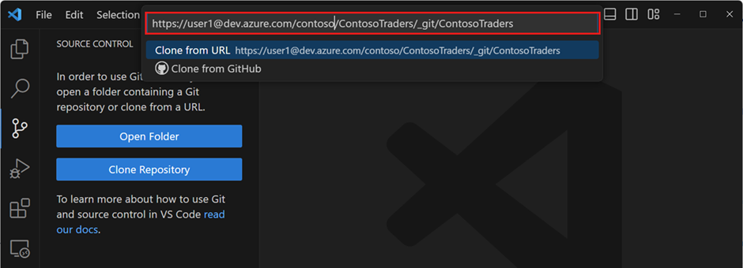
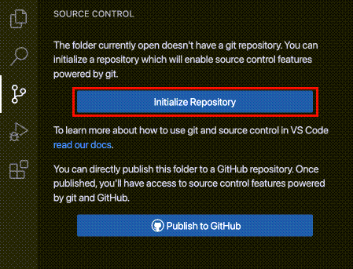
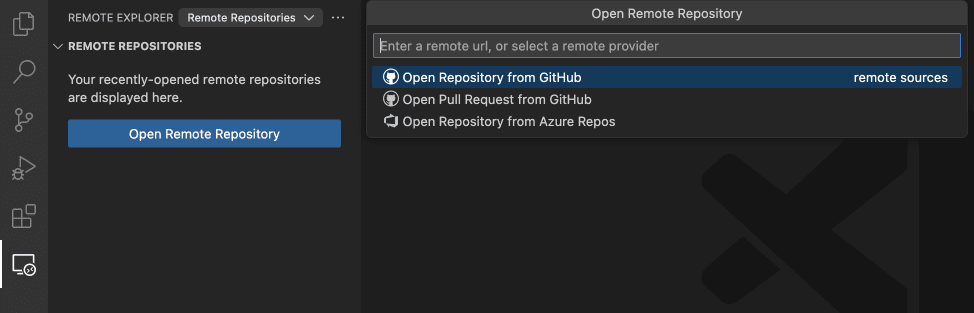
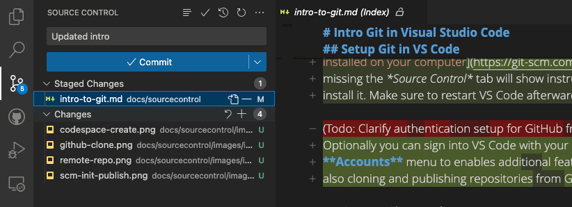

# Visual Studio Code에서 Git 소개 {#introduction-to-git-in-vs-code}

소스 코드를 쉽게 관리하고 다른 사람과 협업하고 싶으신가요? Git과 GitHub를 사용해보세요! Visual Studio Code를 사용하면 이를 간편하게 설정하고 사용할 수 있습니다. 초보자라도 VS Code의 사용자 친화적인 인터페이스가 코드를 Push하고 Pull하며, Branch를 생성하고 병합하고, 코드 변경 사항을 Commit하는 등의 일반적인 Git 작업을 안내합니다. 전문가라면, Git CLI을 사용하는 것보다 시간을 절약하고 노력을 덜 들이면서 편집기 내에서 직접 Git 작업을 수행할 수 있는 기능을 선호할 것입니다. 또한, VS Code와 Git 간의 원활한 워크플로우 덕분에 편집기에서 작업을 계속하며 더 많은 일을 할 수 있습니다.

VS Code의 GitHub Copilot을 사용하면 Commit 메시지, Pull Request에 대한 제안을 받고 Commit하기 전에 코드 변경 사항을 검토할 수 있습니다. [VS Code에서 GitHub Copilot에 대해 더 알아보세요](/docs/copilot/overview.md).

:::tip
아직 Copilot 구독을 하지 않았다면, [Copilot 무료 요금제](https://github.com/github-copilot/signup)에 가입하여 무료로 Copilot을 사용해 보세요. 매달 제한된 횟수의 코드 자동 완성과 채팅 기능을 이용할 수 있습니다.
:::

## VS Code에서 Git 설정하기 {#set-up-git-in-vs-code}

VS Code에서 Git과 GitHub를 사용하려면 먼저 [컴퓨터에 Git이 설치되어 있는지 확인하세요](https://git-scm.com/downloads). Git이 없으면 **Source Control** 화면에서 설치 방법에 대한 지침이 표시됩니다. 이후 VS Code를 재시작해야 합니다.

또한, **Activity bar**의 오른쪽 하단에 있는 **Accounts** 메뉴에서 GitHub 계정으로 VS Code에 로그인하여 [설정 동기화](/docs/editor/settings-sync.md)와 같은 추가 기능을 활성화하고 GitHub에서 Repository를 복제하고 게시할 수 있습니다.

## Git Repository 열기 {#open-a-git-repository}

VS Code는 로컬에서 원격 클라우드 기반 환경인 [GitHub Codespaces](https://github.com/features/codespaces)까지 Git Repository를 시작하는 여러 가지 방법을 제공합니다.

### 로컬에서 Repository 복제하기 {#clone-a-repository-locally}

Repository를 복제하려면 명령 팔레트에서 **Git: Clone** 명령을 실행하거나 **Source Control** 화면에서 **Clone Repository** 버튼을 선택하세요.

GitHub에서 복제하는 경우, VS Code는 GitHub로 인증하라는 메시지를 표시합니다. 그런 다음 복제할 Repository를 목록에서 선택하세요. 목록에는 공개 및 비공개 Repository가 모두 포함되어 있습니다.

다른 Git 제공업체의 경우, Repository URL을 입력하고 **Clone**를 선택한 후 로컬 컴퓨터에 파일을 복제할 폴더를 선택하세요. Repository가 로컬 컴퓨터에 복제되면 VS Code가 해당 폴더를 엽니다.

### 로컬 폴더에서 Repository 초기화하기 {#initialize-a-repository-in-a-local-folder}

새로운 로컬 Git Repository를 초기화하려면:

1. 컴퓨터에서 기존 폴더 또는 새 폴더를 선택하고 VS Code에서 엽니다.

1. **Source Control** 화면에서 **Initialize Repository** 버튼을 선택합니다.

    이렇게 하면 현재 폴더에 새로운 Git Repository가 생성되어 코드 변경 사항을 추적할 수 있게 됩니다.

    이 작업은 CLI에서 `git init`을 실행하는 것과 동일합니다.

    

#### 로컬 Repository를 GitHub에 게시하기 {#publish-local-repository-to-github}

로컬 Repository를 초기화하고 이를 GitHub에 직접 게시할 수도 있습니다. 이렇게 하면 GitHub 계정에 새로운 Repository가 생성되고, 로컬 코드 변경 사항이 원격 Repository에 Push됩니다. 원격 Repository에 소스 코드를 두는 것은 코드를 백업하고, 다른 사람과 협업하며, [GitHub Actions](https://github.com/features/actions)로 워크플로우를 자동화하는 좋은 방법입니다.

**Source Control** 화면에서 **Publish to GitHub** 명령 버튼을 사용하세요. 그런 다음 Repository의 이름과 설명을 선택하고 공개 또는 비공개로 설정할 수 있습니다.

Repository가 생성되면 VS Code는 로컬 코드를 원격 Repository에 Push합니다. 이제 코드가 GitHub에 백업되었으며, Commit 및 Pull Request를 통해 다른 사람과 협업을 시작할 수 있습니다.

### Codespace에서 GitHub Repository 열기 {#open-a-github-repository-in-a-codespace}

[GitHub Codespaces](https://github.com/features/codespaces)를 사용하면 GitHub Repository를 완전히 구성된 클라우드 기반 개발 환경에서 열 수 있어, 로컬 컴퓨터에 소프트웨어를 설치하지 않고도 브라우저에서 개발할 수 있습니다. GitHub Codespaces는 개인에게 무료 사용을 허용하므로 오픈 소스 프로젝트 작업을 쉽게 시작할 수 있습니다.

GitHub Repository에 대한 codespace를 생성하려면:

1. VS Code에 [GitHub Codespaces](https://marketplace.visualstudio.com/items?itemName=GitHub.codespaces) 확장을 설치하고 GitHub 계정으로 로그인합니다.

1. **Codespaces: Create New Codespace** 명령을 실행합니다.

1. 열고자 하는 Repository와 Branch를 선택합니다.

    VS Code는 codespace에 연결된 새 창을 엽니다. 소스 코드, 터미널, 실행 및 디버깅은 원격 클라우드 기반 개발 환경에서 호스팅됩니다.

    파일 탐색기와 상태 표시줄에서 작업 공간이 codespace에서 열려 있음을 나타냅니다.

    

또는 [GitHub Codespaces 웹사이트](https://github.com/codespaces/templates)에서 codespace 템플릿으로 시작할 수도 있습니다.

브라우저에서 이미 codespace가 열려 있는 경우, 브라우저에서 **Codespaces: Open in VS Code Desktop*** 명령을 실행하여 로컬 VS Code Desktop에서 codespace에 연결할 수 있습니다.

포트 포워딩과 같은 사용자 정의를 포함하여 GitHub Codespaces에 대해 더 알아보려면 [codespace에서 개발하기](https://docs.github.com/codespaces/developing-in-codespaces/developing-in-a-codespace?tool=vscode) 문서를 참조하세요.

### 원격으로 GitHub Repository 열기 {#open-a-github-repository-remotely}

VS Code의 원격 Repository 지원을 통해 GitHub Repository를 로컬 컴퓨터에 복제하지 않고도 탐색하고 편집할 수 있습니다. 이는 전체 코드베이스를 로컬 컴퓨터에 복제하지 않고도 원격 Repository에 빠르게 변경 사항을 적용할 수 있어 유용합니다.

1. 먼저 [GitHub Repositories](https://marketplace.visualstudio.com/items?itemName=GitHub.remotehub) 확장을 설치합니다.

1. **Remote Repositories: Open Remote Repository...** 명령을 실행하거나 탐색기 화면에서 **Open Remote Repository** 버튼을 사용합니다.

1. 열고자 하는 GitHub Repository를 검색하고 선택합니다.

    

:::tip
코드 실행이나 터미널 명령을 실행해야 하는 경우, **Continue Working on** 명령을 사용하여 원격 Repository에서 codespace로 원활하게 전환할 수 있습니다.
:::

## 코드 변경 사항 Staging 및 Commit하기 {#staging-and-committing-code-changes}

Git Repository를 설정한 후에는 새로 생성하거나 수정한 코드를 [Staging하고 Commit](https://git-scm.com/about/staging-area)하여 코드 변경 사항을 추적할 수 있습니다.

:::tip
변경 사항을 미리 자주 Commit하세요. 이렇게 하면 필요할 경우 이전 버전으로 쉽게 되돌릴 수 있습니다.
:::

**Activity Bar**에서 **Source Control** 화면에 접근하여 작업 공간의 모든 변경된 파일을 나열할 수 있습니다. Source Control 화면 헤더의 트리/리스트 아이콘을 사용하여 트리 화면와 리스트 화면 간에 전환할 수 있습니다.

Source Control 화면에서 파일을 선택하면 편집기에서 이전에 Commit된 파일과 비교하여 파일 변경 사항을 강조 표시하는 차이 보기(diff view)가 표시됩니다.

파일을 Staging하려면 **Source Control** 화면에서 파일 옆의 **+** (더하기) 아이콘을 선택하세요. 이렇게 하면 파일이 **Staged Changes** 섹션에 추가되어 다음 Commit에 포함될 것임을 나타냅니다.

또한 **Source Control** 화면에서 **Changes** 옆의 **+** (더하기) 아이콘을 선택하여 모든 보류 중인 변경 사항을 한 번에 Staging할 수 있습니다.

Staging된 변경 사항은 파일 옆의 **−** (빼기) 아이콘을 선택하여 버릴 수도 있습니다. 마찬가지로, **Source Control** 화면에서 **Staged Changes** 옆의 **−** (빼기) 아이콘을 선택하여 모든 Staging된 변경 사항을 버릴 수 있습니다.

Staging된 변경 사항을 Commit하려면 상단 텍스트 상자에 Commit 메시지를 입력한 후 **Commit** 버튼을 선택하세요. 이렇게 하면 변경 사항이 로컬 Git Repository에 저장되어 필요할 경우 이전 버전으로 되돌릴 수 있습니다.

:::tip
VS Code의 GitHub Copilot을 사용하면 코드 변경 사항을 기반으로 [Commit 메시지를 생성](/docs/copilot/overview.md#productivity-improvements)할 수 있습니다. 변경 사항을 Commit하기 전에 Copilot이 [Commit되지 않은 변경 사항에 대한 코드 검토](/docs/sourcecontrol/overview.md#review-uncommitted-code-changes-with-ai)를 수행하도록 할 수도 있습니다.
:::

**Explorer** 화면 하단에 있는 **Timeline** 화면에서 모든 로컬 파일 변경 사항과 Commit을 탐색하고 검토할 수 있습니다.

## 원격 변경 사항 Push 및 Pull링 {#pushing-and-pulling-remote-changes}

로컬 Git Repository에 Commit을 만든 후에는 이를 원격 Repository에 Push할 수 있습니다. **Sync Changes** 버튼은 Push 및 Pull링될 Commit 수를 나타냅니다. **Sync Changes** 버튼을 선택하면 새로운 원격 Commit을 다운로드(Pull)하고 새로운 로컬 Commit을 원격 Repository에 업로드(Push)합니다.

:::tip
항상 최신 원격 Commit 지표를 가져오려면 **Git: Autofetch** [설정](/docs/editor/settings.md)을 활성화할 수 있습니다.
:::

Push 및 Pull은 각각의 명령을 사용하여 개별적으로 수행할 수도 있습니다. 이러한 명령은 Source Control 메뉴에서 접근할 수 있습니다.

## Branch 사용하기 {#using-branches}

Git에서 [Branch](https://docs.github.com/pull-requests/collaborating-with-pull-requests/proposing-changes-to-your-work-with-pull-requests/about-branches)는 코드베이스의 여러 버전을 동시에 작업할 수 있도록 해줍니다. 이는 새로운 기능을 실험하거나 주요 코드 변경을 수행할 때 메인 코드베이스에 영향을 주지 않고 작업할 수 있어 유용합니다.

상태 표시줄의 Branch 표시기는 현재 Branch를 보여주며, 새로운 Branch와 기존 Branch로 전환할 수 있게 해줍니다.

새로운 Branch를 생성하려면 Branch 표시기를 선택하고 현재 Branch 또는 다른 로컬 Branch에서 생성하도록 선택합니다. 새 Branch의 이름을 입력하고 확인합니다. VS Code는 새 Branch를 생성하고 해당 Branch로 전환하여 메인 Branch에 영향을 주지 않고 코드 변경을 수행할 수 있게 해줍니다.

:::tip
[GitHub Pull Requests and Issues](https://marketplace.visualstudio.com/items?itemName=GitHub.vscode-pull-request-github) 확장을 사용하면 문제에서 직접 Branch를 생성할 수 있어 새로운 로컬 Branch에서 작업을 시작하고 자동으로 Pull Request를 미리 채울 수 있습니다.
:::

로컬 Branch를 생성한 후에는 **Source Control** 화면에서 **Publish Branch**를 선택하여 원격 Repository에 Branch를 Push할 수 있습니다. 이렇게 하면 원격 Repository에 새로운 Branch가 생성되어 해당 Branch에서 다른 사람과 협업할 수 있습니다.

### GitHub Pull Request 생성 및 검토하기 {#creating-and-reviewing-github-pull-requests}

Git과 GitHub에서 [Pull Request (PR)](https://docs.github.com/pull-requests/collaborating-with-pull-requests/proposing-changes-to-your-work-with-pull-requests/about-pull-requests)은 협업자가 별도의 Branch에서 코드 변경 사항을 검토하고 메인 Branch로 병합하는 방법입니다. 이를 통해 팀은 코드 변경 사항을 검토하고 승인한 후 메인 코드베이스에 통합하여 고품질 변경 사항만 병합되도록 할 수 있습니다.

VS Code에서 Pull Request를 사용하려면 [GitHub Pull Requests and Issues](https://marketplace.visualstudio.com/items?itemName=GitHub.vscode-pull-request-github) 확장을 설치해야 합니다. 이 확장은 VS Code에 PR 및 이슈 추적 기능을 추가하여 편집기 내에서 PR을 생성, 검토 및 병합할 수 있게 해줍니다.

PR을 생성하려면 메인 Branch와 별도의 Branch에 있어야 하며, 코드 변경 사항을 원격 Repository에 Push합니다. **Source Control** 화면에서 **Create Pull Request** 버튼을 선택합니다. 그러면 PR 생성 양식이 열리며, PR의 제목과 설명을 입력하고 변경 사항을 병합할 Branch를 선택할 수 있습니다. **Create**을 선택하여 PR을 생성합니다.

:::tip
GitHub Copilot을 사용하여 PR에 포함된 Commit을 기반으로 PR 제목과 설명을 생성할 수 있습니다. PR 제목 필드 옆의 _스파클_ 아이콘을 선택하여 PR 제목과 설명을 생성하세요. PR을 생성하기 전에 Copilot이 PR에 대한 코드 검토를 수행하도록 할 수도 있습니다. GitHub Pull Request 화면에서 **Copilot Code Review** 버튼을 선택하세요.
:::

Pull Request에 대해 더 알아보려면 [VS Code의 GitHub 문서](/docs/sourcecontrol/github.md)를 참조하세요.

## 내장 터미널에서 Git 사용하기 {#using-git-in-the-built-in-terminal}

모든 Git 상태는 로컬 Repository에 저장되므로 VS Code의 UI, [내장 터미널](/docs/terminal/basics.md) 또는 [GitHub Desktop](https://desktop.github.com)과 같은 외부 도구 간에 쉽게 전환할 수 있습니다. 또한 [VS Code를 기본 Git 편집기로 설정](/docs/sourcecontrol/overview.md#vs-code-as-git-editor)하여 Commit 메시지 및 기타 Git 관련 파일을 편집하는 데 VS Code를 사용할 수 있습니다.

### Windows에서 Git Bash 사용하기 {#git-bash-on-windows}

Git Bash는 Git 및 기타 CLI 도구를 사용하기 위한 Unix와 유사한 CLI 인터페이스를 제공하는 Windows용 인기 있는 셸 환경입니다. Visual Studio Code의 통합 터미널은 Git Bash를 셸로 지원하여 개발 워크플로우에 Git Bash를 원활하게 통합할 수 있게 해줍니다. Windows 컴퓨터에 Git을 설치하면 설치 단계에서 선택 해제하지 않은 경우 Git Bash도 설치됩니다.

**View** > **Terminal** (`kb(workbench.action.terminal.toggleTerminal)`)을 열어 시작하세요. 터미널 패널의 `+` 아이콘 옆에 있는 드롭다운 화살표를 선택하여 새 셸을 열도록 선택합니다. Git Bash가 설치되어 있으면 터미널 및 셸 목록에 표시됩니다. 터미널 사이드바에서 다양한 터미널과 셸 간에 전환할 수 있습니다. Visual Studio Code에 Git Bash가 구성되면 이제 코드 편집기 내 터미널에서 모든 즐겨 사용하는 Git 명령을 직접 사용할 수 있습니다.

Git Bash를 기본 셸로 설정하려면 터미널 드롭다운( `+` 아이콘 옆)을 열고 **Select Default Profile**을 선택하세요. 그러면 Git Bash를 포함한 사용 가능한 셸 목록이 열립니다. _Git Bash_ 를 선택하면 기본 셸로 설정되며, 이후 모든 터미널이 Git Bash로 열립니다. 더 고급 터미널 팁은 [터미널 문서](/docs/terminal/basics.md)에서 확인할 수 있습니다.
