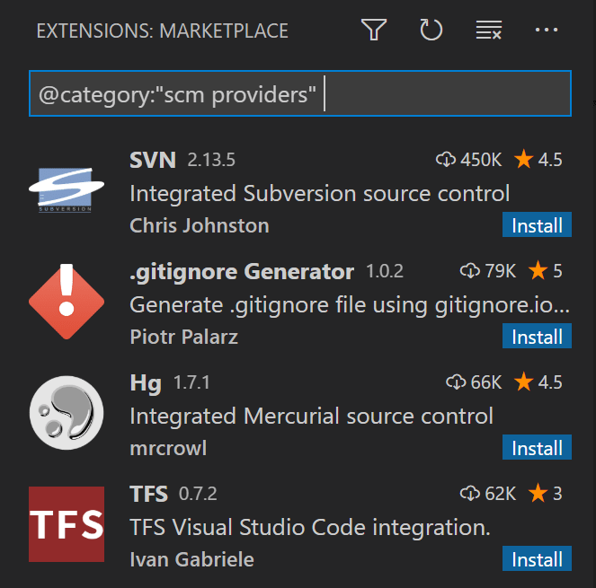

# VS Code에서 Git 소스 제어 사용하기 {#using-git-source-control-in-vs-code}

Visual Studio Code는 통합적인 소스 제어 관리(SCM)를 제공하며, 기본적으로 [Git](https://git-scm.com/) 지원을 포함하고 있습니다. [Visual Studio Marketplace](https://marketplace.visualstudio.com/search?target=VSCode&category=SCM%20Providers&sortBy=Installs)에서는 확장 프로그램을 설치하면 다양한 소스 컨트롤 시스템을 추가로 사용할 수 있습니다.

VS Code의 GitHub Copilot을 사용하면 Commit 메시지, Pull Request를 받고, Commit하기 전에 코드 변경 사항을 검토할 수 있습니다. VS Code에서의 [GitHub Copilot에 대해 더 알아보세요](/docs/copilot/overview.md).

:::tip
아직 Copilot를 구독하지 않았다면, [Copilot 무료 요금제](https://github.com/github-copilot/signup)에 가입하여 무료로 Copilot을 사용할 수 있습니다. 매달 완료 및 채팅 상호작용에 대한 한도가 제공됩니다.
:::

<iframe width="560" height="315" src="https://www.youtube-nocookie.com/embed/i_23KUAEtUM" title="Visual Studio Code에서 Git 사용하기 (공식 초급 튜토리얼)" frameborder="0" allowfullscreen></iframe>

:::tip
Git을 처음 시작하는 경우, [git-scm](https://git-scm.com/doc)을 읽어보세요. 인기 있는 온라인 [자료](https://git-scm.com/book), 시작하기 위한 [비디오](https://git-scm.com/video/what-is-git) 및 [치트 시트](https://github.github.com/training-kit/downloads/github-git-cheat-sheet.pdf)를 제공합니다. VS Code 문서는 Git에 이미 익숙하다고 가정합니다.
:::

## Git 저장소에서 작업하기 {#working-in-a-git-repository}

VS Code는 Git 저장소인 폴더를 열면 이를 인식합니다. 소스 제어 뷰를 사용하면 명령줄을 사용하지 않고도 대부분의 Git 작업을 수행할 수 있습니다.

:::important
**Git이 귀하의 컴퓨터에 설치되어 있는지 확인하세요.** VS Code는 귀하의 컴퓨터에 설치된 Git(최소 버전 `2.0.0`)을 사용하므로, 이러한 기능을 사용하기 전에 [Git을 설치](https://git-scm.com/download)해야 합니다.
:::

소스 제어 뷰는 활동 표시줄에서 **Source Control** 아이콘을 선택하거나 `kb(workbench.view.scm)` 키보드 단축키를 사용하여 접근할 수 있습니다. 변경 사항이 있는 경우, 소스 제어 아이콘은 현재 저장소에 **얼마나 많은 변경 사항**이 있는지를 나타냅니다.

소스 제어 뷰는 현재 저장소 변경 사항의 세부 정보를 보여줍니다: **CHANGES**, **STAGED CHANGES** 및 **MERGE CHANGES**. 또한 [**소스 제어 그래프**](#source-control-graph)를 통해 변경 사항이 저장소의 히스토리와 어떻게 관련되는지 볼 수 있습니다.


소스 제어 뷰에서 파일을 선택하면 해당 파일에 대해 수행한 변경 사항을 차이 편집기에서 볼 수 있습니다.

:::tip
스테이징되지 않은 변경 사항의 경우, 오른쪽 편집기에서 파일을 편집할 수 있습니다: 자유롭게 사용하세요!
:::

또한 VS Code 상태 표시줄의 왼쪽 하단에서 **저장소 상태**의 지표를 찾을 수 있습니다: **현재 브랜치**, **수정된 파일 표시**, 그리고 현재 브랜치의 **들어오는 및 나가는 커밋** 수. 저장소의 어떤 브랜치로 **체크아웃**하려면 상태 지표를 선택하고 목록에서 Git 참조를 선택하세요.

:::tip
Git 저장소의 하위 디렉토리에서 VS Code를 열 수 있습니다. VS Code의 Git 서비스는 여전히 정상적으로 작동하여 저장소 내의 모든 변경 사항을 표시하지만, 스코프가 지정된 디렉토리 외부의 파일 변경 사항은 현재 작업 공간 외부에 위치해 있다는 도구 설명과 함께 음영 처리됩니다.
:::

## 저장소 복제하기 {#cloning-a-repository}

아직 폴더를 열지 않았다면, 소스 제어 뷰는 로컬 컴퓨터에서 **폴더 열기** 또는 **저장소 복제** 옵션을 제공합니다.


**저장소 복제**를 선택하면 원격 저장소의 URL(예: [GitHub](https://github.com/))와 로컬 저장소를 둘 부모 디렉토리를 입력하라는 메시지가 표시됩니다.

GitHub 저장소의 경우, GitHub **Code** 대화 상자에서 URL을 찾을 수 있습니다.


그런 다음 해당 URL을 **Git: Clone** 프롬프트에 붙여넣습니다.


또한 **GitHub에서 복제** 옵션이 표시됩니다. VS Code에서 GitHub 계정으로 인증하면 이름으로 저장소를 검색하고 복제할 저장소를 선택할 수 있습니다. **명령 팔레트**(`kb(workbench.action.showCommands)`)에서 **Git: Clone** 명령을 사용하여 Git 저장소를 복제하는 흐름을 시작할 수도 있습니다. 단계별 안내를 보려면 [VS Code에서 저장소 복제하기](https://www.youtube.com/watch?v=bz1KauFlbQI) 비디오를 확인하세요.

:::note
로컬 컴퓨터에 내용을 복제하지 않고 저장소에서 작업하려면 [GitHub Repositories](https://marketplace.visualstudio.com/items?itemName=github.remotehub) 확장 프로그램을 설치하여 GitHub에서 직접 탐색하고 편집할 수 있습니다. [GitHub Repositories 확장 프로그램](/docs/sourcecontrol/github.md#github-repositories-extension) 섹션에서 자세히 알아보세요.
:::

## 저장소 초기화하기 {#initialize-a-repository}

작업 공간이 로컬 컴퓨터에 있는 경우, **Initialize Repository** 명령을 사용하여 Git 소스 제어를 활성화할 수 있습니다. VS Code가 기존 Git 저장소를 감지하지 못하면 소스 제어 뷰에서 **Initialize Repository** 또는 **Publish to GitHub** 옵션을 제공합니다.


**명령 팔레트**(`kb(workbench.action.showCommands)`)에서 **Git: Initialize Repository** 및 **Publish to GitHub** 명령을 실행할 수도 있습니다.

- **저장소 초기화**: 필요한 Git 저장소 메타데이터 파일을 생성하고 작업 공간 파일을 스테이지할 준비가 된 추적되지 않은 변경 사항으로 표시합니다.
- **GitHub에 게시**: 작업 공간 폴더를 GitHub 저장소에 직접 게시하며, 개인 및 공개 저장소 중에서 선택할 수 있습니다. GitHub에 게시하는 방법에 대한 자세한 정보는 [저장소 게시하기](https://www.youtube.com/watch?v=3BBvBwDW4CY) 비디오를 확인하세요.

## 커밋 {#commit}

**스테이징**(`git add`) 및 **언스테이징**(`git reset`)은 파일의 컨텍스트 작업이나 드래그 앤 드롭을 통해 수행할 수 있습니다.

:::note
**Git 사용자 이름과 이메일을 설정하세요.** 커밋할 때 사용자 이름 및/또는 이메일이 Git 구성에 설정되어 있지 않으면 Git은 로컬 컴퓨터의 정보를 사용합니다. 자세한 내용은 [Git 커밋 정보](https://git-scm.com/docs/git-commit#_commit_information)를 참조하세요.
:::


변경 사항 위에 커밋 메시지를 입력하고 `kbstyle(Ctrl+Enter)` (macOS: `kbstyle(⌘+Enter)`)를 눌러 커밋할 수 있습니다. 스테이지된 변경 사항이 있는 경우, 해당 변경 사항만 커밋됩니다. 그렇지 않으면 어떤 변경 사항을 커밋할지 선택하라는 프롬프트가 표시되며 커밋 설정을 변경할 수 있는 옵션이 제공됩니다.

이러한 방식은 효과적인 작업 흐름으로 자리 잡았습니다. 예를 들어, 이전 스크린샷에서 `overview.png`에 대한 스테이지된 변경 사항만 커밋에 포함됩니다. 이후 스테이징 및 커밋 작업은 `versioncontrol.md`와 두 개의 다른 `.png` 이미지 변경 사항을 별도의 커밋으로 나눠서 반영할 수 있습니다.

보다 구체적인 **Commit** 작업은 소스 제어 뷰 상단의 **Views and More Actions** `...` 메뉴에서 찾을 수 있습니다.


:::tip
잘못된 브랜치에 변경 사항을 커밋한 경우, **명령 팔레트**(`kb(workbench.action.showCommands)`)에서 **Git: Undo Last Commit** 명령을 사용하여 커밋을 취소하세요.
:::

<iframe src="https://www.youtube-nocookie.com/embed/E6ADS2k8oNQ" width="640" height="320" allowFullScreen="true" frameBorder="0" title="Git: Visual Studio Code에서의 커밋"></iframe>

### AI로 커밋 메시지 생성하기 {#generate-a-commit-message-with-ai}

VS Code의 GitHub Copilot은 귀하가 만든 코드 변경 사항을 기반으로 커밋 메시지를 생성할 수 있습니다. 소스 제어 뷰에서 커밋 메시지 입력 상자에 있는 **Generate Commit Message with Copilot** 버튼 (<i class="codicon codicon-sparkle"></i>)을 선택하세요.


조직이나 프로젝트에 대한 커밋 메시지에 대한 특정 요구 사항이 있는 경우, Copilot 사용자 정의 지침을 사용하여 커밋 메시지를 생성할 수 있습니다. 예를 들어, _커밋 메시지는 최대 길이가 60자이며 현재 시제의 동사로 시작해야 합니다_. 커밋 메시지 생성을 위한 [Copilot 사용자 정의 지침](/docs/copilot/copilot-customization.md)에 대한 자세한 내용을 확인하세요.

### 편집기를 사용하여 커밋 메시지 작성하기 {#author-commit-messages-using-an-editor}

변경 사항을 커밋할 때 커밋 메시지를 입력하지 않으면 VS Code는 `COMMIT_EDITMSG` 파일을 위한 편집기를 열어 커밋 메시지를 작성할 수 있습니다. 커밋 메시지를 제공한 후에는 편집기 탭을 닫거나 편집기 도구 모음에서 **Accept Commit Message** 버튼을 선택하여 변경 사항을 커밋할 수 있습니다.

커밋 작업을 취소하려면 텍스트 편집기의 내용을 지우고 편집기 탭을 닫거나 편집기 도구 모음에서 **Discard Commit Message** 버튼을 선택할 수 있습니다.


이 기능은 `setting(git.useEditorAsCommitInput)` 설정을 전환하여 비활성화할 수 있습니다. 설정이 변경된 후에는 VS Code를 다시 시작해야 변경 사항이 적용됩니다.

통합 터미널에서 실행된 git commit 명령에 대해 동일한 흐름을 사용하려면 `setting(git.terminalGitEditor)` 설정을 활성화하세요.

## Git 블레임 정보 {#git-blame-information}

VS Code는 편집기와 상태 표시줄에서 git 블레임 정보를 인라인으로 표시할 수 있습니다. 상태 표시줄 항목이나 인라인 힌트 위에 마우스를 올리면 자세한 git 블레임 정보를 볼 수 있습니다.

git 블레임 정보를 활성화하거나 비활성화하려면 **Git: Toggle Git Blame Editor Decoration** 및 **Git: Toggle Git Blame Status Bar Item** 명령을 사용하거나 다음 설정을 구성하세요:

- `setting(git.blame.statusBarItem.enabled)` (기본적으로 활성화됨)
- `setting(git.blame.editorDecoration.enabled)`

<video src="images/overview/git-blame.mp4" title="편집기 및 상태 표시줄에서 git 블레임 정보 표시." autoplay loop controls muted></video>

편집기와 상태 표시줄에 표시되는 메시지 형식을 `setting(git.blame.editorDecoration.template)` 및 `setting(git.blame.statusBarItem.template)` 설정으로 사용자 정의할 수 있습니다. 가장 일반적인 정보를 위한 변수를 사용할 수 있습니다.

예를 들어, 다음 템플릿은 커밋의 주제, 작성자 이름 및 작성자의 날짜를 현재 기준으로 표시합니다:

```json
{
  "git.blame.editorDecoration.template": "$\{subject\}
, $\{authorName\}
 ($\{authorDateAgo\}
)"
}
```

편집기 장식의 색상을 조정하려면 `git.blame.editorDecorationForeground` 테마 색상을 사용하세요.

## AI로 커밋되지 않은 코드 변경 사항 검토하기 {#review-uncommitted-code-changes-with-ai}

VS Code의 GitHub Copilot은 커밋되지 않은 코드 변경 사항을 검토하는 데 도움을 줄 수 있습니다.

1. 소스 제어 뷰에서 **Copilot 코드 검토** 버튼을 선택하여 커밋되지 않은 변경 사항의 코드 검토를 시작합니다.

   

2. Copilot은 편집기에서 오버레이로 코드 검토 댓글 및 제안을 생성합니다.

   

   **댓글** 패널에서 모든 코드 검토 댓글 목록을 볼 수도 있습니다.

3. 댓글 패널에서 해당 버튼이나 컨텍스트 메뉴 작업을 사용하여 제안을 적용하거나 무시할 수 있습니다.

GitHub 문서에서 [Copilot으로 코드 변경 사항 검토하기](https://docs.github.com/en/copilot/using-github-copilot/code-review/using-copilot-code-review?tool=vscode)에 대한 자세한 내용을 확인하세요.

## 브랜치 및 태그 {#branches-and-tags}

<iframe src="https://www.youtube-nocookie.com/embed/b9LTz6joMf8?clip=Ugkxcq7zDGA4aMi8p7lICNMzTANn_8ozU5gK&amp;clipt=EPiBAxj08QU" width="640" height="320" allowFullScreen="true" frameBorder="0" title="Visual Studio Code에서 Git 브랜치 생성하기"></iframe>

VS Code 내에서 **Git: Create Branch** 및 **Git: Checkout to** 명령을 통해 브랜치를 직접 생성하고 체크아웃할 수 있습니다.

**Git: Checkout to**를 실행하면 현재 저장소의 모든 브랜치 또는 태그가 포함된 드롭다운 목록이 표시됩니다. 더 나은 옵션이라고 판단되면 새 브랜치를 생성하거나 분리 모드에서 브랜치를 체크아웃할 수 있는 옵션도 제공됩니다.


**Git: Create Branch** 명령을 사용하면 새 브랜치를 빠르게 생성할 수 있습니다. 새 브랜치의 이름을 제공하면 VS Code가 브랜치를 생성하고 해당 브랜치로 전환합니다. **...에서 새 브랜치 생성**을 선택하면 새 브랜치가 가리킬 커밋을 지정할 수 있는 추가 프롬프트가 표시됩니다.

> [!TIP]
> VS Code는 다른 브랜치로 전환할 때 열린 편집기를 자동으로 저장하고 복원할 수 있습니다. 이 기능을 활성화하려면 `setting(scm.workingSets.enabled)` 설정을 사용하세요. 처음 브랜치로 전환할 때 열린 편집기를 제어하려면 `setting(scm.workingSets.default)` 설정을 사용할 수 있습니다.

## 원격 {#remotes}

저장소가 원격에 연결되어 있고 체크아웃된 브랜치가 해당 원격의 브랜치에 대한 [업스트림 링크](https://git-scm.com/book/ch3-5.html)를 가지고 있는 경우, VS Code는 해당 브랜치를 **푸시**, **풀**, 및 **동기화**하는 유용한 작업을 제공합니다(후자는 **풀** 명령을 실행한 후 **푸시** 명령을 실행합니다). 이러한 작업은 **보기 및 추가 작업** `...` 메뉴에서 찾을 수 있으며, **원격 추가 또는 제거** 옵션도 포함되어 있습니다.

VS Code는 주기적으로 원격에서 변경 사항을 가져올 수 있습니다. 이를 통해 VS Code는 로컬 저장소가 원격보다 얼마나 앞서거나 뒤쳐져 있는지를 보여줍니다. 이 기능은 기본적으로 비활성화되어 있으며, `setting(git.autofetch)` [설정](/docs/editor/settings.md)을 사용하여 활성화할 수 있습니다.

> [!TIP]
> VS Code가 Git 원격과 통신할 때마다 자격 증명을 묻는 것을 피하려면 [자격 증명 도우미를 설정](https://docs.github.com/get-started/getting-started-with-git/caching-your-github-credentials-in-git)해야 합니다. 이를 수행하지 않으면, `setting(git.autofetch)` [설정](/docs/editor/settings.md)을 통해 자동 가져오기를 비활성화하여 프롬프트 수를 줄이는 것을 고려할 수 있습니다.

## 소스 제어 그래프 {#source-control-graph}

원격 저장소가 구성되어 있으면 원격보다 얼마나 많은 커밋이 앞서거나 뒤쳐져 있는지를 볼 수 있습니다. 소스 제어 뷰의 **그래프** 섹션은 들어오는 및 나가는 커밋의 그래픽 표현을 보여줍니다.

그래프에는 현재 브랜치, 현재 브랜치의 업스트림 브랜치 및 선택적 기본 브랜치가 포함됩니다. 그래프의 루트는 이러한 브랜치의 공통 조상입니다.


그래프는 다음 기능을 제공합니다:

- 항목을 선택하여 해당 커밋의 변경 사항을 확인합니다.
- **들어오는/나가는** 제목 위에 마우스를 올려 **가져오기**, **풀**, 및 **푸시** 작업을 수행합니다.

## Git 상태 표시줄 작업 {#git-status-bar-actions}

현재 체크아웃된 브랜치에 업스트림 브랜치가 구성되어 있을 때 상태 표시줄에 **변경 동기화** 작업이 표시됩니다. **변경 동기화**는 원격 변경 사항을 로컬 저장소로 가져온 후 로컬 커밋을 업스트림 브랜치로 푸시합니다.


업스트림 브랜치가 구성되어 있지 않고 Git 저장소에 원격이 설정되어 있는 경우, **게시** 작업이 활성화됩니다. 이를 통해 현재 브랜치를 원격에 게시할 수 있습니다.


## 거터 지표 {#gutter-indicators}

Git 저장소인 폴더를 열고 변경 사항을 만들기 시작하면 VS Code는 거터와 개요 눈금자에 유용한 주석을 추가합니다.

- 빨간 삼각형은 삭제된 줄을 나타냅니다.
- 녹색 막대는 새로 추가된 줄을 나타냅니다.
- 파란 막대는 수정된 줄을 나타냅니다.


## 병합 충돌 {#merge-conflicts}


VS Code는 병합 충돌을 인식합니다. 차이점이 강조 표시되며, 두 가지 변경 사항 중 하나 또는 둘 다를 수락할 수 있는 인라인 작업이 있습니다. 충돌이 해결되면 충돌하는 파일을 스테이지하여 해당 변경 사항을 커밋할 수 있습니다.

## 3-way 병합 편집기 {#3-way-merge-editor}

병합 충돌을 해결하는 데 도움을 주기 위해 VS Code는 들어오는 변경 사항과 현재 변경 사항을 상호작용적으로 수락하고 결과 병합 파일을 보고 편집할 수 있는 3-way 병합 편집기를 제공합니다. 3-way 병합 편집기는 Git 병합 충돌이 있는 파일의 오른쪽 하단에 있는 **병합 편집기에서 해결** 버튼을 선택하여 열 수 있습니다.

3-way 병합 편집기는 **들어오는** 변경 사항(왼쪽), **현재** 변경 사항(오른쪽), 및 병합의 **결과**(하단)에 대한 별도의 보기를 표시합니다. 충돌이 강조 표시되며 CodeLens 버튼을 사용하여 해결할 수 있습니다.


### 충돌 해결하기 {#resolving-conflicts}

3-way 병합 편집기를 사용하면 하나 또는 두 가지 변경 사항을 수락하여 충돌을 해결할 수 있습니다. 또한 병합 결과를 수동으로 편집할 수 있습니다.

일부 충돌의 경우 병합 편집기는 **조합 수락** 버튼을 표시합니다. 조합을 수락하면 두 가지 변경 사항을 스마트하게 병합하여 현재 충돌을 해결합니다. 이는 동일한 줄에서 변경 사항이 있지만 동일한 문자를 건드리지 않는 경우에 특히 유용합니다.

**무시** 버튼을 사용하여 들어오는 변경 사항이나 현재 변경 사항을 모두 수락하지 않고 충돌을 해결된 것으로 표시할 수 있습니다. 이는 충돌 영역을 변경 사항이 발생하기 전 상태로 재설정합니다.

### 병합 완료하기 {#completing-the-merge}

결과 편집기의 오른쪽에 있는 충돌 카운터를 사용하여 얼마나 많은 해결되지 않은 충돌이 남아 있는지 추적할 수 있습니다. 카운터를 클릭하면 다음 해결되지 않은 충돌로 이동합니다. 모든 충돌이 해결되면 오른쪽 하단에서 **병합 완료**를 선택하여 병합을 완료할 수 있습니다. 이렇게 하면 파일이 스테이지되고 병합 편집기가 닫힙니다.

### 대체 레이아웃 및 기타 {#alternative-layouts-and-more}

병합 편집기의 오른쪽 상단에 있는 세 개의 점(**···**)을 선택하면 추가 옵션이 포함된 컨텍스트 메뉴가 열립니다. 수직 레이아웃으로 전환하고 기본 보기를 표시하여 변경 사항이 발생하기 전의 파일 상태를 보여줄 수 있습니다.

**들어오는**, **현재**, 및 **결과** 옆의 세 개의 점은 각 보기의 옵션을 제공합니다. 예를 들어, 기본에 대한 나란히 비교를 표시하거나 모든 변경 사항을 수락하거나 결과를 재설정하는 등의 옵션이 있습니다.

### 충돌 이해하기 {#understanding-conflicts}

3-way 병합 편집기가 작동하는 방식에 대한 자세한 내용을 배우고 싶다면 다음 비디오를 추천합니다:

<iframe width="560" height="315" src="https://www.youtube-nocookie.com/embed/HosPml1qkrg" title="병합 충돌에 대한 EXTREMELY 유용한 가이드" frameborder="0" allow="accelerometer; autoplay; clipboard-write; encrypted-media; gyroscope; picture-in-picture; web-share" allowfullscreen></iframe>

## 차이 보기 {#viewing-diffs}

우리의 Git 도구는 VS Code 내에서 차이를 보는 것을 지원합니다.


차이 편집기에는 중간에 별도의 거터가 있어 코드 블록의 변경 사항을 **스테이지**하거나 **되돌릴** 수 있습니다. 텍스트 블록을 선택하면 선택된 변경 사항을 되돌리거나 스테이지할 수 있습니다.


> [!TIP]
> 두 파일의 차이를 보려면 먼저 탐색기 보기에서 파일을 마우스 오른쪽 버튼으로 클릭하고 **비교를 위해 선택**을 선택한 다음 두 번째 파일을 마우스 오른쪽 버튼으로 클릭하여 **선택한 파일과 비교**를 선택하세요. 또는 명령 팔레트(`kb(workbench.action.showCommands)`)를 열고 **파일: 비교** 명령 중 하나를 선택하세요. VS Code에서 파일을 [비교하는 다양한 옵션](https://docs/editor/codebasics.md#compare-files)에 대해 더 알아보세요.

### 접근 가능한 차이 뷰어 {#accessible-diff-viewer}

차이 편집기에는 통합 패치 형식으로 변경 사항을 표시하는 접근 가능한 차이 뷰어가 있습니다. **다음 차이로 이동**(`kb(editor.action.accessibleDiffViewer.next)`) 및 **이전 차이로 이동**(`kb(editor.action.accessibleDiffViewer.prev)`)를 사용하여 변경 사항 간에 탐색할 수 있습니다. 화살표 키를 사용하여 줄을 탐색할 수 있으며, `kbstyle(Enter)`를 누르면 차이 편집기로 돌아가 선택된 줄로 이동합니다.


> [!NOTE]
> 이 경험은 스크린 리더 사용자에게 특히 유용합니다.

## 타임라인 보기 {#timeline-view}

기본적으로 파일 탐색기 하단에서 접근할 수 있는 타임라인 뷰는 파일에 대한 시간 시리즈 이벤트(예: Git 커밋)를 시각화하는 통합된 보기입니다.


VS Code의 내장 Git 지원은 지정된 파일의 Git 커밋 기록을 제공합니다. 커밋을 선택하면 해당 커밋에 의해 도입된 변경 사항의 차이 보기로 열립니다. 커밋을 마우스 오른쪽 버튼으로 클릭하면 **커밋 ID 복사** 및 **커밋 메시지 복사** 옵션이 표시됩니다.

Visual Studio Code는 VS Code Marketplace에서 사용할 수 있는 [확장 프로그램](https://docs/editor/extension-marketplace.md)을 통해 더 많은 Git 기록 작업 흐름을 지원합니다.

<div class="marketplace-extensions-scm-history-curated"></div>

> [!TIP]
> 확장 타일을 클릭하여 Marketplace에서 설명 및 리뷰를 읽어보세요.

## Git 출력 창 {#git-output-window}

우리가 사용하는 Git 명령을 항상 확인할 수 있습니다. 이는 무언가 이상한 일이 발생하거나 단순히 궁금할 때 유용합니다. :)

Git 출력 창을 열려면 **보기** > **출력**을 실행하고 드롭다운 목록에서 **로그 (Git)**를 선택하세요.

## VS Code를 Git 편집기로 사용하기 {#vs-code-as-git-editor}

명령줄에서 VS Code를 실행할 때 `--wait` 인수를 전달하면 새 VS Code 인스턴스를 닫을 때까지 실행 명령이 대기하게 됩니다. 이는 VS Code를 Git 외부 편집기로 구성할 때 유용하여 Git이 실행된 VS Code 인스턴스를 닫을 때까지 대기하게 할 수 있습니다.

다음은 그 방법입니다:

1. 명령줄에서 `code --help`를 실행할 수 있고 도움이 표시되는지 확인하세요.
   - 도움이 표시되지 않으면 다음 단계를 따르세요:
     - macOS: **명령 팔레트**에서 **Shell Command: Install 'Code' command in path**를 선택하세요.
     - Windows: 설치 중 **Add to PATH**를 선택했는지 확인하세요.
     - Linux: 새로운 `.deb` 또는 `.rpm` 패키지를 통해 Code를 설치했는지 확인하세요.
2. 명령줄에서 `git config --global core.editor "code --wait"`를 실행하세요.

이제 `git config --global -e`를 실행하여 Git 구성을 위한 편집기로 VS Code를 사용할 수 있습니다.

### VS Code를 Git 차이 도구 및 병합 도구로 사용하기 {#vs-code-as-git-difftool-and-mergetool}

명령줄에서 Git을 사용할 때도 VS Code의 차이 및 병합 기능을 사용할 수 있습니다. 다음을 Git 구성에 추가하여 VS Code를 차이 및 병합 도구로 사용하세요:

```ini
[diff]
    tool = default-difftool
[difftool "default-difftool"]
    cmd = code --wait --diff $LOCAL $REMOTE
[merge]
    tool = code
[mergetool "code"]
    cmd = code --wait --merge $REMOTE $LOCAL $BASE $MERGED
```

이것은 VS Code에 두 파일을 나란히 비교할 수 있는 `--diff` 옵션을 전달하는 것입니다. 병합 도구는 Git이 병합 충돌을 발견할 때 다음에 사용됩니다.

요약하자면, VS Code를 편집기로 사용할 수 있는 몇 가지 예는 다음과 같습니다:

- `git rebase HEAD~3 -i` VS Code를 사용하여 대화형 리베이스 수행
- `git commit` VS Code를 사용하여 커밋 메시지 작성
- `git add -p` 다음에 `kbstyle(e)`를 사용하여 대화형 추가
- `git difftool <commit>^ <commit>` VS Code를 차이 편집기로 사용하여 변경 사항 비교

## GitHub 풀 요청 및 문제 작업하기 {#working-with-github-pull-requests-and-issues}

Visual Studio Code는 GitHub의 풀 요청 및 문제를 가져올 수 있습니다. VS Code에서 PR을 생성하고, 댓글로 검토하며, 컨텍스트를 전환하지 않고 승인할 수 있습니다. VS Code에서 [GitHub PR 및 문제에 대해 더 알아보세요](/docs/sourcecontrol/github.md).

## SCM 제공자 {#scm-providers}

<div class="marketplace-extensions-scm-curated"></div>

> [!TIP]
> 확장 타일을 클릭하여 Marketplace에서 설명 및 리뷰를 읽어보세요.

VS Code는 여러 소스 제어 제공자를 동시에 처리할 수 있는 지원을 제공합니다. 예를 들어, Azure DevOps Server 로컬 작업 공간과 함께 여러 Git 저장소를 열고 프로젝트 간에 원활하게 작업할 수 있습니다. **소스 제어 제공자** 보기를 활성화하려면 **소스 제어** 보기의 오버플로 메뉴(`kb(workbench.view.scm)`)를 선택하고 **보기** 위에 마우스를 올린 다음 **소스 제어 저장소**가 체크 표시되어 있는지 확인하세요. **소스 제어 제공자** 뷰는 감지된 제공자 및 저장소를 보여주며, 특정 제공자를 선택하여 변경 사항의 표시 범위를 조정할 수 있습니다.


### SCM 제공자 확장 프로그램 {#scm-provider-extensions}

다른 SCM 제공자를 설치하려면 **확장** 보기(`kb(workbench.view.extensions)`)에서 **scm 제공자** 확장 카테고리를 검색할 수 있습니다. '@ca'를 입력하기 시작하면 디버거 및 린터와 같은 확장 카테고리에 대한 제안이 표시됩니다. `@category:"scm providers"`를 선택하여 사용 가능한 SCM 제공자를 확인하세요.



## 다음 단계 {#next-steps}

- [소개 비디오 - Git 버전 관리](/docs/introvideos/versioncontrol.md) - VS Code Git 지원에 대한 개요를 제공하는 소개 비디오입니다.

- [GitHub에서 협업하는 방법 소개](/docs/sourcecontrol/github.md) - VS Code와 함께 GitHub를 사용하는 방법을 배워보세요.

- [Copilot VS Code에 대해 더 알아보세요](/docs/copilot/overview.md) - VS Code에서 Copilot에 대해 알아보세요.

- [소스 제어 API](/api/extension-guides/scm-provider.md) - 다른 소스 제어 제공자를 VS Code에 통합하려면 소스 제어 API를 참조하세요.
