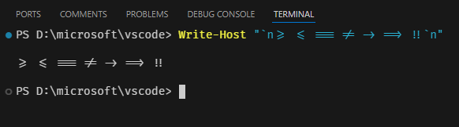

# 터미널 외관 {#terminal-appearance}

Visual Studio Code의 터미널 외관은 광범위하게 사용자 정의할 수 있습니다.


_[Sapphire](https://marketplace.visualstudio.com/items?itemName=tyriar.theme-sapphire) 테마와 [Hack](https://sourcefoundry.org/hack/) 글꼴을 사용한 사용자 정의 [Starship](https://starship.rs/) 프롬프트, [Nerd Font](https://www.nerdfonts.com/) 기호 포함_

## 텍스트 스타일 {#text-style}

터미널의 텍스트는 다음 설정으로 사용자 정의할 수 있습니다:

- `setting(terminal.integrated.fontFamily)`: 사용할 글꼴 패밀리로, CSS의 fontFamily 형식과 동일한 문자열을 사용합니다. 예를 들어, `"'Fira Code', monospace"`는 `Fira Code`를 기본 글꼴로 설정하고, 글리프가 부족할 경우 `monospace`를 대체 글꼴로 설정합니다.
- `setting(terminal.integrated.fontSize)`: 터미널의 텍스트 크기를 변경합니다.
- `setting(terminal.integrated.letterSpacing)`: 문자 간의 추가 수평 간격을 픽셀 단위로 설정합니다.
- `setting(terminal.integrated.lineHeight)`: 일반 줄 높이의 배수로서 문자 간의 추가 수직 간격을 설정합니다. 예를 들어, `1.1`은 10%의 추가 수직 공간을 추가합니다.
- `setting(terminal.integrated.fontWeight)`: "일반" 텍스트의 글꼴 두께를 설정합니다.
- `setting(terminal.integrated.fontWeightBold)`: "굵게" 텍스트의 글꼴 두께를 설정합니다.
- `terminal.integrated.fontLigatures.*`: [리가처 설정](#ligatures).

### Powerline 기호 및 Nerd Fonts {#powerline-symbols-and-nerd-fonts}

[Powerline](https://powerline.readthedocs.io) 글꼴은 터미널에서 사용할 수 있는 추가 문자를 포함하는 특별한 패치된 글꼴입니다. VS Code의 터미널은 [글꼴을 설정하지 않고도 일부 Powerline 기호를 렌더링](#custom-glyphs)하지만, 더 많은 글리프가 필요할 경우 글꼴 패밀리 설정으로 Powerline 글꼴을 구성해야 합니다. Powerline 글꼴은 일반적으로 `" for Powerline"`으로 끝나며, 다음 설정은 패치된 DejaVu Sans Mono를 구성하는 예입니다:

```json
"editor.fontFamily": "'DejaVu Sans Mono for Powerline'"
```

Nerd Fonts도 동일하게 작동하며 일반적으로 `" NF"` 접미사가 붙습니다. 다음은 Hack의 nerd fonts 변형을 구성하는 예입니다:

```json
"terminal.integrated.fontFamily": "'Hack NF'"
```

## 터미널 커서 {#terminal-cursor}

터미널 커서 스타일과 깜박임 여부는 다음 설정으로 사용자 정의할 수 있습니다:

- `setting(terminal.integrated.cursorStyle)`: 커서의 모양을 정의하며, 블록, 선 또는 밑줄로 설정할 수 있습니다.
- `setting(terminal.integrated.cursorWidth)`: 커서 스타일이 `line`으로 설정될 때 커서의 너비를 픽셀 단위로 설정합니다.
- `setting(terminal.integrated.cursorBlinking)`: 터미널이 포커스될 때 커서가 깜박일지 여부를 설정합니다.
- `setting(terminal.integrated.cursorStyleInactive)`: 커서의 모양을 정의하며, 윤곽선, 블록, 선, 밑줄 또는 없음으로 설정할 수 있습니다.

## 탭 사용자 정의 {#customizing-tabs}

기본적으로 두 개 이상의 터미널이 있을 때 터미널 뷰의 오른쪽에 탭이 나타나며, 하나의 터미널만 있을 경우 활성 터미널이 뷰 헤더에 표시됩니다.


### 가시성 {#visibility}

기본 가시성은 수평 공간을 절약하기 위해 설계되었지만, 바람직하지 않을 수 있습니다. 탭의 표시 방법은 다음 설정으로 구성할 수 있습니다:

- `setting(terminal.integrated.tabs.hideCondition)`: 오른쪽의 탭을 숨길 시점을 설정하며, `"never"`로 설정하면 항상 표시됩니다.
- `setting(terminal.integrated.tabs.showActiveTerminal)`: 터미널 뷰 헤더에 활성 터미널을 표시할 시점을 설정합니다.
- `setting(terminal.integrated.tabs.showActions)`: 뷰 헤더에 활성 터미널의 작업을 표시할 시점을 설정합니다.
- `setting(terminal.integrated.tabs.location)`: 탭을 터미널의 왼쪽 또는 오른쪽에 표시할지 여부를 설정합니다.
- `setting(terminal.integrated.tabs.enabled)`: 탭을 사용할지 여부를 설정하며, 비활성화하면 원래 드롭다운 뷰가 표시됩니다.

### 탭 텍스트 {#tab-text}

각 탭의 텍스트는 다음 설정에 의해 결정됩니다:

- `setting(terminal.integrated.tabs.title)`: 탭 제목.
- `setting(terminal.integrated.tabs.description)`: 제목 오른쪽에 표시되는 텍스트.
- `setting(terminal.integrated.tabs.separator)`: 제목과 설명 사이의 구분 기호.

기본적으로 제목은 셸이 감지한 프로세스 이름을 표시합니다.

다른 터미널은 종종 셸에서 전송된 이스케이프 시퀀스를 제목으로 표시하며, 이는 다음과 같이 구성할 수 있습니다:

```json
"terminal.integrated.tabs.title": "$\{sequence\}
"
```

사용 가능한 모든 변수는 다음과 같습니다:

- `$\{cwd\}
`: 터미널의 현재 작업 디렉토리.
- `$\{cwdFolder\}
`: 터미널의 현재 작업 디렉토리로, 다중 루트 작업 공간 또는 초기 작업 디렉토리와 값이 다른 단일 루트 작업 공간에서 표시됩니다. Windows에서는 셸 통합이 활성화된 경우에만 표시됩니다.
- `$\{workspaceFolder\}
`: 터미널이 시작된 작업 공간.
- `$\{workspaceFolderName\}
`: 터미널이 시작된 작업 공간의 이름.
- `$\{local\}
`: 원격 작업 공간의 로컬 터미널을 나타냅니다.
- `$\{process\}
`: 터미널 프로세스의 이름.
- `$\{progress\}
`: OSC `9;4` 시퀀스에 의해 보고된 진행 상태.
- `$\{separator\}
`: 값이 있는 변수 또는 정적 텍스트로 둘러싸일 때만 표시되는 조건부 구분 기호 (-).
- `$\{sequence\}
`: 프로세스에 의해 터미널에 제공된 이름.
- `$\{task\}
`: 이 터미널이 작업과 연결되어 있음을 나타냅니다.
- `$\{shellType\}
`: 감지된 셸 유형.
- `$\{shellCommand\}
`: 셸 통합에 따라 실행 중인 명령. 이는 감지된 명령 줄에 대한 높은 신뢰도가 필요하며, 일부 프롬프트 프레임워크에서는 작동하지 않을 수 있습니다.
- `$\{shellPromptInput\}
`: 셸 통합에 따라 셸의 전체 프롬프트 입력.

### 아이콘 {#icons}

각 터미널에는 [터미널 프로필](/docs/terminal/profiles.md)에 의해 결정되는 관련 아이콘이 있습니다. 프로필에 정의되지 않은 경우 사용할 기본 아이콘과 색상은 `setting(terminal.integrated.tabs.defaultIcon)` 및 `setting(terminal.integrated.tabs.defaultColor)` 설정으로 구성할 수 있습니다.

### 상태 {#status}

터미널의 "상태"가 있을 경우, 탭 오른쪽에 나타나는 아이콘으로 표시됩니다. 일부 상태는 애니메이션을 포함합니다. 이 애니메이션이 방해가 된다면 다음과 같이 비활성화할 수 있습니다:

```json
"terminal.integrated.tabs.enableAnimation": false
```

### 시각적 벨 {#visual-bell}

터미널의 벨이 울릴 때 노란색 벨 아이콘이 잠시 표시됩니다. 이는 `setting(terminal.integrated.enableBell)`로 비활성화할 수 있으며, 지속 시간은 `setting(terminal.integrated.bellDuration)`으로 구성할 수 있습니다.

## 터미널 색상 {#terminal-colors}

터미널은 실제 색상을 표시할 수 있지만, 프로그램은 일반적으로 8개의 ANSI 색상(검정, 빨강, 초록, 노랑, 파랑, 자홍, 청록 및 흰색)과 각 색상의 밝은 변형을 사용합니다. 이러한 ANSI 색상은 활성 [색상 테마](/docs/editor/themes.md)에 의해 결정되지만, [workbench.colorCustomizations](/docs/editor/themes.md#workbench-colors) 설정으로 테마와 독립적으로 구성할 수도 있습니다.

굵은 텍스트가 일반 ANSI 색상을 사용할지 아니면 밝은 변형을 사용할지는 `setting(terminal.integrated.drawBoldTextInBrightColors)` 설정으로 구성할 수 있습니다.

### 최소 대비 비율 {#minimum-contrast-ratio}

터미널은 어두운/밝은 테마, ANSI 색상 또는 실행 중인 셸/프로그램과의 충돌로 인해 종종 대비 문제가 발생합니다.

최소 대비 비율 기능은 텍스트의 전경 색상의 밝기를 증가시키거나 감소시켜 4.5:1의 대비 비율을 충족하도록 문제를 해결합니다.

이 기능의 단점 중 하나는 색상이 일부 포화도를 잃을 수 있다는 것입니다. 이 기능은 다음과 같이 구성하거나 비활성화하여 원래 색상을 얻을 수 있습니다:

```json
"terminal.integrated.minimumContrastRatio": 1
```

## 리가처 {#ligatures}

터미널 [리가처](<https://en.wikipedia.org/wiki/Ligature_(writing)>)는 여러 문자를 하나로 렌더링할 수 있게 해줍니다. 터미널 글꼴 패밀리(`setting(terminal.integrated.fontFamily)`)가 이를 지원하는 경우, `setting(terminal.integrated.fontLigatures.enabled)` 설정을 구성하여 터미널에서 리가처를 활성화할 수 있습니다.



### 글꼴 기능 설정 {#font-feature-settings}

리가처가 활성화되면, [`font-feature-settings`](https://developer.mozilla.org/en-US/docs/Web/CSS/font-feature-settings) CSS 속성 형식으로 글꼴 기능 설정의 세부 목록을 설정할 수 있습니다. 이를 통해 리가처가 렌더링되는 방식을 보다 세밀하게 제어할 수 있습니다. 예를 들어, 표준 `calt` 리가처를 비활성화하고 특정 글꼴 변형을 활성화하는 것은 `"calt" off, "ss03"`와 같은 형태입니다. 글꼴이 지원하는 변형 목록은 글꼴의 문서를 참조하십시오.

### 대체 리가처 {#fallback-ligatures}

글꼴이 리가처를 지원하지만 VS Code가 해당 글꼴을 파싱하는 것을 지원하지 않는 경우, [GPU 가속](#gpu-acceleration)을 비활성화하거나 수동으로 결합할 문자 시퀀스 목록을 지정할 수 있습니다.

기본적으로 대체 리가처는 코딩에 사용되는 일반적인 리가처 목록입니다. `setting(terminal.integrated.fontLigatures.fallbackLigatures)` 설정을 구성하여 목록을 세밀하게 조정할 수 있습니다. 예를 들어:

```json
// `ff`, `fi` 및 `fl`에 대해서만 리가처 사용
"terminal.integrated.fontLigatures.fallbackLigatures": [
    "ff",
    "fi",
    "fl"
]
```

## GPU 가속 {#gpu-acceleration}

터미널은 서로 다른 두 가지 렌더러를 제공하며, 각각 다른 장단점이 있습니다:

- WebGL 렌더러 - 실제 GPU 가속.
- DOM 렌더러 - 훨씬 느리지만 호환성이 뛰어난 대체 렌더러.

WebGL 렌더러에 의해 구동되는 GPU 가속은 기본적으로 터미널에서 활성화되어 있습니다. 이는 CPU가 각 프레임을 렌더링하는 데 소요되는 시간을 크게 줄여 터미널이 더 빠르게 작동하고 높은 FPS로 표시되도록 도와줍니다.

기본 `setting(terminal.integrated.gpuAcceleration)` 값인 `"auto"`는 WebGL 렌더러를 시도하고 실패할 경우 DOM 렌더러로 대체됩니다. Linux VM, WebGL을 지원하지 않는 브라우저 또는 오래된 드라이버가 있는 머신에서는 WebGL이 제대로 작동하지 않을 수 있습니다.

### 사용자 정의 글리프 {#custom-glyphs}

[GPU 가속](#gpu-acceleration)이 활성화되면, 글꼴 대신 사용자 정의 렌더링이 터미널에서 일부 문자의 표시 방식을 개선합니다. 여기에는 박스 그리기 문자(`U+2500-U+257F`), 블록 요소(`U+2580-U+259F`) 및 일부 Powerline 기호(`U+E0B0-U+E0BF`)가 포함됩니다. 이는 구성된 글꼴이 이러한 문자를 지원할 필요가 없으며, 문자가 픽셀 완벽하게 그려지고 전체 셀 크기로 늘어나는 것을 의미합니다.

아래는 사용자 정의 줄 높이 및 문자 간격이 구성된 이러한 문자의 몇 가지 예입니다. 사용자 정의 글리프 덕분에 셀 간의 간격이 없음을 주목하세요:


이 기능은 `"terminal.integrated.customGlyphs": false`로 설정하여 비활성화할 수 있습니다.

## 프롬프트 사용자 정의 {#customizing-your-prompt}

대부분의 셸은 터미널 프롬프트를 광범위하게 사용자 정의할 수 있습니다. 이는 일반적으로 `$PS1` 변수를 수정하거나 `$PROMPT_COMMAND`를 설정하거나 플러그인을 설치하여 VS Code 외부에서 셸을 구성함으로써 이루어집니다.

[Starship](https://starship.rs/) 및 [oh-my-posh](https://ohmyposh.dev/)와 같은 일부 프롬프트는 git 상태와 같은 정보를 표시하며 대부분의 셸과 호환되므로 시작할 때 좋은 선택입니다.

## 자주 묻는 질문 {#common-questions}

### 내 터미널에 다채로운 삼각형이나 검은색 사각형이 표시되는 이유는 무엇인가요? {#why-is-my-terminal-showing-a-multi-colored-triangle-or-a-black-rectangle}

터미널은 일부 환경에서 GPU 가속 렌더링에 문제가 발생할 수 있습니다. 예를 들어, 텍스트 대신 큰 다채로운 삼각형이 표시될 수 있습니다. 이는 일반적으로 드라이버/VM 그래픽 문제로 인해 발생하며, Chromium에서도 동일한 문제가 발생합니다. 이러한 문제를 우회하려면 `--disable-gpu` 플래그와 함께 `code`를 실행하거나 `"terminal.integrated.gpuAcceleration": "off"` 설정을 사용하여 터미널에서 캔버스를 사용하지 않도록 설정하십시오. 자세한 내용은 [GPU 가속](#gpu-acceleration) 섹션을 참조하십시오.

### 터미널의 색상이 올바르지 않은 이유는 무엇인가요? {#why-are-the-colors-in-the-terminal-not-correct}

[최소 대비 비율 기능](#minimum-contrast-ratio)으로 인해 색상이 예상대로 표시되지 않을 수 있습니다. 이는 다음과 같이 비활성화할 수 있습니다:

```json
"terminal.integrated.minimumContrastRatio": 1
```

이것이 기본값인 이유에 대한 배경은 [vscode#146406](https://github.com/microsoft/vscode/issues/146406#issuecomment-1084825473)에서 설명되어 있습니다.
---