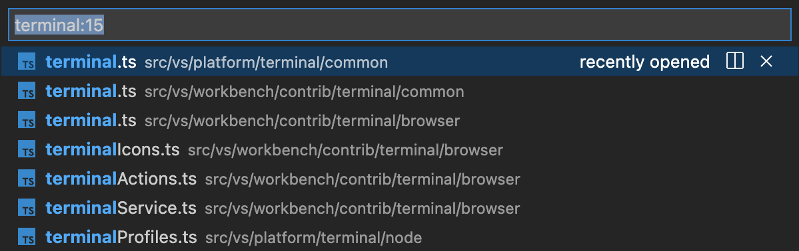

# 터미널 기본 사항 {#terminal-basics}

Visual Studio Code에는 작업 공간의 루트에서 시작하는 완전한 기능을 갖춘 통합 터미널이 포함되어 있습니다. 이 터미널은 편집기와 통합되어 [링크](#links) 및 [오류 감지](/docs/editor/tasks.md)와 같은 기능을 지원합니다. 통합 터미널은 독립형 터미널처럼 mkdir 및 git과 같은 명령을 실행할 수 있습니다.

터미널을 여는 방법은 다음과 같습니다:

* 메뉴에서 **Terminal** > **New Terminal** 또는 **View** > **Terminal** 메뉴 명령을 사용합니다.
* **Command Palette** (`kb(workbench.action.showCommands)`)에서 **View: Toggle Terminal** 명령을 사용합니다.
* 탐색기에서 **Open in Integrated Terminal** 컨텍스트 메뉴 명령을 사용하여 폴더에서 새 터미널을 엽니다.
* 터미널 패널을 전환하려면 `kb(workbench.action.terminal.toggleTerminal)` 키보드 단축키를 사용합니다.
* 새 터미널을 만들려면 `kb(workbench.action.terminal.new)` 키보드 단축키를 사용합니다.

VS Code의 터미널에는 명령이 실행되는 위치를 추적하는 추가 기능인 셸 통합이 있습니다. 이는 명령의 왼쪽과 스크롤바에 장식으로 표시됩니다:


:::note
VS Code 외부에서 작업하는 것을 선호하는 경우 `kb(workbench.action.terminal.openNativeConsole)` 키보드 단축키를 사용하여 외부 터미널을 엽니다.
:::

## 터미널 셸 {#terminal-shells}

통합 터미널은 시스템 기본값에서 가져온 기본값을 포함하여 머신에 설치된 다양한 셸을 사용할 수 있습니다. 셸은 감지되어 터미널 프로필 드롭다운에 표시됩니다.


터미널 셸 구성에 대한 자세한 내용은 [터미널 프로필](/docs/terminal/profiles.md) 문서를 참조하세요.

## 터미널 관리 {#managing-terminals}

터미널 탭 UI는 터미널 뷰의 오른쪽에 있습니다. 각 터미널은 이름, 아이콘, 색상 및 그룹 장식(있는 경우)과 함께 항목을 가집니다.


**TERMINAL** 패널의 오른쪽 상단에 있는 **+** 아이콘을 선택하거나 터미널 드롭다운에서 프로필을 선택하거나 `kb(workbench.action.terminal.new)` 명령을 트리거하여 터미널 인스턴스를 추가합니다. 이 작업은 해당 터미널과 연결된 탭 목록에 또 다른 항목을 생성합니다.

탭 위에 마우스를 올리고 **Trash Can** 버튼을 선택하거나 탭 항목을 선택하고 `kbstyle(Delete)`를 눌러 터미널 인스턴스를 제거합니다. **Terminal: Kill the Active Terminal Instance** 명령을 사용하거나 마우스 오른쪽 버튼 클릭 컨텍스트 메뉴를 통해서도 가능합니다.

터미널 그룹 간에 탐색하려면 다음 포커스를 사용하여 `kb(workbench.action.terminal.focusNext)` 및 이전 포커스를 사용하여 `kb(workbench.action.terminal.focusPrevious)`를 사용합니다.

터미널 상태가 변경되면 탭 레이블의 터미널 제목 오른쪽에 아이콘이 나타날 수 있습니다. 예를 들어, macOS에서는 벨 아이콘이 표시되며, 작업의 경우 오류가 없을 때 체크 마크가 표시되고 그렇지 않으면 X가 표시됩니다. 아이콘에 마우스를 올리면 상태 정보가 표시되며, 여기에는 작업이 포함될 수 있습니다.

### 그룹(분할 창) {#groups-split-panes}

여러 터미널을 나란히 배치하고 터미널을 분할하여 그룹을 만듭니다:

* 오른쪽의 터미널 목록에서 항목 위에 마우스를 올리고 인라인 분할 버튼을 선택합니다.
* 컨텍스트 메뉴에서 마우스 오른쪽 버튼을 클릭하고 **Split** 메뉴 옵션을 선택합니다.
* `kbstyle(Alt)`를 누르고 탭, **+** 버튼 또는 터미널 패널의 단일 탭을 클릭합니다.
* `kb(workbench.action.terminal.split)` 명령을 트리거합니다.

:::tip
새 터미널의 작업 디렉토리는 `setting(terminal.integrated.splitCwd)` [설정](/docs/editor/settings.md)에 따라 달라집니다.
:::

그룹 내에서 터미널 간에 탐색하려면 이전 창에 포커스를 맞추거나 `kb(workbench.action.terminal.focusPreviousPane)`를 사용하거나 다음 창에 포커스를 맞추려면 `kb(workbench.action.terminal.focusNextPane)`를 사용합니다.

목록에서 탭을 드래그 앤 드롭하면 순서가 변경됩니다. 탭을 기본 터미널 영역으로 드래그하면 터미널을 한 그룹에서 다른 그룹으로 이동할 수 있습니다.

터미널을 자체 그룹으로 이동하려면 명령 팔레트 또는 마우스 오른쪽 버튼 클릭 컨텍스트 메뉴를 통해 **Terminal: Unsplit Terminal** 명령을 사용할 수 있습니다.

## 편집기 영역의 터미널 {#terminals-in-editor-area}

**Terminal: Create New Terminal in Editor Area** 명령, **Terminal: Create New Terminal in Editor Area to the Side** 명령 또는 터미널 뷰에서 편집기 영역으로 터미널을 드래그하여 편집기 영역에서 터미널을 열 수 있습니다. 터미널 편집기는 일반 편집기 탭처럼 표시됩니다:


터미널 편집기는 양쪽에 배치하거나 편집기 그룹 레이아웃 시스템을 사용하여 여러 차원으로 배열할 수 있습니다. 예를 들어, PowerShell과 WSL 터미널을 파일 편집기 오른쪽에 겹쳐 배치할 수 있습니다.


`setting(terminal.integrated.defaultLocation)` 설정을 통해 기본 `view` 또는 `editor` 영역 터미널 위치를 변경할 수 있습니다.

## 버퍼 탐색 {#navigating-the-buffer}

터미널의 내용은 버퍼라고 하며, 하단 뷰포트 바로 위의 섹션을 "스크롤백"이라고 합니다. 유지되는 스크롤백의 양은 `setting(terminal.integrated.scrollback)` [설정](/docs/editor/settings.md)에 의해 결정되며 기본값은 `1000` 줄입니다.

터미널 버퍼를 탐색하기 위해 사용할 수 있는 다양한 명령이 있습니다:

* 한 줄 위로 스크롤 - `kb(workbench.action.terminal.scrollUp)`
* 한 줄 아래로 스크롤 - `kb(workbench.action.terminal.scrollDown)`
* 한 페이지 위로 스크롤 - `kb(workbench.action.terminal.scrollUpPage)`
* 한 페이지 아래로 스크롤 - `kb(workbench.action.terminal.scrollDownPage)`
* 맨 위로 스크롤 - `kb(workbench.action.terminal.scrollToTop)`
* 맨 아래로 스크롤 - `kb(workbench.action.terminal.scrollToBottom)`

**Command** 탐색도 가능합니다 (자세한 내용은 [셸 통합](/docs/terminal/shell-integration.md) 참조):

* 이전 명령으로 스크롤 - `kb(workbench.action.terminal.scrollToPreviousCommand)`
* 다음 명령으로 스크롤 - `kb(workbench.action.terminal.scrollToNextCommand)`

스크롤은 즉시 발생하지만, `setting(terminal.integrated.smoothScrolling)` 설정을 사용하여 짧은 시간 동안 애니메이션되도록 구성할 수 있습니다.

## 링크 {#links}

터미널은 편집기 통합 및 확장 기여 링크 핸들러와 함께 정교한 링크 감지 기능을 제공합니다. 링크 위에 마우스를 올리면 밑줄이 표시되고, `kbstyle(Ctrl)`/`kbstyle(Cmd)` 키를 누른 상태에서 클릭합니다.

이 내장 링크 핸들러는 다음 우선 순서로 사용됩니다:

* URI/URL: `https://code.visualstudio.com`, `vscode://path/to/file` 또는 `file://path/to/file`와 같은 URI처럼 보이는 링크는 프로토콜에 대한 표준 핸들러를 사용하여 열립니다. 예를 들어, `https` 링크는 브라우저를 엽니다.

  

* 파일 링크: 시스템에 존재하는 것으로 확인된 파일에 대한 링크입니다. 이러한 링크는 새 편집기 탭에서 파일을 열며 `file:1:2`, `file:line 1, column 2`와 같은 많은 일반적인 줄/열 형식을 지원합니다.

  

* 폴더 링크: 폴더에 대한 링크는 파일 링크와 유사하지만 폴더에서 새 VS Code 창을 엽니다.

  

* 단어 링크: `setting(terminal.integrated.wordSeparators)` 설정을 사용하는 대체 링크 유형입니다. 이 설정은 단어 경계를 정의하고 거의 모든 텍스트를 단어로 만듭니다. 단어 링크를 활성화하면 작업 공간에서 단어를 검색합니다. 결과가 하나일 경우 열리며, 그렇지 않으면 검색 결과가 표시됩니다. 단어 링크는 "신뢰도가 낮은" 것으로 간주되며, `kbstyle(Ctrl)`/`kbstyle(Cmd)` 키를 누르지 않는 한 밑줄이나 툴팁이 표시되지 않습니다. 또한 줄 및 열 접미사에 대한 지원이 제한적입니다.

  

**Open Detected Link** 명령 (`kb(workbench.action.terminal.openDetectedLink)`)을 사용하여 키보드를 통해 링크에 접근할 수 있습니다:


:::tip
로딩 시간이 오래걸리는 등의 링크 검증이 성능 문제를 일으키는 경우, `setting(terminal.integrated.enableFileLinks)` [설정](/docs/editor/settings.md)을 통해 비활성화할 수 있습니다.
:::

### 링크 처리 확장 {#extensions-handling-links}

확장은 클릭 시 발생하는 작업을 정의할 수 있는 **링크 제공자**를 추가할 수 있습니다. 예를 들어, [GitLens](https://marketplace.visualstudio.com/items?itemName=eamodio.gitlens) 확장은 Git 브랜치 링크를 감지하여 동작을 수행합니다.


### 키보드 접근성 {#keyboard-accessibility}

링크는 링크 유형에 따라 링크를 여는 여러 명령을 통해 키보드로 접근할 수 있습니다.

* **Terminal: Open Last Local File Link** - 가장 최근의 로컬 파일 링크를 엽니다. 기본 키보드 단축키가 없습니다.
* **Terminal: Open Last URL link** - 가장 최근의 URI/URL 링크를 엽니다. 기본 키보드 단축키가 없습니다.
* **Terminal: Open Detected Link...** - 감지된 모든 링크를 포함하여 검색 가능한 빠른 선택을 엽니다. 기본 키보드 단축키는 `kbstyle(Ctrl/Cmd+Shift+O)`로, 이는 **Go to Symbol in Editor** 키보드 단축키와 동일합니다.

## 복사 및 붙여넣기 {#copy-paste}

복사 및 붙여넣기 키보드 단축키는 플랫폼 표준을 따릅니다:

* Linux: `kbstyle(Ctrl+Shift+C)` 및 `kbstyle(Ctrl+Shift+V)`; 선택 붙여넣기는 `kbstyle(Shift+Insert)`로 가능합니다.
* macOS: `kbstyle(Cmd+C)` 및 `kbstyle(Cmd+V)`
* Windows: `kbstyle(Ctrl+C)` 및 `kbstyle(Ctrl+V)`

`setting(terminal.integrated.copyOnSelection)`이 활성화되면 선택 시 자동으로 복사됩니다.

기본적으로 여러 줄을 붙여넣을 때 경고가 표시되며, 이는 `setting(terminal.integrated.enableMultiLinePasteWarning)` 설정으로 비활성화할 수 있습니다. 이는 셸이 "괄호 붙여넣기 모드"를 지원하지 않을 때만 발생합니다. 해당 모드가 활성화되면 셸은 여러 줄 붙여넣기를 처리할 수 있음을 나타냅니다.

## 마우스 사용 {#using-the-mouse}

### 마우스 오른쪽 버튼 클릭 동작 {#right-click-behavior}

마우스 오른쪽 버튼 클릭 동작은 플랫폼에 따라 다릅니다:

* Linux: 컨텍스트 메뉴를 표시합니다.
* macOS: 커서 아래의 단어를 선택하고 컨텍스트 메뉴를 표시합니다.
* Windows: 선택이 있을 경우 선택을 복사하고, 그렇지 않으면 붙여넣습니다.

이는 `setting(terminal.integrated.rightClickBehavior)` 설정을 사용하여 구성할 수 있습니다. 옵션은 다음과 같습니다:

* `default` - 컨텍스트 메뉴를 표시합니다.
* `copyPaste` - 선택이 있을 경우 복사하고, 그렇지 않으면 붙여넣습니다.
* `paste` - 마우스 오른쪽 버튼 클릭 시 붙여넣습니다.
* `selectWord` - 커서 아래의 단어를 선택하고 컨텍스트 메뉴를 표시합니다.
* `nothing` - 아무 작업도 하지 않고 이벤트를 터미널로 전달합니다.

### Alt로 커서 재배치 {#reposition-the-cursor-with-alt}

`kbstyle(Alt)`와 왼쪽 클릭을 사용하면 커서를 마우스 아래로 재배치할 수 있습니다. 이는 화살표 키 입력을 시뮬레이션하여 작동하며, 일부 셸이나 프로그램에서는 신뢰할 수 없게 작동할 수 있습니다. 이 기능은 `setting(terminal.integrated.altClickMovesCursor)` 설정으로 비활성화할 수 있습니다.

### 마우스 이벤트 모드 {#mouse-events-mode}

터미널에서 실행 중인 애플리케이션이 마우스 이벤트 모드를 켜면, 예를 들어 Vim 마우스 모드와 같은 경우, 마우스 상호작용은 터미널이 아닌 애플리케이션으로 전송됩니다. 이는 클릭 및 드래그가 더 이상 선택을 생성하지 않음을 의미합니다. Windows 및 Linux에서는 `kbstyle(Alt)` 키를 눌러 터미널 선택을 강제로 수행할 수 있으며, macOS에서는 `kbstyle(Option)` 키를 사용하여 동일하게 수행할 수 있지만 먼저 `setting(terminal.integrated.macOptionClickForcesSelection)` 설정을 활성화해야 합니다.

## 찾기 {#find}

통합 터미널에는 `kb(workbench.action.terminal.focusFind)`로 트리거할 수 있는 찾기 기능이 있습니다.


:::tip
`kbstyle(Ctrl+F)`를 셸로 전송하려면 [셸을 건너뛰는 명령](/docs/terminal/advanced.md#keyboard-shortcuts-and-the-shell)에서 `workbench.action.terminal.focusFind` 명령을 제거하면 됩니다.
:::

## 선택한 텍스트 실행 {#run-selected-text}

`runSelectedText` 명령을 사용하려면 편집기에서 텍스트를 선택하고 **Command Palette** (`kb(workbench.action.showCommands)`)를 통해 **Terminal: Run Selected Text in Active Terminal** 명령을 실행합니다. 그러면 터미널이 선택한 텍스트를 실행하려고 시도합니다. 활성 편집기에서 텍스트가 선택되지 않은 경우 커서가 있는 전체 줄이 터미널에서 실행됩니다.

:::tip
`workbench.action.terminal.runActiveFile` 명령을 사용하여 활성 파일도 실행합니다.
:::

## 터미널 확대 {#maximizing-the-terminal}

터미널 뷰는 위쪽 화살표 아이콘이 있는 확대 패널 크기 버튼을 클릭하여 최대화할 수 있습니다. 이렇게 하면 편집기가 일시적으로 숨겨지고 패널이 최대화됩니다. 이는 많은 출력을 일시적으로 집중할 때 유용합니다. 일부 개발자는 새 창을 열고 패널을 최대화하며 사이드 바를 숨겨 VS Code를 독립형 터미널로 사용합니다.

패널은 [정렬](/docs/editor/custom-layout.md#panel-alignment) 옵션이 **Center**으로 설정된 경우에만 최대화할 수 있습니다.

## 모두 선택 {#select-all}

**Terminal: Select All** 명령이 있으며, 이는 macOS에서 `kbstyle(Cmd+A)`에 바인딩되어 있지만 Windows 및 Linux에서는 기본 키보드 단축키가 없습니다. 이는 셸 단축키와 충돌할 수 있습니다. `kbstyle(Ctrl+A)`를 사용하여 모두 선택하려면 다음 사용자 정의 키보드 단축키를 추가합니다:

```json
{
  "key": "ctrl+a",
  "command": "workbench.action.terminal.selectAll",
  "when": "terminalFocus && !isMac"
},
```

## 파일 경로 드래그 앤 드롭 {#drag-and-drop-file-paths}

터미널로 파일을 드래그하면 경로가 터미널에 입력되며, 활성 셸에 맞게 이스케이프됩니다.

## 작업으로 터미널 자동화 {#automating-terminals-with-tasks}

[작업](/docs/editor/tasks.md) 기능을 사용하여 터미널 시작을 자동화할 수 있습니다. 예를 들어, 다음 `.vscode/tasks.json` 파일은 창이 시작될 때 명령 프롬프트와 PowerShell 터미널을 단일 터미널 그룹에서 시작합니다:

```json
{
  "version": "2.0.0",
  "presentation": {
    "echo": false,
    "reveal": "always",
    "focus": false,
    "panel": "dedicated",
    "showReuseMessage": true
  },
  "tasks": [
    {
      "label": "터미널 생성",
      "dependsOn": [
        "첫 번째",
        "두 번째"
      ],
      // cmd/ctrl+shift+b로 생성되도록 기본 빌드 작업으로 표시
      "group": {
        "kind": "build",
        "isDefault": true
      },
      // 폴더 열기 시 작업 시작 시도
      "runOptions": {
        "runOn": "folderOpen"
      }
    },
    {
      // 터미널 탭에 표시되는 이름
      "label": "첫 번째",
      // 작업은 셸을 실행합니다.
      "type": "shell",
      "command": "",
      // 셸 유형 설정
      "options": {
        "shell": {
          "executable": "cmd.exe",
          "args": []
        }
      },
      // 터미널 탭에서 스피너 애니메이션을 피하기 위해 백그라운드 작업으로 표시
      "isBackground": true,
      "problemMatcher": [],
      // 터미널 그룹에서 작업 생성
      "presentation": {
        "group": "my-group"
      }
    },
    {
      "label": "두 번째",
      "type": "shell",
      "command": "",
      "options": {
        "shell": {
          "executable": "pwsh.exe",
          "args": []
        }
      },
      "isBackground": true,
      "problemMatcher": [],
      "presentation": {
        "group": "my-group"
      }
    }
  ]
}
```

이 파일은 다른 개발자와 공유하기 위해 Repository에 Commit하거나 `workbench.action.tasks.openUserTasks` 명령을 통해 사용자 작업으로 생성할 수 있습니다.

## 작업 디렉토리 {#working-directory}

기본적으로 터미널은 탐색기에서 열린 폴더에서 열립니다. `setting(terminal.integrated.cwd)` 설정을 사용하여 대신 열 경로를 지정할 수 있습니다:

```json
{
    "terminal.integrated.cwd": "/home/user"
}
```

Windows에서 분할 터미널은 부모 터미널이 시작된 디렉토리에서 시작합니다. macOS 및 Linux에서는 분할 터미널이 부모 터미널의 현재 작업 디렉토리를 상속합니다. 이 동작은 `setting(terminal.integrated.splitCwd)` 설정을 사용하여 변경할 수 있습니다:

```json
{
    "terminal.integrated.splitCwd": "workspaceRoot"
}
```

[Terminal Here](https://marketplace.visualstudio.com/items?itemName=Tyriar.vscode-terminal-here)와 같은 더 많은 옵션을 제공하는 확장도 있습니다.

## 고정 크기 터미널 {#fixed-dimension-terminals}

**Terminal: Set Fixed Dimensions** 명령을 사용하면 터미널과 그 백업 가상 터미널이 사용하는 열과 행의 수를 변경할 수 있습니다. 필요할 경우 스크롤 바가 추가되며, 이는 불쾌한 사용자 경험을 초래할 수 있으므로 일반적으로 권장되지 않습니다. 다만, Windows 환경에서는 로그를 읽거나 페이지 네이션 도구 없이 긴 줄을 확인해야 할 때 자주 활용되는 기능 중 하나입니다.

터미널 탭에서 마우스 오른쪽 버튼을 클릭하고 **Toggle Size to Content Width** (`kb(workbench.action.terminal.sizeToContentWidth)`)을 선택하여 터미널 열 수를 터미널에서 가장 큰 줄로 조정할 수 있습니다.

## 다음 단계 {#next-steps}

이 문서에서는 터미널의 기본 사항을 다루었습니다. 다음에 대해 더 알아보세요:

* [터미널 인라인 채팅](/docs/copilot/copilot-chat#terminal-inline-chat) - 터미널에서 바로 AI 기반 제안.
* [작업](/docs/editor/tasks.md) - 작업을 통해 외부 도구와 통합하고 터미널을 많이 활용할 수 있습니다.
* [VS Code의 터미널 마스터하기](https://www.growingwiththeweb.com/2017/03/mastering-vscodes-terminal.html) - 터미널에 대한 많은 파워 사용자 팁이 있는 외부 블로그.
* VS Code 내에서 키보드 단축키를 탐색하여 터미널 명령을 탐색하세요 (**Preferences: Open Keyboard Shortcuts** 후 'terminal' 검색).

## 자주 묻는 질문 {#common-questions}

### 터미널을 시작하는 데 문제가 있습니다 {#im-having-problems-launching-the-terminal}

이러한 문제에 대한 [전용 문제 해결 가이드](/docs/supporting/troubleshoot-terminal-launch.md)가 있습니다.

### 관리자 터미널을 어떻게 생성하나요? {#how-do-i-create-an-admin-terminal}

통합 터미널 셸은 VS Code의 권한으로 실행됩니다. 권한이 상승된(관리자) 또는 다른 권한으로 셸 명령을 실행해야 하는 경우, 터미널 내에서 `runas.exe`와 같은 플랫폼 유틸리티를 사용하세요.

터미널 프로필을 통해 터미널을 사용자 정의하는 방법에 대한 자세한 내용은 [프로필 구성](/docs/terminal/profiles.md#configuring-profiles)에서 확인할 수 있습니다.

### 탐색기의 통합 터미널에서 열기 명령에 대한 키보드 단축키를 추가할 수 있나요? {#can-i-add-a-keyboard-shortcut-for-the-explorers-open-in-integrated-terminal-command}

탐색기에서 **Open in Integrated Terminal** 컨텍스트 메뉴 명령을 통해 특정 폴더에 대한 새 터미널을 열 수 있습니다.


기본적으로 **Open in Integrated Terminal**와 관련된 키보드 단축키는 없지만, 키보드 단축키 편집기 (`kb(workbench.action.openGlobalKeybindings)`)를 통해 `keybindings.json`에 키보드 단축키를 추가할 수 있습니다.

아래의 `keybindings.json` 예제는 `openInTerminal`에 대한 키보드 단축키 `kbstyle(Ctrl+T)`를 추가합니다.

```json
{
  "key": "ctrl+t",
  "command": "openInTerminal",
  "when": "filesExplorerFocus"
}
```

### 통합 터미널이 시작될 때 nvm이 접두사 옵션에 대해 불평하는 이유는 무엇인가요? {#why-is-nvm-complaining-about-a-prefix-option-when-the-integrated-terminal-is-launched}

nvm (Node Version Manager) 사용자는 종종 VS Code의 통합 터미널 내에서 처음으로 이 오류를 봅니다:

```bash
nvm is not compatible with the npm config "prefix" option: currently set to "/usr/local"
Run `npm config delete prefix` or `nvm use --delete-prefix v8.9.1 --silent` to unset it
```

이는 주로 macOS 문제이며 외부 터미널에서는 발생하지 않습니다. 일반적인 이유는 다음과 같습니다:

* `npm`이 경로 어딘가에 있는 다른 `node` 인스턴스를 사용하여 전역적으로 설치되었습니다(예: `/usr/local/bin/npm`).
* 개발 도구를 `$PATH`에 추가하기 위해 VS Code는 시작 시 bash 로그인 셸을 실행합니다. 이는 `~/.bash_profile`이 이미 실행되었음을 의미하며, 통합 터미널이 시작될 때 **또 다른** 로그인 셸이 실행되어 `$PATH`를 예상치 못한 방식으로 재정렬할 수 있습니다.

이 문제를 해결하려면 오래된 `npm`이 설치된 위치를 추적하고 해당 파일과 오래된 node_modules를 제거해야 합니다. `nvm` 초기화 스크립트를 찾아 실행하기 전에 `which npm`을 실행하면 새 터미널을 열 때 경로가 출력됩니다.

npm의 경로를 찾은 후, 다음과 같은 명령을 실행하여 심볼릭 링크를 해결하여 오래된 node_modules를 찾습니다:

```bash
ls -la /usr/local/bin | grep "np[mx]"
```

이렇게 하면 마지막에 해결된 경로가 표시됩니다:

```bash
... npm -> ../lib/node_modules/npm/bin/npm-cli.js
... npx -> ../lib/node_modules/npm/bin/npx-cli.js
```

그런 다음 파일을 제거하고 VS Code를 다시 시작하면 문제가 해결됩니다:

```bash
rm /usr/local/bin/npm /usr/local/lib/node_modules/npm/bin/npm-cli.js
rm /usr/local/bin/npx /usr/local/lib/node_modules/npm/bin/npx-cli.js
```

### macOS에서 터미널 분할 창 크기를 조정할 때 소리가 나는 이유는 무엇인가요? {#why-does-macos-make-a-ding-sound-when-i-resize-terminal-split-panes}

키보드 단축키 ⌃⌘← 및 ⌃⌘→는 터미널에서 개별 분할 창의 크기를 조정하기 위한 기본값입니다. 이들은 작동하지만 Chromium의 문제로 인해 시스템 "유효하지 않은 키" 소리가 발생합니다. [권장되는 해결 방법](https://github.com/microsoft/vscode/issues/44070#issuecomment-799716362)은 이 단축키 입력을 무시하도록 설정하는 것입니다.
이를 위해 터미널에서 다음 명령어를 실행하세요:

```bash
mkdir -p ~/Library/KeyBindings
cat > ~/Library/KeyBindings/DefaultKeyBinding.dict <<EOF
{
  "@^\UF700" = "noop:";
  "@^\UF701" = "noop:";
  "@^\UF702" = "noop:";
  "@^\UF703" = "noop:";
  "@~^\UF700" = "noop:";
  "@~^\UF701" = "noop:";
  "@~^\UF702" = "noop:";
  "@~^\UF703" = "noop:";
}
EOF
```

### 터미널 렌더링에 문제가 있습니다. 어떻게 해야 하나요? {#im-having-problems-with-the-terminal-rendering-what-can-i-do}

기본적으로 통합 터미널은 대부분의 머신에서 GPU 가속을 사용하여 렌더링됩니다. 일반적으로 렌더링 문제는 하드웨어/OS/드라이버의 어떤 것이 GPU 렌더러와 잘 작동하지 않을 때 발생합니다. 가장 먼저 시도할 것은 GPU 가속을 비활성화하여 렌더링 속도를 DOM 기반 렌더링으로 교환하는 것입니다. 이는 더 신뢰할 수 있습니다:

```json
{
    "terminal.integrated.gpuAcceleration": "off"
}
```

자세한 내용은 [GPU 가속](/docs/terminal/appearance.md#gpu-acceleration) 섹션을 참조하세요.

### 붙여넣기할 때 `1~` 또는 `[201~`이 보이는 이유는 무엇인가요? {#i-see-1-or-201-when-i-paste-something}

이는 일반적으로 터미널 내에서 실행 중인 프로그램/셸이 "괄호 붙여넣기 모드"를 켜달라고 요청했지만, 어떤 것이 이를 제대로 지원하지 않을 때 발생합니다. 이를 해결하기 위해 `printf "\e[?2004l"`을 실행하여 해당 세션에 대해 비활성화하거나 `~/.inputrc` 파일에 다음을 추가할 수 있습니다:

```bash
set enable-bracketed-paste off
```

또는 괄호 붙여넣기 모드를 셸의 요청을 무시하도록 강제로 설정할 수 있습니다:

```json
{
  "terminal.integrated.ignoreBracketedPasteMode": true
}
```

### zsh에서 Ctrl+A, Ctrl+R 출력이 ^A, ^R인 이유는 무엇인가요? {#ctrla-ctrlr-output-a-r-on-zsh}

이는 zsh가 Vim 모드에 있을 때 발생할 수 있으며, 이는 초기화 스크립트에서 `$EDITOR` 또는 `$VISUAL`를 `vi`/`vim`으로 설정했기 때문입니다.

이를 해결하기 위한 두 가지 옵션이 있습니다:

* `$EDITOR`를 `vi(m)`으로 설정하지 않도록 합니다. 그러나 Git 편집기가 작동하도록 하려면 이 옵션은 사용할 수 없습니다.
* 초기화 스크립트에 `bindkey -e`를 추가하여 Emacs 모드로 명시적으로 설정합니다.

### macOS의 기본 터미널처럼 Cmd+.을 Ctrl+C에 매핑하도록 구성하려면 어떻게 해야 하나요? {#how-can-i-configure-cmd-to-map-to-ctrlc-like-macos-built-in-terminal}

macOS 기본 터미널은 `kbstyle(Cmd+.)`를 사용하여 `kbstyle(Ctrl+C)`와 동일한 작업을 수행합니다. VS Code에서 이 동작을 얻으려면 다음 [사용자 정의 키보드 단축키](/docs/editor/keybindings.md)를 추가하세요:

```json
{
  "key": "cmd+.",
  "command": "workbench.action.terminal.sendSequence",
  "when": "terminalFocus",
  "args": { "text": "\u0003" }
}
```

### 터미널의 색상이 올바르지 않은 이유는 무엇인가요? {#why-are-the-colors-in-the-terminal-not-correct}

우리가 기본적으로 제공하는 접근성 기능 중 하나는 전경 텍스트의 최소 대비 비율을 4.5 이상으로 유지하는 것입니다. 이 기능을 통해 사용 중인 셸이나 테마와 상관없이 텍스트가 항상 잘 보이도록 보장할 수 있습니다. 이 기능을 비활성화하려면 다음 설정을 변경하세요.:

```json
"terminal.integrated.minimumContrastRatio": 1
```

자세한 내용은 [최소 대비 비율](/docs/terminal/appearance.md#minimum-contrast-ratio) 섹션을 참조하세요.
