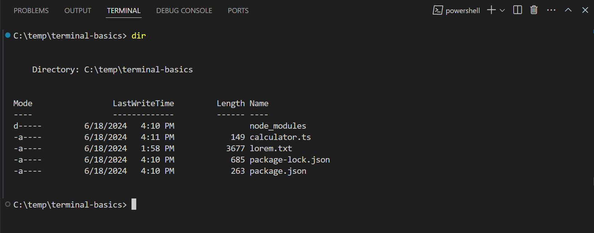
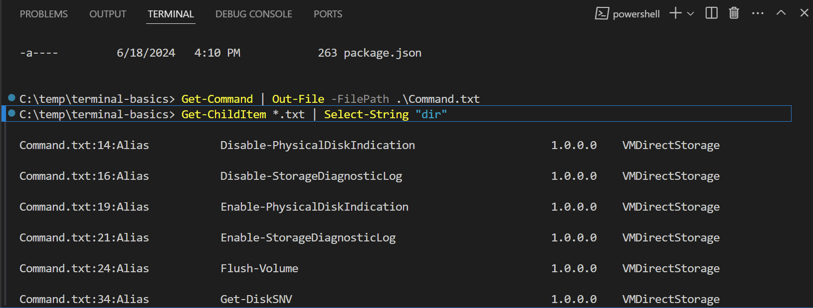
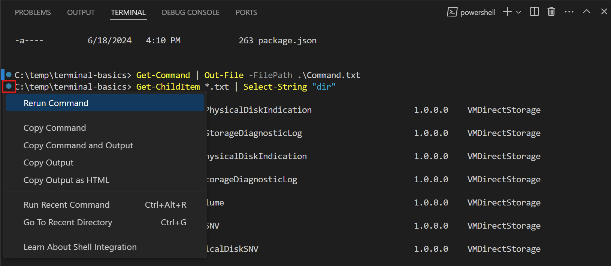
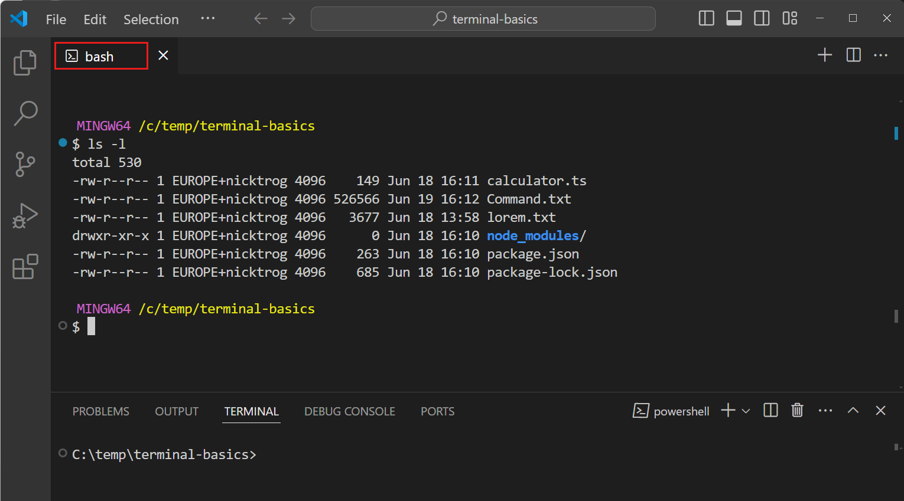

# 터미널 시작하기 {#getting-started-with-the-terminal}

Visual Studio Code에는 완전한 기능을 갖춘 통합 터미널이 포함되어 있습니다. 이를 사용하여 독립형 터미널처럼 `echo`, `ls`, `git`과 같은 명령을 실행할 수 있습니다. VS Code의 터미널은 편집기와 통합되어 작업 공간 파일에 대한 링크 및 오류 감지와 같은 기능을 지원합니다.

터미널은 머신에 설치된 다양한 셸을 사용할 수 있습니다. 셸은 운영 체제와 상호 작용하여 명령을 해석하고 실행하는 프로그램입니다. 셸의 예로는 Bash, Zsh 및 PowerShell이 있습니다.

이 튜토리얼은 Visual Studio Code에서 터미널을 사용하는 기본 사항을 안내합니다.

## 터미널에서 첫 번째 명령 실행하기 {#run-your-first-command-in-the-terminal}

코드를 작성하는 동안 애플리케이션을 빌드, 테스트 또는 배포하기 위해 셸 명령을 실행해야 할 수 있습니다. VS Code의 터미널을 사용하면 편집기를 떠나지 않고도 이러한 명령을 실행할 수 있습니다.

터미널을 시작하려면:

1. VS Code를 시작하고 폴더 또는 작업 공간을 엽니다.

1. 메뉴 바에서 **보기** > **터미널**을 선택하거나 `kb(workbench.action.terminal.toggleTerminal)` 키보드 단축키를 눌러 터미널을 엽니다.

    운영 체제 구성에 따라 터미널은 Bash, PowerShell 또는 Zsh와 같은 기본 셸로 열립니다. 셸의 작업 디렉터리는 작업 공간 폴더의 루트에서 시작됩니다.

    

1. 현재 디렉터리의 파일을 나열하기 위해 `ls`와 같은 기본 명령을 입력합니다.

    터미널은 독립형 터미널과 유사하게 명령의 출력을 표시하지만, 편집기 내에서 작업을 계속할 수 있습니다.

    

    > **팁**: 터미널 패널의 경계를 드래그하거나 `^` 아이콘을 선택하여 패널을 최대화하여 터미널을 확대할 수 있습니다.

## 명령 출력과 상호작용하기 {#interact-with-command-output}

VS Code의 터미널은 명령 출력과 상호작용할 수 있는 기능도 제공합니다. 명령은 종종 열거나 탐색하고 싶은 파일 경로 또는 URL을 출력합니다. 예를 들어, 컴파일러나 린터는 파일 경로와 줄 번호가 포함된 오류 메시지를 반환할 수 있습니다. 해당 파일을 찾는 대신, 터미널 출력에서 링크를 선택하여 편집기에서 파일을 직접 열 수 있습니다.

터미널에서 명령 출력과 상호작용하는 방법을 살펴보겠습니다:

1. 이전에 `ls` 명령을 실행했던 터미널을 엽니다.

1. 터미널에서 `kbstyle(Ctrl)`/`kbstyle(Cmd)` 키를 누른 채로 파일 이름 위에 마우스를 올리고 링크를 선택합니다.

    출력의 텍스트 위에 마우스를 올리면 링크로 변경되는 것을 확인하세요. 파일 이름을 선택하면 VS Code가 선택한 파일을 편집기에서 엽니다.

    

    터미널 출력의 모든 텍스트는 클릭할 수 있습니다. 터미널에서 하이퍼링크를 선택하면 기본 브라우저에서 링크가 열립니다. 다른 텍스트의 경우, VS Code는 해당 텍스트를 포함하는 파일을 작업 공간에서 검색하려고 시도합니다.

1. 다음 명령을 실행하여 사용 가능한 셸 명령 목록이 포함된 `Command.txt` 파일을 생성합니다.

    * PowerShell

        ```powershell
        Get-Command | Out-File -FilePath .\Command.txt
        ```

    * Bash / Zsh

        ```bash
        ls -l /usr/bin > Command.txt
        ```

1. `Command.txt` 파일에서 명령을 검색하기 위해 다음 명령을 입력합니다.

    * PowerShell

        ```powershell
        Get-ChildItem *.txt | Select-String "dir"
        ```

    * Bash / Zsh

        ```bash
        grep -n "dir" *.txt
        ```

    명령 출력에는 검색 결과가 발견된 파일 이름과 줄 번호가 포함되어 있습니다. 터미널은 이 텍스트를 링크로 인식합니다.

1. 링크 중 하나를 선택하여 파일의 특정 줄에서 편집기에서 파일을 엽니다.

    

터미널의 다양한 [링크에 대해 더 알아보기](/docs/terminal/basics.md#links).

## 이전 명령으로 이동하기 {#navigate-to-previous-commands}

터미널에서 작업하는 동안 이전 명령과 그 출력을 검토해야 하거나 명령을 다시 실행하고 싶을 수 있습니다. 키보드 단축키를 사용하여 이전 명령으로 빠르게 이동할 수 있습니다.

이전 명령으로 이동하려면:

1. 이전에 사용했던 터미널을 엽니다.

1. `kb(workbench.action.terminal.scrollToPreviousCommand)` 키보드 단축키를 눌러 터미널 기록에서 이전 명령으로 스크롤합니다.

    터미널이 이전 명령으로 스크롤되고 강조 표시되는 것을 확인하세요.

    

    `kb(workbench.action.terminal.scrollToPreviousCommand)`를 여러 번 누르면 터미널이 명령 기록을 더 많이 스크롤합니다. `kb(workbench.action.terminal.scrollToNextCommand)` 키보드 단축키를 사용하여 반대 방향으로 탐색할 수 있습니다.

1. 이전에 실행된 명령 옆의 여백에서 원형 아이콘을 볼 수 있습니다. 원형 아이콘을 선택한 다음 **명령 다시 실행**을 선택하여 명령을 다시 실행합니다.

    

[명령 기록 탐색에 대해 더 알아보기](/docs/terminal/shell-integration.md#command-navigation).

## 다른 셸에서 명령 실행하기 {#run-commands-in-another-shell}

터미널은 동시에 여러 개의 터미널을 열 수 있는 기능을 지원합니다. 예를 들어, 하나의 터미널을 Git 명령을 실행하는 데 전념하고 다른 터미널을 빌드 스크립트를 실행하는 데 사용할 수 있습니다. 또한 선호에 따라 다른 셸에서 명령을 실행할 수 있습니다.

다른 셸에서 새 터미널을 추가하려면:

1. 터미널 패널에서 `˅` 아이콘을 선택하여 터미널 드롭다운을 열고 사용 가능한 셸 중 하나를 선택합니다.

    > **참고**: 사용 가능한 셸은 머신에 설치된 셸에 따라 다릅니다.

    

    선택한 셸로 새 터미널이 열리며, 이전과 같이 명령을 입력할 수 있습니다.

    > **팁**: `+` 아이콘을 선택하여 기본 셸에 대한 새 터미널을 만들거나, `kb(workbench.action.terminal.new)` 키보드 단축키를 사용하거나, 메뉴 바에서 **터미널** > **새 터미널**을 선택할 수도 있습니다.

1. 터미널 패널의 목록에서 열린 터미널을 볼 수 있습니다.

    

    다른 터미널로 전환하려면 터미널 목록에서 선택합니다.

    > **팁**: 목록에서 터미널을 마우스 오른쪽 버튼으로 클릭하고 **이름 바꾸기**를 선택하여 터미널의 이름을 변경할 수 있습니다.

1. 터미널 목록에서 터미널을 편집기 영역으로 드래그합니다.

    터미널이 편집기 탭으로 이동하며, 다른 편집기 탭처럼 배치할 수 있습니다. 예를 들어, 터미널 탭을 VS Code 창 밖으로 드래그하여 플로팅 창으로 만들 수 있습니다. [사용자 정의 레이아웃에 대해 더 알아보기](/docs/editor/custom-layout.md#editor).

    

1. 열린 터미널을 닫으려면 터미널 목록 위에 마우스를 올리고 쓰레기통 아이콘을 선택합니다.

    

[터미널 관리에 대해 더 알아보기](/docs/terminal/basics.md#managing-terminals).

## 다음 단계 {#next-steps}

이 튜토리얼에서는 VS Code에서 터미널을 시작하는 방법을 배웠습니다. 탐색할 수 있는 추가 주제는 다음과 같습니다:

* 터미널의 [기본 개념 및 기능 배우기](/docs/terminal/basics.md)
* [터미널 프로필 생성 및 관리 방법 탐색하기](/docs/terminal/profiles.md)
* 터미널의 [모양 및 동작 사용자 정의 방법](/docs/terminal/appearance.md) 알아보기