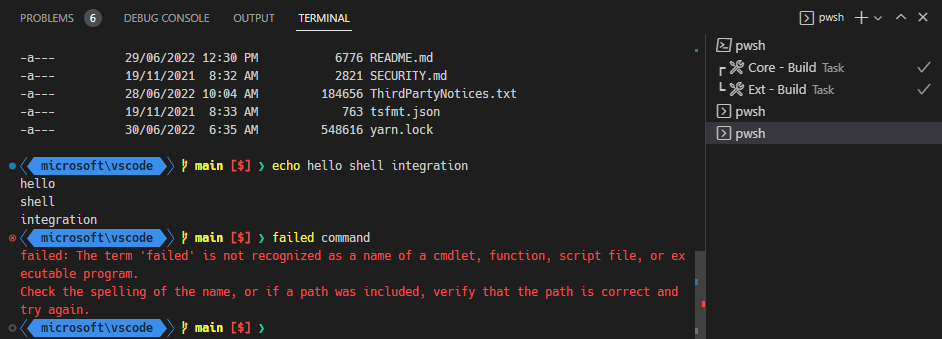
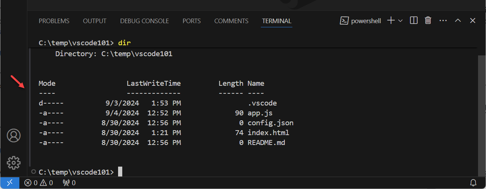
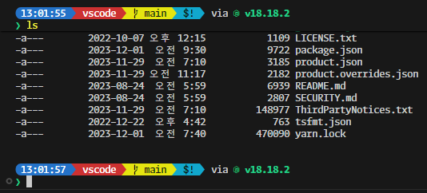
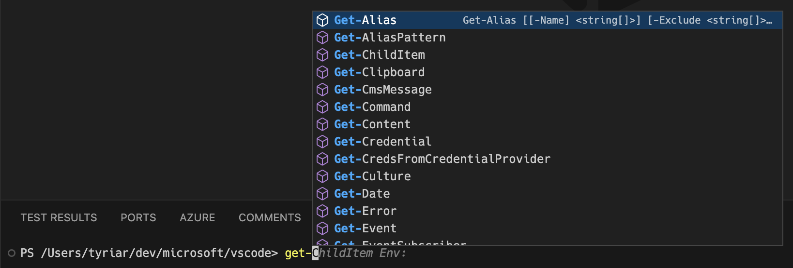

# 터미널 셸 통합 {#terminal-shell-integration}

Visual Studio Code는 일반적인 셸과 통합할 수 있는 기능을 제공하여 터미널이 셸 내부에서 실제로 발생하는 일에 대해 더 많은 정보를 이해할 수 있게 합니다. 이 추가 정보는 [작업 디렉터리 감지](#current-working-directory-detection), 명령 감지, [장식](#command-decorations-and-the-overview-ruler), [탐색](#command-navigation)과 같은 유용한 기능을 가능하게 합니다.

지원되는 셸:

- Linux/macOS: bash, fish, pwsh, zsh
- Windows: Git Bash, pwsh

## 설치 {#installation}

### 자동 스크립트 주입 {#automatic-script-injection}

기본적으로, 셸 통합 스크립트는 VS Code에서 실행된 지원되는 셸에서 자동으로 활성화되어야 합니다. 이는 셸 세션이 시작될 때 인수 및/또는 환경 변수를 주입하여 수행됩니다. 이 자동 주입은 `setting(terminal.integrated.shellIntegration.enabled)`를 `false`로 설정하여 비활성화할 수 있습니다.

이 표준적이고 쉬운 방법은 서브 셸, 일반 `ssh` 세션(예: [Remote - SSH 확장](/docs/remote/ssh.md)을 사용하지 않을 때) 또는 복잡한 셸 설정과 같은 일부 고급 사용 사례에서는 작동하지 않을 수 있습니다. 이러한 경우에 셸 통합을 활성화하는 권장 방법은 [수동 설치](#manual-installation)입니다.

> **참고**: 자동 주입은 구버전의 셸에서는 작동하지 않을 수 있습니다. 예를 들어, 구버전의 fish는 주입이 작동하는 방식인 `$XDG_DATA_DIRS` 환경 변수를 지원하지 않습니다. 여전히 수동 설치를 통해 작동시킬 수 있습니다.

### 수동 설치 {#manual-installation}

셸 통합을 수동으로 설치하려면, VS Code 셸 통합 스크립트가 셸 초기화 중에 실행되어야 합니다. 이를 수행하는 위치와 방법은 사용 중인 셸과 운영 체제에 따라 다릅니다. 수동 설치를 사용할 때는 `setting(terminal.integrated.shellIntegration.enabled)`를 `false`로 설정하는 것이 권장되지만 필수는 아닙니다.

> **팁:** [Insiders 빌드](https://code.visualstudio.com/insiders)를 사용할 때는 아래의 `code`를 `code-insiders`로 교체하세요.

**bash**

다음 내용을 `~/.bashrc` 파일에 추가합니다. bash에서 `code ~/.bashrc`를 실행하여 VS Code에서 파일을 엽니다.

```sh
[[ "$TERM_PROGRAM" == "vscode" ]] && . "$(code --locate-shell-integration-path bash)"
```

**fish**

다음 내용을 `config.fish`에 추가합니다. fish에서 `code $__fish_config_dir/config.fish`를 실행하여 VS Code에서 파일을 엽니다.

```sh
string match -q "$TERM_PROGRAM" "vscode"
and . (code --locate-shell-integration-path fish)
```

**pwsh**

다음 내용을 [PowerShell 프로필](https://learn.microsoft.com/powershell/module/microsoft.powershell.core/about/about_profiles?view=powershell-7.2)에 추가합니다. pwsh에서 `code $Profile`을 실행하여 VS Code에서 파일을 엽니다.

```powershell
if ($env:TERM_PROGRAM -eq "vscode") { . "$(code --locate-shell-integration-path pwsh)" }
```

**zsh**

다음 내용을 `~/.zshrc` 파일에 추가합니다. bash에서 `code ~/.zshrc`를 실행하여 VS Code에서 파일을 엽니다.

```sh
[[ "$TERM_PROGRAM" == "vscode" ]] && . "$(code --locate-shell-integration-path zsh)"
```

**Git Bash**

다음 내용을 `~/.bashrc` 파일에 추가합니다. Git Bash에서 `code ~/.bashrc`를 실행하여 VS Code에서 파일을 엽니다.

```sh
[[ "$TERM_PROGRAM" == "vscode" ]] && . "$(code --locate-shell-integration-path bash)"
```

#### 이식성 대 성능 {#portability-versus-performance}

위의 셸 통합 설치는 크로스 플랫폼이며, `code`가 `$PATH`에 있을 경우 모든 설치 유형과 호환됩니다. 그러나 이 권장 방법은 스크립트 경로를 가져오기 위해 Node.js를 시작하므로 셸 시작 시 약간의 지연이 발생합니다. 이 지연을 완화하기 위해, 스크립트를 미리 경로를 해결하여 인라인으로 추가하고 초기화 스크립트에 직접 추가할 수 있습니다.

```sh
# 실행 파일의 경로를 먼저 출력합니다: {#output-the-executables-path-first}
code --locate-shell-integration-path bash

# 위의 결과를 소스 문에 추가합니다: {#add-the-result-of-the-above-to-the-source-statement}
[[ "$TERM_PROGRAM" == "vscode" ]] && . "/path/to/shell/integration/script.sh"
```

## 명령 장식 및 개요 눈금자 {#command-decorations-and-the-overview-ruler}

셸 통합이 가능하게 하는 것 중 하나는 터미널 내에서 실행된 명령의 종료 코드를 가져오는 기능입니다. 이 정보를 사용하여 명령이 성공했는지 실패했는지를 나타내기 위해 줄 왼쪽에 장식이 추가됩니다. 이러한 장식은 편집기와 마찬가지로 스크롤 바의 비교적 새로운 개요 눈금자에도 표시됩니다.



장식은 명령을 다시 실행하는 등의 맥락적 작업을 제공하기 위해 상호작용할 수 있습니다:


명령 및 개요 눈금자 장식은 `setting(terminal.integrated.shellIntegration.decorationsEnabled)` 설정으로 구성할 수 있습니다.

## 명령 탐색 {#command-navigation}

셸 통합에 의해 감지된 명령은 명령 탐색 기능(`kbStyle(Ctrl/Cmd+Up)`, `kbStyle(Ctrl/Cmd+Down)`)에 공급되어 더 신뢰할 수 있는 명령 위치를 제공합니다. 이 기능은 명령 간의 빠른 탐색과 출력 선택을 가능하게 합니다. 현재 위치에서 명령까지 선택하려면 `kbStyle(Shift)`를 누르고 `kbStyle(Shift+Ctrl/Cmd+Up)` 및 `kbStyle(Shift+Ctrl/Cmd+Down)`을 누를 수 있습니다.

## 명령 가이드 {#command-guide}

명령 가이드는 명령과 그 출력 옆에 나타나는 바입니다. 마우스를 올리면 명령을 더 빨리 식별하는 데 도움이 되며, 셸 통합이 제대로 작동하고 있는지 확인하는 방법이기도 합니다.



명령 가이드의 색상은 색상 테마를 사용하여 사용자 정의할 수 있습니다. 명령 가이드를 전환하려면 `setting(terminal.integrated.shellIntegration.showCommandGuide)` 설정을 구성합니다.

## 스티키 스크롤 {#sticky-scroll}

스티키 스크롤 기능은 터미널 상단에 부분적으로 표시되는 명령을 "고정"하여 해당 출력이 어떤 명령에 속하는지 쉽게 볼 수 있도록 합니다. 스티키 스크롤 구성 요소를 클릭하면 터미널 버퍼에서 명령의 위치로 스크롤됩니다.



이는 `setting(terminal.integrated.stickyScroll.enabled)` 설정으로 활성화할 수 있습니다.

## 빠른 수정 {#quick-fixes}

VS Code는 명령의 출력을 스캔하고 사용자가 다음에 수행할 가능성이 높은 작업을 제시하는 빠른 수정을 제공합니다.


다음은 내장된 빠른 수정의 일부입니다:

- 포트가 이미 사용 중인 것으로 감지되면 프로세스를 종료하고 이전 명령을 다시 실행하라는 제안을 합니다.
- `git push`가 업스트림이 설정되지 않아 실패하면 업스트림을 설정하여 푸시하라는 제안을 합니다.
- `git` 서브 명령이 유사한 명령 오류로 실패하면 유사한 명령을 사용하라는 제안을 합니다.
- `git push`가 GitHub PR을 생성하라는 제안을 하면 링크를 열라는 제안을 합니다.
- `General` 또는 `cmd-not-found` PowerShell 피드백 제공자가 트리거되면 각 제안을 제시합니다.

빠른 수정 기능은 [접근성 신호](/docs/editor/accessibility.md#accessibility-signals)를 지원하여 빠른 수정이 가능할 때 추가 피드백을 제공합니다.

## 최근 명령 실행 {#run-recent-command}

**터미널: 최근 명령 실행** 명령은 다양한 출처의 기록을 Quick Pick에 표시하여 셸의 역 검색(`kbstyle(Ctrl+R)`)과 유사한 기능을 제공합니다. 출처는 현재 세션의 기록, 이 셸 유형의 이전 세션 기록 및 일반 셸 기록 파일입니다.


명령의 다른 기능은 다음과 같습니다:

- 기본적으로 검색 모드는 "연속 검색"이며, 검색어는 정확히 일치해야 합니다. 검색 입력 오른쪽의 버튼을 사용하여 퍼지 검색으로 전환할 수 있습니다.
- 현재 세션 섹션에서는 Quick Pick 오른쪽에 클립보드 아이콘이 있어 명령 출력을 편집기에서 열 수 있습니다.
- Quick Pick 오른쪽의 고정 작업은 명령을 목록 상단에 고정할 수 있습니다.
- `kbstyle(Alt)`를 누르고 있으면 텍스트를 실행하지 않고 터미널에 작성할 수 있습니다.
- 이전 세션 섹션에 저장된 기록의 양은 `setting(terminal.integrated.shellIntegration.history)` 설정에 의해 결정됩니다.

이 명령의 기본 키보드 단축키는 `kbstyle(Ctrl+Alt+R)`입니다. 그러나 접근성 모드가 켜져 있으면 이들이 반전됩니다; `kbstyle(Ctrl+R)`은 최근 명령을 실행하고 `kbstyle(Ctrl+Alt+R)`은 Ctrl+R을 셸로 보냅니다.

접근성 모드가 꺼져 있을 때 키보드 단축키를 반전할 수 있습니다:

```jsonc
{
    "key": "ctrl+r",
    "command": "workbench.action.terminal.runRecentCommand",
    "when": "terminalFocus"
},
{
  "key": "ctrl+alt+r",
  "command": "workbench.action.terminal.sendSequence",
  "args": { "text": "\u0012"/*^R*/ },
  "when": "terminalFocus"
}
```

## 최근 디렉터리로 이동 {#go-to-recent-directory}

최근 명령 실행 기능과 유사하게, **터미널: 최근 디렉터리로 이동** 명령은 방문한 디렉터리를 추적하고 이를 빠르게 필터링하고 탐색(`cd`)할 수 있게 합니다. `kbstyle(Alt)`를 누르고 있으면 텍스트를 실행하지 않고 터미널에 작성할 수 있습니다.

이 명령의 기본 키보드 단축키는 `kb(workbench.action.terminal.goToRecentDirectory)`로, 편집기에서 **행/열로 이동** 명령과 유사하게 작동합니다. Ctrl+G는 `kbstyle(Ctrl+Alt+G)`로 셸로 전송할 수 있습니다.

## 현재 작업 디렉터리 감지 {#current-working-directory-detection}

셸 통합은 VS Code에 셸의 현재 작업 디렉터리를 알려줍니다. 이 정보는 Windows에서 정규 표현식을 통해 프롬프트를 감지하려고 시도하지 않고는 얻을 수 없으며, macOS와 Linux에서는 폴링이 필요하므로 성능에 좋지 않습니다.

이 기능이 가능하게 하는 가장 큰 기능 중 하나는 터미널 내 링크의 향상된 해석입니다. 예를 들어, 링크 `package.json`이 있을 때, 셸 통합이 비활성화된 상태에서 링크를 활성화하면 작업 공간에 여러 개의 `package.json` 파일이 있을 경우 `package.json`을 필터로 하는 검색 빠른 선택이 열립니다. 그러나 셸 통합이 활성화되면 현재 위치가 알려져 있기 때문에 현재 폴더의 `package.json` 파일을 직접 열 수 있습니다. 이는 예를 들어 `ls`의 출력이 올바른 파일을 신뢰성 있게 열 수 있도록 합니다.

현재 작업 디렉터리는 터미널 탭에 디렉터리를 표시하고, 최근 명령 실행 빠른 선택 및 `"terminal.integrated.splitCwd": "inherited"` 기능에 사용됩니다.

## 확장된 PowerShell 키보드 단축키 {#extended-powershell-keyboard-shortcuts}

Windows의 콘솔 API는 Linux/macOS 터미널보다 더 많은 키보드 단축키를 허용합니다. VS Code의 터미널이 후자를 에뮬레이트하더라도 Windows에서 사용할 수 없는 표준 수단으로는 `kbstyle(Ctrl+Space)`와 같은 PowerShell 키보드 단축키가 있습니다. 셸 통합은 VS Code가 PowerShell에 특별한 시퀀스를 보내기 위해 사용자 정의 키보드 단축키를 연결할 수 있게 하여, 이후 셸 통합 스크립트에서 처리되고 적절한 키 핸들러로 전달됩니다.

셸 통합이 활성화되면 PowerShell에서 다음 키보드 단축키가 작동해야 합니다:

- `kbstyle(Ctrl+Space)`: Windows에서만 기본값은 `MenuComplete`
- `kbstyle(Alt+Space)`: 모든 플랫폼에서 기본값은 `SetMark`
- `kbstyle(Shift+Enter)`: 모든 플랫폼에서 기본값은 `AddLine`
- `kbstyle(Shift+End)`: 모든 플랫폼에서 기본값은 `SelectLine`
- `kbstyle(Shift+Home)`: 모든 플랫폼에서 기본값은 `SelectBackwardsLine`

## 실험적 IntelliSense for PowerShell {#experimental-intellisense-for-powershell}

PowerShell에 대한 실험적 IntelliSense는 PowerShell에서 입력할 때 편집기 경험과 유사한 완성 목록을 표시합니다. 이 기능은 PowerShell 세션의 기본 완성 API에 의해 지원되므로, 변수와 같은 컨텍스트 인식 완성이 가능합니다.



PowerShell에 대한 실험적 IntelliSense는 `setting(terminal.integrated.suggest.enabled)` 설정으로 활성화할 수 있습니다.

```json
"terminal.integrated.suggest.enabled": true
```

> **참고**: 이 기능은 현재 Windows와 macOS에서만 사용할 수 있습니다.

### Git 및 VS Code 완성 {#git-and-vs-code-completions}

실험적 IntelliSense가 활성화되면 `git`, `code`, 및 `code-insiders`에 대한 완성이 기본적으로 켜집니다. PowerShell 프로필에 이미 완성이 있는 경우, `setting(terminal.integrated.suggest.builtinCompletions)` 설정을 사용하여 이를 끌 수 있습니다.

## 향상된 접근성 {#enhanced-accessibility}

셸 통합이 VS Code에 제공하는 정보는 [터미널의 접근성 개선](/docs/editor/accessibility.md#terminal-accessibility)에 사용됩니다. 향상의 몇 가지 예는 다음과 같습니다:

- 접근 가능한 버퍼에서 감지된 명령을 통한 탐색 (`kb(workbench.action.terminal.focusAccessibleBuffer)`)
- 명령이 실패할 때 [오디오 신호](/docs/editor/accessibility.md#accessibility-signals)가 재생됩니다.
- 화살표 및 백스페이스 키를 사용할 때 더 올바르게 작동하도록 기본 텍스트 상자가 동기화됩니다.

## 지원되는 이스케이프 시퀀스 {#supported-escape-sequences}

VS Code는 여러 사용자 정의 이스케이프 시퀀스를 지원합니다:

### VS Code 사용자 정의 시퀀스 'OSC 633 ; ... ST' {#vs-code-custom-sequences-osc-633-st}

VS Code는 VS Code의 터미널에서 실행될 때 셸 통합 기능을 활성화하기 위해 설계된 사용자 정의 이스케이프 시퀀스 세트를 가지고 있습니다. 이들은 내장 스크립트에 의해 사용되지만, 터미널에 시퀀스를 보낼 수 있는 모든 애플리케이션에서도 사용할 수 있습니다. 예를 들어, [Julia 확장](https://marketplace.visualstudio.com/items?itemName=julialang.language-julia)은 Julia REPL에서 셸 통합을 지원하기 위해 이를 사용합니다.

이 시퀀스는 다른 터미널에서 무시되어야 하지만, 다른 터미널이 이러한 시퀀스를 더 널리 채택하지 않는 한, 작성하기 전에 `$TERM_PROGRAM`이 `vscode`인지 확인하는 것이 좋습니다.

- `OSC 633 ; A ST` - 프롬프트 시작을 표시합니다.
- `OSC 633 ; B ST` - 프롬프트 끝을 표시합니다.
- `OSC 633 ; C ST` - 실행 전 표시합니다.
- `OSC 633 ; D [; <exitcode>] ST` - 선택적 종료 코드와 함께 실행 완료를 표시합니다.
- `OSC 633 ; E ; <commandline> [; <nonce] ST` - 선택적 nonce와 함께 명령 줄을 명시적으로 설정합니다.

  E 시퀀스는 터미널이 셸에 의해 해석된 정확한 명령 줄을 신뢰성 있게 가져올 수 있게 합니다. 이것이 지정되지 않으면, 터미널은 A, B 및 C 시퀀스를 사용하여 명령을 가져오거나 신뢰할 수 없는 경우 감지를 완전히 비활성화할 수 있습니다.

  선택적 nonce는 명령 스푸핑을 방지하기 위해 시퀀스가 셸 통합 스크립트에서 왔음을 확인하는 데 사용할 수 있습니다. nonce가 성공적으로 확인되면, 명령을 사용하기 전에 일부 보호가 제거되어 사용자 경험이 향상됩니다.

  명령 줄은 ASCII 문자를 `\xAB` 형식을 사용하여 이스케이프할 수 있으며, 여기서 AB는 문자 코드의 16진수 표현(대소문자 구분 없음)입니다. 세미콜론(`0x3b`) 및 0x20 이하의 문자를 이스케이프해야 하며, 이는 특히 줄 바꿈 및 세미콜론에 중요합니다.

  몇 가지 예:

  ```text
  "\"  -> "\\"
  "\n" -> "\x0a"
  ";"  -> "\x3b"
  ```

- `OSC 633 ; P ; <Property>=<Value> ST` - 터미널의 속성을 설정하며, 알려진 속성만 처리됩니다.

  알려진 속성:

  - `Cwd` - 현재 작업 디렉터리를 터미널에 보고합니다.
  - `IsWindows` - 터미널이 winpty 또는 conpty와 같은 Windows 백엔드를 사용하고 있는지 여부를 나타냅니다. 이는 셸 통합 시퀀스의 위치가 올바를 것이라는 보장이 없기 때문에 추가적인 휴리스틱을 활성화하는 데 사용될 수 있습니다. 유효한 값은 `True`와 `False`입니다.

### Final Term 셸 통합 {#final-term-shell-integration}

VS Code는 Final Term의 셸 통합 시퀀스를 지원하여 비 VS Code 셸 통합 스크립트가 VS Code에서 작동할 수 있게 합니다. 이로 인해 `OSC 633`만큼 많은 기능을 지원하지 않기 때문에 다소 저하된 경험이 발생합니다. 지원되는 특정 시퀀스는 다음과 같습니다:

- `OSC 133 ; A ST` - 프롬프트 시작을 표시합니다.
- `OSC 133 ; B ST` - 프롬프트 끝을 표시합니다.
- `OSC 133 ; C ST` - 실행 전 표시합니다.
- `OSC 133 ; D [; <exitcode>] ST` - 선택적 종료 코드와 함께 실행 완료를 표시합니다.

### iTerm2 셸 통합 {#iterm2-shell-integration}

iTerm2가 선도한 다음 시퀀스가 지원됩니다:

- `OSC 1337 ; CurrentDir=<Cwd> S` - 터미널의 현재 작업 디렉터리를 설정하며, `OSC 633 ; P ; Cwd=<Cwd> ST`와 유사합니다.
- `OSC 1337 ; SetMark ST` - 트리거된 줄 왼쪽에 마크를 추가하고 스크롤 바에 주석을 추가합니다:

  

  이러한 마크는 명령 탐색과 통합되어 `kb(workbench.action.terminal.scrollToPreviousCommand)` 및 `kb(workbench.action.terminal.scrollToNextCommand)`를 통해 쉽게 탐색할 수 있습니다.

## 일반적인 질문 {#common-questions}

### 자동 주입이 작동하지 않는 경우는 언제인가요? {#when-does-automatic-injection-not-work}

자동 주입이 작동하지 않는 몇 가지 경우가 있으며, 일반적인 경우는 다음과 같습니다:

- `$PROMPT_COMMAND`가 지원되지 않는 형식인 경우, 이를 단일 함수로 가리키도록 변경하는 것이 간단한 해결 방법입니다. 예를 들어:

  ```sh
  prompt() {
    printf "\033]0;%s@%s:%s\007" "$\{USER\}
  " "$\{HOSTNAME%%.*\}
  " "$\{PWD/#$HOME/\~\}
  "
  }
  PROMPT_COMMAND=prompt
  ```

- 일부 셸 플러그인은 초기화할 때 `$VSCODE_SHELL_INTEGRATION`을 해제하여 VS Code의 셸 통합을 명시적으로 비활성화할 수 있습니다.

### 기능이 비활성화되어 있는데도 명령 장식이 표시되는 이유는 무엇인가요? {#why-are-command-decorations-showing-when-the-feature-is-disabled}

이러한 현상의 가장 가능성이 높은 원인은 시스템에 VS Code가 이해하는 다른 터미널에 대한 셸 통합이 설치되어 있기 때문입니다 [VS Code 이해](#final-term-shell-integration). 장식을 원하지 않는 경우, 다음 설정으로 숨길 수 있습니다:

```json
"terminal.integrated.shellIntegration.decorationsEnabled": never
```

또는 셸 rc/startup 스크립트에서 셸 통합 스크립트를 제거할 수 있지만, 이 경우 [명령 탐색](#command-navigation)과 같은 명령 인식 기능에 대한 접근을 잃게 됩니다.

### Windows에서 명령 장식이 왜 이리 저절로 움직이나요? {#why-does-the-command-decoration-jump-around-on-windows}

Windows는 ConPTY라는 에뮬레이트된 가상 터미널(pty) 백엔드를 사용합니다. 이는 일반적인 pty와 약간 다르게 작동하며, Windows 콘솔 API와의 호환성을 유지해야 합니다. 이로 인해 pty는 렌더링을 특별한 방식으로 처리하여 터미널 버퍼에서 명령을 식별하는 셸 통합 시퀀스가 잘못 배치될 수 있습니다. 명령이 저절로 움직일 때는 일반적으로 명령이 실행된 후 VS Code의 휴리스틱이 작동하여 명령 장식의 위치를 개선하려고 할 때 발생합니다.