# March 2024 (version 1.88)

**Update 1.88.1**: The update addresses these [issues](https://github.com/microsoft/vscode/issues?q=is%3Aissue+is%3Aclosed+milestone%3A%22March+2024+Recovery+1%22).

<!-- DOWNLOAD_LINKS_PLACEHOLDER -->

---

Welcome to the March 2024 release of Visual Studio Code. There are many updates in this version that we hope you'll like, some of the key highlights include:

- [Apply custom editor labels](#custom-labels-for-open-editors) - Distinguish between editors with same file names.
- [Locked scrolling](#locked-scrolling) - Compare editors side-by-side with synchronized scrolling.
- [Extension update improvements](#extensions-update-improvements) - Restart extensions without reload & update extensions with VS Code releases.
- [Test Coverage API](#test-coverage) - Native code coverage support in VS Code.
- [Folding markers in minimap](#minimap-section-headers) - Easily identify and navigate to code sections from minimap.
- [Quick Search improvements](#quick-search-improvements) - Sticky file path separators and separator buttons.
- [Notebook Run cells in section](#run-cells-in-section) - Quickly run all cells in a notebook section.
- [Copilot improvements](#github-copilot) - Improved inline chat UI, commit messages, and used references.
- [Python auto-detect improvements](#python) - Detect startup files for Flask & Django, discover Hatch environments.
- [Preview: Terminal inline chat](#preview-terminal-inline-chat) - Start a Copilot inline chat conversation directly from the terminal.

> If you'd like to read these release notes online, go to [Updates](https://code.visualstudio.com/updates) on [code.visualstudio.com](https://code.visualstudio.com).
> **Insiders:** Want to try new features as soon as possible? You can download the nightly [Insiders](https://code.visualstudio.com/insiders) build and try the latest updates as soon as they are available.

## Accessibility

### Voice recording sounds

We have added new accessibility signal sounds for voice recording:

- Voice recording start - configured with the <code codesetting="accessibility.signals.voiceRecordingStarted">accessibility.signals.voiceRecordingStarted</code> setting
- Voice recording end - configured with the <code codesetting="accessibility.signals.voiceRecordingStopped">accessibility.signals.voiceRecordingStopped</code> setting

### Improved diff editor accessibility

If you're using a screen reader, you now get an announcement when a diff editor becomes the active editor. You can disable this behavior with the <code codesetting="accessibility.verbosity.diffEditorActive">accessibility.verbosity.diffEditorActive</code> setting.

We also added information about **Diff Editor: Switch Side**, a helpful command for keyboard users, to the [accessibility help dialog](https://code.visualstudio.com/docs/editor/accessibility#_accessibility-help).

[Accessibility Signals](https://code.visualstudio.com/docs/editor/accessibility#_accessibility-signals) now work on both sides of the diff editor. Previously, they were only available on the modified side.

### Accessible View chat code block commands

When you inspect a chat response in the Accessible View, you can now use the code block commands and keybindings that are available in the Chat view.

These include **Chat: Insert at Cursor**, **Chat: Insert into Terminal** and **Chat: Insert into New File**.

### Notebook cell aria label updates

Aria labels for notebook cells now update to indicate if the cell is currently executing or pending execution.

## Workbench

### Custom editor support in floating windows

We expanded support for opening editors into [floating windows](https://code.visualstudio.com/docs/editor/custom-layout#_floating-editor-windows) to custom editors, and generally all editors that use the [webview API](https://code.visualstudio.com/api/extension-guides/webview). This includes markdown preview, browser preview, and complex custom editors, such as our [hex editor](https://marketplace.visualstudio.com/items?itemName=ms-vscode.hexeditor).

<video src="images/1_88/custom-editors-float.mp4" title="Custom editors support in floating windows." autoplay loop controls muted></video>

**Note:** due to a technical limitation, moving a webview-based editor between windows requires the contents of that editor to reload. It is then up to the editor to restore the state you had previously accumulated. In some cases your state might be reset, as if you had opened the editor for the first time.

### Custom labels for open editors

We now let you customize the display label for editor tabs and the Open editors view. This functionality can be useful to distinguish between editors for files with the same name.

You can tailor these labels to your preference by adding entries under the <code codesetting="workbench.editor.customLabels.patterns">workbench.editor.customLabels.patterns</code> setting. Each entry should include a [glob pattern](https://code.visualstudio.com/docs/editor/glob-patterns) that matches file paths and a template that defines the new name for the editor tab. This customization only applies when a file's path matches the specified pattern. Whether a pattern matches, depends on if it's defined as a relative or absolute file path pattern.

Templates can incorporate variables such as `$\{filename\}
`, `$\{extname\}
`, `$\{dirname\}
`, and `$\{dirname(N)\}
`, which are dynamically replaced with values from the file's path.

To enable or disable these custom labels, use the <code codesetting="workbench.editor.customLabels.enabled">workbench.editor.customLabels.enabled</code> setting. This enables you to switch to the original editor names at any time, without having to remove your custom patterns.

<video src="images/1_88/custom-editor-labels.mp4" title="Adding an entry for a custom editor label" autoplay loop controls muted></video>

### Locked scrolling

You can now synchronize scrolling across all visible editors by using the **View: Toggle Locked Scrolling Across Editors** command. This means that when you scroll in one editor, all the other editors scroll by the same amount, keeping everything aligned. This feature can be useful if you need to compare files side-by-side.

If you want more control for enabling and disabling locked scrolling, you can choose to only activate the scrolling sync when you're holding down a specific keybinding. Set up a keyboard shortcut for the `workbench.action.holdLockedScrolling` command, and you're able to temporarily lock the scrolling across editors whenever you need it.

<video src="images/1_88/locked-scrolling.mp4" title="Synchronize scrolling two editors" autoplay loop controls muted></video>

### Activity Bar at the bottom

Previously, we introduced the option to move the Activity bar to the top of the Side Bar. We're now enabling you to also move the Activity Bar to the bottom. To do this, change the <code codesetting="workbench.activityBar.location:bottom">workbench.activityBar.location</code> setting to `bottom`.

We've also improved the look and feel of the Activity Bar when it's positioned at the top, to make sure it fits in nicely with the rest of the interface.

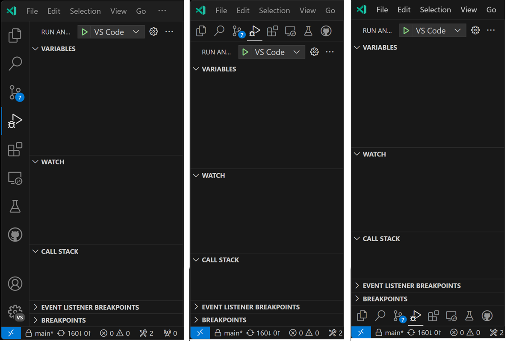

### Search Editor single-click behavior

You can now configure the <code codesetting="search.searchEditor.singleClickBehaviour">search.searchEditor.singleClickBehaviour</code> setting to determine what happens when you single-click on a Search Editor entry. Currently, the setting only supports opening a Peek Definition.

### Quick Search improvements

#### Sticky file paths

In Quick Search, we've made the file name separators sticky to make it clearer which file a search result is associated with. This can be useful when you have many occurrences of a search term in a file.

<video src="images/1_88/quick-pick-sticky-scroll.mp4" title="Sticky Scroll support in the quick pick" autoplay loop controls muted></video>

#### File path separator buttons

When you hover over the file results of a particular file, or if you arrow down to a result, the buttons (for example, to open the file) also appear for the file path separator.

<video src="images/1_88/quick-pick-separator-buttons-show-up.mp4" title="Separator buttons show up when you hover or focus an item in that section" autoplay loop controls muted></video>

### Quick Pick separator navigation keybindings

We received feedback that it would be nice to be able to navigate between separators in a quick pick. This iteration, we've added a keybinding to do just this. On Windows & Linux, you can use `Alt+Up/Down`, and on macOS it is `Cmd+Up/Down`. In this example video, you can see the active item moving between:

- The `recently used` and `other commands` separators in the Command Palette
- Between the file path separators in Quick Search

<video src="images/1_88/quick-pick-separator-keybindings.mp4" title="Move between separators using keybindings" autoplay loop controls muted></video>

### Quick Pick disabled checkbox items

This iteration, we made it clearer when a quick pick displays items that are disabled. An example of this can be found in the "Manage Trusted Extensions" quick pick, which can be accessed for any of the accounts that you're logged in to.

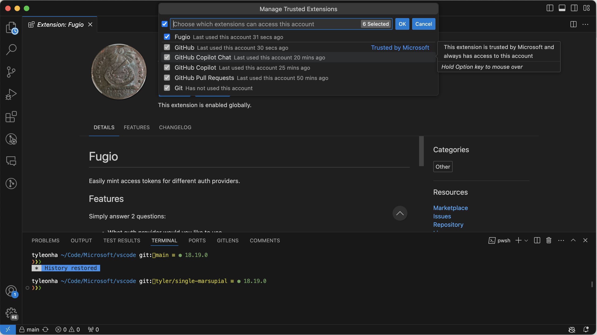

### Extensions update improvements

#### Restart extensions

When an extension is updated, you can now restart extensions instead of having to reload the window.

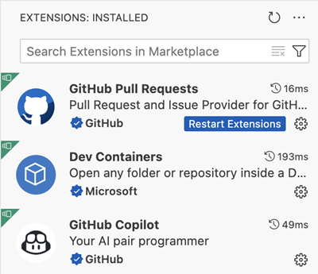

**Note:** When you are connected to a remote server like WSL or SSH or Dev Container, you still need to reload the window to update extensions.

#### Update extensions with VS Code updates

When you have <code codesetting="extensions.autoCheckUpdates">extensions auto update</code> enabled, VS Code now updates the extensions that are compatible with the newer version of VS Code that is available for update. If the newer version of the extension is not compatible with the current version of VS Code, then the newer version of the extension is enabled only after you update VS Code.

## Jump to comment reply

The context menu for a comment thread in the Comments view now includes a "Reply" action when the comment thread allows replies. This enables you to quickly jump to the reply input box and start typing a reply.

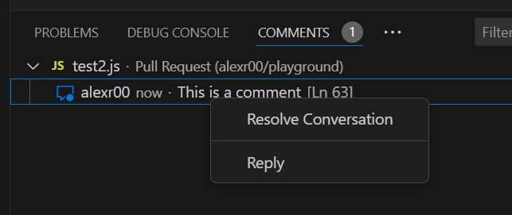

## Editor

### Minimap section headers

The minimap now recognizes and renders sections defined by folding markers, such as `//#region` in TypeScript, or comments that use `MARK:`. This lets you quickly scan and navigate across large files.

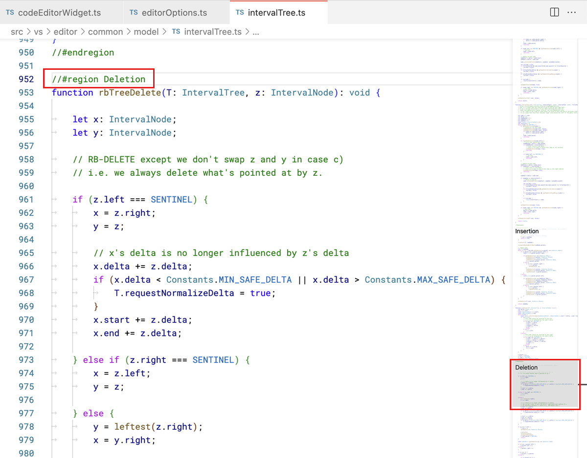

### Refactor Preview keybindings

We updated the keybinding for previewing edits for the Rename Symbols refactoring (`kbstyle(F2)`) to maintain consistency with previewing refactorings in other contexts, such as Code Actions. You can now preview edits by using `kb(refactorPreview.apply)` (previously `Shift + Enter`).

When hovering over a Code Actions, `kb(refactorPreview.apply)` also opens the Refactor Preview panel in the workbench.

### Diff Editor Stage/Revert Selection Buttons

The diff editor now has a separate gutter for **Stage** and **Revert** controls. These actions enable you to stage or revert changed code blocks.

If you perform a text selection of some changes, these buttons let you stage or revert the selected changes (all changed characters within the selection).

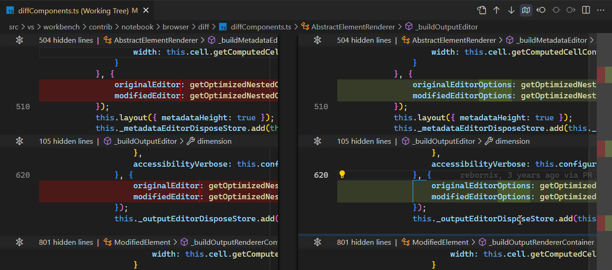

You can hide the diff editor gutter by setting <code codesetting="diffEditor.renderGutterMenu:false">diffEditor.renderGutterMenu</code> to `false`.

### Rename suggestions behavior

We improved the flow of using rename suggestions to match that of quick picks. When you select a rename suggestion from the list, the input value now updates accordingly, which enables you to further modify the suggestion.


## Source Control

### Incoming changes file decorations

To help avoid potential conflicts when merging/rebasing changes from the remote, we now show file decorations for all files that have incoming changes and which were fetched but not yet merged/rebased. To benefit from this functionality, you should have both <code codesetting="git.autofetch">git.autofetch</code> and <code codesetting="git.decorations.enabled">git.decorations.enabled</code> settings enabled.


_Theme: [GitHub Sharp](https://marketplace.visualstudio.com/items?itemName=joaomoreno.github-sharp-theme) (preview on [vscode.dev](https://vscode.dev/editor/theme/joaomoreno.github-sharp-theme))_

## Terminal

### Shell integration in debug terminals

To provide enhanced functionality to the user and extensions, [shell integration](https://code.visualstudio.com/docs/terminal/shell-integration) is now automatically enabled in terminals that are launched when debugging.

### Run recent command improvements

The shell integration-powered **Run recent command** (`kb(workbench.action.terminal.runRecentCommand)`) now scrolls to and displays the last time the command was run, where possible. Running the command or canceling the quick pick returns the terminal to its previous state.

<video src="images/1_88/terminal-run-recent-command-preview.mp4" title="Running a recent command will preview the last time it's run in the terminal temporarily" autoplay loop controls muted></video>

_Theme: [Sapphire](https://marketplace.visualstudio.com/items?itemName=Tyriar.theme-sapphire) (preview on [vscode.dev](https://vscode.dev/editor/theme/Tyriar.theme-sapphire))_

### Open detected link improvements

The **Open detected link** command (`kb(workbench.action.terminal.openDetectedLink)`) now previews the link result in the editor and highlights the link source in the terminal.

<video src="images/1_88/terminal-open-detected-link.mp4" title="Previews are shown in both the editor and terminal when scrolling through links" autoplay loop controls muted></video>

Additionally, duplicate links are now filtered out of the list and all links are presented in a consistent format.

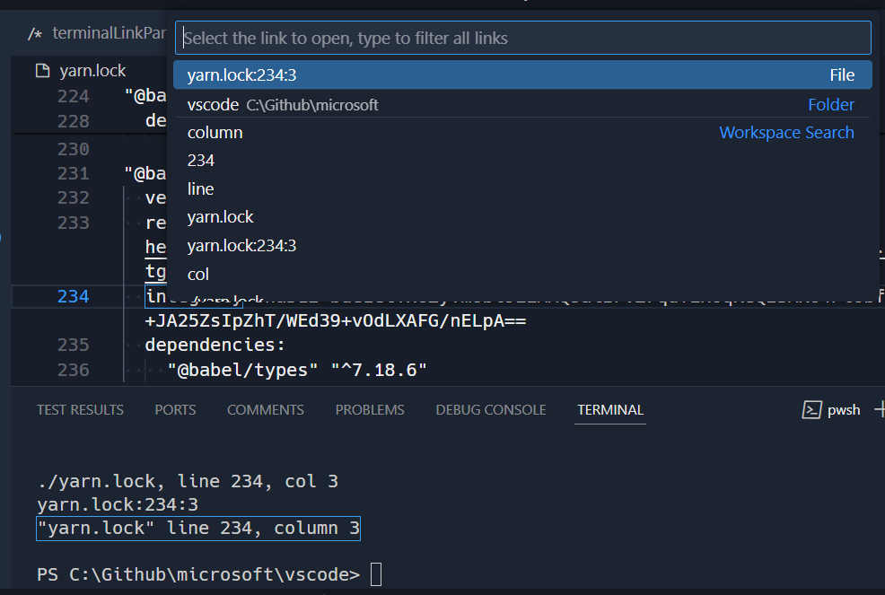

### Additional context for word links

[Word links](https://code.visualstudio.com/docs/terminal/basics#_links) are defined by the <code codesetting="terminal.integrated.wordSeparators">terminal.integrated.wordSeparators</code> setting and are the fallback when files/folder/URIs can't be found. When activated, these links now include extra surrounding context to add line and column information for the search that occurs.

Notice in the screenshot that the link `terminalLinkParsing` was selected, but the resulting search also includes the line number following the link.

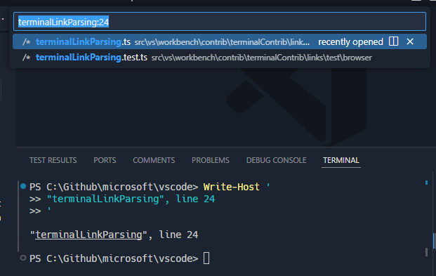

### New link formats

The following link format is now detected in terminals, even if the path contains spaces:

- <code>&nbsp;FILE&nbsp;&nbsp;path:line:column</code>

### Terminal Sticky Scroll transparency support

[Sticky Scroll in the terminal](https://code.visualstudio.com/updates/v1_85#_sticky-scroll) now supports transparency. A theme can use this by configuring the `terminalStickyScroll.background` theme color to a transparent value, or by specifying an override in your `settings.json`. For example:

```json
{
  "workbench.colorCustomizations": {
    "[Default Dark Modern]": {
      "terminalStickyScroll.background": "#181818c0"
    }
  }
}
```

Which results in a transparent Sticky Scroll background, allowing the text behind to shine through:

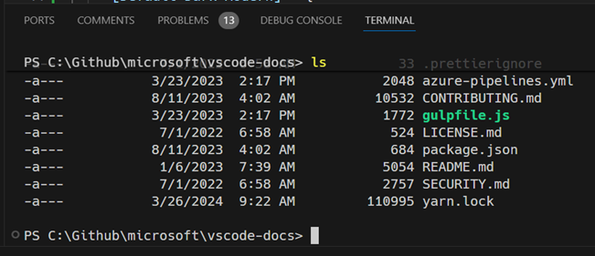

## Testing

### Test Coverage

This iteration, we've finalized our Test Coverage API, bringing native coverage support to VS Code. If your testing system supports it, you can get coverage by using the new **Run With Coverage** button:


There are similarly new keybindings for running with coverage, such as `kbstyle(Ctrl+; Ctrl+Shift+A)` to run all tests with coverage, and `kbstyle(Ctrl+; Ctrl+Shift+L)` to run your last set of tests with coverage.

Coverage information is shown as an overlay on line numbers by default, but you can **Toggle Inline Coverage** to see complete detailed information for your source files:

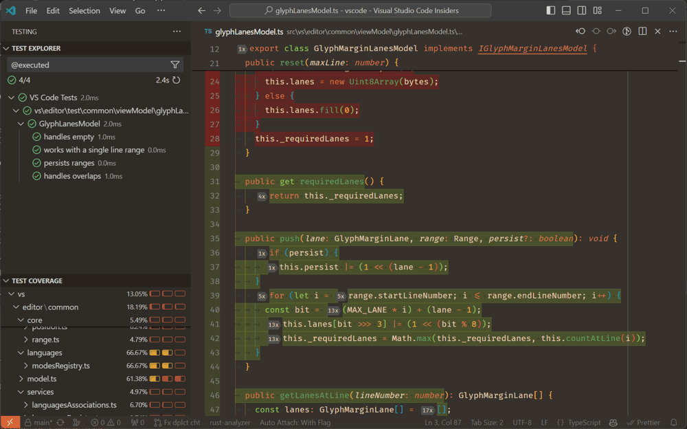

_Theme: [Codesong](https://marketplace.visualstudio.com/items?itemName=connor4312.codesong) (preview on [vscode.dev](https://vscode.dev/editor/theme/connor4312.codesong))_

Using test coverage requires that your extension implements the new API. Some extensions, such as the [Test Runner for Java](https://marketplace.visualstudio.com/items?itemName=vscjava.vscode-java-test) and the [node:test runner](https://marketplace.visualstudio.com/items?itemName=connor4312.nodejs-testing) already support it. Learn more about the Test Coverage for Java in the team's [December](https://devblogs.microsoft.com/java/java-on-visual-studio-code-update-december-2023/) and [January](https://devblogs.microsoft.com/java/java-on-visual-studio-code-update-january-2024/) updates.

Extension authors can find more details about the Test Coverage API in the [Testing API documentation](https://code.visualstudio.com/api/extension-guides/testing#test-coverage).

### Color code support in test messages

We now parse terminal color codes to colorize textual test messages, such as those displayed when a test fails, rather than displaying the raw 'unprintable' data codes.

## Languages

### TypeScript 5.4

VS Code now includes TypeScript 5.4. This major update brings new improvements to type-checking and IntelliSense, and several bug fixes. See the [TypeScript 5.4 release blog post](https://devblogs.microsoft.com/typescript/announcing-typescript-5-4/) for more details.

### Smarter inserting of images and links in Markdown

When you drop or paste an image or file into a Markdown file, VS Code automatically inserts Markdown image or link syntax for it. We now also smartly disable this behavior when you insert into code blocks and other contexts that don't support Markdown syntax:

<video src="images/1_88/md-drop.mp4" title="Smartly dropping an image into a Markdown file. Markdown image syntax is inserted when it can be used, but not used in code blocks" autoplay loop controls muted></video>

You can always switch back to inserting the Markdown syntax by using the drop/paste widget. You can configure this behavior by using the <code codesetting="markdown.editor.drop.enabled">markdown.editor.drop.enabled</code> and <code codesetting="markdown.editor.filePaste.enabled">markdown.editor.filePaste.enabled</code> settings.

## Notebooks

### Keyboard shortcuts in Notebook outputs

We now support some of the standard keyboard shortcuts in notebook outputs:

- Output can be selected and copied with the keyboard with the `kbstyle(Ctrl+A)` and `kbstyle(Ctrl+C)` keybindings respectively.
- Scrollable outputs can be scrolled with the keyboard with the `kbstyle(Up)` and `kbstyle(Down)` keybindings respectively.
- Scrolling to the top and bottom of a scrollable output can be achieved with the keyboard with the `kbstyle(Ctrl+Home)` and `kbstyle(Ctrl+End)` keybindings respectively (`kbstyle(Cmd+Up)` and `kbstyle(Cmd+Down)` on macOS).
- Selecting output from the current selection point to the top or bottom of the output, can be achieved with the keyboard with the `kbstyle(Ctrl+Shift+Up)` and `kbstyle(Ctrl+Shift+End)` keybindings respectively (`kbstyle(Shift+Cmd+Up)` and `kbstyle(Shift+Cmd+Down)` on macOS).

### Cell error diagnostics

An extension can now provide error details for a failed cell, so that an error diagnostic shows within the cell. While focused on the cell container, `notebook.cell.openFailureActions` (`kb(notebook.cell.openFailureActions)`) jumps to the quick actions menu for that error. The diagnostic only shows when a language model is available to provide quick actions.

<video src="images/1_88/cell-error-diagnostics.mp4" title="Error diagnostics in cells at failure location" autoplay loop controls muted></video>

### Run cells in section

To more easily run related cells in a notebook, you can now run cells that are grouped together by a markdown section header with the **Run Cells in Section** action. This action is available on the notebook Outline view and for Sticky Scroll elements.

Within Sticky Scroll elements, right-click the header of your choice, and run the section via the action in the context menu. Within the Outline view, select the toolbar icon that appears on hover or selection, and then run a single cell or a section of cells via the presented actions.

<video src="images/1_88/notebook-run-in-section.mp4" title="Run Cells in Section for notebook outline and Sticky Scroll" autoplay loop controls muted></video>

### Filter support in Outline view

You now have filters available in the notebook Outline view, which enable you to control the inclusion of Markdown headers, Code Cells, and Code Cell Symbols. The filters correspond to the following settings:

- <code codesetting="notebook.outline.showMarkdownHeadersOnly">notebook.outline.showMarkdownHeadersOnly</code>
- <code codesetting="notebook.outline.showCodeCells">notebook.outline.showCodeCells</code>
- <code codesetting="notebook.outline.showCodeCellSymbols">notebook.outline.showCodeCellSymbols</code>

<video src="images/1_88/notebook-outline-filters.mp4" title="Notebook Outline filter controls." autoplay loop controls muted></video>

### Prompt to save Interactive Window on close

By enabling the <code codesetting="interactiveWindow.promptToSaveOnClose">interactiveWindow.promptToSaveOnClose</code> setting, you are prompted to save the content in an Interactive Window when it is closed, to ensure that you don't lose any work. The only currently supported file format is `.ipynb`.

## Remote Development

The [Remote Development extensions](https://marketplace.visualstudio.com/items?itemName=ms-vscode-remote.vscode-remote-extensionpack), allow you to use a [Dev Container](https://code.visualstudio.com/docs/devcontainers/containers), remote machine via SSH or [Remote Tunnels](https://code.visualstudio.com/docs/remote/tunnels), or the [Windows Subsystem for Linux](https://learn.microsoft.com/windows/wsl) (WSL) as a full-featured development environment.

Highlights include:

- Alternate server download for distros with extended support
- Port forwarding based on URI query string
- Dev Containers extension automatically starts Docker
- Restrict access to Dev Tunnels and port forwarding via group policies

You can learn more about these features in the [Remote Development release notes](https://github.com/microsoft/vscode-docs/blob/main/remote-release-notes/v1_88.md).

## Contributions to extensions

### VS Code Speech

#### Lazy activation

The [VS Code Speech](https://marketplace.visualstudio.com/items?itemName=ms-vscode.vscode-speech) extension now only activates when voice-to-text services are requested in VS Code. This ensures that the extension is not negatively impacting the extension host startup time.

#### Use display language as default speech language

By default, the VS Code speech extension now uses the display language of VS Code as the speech language and selects the corresponding model, if that language is supported.

For the <code codesetting="accessibility.voice.speechLanguage">accessibility.voice.speechLanguage</code> setting, `auto` is the new default.

### GitHub Copilot

#### Inline Chat improvements

Inline Chat now starts as a floating control, making it more lightweight. After the first request, the control expands to take up more space. We have also adjusted the rendering to be more consistent with other chat experiences, such as the Chat view or Quick Chat.

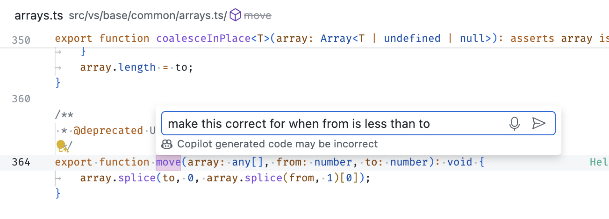
_Theme: [GitHub Light Colorblind (Beta)](https://marketplace.visualstudio.com/items?itemName=GitHub.github-vscode-theme)_

We've repositioned the rerun and feedback controls, and made the toggle control for viewing diffs more prominent alongside the Accept and Discard buttons.


_Theme: [GitHub Light Colorblind (Beta)](https://marketplace.visualstudio.com/items?itemName=GitHub.github-vscode-theme)_

#### Notebook kernel state as context

When you are in a notebook, the kernel state (for example, variables and available packages) is now automatically included as context in Inline Chat. This lets Copilot use the current state of the notebook to provide more relevant completions.

<video src="images/1_88/notebook-kernel-context.mp4" title="Notebook emebeds kernel state in context" autoplay loop controls muted></video>

_Theme: [GitHub Dark](https://marketplace.visualstudio.com/items?itemName=GitHub.github-vscode-theme)_

#### Commit message generation improvements

To improve the quality of the generated commit messages, we are now also including the commit messages of the 10 most recent commits in the repository, and the commit messages of the 10 most recent commits of the current user as extra context.

#### Workspace creation improvements

The `@workspace /new` command now offers sample projects, curated from GitHub repositories, as suggestions when a suitable match is detected for the chat prompt.

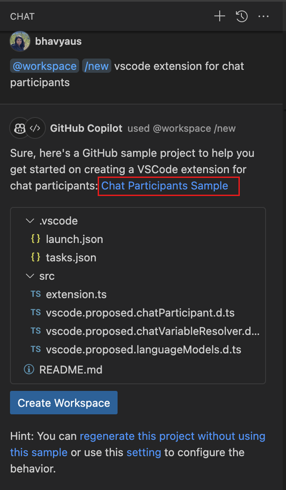

The `@workspace /new` command has also been enhanced to more effectively manage context and history. This enables you to refine suggested workspaces structure and file contents by asking follow-up queries. For example, "use TypeScript instead of JavaScript" or "also add bootstrap".

#### @terminal /explain slash command

A new `@terminal /explain` slash command is available, which is optimized for explaining commands or errors. Without `/explain`, `@terminal` is optimized to suggest a fix. This slash command is used in the **Explain using Copilot** quick fix or the **Explain selection** actions.

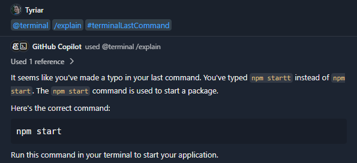

#### Preview: Terminal Inline Chat

A preview of the terminal Inline Chat is available in this release, which gives convenient access to Copilot's capabilities directly in the terminal.

You can enable terminal Inline Chat with the <code codesetting="terminal.integrated.experimentalInlineChat:true">terminal.integrated.experimentalInlineChat</code> setting. To invoke the inline chat in a terminal, use the `kb(inlinechat.start)` keybinding.


The terminal Inline Chat uses the `@terminal` chat participant, which has context about the integrated terminal's shell and its contents.


Once a command is suggested, use `kb(workbench.action.terminal.chat.runCommand)` to run the command in the terminal or `kb(workbench.action.terminal.chat.insertCommand)` to insert the command into the terminal. The command can also be edited directly in Copilot's response before running it (currently `kbstyle(Ctrl+down)`, `kbstyle(Tab)`, `kbstyle(Tab)` on Windows & Linux, `kbstyle(Cmd+down)`, `kbstyle(Tab)`, `kbstyle(Tab)` on macOS).

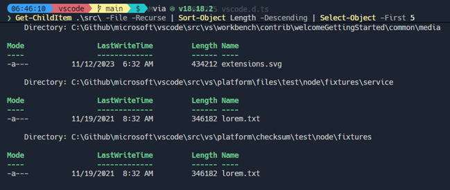

#### Clarity on authentication flow

Clarity around authentication is very important. We want to be clear about how we authenticate and what we ask for. If you open a private repository in VS Code, and we don't have the right authentication for this scenario, we present an authentication dialog. The dialog has a description of why authentication is needed, and a **Learn more** button to find out more about these requirements.


The **Learn more** button takes you to our [documentation on authentication requirements](https://github.com/microsoft/vscode-copilot-release/blob/a032cf75104a99ca745118ca51ea77219441a898/docs/copilot-repo-scope.md).

#### Variable references

The **Used references** section in a chat response gives information about the context that is used. Previously, this section only showed context that was pulled in implicitly. Now, it also shows variables that you mentioned explicitly in the chat prompt, such as `#file` or `#editor`. If a variable is missing from the Used references, it might indicate that it was ignored because it's too large for the context window of the language model.

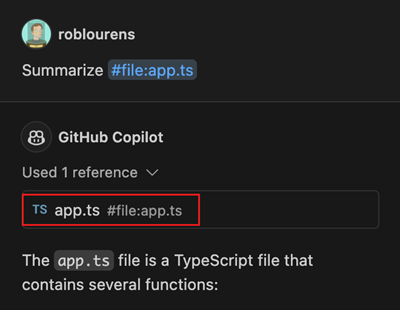

#### Secondary chat submit actions

In the Chat view, the chat submit button now has a dropdown for easy access to more actions.

- **Send to @workspace** submits your query to the `@workspace` chat participant, which is useful for questions about the contents of your workspace
- **Send to New Chat** starts a new empty chat, and then submits the query


#### Scope selection when using `Copilot: Explain This`

When you use `/explain` without a selection in your active editor, and there are multiple scopes of interest, we've added support for prompting to clarify which symbol or block scope to explain.

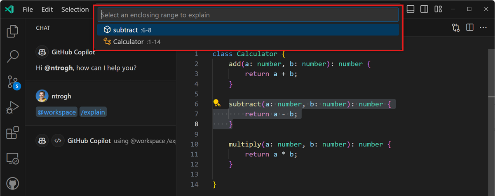

This behavior is currently opt-in, behind the <code codesetting="github.copilot.chat.scopeSelection">github.copilot.chat.scopeSelection</code> setting.

### Python

#### Improved Debug config selection for Flask and Django

Creating launch configurations for Flask and Django apps just got easier! Improvements have been made to detect possible startup files in your workspace when creating a `launch.json` for your web app.

For Django, the Python Debugger extension looks for `manage.py` or `app.py` files in the root or a subdirectory one level lower in your workspace. For Flask, the extension looks for `wsgi.py`, `app.py`, or `init.py` files that contain the declaration of a Flask application (for example, `app = Flask()`).

If those files are not found in the project, the dropdown shows a **Default** option for the corresponding project type, even though that file might not be present.

#### Hatch environment discovery

Hatch environments are now discovered and activated by default, similar to other common environments, such as Venv, Conda, and Poetry. Furthermore, in the case of Hatch, where an explicit environment identifier is not registered, the extension is able to determine the environment type (Hatch) from the environment locator.

#### Automatic environment selection for pipenv, pyenv, and Poetry projects

If your workspace contains a pipenv, pyenv, or Poetry environment, the corresponding environment is now automatically selected for your workspace. Previously, the extension correctly discovered these environments, but selected the default global interpreter, which required you to manually select the appropriate environment for your workspace.

Now, the Python extension infers the activated environment based on the presence of the environment and any corresponding configuration files. For example, in the case of pyenv, the extension looks at the `.python-version` file to automatically select the appropriate interpreter for the workspace.

#### Report Issue command improvements

The [Python](https://marketplace.visualstudio.com/items?itemName=ms-python.python) and [Python Debugger](https://marketplace.visualstudio.com/items?itemName=ms-python.debugpy) extensions now make it easier for you to report issues to our repos! If you file an issue with the **Report Issue** command (`workbench.action.openIssueReporter`), most of the heavy lifting is already done, and you're only prompted for some additional info so our team can efficiently triage the problem you are encountering.

To file an issue using the **Help: Report Issue** command for [@vscode-python](https://github.com/microsoft/vscode-python) or [@vscode-python-debugger](https://github.com/microsoft/vscode-python-debugger), choose **Python** or **Python Debugger** respectively from the extension dropdown.

### GitHub Pull Requests

There has been more progress on the [GitHub Pull Requests](https://marketplace.visualstudio.com/items?itemName=GitHub.vscode-pull-request-github) extension, which enables you to work on, create, and manage pull requests and issues. New features include:

- Outdated comments are displayed differently from current comments in the Comments view.
- The new `auto` value for <code codesetting="githubPullRequests.createDefaultBaseBranch">githubPullRequests.createDefaultBaseBranch</code> uses the upstream's default branch as the base branch for fork repositories.
- Comment threads in the Comments view have inline actions (resolve/unresolve and "Diff Comment with HEAD" for outdated comments) and context menu actions.

Review the [changelog for the 0.86.0](https://github.com/microsoft/vscode-pull-request-github/blob/main/CHANGELOG.md#0860) release of the extension to learn about the other highlights.

### Jupyter

#### Cell execution analysis improvements

With the latest Pylance prerelease, we have better dependency analysis for Jupyter cells. It now understands module imports, which is especially useful when you have a cell that imports a module that was defined in a previous cell.

<video src="images/1_88/run-precedent-cells.mp4" autoplay loop controls muted title="Run Precedent Cells"></video>

To enable this feature, install the latest [Pylance](https://marketplace.visualstudio.com/items?itemName=ms-python.vscode-pylance) prerelease in VS Code Insiders, and enable the <code codesetting="jupyter.executionAnalysis.enabled">jupyter.executionAnalysis.enabled</code> and <code codesetting="notebook.consolidatedRunButton">notebook.consolidatedRunButton</code> settings.

## Extension authoring

### Use Issue Reporter command for extension bug reporting

Last iteration, we finalized a way for extensions to contribute extra data or templates to fill out when submitting to GitHub via VS Code's Issue Reporter. Extensions can contribute a command, which can be accessed via the **Help: Report Issue...** command. Selecting their extension runs their contributed command. Please review our [issue reporting documentation/release notes](https://code.visualstudio.com/updates/v1_87#_contributing-additional-data-in-issue-reporter) for more information on how this can work with your extension!

Additionally, all installed extensions can be quickly reported on via Quick Open. By typing `issue ` in Quick Open (`kb(workbench.action.quickOpen)`), you can quickly select or search for an installed extension to report on.

Certain extensions will start moving over to utilizing this new issue reporting flow and will no longer need custom `Report Issue...` commands that are contributed directly into the command palette.

## Preview Features

### Rescaling overlapping glyph in the terminal

A new setting <code codesetting="terminal.integrated.rescaleOverlappingGlyphs">terminal.integrated.rescaleOverlappingGlyphs</code> is available, which rescales glyphs that overlap following cells. This is intended to cover ambiguous width characters, which might have font glyphs that don't match what the backing pty/unicode version thinks it is. For example, in most fonts the roman numeral unicode characters (`U+2160+`) typically takes up multiple cells, so they are rescaled horizontally when this setting is enabled.

Without rescaling:


With rescaling:


The rules for when rescaling happens are still being tweaked and we are considering enabling this by default in the future when it's solid. If you try this out and see characters that are being rescaled but should not be, please [create an issue](https://github.com/microsoft/vscode/issues/new/choose).

### Local workspace extensions

We are excited to introduce this new preview feature that allows you to package an extension directly in your workspace. This feature is designed to cater to your specific workspace needs and provide a more tailored development experience.

To use this feature, you need to package your extension in the `.vscode/extensions` folder within your workspace. VS Code then shows this extension in the **Workspace Recommendations** section of the Extensions view from where users can install it. VS Code installs this extension only for that workspace. It also requires the user to trust the workspace before installing and running this extension.

For instance, consider the `vscode-selfhost-test-provider` extension in the [VS Code repository](https://github.com/microsoft/vscode/tree/main/.vscode/extensions/vscode-selfhost-test-provider). This extension plugs in test capabilities, enabling contributors to view and run tests directly within the workspace. Following screenshot shows the `vscode-selfhost-test-provider` extension in the Workspace Recommendations section of the Extensions view and the ability to install it.

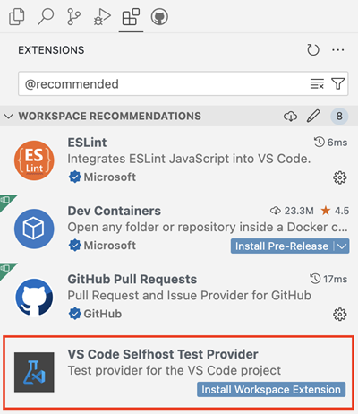

This feature is available for preview in the [Insiders](https://code.visualstudio.com/insiders/) release via <code codesetting="extensions.experimental.supportWorkspaceExtensions">extensions.experimental.supportWorkspaceExtensions</code>. Try it out and let us know your feedback by creating issues in the [VS Code repository](https://github.com/microsoft/vscode/issues).

## Proposed APIs

### Terminal shell integration API

A new proposed API that enables accessing some of the information provided by shell integration-activated terminals is now available. With this API, it is possible to listen to the incoming data and exit codes of commands being executed in the terminal. It also introduces a more reliable way to execute commands that wait for the prompt to be available, before sending the command which helps fix some conflicts/race conditions that can occur with various shell set ups.

Here's an example of using the `Terminal.shellIntegration.executeCommand` proposal:

```ts
// Execute a command in a terminal immediately after being created
const myTerm = window.createTerminal();
window.onDidActivateTerminalShellIntegration(async ({ terminal, shellIntegration }) => {
  if (terminal === myTerm) {
    const command = shellIntegration.executeCommand('echo "Hello world"');
    const code = await command.exitCode;
    console.log(`Command exited with code $\{code\}
`);
  }
}));

// Fallback to sendText if there is no shell integration within 3 seconds of launching
setTimeout(() => {
  if (!myTerm.shellIntegration) {
    myTerm.sendText('echo "Hello world"');
    // Without shell integration, we can't know when the command has finished or what the
    // exit code was.
  }
}, 3000);
```

Here's an example of listening to the data stream of a command:

```ts
// Create a terminal and log all data via console.log
const myTerm = window.createTerminal();
window.onDidStartTerminalShellExecution((execution) => {
  if (execution.terminal === myTerm) {
    const stream = execution.createDataStream();
    for await (const data of stream) {
      console.log(data);
    }
  }
});
```

You can review the new API [here](https://github.com/microsoft/vscode/blob/main/src/vscode-dts/vscode.proposed.terminalShellIntegration.d.ts).

### Learn More property for authentication API

This iteration, we added a new proposed API that enables you to specify a `learnMore` property in `AuthenticationForceNewSessionOptions`. The idea is that if you call `getSession` with a `forceNewSession` property in the options, you can include a `URI` that would be presented to the user to learn more about why you're asking for authentication. Here's an example of what that looks like:


Here's what that looks like in code:

```ts
vscode.authentication.getSession('github', ['repo'], {
  forceNewSession: {
    detail: l10n.t('To show you more relevant Copilot Chat results, we need permission to read the contents of your repository on GitHub.'),
    learnMore: Uri.parse('https://aka.ms/copilotRepoScope')
  };
});
```

You can review the new API [here](https://github.com/microsoft/vscode/blob/038cbaa25d4c61c4c76e50e299a72a055466e745/src/vscode-dts/vscode.proposed.authLearnMore.d.ts).

### Outdated comments

The new comment thread `applicability` property lets comment threads be marked as outdated in the Comments view:


You can see the API proposal [here](https://github.com/microsoft/vscode/blob/6e62970b0566796d6cfd2b28722e0ccd32cd3af2/src/vscode-dts/vscode.proposed.commentThreadApplicability.d.ts#L16-L30).

### Comment view menus

The `commentsView/commentThread/context` proposed menu enables actions to be added to the right-click context menu of a comment thread in the Comments view. The usual `inline` group is also respected, so that actions are shown in the Comments view inline.


## Engineering

### Electron 28 update

In this iteration, we are promoting the Electron 28 update to users on our stable release. This update comes with Chromium 120.0.6099.291 and Node.js 18.18.2. We want to thank everyone who self-hosted on Insiders builds and provided early feedback.

## Notable fixes

- [204886](https://github.com/microsoft/vscode/issues/204886) Opening a file on a different path but with the same name in the simple file picker fails

## Thank you

Last but certainly not least, a big _**Thank You**_ to the contributors of VS Code.

### Issue tracking

Contributions to our issue tracking:

- [@gjsjohnmurray (John Murray)](https://github.com/gjsjohnmurray)
- [@IllusionMH (Andrii Dieiev)](https://github.com/IllusionMH)
- [@RedCMD (RedCMD)](https://github.com/RedCMD)
- [@starball5 (starball)](https://github.com/starball5)
- [@the-coder-o (Abdul basit)](https://github.com/the-coder-o)
- [@ArturoDent (ArturoDent)](https://github.com/ArturoDent)

### Pull requests

Contributions to `vscode`:

- [@333fred (Fred Silberberg)](https://github.com/333fred): Do not trim whitespace when part of strings or regexes [PR #198164](https://github.com/microsoft/vscode/pull/198164)
- [@89netraM (Mårten Åsberg)](https://github.com/89netraM): Render final line number for interval setting [PR #207227](https://github.com/microsoft/vscode/pull/207227)
- [@a-stewart (Anthony Stewart)](https://github.com/a-stewart)
  - Stop the cursor from jumping when changing prefix in QuickAccess - v2 [PR #204702](https://github.com/microsoft/vscode/pull/204702)
  - Export ILocalizedString in nls.mock.ts [PR #206449](https://github.com/microsoft/vscode/pull/206449)
- [@akbyrd (Adam Byrd)](https://github.com/akbyrd)
  - Implement separate colors for primary and secondary cursors when multiple cursors are present [PR #181991](https://github.com/microsoft/vscode/pull/181991)
  - Change editor.action.focusNextCursor to reveal the primary cursor instead of all cursors [PR #182148](https://github.com/microsoft/vscode/pull/182148)
- [@AndreasBackx (Andreas Backx)](https://github.com/AndreasBackx): Fix smooth scrolling Linux Wayland. [PR #205122](https://github.com/microsoft/vscode/pull/205122)
- [@andrewbranch (Andrew Branch)](https://github.com/andrewbranch): [typescript-language-features] Fix autoImportFileExcludePatterns format to work on Windows [PR #202762](https://github.com/microsoft/vscode/pull/202762)
- [@andyscho (Andy Schoenberger)](https://github.com/andyscho): Only one subscriber for kernels for onDidChangeSelectedNotebooks [PR #204417](https://github.com/microsoft/vscode/pull/204417)
- [@BABA983 (BABA)](https://github.com/BABA983): Better testing side bar retried color [PR #207949](https://github.com/microsoft/vscode/pull/207949)
- [@BrandonXLF (Brandon Fowler)](https://github.com/BrandonXLF): Override CSS content for terminal tab image icons [PR #207220](https://github.com/microsoft/vscode/pull/207220)
- [@BrookMaoDev (Brook Mao)](https://github.com/BrookMaoDev): Improved description for editor.useTabStops setting [PR #206552](https://github.com/microsoft/vscode/pull/206552)
- [@btwiuse](https://github.com/btwiuse): cli: add --server-base-path flag to `code serve-web` command [PR #207932](https://github.com/microsoft/vscode/pull/207932)
- [@BusinessDuck (Dmitriy Yurov)](https://github.com/BusinessDuck): Fix 'e.getModifierState is not a function' error for browser auto filled form events [PR #206883](https://github.com/microsoft/vscode/pull/206883)
- [@cchanche (Clément Chanchevrier)](https://github.com/cchanche): Resize terminal direction [PR #205015](https://github.com/microsoft/vscode/pull/205015)
- [@CGNonofr (Loïc Mangeonjean)](https://github.com/CGNonofr)
  - Fix keyboard layout detection [PR #205193](https://github.com/microsoft/vscode/pull/205193)
  - Fix fullscreen container dimension detection when not directly on body [PR #205884](https://github.com/microsoft/vscode/pull/205884)
- [@cpendery (Chapman Pendery)](https://github.com/cpendery)
  - fix: terminal suggestions to sort by fuzzy score [PR #208486](https://github.com/microsoft/vscode/pull/208486)
  - fix: don't show terminal suggestions when keybindings are sent through to shell [PR #208523](https://github.com/microsoft/vscode/pull/208523)
  - fix: suggest widget persisting on completion acceptance [PR #208524](https://github.com/microsoft/vscode/pull/208524)
- [@deyihu (hu de yi)](https://github.com/deyihu): editor paste event result return ClipboardEvent [PR #192732](https://github.com/microsoft/vscode/pull/192732)
- [@dgileadi (David Gileadi)](https://github.com/dgileadi): Introduce minimap section headers, a la Xcode [PR #190759](https://github.com/microsoft/vscode/pull/190759)
- [@futurist (James Yang)](https://github.com/futurist): feat: add ipcLogger and timeoutDelay for IPCServer [PR #193896](https://github.com/microsoft/vscode/pull/193896)
- [@gjsjohnmurray (John Murray)](https://github.com/gjsjohnmurray): Make channel log level settable from output view [PR #205159](https://github.com/microsoft/vscode/pull/205159)
- [@harbin1053020115 (ermin.zem)](https://github.com/harbin1053020115): fix: Select first extension walkthrough for first launch if no built-in walkthroughs present. [PR #207303](https://github.com/microsoft/vscode/pull/207303)
- [@hickford (M Hickford)](https://github.com/hickford): Sort lines: sort all lines if nothing selected. [PR #200325](https://github.com/microsoft/vscode/pull/200325)
- [@hsfzxjy (Xie Jingyi)](https://github.com/hsfzxjy)
  - Fix setting editor list item overflow [PR #206681](https://github.com/microsoft/vscode/pull/206681)
  - Add log point on middle clicking gutter [PR #206684](https://github.com/microsoft/vscode/pull/206684)
- [@IncognitaDev (Luis Sousa)](https://github.com/IncognitaDev): Feat: Add PascalCase to CaseActions [PR #206259](https://github.com/microsoft/vscode/pull/206259)
- [@its-miroma (Miroma)](https://github.com/its-miroma): Change default YAML extension [PR #206447](https://github.com/microsoft/vscode/pull/206447)
- [@jeanp413 (Jean Pierre)](https://github.com/jeanp413): Fixes breadcrumbs widget does not get resized properly [PR #200591](https://github.com/microsoft/vscode/pull/200591)
- [@jeremy-rifkin (Jeremy Rifkin)](https://github.com/jeremy-rifkin): Expand monarch functionality to allow state access within rules [PR #183463](https://github.com/microsoft/vscode/pull/183463)
- [@jhasse (Jan Niklas Hasse)](https://github.com/jhasse): Use indentSize instead of tabSize for LineCommentCommand [PR #193811](https://github.com/microsoft/vscode/pull/193811)
- [@Krzysztof-Cieslak (Krzysztof Cieślak)](https://github.com/Krzysztof-Cieslak)
  - Fix off-by-one error in rendering removals in inline edits [PR #205890](https://github.com/microsoft/vscode/pull/205890)
  - Inline edit - make sure we cancel in-progress request on blur [PR #206430](https://github.com/microsoft/vscode/pull/206430)
  - Inline Edit - make sure we finalize accepting before requesting new edit [PR #206525](https://github.com/microsoft/vscode/pull/206525)
- [@lusingander (Kyosuke Fujimoto)](https://github.com/lusingander): Fix broken description of `editor.cursorSurroundingLinesStyle` setting [PR #201482](https://github.com/microsoft/vscode/pull/201482)
- [@mahmoudsalah1993 (Mahmoud Salah)](https://github.com/mahmoudsalah1993): for diff editors, resolve the modified editor to allow run tests in c… [PR #206026](https://github.com/microsoft/vscode/pull/206026)
- [@marrej (Marcus Revaj)](https://github.com/marrej): # Add partial accept kind to inline completion handle [PR #202668](https://github.com/microsoft/vscode/pull/202668)
- [@mkasenberg](https://github.com/mkasenberg): searchEditor: Add option to peek with a single click [PR #204413](https://github.com/microsoft/vscode/pull/204413)
- [@mroch (Marshall Roch)](https://github.com/mroch): fix "Extension [object Object] is not known" [PR #207764](https://github.com/microsoft/vscode/pull/207764)
- [@NriotHrreion (NoahHrreion)](https://github.com/NriotHrreion): Fix the unexpected position of hover widgets [PR #205502](https://github.com/microsoft/vscode/pull/205502)
- [@orgads (Orgad Shaneh)](https://github.com/orgads)
  - Tunnel: Extend port mapping lookup also for querystring (take 2) [PR #204807](https://github.com/microsoft/vscode/pull/204807)
  - Tunnel: Re-add unit tests for port mapping [PR #207249](https://github.com/microsoft/vscode/pull/207249)
- [@PmcFizz (Fizz)](https://github.com/PmcFizz): Update IActionDescriptor.precondition desc [PR #176124](https://github.com/microsoft/vscode/pull/176124)
- [@raphaelgpalma (Raphael Palma)](https://github.com/raphaelgpalma): Fix grammatical error: 'But allow them if the are made from inside an…' [PR #207584](https://github.com/microsoft/vscode/pull/207584)
- [@rehmsen (Ole)](https://github.com/rehmsen): Log `resource` telemetry also for side-by-side views on browsers. [PR #208196](https://github.com/microsoft/vscode/pull/208196)
- [@russelldavis (Russell Davis)](https://github.com/russelldavis): Fix decreaseIndentPattern for javascript and typescript [PR #201425](https://github.com/microsoft/vscode/pull/201425)
- [@samdenty (Sam Denty)](https://github.com/samdenty): feat(web/lifecycleService): correct startupKind [PR #206563](https://github.com/microsoft/vscode/pull/206563)
- [@Sidebail (VLADIMIR VATSURIN)](https://github.com/Sidebail): Fix file relative path link [PR #181475](https://github.com/microsoft/vscode/pull/181475)
- [@SimonSiefke (Simon Siefke)](https://github.com/SimonSiefke): fix: memory leak in notebook baseCellViewModel [PR #205499](https://github.com/microsoft/vscode/pull/205499)
- [@solimant](https://github.com/solimant): Honor GitHub brand name casing [PR #208503](https://github.com/microsoft/vscode/pull/208503)
- [@thegecko (Rob Moran)](https://github.com/thegecko): Update extensionPaths when web extension host started [PR #193849](https://github.com/microsoft/vscode/pull/193849)
- [@vinistock (Vinicius Stock)](https://github.com/vinistock): Fix accidental dedent for `in` and `when` dedent in Ruby comments [PR #206132](https://github.com/microsoft/vscode/pull/206132)
- [@yamachu (Yusuke Yamada)](https://github.com/yamachu): Fixed to show files in deepest directory in search results [PR #206609](https://github.com/microsoft/vscode/pull/206609)
- [@Yesterday17 (Yesterday17)](https://github.com/Yesterday17): Dispatch GestureEvent in node depth order [PR #200612](https://github.com/microsoft/vscode/pull/200612)
- [@yiliang114 (易良)](https://github.com/yiliang114): Fix Copy/Cut command not working in webview [PR #206529](https://github.com/microsoft/vscode/pull/206529)
- [@yutotnh (yutotnh)](https://github.com/yutotnh): Add support for recognizing word locales in word operations (#50045) [PR #203605](https://github.com/microsoft/vscode/pull/203605)

Contributions to `vscode-css-languageservice`:

- [@balaji-sivasakthi (Balaji Sivasakthi)](https://github.com/balaji-sivasakthi): feat: support hover tooltip for scss [PR #367](https://github.com/microsoft/vscode-css-languageservice/pull/367)

Contributions to `vscode-eslint`:

- [@JoshuaKGoldberg (Josh Goldberg ✨)](https://github.com/JoshuaKGoldberg): feat: support json, json5, jsonc in eslint.probe setting [PR #1787](https://github.com/microsoft/vscode-eslint/pull/1787)
- [@remcohaszing (Remco Haszing)](https://github.com/remcohaszing)
  - Support probing MDX [PR #1794](https://github.com/microsoft/vscode-eslint/pull/1794)
  - Support probing Astro [PR #1795](https://github.com/microsoft/vscode-eslint/pull/1795)

Contributions to `vscode-extension-samples`:

- [@juliankasimir (Julian Kasimir)](https://github.com/juliankasimir): feat(lang): replace German with English in showQuickPick function [PR #983](https://github.com/microsoft/vscode-extension-samples/pull/983)

Contributions to `vscode-hexeditor`:

- [@jogo-](https://github.com/jogo-): Update CHANGELOG.md [PR #495](https://github.com/microsoft/vscode-hexeditor/pull/495)

Contributions to `vscode-js-debug`:

- [@Beanyy](https://github.com/Beanyy): Fix formatting of number 0 in remote object when description is not set [PR #1968](https://github.com/microsoft/vscode-js-debug/pull/1968)
- [@mdh1418 (Mitchell Hwang)](https://github.com/mdh1418): [CDP] Send telemetry for DotnetDebugger error event [PR #1961](https://github.com/microsoft/vscode-js-debug/pull/1961)
- [@relief-melone (Relief.Melone)](https://github.com/relief-melone): added proxy support for build [PR #1965](https://github.com/microsoft/vscode-js-debug/pull/1965)

Contributions to `vscode-json-languageservice`:

- [@denisw (Denis Washington)](https://github.com/denisw): Fix sorting error in case of nested trailing comma [PR #223](https://github.com/microsoft/vscode-json-languageservice/pull/223)

Contributions to `vscode-pull-request-github`:

- [@ipcjs (ipcjs)](https://github.com/ipcjs): fix: make `review.openLocalFile` support triggering from the keyboard. [PR #5840](https://github.com/microsoft/vscode-pull-request-github/pull/5840)
- [@mohamedamara1 (Mohamed Amara)](https://github.com/mohamedamara1): fixed ID of IssueOverviewPanel [PR #5822](https://github.com/microsoft/vscode-pull-request-github/pull/5822)

Contributions to `vscode-pylint`:

- [@MGasiewski](https://github.com/MGasiewski): Add logic to replace tilde with home environment [PR #524](https://github.com/microsoft/vscode-pylint/pull/524)

Contributions to `vscode-python-debugger`:

- [@bersbersbers](https://github.com/bersbersbers): Update `launch.json` schema [PR #243](https://github.com/microsoft/vscode-python-debugger/pull/243)
- [@StephanTLavavej (Stephan T. Lavavej)](https://github.com/StephanTLavavej): Fix typos [PR #217](https://github.com/microsoft/vscode-python-debugger/pull/217)

Contributions to `debug-adapter-protocol`:

- [@andyw8 (Andy Waite)](https://github.com/andyw8): Update adapters list for Ruby LSP [PR #471](https://github.com/microsoft/debug-adapter-protocol/pull/471)
- [@svaante (Daniel Pettersson)](https://github.com/svaante): Add Emacs dape package to Implementations tools section [PR #469](https://github.com/microsoft/debug-adapter-protocol/pull/469)

Contributions to `inno-updater`:

- [@ChayimFriedman2 (Chayim Refael Friedman)](https://github.com/ChayimFriedman2): Remove unneeded `unsafe impl Send` [PR #25](https://github.com/microsoft/inno-updater/pull/25)

Contributions to `language-server-protocol`:

- [@asukaminato0721 (Asuka Minato)](https://github.com/asukaminato0721)
  - add lsp [PR #1907](https://github.com/microsoft/language-server-protocol/pull/1907)
  - add basedpyright [PR #1913](https://github.com/microsoft/language-server-protocol/pull/1913)
- [@iliaamiri (Ilia Abedianamiri)](https://github.com/iliaamiri): A small typo in the summary paragraph [PR #1903](https://github.com/microsoft/language-server-protocol/pull/1903)
- [@lukaskesch (Lukas Kesch)](https://github.com/lukaskesch): Updating copyright year to 2024 in footer.html [PR #1909](https://github.com/microsoft/language-server-protocol/pull/1909)
- [@MariaSolOs (Maria José Solano)](https://github.com/MariaSolOs): Specification for MarkupContent support in diagnostic messages [PR #1905](https://github.com/microsoft/language-server-protocol/pull/1905)
- [@oliviacrain (Olivia Crain)](https://github.com/oliviacrain): Remove server entry for rnix-lsp [PR #1902](https://github.com/microsoft/language-server-protocol/pull/1902)

Contributions to `monaco-editor`:

- [@jeremy-rifkin (Jeremy Rifkin)](https://github.com/jeremy-rifkin): Fix bug with highlighting of C++ raw string literals [PR #4436](https://github.com/microsoft/monaco-editor/pull/4436)

Contributions to `node-pty`:

- [@kkocdko (kkocdko)](https://github.com/kkocdko)
  - chore: remove deprecated api `process.binding` [PR #653](https://github.com/microsoft/node-pty/pull/653)
  - fix: upgrade node-gyp to fix macOS build error [PR #673](https://github.com/microsoft/node-pty/pull/673)

<a id="scroll-to-top" role="button" title="Scroll to top" aria-label="scroll to top" href="#"><span class="icon"></span></a>

<link rel="stylesheet" type="text/css" href="css/inproduct_releasenotes.css"/>
