# 튜토리얼: Visual Studio Code <br /> 시작하기 {#tutorial-get-started-with-visual-studio-code}

이 튜토리얼에서는 빠르게 코딩을 시작할 수 있도록 Visual Studio Code의 주요 기능에 대해 알아봅니다. 사용자 인터페이스의 다양한 구성 요소와 이를 원하는 대로 사용자 지정하는 방법을 배웁니다. 그런 다음 코드를 작성하고 IntelliSense 및 코드 액션과 같은 내장된 코드 편집 기능을 사용하며, 코드 실행 및 디버깅에 대해 배웁니다. 언어 확장을 설치하여 다른 프로그래밍 언어에 대한 지원을 추가합니다.

:::tip
영상으로 따라가는 것을 선호하신다면, 이 튜토리얼과 동일한 내용을 다루는 [시작하기 비디오](https://www.youtube.com/watch?v=B-s71n0dHUk)를 시청하실 수 있습니다.
:::

## 사전 요구 사항 {#prerequisites}

- [컴퓨터에 Visual Studio Code를 다운로드하고 설치](https://code.visualstudio.com/download)

## VS Code에서 폴더 열기 {#open-a-folder-in-vs-code}

VS Code를 사용하여 빠른 편집을 위한 개별 파일 작업을 하거나, *작업 영역*이라고도 하는 폴더를 열 수 있습니다.

폴더를 생성하고 VS Code에서 여는 것부터 시작하겠습니다. 이 폴더는 튜토리얼 전반에 걸쳐 사용됩니다.

1. Visual Studio Code를 엽니다.

   VS Code를 처음 열면 시작하기 위한 다양한 작업이 있는 **Welcome** 페이지가 표시됩니다.

2. 메뉴에서 **File > Open Folder...** 를 선택하여 폴더를 엽니다.

   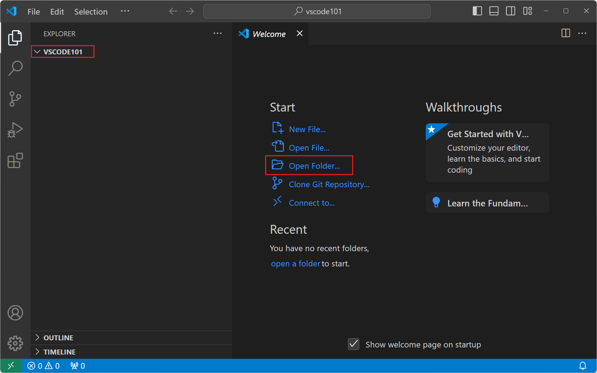

3. **New Folder**를 선택하고 `vscode101`이라는 새 폴더를 만든 다음 **Select Folder**(macOS에서는 **Open**)을 선택합니다.

   생성한 폴더가 작업 영역의 루트가 됩니다.

4. 작업 영역 신뢰 대화 상자에서 **Yes, I trust the authors**를 선택하여 작업 영역에서 모든 기능을 활성화합니다.

   

   컴퓨터에 폴더를 생성했기 때문에 폴더의 코드를 신뢰할 수 있습니다.

   :::important
   작업 영역 신뢰를 통해 프로젝트 폴더의 코드가 VS Code에 의해 실행될 수 있는지 여부를 결정할 수 있습니다. 인터넷에서 코드를 다운로드할 때는 먼저 실행해도 안전한지 검토해야 합니다. [작업 영역 신뢰](/docs/editor/workspace-trust.md)에 대해 자세히 알아보세요.
   :::

5. 이제 왼쪽에 폴더 이름이 표시된 **Explorer** 보기가 표시됩니다.

   탐색기 보기를 사용하여 작업 영역의 파일과 폴더를 보고 관리할 수 있습니다.

:::tip
VS Code에서 폴더를 열면 열린 파일, 활성 보기, 에디터 레이아웃과 같은 해당 폴더의 UI 상태를 복원할 수 있습니다. 해당 폴더에만 적용되는 설정을 구성하거나 디버그 구성을 정의할 수도 있습니다. [작업 영역](/docs/editor/workspaces.md)에 대해 자세히 알아보세요.
:::

## 사용자 인터페이스 살펴보기 {#explore-the-user-interface}

이제 VS Code에서 폴더를 열었으니 사용자 인터페이스를 빠르게 둘러보겠습니다.

### Activity Bar로 화면 전환하기 {#switch-between-views-with-the-activity-bar}

1. Activity Bar을 사용하여 다양한 화면 사이를 전환합니다.

   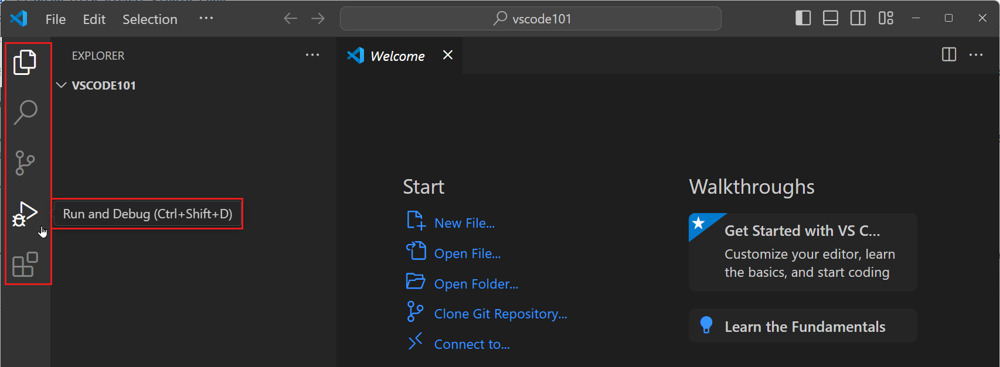

   :::tip
   Activity Bar 위에 마우스를 올리면 각 화면의 이름과 해당 키보드 단축키를 볼 수 있습니다. 화면을 다시 선택하거나 키보드 단축키를 눌러 화면을 토글할 수 있습니다.
   :::

2. Activity Bar에서 화면을 선택하면 화면별 정보를 표시하는 **Primary Side Bar**가 열립니다.

   예를 들어, Run and Debug 화면을 사용하면 디버깅 세션을 구성하고 시작할 수 있습니다.

   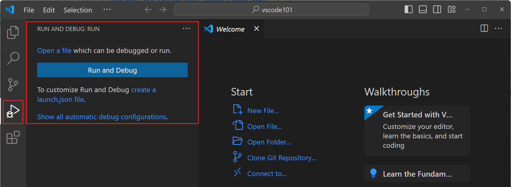

### 에디터로 파일 화면 및 편집하기 {#view-and-edit-files-with-the-editor}

1. Activity Bar에서 탐색기 화면을 선택하고 **New File...** 버튼을 선택하여 작업 영역에 새 파일을 만듭니다.

   

2. `index.html`이라는 이름을 입력하고 `Enter`를 누릅니다.

   작업 영역에 파일이 추가되고 창의 메인 영역에 에디터가 열립니다.

   

3. `index.html` 파일에 HTML 코드를 입력하기 시작합니다.

   입력하면서 코드 완성을 돕는 제안이 팝업으로 표시되는 것을 볼 수 있습니다(_IntelliSense_). `Up` 및 `Down` 키를 사용하여 제안을 탐색하고 `Tab`을 사용하여 선택한 제안을 삽입할 수 있습니다.

4. 작업 영역에 더 많은 파일을 추가하고 각 파일이 새 에디터 탭을 여는 것을 확인하세요.

   원하는 만큼 많은 에디터를 열고 세로 또는 가로로 나란히 볼 수 있습니다. [나란히 편집](/docs/getstarted/userinterface.md#side-by-side-editing)에 대해 자세히 알아보세요.

   

### 패널 영역에서 터미널 접근하기 {#access-the-terminal-from-the-panel-area}

1. VS Code에는 통합 터미널이 있습니다. `Ctrl+`을 눌러 엽니다.

   운영 체제 구성에 따라 PowerShell, 명령 프롬프트 또는 Bash와 같은 다양한 셸 중에서 선택할 수 있습니다.

   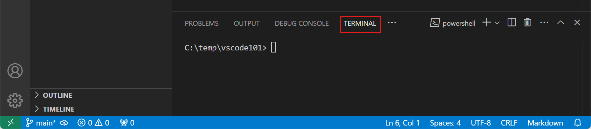

2. 터미널에서 다음 명령을 입력하여 작업 영역에 새 파일을 만듭니다.

   ```bash
   echo "Hello, VS Code" > greetings.txt
   ```

   기본 작업 폴더는 작업 영역의 루트입니다. 탐색기 화면이 자동으로 새 파일을 감지하고 표시하는 것을 확인하세요.

   

3. 여러 터미널을 동시에 열 수 있습니다. **Launch Profile** 드롭다운을 선택하여 사용 가능한 셸을 보고 선택하세요.

   

### 명령 팔레트로 명령 접근하기 {#access-commands-with-the-command-palette}

1. `Ctrl+Shift+P`를 눌러 **Command Palette**를 엽니다. **View > Command Palette...** 메뉴 항목을 사용할 수도 있습니다.

   VS Code의 많은 명령이 명령 팔레트를 통해 사용할 수 있습니다. 확장을 설치하면 명령 팔레트에 명령이 추가될 수도 있습니다.

   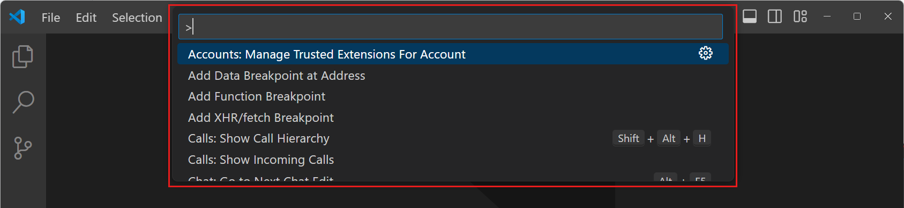

   :::tip
   명령 팔레트는 키보드 단축키가 있는 명령의 기본 키보드 단축키를 보여줍니다. 키보드 단축키를 사용하여 명령을 직접 실행할 수 있습니다.
   :::

2. 명령 팔레트는 다양한 작동 모드를 지원합니다:

   1. `>` 기호 뒤에 입력을 시작하여 명령 목록을 필터링합니다. 예를 들어, `move terminal`을 입력하여 터미널을 새 창으로 이동하는 명령을 찾습니다.

      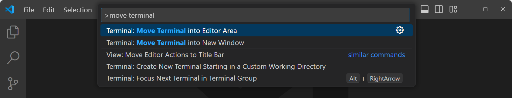

   2. `>` 문자를 제거하고 입력을 시작하여 작업 영역의 파일을 검색합니다. `Ctrl+P` 키보드 단축키를 사용하여 명령 팔레트를 열고 파일을 직접 검색할 수 있습니다.

      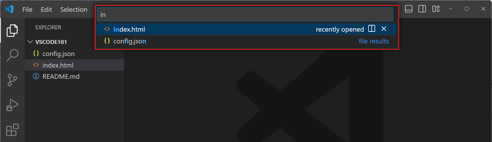

:::tip
VS Code는 파일이나 명령을 찾기 위해 퍼지 매칭을 사용합니다. 예를 들어, `odks`를 입력하면 `Open Default Keyboard Shortcuts` 명령이 반환됩니다.
:::

## VS Code 설정 구성하기 {#configure-vs-code-settings}

설정을 구성하여 VS Code의 거의 모든 부분을 사용자 지정할 수 있습니다. **Settings Editor**를 사용하여 VS Code의 설정을 수정하거나 `settings.json` 파일을 직접 수정할 수 있습니다.

1. `Ctrl+,`를 눌러 Settings Editor를 엽니다(**File** > **Preferences** > **Settings** 메뉴 항목 선택).

   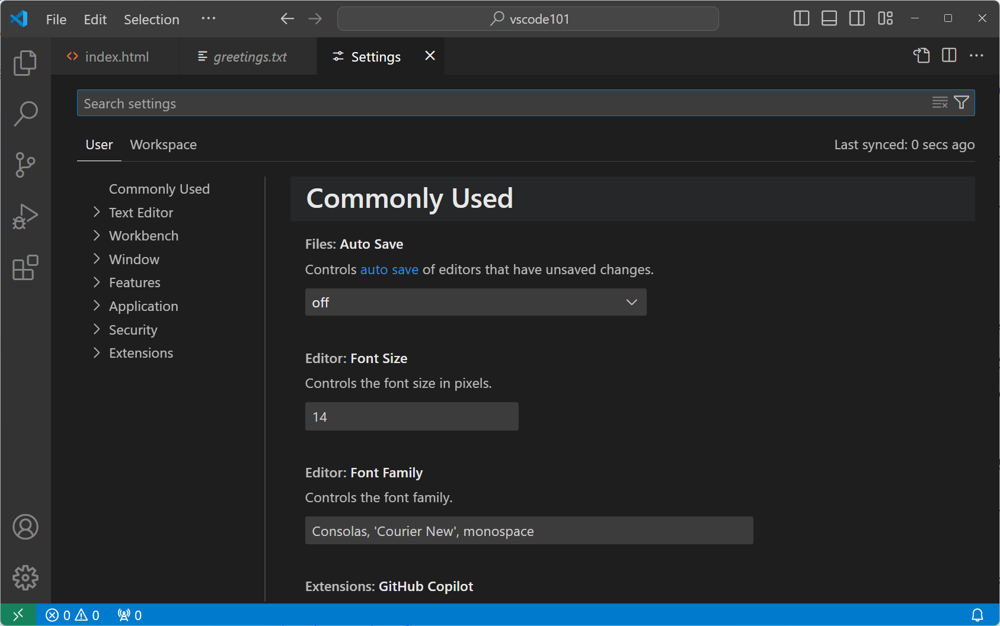

   :::tip
   검색 상자를 사용하여 표시되는 설정 목록을 필터링하세요.
   :::

2. 기본적으로 VS Code는 수정된 파일을 자동으로 저장하지 않습니다. 자동 저장 드롭다운에서 값을 선택하여 이 동작을 변경하세요.

   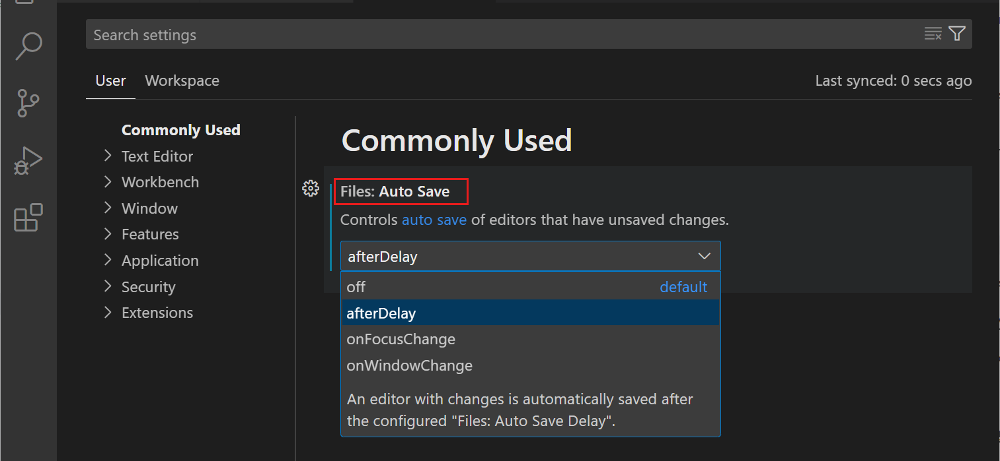

   VS Code는 설정 변경 사항을 자동으로 적용합니다. 이제 작업 영역에서 파일을 수정하면 자동으로 저장됩니다.

3. 설정을 기본값으로 되돌리려면 설정 옆의 기어 아이콘을 선택하고 **설정 재설정**을 선택하세요.

   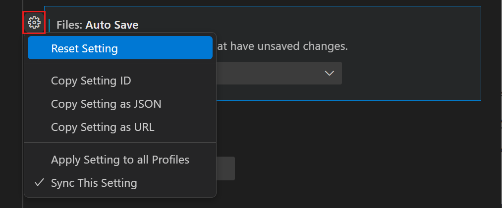

   :::tip
   검색 상자에 `@modified`를 입력하거나 **수정됨** 필터를 선택하여 수정된 모든 설정을 빠르게 찾을 수 있습니다.
   :::

4. Settings Editor의 탭을 사용하여 **User** 설정과 **Workspace** 설정 간에 전환할 수 있습니다.

   User 설정은 모든 작업 영역에 적용됩니다. Workspace 설정은 현재 Workspace에만 적용됩니다. Workspace 설정은 사용자 설정을 재정의합니다. [VS Code의 설정](/docs/getstarted/settings.md)에 대해 자세히 알아보세요.

## 코드 작성하기 {#write-some-code}

VS Code는 JavaScript, TypeScript, HTML, CSS 등을 기본적으로 지원합니다. 이 튜토리얼에서는 샘플 JavaScript 파일을 만들고 VS Code가 제공하는 코드 편집 기능 중 일부를 사용해보겠습니다.

VS Code는 많은 프로그래밍 언어를 지원하며, 다음 단계에서는 [언어 확장을 설치](#install-a-language-extension)하여 Python과 같은 다른 언어에 대한 지원을 추가할 것입니다.

1. 탐색기 화면에서 새 파일 `app.js`를 만들고 다음 JavaScript 코드를 입력하기 시작합니다:

   ```javascript
   function sayHello(name) {
     console.log("Hello, " + name);
   }

   sayHello("VS Code");
   ```

   입력하면서 코드 완성을 돕는 제안이 팝업으로 표시되는 것을 볼 수 있습니다(_IntelliSense_). `Up` 및 `Down` 키를 사용하여 제안을 탐색하고 `Tab`을 사용하여 선택한 제안을 삽입할 수 있습니다.

   또한 코드의 다른 부분을 구분하는 데 도움이 되는 코드 형식(_구문 강조 표시_)도 확인하세요.

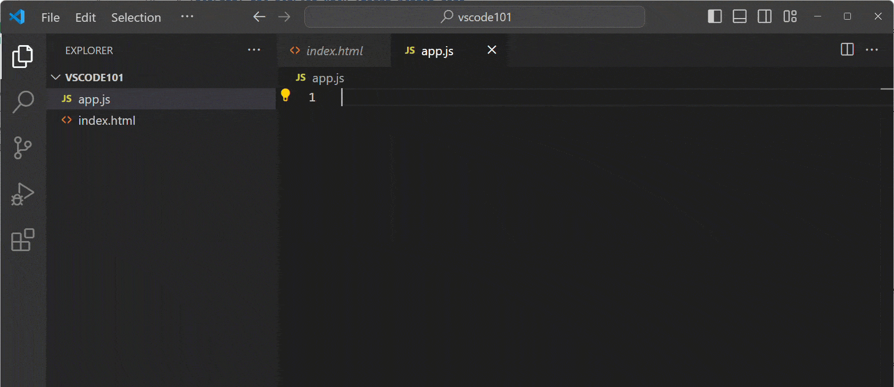

2. 커서를 문자열 `Hello,` 위에 놓으면 코드 액션이 있음을 나타내는 전구 아이콘이 나타납니다.

   

   `Ctrl+Space` 키보드 단축키를 사용하여 전구 메뉴를 열 수도 있습니다.

3. 전구 아이콘을 선택한 다음 **Convert to template string**을 선택합니다.

   코드 액션은 코드에 빠른 수정 사항을 적용하는 제안입니다. 이 경우 코드 액션은 `"Hello, " + name`을 [템플릿 문자열](https://developer.mozilla.org/en-US/docs/Web/JavaScript/Reference/Template_literals) `` `Hello, ${name}` ``로 변환합니다. 이는 문자열에 표현식을 포함할 수 있는 특별한 JavaScript 구문입니다.

VS Code의 [편집 기능](/docs/editor/codebasics.md), [IntelliSense](/docs/editor/intellisense.md), [코드 탐색](/docs/editor/editingevolved.md) 및 [리팩토링](/docs/editor/refactoring.md)에 대해 자세히 알아보세요.

## 소스 제어 사용하기 {#use-source-control}

Visual Studio Code에는 통합 소스 제어 관리(SCM)가 있으며 [Git](https://git-scm.com/) 지원이 기본으로 포함되어 있습니다.

내장된 Git 지원을 사용하여 이전에 수행한 변경 사항을 커밋해 보겠습니다.

1.  Activity Bar에서 **Source Control**를 선택하여 소스 제어 화면을 엽니다.

    

2.  컴퓨터에 [Git](https://git-scm.com/)이 설치되어 있는지 확인하세요. Git이 설치되어 있지 않으면 소스 제어 화면에 컴퓨터에 설치하는 버튼이 표시됩니다.

3.  **Initialize Repository**를 선택하여 작업 영역에 대한 새 Git 리포지토리를 만듭니다.

    

    리포지토리를 초기화한 후 소스 제어 화면에 작업 영역에서 수행한 변경 사항이 표시됩니다.

4.  파일 위에 마우스를 올리고 `+`를 선택하여 개별 변경 사항을 스테이징할 수 있습니다.

    

    :::tip
    모든 변경 사항을 스테이징하려면 **Changes** 위에 마우스를 올리고 **Stage All Changes** 버튼을 선택하세요.
    :::

5.  커밋 메시지를 입력하고(예: `hello 함수 추가`) **Commit**을 선택하여 변경 사항을 Git 리포지토리에 커밋합니다.

    

    :::tip
    **Source Control Graph**를 사용하여 Git 리포지토리의 커밋 기록을 시각적으로 표현할 수 있습니다.
    :::

VS Code의 소스 제어에 대해 더 많이 알아볼 수 있습니다. [VS Code의 소스 제어](/docs/sourcecontrol/overview.md)에 대해 자세히 알아보세요.

## 언어 확장 설치하기 {#install-a-language-extension}

VS Code에는 특정 개발 워크플로를 지원하기 위해 언어, 디버거 및 도구를 설치에 추가할 수 있는 풍부한 확장 생태계가 있습니다. [Visual Studio Marketplace](https://marketplace.visualstudio.com/vscode)에는 수천 개의 확장이 있습니다.

Python 또는 관심 있는 다른 프로그래밍 언어에 대한 지원을 추가하기 위해 언어 확장을 설치해 보겠습니다.

1. Activity Bar에서 **Extensions** 보기를 선택합니다.

   확장 보기를 사용하면 VS Code 내에서 확장을 찾아보고 설치할 수 있습니다.

   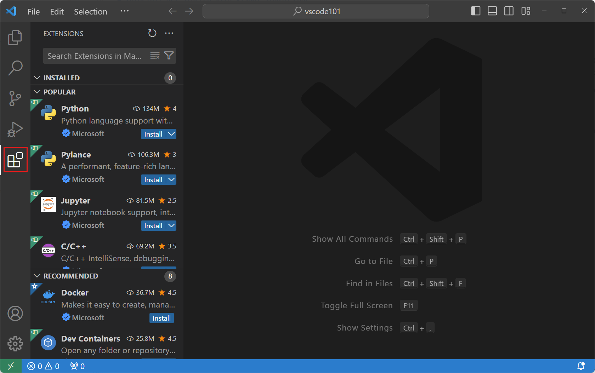

2. 확장 보기 검색 상자에 *Python*을 입력하여 Python 관련 확장을 찾아봅니다. Microsoft에서 게시한 **Python** 확장을 선택한 다음 **Install** 버튼을 선택합니다.

   

3. 이제 작업 영역에 새 Python 파일 `hello.py`를 만들고 다음 Python 코드를 입력하기 시작합니다:

   ```python
   def say_hello(name):
       print("Hello, " + name)

   say_hello("VS Code")
   ```

   이제 Python 코드에 대한 제안과 IntelliSense도 받을 수 있습니다.

   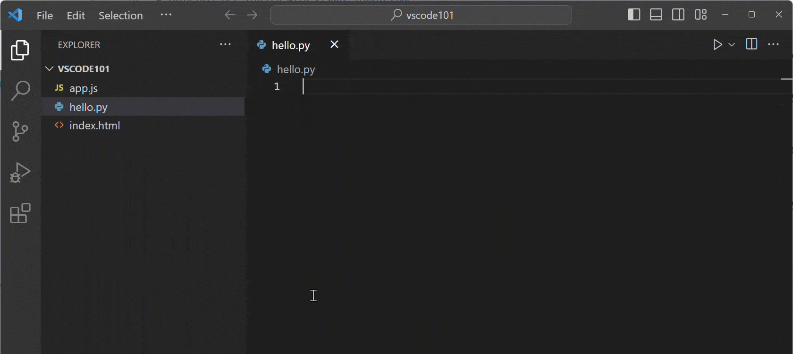

## 코드 실행 및 디버그하기 {#run-and-debug-your-code}

VS Code에는 Node.js 애플리케이션 실행 및 디버깅을 위한 내장 지원이 있습니다. 이 튜토리얼에서는 이전 단계에서 설치한 Python 확장을 사용하여 Python 프로그램을 디버그합니다.

이전 단계에서 만든 `hello.py` 프로그램을 디버그해 보겠습니다.

1. 컴퓨터에 [Python 3](https://www.python.org/downloads/)이 설치되어 있는지 확인하세요.

   컴퓨터에 Python 인터프리터가 설치되어 있지 않으면 창의 오른쪽 하단에 알림이 표시됩니다. **Select Interpreter**을 선택하여 **Command Palette**를 열고 사용할 Python 인터프리터를 선택하거나 설치하세요.

2. `hello.py` 파일에서 `print` 줄에 커서를 놓고 `F9`를 눌러 중단점을 설정합니다.

   에디터의 왼쪽 여백에 빨간 점이 나타나며, 이는 중단점이 설정되었음을 나타냅니다. 중단점을 사용하면 특정 코드 줄에서 프로그램 실행을 일시 중지할 수 있습니다.

   

3. `F5`를 눌러 디버깅 세션을 시작합니다.

   1. Python 디버거를 선택합니다:

   

   2. 현재 Python 파일을 실행하도록 선택합니다:

   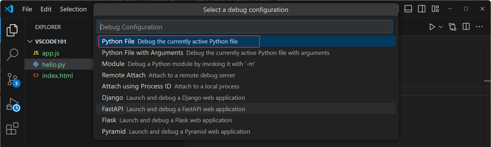

4. 프로그램이 시작되고 설정한 중단점에서 실행이 중지되는 것을 확인하세요.

   

   :::tip
   실행이 일시 중지된 동안 에디터에서 `name` 변수 위에 마우스를 올려 변수 값을 검사할 수 있습니다. **Run and Debug** 화면의 **Variables** 보기에서 언제든지 변수 값을 볼 수 있습니다.
   :::

5. 디버그 도구 모음에서 **Continue** 버튼을 누르거나 `F5`를 눌러 실행을 계속합니다.

   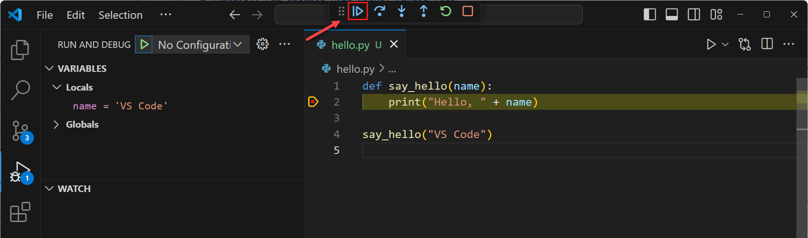

VS Code에는 변수 감시, 조건부 중단점, 실행 구성과 같은 더 많은 디버깅 기능이 있습니다. [VS Code의 디버깅](/docs/editor/debugging.md)에 대해 자세히 알아보세요.

## AI와 GitHub Copilot으로 코딩 강화하기 {#enhance-your-coding-with-ai-and-github-copilot}

[GitHub Copilot](/docs/copilot/overview.md)을 사용하면 VS Code에서의 코딩 경험을 더욱 향상시키고 몰랐던 VS Code 기능과 설정도 발견할 수 있습니다.

VS Code의 GitHub Copilot은 다음과 같은 다양한 작업을 지원할 수 있습니다:

- **코드 완성**: 코드 줄이나 전체 함수에 대한 제안을 받습니다.
- **코드 설명**: 코드 스니펫에 대한 설명을 받아 작동 방식을 이해합니다.
- **코드 리팩토링 및 생성**: 코드를 리팩토링하고 테스트나 문서와 같은 코드 관련 아티팩트를 생성합니다.
- **오류 수정**: 버그 찾기 및 수정, 셸 명령 오류와 같은 일반적인 코딩 작업에 대한 도움을 받습니다.
- **VS Code 학습**: VS Code 기능, 설정 또는 명령에 대해 문의합니다.

<video title="Video showing Copilot Chat used for asking about VS Code, explaining what a project does, and generating unit tests." autoplay loop controls muted style={{maxWidth: '100%'}}>

<source src="https://code.visualstudio.com/assets/docs/getstarted/getting-started/copilot-chat-intro.mp4" type="video/mp4" />
</video>

> <a class="install-extension-btn" href="vscode:extension/GitHub.copilot">GitHub Copilot 확장 설치</a>

## 다음 단계 {#next-steps}

축하합니다! 튜토리얼을 완료하고 Visual Studio Code의 주요 기능을 살펴보았습니다. 이제 Visual Studio Code의 기본 사항을 배웠으니 다음과 같은 방법에 대해 자세히 알아보세요:

- [코드의 단위 테스트 찾기 및 실행](/docs/editor/testing.md)

- [통합 터미널 사용](/docs/terminal/getting-started.md)

- [원격 개발 환경 설정](/docs/remote/remote-overview.md)
