# 유저 인터페이스 {#user-interface}

Visual Studio Code는 기본적으로 코드 편집기입니다. 다른 많은 코드 편집기와 마찬가지로, VS Code는 탐색기를 왼쪽에 배치하고, 열려 있는 파일의 내용을 표시하는 편집기를 오른쪽에 배치하는 일반적인 유저 인터페이스와 레이아웃을 채택합니다.

<iframe width="560" height="315" src="https://www.youtube-nocookie.com/embed/nORT3-kONgA" title="VS Code 유저 인터페이스 변환" frameborder="0" allow="accelerometer; autoplay; clipboard-write; encrypted-media; gyroscope; picture-in-picture" allowfullscreen></iframe>

## 기본 레이아웃 {#basic-layout}

VS Code는 편집기를 위한 공간을 최대화하면서 폴더나 프로젝트의 전체 컨텍스트를 탐색하고 액세스할 수 있는 충분한 공간을 남기는 간단하고 직관적인 레이아웃을 제공합니다. 유저 인터페이스는 다섯 가지 주요 영역으로 나뉩니다:

- **편집기 (Editor)** - 파일을 편집하는 주요 영역입니다. 세로 및 가로로 나란히 원하는 만큼 많은 편집기를 열 수 있습니다.
- **기본 사이드 바 (Primary Side Bar)** - 탐색기와 같은 다양한 화면를 포함하여 프로젝트 작업을 도와줍니다.
- **상태 표시줄 (Status Bar)** - 열린 프로젝트와 편집 중인 파일에 대한 정보를 제공합니다.
- **활동 표시줄 (Activity Bar)** - 왼쪽 가장자리에 위치하며, 화면 간 전환을 가능하게 하고 Git이 활성화된 경우 나가는 변경 사항 수와 같은 추가 컨텍스트별 지표를 제공합니다. 활동 표시줄의 위치를 변경할 수 있습니다.
- **패널 (Panel)** - 편집기 영역 아래에 있는 추가 화면 공간입니다. 기본적으로 출력, 디버그 정보, 오류 및 경고, 통합 터미널을 포함합니다. 패널은 더 많은 세로 공간을 위해 왼쪽 또는 오른쪽으로 이동할 수 있습니다.


:::tip
기본 사이드 바 반대편에 화면를 표시할 수 있는 보조 사이드 바도 사용할 수 있습니다. `Ctrl+Alt+B`를 사용하여 표시하고 기본 사이드 바에서 보조 사이드 바로 화면를 드래그할 수 있습니다.
:::

VS Code를 시작할 때마다 마지막으로 닫았을 때의 상태로 열립니다. 폴더, 레이아웃 및 열린 파일이 보존됩니다.

각 편집기에서 열린 파일은 편집기 영역 상단에 탭 헤더(Tabs)로 표시됩니다. 탭 헤더에 대해 자세히 알아보려면 [탭](/docs/getstarted/userinterface.md#tabs) 섹션을 참조하세요.

:::tip
활동 표시줄을 마우스 오른쪽 버튼으로 클릭하고 **Move Primary Side Bar Right**을 선택하거나 단축키(`Ctrl+B`)를 사용하여 기본 사이드 바를 오른쪽으로 이동할 수 있습니다.
:::

## 나란히 편집 {#side-by-side-editing}

세로 및 가로로 원하는 만큼 많은 편집기를 열 수 있습니다. 이미 편집기가 열려 있는 경우, 옆에 다른 편집기를 여는 여러 가지 방법이 있습니다:

- `Alt`를 누르고 탐색기 화면에서 파일을 선택합니다.
- `Ctrl+\ `를 사용하여 활성 편집기를 두 개로 나눕니다.
- 탐색기 컨텍스트 메뉴에서 **Open to the Side**(`Ctrl+Enter`)를 선택합니다.
- 편집기 오른쪽 상단의 **Split Editor** 버튼을 선택합니다.
- 파일을 편집기 영역의 어느 쪽으로든 드래그 앤 드롭합니다.
- **Quick Open**(`Ctrl+P`) 파일 목록에서 `Ctrl+Enter`를 누릅니다.


다른 파일을 열 때, 활성 편집기가 해당 파일의 내용을 표시합니다. 두 개의 편집기가 나란히 열려 있고 오른쪽 편집기에 'foo.cs' 파일을 열고 싶다면, 파일을 열기 전에 해당 편집기를 활성화해야 합니다(클릭하여 활성화).

기본적으로 편집기는 활성 편집기의 오른쪽에 열립니다. `workbench.editor.openSideBySideDirection` 설정을 사용하여 새 편집기를 활성 편집기의 아래쪽에 열도록 변경할 수 있습니다.

여러 편집기가 열려 있는 경우, `Ctrl` 키(`macOS에서는 Cmd`)를 누르고 `1`, `2`, 또는 `3`을 눌러 빠르게 전환할 수 있습니다.

:::tip
편집기를 크기 조정하고 재정렬할 수 있습니다. 편집기 제목 영역을 드래그 앤 드롭하여 위치를 변경하거나 크기를 조정하세요.
:::

### 편집기 그룹 {#editor-groups}

편집기를 분할할 때(**Split Editor** 또는 **Open to the Side** 명령 사용), 항목 그룹을 포함할 수 있는 새 편집기 영역(편집 그룹)이 생성됩니다. 세로 및 가로로 원하는 만큼 많은 편집기 그룹을 열 수 있습니다.

탐색기 화면 상단의 **Open Editors** 섹션에서 이를 명확하게 볼 수 있습니다(**...** > **Open Editors** 토글).

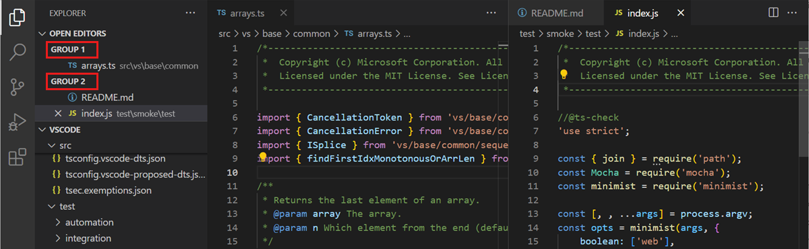

작업 영역에서 편집기 그룹을 드래그 앤 드롭하고, 그룹 간에 개별 탭을 이동하며, 전체 그룹을 빠르게 닫을 수 있습니다(**Close All**).

:::note
VS Code는 탭을 활성화했는지 여부에 관계없이 편집기 그룹을 사용합니다. 탭이 없는 경우, 편집기 그룹은 가장 최근에 선택된 항목이 편집기 창에 표시되는 열린 항목의 스택입니다.
:::

### 그룹 내 분할 {#split-in-group}

**Split Editor in Group** 명령(`Ctrl+K Ctrl+Shift+\`)을 사용하여 새 편집기 그룹을 생성하지 않고 현재 편집기를 분할할 수 있습니다. 이 편집기 모드와 두 측면 간의 탐색을 위한 특정 명령에 대해 자세히 알아보려면 [사용자 정의 레이아웃](/docs/editor/custom-layout.md#split-in-group) 문서의 섹션을 참조하세요.

### 플로팅 창 {#floating-windows}

**Move into New Window** 또는 **Copy into New Window**(`Ctrl+K O`) 명령을 사용하여 편집기를 자체 플로팅 창으로 이동할 수 있습니다. 플로팅 편집기 창에 대해 자세히 알아보려면 [사용자 정의 레이아웃](/docs/editor/custom-layout.md#floating-editor-windows) 문서의 섹션을 참조하세요.

## 미니맵 {#minimap}

미니맵(코드 개요)은 소스 코드의 고수준 개요를 제공하여 빠른 탐색과 코드 이해에 유용합니다. 파일의 미니맵은 편집기 오른쪽에 표시됩니다. 음영 영역을 선택하거나 드래그하여 파일의 다른 섹션으로 빠르게 이동할 수 있습니다.

편집기에 `//#region` 또는 `MARK:` 주석과 같은 [접기 마커](/docs/editor/codebasics.md#folding)가 있는 경우, 미니맵에 접기 마커 이름이 표시됩니다.

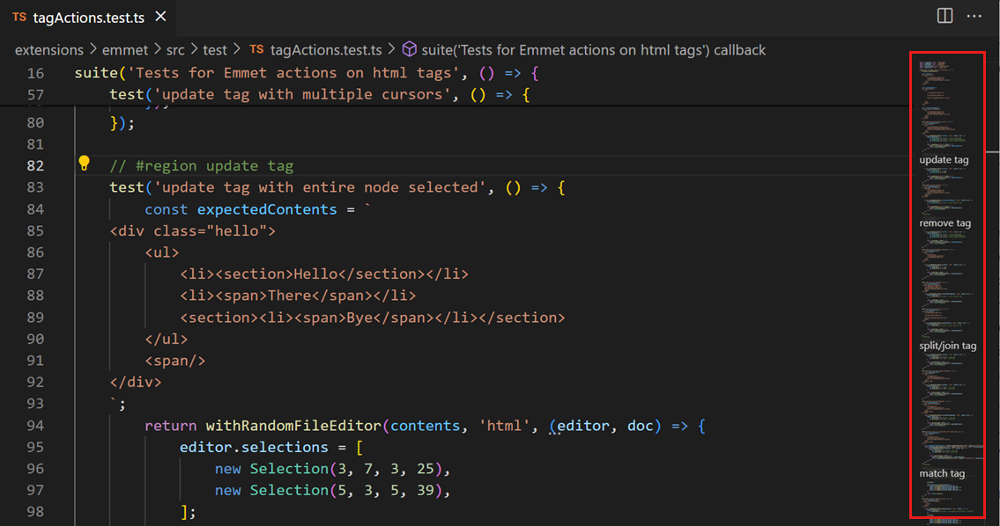

:::tip
사용자 또는 작업 공간 [설정](/docs/getstarted/settings.md)에서 `"editor.minimap.side": "left"`를 설정하여 미니맵을 왼쪽으로 이동하거나 `"editor.minimap.enabled": false`를 설정하여 완전히 비활성화할 수 있습니다.
:::

## 고정 스크롤 {#sticky-scroll}

고정 스크롤은 현재 보이는 중첩 범위의 시작 줄을 편집기 상단에 표시합니다. 파일 내 위치를 나타내어 탐색을 용이하게 하고 현재 범위의 맨 위로 빠르게 이동할 수 있습니다.

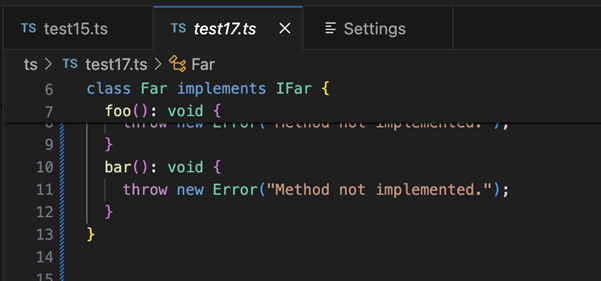

:::tip
`editor.stickyScroll.enabled` 설정을 사용하여 고정 스크롤을 활성화/비활성화할 수 있습니다.
:::

고정 스크롤은 여러 다른 콘텐츠 모델을 사용하여 제목을 생성합니다. 고정 스크롤 영역에 표시할 줄을 결정하기 위해 개요 제공자 모델, 접기 제공자 모델 및 들여쓰기 모델 중에서 선택할 수 있습니다. 현재 언어에 대한 모델이 없는 경우, VS Code는 위에서 주어진 순서대로 다음 모델로 대체합니다. 기본적으로 사용되는 모델은 `editor.stickyScroll.defaultModel` 설정에서 가져옵니다.

### 들여쓰기 가이드 {#indent-guides}

편집기는 일치하는 들여쓰기 수준을 빠르게 볼 수 있도록 들여쓰기 가이드(수직선)를 표시합니다. 들여쓰기 가이드를 비활성화하려면 사용자 또는 작업 공간 [설정](/docs/getstarted/settings.md)에서 `editor.guides.indentation`을 `false`로 설정할 수 있습니다.

## 탐색 표시줄 {#breadcrumbs}

편집기 상단에는 탐색 표시줄(탐색 표시줄)도 있습니다. 탐색 표시줄은 항상 파일 경로를 표시하며, 현재 파일 유형이 기호에 대한 언어 지원을 제공하는 경우, 커서 위치까지의 기호 경로를 표시합니다. 탐색 표시줄을 사용하면 폴더, 파일 및 기호 간에 빠르게 탐색할 수 있습니다.


**View** > **Appearance** > **Toggle Breadcrumbs** 메뉴 항목 또는 **View: Toggle Breadcrumbs** 명령을 사용하여 탐색 표시줄을 비활성화할 수 있습니다. 탐색 표시줄 기능에 대한 자세한 내용, 예를 들어 외형을 사용자 정의하는 방법에 대해서는 [코드 탐색](/docs/editor/editingevolved.md) 문서의 [탐색 표시줄](/docs/editor/editingevolved.md#breadcrumbs) 섹션을 참조하세요.

## 탐색기 화면 {#explorer-view}

탐색기 화면은 프로젝트의 파일 및 폴더를 탐색, 열기 및 관리하는 데 사용됩니다. VS Code는 파일 및 폴더 기반이며, 파일이나 폴더를 열어 즉시 시작할 수 있습니다.

VS Code에서 폴더를 열면 폴더의 내용이 탐색기 화면에 표시됩니다. 여기에서 많은 작업을 수행할 수 있습니다:

- 파일 및 폴더 생성, 삭제 및 이름 변경.
- 파일 및 폴더를 드래그 앤 드롭하여 이동.
- 컨텍스트 메뉴를 사용하여 모든 옵션 탐색.

:::tip
VS Code 외부에서 탐색기 화면로 파일을 드래그 앤 드롭하여 복사할 수 있습니다. 탐색기가 비어 있으면 VS Code가 파일을 엽니다. 또한 VS Code 외부에서 탐색기 화면로 파일을 복사하여 붙여넣을 수 있습니다. `explorer.autoOpenDroppedFile` 설정을 사용하여 파일을 자동으로 열지 여부를 구성할 수 있습니다.
:::

VS Code는 특히 명령줄 도구와 함께 잘 작동합니다. VS Code에서 현재 열려 있는 폴더의 컨텍스트에서 명령줄 도구를 실행하려면 폴더를 마우스 오른쪽 버튼으로 클릭하고 **Open in Integrated Terminal**를 선택하세요.

파일이나 폴더를 마우스 오른쪽 버튼으로 클릭하고 Windows에서는 **Reveal in File Explorer**, macOS에서는 **Reveal in Finder**, Linux에서는 **Open Containing Folder**를 선택하여 네이티브 운영 체제 파일 탐색기에서 파일이나 폴더의 위치로 이동할 수도 있습니다.

:::tip
`Ctrl+P`(**Quick Open**)를 입력하여 파일 이름으로 빠르게 검색하고 열 수 있습니다.
:::

기본적으로 VS Code는 `.git`과 같은 일부 폴더를 탐색기 화면에서 제외합니다. `files.exclude` 설정을 사용하여 탐색기 화면에서 파일 및 폴더를 숨기는 규칙을 구성할 수 있습니다.

:::tip
Unity의 `*.meta` 파일이나 TypeScript 프로젝트의 `*.js`와 같은 파생 리소스 파일을 숨길 수 있습니다. Unity에서 `*.cs.meta` 파일을 제외하려면 선택할 패턴은 `"**/*.cs.meta": true`입니다. TypeScript의 경우, TypeScript 파일에 대해 생성된 JavaScript를 제외하려면 `"**/*.js": {"when": "$(basename).ts"}`를 사용할 수 있습니다.
:::

### 다중 선택 {#multi-selection}

탐색기 화면 및 열린 편집기 섹션에서 여러 파일을 선택하여 여러 항목에 대해 작업(삭제, 드래그 앤 드롭 또는 옆에 열기)을 실행할 수 있습니다. `Ctrl` 키(`macOS에서는 Cmd`)를 누르고 개별 파일을 선택하거나 `Shift`를 눌러 파일 범위를 선택합니다. 두 개의 항목을 선택하면 이제 컨텍스트 메뉴의 **Compare Selected** 명령을 사용하여 두 파일을 빠르게 비교할 수도 있습니다.

:::note
이전 VS Code 릴리스에서는 `Ctrl` 키(`macOS에서는 Cmd`)를 누른 상태에서 클릭하면 파일이 옆에 있는 새 편집기 그룹에서 열렸습니다. 이 동작을 계속 사용하려면 `workbench.list.multiSelectModifier` 설정을 사용하여 다중 선택을 `Alt` 키로 변경할 수 있습니다.
:::

```json
"workbench.list.multiSelectModifier": "alt"
```

### 고급 트리 탐색 {#advanced-tree-navigation}

탐색기 화면에서 파일 및 폴더를 필터링할 수 있습니다. 탐색기 화면에 포커스가 있는 상태에서 `Ctrl+Alt+F`를 눌러 찾기 컨트롤을 열고 일치시킬 파일 또는 폴더 이름의 일부를 입력합니다. 이 탐색 기능은 VS Code의 모든 트리 화면에서 사용할 수 있습니다.

**Filter** 버튼을 누르면 강조 표시 모드와 필터링 모드 간에 전환됩니다. `Down`을 누르면 첫 번째 일치 항목에 포커스가 맞춰지고 이후 일치 항목으로 이동할 수 있습니다. 강조 표시 모드에서는 폴더에 일치하는 파일이 포함되어 있음을 나타내는 배지가 표시됩니다.

**Fuzzy Match** 버튼을 누르면 정확한 일치와 퍼지 매치 간에 전환됩니다. 퍼지 매치에서는 파일 또는 폴더 이름의 일부 문자를 입력하여 일치시킬 수 있습니다.

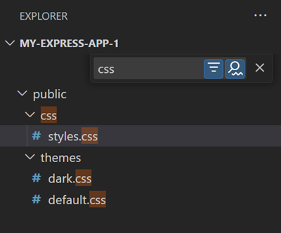

### 개요 화면 {#outline-view}

개요 화면은 탐색기 화면 하단에 있는 별도의 섹션입니다. 확장되면 현재 활성 편집기의 기호 트리를 표시합니다.

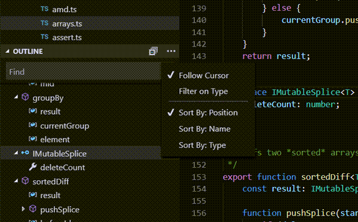

개요 화면에는 다양한 **Sort By** 모드, 선택적 커서 추적 기능이 있으며, 일반적인 열기 제스처를 지원합니다. 또한 찾기 또는 필터링을 위한 입력 상자가 포함되어 있습니다. 오류 및 경고도 개요 화면에 표시되어 문제의 위치를 한눈에 볼 수 있습니다.

기호의 경우, 화면은 설치된 확장 프로그램이 다른 파일 유형에 대해 계산한 정보를 기반으로 합니다. 예를 들어, 내장된 Markdown 지원은 Markdown 파일의 기호에 대해 Markdown 헤더 계층 구조를 반환합니다.


여러 개요 화면 [설정](/docs/getstarted/settings.md)이 있습니다. `outline.`으로 시작하는 설정을 검색하여 개요 화면에 표시할 정보를 구성하세요.

### 타임라인 화면 {#timeline-view}

파일 탐색기 하단에서 액세스할 수 있는 타임라인 화면은 파일의 이벤트 기록을 시각화하는 통합 화면입니다. 예를 들어, Git 커밋 또는 로컬 파일 저장을 타임라인 화면에서 볼 수 있습니다.

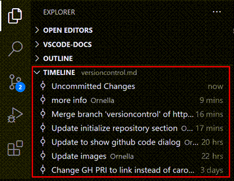

타임라인 화면 도구 모음의 필터 작업을 사용하여 소스 제어 이벤트와 로컬 파일 이벤트 간에 필터링할 수 있습니다:

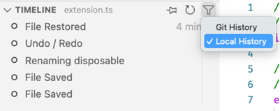

#### 로컬 파일 히스토리 {#local-file-history}

설정에 따라 편집기를 저장할 때마다 목록에 새 항목이 추가됩니다. 각 로컬 히스토리 항목에는 항목이 생성될 당시 파일의 전체 내용이 포함되며, 특정 경우에는 더 많은 의미 정보를 제공할 수 있습니다(예: 리팩토링 표시).

항목에서 다음 작업을 수행할 수 있습니다:

- 로컬 파일 또는 이전 항목과의 변경 사항 비교.
- 내용 복원.
- 항목 삭제 또는 이름 변경.

:::tip
파일을 실수로 삭제한 경우, 타임라인 화면의 **...** > **Local History: Find Entry to Restore** 작업을 사용하여 로컬 히스토리에서 복원할 수 있으며, 그런 다음 빠른 선택에서 파일을 선택합니다.
:::

로컬 히스토리 작업을 위한 다음 설정을 구성할 수 있습니다:

- `workbench.localHistory.enabled` - 로컬 히스토리 활성화 또는 비활성화(기본값: true)
- `workbench.localHistory.maxFileSize` - 로컬 히스토리 항목을 생성할 때 파일 크기 제한(기본값: 256 KB)
- `workbench.localHistory.maxFileEntries` - 파일당 로컬 히스토리 항목 제한(기본값: 50)
- `workbench.localHistory.exclude` - 로컬 히스토리에서 특정 파일을 제외하기 위한 글로브 패턴
- `workbench.localHistory.mergeWindow` - 로컬 파일 히스토리의 마지막 항목에 추가 변경 사항을 추가하는 간격(기본값: 10초)

#### 커밋 히스토리 {#commit-history}

VS Code의 내장 Git 지원은 지정된 파일의 Git 커밋 히스토리를 제공합니다. 커밋을 선택하면 해당 커밋에서 도입된 변경 사항의 차이 보기가 열립니다. 커밋을 마우스 오른쪽 버튼으로 클릭하면 **Copy Commit ID** 및 **Copy Commit Message** 옵션이 표시됩니다.

히스토리에서 커밋을 마우스 오른쪽 버튼으로 클릭하면 다음 작업을 수행할 수 있습니다:

- **Open Changes** - 파일의 변경 사항 차이 보기를 엽니다.
- **View Commit** - 커밋의 모든 파일 변경 사항을 보기 위한 다중 파일 차이 보기를 엽니다.
- **Select for Compare** - 다른 항목과 비교할 항목을 선택합니다.
- **Copy Commit ID** - 커밋 ID를 클립보드에 복사합니다.
- **Copy Commit Message** - 커밋 메시지를 클립보드에 복사합니다.

Git 히스토리 작업을 위한 다음 설정을 구성할 수 있습니다:

- `git.timeline.date` - 파일 커밋의 커밋 날짜 또는 작성 날짜 표시

## 화면 {#views}

탐색기 화면은 VS Code에서 사용할 수 있는 화면 중 하나일 뿐입니다. 다음과 같은 화면도 있습니다:

- **Search** - 열린 폴더 전체에서 전역 검색 및 바꾸기를 제공합니다.
- **Source Control** - VS Code는 기본적으로 Git 소스 제어를 포함합니다.
- **Run** - VS Code의 실행 및 디버그 화면은 변수, 호출 스택 및 중단점을 표시합니다.
- **Extensions** - VS Code 내에서 확장을 설치하고 관리합니다.
- **Custom views** - 확장에서 제공하는 화면.

:::tip
**View: Open View** 명령을 사용하여 모든 화면를 열 수 있습니다.
:::

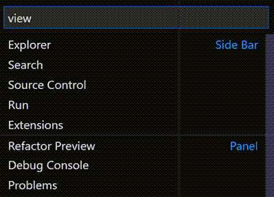

활동 표시줄을 마우스 오른쪽 버튼으로 클릭하여 화면를 표시하거나 숨길 수 있으며, 드래그 앤 드롭을 사용하여 순서를 변경할 수 있습니다. 탐색기 화면 내에서 '...' 메뉴를 통해 섹션을 표시하거나 숨기고, 섹션을 드래그 앤 드롭하여 순서를 변경할 수 있습니다.


## 명령 팔레트 {#command-palette}

VS Code는 키보드에서도 동일하게 접근할 수 있습니다. 알아야 할 가장 중요한 키 조합은 `Ctrl+Shift+P`로, **Command Palette**를 불러옵니다. 여기에서 VS Code 내의 모든 기능에 액세스할 수 있으며, 가장 일반적인 작업에 대한 키보드 단축키도 포함됩니다.

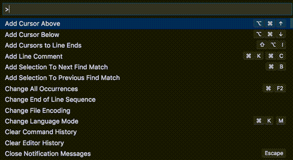

**Command Palette**는 많은 명령에 액세스할 수 있습니다. 편집기 명령을 실행하고, 파일을 열고, 기호를 검색하고, 파일의 빠른 개요를 볼 수 있으며, 모두 동일한 대화형 창을 사용합니다. 몇 가지 팁은 다음과 같습니다:

- `Ctrl+P`을 사용하여 파일 또는 기호의 이름을 입력하여 탐색할 수 있습니다.
- `Ctrl+Tab`을 사용하여 마지막으로 열린 파일 세트를 순환할 수 있습니다.
- `Ctrl+Shift+P`를 사용하여 편집기 명령으로 바로 이동할 수 있습니다.
- `Ctrl+Shift+O`을 사용하여 파일 내 특정 기호로 이동할 수 있습니다.
- `Ctrl+G`을 사용하여 파일 내 특정 줄로 이동할 수 있습니다.

입력 필드에 `?`를 입력하여 명령 팔레트에서 실행할 수 있는 명령 목록을 확인하세요.


## 편집기 구성 {#configure-the-editor}

VS Code는 편집기를 구성할 수 있는 많은 옵션을 제공합니다. **View** > **Appearance** 메뉴에서 **Side Bar**, **Status Bar** 및 **Activity Bar**과 같은 유저 인터페이스의 다양한 부분을 숨기거나 전환할 수 있습니다.

### 메뉴 표시줄 숨기기(Windows, Linux) {#hide-the-menu-bar}

Windows 및 Linux에서 `window.menuBarVisibility` 설정을 `classic`에서 `toggle` 또는 `hidden`으로 변경하여 메뉴 표시줄을 숨길 수 있습니다. `toggle` 설정은 `Alt` 키를 한 번 누르면 메뉴 표시줄이 다시 표시됩니다.

또한 **View: Toggle Menu Bar** 명령을 사용하여 Windows 및 Linux에서 메뉴 표시줄을 숨길 수 있습니다. 이 명령은 `window.menuBarVisibility`를 `classic`에서 `compact`로 설정하여 메뉴 표시줄이 활동 표시줄로 이동합니다. 메뉴 표시줄을 `classic` 위치로 되돌리려면 **View: Toggle Menu Bar** 명령을 다시 실행할 수 있습니다.

### 설정 {#settings}

대부분의 편집기 구성은 설정에서 관리되며, 직접 수정할 수 있습니다. 사용자 설정을 통해 전역적으로 또는 작업 공간 설정을 통해 프로젝트/폴더별로 옵션을 설정할 수 있습니다. 설정 값은 [`settings.json` 파일](/docs/getstarted/settings.md#settingsjson)에 저장됩니다.

**File** > **Preferences** > **Settings**을 선택하거나 `Ctrl+,`를 눌러 설정 편집기에서 설정을 보고 수정할 수 있습니다. 상단의 검색 상자를 사용하여 설정을 필터링할 수 있습니다.

또는 사용자 설정을 `settings.json` 파일에서 직접 수정할 수 있습니다. **Preferences: Open User Settings (JSON)** 명령을 사용하여 `settings.json` 파일을 엽니다. 작업 공간 설정의 경우, 작업 공간의 `.vscode` 폴더에 있는 `settings.json` 파일을 엽니다.

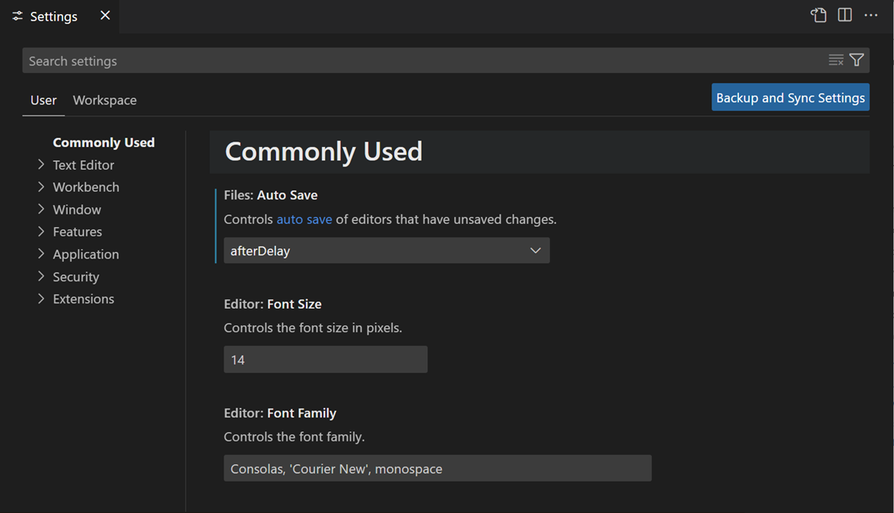

:::note
작업 공간 설정은 사용자 설정을 재정의하며, 팀 간에 프로젝트별 설정을 공유하는 데 유용합니다.
:::

### Zen 모드 {#zen-mode}

Zen 모드는 모든 UI 요소를 숨기고, VS Code를 전체 화면으로 전환하며, 편집기를 중앙에 배치하여 코드에 집중할 수 있도록 합니다. Zen 모드는 **View** > **Appearanc** > **Zen Mode** 메뉴, **Command Palette**의 **View: Toggle Zen Mode** 또는 단축키 `Ctrl+K Z`로 전환할 수 있습니다. `Esc`를 두 번 눌러 Zen 모드를 종료합니다. 전체 화면으로의 전환은 `zenMode.fullScreen`을 통해 비활성화할 수 있습니다.

Zen 모드는 다음 설정을 통해 추가로 조정할 수 있습니다:

- `zenMode.hideActivityBar` - 활동 표시줄 숨기기. 기본값 `true`.
- `zenMode.hideStatusBar` - 상태 표시줄 숨기기. 기본값 `true`.
- `zenMode.hideLineNumbers` - 줄 번호 숨기기. 기본값 `true`.
- `zenMode.showTabs` - 여러 개, 하나 또는 탭을 표시하지 않도록 제어합니다. 기본값 `multiple`.
- `zenMode.fullScreen` - 작업 영역을 전체 화면으로 표시합니다. 기본값 `true`.
- `zenMode.restore` - 재시작 시 Zen 모드 복원. 기본값 `true`.
- `zenMode.centerLayout` - [중앙 정렬된 편집기 레이아웃](#centered-editor-layout) 사용. 기본값 `true`.
- `zenMode.silentNotifications` - 알림 표시 안 함. 기본값 `true`.

### 방해 금지 모드로 알림 줄이기 {#reduce-notifications-with-do-not-disturb-mode}

알림이 너무 많이 표시되는 경우, 모든 알림 또는 특정 확장의 알림을 줄이는 방법이 있습니다.

상태 표시줄에서 종 아이콘을 선택하여 알림 영역을 엽니다. 이곳은 방해 금지 모드를 활성화한 경우에도 언제든지 모든 알림에 액세스할 수 있는 장소입니다.

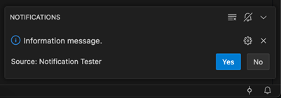

종 아이콘이 교차된 아이콘을 찾아 메뉴에 액세스하여 확장의 알림을 선택적으로 비활성화하거나 모든 알림을 비활성화하는 전역 방해 금지 모드를 활성화할 수 있습니다.

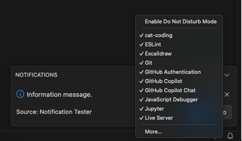

:::note
전역 방해 금지 모드는 오류 알림도 숨기지만, 확장별 필터는 오류 알림을 계속 표시합니다.
:::

### 중앙 정렬된 편집기 레이아웃 {#centered-editor-layout}

중앙 정렬된 편집기 레이아웃을 사용하면 편집기 영역을 중앙에 정렬할 수 있습니다. 이는 큰 모니터에서 단일 편집기로 작업할 때 유용합니다. `Alt` 키를 누른 상태에서 측면을 독립적으로 이동하는 방식으로, 측면 경계를 사용하여 화면 크기를 조정할 수 있습니다.

## 탭 {#tabs}

VS Code는 편집기 위의 제목 영역에 탭(탭 헤더)으로 열린 항목을 표시합니다. 파일을 열면 해당 파일에 대한 새 탭이 추가됩니다. 탭을 사용하면 항목 간에 빠르게 탐색할 수 있습니다.

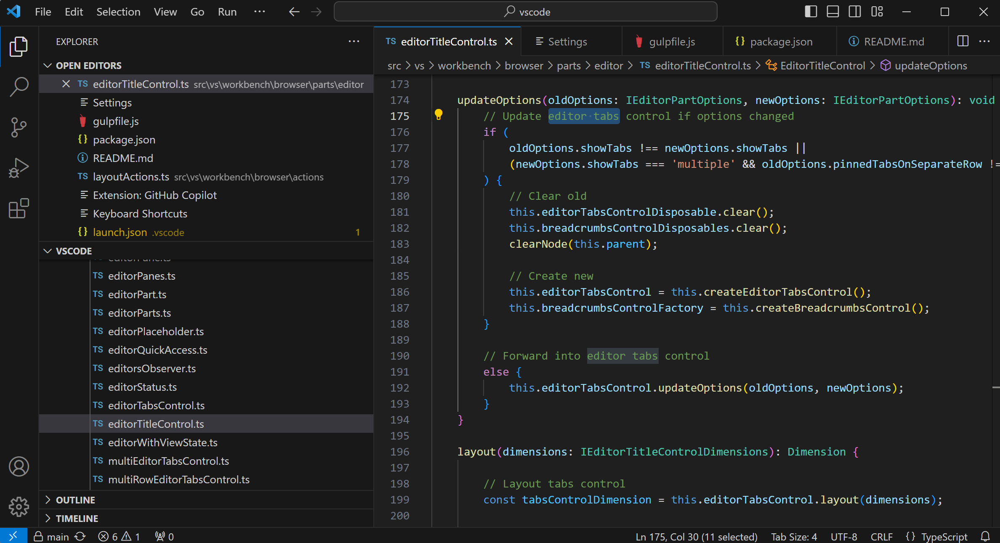

탭을 드래그 앤 드롭하여 순서를 변경할 수 있습니다. 여러 탭에 대해 한 번에 작업을 수행하려면 `Ctrl` 키(`macOS에서는 Cmd`)를 누른 상태에서 작업할 탭을 선택합니다. 탭 범위를 선택하려면 `Shift` 키를 누른 상태에서 범위의 첫 번째 및 마지막 탭을 선택합니다.

제목 영역에 맞지 않는 열린 항목이 많을 때, 탐색기 화면의 **Open Editors** 섹션(버튼을 통해 사용 가능)을 사용하여 탭 항목의 드롭다운 목록을 표시할 수 있습니다.

탭과 편집기 영역 사이에 스크롤 막대도 있어 편집기를 드래그하여 볼 수 있습니다. 스크롤 막대의 높이를 늘려 드래그하기 쉽게 하려면 **Workbench > Editor: Title Scrollbar Sizing**(`workbench.editor.titleScrollbarSizing`)를 `large`로 설정할 수 있습니다.

탭을 사용하지 않으려면 `workbench.editor.showTabs` 설정을 `single`로 설정하여 기능을 비활성화할 수 있습니다:

```json
    "workbench.editor.showTabs": "single"
```

탭 없이 작업하는 방법을 최적화하려면 아래 섹션을 참조하세요 [탭 없이 작업하기](/docs/getstarted/userinterface.md#working-without-tabs).

:::tip
편집기 제목 영역을 두 번 클릭하여 새 탭을 빠르게 생성하세요.
:::

### 탭 순서 {#tab-ordering}

기본적으로 새 탭은 기존 탭의 오른쪽에 추가됩니다. `workbench.editor.openPositioning` 설정을 사용하여 새 탭이 나타날 위치를 제어할 수 있습니다.

예를 들어, 새 탭 항목이 왼쪽에 나타나도록 설정할 수 있습니다:

```json
    "workbench.editor.openPositioning": "left"
```

탭을 드래그 앤 드롭하여 순서를 변경할 수 있습니다.

편집기 탭을 항상 표시하려면 편집기 탭 표시줄에 고정할 수 있습니다. 탭 고정에 대해 자세히 알아보려면 [사용자 정의 레이아웃](/docs/editor/custom-layout.md#pinned-tabs) 문서를 참조하세요.

### 미리보기 모드 {#preview-mode}

탐색기 화면에서 파일을 단일 클릭하거나 선택하면 미리보기 모드로 표시되며 기존 탭을 재사용합니다(미리보기 탭). 이는 파일을 빠르게 탐색하고 방문한 모든 파일에 대해 자체 탭을 가지지 않으려는 경우에 유용합니다. 파일을 편집하거나 탐색기에서 파일을 열기 위해 두 번 클릭하면 해당 파일에 전용 탭이 생성됩니다.

미리보기 모드는 탭 헤더의 이탤릭체로 표시됩니다:


미리보기 모드를 사용하지 않고 항상 새 탭을 생성하려면 다음 설정을 사용하여 동작을 제어할 수 있습니다:

- `workbench.editor.enablePreview` - 미리보기 편집기를 전역적으로 활성화 또는 비활성화
- `workbench.editor.enablePreviewFromQuickOpen` - **Quick Open**에서 열 때 미리보기 편집기를 활성화 또는 비활성화

### 래핑된 탭 {#wrapped-tabs}

더 많은 편집기 탭을 보려면 **wrapped tab** 레이아웃을 사용할 수 있습니다. 편집기 탭이 편집기 영역 위의 여러 행을 채우도록 래핑됩니다. **Workbench > Editor: Wrap Tabs**(`workbench.editor.wrapTabs`) 설정을 사용하여 래핑된 탭을 활성화하세요.

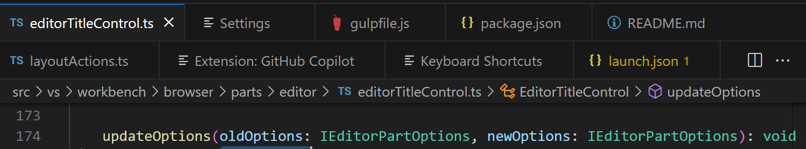

### 탭 레이블 사용자 정의 {#customize-tab-labels}

동일한 이름의 여러 파일을 동시에 열면 다른 탭을 구분하기 어려울 수 있습니다. 이를 돕기 위해 탭에 사용자 정의 표시 레이블을 적용할 수 있습니다. 작업 공간의 파일에 대해 탭 표시 레이블을 적용할 파일을 선택할 수 있습니다.

탭에 사용자 정의 표시 레이블을 활성화하려면 `workbench.editor.customLabels.enabled` 설정을 사용하세요:

```json
    "workbench.editor.customLabels.enabled": true
```

`workbench.editor.customLabels.patterns` 설정을 사용하여 탭 표시 레이블에 대한 하나 이상의 이름 패턴을 지정할 수 있습니다. 이름 패턴은 두 가지 구성 요소로 구성됩니다:

- **Item** - 파일 경로에 대해 사용자 정의 레이블을 적용할 파일 경로를 일치시키는 [글로브 패턴](/docs/editor/glob-patterns.md). 예: `**/static/**/*.html`.
- **Value** - 사용자 정의 레이블에 대한 템플릿. 템플릿은 `$\{filename\}
`, `$\{extname\}
`, `$\{extname(N)\}
`, `$\{dirname\}
`, `$\{dirname(N)\}
`과 같은 변수를 사용할 수 있으며, 파일 경로의 값으로 동적으로 대체됩니다.

다음 샘플은 `/src/orders/index.html` 파일을 `orders/index` 탭 레이블로 표시합니다.

```json
    "workbench.editor.customLabels.patterns": {
        "**/src/**/index.html": "$\{dirname\}
/$\{filename\}
"
    }
```

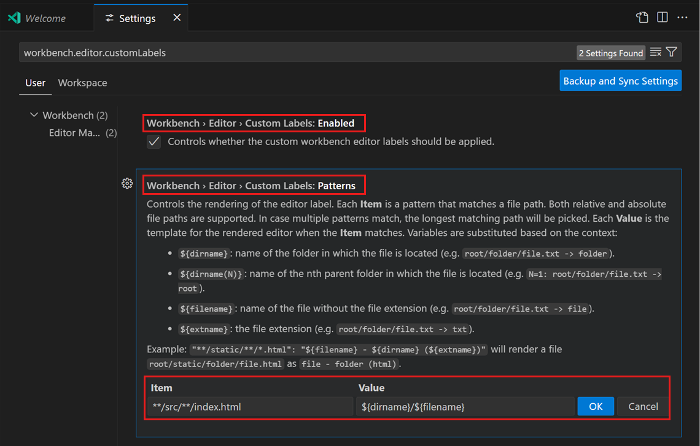

다음 예제는 `tests/editor.test.ts` 파일에 대해 `$\{extname\}
` 변수를 사용합니다:

- `$\{filename\}
` => editor
- `$\{extname\}
` => test.ts
- `$\{extname(0)\}
` => ts
- `$\{extname(1)\}
` => test
- `$\{extname(-1)\}
` => test
- `$\{extname(-2)\}
` => ts

:::note
사용자 정의 탭 레이블은 열린 편집기 화면와 [빠른 열기](/docs/getstarted/tips-and-tricks.md#quick-open) (`Ctrl+P`)에도 적용됩니다.
:::

## 그리드 편집기 레이아웃 {#grid-editor-layout}

기본적으로 편집기 그룹은 세로 열로 배치됩니다. 예를 들어, 편집기를 분할할 때 편집기가 옆에 열립니다. 세로 및 가로로 원하는 레이아웃으로 편집기 그룹을 배치할 수 있습니다:


유연한 레이아웃을 지원하기 위해 빈 편집기 그룹을 생성할 수 있습니다. 기본적으로 편집기 그룹의 마지막 편집기를 닫으면 그룹 자체도 닫히지만, 새 설정 `workbench.editor.closeEmptyGroups: false`를 사용하여 이 동작을 변경할 수 있습니다:

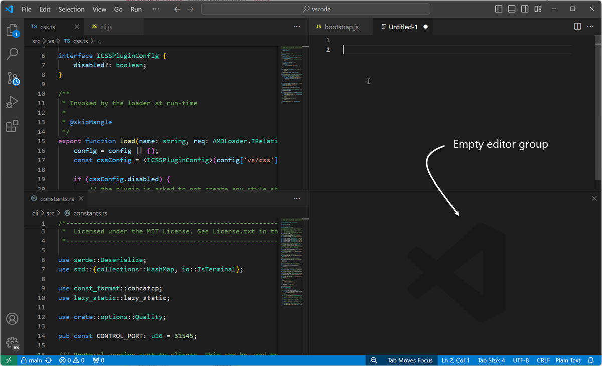

**View** > **Editor Layout** 메뉴에는 미리 정의된 편집기 레이아웃 세트가 있습니다:


기본적으로 옆에 열리는 편집기(예: 편집기 도구 모음의 **Split Editor** 작업 선택)는 활성 편집기의 오른쪽에 열립니다. 활성 편집기 아래에 편집기를 열려면 `workbench.editor.openSideBySideDirection`을 `down`으로 설정하세요.

키보드를 사용하여 편집기 레이아웃을 조정하는 많은 키보드 명령이 있습니다. 마우스를 사용하려면 드래그 앤 드롭을 사용하여 원하는 방향으로 편집기를 분할할 수 있습니다:

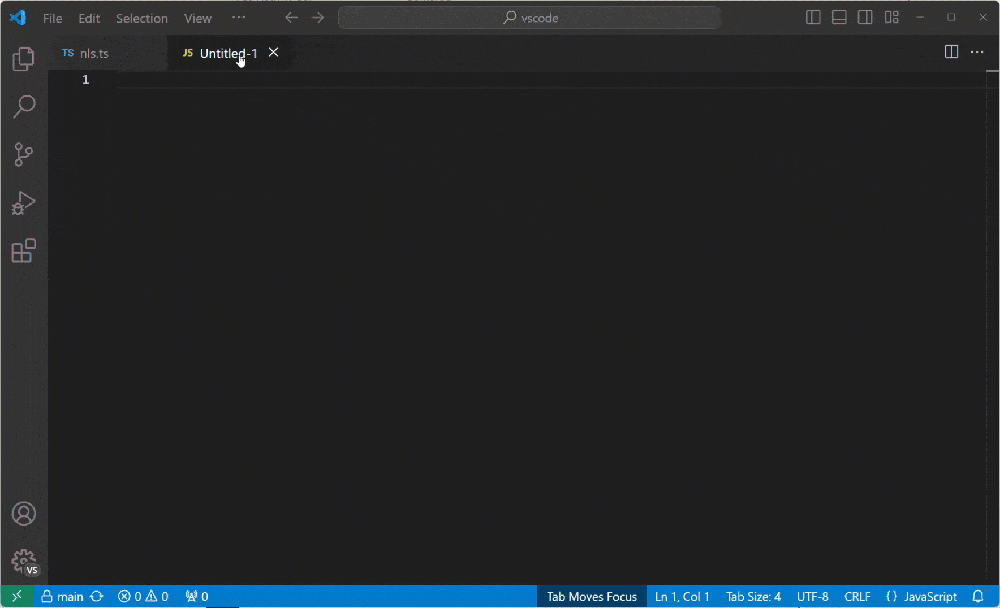

:::tip
`Alt` 키를 누른 상태에서 편집기 분할 작업을 선택하면 다른 방향으로 분할할 수 있습니다. 이는 오른쪽 또는 아래로 빠르게 분할하는 방법입니다.
:::


### 키보드 단축키 {#keyboard-shortcuts}

편집기 및 편집기 그룹 간에 빠르게 탐색할 수 있는 몇 가지 유용한 키보드 단축키입니다.

- `Ctrl+PageDown` - 오른쪽 편집기로 이동.
- `Ctrl+PageUp` - 왼쪽 편집기로 이동.
- `Ctrl+Tab` - 편집기 그룹의 가장 최근에 사용된 목록에서 이전 편집기 열기.
- `Ctrl+1` - 가장 왼쪽 편집기 그룹으로 이동.
- `Ctrl+2` - 중앙 편집기 그룹으로 이동.
- `Ctrl+3` - 가장 오른쪽 편집기 그룹으로 이동.
- `Ctrl+F4` - 활성 편집기 닫기.
- `Ctrl+K W` - 편집기 그룹의 모든 편집기 닫기.
- `Ctrl+K Ctrl+W` - 모든 편집기 닫기.

> 기본 키보드 단축키를 수정하려면 [키 바인딩](/docs/getstarted/keybindings.md)에서 자세한 내용을 확인하세요.

## 탭 없이 작업하기 {#working-without-tabs}

탭(탭 헤더)을 사용하지 않으려면 `workbench.editor.showTabs`을 `single` 또는 `none`으로 설정하여 탭을 완전히 비활성화할 수 있습니다.

### 미리보기 모드 비활성화 {#disable-preview-mode}

탭 없이 **Open Editors** 섹션은 파일 탐색을 빠르게 수행할 수 있는 방법입니다. 그러나 [미리보기 편집기 모드](/docs/getstarted/userinterface.md#preview-mode)가 활성화된 경우, 파일이 열린 편집기 섹션에 추가되지 않습니다. `workbench.editor.enablePreview` 및 `workbench.editor.enablePreviewFromQuickOpen` 설정을 통해 이 기능을 비활성화할 수 있습니다.

### 키보드 단축키를 사용하여 편집기 기록 탐색 {#use-keyboard-shortcuts-to-navigate-the-editor-history}

`Ctrl+Tab`의 키 바인딩을 변경하여 활성 편집기 그룹과 관계없이 열린 편집기 목록을 표시할 수 있습니다.

[keybindings](/docs/getstarted/keybindings.md)을 편집하고 다음을 추가하세요:

```json
{ "key": "ctrl+tab", "command": "workbench.action.openPreviousEditorFromHistory" },
{ "key": "ctrl+tab", "command": "workbench.action.quickOpenNavigateNext", "when": "inQuickOpen" },
```

### 단일 편집기 대신 전체 그룹 닫기 {#close-an-entire-group-instead-of-a-single-editor}

VS Code가 하나의 편집기를 닫을 때 전체 그룹을 닫는 동작을 선호하는 경우, [keybindings](/docs/getstarted/keybindings.md)에 다음을 바인딩할 수 있습니다.

macOS:

```json
{ "key": "cmd+w", "command": "workbench.action.closeEditorsInGroup" }
```

Windows/Linux:

```json
{ "key": "ctrl+w", "command": "workbench.action.closeEditorsInGroup" }
```

## 창 관리 {#window-management}

VS Code에는 VS Code 창(인스턴스)을 열거나 세션 간에 복원하는 방법을 제어하는 다양한 옵션이 있습니다.

`window.openFoldersInNewWindow` 및 `window.openFilesInNewWindow` 설정을 사용하여 새 창을 열거나 마지막 활성 창을 재사용할지 구성할 수 있으며, 가능한 값은 `default`, `on` 및 `off`입니다.

`default`로 구성된 경우, VS Code는 열기 요청이 발생한 컨텍스트를 기반으로 새 창을 열거나 재사용할지 결정합니다. 이를 `on` 또는 `off`로 변경하여 항상 동일하게 동작하도록 설정할 수 있습니다. 예를 들어, **파일** 메뉴에서 파일이나 폴더를 선택할 때 항상 새 창에서 열리도록 하려면 이를 `on`으로 설정하세요.

:::note
`-new-window` 또는 `-reuse-window` 명령줄 옵션을 사용할 때 이 설정이 무시되는 경우가 있습니다.
:::

`window.restoreWindows` 설정은 이전 세션의 열린 창을 복원하는 방법을 VS Code에 알립니다. 기본적으로 VS Code는 이전 세션 동안 작업한 모든 창을 복원합니다(설정: `all`). 이 설정을 `none`으로 변경하여 창을 복원하지 않고 항상 빈 VS Code 인스턴스로 시작할 수 있습니다. 이를 `one`으로 변경하여 마지막으로 작업한 창을 다시 열거나, `folders`로 변경하여 폴더가 열린 창만 복원할 수 있습니다.

## 다음 단계 {#next-steps}

이제 VS Code의 전체 레이아웃을 알았으므로 다음 문서를 참조하여 편집기를 사용자 정의하여 작업하는 방법을 알아보세요:

- [테마 변경](/docs/getstarted/themes.md) - 선호하는 색상 및/또는 파일 아이콘 테마 설정.
- [사용자 정의 레이아웃 사용](/docs/editor/custom-layout.md) - VS Code의 작업 영역 및 편집기 레이아웃 사용자 정의에 대해 자세히 알아보세요.

## 자주 묻는 질문 {#common-questions}

### 들여쓰기 가이드의 색상을 변경할 수 있나요? {#how-can-i-change-the-color-of-the-indent-guides}

들여쓰기 가이드 색상은 대부분의 VS Code 유저 인터페이스 요소와 마찬가지로 사용자 정의할 수 있습니다. 활성 색상 테마에 대한 들여쓰기 가이드 색상을 [사용자 정의](/api/references/theme-color.md)하려면 `workbench.colorCustomizations` 설정을 사용하고 `editorIndentGuide.background` 값을 수정하세요.

예를 들어, 들여쓰기 가이드를 밝은 파란색으로 만들려면 `settings.json`에 다음을 추가하세요:

```json
"workbench.colorCustomizations": {
    "editorIndentGuide.background": "#0000ff"
}
```

### 탐색기 화면에서 열린 편집기 섹션을 숨길 수 있나요? {#can-i-hide-the-open-editors-section-in-the-explorer-view}

네, 탐색기 화면의 보기 메뉴를 사용하여 열린 편집기 섹션을 표시하거나 숨길 수 있습니다.

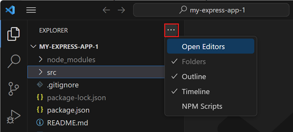
