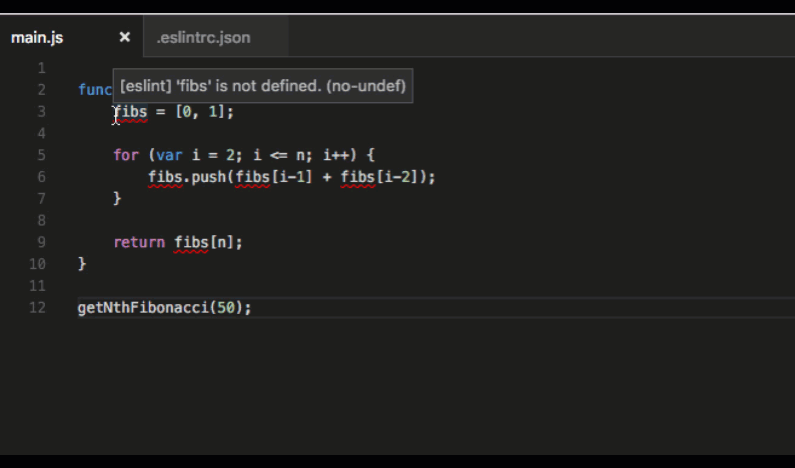
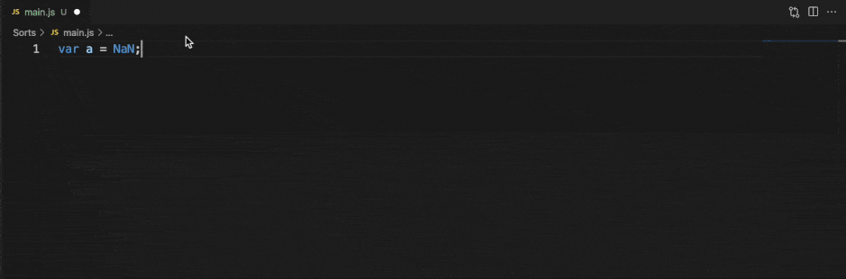

# Visual Studio Code의 JavaScript 확장 기능 {#javascript-extensions-for-vs-code}

Visual Studio Code는 JavaScript 및 Node.js 개발을 위한 많은 기능을 지원합니다. 다운로드한 제품에 포함된 기능은 디버깅, IntelliSense, 코드 탐색 등 핵심 기능입니다.

이 핵심 기능 외에도, JavaScript 개발을 위해 VS Code에 기능을 추가하는 많은 고품질 확장 기능을 설치할 수 있습니다.

:::tip
확장 기능을 설치하고 관리하는 방법에 대해서는 [확장 기능 문서](/docs/editor/extension-marketplace.md)를 참조하세요.
:::

## 확장 기능 찾기 {#finding-extensions}

확장 보기 검색 창에 `JavaScript`를 입력하여 JavaScript 확장 기능을 찾을 수 있습니다. 또는 태그를 사용하여 JavaScript 확장 기능을 찾을 수 있습니다: "tag:javascript". VS Code 또는 [마켓플레이스](https://marketplace.visualstudio.com/vscode)에서 더 많은 확장 기능을 검색하세요.

또한 `Node.js` 확장 기능을 검색할 수 있습니다.

:::tip
위에 표시된 확장 기능은 동적으로 쿼리됩니다. 위의 확장 타일을 클릭하여 설명과 리뷰를 읽고 어떤 확장 기능이 가장 적합한지 결정하세요. 자세한 내용은 [마켓플레이스](https://marketplace.visualstudio.com/vscode)를 참조하세요.
:::

## 추천 확장 기능 {#recommended-extensions}

시작하는 경우, 다음 확장 기능을 사용해 보시길 권장합니다.

### ESLint {#eslint}

마켓플레이스 - [ESLint](https://marketplace.visualstudio.com/items?itemName=dbaeumer.vscode-eslint)

배포자 - [Microsoft](https://marketplace.visualstudio.com/publishers/Microsoft)

[ESLint](https://eslint.org/)를 프로젝트에 쉽게 통합할 수 있습니다. ESLint가 선호하는 린터가 아닌 경우, [JSHint](https://marketplace.visualstudio.com/items?itemName=dbaeumer.jshint), [JSCS](https://marketplace.visualstudio.com/items?itemName=ms-vscode.jscs), [JS Standard](https://marketplace.visualstudio.com/items?itemName=chenxsan.vscode-standardjs) 등 다양한 다른 린터 확장 기능 중에서 선택할 수 있습니다.

VS Code [문서](/docs/languages/javascript.md#linters)에서 JavaScript 린터 설정에 대해 자세히 알아보세요.

### SonarLint {#sonarlint}

마켓플레이스 - [SonarLint](https://marketplace.visualstudio.com/items?itemName=SonarSource.sonarlint-vscode)

배포자 - [SonarSource](https://marketplace.visualstudio.com/publishers/SonarSource)

SonarLint는 코딩 중에 버그와 보안 문제를 찾아 수정하는 데 도움을 줍니다. 이 확장 기능은 백그라운드에서 실행되며, 맞춤법 검사기처럼 코딩 문제를 강조 표시합니다. SonarLint는 문제의 원인과 해결 방법에 대한 관련 예제와 함께 컨텍스트 내에서 안내를 제공합니다. 이 확장 기능은 [200+ JS/TS 규칙](https://rules.sonarsource.com/javascript)을 지원하며, 여러 [빠른 수정](https://rules.sonarsource.com/javascript/quickfix)을 포함하여 코딩 문제를 자동으로 처리합니다.

VS Code 마켓플레이스에서 'SonarLint'를 검색하여 설치하세요. 별도의 설정이 필요하지 않습니다. 대부분의 사용자에게 적합한 기본 프로필로 시작하고, 필요에 따라 사용자 정의할 수 있습니다.

### JavaScript (ES6) 코드 스니펫 {#javascript-es6-code-snippets}

마켓플레이스 - [JavaScript (ES6) 코드 스니펫](https://marketplace.visualstudio.com/items?itemName=xabikos.JavaScriptSnippets)

배포자 - [charalampos karypidis](https://marketplace.visualstudio.com/search?term=publisher%3A%22charalampos%20karypidis%22&target=VSCode)

VS Code에는 많은 내장 코드 스니펫이 포함되어 있습니다. **JavaScript (ES6) 코드 스니펫** 확장 기능은 ES6 (ECMAScript 6) 구문에 대한 스니펫을 추가합니다. 이 확장 기능이 제공하는 스니펫의 작은 샘플입니다. 이 팩이 제공하는 수십 개의 스니펫을 보려면 확장 기능의 [README](https://marketplace.visualstudio.com/items?itemName=xabikos.JavaScriptSnippets)를 참조하세요.

VS Code [문서](/docs/languages/javascript.md#snippets)에서 JavaScript 스니펫에 대해 자세히 알아보세요. [Angular 1](https://marketplace.visualstudio.com/items?itemName=johnpapa.Angular1), [Angular 2](https://marketplace.visualstudio.com/items?itemName=johnpapa.Angular2), [Bootstrap 3](https://marketplace.visualstudio.com/items?itemName=wcwhitehead.bootstrap-3-snippets), [ReactJs](https://marketplace.visualstudio.com/items?itemName=xabikos.ReactSnippets), [jQuery](https://marketplace.visualstudio.com/items?itemName=donjayamanne.jquerysnippets) 등 추가 스니펫 팩은 마켓플레이스의 [스니펫 카테고리](https://marketplace.visualstudio.com/vscode/Snippets?sortBy=Installs)를 확인하세요.

### npm IntelliSense {#npm-intellisense}

마켓플레이스 - [npm IntelliSense](https://marketplace.visualstudio.com/items?itemName=christian-kohler.npm-intellisense)

배포자 - [Christian Kohler](https://marketplace.visualstudio.com/search?term=publisher%3A%22Christian%20Kohler%22&target=VSCode)

이 확장 기능은 `import` 또는 `require`를 사용할 때 npm 모듈에 대한 IntelliSense를 제공합니다.

