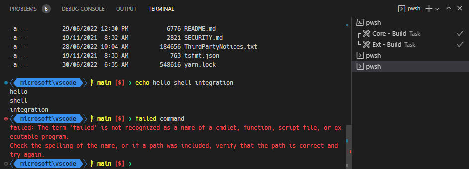
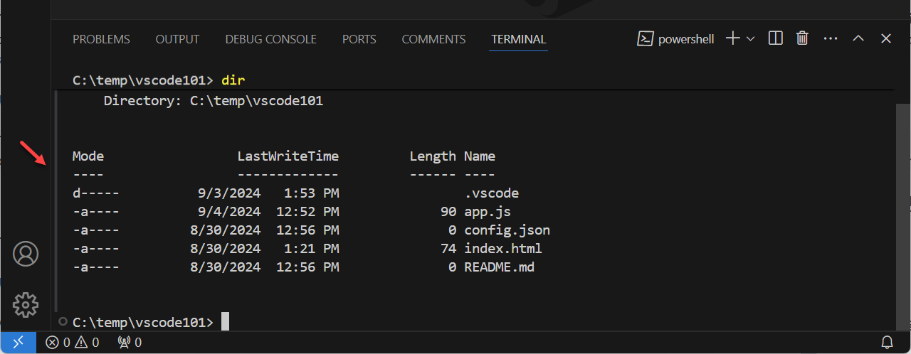
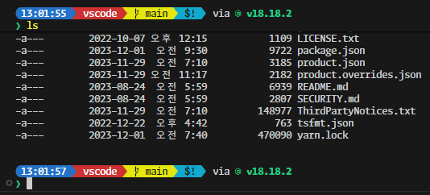
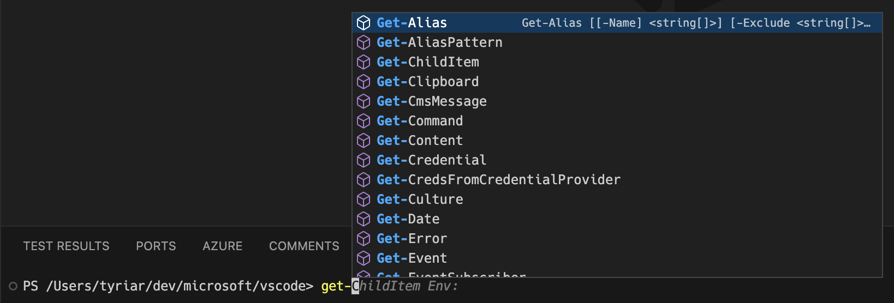
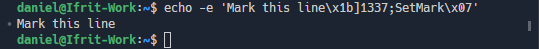

# 터미널 셸 통합 {#terminal-shell-integration}

Visual Studio Code는 일반적인 셸과 통합할 수 있는 기능을 가지고 있어 셸 내부에서 실제로 무슨 일이 일어나고 있는지 더 잘 이해할 수 있습니다. 이 추가 정보는 [작업 디렉토리 감지](#current-working-directory-detection) 및 명령 감지, [데코레이션](#command-decorations-and-the-overview-ruler), [탐색](#command-navigation)과 같은 유용한 기능을 가능하게 합니다.

지원되는 셸:

- Linux/macOS: bash, fish, pwsh, zsh
- Windows: pwsh

## 설치 {#installation}

### 자동 스크립트 삽입 {#automatic-script-injection}

기본적으로, 셸 통합 스크립트는 VS Code에서 실행된 지원되는 셸에서 자동으로 활성화되어야 합니다. 이는 셸 세션이 시작될 때 인수 및/또는 환경 변수를 주입하여 수행됩니다. 이 자동 주입은 `terminal.integrated.shellIntegration.enabled`를 `false`로 설정하여 비활성화할 수 있습니다.

이 표준적이고 쉬운 방법은 하위 셸, 일반 `ssh` 세션( [Remote - SSH 확장](/docs/remote/ssh.md)을 사용하지 않는 경우) 또는 일부 복잡한 셸 설정과 같은 고급 사용 사례에서는 작동하지 않을 수 있습니다. 이러한 경우 셸 통합을 활성화하는 권장 방법은 [수동 설치](#manual-installation)입니다.

:::note
자동 주입은 셸의 오래된 버전에서는 작동하지 않을 수 있습니다. 예를 들어, 오래된 버전의 fish는 주입이 작동하는 방식인 `$XDG_DATA_DIRS` 환경 변수를 지원하지 않습니다. 수동 설치를 통해 작동시킬 수 있습니다.
:::

### 수동 설치 {#manual-installation}

셸 통합을 수동으로 설치하려면 VS Code 셸 통합 스크립트가 셸 초기화 중에 실행되어야 합니다. 이를 수행하는 방법은 사용하는 셸과 OS에 따라 다릅니다. 수동 설치를 사용하는 경우 `terminal.integrated.shellIntegration.enabled`를 `false`로 설정하는 것이 권장되지만 필수는 아닙니다.

:::tip
[Insiders 빌드](https://code.visualstudio.com/insiders)를 사용하는 경우 아래의 `code`를 `code-insiders`로 대체하십시오.
:::

**bash**

다음 내용을 `~/.bashrc` 파일에 추가하십시오. bash에서 `code ~/.bashrc`를 실행하여 VS Code에서 파일을 엽니다.

```sh
[[ "$TERM_PROGRAM" == "vscode" ]] && . "$(code --locate-shell-integration-path bash)"
```

**fish**

다음 내용을 `config.fish`에 추가하십시오. fish에서 `code $__fish_config_dir/config.fish`를 실행하여 VS Code에서 파일을 엽니다.

```sh
string match -q "$TERM_PROGRAM" "vscode"
and . (code --locate-shell-integration-path fish)
```

**pwsh**

다음 내용을 [PowerShell 프로필](https://learn.microsoft.com/powershell/module/microsoft.powershell.core/about/about_profiles?view=powershell-7.2)에 추가하십시오. pwsh에서 `code $Profile`을 실행하여 VS Code에서 파일을 엽니다.

```powershell
if ($env:TERM_PROGRAM -eq "vscode") { . "$(code --locate-shell-integration-path pwsh)" }
```

**zsh**

다음 내용을 `~/.zshrc` 파일에 추가하십시오. bash에서 `code ~/.zshrc`를 실행하여 VS Code에서 파일을 엽니다.

```sh
[[ "$TERM_PROGRAM" == "vscode" ]] && . "$(code --locate-shell-integration-path zsh)"
```

**Git Bash**

다음 내용을 `~/.bashrc` 파일에 추가하십시오. Git Bash에서 `code ~/.bashrc`를 실행하여 VS Code에서 파일을 엽니다.

```sh
[[ "$TERM_PROGRAM" == "vscode" ]] && . "$(code --locate-shell-integration-path bash)"
```

#### 이식성 대 성능 {#portability-versus-performance}

위의 셸 통합 설치는 `code`가 `$PATH`에 있는 경우 모든 설치 유형과 호환되는 크로스 플랫폼입니다. 그러나 이 권장 접근 방식은 스크립트 경로를 가져오기 위해 Node.js를 시작하므로 셸 시작 시 약간의 지연이 발생합니다. 이 지연을 줄이기 위해 스크립트를 미리 해결하고 초기화 스크립트에 직접 추가하여 인라인하십시오.

```sh
# 먼저 실행 파일의 경로를 출력합니다:
code --locate-shell-integration-path bash

# 위의 결과를 소스 명령문에 추가합니다:
[[ "$TERM_PROGRAM" == "vscode" ]] && . "/path/to/shell/integration/script.sh"
```

## 명령 데코레이션 및 개요 눈금자 {#command-decorations-and-the-overview-ruler}

셸 통합이 가능하게 하는 것 중 하나는 터미널 내에서 실행된 명령의 종료 코드를 가져오는 기능입니다. 이 정보를 사용하여 명령이 성공했는지 실패했는지를 나타내는 데코레이션이 줄의 왼쪽에 추가됩니다. 이러한 데코레이션은 편집기에서와 마찬가지로 스크롤 막대의 비교적 새로운 개요 눈금자에도 나타납니다.



데코레이션은 명령을 다시 실행하는 등의 컨텍스트 작업을 제공하기 위해 상호 작용할 수 있습니다:


명령 및 개요 눈금자 데코레이션은 `terminal.integrated.shellIntegration.decorationsEnabled` 설정으로 구성할 수 있습니다.

## 명령 탐색 {#command-navigation}

셸 통합에 의해 감지된 명령은 명령 탐색 기능(`Ctrl/Cmd+Up`, `Ctrl/Cmd+Down`)에 피드되어 더 신뢰할 수 있는 명령 위치를 제공합니다. 이 기능을 사용하면 명령 간 빠른 탐색과 출력 선택이 가능합니다. 현재 위치에서 명령까지 선택하려면 `Shift`를 누른 상태에서 `Shift+Ctrl/Cmd+Up` 및 `Shift+Ctrl/Cmd+Down`을 누를 수 있습니다.

## 명령 가이드 {#command-guide}

명령 가이드는 명령과 그 출력을 마우스로 가리킬 때 나타나는 막대입니다. 이는 명령을 더 빨리 식별하는 데 도움이 되며 셸 통합이 제대로 작동하는지 확인하는 방법이기도 합니다.



명령 가이드의 색상은 색상 테마를 사용하여 사용자 정의할 수 있습니다. 명령 가이드를 토글하려면 `terminal.integrated.shellIntegration.showCommandGuide` 설정을 구성하십시오.

## 고정 스크롤 {#sticky-scroll}

고정 스크롤 기능은 터미널 상단에 부분적으로 표시되는 명령을 "고정"하여 해당 출력이 어떤 명령에 속하는지 훨씬 쉽게 볼 수 있게 합니다. 고정 스크롤 구성 요소를 클릭하면 터미널 버퍼에서 명령의 위치로 스크롤됩니다.



이는 `terminal.integrated.stickyScroll.enabled` 설정으로 활성화할 수 있습니다.

## 빠른 수정 {#quick-fixes}

VS Code는 명령의 출력을 스캔하고 사용자가 다음에 수행할 가능성이 높은 작업을 제안하는 빠른 수정 기능을 제공합니다.


다음은 일부 내장된 빠른 수정 사항입니다:

- 포트가 이미 수신 중인 경우, 프로세스를 종료하고 이전 명령을 다시 실행하도록 제안합니다.
- `git push`가 업스트림이 설정되지 않아 실패한 경우, 업스트림을 설정하여 푸시하도록 제안합니다.
- `git` 하위 명령이 유사한 명령 오류로 실패한 경우, 유사한 명령을 사용하도록 제안합니다.
- `git push`가 GitHub PR을 생성하라는 제안을 결과로 반환하는 경우, 링크를 열도록 제안합니다.
- `General` 또는 `cmd-not-found` PowerShell 피드백 제공자가 트리거된 경우, 각 제안을 제안합니다.

빠른 수정 기능은 빠른 수정이 가능할 때 추가 피드백을 제공하기 위해 [접근성 신호](/docs/editor/accessibility.md#accessibility-signals)를 지원합니다.

## 최근 명령 실행 {#run-recent-command}

**Terminal: Run Recent Command** 명령은 다양한 소스의 기록을 빠른 선택으로 제공하여 셸의 역방향 검색(`Ctrl+R`)과 유사한 기능을 제공합니다. 소스는 현재 세션의 기록, 이 셸 유형의 이전 세션 기록 및 공통 셸 기록 파일입니다.


명령의 다른 기능:

- 기본적으로 검색 모드는 "연속 검색"으로, 검색어가 정확히 일치해야 합니다. 검색 입력의 오른쪽 버튼을 사용하여 퍼지 검색으로 전환할 수 있습니다.
- 현재 세션 섹션에서는 빠른 선택의 오른쪽에 있는 클립보드 아이콘을 클릭하여 명령 출력을 편집기에서 열 수 있습니다.
- 빠른 선택의 오른쪽에 있는 고정 작업을 사용하여 명령을 목록 상단에 고정할 수 있습니다.
- `Alt`를 누르고 있으면 명령을 실행하지 않고 텍스트를 터미널에 작성할 수 있습니다.
- 이전 세션 섹션에 저장된 기록의 양은 `terminal.integrated.shellIntegration.history` 설정에 의해 결정됩니다.

이 명령의 기본 키 바인딩은 `Ctrl+Alt+R`입니다. 그러나 접근성 모드가 켜져 있을 때는 이 키가 반대로 작동합니다. `Ctrl+R`은 최근 명령을 실행하고 `Ctrl+Alt+R`은 Ctrl+R을 셸에 보냅니다.

접근성 모드가 꺼져 있을 때 키 바인딩을 전환하려면 다음 키 바인딩을 사용하십시오:

```jsonc
{
    "key": "ctrl+r",
    "command": "workbench.action.terminal.runRecentCommand",
    "when": "terminalFocus"
},
{
  "key": "ctrl+alt+r",
  "command": "workbench.action.terminal.sendSequence",
  "args": { "text": "\u0012"/*^R*/ },
  "when": "terminalFocus"
}
```

## 최근 디렉토리로 이동 {#go-to-recent-directory}

최근 명령 실행 기능과 유사하게, **Terminal: Go to Recent Directory** 명령은 방문한 디렉토리를 추적하고 이를 빠르게 필터링하고 탐색(`cd`)할 수 있습니다. `Alt`를 누르고 있으면 명령을 실행하지 않고 텍스트를 터미널에 작성할 수 있습니다.

이 명령의 기본 키 바인딩은 `Ctrl+G`이며, 편집기의 **Go to Line/Column** 명령과 유사하게 작동합니다. Ctrl+G는 `Ctrl+Alt+G`로 셸에 보낼 수 있습니다.

## 현재 작업 디렉토리 감지 {#current-working-directory-detection}

셸 통합은 VS Code에 셸의 현재 작업 디렉토리가 무엇인지 알려줍니다. 이 정보는 Windows에서 프롬프트를 정규식으로 감지하려고 하지 않는 한 얻을 수 없으며, macOS 및 Linux에서는 성능에 좋지 않은 폴링이 필요합니다.

이 기능이 가능하게 하는 가장 큰 기능 중 하나는 터미널에서 링크를 더 잘 해결하는 것입니다. 예를 들어 `package.json` 링크를 활성화하면 셸 통합이 비활성화된 경우 작업 공간에 여러 `package.json` 파일이 있는 경우 검색 빠른 선택이 `package.json`을 필터로 열립니다. 그러나 셸 통합이 활성화된 경우 현재 위치를 알고 있기 때문에 현재 폴더에서 직접 `package.json` 파일을 엽니다. 이를 통해 예를 들어 `ls`의 출력이 올바른 파일을 신뢰할 수 있게 열 수 있습니다.

현재 작업 디렉토리는 터미널 탭, 최근 명령 실행 빠른 선택 및 `"terminal.integrated.splitCwd": "inherited"` 기능에 디렉토리를 표시하는 데에도 사용됩니다.

## 확장된 PowerShell 키 바인딩 {#extended-powershell-keybindings}

Windows의 콘솔 API는 Linux/macOS 터미널보다 더 많은 키 바인딩을 허용합니다. VS Code의 터미널은 후자를 에뮬레이트하므로 `Ctrl+Space`와 같은 VT 인코딩이 부족하여 표준 수단을 사용하여 불가능한 일부 PowerShell 키 바인딩이 있습니다. 셸 통합을 통해 VS Code는 PowerShell에서 특수 시퀀스를 보내는 사용자 지정 키 바인딩을 연결하고 셸 통합 스크립트에서 처리하여 적절한 키 핸들러로 전달할 수 있습니다.

셸 통합이 활성화된 경우 다음 키 바인딩이 PowerShell에서 작동해야 합니다:

- `Ctrl+Space`: Windows에서만 기본적으로 `MenuComplete`
- `Alt+Space`: 모든 플랫폼에서 기본적으로 `SetMark`
- `Shift+Enter`: 모든 플랫폼에서 기본적으로 `AddLine`
- `Shift+End`: 모든 플랫폼에서 기본적으로 `SelectLine`
- `Shift+Home`: 모든 플랫폼에서 기본적으로 `SelectBackwardsLine`

## 실험적 PowerShell IntelliSense {#experimental-intellisense-for-powershell}

실험적 PowerShell IntelliSense는 PowerShell에서 입력할 때 편집기 경험과 유사하게 완성 목록을 표시합니다. 내부적으로 이 기능은 PowerShell 세션의 네이티브 완성 API에 의해 구동되므로 변수와 같은 컨텍스트 인식 완성이 가능합니다.



실험적 PowerShell IntelliSense는 `terminal.integrated.suggest.enabled` 설정으로 활성화할 수 있습니다.

```json
"terminal.integrated.suggest.enabled": true
```

:::note
이 기능은 현재 Windows 및 macOS에서만 사용할 수 있습니다.
:::

### Git 및 VS Code 완성 {#git-and-vs-code-completions}

실험적 IntelliSense가 활성화되면 `git`, `code`, `code-insiders` CLI의 완성이 기본적으로 켜집니다. PowerShell 프로필에 이미 완성이 있는 경우 `terminal.integrated.suggest.builtinCompletions` 설정을 사용하여 이를 끌 수 있습니다.

## 향상된 접근성 {#enhanced-accessibility}

셸 통합이 VS Code에 제공하는 정보는 [터미널의 접근성](/docs/editor/accessibility.md#terminal-accessibility)을 향상시키는 데 사용됩니다. 향상된 예는 다음과 같습니다:

- 접근 가능한 버퍼에서 감지된 명령을 통해 탐색 (`Alt+F2`)
- 명령이 실패할 때 [오디오 신호](/docs/editor/accessibility.md#accessibility-signals)가 재생됩니다.
- 화살표 및 백스페이스 키를 사용할 때 더 올바르게 동작하도록 기본 텍스트 상자 동기화.

## 지원되는 이스케이프 시퀀스 {#supported-escape-sequences}

VS Code는 여러 사용자 지정 이스케이프 시퀀스를 지원합니다:

### VS Code 사용자 지정 시퀀스 'OSC 633 ; ... ST' {#vs-code-custom-sequences-osc-633}

VS Code에는 VS Code의 터미널에서 셸 통합 기능을 활성화하기 위해 설계된 사용자 지정 이스케이프 시퀀스 세트가 있습니다. 이러한 시퀀스는 내장 스크립트에서 사용되지만 시퀀스를 터미널로 보낼 수 있는 모든 응용 프로그램에서도 사용할 수 있습니다. 예를 들어 [Julia 확장](https://marketplace.visualstudio.com/items?itemName=julialang.language-julia)은 Julia REPL에서 셸 통합을 지원하기 위해 이를 사용합니다.

이 시퀀스는 다른 터미널에서 무시되어야 하지만, 다른 터미널이 시퀀스를 더 널리 채택하지 않는 한, 이를 작성하기 전에 `$TERM_PROGRAM`이 `vscode`인지 확인하는 것이 좋습니다.

- `OSC 633 ; A ST` - 프롬프트 시작 표시.
- `OSC 633 ; B ST` - 프롬프트 종료 표시.
- `OSC 633 ; C ST` - 사전 실행 표시.
- `OSC 633 ; D [; <exitcode>] ST` - 선택적 종료 코드와 함께 실행 완료 표시.
- `OSC 633 ; E ; <commandline> [; <nonce] ST` - 선택적 nonce와 함께 명령 줄을 명시적으로 설정합니다.

  E 시퀀스를 사용하면 터미널이 셸에 의해 해석된 정확한 명령 줄을 신뢰할 수 있게 가져올 수 있습니다. 이 시퀀스가 지정되지 않은 경우, 터미널은 명령을 가져오기 위해 A, B 및 C 시퀀스를 사용하거나 감지가 신뢰할 수 없는 경우 감지를 비활성화할 수 있습니다.

  선택적 nonce는 명령 스푸핑을 방지하기 위해 시퀀스가 셸 통합 스크립트에서 온 것인지 확인하는 데 사용할 수 있습니다. nonce가 성공적으로 확인되면 명령을 사용하기 전에 일부 보호가 제거되어 사용자 경험이 향상됩니다.

  명령 줄은 `\xAB` 형식을 사용하여 ASCII 문자를 이스케이프할 수 있으며, 여기서 AB는 문자 코드의 16진수 표현(대소문자 구분 없음)입니다. `\` 문자는 `\\`를 사용하여 이스케이프할 수 있습니다. 세미콜론(`0x3b`) 및 0x20 이하의 문자를 이스케이프하는 것이 필수이며, 특히 새 줄 및 세미콜론에 중요합니다.

  몇 가지 예:

  ```text
  "\"  -> "\\"
  "\n" -> "\x0a"
  ";"  -> "\x3b"
  ```

- `OSC 633 ; P ; <Property>=<Value> ST` - 터미널에 속성을 설정합니다. 알려진 속성만 처리됩니다.

  알려진 속성:

  - `Cwd` - 터미널에 현재 작업 디렉토리를 보고합니다.
  - `IsWindows` - 터미널이 winpty 또는 conpty와 같은 Windows 백엔드를 사용하는지 여부를 나타냅니다. 이는 셸 통합 시퀀스의 위치가 정확하지 않을 수 있으므로 추가 휴리스틱을 활성화하는 데 사용할 수 있습니다. 유효한 값은 `True` 및 `False`입니다.

### Final Term 셸 통합 {#final-term-shell-integration}

VS Code는 Final Term의 셸 통합 시퀀스를 지원하여 VS Code에서 비-VS Code 셸 통합 스크립트가 작동할 수 있습니다. 이는 `OSC 633`만큼 많은 기능을 지원하지 않기 때문에 다소 저하된 경험을 제공합니다. 지원되는 특정 시퀀스는 다음과 같습니다:

- `OSC 133 ; A ST` - 프롬프트 시작 표시.
- `OSC 133 ; B ST` - 프롬프트 종료 표시.
- `OSC 133 ; C ST` - 사전 실행 표시.
- `OSC 133 ; D [; <exitcode>] ST` - 선택적 종료 코드와 함께 실행 완료 표시.

### iTerm2 셸 통합 {#iterm2-shell-integration}

iTerm2가 선도한 다음 시퀀스가 지원됩니다:

- `OSC 1337 ; CurrentDir=<Cwd> S` - 터미널의 현재 작업 디렉토리를 설정합니다. `OSC 633 ; P ; Cwd=<Cwd> ST`와 유사합니다.
- `OSC 1337 ; SetMark ST` - 시퀀스가 트리거된 줄의 왼쪽에 마크를 추가하고 스크롤 막대에 주석을 추가합니다:

  

  이러한 마크는 명령 탐색과 통합되어 `Ctrl+Up` 및 `Ctrl+Down`을 통해 쉽게 탐색할 수 있습니다.

## 자주 묻는 질문 {#common-questions}

### 자동 주입이 작동하지 않는 경우는 언제인가요? {#when-does-automatic-injection-not-work}

자동 주입이 작동하지 않는 여러 경우가 있습니다. 다음은 일반적인 경우입니다:

- `$PROMPT_COMMAND`가 지원되지 않는 형식인 경우, 이를 단일 함수로 가리키도록 변경하는 것이 이를 해결하는 쉬운 방법입니다. 예를 들어:

  ```sh
  prompt() {
    printf "\033]0;%s@%s:%s\007" "${USER}" "${HOSTNAME%%.*}" "${PWD/#$HOME/\~}"
  }
  PROMPT_COMMAND=prompt
  ```

- 일부 셸 플러그인은 초기화 시 `$VSCODE_SHELL_INTEGRATION`을 해제하여 VS Code의 셸 통합을 명시적으로 비활성화할 수 있습니다.

### 기능이 비활성화된 경우에도 명령 데코레이션이 표시되는 이유는 무엇인가요? {#why-are-command-decorations-showing-when-the-feature-is-disabled}

이 원인은 시스템에 [VS Code가 이해하는](#final-term-shell-integration) 다른 터미널용 셸 통합이 설치되어 있기 때문일 가능성이 큽니다. 데코레이션을 원하지 않는 경우 다음 설정을 사용하여 숨길 수 있습니다:

```json
"terminal.integrated.shellIntegration.decorationsEnabled": never
```

또는 셸 rc/시작 스크립트에서 셸 통합 스크립트를 제거할 수 있지만, [명령 탐색](#command-navigation)과 같은 명령 인식 기능을 사용할 수 없게 됩니다.

### Windows에서 명령 데코레이션이 이동하는 이유는 무엇인가요? {#why-does-the-command-decoration-jump-around-on-windows}

Windows는 ConPTY라는 에뮬레이트된 가상 터미널(pty) 백엔드를 사용합니다. 이는 Windows 콘솔 API와의 호환성을 유지해야 하기 때문에 일반적인 pty와는 다르게 작동합니다. 이의 영향 중 하나는 셸 통합 시퀀스가 터미널 버퍼에서 명령을 식별하는 위치가 잘못될 수 있다는 것입니다. 명령이 이동하는 것은 일반적으로 명령이 실행된 후 발생하며, VS Code의 휴리스틱이 명령 데코레이션의 위치를 개선하기 위해 작동한 결과입니다.
